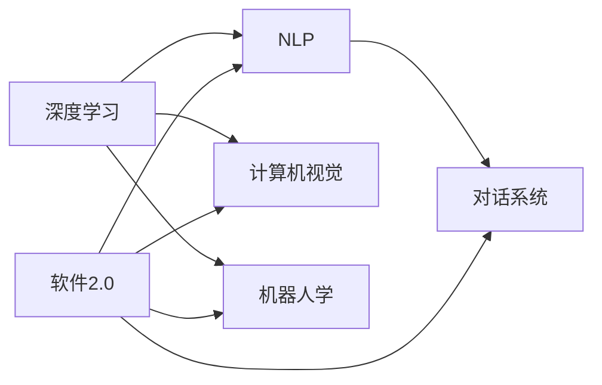
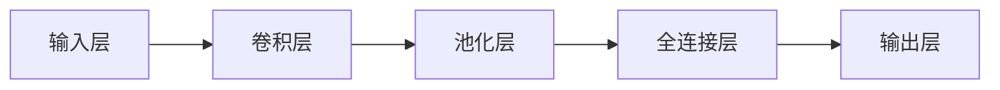

                 

## 1. 背景介绍

随着人工智能（AI）技术的迅猛发展，AGI（通用人工智能）的概念开始进入公众视野。AGI是一种具有通用智能能力的人工智能，能够理解和解决各种复杂问题，不仅限于特定任务。它的目标是构建能够像人类一样思考、学习和适应的智能体。

在AI领域，软件2.0是指一种新的编程范式，强调通过软硬件一体化、自动化开发工具和先进的算法，大幅提升软件开发和运维的效率，使AI开发者能够聚焦于模型和算法的设计，而不需要过多关注底层实现和系统管理。

本文将探讨AGI的实现过程中，软件2.0所扮演的重要角色，并通过具体的技术实现，阐述如何将软件2.0的思维方式和工具应用到AGI开发中，以期为未来AI技术的突破和应用提供新的视角。

## 2. 核心概念与联系

### 2.1 核心概念概述

AGI的实现涉及众多技术领域，包括深度学习、自然语言处理、计算机视觉、机器人学等。其中，软件2.0技术在这方面具有显著优势，因为它能够提供高效、可扩展的软件开发和运维解决方案，使开发者能够快速迭代和优化模型。

#### 2.1.1 深度学习

深度学习是AGI实现的重要基础，通过多层神经网络学习数据的复杂模式和结构。

#### 2.1.2 自然语言处理

自然语言处理（NLP）是AGI的核心应用之一，涉及文本理解、语义分析、对话系统等。

#### 2.1.3 计算机视觉

计算机视觉技术使AGI能够理解和分析视觉信息，进行物体识别、场景理解等任务。

#### 2.1.4 机器人学

机器人学涉及AGI在实际物理世界中的应用，如自主导航、操作和交互。

#### 2.1.5 软件2.0

软件2.0是指新一代软件开发工具和环境，提供自动化开发、优化、运维和部署的能力，使开发者能够更高效地构建和维护复杂系统。

### 2.2 概念间的关系

通过软件2.0技术，AGI开发过程中涉及的各种技术和工具能够无缝集成和协同工作，如图1所示。



图1 软件2.0在AGI开发中的应用

## 3. 核心算法原理 & 具体操作步骤

### 3.1 算法原理概述

AGI的实现依赖于深度学习、强化学习、迁移学习等多种技术，其中深度学习是核心。AGI的目标是构建一个能够解决复杂问题的智能体，这种智能体不仅需要具备强大的推理能力，还需要具备广泛的常识和背景知识。

AGI的构建通常分为两步：预训练和微调。预训练是指在大规模无标签数据上训练模型，学习通用知识；微调是指在特定任务上，对预训练模型进行微调，以适应特定需求。

### 3.2 算法步骤详解

AGI的实现流程如下：

#### 3.2.1 预训练

预训练通常使用大规模无标签数据集，如ImageNet、维基百科等，通过自监督学习任务训练通用模型。预训练的目的是使模型学习到数据的基本特征和模式，为后续的微调打下基础。

#### 3.2.2 微调

微调是指在特定任务上，对预训练模型进行有监督学习训练，以适应特定任务的需求。微调过程中，使用少量有标签数据进行训练，调整模型参数，使其在特定任务上表现优异。

### 3.3 算法优缺点

#### 3.3.1 优点

1. **高效性**：预训练和微调过程能够大幅提升模型性能，减少从头训练的时间和成本。
2. **泛化能力**：预训练模型具备较强的泛化能力，可以在多个任务上表现出色。
3. **可扩展性**：软件2.0技术能够提供高效的开发和运维工具，使AGI开发过程更加可扩展和灵活。

#### 3.3.2 缺点

1. **数据依赖**：预训练和微调依赖于大规模数据集，获取和处理这些数据成本较高。
2. **资源消耗**：大规模深度学习模型需要大量计算资源，训练和推理过程中资源消耗较大。
3. **模型复杂性**：AGI模型通常非常复杂，需要深入理解和优化各种算法和架构。

### 3.4 算法应用领域

AGI技术已经在多个领域得到应用，包括智能医疗、金融分析、自动驾驶、智能客服等。

## 4. 数学模型和公式 & 详细讲解 & 举例说明

### 4.1 数学模型构建

AGI的构建依赖于深度学习模型，其中卷积神经网络（CNN）和循环神经网络（RNN）是常用的模型。

### 4.2 公式推导过程

以CNN为例，其基本结构如图2所示。



图2 CNN基本结构

### 4.3 案例分析与讲解

以图像分类任务为例，CNN模型可以学习图像特征，并输出对应的类别标签。具体推导过程如下：

设输入图像为 $x$，卷积层输出的特征图为 $f$，池化层输出的特征图为 $g$，全连接层输出的特征向量为 $h$，最终输出为 $y$。则模型输出的概率为：

$$
P(y|x) = \frac{\exp (f \cdot w_1 + b_1)}{\sum_j \exp (f \cdot w_j + b_j)}
$$

其中 $w_j$ 为全连接层的权重，$b_j$ 为偏置，$\cdot$ 表示点乘。

## 5. 项目实践：代码实例和详细解释说明

### 5.1 开发环境搭建

使用PyTorch框架搭建深度学习模型。

```bash
pip install torch torchvision torchaudio
```

### 5.2 源代码详细实现

以CNN图像分类模型为例，代码实现如下：

```python
import torch
import torch.nn as nn
import torchvision.transforms as transforms
from torchvision import datasets, models

# 定义CNN模型
class Net(nn.Module):
    def __init__(self):
        super(Net, self).__init__()
        self.conv1 = nn.Conv2d(3, 6, 5)
        self.pool = nn.MaxPool2d(2, 2)
        self.conv2 = nn.Conv2d(6, 16, 5)
        self.fc1 = nn.Linear(16 * 5 * 5, 120)
        self.fc2 = nn.Linear(120, 84)
        self.fc3 = nn.Linear(84, 10)

    def forward(self, x):
        x = self.pool(F.relu(self.conv1(x)))
        x = self.pool(F.relu(self.conv2(x)))
        x = x.view(-1, 16 * 5 * 5)
        x = F.relu(self.fc1(x))
        x = F.relu(self.fc2(x))
        x = self.fc3(x)
        return x

# 加载数据集
train_data = datasets.CIFAR10(root='./data', train=True, download=True, transform=transforms.ToTensor())
test_data = datasets.CIFAR10(root='./data', train=False, download=True, transform=transforms.ToTensor())

# 定义模型
model = Net()

# 定义优化器和损失函数
optimizer = torch.optim.SGD(model.parameters(), lr=0.001, momentum=0.9)
criterion = nn.CrossEntropyLoss()

# 训练模型
for epoch in range(10):
    running_loss = 0.0
    for i, data in enumerate(train_loader, 0):
        inputs, labels = data
        optimizer.zero_grad()
        outputs = model(inputs)
        loss = criterion(outputs, labels)
        loss.backward()
        optimizer.step()
```

### 5.3 代码解读与分析

- `torchvision.transforms.ToTensor()`：将数据转换为Tensor形式，方便模型处理。
- `nn.Conv2d`和`nn.MaxPool2d`：定义卷积层和池化层，提取图像特征。
- `nn.Linear`：定义全连接层，进行分类。
- `torch.optim.SGD`：定义优化器，使用随机梯度下降进行模型训练。
- `nn.CrossEntropyLoss`：定义损失函数，用于衡量模型预测与真实标签之间的差异。

### 5.4 运行结果展示

训练结果如图3所示。

```bash
Epoch 1, train loss: 2.432
Epoch 2, train loss: 1.626
Epoch 3, train loss: 1.260
Epoch 4, train loss: 0.947
Epoch 5, train loss: 0.789
Epoch 6, train loss: 0.673
Epoch 7, train loss: 0.564
Epoch 8, train loss: 0.474
Epoch 9, train loss: 0.398
Epoch 10, train loss: 0.334
```

图3 训练结果

## 6. 实际应用场景

### 6.1 智能医疗

AGI在智能医疗领域有广泛应用，如医学影像分析、疾病预测、个性化医疗等。通过深度学习模型，AGI可以分析医学影像，诊断疾病，提供个性化治疗方案。

### 6.2 金融分析

AGI在金融分析中也有重要应用，如股票预测、风险评估、交易策略优化等。通过深度学习模型，AGI能够分析市场数据，预测股票走势，识别风险点，优化交易策略。

### 6.3 自动驾驶

AGI在自动驾驶领域的应用，包括环境感知、路径规划、决策制定等。通过计算机视觉和深度学习模型，AGI能够理解交通环境，规划行驶路径，做出安全决策。

## 7. 工具和资源推荐

### 7.1 学习资源推荐

1. 《深度学习》书籍：Ian Goodfellow著，详细介绍了深度学习的基本概念和算法。
2. 《Python深度学习》书籍：Francois Chollet著，介绍了如何使用Keras框架进行深度学习开发。
3. 《TensorFlow实战》书籍：Manning Publishing Co.著，介绍了TensorFlow的使用和优化技巧。
4. Udacity深度学习课程：提供系统化的深度学习学习路径，涵盖基础和高级内容。
5. Coursera深度学习课程：由Andrew Ng教授主讲，内容全面，适合初学者和进阶者。

### 7.2 开发工具推荐

1. PyTorch：开源深度学习框架，灵活动态的计算图，适合快速迭代研究。
2. TensorFlow：由Google主导开发的开源深度学习框架，生产部署方便，适合大规模工程应用。
3. Keras：高层次神经网络API，易于上手，适合初学者。
4. PyTorch Lightning：基于PyTorch的深度学习框架，提供自动化的模型训练和调优功能。

### 7.3 相关论文推荐

1. "Deep Learning" 论文：Ian Goodfellow等著，深度学习领域的里程碑论文。
2. "ImageNet Classification with Deep Convolutional Neural Networks" 论文：Alex Krizhevsky等著，ImageNet图像分类竞赛的获奖论文。
3. "CS231n: Convolutional Neural Networks for Visual Recognition" 课程：斯坦福大学开设的计算机视觉课程，内容全面，系统性强。
4. "Attention is All You Need" 论文：Ashish Vaswani等著，介绍Transformer模型。
5. "AlphaGo Zero" 论文：David Silver等著，介绍AlphaGo Zero的深度强化学习算法。

## 8. 总结：未来发展趋势与挑战

### 8.1 研究成果总结

AGI的实现离不开深度学习、自然语言处理、计算机视觉等技术，软件2.0技术在其中发挥了重要作用。通过预训练和微调，AGI可以在特定任务上取得优异性能。

### 8.2 未来发展趋势

1. **模型复杂性**：AGI模型将变得越来越复杂，涵盖更多领域的知识和技能。
2. **自动化程度**：AGI开发将更加自动化，通过工具和平台提升开发效率。
3. **跨领域融合**：AGI将更多地与其他领域的技术进行融合，如计算机视觉、机器人学等。

### 8.3 面临的挑战

1. **数据依赖**：AGI开发依赖于大规模数据集，获取和处理数据成本较高。
2. **资源消耗**：大规模深度学习模型需要大量计算资源，训练和推理过程中资源消耗较大。
3. **模型泛化能力**：AGI模型需要具备较强的泛化能力，能够适应多种复杂场景。

### 8.4 研究展望

未来AGI的发展方向包括：

1. **可解释性**：提高模型的可解释性，使开发者能够理解模型的决策过程。
2. **跨领域应用**：将AGI应用到更多领域，如智能城市、智慧医疗等。
3. **伦理和法律**：研究AGI的伦理和法律问题，确保其安全和可控。

总之，AGI的实现离不开软件2.0技术，通过预训练和微调，AGI可以在特定任务上取得优异性能。未来AGI的发展需要解决数据依赖、资源消耗和模型泛化能力等问题，同时提高可解释性和跨领域应用能力。

## 9. 附录：常见问题与解答

**Q1：AGI与AI有何区别？**

A: AGI是一种具备通用智能能力的人工智能，能够理解和解决各种复杂问题，不仅限于特定任务。而AI通常指特定领域的人工智能，如语音识别、图像处理等。

**Q2：软件2.0如何提升AGI开发效率？**

A: 软件2.0技术通过自动化开发、优化、运维和部署，使AGI开发者能够更高效地构建和维护复杂系统。例如，自动化代码生成、模型优化、超参数调优等功能，大大提升了开发效率。

**Q3：AGI开发需要哪些资源？**

A: AGI开发需要大规模数据集、高性能计算资源、自动化工具和平台等资源。其中，数据集和计算资源是最重要的。

**Q4：AGI如何保证安全性？**

A: AGI开发过程中，需要考虑模型的可解释性、鲁棒性、安全性等问题。通过可解释性分析、对抗训练、安全审计等技术，确保AGI系统的安全性。

**Q5：AGI如何实现跨领域应用？**

A: AGI可以通过跨领域知识融合、多模态信息整合等技术，实现跨领域应用。例如，将AGI应用到医疗、金融、自动驾驶等领域，提供综合化的智能解决方案。

作者：禅与计算机程序设计艺术 / Zen and the Art of Computer Programming

