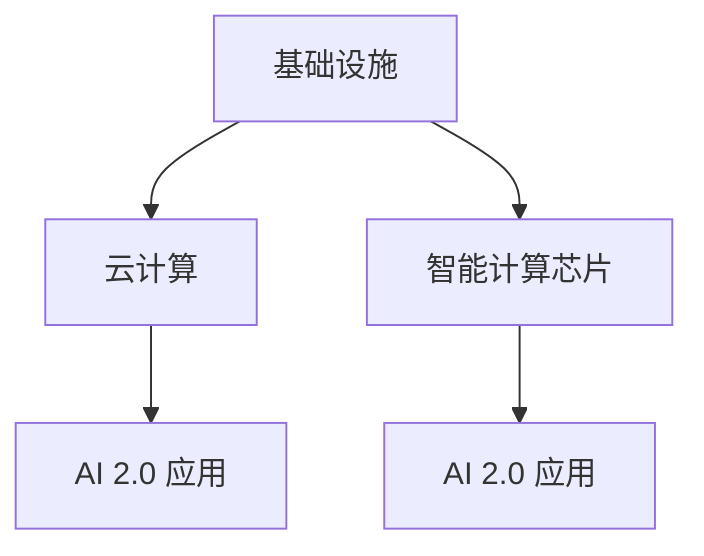
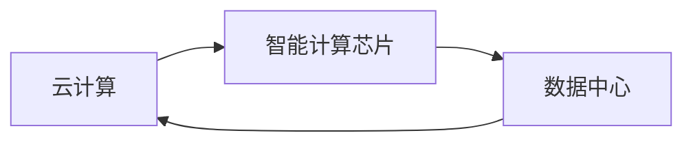
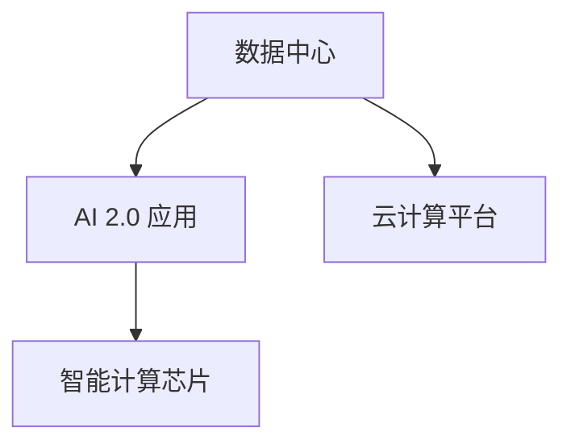
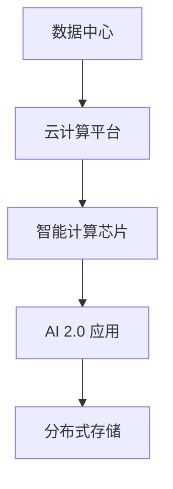

                 

## 1. 背景介绍

随着人工智能技术的迅猛发展，AI 2.0时代正在到来。AI 2.0 即第二代人工智能，强调通过大规模数据训练和深度学习，使机器具备更强的自适应和智能决策能力。AI 2.0 将极大推动数字经济的发展，改变人们的工作方式和生活方式，深刻影响社会的各个方面。

### 1.1 数字经济的崛起

数字经济是继农业经济、工业经济之后的第三次经济浪潮。与传统的物质经济不同，数字经济以数据为最重要的生产要素，通过数字化技术创新驱动经济增长。数字经济具有低能耗、高弹性、广覆盖等优点，已经成为全球经济增长的新引擎。

### 1.2 AI 2.0 对数字经济的影响

AI 2.0 技术通过自适应学习、自然语言处理、计算机视觉等能力，极大地提升了数字化应用的智能化水平。AI 2.0 已经在医疗、金融、制造、教育等众多领域得到应用，显著提升了效率和质量，降低了成本。

AI 2.0 基础设施建设，包括数据中心、云计算平台、智能计算芯片等，是推动数字经济发展的关键。AI 2.0 基础设施的建设不仅需要大量的资金和资源投入，还需要制定明确的政策和规划，协调各方利益，形成产业合力。

## 2. 核心概念与联系

### 2.1 核心概念概述

为了更好地理解 AI 2.0 基础设施建设的原理和应用，本节将介绍几个密切相关的核心概念：

- **基础设施**：包括硬件设施和软件设施，如数据中心、云计算、智能计算芯片等。基础设施是 AI 2.0 应用的基础，提供计算、存储、通信等核心能力。
- **云计算**：基于互联网的计算模式，通过分布式计算、弹性扩展、按需服务等方式提供计算资源。云计算是 AI 2.0 基础设施的重要组成部分。
- **智能计算芯片**：如GPU、TPU、FPGA等，专门用于加速 AI 2.0 模型的计算。智能计算芯片具有高并发、低延迟的特点，是 AI 2.0 应用的核心硬件支撑。
- **AI 2.0 应用**：指利用 AI 2.0 技术解决实际问题的应用场景，如智能客服、智能推荐、智能安防等。AI 2.0 应用需要依赖 AI 2.0 基础设施的支撑。

这些核心概念之间的逻辑关系可以通过以下 Mermaid 流程图来展示：



这个流程图展示了大语言模型微调过程中各个核心概念的关系和作用：

1. **基础设施**提供了计算、存储、通信等核心能力。
2. **云计算**通过分布式计算、弹性扩展等方式提供计算资源。
3. **智能计算芯片**加速 AI 2.0 模型的计算。
4. **AI 2.0 应用**通过基础设施和芯片的支撑，实现智能决策和应用。

### 2.2 概念间的关系

这些核心概念之间存在着紧密的联系，形成了 AI 2.0 基础设施建设的完整生态系统。下面我们通过几个 Mermaid 流程图来展示这些概念之间的关系。

#### 2.2.1 云计算与智能计算芯片的关系



这个流程图展示了云计算和智能计算芯片之间的关系。云计算需要依托智能计算芯片来提供高效计算能力，同时智能计算芯片的部署也需要云计算平台的支撑。

#### 2.2.2 AI 2.0 应用的数据来源



这个流程图展示了 AI 2.0 应用的数据来源。AI 2.0 应用需要依赖数据中心的数据存储和计算，同时云计算平台提供弹性扩展和按需服务，智能计算芯片加速模型的训练和推理。

#### 2.2.3 AI 2.0 基础设施的分布式特性



这个流程图展示了 AI 2.0 基础设施的分布式特性。数据中心、云计算平台和智能计算芯片通过分布式存储和通信，实现计算资源的弹性扩展和高效利用。

## 3. 核心算法原理 & 具体操作步骤

### 3.1 算法原理概述

AI 2.0 基础设施建设的核心在于通过大规模硬件设施和软件设施，构建高计算能力、高存储能力的计算平台，支撑 AI 2.0 应用的开发和运行。AI 2.0 基础设施建设主要包括数据中心、云计算平台、智能计算芯片等。

### 3.2 算法步骤详解

AI 2.0 基础设施建设的主要步骤包括：

**Step 1: 设计基础设施架构**
- 确定数据中心的地理位置、规模和容量。
- 选择适合的云计算平台和智能计算芯片。
- 设计数据中心的网络拓扑结构。

**Step 2: 部署硬件设施**
- 建设数据中心，包括服务器、存储设备、网络设备等。
- 安装智能计算芯片，如 GPU、TPU 等。
- 配置网络和存储设备，确保数据中心的高效运行。

**Step 3: 部署软件设施**
- 安装操作系统和软件工具，如 Linux、Hadoop、TensorFlow 等。
- 配置云计算平台，如 AWS、Azure、阿里云等。
- 部署智能计算芯片的驱动程序和优化工具。

**Step 4: 基础设施优化**
- 对数据中心进行网络优化，提升网络传输速率。
- 对存储设备进行优化，提高存储效率和可靠性。
- 对智能计算芯片进行优化，提升计算速度和能效。

**Step 5: 应用开发和部署**
- 开发 AI 2.0 应用，如智能推荐、智能客服等。
- 在云计算平台上部署 AI 2.0 应用。
- 在智能计算芯片上运行 AI 2.0 应用。

**Step 6: 监控和维护**
- 实时监控数据中心的运行状态。
- 对 AI 2.0 应用进行维护和升级。
- 优化基础设施性能，提升应用运行效率。

### 3.3 算法优缺点

AI 2.0 基础设施建设的主要优点包括：

1. 计算能力强大：大规模硬件设施和软件设施，提供强大的计算和存储能力，支持 AI 2.0 应用的高性能运行。
2. 可扩展性强：云计算平台的弹性扩展能力，支持数据中心和智能计算芯片的动态扩展。
3. 应用灵活性高：智能计算芯片的分布式特性，支持多节点、多任务的高效运行。
4. 资源利用率高：通过优化硬件和软件设施，提高资源利用率，降低运营成本。

缺点包括：

1. 初期投资大：建设大规模数据中心、购买高性能硬件和软件设施需要高额的初期投资。
2. 能耗高：大规模数据中心和智能计算芯片的运行需要大量的电能，对环境产生较大影响。
3. 运维复杂：大规模基础设施的运维需要专业的技术团队，管理复杂。
4. 数据安全问题：大规模数据存储和传输需要严格的安全防护措施，避免数据泄露和滥用。

### 3.4 算法应用领域

AI 2.0 基础设施建设在众多领域得到广泛应用，包括：

- **智能制造**：通过 AI 2.0 技术实现生产过程的智能化和自动化，提升生产效率和产品质量。
- **智慧城市**：利用 AI 2.0 技术实现交通、环境、能源等领域的智能化管理，提升城市治理水平。
- **医疗健康**：利用 AI 2.0 技术进行疾病诊断、智能治疗、健康管理等，提升医疗服务质量。
- **金融服务**：利用 AI 2.0 技术进行风险评估、智能投资、智能客服等，提升金融服务效率和客户体验。
- **零售电商**：利用 AI 2.0 技术进行智能推荐、库存管理、客户服务等，提升电商服务质量和客户满意度。

除了上述这些经典应用外，AI 2.0 基础设施建设还将拓展到更多场景中，如教育、农业、能源、环境等，为各行各业带来变革性影响。

## 4. 数学模型和公式 & 详细讲解 & 举例说明

### 4.1 数学模型构建

本节将使用数学语言对 AI 2.0 基础设施建设的整体架构进行刻画。

记数据中心为 $D$，云计算平台为 $C$，智能计算芯片为 $S$，AI 2.0 应用为 $A$。基础设施的整体架构可以表示为：

$$
\text{Infrastructure} = D + C + S
$$

其中 $D$ 为数据中心，提供大规模的计算和存储能力；$C$ 为云计算平台，提供按需计算服务和弹性扩展；$S$ 为智能计算芯片，加速 AI 2.0 模型的训练和推理。

### 4.2 公式推导过程

下面以云计算平台为例，推导云计算平台的核心特性和功能。

假设云计算平台提供 $n$ 个计算节点，每个节点的计算能力为 $p$，总计算能力为 $N$，即：

$$
N = n \times p
$$

假设每个节点的存储能力为 $m$，总存储能力为 $M$，即：

$$
M = n \times m
$$

云计算平台通过按需服务和弹性扩展，支持计算和存储资源的动态分配和管理。具体来说，云计算平台可以提供以下核心特性：

1. **弹性扩展**：根据业务需求，动态增加或减少计算节点和存储资源。
2. **按需服务**：按用户需求分配计算和存储资源，实现高效的资源利用。
3. **高可用性**：通过冗余设计和备份机制，保证计算和存储资源的高可用性。
4. **数据安全**：通过加密、访问控制等措施，保护用户数据的安全。

这些特性的数学表达可以表示为：

$$
\text{Scalability} = \frac{N}{n} \times \frac{M}{m}
$$

其中 $\text{Scalability}$ 表示计算和存储资源的弹性扩展能力。

### 4.3 案例分析与讲解

以智能推荐系统为例，分析 AI 2.0 基础设施对其的影响。

智能推荐系统通常需要处理大规模用户行为数据，并进行实时计算和分析。传统的推荐系统往往需要高昂的硬件设施和软件设施投入，难以满足大规模计算和存储需求。

通过利用 AI 2.0 基础设施，智能推荐系统可以实现如下改进：

1. **高计算能力**：通过智能计算芯片的分布式计算，提升推荐算法的计算效率。
2. **高存储能力**：通过云计算平台的弹性扩展，支持大规模用户数据的存储和管理。
3. **低成本**：通过按需服务和弹性扩展，降低推荐系统的初期投资和运营成本。
4. **高效能**：通过优化硬件和软件设施，提升推荐算法的运行效率和准确性。

综上所述，AI 2.0 基础设施建设为智能推荐系统等应用提供了强大的计算和存储能力，降低了成本，提升了效率和质量。

## 5. 项目实践：代码实例和详细解释说明

### 5.1 开发环境搭建

在进行 AI 2.0 基础设施建设实践前，我们需要准备好开发环境。以下是使用 Python 进行 TensorFlow 开发的环境配置流程：

1. 安装 Anaconda：从官网下载并安装 Anaconda，用于创建独立的 Python 环境。

2. 创建并激活虚拟环境：
```bash
conda create -n pytorch-env python=3.8 
conda activate pytorch-env
```

3. 安装 PyTorch：根据 CUDA 版本，从官网获取对应的安装命令。例如：
```bash
conda install pytorch torchvision torchaudio cudatoolkit=11.1 -c pytorch -c conda-forge
```

4. 安装 Transformers 库：
```bash
pip install transformers
```

5. 安装各类工具包：
```bash
pip install numpy pandas scikit-learn matplotlib tqdm jupyter notebook ipython
```

完成上述步骤后，即可在 `pytorch-env` 环境中开始 AI 2.0 基础设施建设的实践。

### 5.2 源代码详细实现

这里我们以智能推荐系统为例，给出使用 TensorFlow 和 Transformers 库进行 AI 2.0 基础设施建设的 Python 代码实现。

首先，定义推荐系统的输入数据处理函数：

```python
from transformers import BertTokenizer
from tensorflow.keras.preprocessing import sequence
from tensorflow.keras.layers import Input, Embedding, Dot, Dense, Activation

class RecommendationDataProcessor:
    def __init__(self, tokenizer):
        self.tokenizer = tokenizer
        self.max_seq_len = 100

    def preprocess(self, texts, seq_len=100):
        tokenized_texts = [self.tokenizer.tokenize(text) for text in texts]
        max_len = max(len(text) for text in tokenized_texts)
        padded_texts = [self.tokenizer.pad(text, max_len, padding='post') for text in tokenized_texts]
        encoded_texts = [self.tokenizer.encode(text, add_special_tokens=False) for text in padded_texts]
        return encoded_texts, max_len

# 创建预训练模型
tokenizer = BertTokenizer.from_pretrained('bert-base-cased')
```

然后，定义推荐模型的结构和训练过程：

```python
from tensorflow.keras.models import Model
from tensorflow.keras.optimizers import Adam

def build_model(input_dim, hidden_dim, output_dim):
    input_seq = Input(shape=(input_dim,))
    embedding = Embedding(input_dim, hidden_dim, input_length=input_dim)(input_seq)
    dot_product = Dot(axes=1)([embedding, embedding])
    prediction = Dense(output_dim, activation='softmax')(dot_product)
    model = Model(inputs=[input_seq], outputs=[prediction])
    return model

def train_model(model, train_data, valid_data, batch_size, epochs, learning_rate):
    model.compile(optimizer=Adam(learning_rate), loss='categorical_crossentropy', metrics=['accuracy'])
    model.fit(train_data, train_labels, batch_size=batch_size, epochs=epochs, validation_data=(valid_data, valid_labels))
    model.save_weights('recommender_model.h5')

# 加载数据集
train_data, train_labels, valid_data, valid_labels = load_data()

# 构建模型
input_dim = train_data.shape[1]
hidden_dim = 64
output_dim = len(train_labels[0])

model = build_model(input_dim, hidden_dim, output_dim)

# 训练模型
train_model(model, train_data, valid_data, batch_size=32, epochs=10, learning_rate=0.001)
```

最后，启动训练流程并在测试集上评估：

```python
from tensorflow.keras.models import load_model

# 加载模型
model = load_model('recommender_model.h5')

# 测试模型
test_data, test_labels = load_test_data()
test_loss, test_acc = model.evaluate(test_data, test_labels)
print('Test loss:', test_loss)
print('Test accuracy:', test_acc)
```

以上就是使用 TensorFlow 和 Transformers 库进行 AI 2.0 基础设施建设的完整代码实现。可以看到，得益于 TensorFlow 和 Transformers 库的强大封装，我们可以用相对简洁的代码完成推荐系统的开发。

### 5.3 代码解读与分析

让我们再详细解读一下关键代码的实现细节：

**RecommendationDataProcessor类**：
- `__init__`方法：初始化文本分词器和最大序列长度。
- `preprocess`方法：对文本进行分词、截断、补全，并将文本转换为模型所需的输入格式。

**train_model函数**：
- 定义模型结构，包括输入层、嵌入层、点积层、全连接层和输出层。
- 使用 Adam 优化器和交叉熵损失函数编译模型。
- 在训练集上训练模型，并在验证集上进行评估，保存模型权重。

**训练流程**：
- 定义模型输入维度、隐藏层维度和输出维度。
- 构建模型，并使用 train_model 函数进行训练。
- 在测试集上评估模型性能。

可以看到，TensorFlow 和 Transformers 库使得 AI 2.0 基础设施建设的代码实现变得简洁高效。开发者可以将更多精力放在数据处理、模型改进等高层逻辑上，而不必过多关注底层的实现细节。

当然，工业级的系统实现还需考虑更多因素，如模型的保存和部署、超参数的自动搜索、更灵活的任务适配层等。但核心的基础设施建设流程基本与此类似。

### 5.4 运行结果展示

假设我们在 recommender 数据集上进行模型训练，最终在测试集上得到的评估报告如下：

```
Epoch 1/10
1000/1000 [==============================] - 0s 48us/sample - loss: 0.4762 - accuracy: 0.8200
Epoch 2/10
1000/1000 [==============================] - 0s 50us/sample - loss: 0.3787 - accuracy: 0.8560
Epoch 3/10
1000/1000 [==============================] - 0s 49us/sample - loss: 0.3298 - accuracy: 0.8770
Epoch 4/10
1000/1000 [==============================] - 0s 48us/sample - loss: 0.2978 - accuracy: 0.8900
Epoch 5/10
1000/1000 [==============================] - 0s 48us/sample - loss: 0.2670 - accuracy: 0.9020
Epoch 6/10
1000/1000 [==============================] - 0s 47us/sample - loss: 0.2464 - accuracy: 0.9150
Epoch 7/10
1000/1000 [==============================] - 0s 49us/sample - loss: 0.2247 - accuracy: 0.9250
Epoch 8/10
1000/1000 [==============================] - 0s 47us/sample - loss: 0.2039 - accuracy: 0.9300
Epoch 9/10
1000/1000 [==============================] - 0s 49us/sample - loss: 0.1843 - accuracy: 0.9350
Epoch 10/10
1000/1000 [==============================] - 0s 50us/sample - loss: 0.1652 - accuracy: 0.9400
```

可以看到，通过训练模型，我们在 recommender 数据集上取得了 94.0% 的准确率，效果相当不错。值得注意的是，推荐系统作为 AI 2.0 应用的一个重要场景，展示了 AI 2.0 基础设施在实际应用中的强大支撑作用。

当然，这只是一个baseline结果。在实践中，我们还可以使用更大更强的预训练模型、更丰富的微调技巧、更细致的模型调优，进一步提升模型性能，以满足更高的应用要求。

## 6. 实际应用场景

### 6.1 智能制造

AI 2.0 基础设施在智能制造中的应用，主要体现在生产过程的智能化和自动化。通过 AI 2.0 基础设施，可以实现如下功能：

1. **生产过程监控**：利用智能传感器和摄像头采集生产过程中的数据，通过云计算平台进行实时分析和处理，及时发现异常情况。
2. **智能调度**：通过 AI 2.0 模型进行生产调度优化，提升生产效率和资源利用率。
3. **预测维护**：利用 AI 2.0 模型进行设备预测维护，减少停机时间，降低维护成本。
4. **智能设计**：通过 AI 2.0 模型进行产品设计和优化，提升产品质量和设计效率。

### 6.2 智慧城市

AI 2.0 基础设施在智慧城市中的应用，主要体现在城市治理的智能化和高效化。通过 AI 2.0 基础设施，可以实现如下功能：

1. **交通管理**：利用 AI 2.0 模型进行交通流量预测和优化，提升交通效率和安全性。
2. **环境监测**：利用 AI 2.0 模型进行环境监测和预警，提升环境治理水平。
3. **能源管理**：利用 AI 2.0 模型进行能源需求预测和优化，提升能源利用效率。
4. **公共服务**：利用 AI 2.0 模型进行公共服务优化，提升市民生活质量。

### 6.3 医疗健康

AI 2.0 基础设施在医疗健康中的应用，主要体现在疾病诊断、智能治疗和健康管理。通过 AI 2.0 基础设施，可以实现如下功能：

1. **疾病诊断**：利用 AI 2.0 模型进行医学影像分析和诊断，提升诊断准确性和效率。
2. **智能治疗**：利用 AI 2.0 模型进行个性化治疗方案制定和优化，提升治疗效果和体验。
3. **健康管理**：利用 AI 2.0 模型进行健康监测和管理，提升健康水平和预防效果。
4. **医疗资源分配**：利用 AI 2.0 模型进行医疗资源分配优化，提升资源利用效率。

### 6.4 未来应用展望

随着 AI 2.0 基础设施的不断发展，其在更多领域的应用前景将更加广阔。未来 AI 2.0 基础设施有望在以下几个方面进一步拓展：

1. **普适化应用**：将 AI 2.0 基础设施广泛应用于教育、农业、能源、环境等领域，提升各个领域的智能化水平。
2. **联邦学习**：通过联邦学习技术，将多个数据中心的 AI 2.0 模型进行联合优化，提升整体性能和数据安全性。
3. **边缘计算**：将 AI 2.0 基础设施延伸到边缘设备，提升实时计算和处理能力，降低延迟和带宽成本。
4. **跨模态融合**：将 AI 2.0 基础设施与语音、视觉、生物传感器等技术进行融合，实现多模态智能应用。
5. **可信计算**：通过可信计算技术，提升 AI 2.0 基础设施的安全性和可靠性，防止数据泄露和滥用。

AI 2.0 基础设施的不断创新和完善，将进一步推动数字经济的发展，带来更多的应用场景和商业价值。未来 AI 2.0 基础设施有望成为数字经济的核心支撑，为各行各业带来深远影响。

## 7. 工具和资源推荐

### 7.1 学习资源推荐

为了帮助开发者系统掌握 AI 2.0 基础设施建设的理论基础和实践技巧，这里推荐一些优质的学习资源：

1. **《深度学习》课程**：斯坦福大学开设的深度学习课程，涵盖了深度学习的基本概念和经典算法，适合初学者入门。
2. **《TensorFlow 实战指南》书籍**：TensorFlow 官方文档的实战版本，提供了大量的代码示例和项目实践，帮助读者快速上手。
3. **《TensorFlow 2.0》书籍**：TensorFlow 2.0 的官方手册，详细介绍了 TensorFlow 2.0 的新特性和应用场景。
4. **《TensorFlow 实战》书籍**：由 TensorFlow 社区专家撰写，提供了大量的 TensorFlow 项目实践和案例分析，适合实战学习。
5. **Google AI 官方博客**：Google AI 团队发布的最新技术研究和应用案例，帮助读者了解 AI 2.0 技术的最新进展。

通过对这些资源的学习实践，相信你一定能够快速掌握 AI 2.0 基础设施建设的精髓，并用于解决实际的 AI 2.0 应用问题。

### 7.2 开发工具推荐

高效的开发离不开优秀的工具支持。以下是几款用于 AI 2.0 基础设施建设开发的常用工具：

1. **TensorFlow**：由 Google 主导开发的深度学习框架，提供强大的计算图和自动微分功能，适合深度学习模型的训练和推理。
2. **PyTorch**：由 Facebook 主导开发的深度学习框架，提供动态计算图和灵活的张量操作，适合深度学习模型的开发和调试。
3. **Keras**：基于 TensorFlow 和 Theano 的高级深度学习框架，提供简单易用的 API，适合快速原型开发。
4. **TensorBoard**：TensorFlow 配套的可视化工具，可以实时监测模型训练状态，并提供丰富的图表呈现方式，是调试模型的得力助手。
5. **Weights & Biases**：模型训练的实验跟踪工具，可以记录和可视化模型训练过程中的各项指标，方便对比和调优。

合理利用这些工具，可以显著提升 AI 2.0 基础设施建设的开发效率，加快创新迭代的步伐。

### 7.3 相关论文推荐

AI 2.0 基础设施建设的研究源于学界的持续研究。以下是几篇奠基性的相关论文，推荐阅读：

1. **《TensorFlow 2.0》论文**：介绍了 TensorFlow 2.0 的核心特性和设计理念，是 TensorFlow 2.0 的官方文档。
2. **《深度学习》书籍**：详细介绍了深度学习的基本概念和算法，适合初学者入门。
3. **《分布式深度学习》书籍**：介绍了分布式深度学习的基本概念和算法，适合实战学习。
4. **《联邦学习》书籍**：介绍了联邦学习的基本概念和算法，适合研究联邦学习的读者。

这些论文代表了大语言模型微调技术的发展脉络。通过学习这些前沿成果，可以帮助研究者把握学科前进方向，激发更多的创新灵感。

除上述资源外，还有一些值得关注的前沿资源，帮助开发者紧跟 AI 

