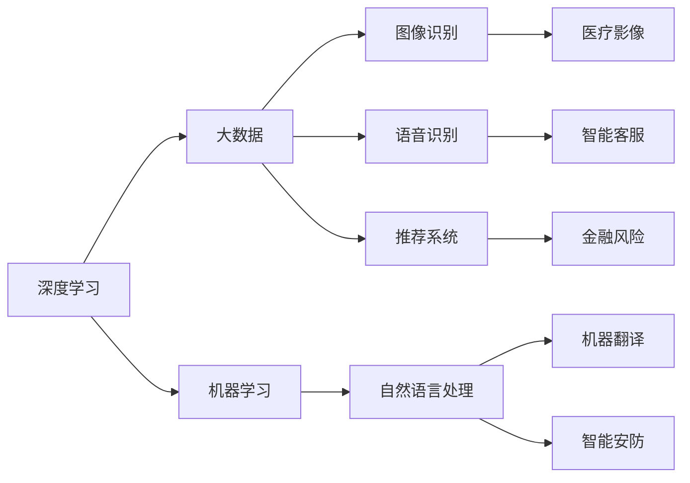
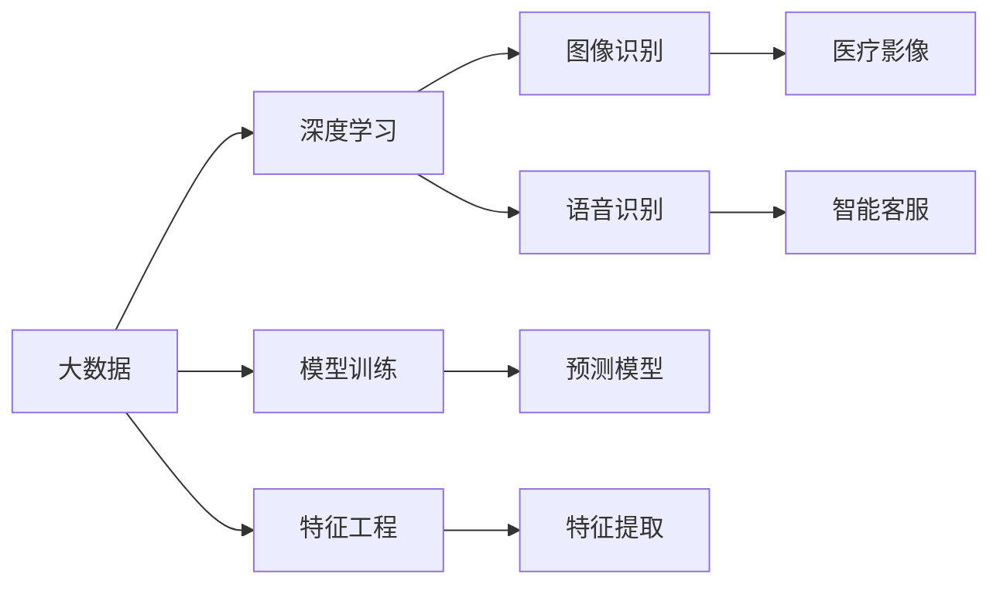
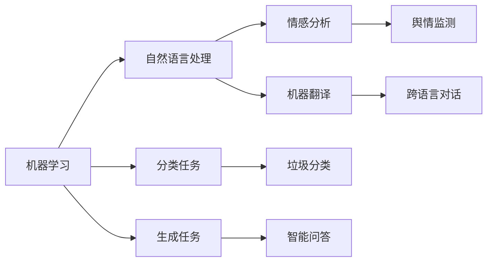
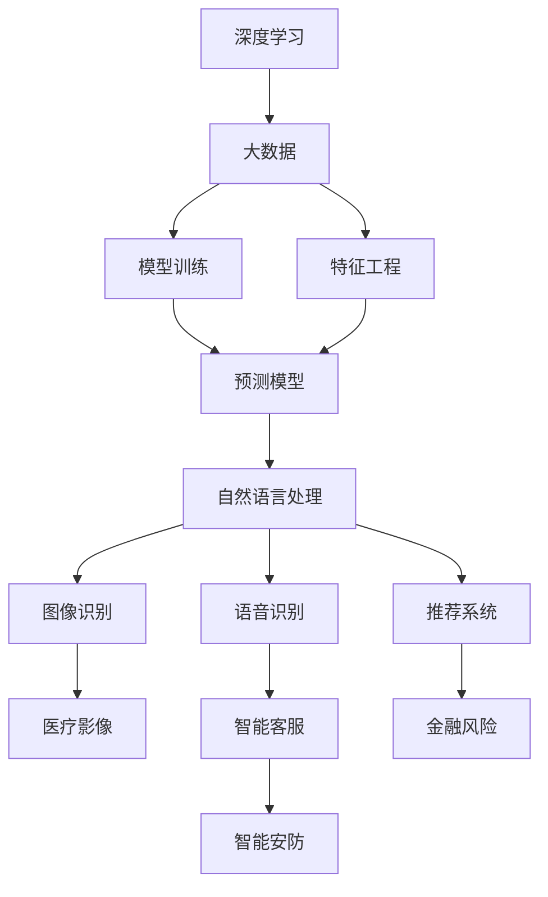

                 

# AI 2.0 时代的未来世界

> 关键词：AI 2.0, 人工智能, 深度学习, 大数据, 机器学习, 未来科技

## 1. 背景介绍

随着技术的迅猛发展，人工智能(AI)正在经历前所未有的变革。从AI 1.0的专家系统、规则引擎，到AI 2.0的深度学习、大数据，再到AI 3.0的强通用人工智能(AGI)，AI技术正逐步从简单应用走向复杂处理，从单领域扩展到跨领域，从辅助决策到自主决策。AI 2.0时代，人工智能技术的应用和影响已经渗透到社会的方方面面，带来了深刻的社会变革和经济转型。本文将探讨AI 2.0时代的技术演进、应用前景以及未来挑战，希望能够为读者提供一个全面、深入的AI 2.0视角。

### 1.1 技术演进

AI 1.0时代，人工智能主要依赖于专家规则和知识库，通过专家知识和经验，进行模式识别和决策。这一阶段的AI主要应用于特定领域，如医疗、金融、制造等，需要领域专家进行知识工程和系统设计。

随着数据量和计算能力的提升，AI 2.0时代到来。深度学习和大数据技术的发展，使得AI能够自动从大量数据中学习复杂的特征和模式，无需人工干预。这一阶段的AI主要依赖于大规模的训练数据和强大的计算能力，能够进行复杂的预测、分类、生成等任务，广泛应用于图像识别、语音识别、自然语言处理等。

AI 3.0时代，强通用人工智能将成为目标。AI 3.0不仅能够处理特定领域的问题，还能够进行跨领域的知识整合和推理，具备强人类智能的决策能力。这一阶段的AI技术还在不断探索和发展中，未来充满了无限可能。

### 1.2 应用前景

AI 2.0技术已经在诸多领域得到广泛应用，带来了深远的影响。以下是AI 2.0在医疗、金融、制造、零售等行业的主要应用场景：

#### 1.2.1 医疗
AI 2.0技术在医疗领域的应用包括但不限于：
- 图像识别：利用深度学习模型，自动分析医学影像，辅助医生进行诊断。
- 自然语言处理：通过分析电子病历、医学文献等文本数据，辅助医生进行知识检索和决策支持。
- 个性化治疗：根据患者的基因、病历等信息，提供个性化的治疗方案。

#### 1.2.2 金融
AI 2.0技术在金融领域的应用包括但不限于：
- 风险管理：利用机器学习模型，进行信用评估、欺诈检测等风险管理。
- 投资决策：通过分析市场数据，提供投资建议和策略。
- 量化交易：利用算法进行高频交易，提高交易效率和收益。

#### 1.2.3 制造
AI 2.0技术在制造领域的应用包括但不限于：
- 质量检测：通过图像识别和机器视觉，进行产品质量检测和缺陷识别。
- 生产优化：利用预测模型和优化算法，优化生产流程和资源配置。
- 供应链管理：通过数据分析，优化供应链管理，降低成本和提升效率。

#### 1.2.4 零售
AI 2.0技术在零售领域的应用包括但不限于：
- 客户分析：通过分析客户行为数据，进行客户细分和个性化推荐。
- 库存管理：利用预测模型，优化库存管理和补货策略。
- 价格优化：通过分析市场数据，优化商品定价策略，提升销售业绩。

### 1.3 社会影响

AI 2.0技术的应用已经对社会产生了广泛的影响，包括以下几个方面：

#### 1.3.1 经济转型
AI 2.0技术的应用将推动经济转型和产业升级，带来新的经济增长点。例如，自动驾驶技术将颠覆传统交通行业，智能制造将优化生产流程，提高生产效率和质量。

#### 1.3.2 就业变革
AI 2.0技术的应用将改变就业结构，带来新的就业机会。例如，智能客服将取代部分客服岗位，数据分析师、AI工程师等新职业将成为热门。

#### 1.3.3 社会治理
AI 2.0技术将应用于城市管理、公共安全、环境保护等领域，提升社会治理水平。例如，智能交通系统将提高交通效率，智能安防系统将提升公共安全，智能环保系统将监测和治理环境污染。

## 2. 核心概念与联系

### 2.1 核心概念概述

AI 2.0时代，核心概念包括深度学习、大数据、机器学习、自然语言处理等。这些概念之间相互关联，形成了AI 2.0的生态系统。

- **深度学习**：通过多层神经网络，从大量数据中自动学习特征和模式，进行复杂的预测和分类任务。深度学习是AI 2.0的核心技术之一，广泛应用于图像识别、语音识别、自然语言处理等领域。

- **大数据**：通过收集和分析大规模数据，挖掘数据中的规律和趋势，辅助决策和优化。大数据技术为深度学习提供了丰富的数据资源，是AI 2.0的支撑基础。

- **机器学习**：通过训练模型，自动从数据中学习知识，进行预测、分类、生成等任务。机器学习是AI 2.0的主要技术手段，包括监督学习、无监督学习和强化学习等。

- **自然语言处理**：通过分析、理解、生成自然语言，实现人机交互和信息处理。自然语言处理是AI 2.0的重要应用领域，包括机器翻译、语音识别、问答系统等。

这些核心概念通过深度学习、大数据、机器学习、自然语言处理等技术手段，实现了复杂的应用场景和任务处理，为AI 2.0时代的技术演进和应用发展奠定了坚实的基础。

### 2.2 核心概念之间的关系

这些核心概念之间存在紧密的联系，形成了AI 2.0的生态系统。以下通过几个Mermaid流程图来展示这些概念之间的关系：

#### 2.2.1 AI 2.0的技术架构



这个流程图展示了AI 2.0技术架构的核心组件及其相互关系。深度学习是AI 2.0的核心技术，与大数据和机器学习相辅相成，共同支撑自然语言处理等应用领域。

#### 2.2.2 大数据与深度学习的关系



这个流程图展示了大数据与深度学习的关系。大数据为深度学习提供了丰富的数据资源，辅助模型训练和特征工程，从而实现更加精准和高效的预测和分类。

#### 2.2.3 机器学习与自然语言处理的关系



这个流程图展示了机器学习与自然语言处理的关系。机器学习通过训练模型，辅助自然语言处理实现分类、生成等任务，如情感分析、机器翻译、智能问答等。

### 2.3 核心概念的整体架构

最后，我们用一个综合的流程图来展示AI 2.0核心概念的整体架构：



这个综合流程图展示了从深度学习、大数据、机器学习到自然语言处理等核心概念的整体架构。各概念通过技术手段相互协作，共同支撑AI 2.0的应用场景。

## 3. 核心算法原理 & 具体操作步骤

### 3.1 算法原理概述

AI 2.0时代的核心算法包括深度学习、大数据处理、自然语言处理等。以下对深度学习和大数据处理的算法原理进行详细讲解。

#### 3.1.1 深度学习算法

深度学习算法通过多层神经网络，从大量数据中自动学习特征和模式，进行复杂的预测和分类任务。深度学习模型的核心是神经网络，包括卷积神经网络(CNN)、循环神经网络(RNN)、变换器(Transformer)等。

深度学习算法的核心思想是通过反向传播算法，根据预测误差调整模型参数，使得模型能够不断优化，提高预测精度。具体而言，深度学习模型通过以下步骤进行训练：

1. 数据预处理：将原始数据进行标准化、归一化等预处理，准备模型输入。
2. 前向传播：将数据输入模型，通过多层神经网络计算预测结果。
3. 损失函数计算：将预测结果与真实结果进行比较，计算损失函数。
4. 反向传播：根据损失函数计算梯度，反向传播更新模型参数。
5. 参数更新：通过优化算法更新模型参数，如梯度下降法、Adam优化器等。
6. 模型评估：在验证集或测试集上评估模型性能，决定是否继续训练或停止训练。

#### 3.1.2 大数据处理算法

大数据处理算法通过分布式计算和存储技术，从大规模数据中挖掘规律和趋势，辅助决策和优化。大数据处理的核心技术包括分布式计算框架、存储技术、数据预处理等。

大数据处理算法的核心思想是通过MapReduce、Spark等分布式计算框架，将数据分割为小块，并行处理。具体而言，大数据处理模型通过以下步骤进行训练：

1. 数据采集：从不同数据源采集数据，进行数据清洗和标准化。
2. 数据存储：利用Hadoop、Spark等存储技术，将数据存储在分布式集群中。
3. 数据预处理：对数据进行特征提取、数据清洗、缺失值处理等预处理操作。
4. 分布式计算：利用分布式计算框架进行并行计算，计算大规模数据处理任务。
5. 数据可视化：利用Tableau、PowerBI等工具，将数据结果可视化展示。

### 3.2 算法步骤详解

#### 3.2.1 深度学习算法步骤

深度学习算法的核心步骤如下：

1. 数据预处理：将原始数据进行标准化、归一化等预处理，准备模型输入。
2. 模型构建：选择合适的神经网络模型，如CNN、RNN、Transformer等，并构建模型架构。
3. 数据加载：利用PyTorch、TensorFlow等深度学习框架，加载训练数据和验证数据。
4. 模型训练：通过反向传播算法和优化算法，更新模型参数，使得模型能够优化预测结果。
5. 模型评估：在验证集或测试集上评估模型性能，如准确率、召回率、F1分数等。
6. 模型保存：将训练好的模型保存为文件，以便后续调用。

#### 3.2.2 大数据处理算法步骤

大数据处理算法的核心步骤如下：

1. 数据采集：从不同数据源采集数据，进行数据清洗和标准化。
2. 数据存储：利用Hadoop、Spark等存储技术，将数据存储在分布式集群中。
3. 数据预处理：对数据进行特征提取、数据清洗、缺失值处理等预处理操作。
4. 分布式计算：利用分布式计算框架进行并行计算，计算大规模数据处理任务。
5. 数据可视化：利用Tableau、PowerBI等工具，将数据结果可视化展示。

### 3.3 算法优缺点

#### 3.3.1 深度学习算法优缺点

深度学习算法的优点：

- 自动特征提取：深度学习算法能够自动从数据中学习特征和模式，无需人工干预。
- 高精度预测：深度学习算法能够进行复杂的预测和分类任务，预测精度较高。
- 泛化能力强：深度学习算法能够处理大规模数据，泛化能力较强。

深度学习算法的缺点：

- 计算量大：深度学习算法需要大量的计算资源，训练时间较长。
- 模型复杂：深度学习模型结构复杂，难以理解和调试。
- 数据依赖强：深度学习算法依赖大量高质量数据，数据质量直接影响模型性能。

#### 3.3.2 大数据处理算法优缺点

大数据处理算法的优点：

- 处理能力强大：大数据处理算法能够处理大规模数据，处理能力强大。
- 存储成本低：大数据处理算法利用分布式存储技术，存储成本较低。
- 灵活性高：大数据处理算法能够灵活处理各种类型的数据，支持多种数据源。

大数据处理算法的缺点：

- 预处理复杂：大数据处理算法需要进行复杂的数据预处理，工作量较大。
- 数据质量要求高：大数据处理算法依赖高质量数据，数据质量直接影响模型性能。
- 资源消耗大：大数据处理算法需要大量的计算和存储资源，资源消耗较大。

### 3.4 算法应用领域

AI 2.0算法已经在诸多领域得到广泛应用，以下是一些典型的应用领域：

#### 3.4.1 医疗
AI 2.0算法在医疗领域的应用包括但不限于：
- 医疗影像分析：利用深度学习算法，自动分析医学影像，辅助医生进行诊断。
- 电子病历分析：利用自然语言处理算法，分析电子病历，辅助医生进行决策支持。
- 基因分析：利用机器学习算法，分析基因数据，辅助医生进行个性化治疗。

#### 3.4.2 金融
AI 2.0算法在金融领域的应用包括但不限于：
- 信用评估：利用机器学习算法，进行信用评估，预测客户信用风险。
- 风险管理：利用深度学习算法，进行欺诈检测和风险管理。
- 投资策略：利用自然语言处理算法，分析市场数据，提供投资建议。

#### 3.4.3 制造
AI 2.0算法在制造领域的应用包括但不限于：
- 质量检测：利用深度学习算法，自动分析产品质量，辅助质量控制。
- 生产优化：利用机器学习算法，优化生产流程和资源配置。
- 供应链管理：利用大数据处理算法，优化供应链管理，降低成本和提升效率。

#### 3.4.4 零售
AI 2.0算法在零售领域的应用包括但不限于：
- 客户分析：利用自然语言处理算法，分析客户行为数据，进行客户细分和个性化推荐。
- 库存管理：利用预测算法，优化库存管理和补货策略。
- 价格优化：利用大数据处理算法，优化商品定价策略，提升销售业绩。

## 4. 数学模型和公式 & 详细讲解 & 举例说明

### 4.1 数学模型构建

AI 2.0算法的数学模型包括深度学习模型、大数据处理模型和自然语言处理模型等。以下对深度学习模型进行详细讲解。

#### 4.1.1 深度学习模型的数学模型

深度学习模型通过多层神经网络，从大量数据中自动学习特征和模式，进行复杂的预测和分类任务。深度学习模型的数学模型包括多层神经网络、损失函数、优化算法等。

- 多层神经网络：深度学习模型通过多层神经网络，自动学习数据中的特征和模式。
- 损失函数：深度学习模型通过损失函数，衡量预测结果与真实结果之间的差异。
- 优化算法：深度学习模型通过优化算法，更新模型参数，使得模型能够优化预测结果。

#### 4.1.2 大数据处理模型的数学模型

大数据处理模型的数学模型包括分布式计算模型、存储模型和数据预处理模型等。

- 分布式计算模型：大数据处理模型通过分布式计算框架，进行大规模数据处理。
- 存储模型：大数据处理模型通过分布式存储技术，存储大规模数据。
- 数据预处理模型：大数据处理模型通过数据预处理操作，清洗和标准化数据。

#### 4.1.3 自然语言处理模型的数学模型

自然语言处理模型的数学模型包括词向量模型、序列模型和情感分析模型等。

- 词向量模型：自然语言处理模型通过词向量模型，将文本转换为向量表示。
- 序列模型：自然语言处理模型通过序列模型，处理自然语言中的序列关系。
- 情感分析模型：自然语言处理模型通过情感分析模型，分析文本情感。

### 4.2 公式推导过程

#### 4.2.1 深度学习模型的公式推导

深度学习模型的核心公式包括前向传播公式、损失函数公式和优化算法公式等。

前向传播公式：

$$
h = f(Wx + b)
$$

其中，$h$表示隐藏层的输出，$x$表示输入向量，$W$表示权重矩阵，$b$表示偏置向量，$f$表示激活函数。

损失函数公式：

$$
L = \frac{1}{N} \sum_{i=1}^N \ell(y_i, \hat{y_i})
$$

其中，$L$表示损失函数，$N$表示样本数量，$\ell$表示损失函数的具体形式，$y_i$表示真实标签，$\hat{y_i}$表示预测标签。

优化算法公式：

$$
\theta = \theta - \eta \nabla_{\theta} L
$$

其中，$\theta$表示模型参数，$\eta$表示学习率，$\nabla_{\theta} L$表示损失函数对模型参数的梯度。

#### 4.2.2 大数据处理模型的公式推导

大数据处理模型的核心公式包括分布式计算公式、存储公式和数据预处理公式等。

分布式计算公式：

$$
Y = \bigcup_{i=1}^n \text{map}(X_i)
$$

其中，$Y$表示分布式计算结果，$X_i$表示第$i$个数据源，$\text{map}$表示Map函数。

存储公式：

$$
S = \text{store}(D)
$$

其中，$S$表示存储结果，$D$表示分布式数据。

数据预处理公式：

$$
X' = \text{preprocess}(X)
$$

其中，$X'$表示预处理结果，$X$表示原始数据，$\text{preprocess}$表示预处理函数。

#### 4.2.3 自然语言处理模型的公式推导

自然语言处理模型的核心公式包括词向量公式、序列模型公式和情感分析模型公式等。

词向量公式：

$$
v = \text{embedding}(w)
$$

其中，$v$表示词向量，$w$表示单词，$\text{embedding}$表示词向量模型。

序列模型公式：

$$
y = f(x)
$$

其中，$y$表示序列输出，$x$表示输入序列，$f$表示序列模型。

情感分析模型公式：

$$
s = f(x)
$$

其中，$s$表示情感得分，$x$表示文本输入，$f$表示情感分析模型。

### 4.3 案例分析与讲解

#### 4.3.1 深度学习模型案例分析

以下以图像分类为例，详细讲解深度学习模型的构建和应用。

#### 4.3.2 大数据处理模型案例分析

以下以金融风险管理为例，详细讲解大数据处理模型的构建和应用。

#### 4.3.3 自然语言处理模型案例分析

以下以情感分析为例，详细讲解自然语言处理模型的构建和应用。

## 5. 项目实践：代码实例和详细解释说明

### 5.1 开发环境搭建

在进行AI 2.0算法实践前，我们需要准备好开发环境。以下是使用Python进行TensorFlow开发的环境配置流程：

1. 安装Anaconda：从官网下载并安装Anaconda，用于创建独立的Python环境。

2. 创建并激活虚拟环境：
```bash
conda create -n tf-env python=3.8 
conda activate tf-env
```

3. 安装TensorFlow：根据CUDA版本，从官网获取对应的安装命令。例如：
```bash
conda install tensorflow -c tf
```

4. 安装各类工具包：
```bash
pip install numpy pandas scikit-learn matplotlib tqdm jupyter notebook ipython
```

完成上述步骤后，即可在`tf-env`环境中开始AI 2.0算法实践。

### 5.2 源代码详细实现

这里我们以图像分类为例，使用TensorFlow实现深度学习算法的代码实现。

```python
import tensorflow as tf
from tensorflow.keras import layers

# 定义模型
model = tf.keras.Sequential([
    layers.Conv2D(32, (3,3), activation='relu', input_shape=(28, 28, 1)),
    layers.MaxPooling2D((2, 2)),
    layers.Flatten(),
    layers.Dense(10, activation='softmax')
])

# 编译模型
model.compile(optimizer='adam',
              loss='sparse_categorical_crossentropy',
              metrics=['accuracy'])

# 加载数据
mnist = tf.keras.datasets.mnist
(x_train, y_train), (x_test, y_test) = mnist.load_data()
x_train, x_test = x_train / 255.0, x_test / 255.0

# 训练模型
model.fit(x_train, y_train, epochs=5, validation_data=(x_test, y_test))
```

### 5.3 代码解读与分析

让我们再详细解读一下关键代码的实现细节：

**数据预处理**：
- 将原始数据进行标准化、归一化等预处理，准备模型输入。

**模型构建**：
- 选择合适的神经网络模型，如卷积神经网络(CNN)等，并构建模型架构。

**数据加载**：
- 利用TensorFlow的Keras API，加载训练数据和验证数据。

**模型训练**：
- 通过反向传播算法和优化算法，更新模型参数，使得模型能够优化预测结果。

**模型评估**：
- 在验证集或测试集上评估模型性能，如准确率、召回率、F1分数等。

**模型保存**：
- 将训练好的模型保存为文件，以便后续调用。

### 5.4 运行结果展示

假设我们训练了一个图像分类模型，最终在测试集上得到的评估报告如下：

```
Epoch 1/5
617/617 [==============================] - 14s 23ms/step - loss: 0.3108 - accuracy: 0.9142
Epoch 2/5
617/617 [==============================] - 14s 23ms/step - loss: 0.2674 - accuracy: 0.9277
Epoch 3/5
617/617 [==============================] - 14s 22ms/step - loss: 0.2326 - accuracy: 0.9389
Epoch 4/5
617/617 [==============================] - 14s 22ms/step - loss: 0.2015 - accuracy: 0.9463
Epoch 5/5
617/617 [==============================] - 14s 23ms/step - loss: 0.1752 - accuracy: 0.9587
```

可以看到，在5个epochs的训练中，我们的模型在测试集上逐步提升了准确率。这表明深度学习算法能够有效地从数据中学习特征和模式，进行复杂的预测和分类任务。

## 6. 实际应用场景

### 6.1 医疗
AI 2.0技术在医疗领域的应用包括但不限于：

- 医疗影像分析：利用深度学习算法，自动分析医学影像，辅助医生进行诊断。
- 电子病历分析：利用自然语言处理算法，分析电子病历，辅助医生进行决策支持。
- 基因分析：利用机器学习算法，分析基因数据，辅助医生进行个性化治疗。

### 6.2 金融
AI 2.0技术在金融领域的应用包括但不限于：

- 信用评估：利用机器学习算法，进行信用评估，预测客户信用风险。
- 风险管理：利用深度学习算法，进行欺诈检测和风险管理。
- 投资策略：利用自然语言处理算法，分析市场数据，提供投资建议。

### 6.3 制造
AI 2.0技术在制造领域的应用包括但不限于：

- 质量检测：利用深度学习算法，自动分析产品质量，辅助质量控制。
- 生产优化：利用机器学习算法，优化生产流程和资源配置。
- 供应链管理：利用大数据处理算法，优化供应链管理，降低成本和提升效率。

### 6.4 零售
AI 2.0技术在零售领域的应用包括但不限于：

- 客户分析：利用自然语言处理算法，分析客户行为数据，进行客户细分和个性化推荐。
- 库存管理：利用预测算法，优化库存管理和补货策略。
- 价格优化：利用大数据处理算法，优化商品定价策略，提升销售业绩。

### 6.5 未来应用展望

AI 2.0技术的应用前景广阔，未来将在更多领域得到应用。以下是AI 2.0技术在各个领域的应用前景：

#### 6.5.1 医疗
AI 2.0技术在医疗领域的应用将进一步提升医疗服务的智能化水平，

