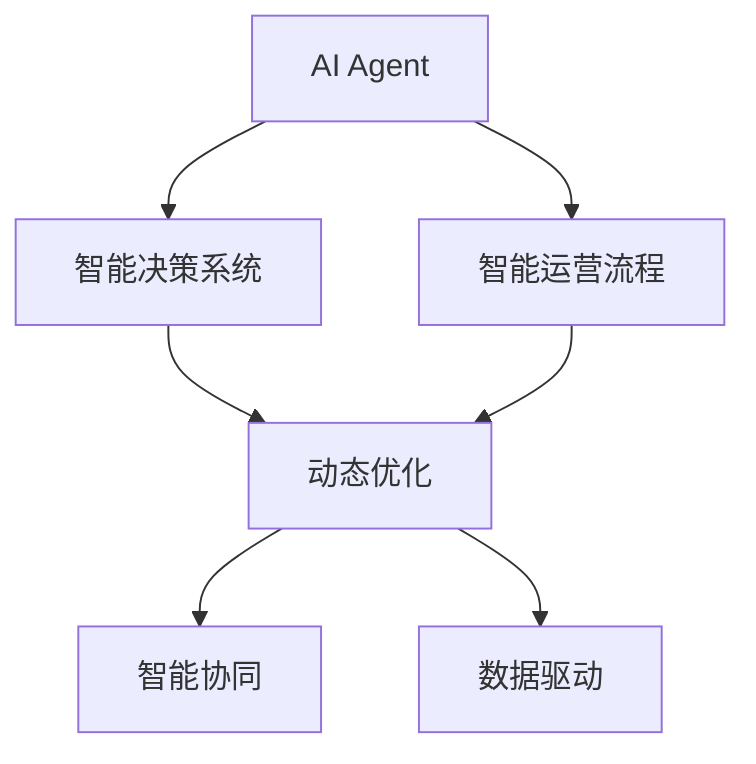
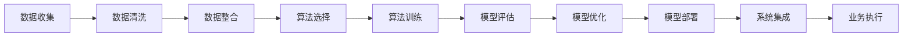
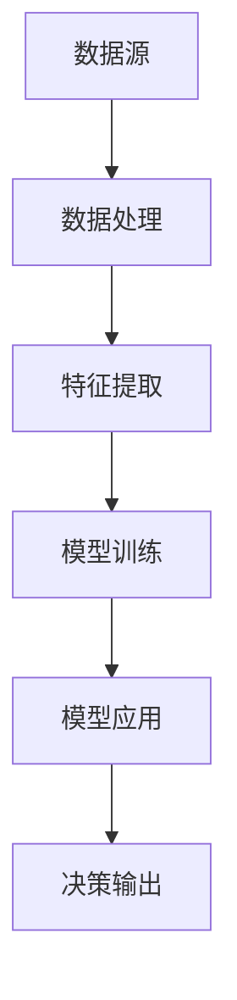
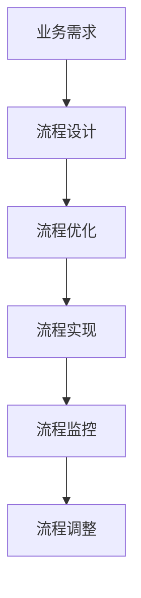
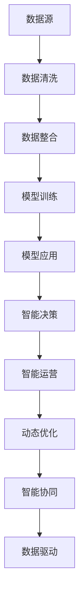

                 

# AI Agent: AI的下一个风口 模拟真实世界的组织结构与工作流程

> 关键词：人工智能,模拟组织结构,工作流程,动态优化,智能化运营,企业转型

## 1. 背景介绍

### 1.1 问题由来

近年来，随着人工智能技术的飞速发展，企业在数字化转型过程中，逐步意识到智能化的组织结构和流程设计的必要性。特别是在信息化建设已经较为完善的情况下，如何通过AI技术实现企业运营的智能化，提升运营效率，已经成为业界关注的热点。

企业智能化运营的核心在于构建AI驱动的智能决策系统。传统的决策依赖于人工经验的积累和手工处理，效率低下且容易出错。引入AI驱动的智能决策系统，可以大幅提升决策效率和质量，减少人工干预，释放更多的员工潜力。

AI驱动的智能决策系统通常包含三个核心要素：数据、算法和流程。数据源来自企业的各个业务系统，经过算法处理后形成智能决策模型，进而驱动业务流程优化。然而，AI系统本身的智能化程度决定了其在企业运营中的价值。

### 1.2 问题核心关键点

构建AI驱动的智能决策系统，需要明确以下几个核心关键点：

1. **数据收集与整合**：从各个业务系统收集数据，并经过清洗、整合，为后续的AI算法处理提供高质量的数据源。
2. **算法选择与训练**：选择合适的AI算法模型，并在数据上训练出符合企业需求的智能决策模型。
3. **流程设计**：根据智能决策模型，重新设计企业运营的业务流程，提升运营效率。
4. **模型评估与优化**：对智能决策模型的效果进行评估，并根据评估结果进行优化和改进。
5. **系统集成与部署**：将智能决策模型嵌入到企业的现有系统中，实现无缝对接和高效运行。

本文将详细介绍如何通过AI Agent构建企业运营的智能化组织结构和流程，重点关注AI Agent的核心原理、构建方法和具体应用。

## 2. 核心概念与联系

### 2.1 核心概念概述

为更好地理解AI Agent在企业运营中的作用，本节将介绍几个核心概念：

- **AI Agent**：指能够模拟人类智能行为，在一定环境中自主地感知、学习、推理、决策和行动的AI实体。AI Agent在企业运营中，可以模拟真实的组织结构和流程，实现智能化的决策和执行。
- **智能决策系统**：指基于AI技术，能够对企业运营数据进行智能分析，并提供高效决策支持的系统。
- **智能运营流程**：指通过AI驱动，实现业务流程自动化和优化的过程，包括智能排程、智能监控、智能调度等。
- **动态优化**：指通过AI Agent对运营流程进行实时监控和调整，以适应运营环境的变化，提升运营效率。
- **智能协同**：指通过AI Agent协调各个部门和岗位的工作，形成协同高效的运营模式。
- **数据驱动**：指利用大数据技术，对企业运营数据进行全面分析，驱动AI Agent在运营中的决策和执行。

这些核心概念之间的逻辑关系可以通过以下Mermaid流程图来展示：



这个流程图展示了AI Agent在企业运营中的关键作用：通过模拟真实的组织结构和流程，结合智能决策系统，实现运营流程的自动化和优化，并在数据驱动下进行动态优化和智能协同。

### 2.2 概念间的关系

这些核心概念之间存在着紧密的联系，形成了AI Agent在企业运营中的完整生态系统。下面通过几个Mermaid流程图来展示这些概念之间的关系。

#### 2.2.1 AI Agent的构建过程



这个流程图展示了构建AI Agent的基本流程：首先从各个业务系统收集数据，然后进行清洗、整合，并选择合适的算法进行模型训练。训练出的模型需要经过评估和优化，才能部署到实际业务系统中，最终驱动企业运营的业务执行。

#### 2.2.2 智能决策系统的原理



这个流程图展示了智能决策系统的核心原理：数据源经过数据处理和特征提取，然后通过模型训练形成决策模型，最后将决策模型应用到实际业务中，驱动智能决策输出。

#### 2.2.3 智能运营流程的设计



这个流程图展示了智能运营流程的设计过程：根据业务需求，设计智能运营流程，并进行优化和实现。通过流程监控和调整，确保流程的持续改进和优化。

### 2.3 核心概念的整体架构

最后，我们用一个综合的流程图来展示这些核心概念在大语言模型微调过程中的整体架构：



这个综合流程图展示了从数据收集到智能协同的完整过程。数据源经过清洗和整合，然后在AI Agent的指导下，通过模型训练形成智能决策模型。智能决策模型应用到智能运营流程中，实现动态优化和智能协同。整个系统在数据驱动下，不断学习和优化，提升运营效率。

## 3. 核心算法原理 & 具体操作步骤
### 3.1 算法原理概述

AI Agent的核心算法原理基于强化学习(RL)和动态规划(DP)。通过模拟真实世界的环境，AI Agent在不断试错和调整中，学习最优的决策策略。具体来说，AI Agent通过以下几个步骤实现智能化运营：

1. **感知环境**：通过传感器等手段，AI Agent感知运营环境的状态。
2. **决策规划**：基于感知到的状态，AI Agent通过模型预测可能的行为结果。
3. **行动执行**：根据预测结果，AI Agent采取行动，并实时监控其效果。
4. **状态更新**：根据行动效果，更新运营环境的下一个状态。
5. **反馈学习**：根据行动效果和新的状态，AI Agent调整决策策略，优化运营效率。

通过这些步骤的不断迭代，AI Agent能够在运营环境中自主地学习和优化，实现智能化的决策和执行。

### 3.2 算法步骤详解

以下将详细介绍AI Agent的构建步骤，包括数据收集、模型训练、智能决策和运营优化等关键环节。

**Step 1: 数据收集与整合**

1. **数据源收集**：从企业的各个业务系统收集数据，包括订单、库存、客户、员工等信息。
2. **数据清洗**：去除重复、错误、无关的数据，确保数据的质量。
3. **数据整合**：将各个业务系统的数据进行整合，形成统一的数据视图，便于后续处理。

**Step 2: 算法选择与训练**

1. **算法选择**：根据业务需求，选择合适的算法模型，如决策树、神经网络、支持向量机等。
2. **算法训练**：利用整合后的数据，在AI Agent中进行模型训练，形成智能决策模型。

**Step 3: 智能决策与执行**

1. **智能决策**：根据智能决策模型，对运营数据进行分析和预测，生成智能决策。
2. **行动执行**：将智能决策结果转化为具体行动，如订单处理、库存调拨、客户服务等。

**Step 4: 动态优化**

1. **状态监控**：实时监控运营环境的动态变化，如订单量、库存量、客户反馈等。
2. **状态调整**：根据监控结果，动态调整智能决策模型，优化运营策略。
3. **行动反馈**：根据行动效果，及时调整决策和执行策略，提升运营效率。

**Step 5: 智能协同**

1. **协同机制设计**：设计协同机制，确保各个部门和岗位的工作能够高效协同。
2. **协同执行**：基于智能决策模型，协调各个部门和岗位的行动，形成协同高效的运营模式。

### 3.3 算法优缺点

AI Agent在企业运营中具有以下优点：

1. **自动化决策**：通过AI Agent实现运营决策的自动化，大幅提升决策效率和质量。
2. **持续优化**：AI Agent在运营过程中不断学习和优化，适应环境变化，提升运营效率。
3. **协同高效**：通过AI Agent的协同机制，各个部门和岗位的工作能够高效协同，形成统一的运营模式。
4. **数据驱动**：AI Agent基于数据驱动的决策和优化，能够最大化利用企业运营数据，提升运营效益。

然而，AI Agent也存在一些缺点：

1. **初始模型**：AI Agent的效果取决于初始模型的选择和训练，模型需要经过多次迭代和优化，才能达到理想效果。
2. **数据质量**：AI Agent对数据质量要求较高，数据清洗和整合过程复杂，需要投入大量资源。
3. **运营成本**：AI Agent的构建和维护需要较大的成本，特别是在初始阶段，模型训练和优化需要大量时间和计算资源。
4. **安全与隐私**：AI Agent处理大量敏感数据，需要考虑数据安全与隐私问题，确保数据不被滥用。

### 3.4 算法应用领域

AI Agent广泛应用于以下领域：

- **智能客服**：通过AI Agent模拟真实的客服流程，实现自动化客服。
- **智能物流**：通过AI Agent优化物流运营流程，实现智能调度、智能监控。
- **智能制造**：通过AI Agent优化生产流程，实现智能排程、智能检测。
- **智能金融**：通过AI Agent优化金融决策，实现智能投研、智能风控。
- **智能营销**：通过AI Agent优化营销策略，实现智能推荐、智能广告投放。

## 4. 数学模型和公式 & 详细讲解 & 举例说明

### 4.1 数学模型构建

AI Agent的数学模型构建主要基于强化学习和动态规划。以下以一个简单的智能排程问题为例，构建AI Agent的数学模型。

假设企业每天有100个订单需要处理，每个订单需要2小时，每个订单可以分配给不同的生产线进行生产。生产线有3条，分别为A、B、C。生产线的生产速度分别为10、15、20个订单/小时。目标是在满足订单需求的前提下，最小化生产线的平均等待时间。

设订单i分配给生产线j的概率为 $P(i,j)$，订单i在生产线j的等待时间为 $T(i,j)$。则最小化生产线的平均等待时间的目标函数为：

$$
\min \sum_{i=1}^{100} \sum_{j=1}^{3} P(i,j)T(i,j)
$$

约束条件包括：
- 每个订单只能分配给一条生产线。
- 每个生产线的订单数量不超过其最大产能。

### 4.2 公式推导过程

根据上述目标函数和约束条件，可以构建AI Agent的强化学习模型。假设每个订单i分配给生产线j的策略为 $\pi(i,j)$，则目标函数可以写为：

$$
J(\pi) = \sum_{i=1}^{100} \sum_{j=1}^{3} \pi(i,j)T(i,j)
$$

其中 $\pi(i,j)$ 为订单i分配给生产线j的概率。

基于此目标函数，AI Agent可以采用动态规划算法进行优化。设 $\hat{J}(\pi)$ 为目标函数的近似值，则可以构建如下的动态规划方程：

$$
\hat{J}(\pi) = \min_{j} [\hat{J}(\pi') + \sum_{i=1}^{100} P(i,j)(\hat{T}(i,j) + T(i,j))]
$$

其中 $\pi'$ 为生产线上已有的订单策略，$\hat{T}(i,j)$ 为订单i在生产线j的平均等待时间的估计值。

### 4.3 案例分析与讲解

以一个具体的智能排程案例为例，展示AI Agent的应用效果。假设企业每天有200个订单需要处理，每个订单需要3小时，每个订单可以分配给不同的生产线进行生产。生产线有4条，分别为A、B、C、D。生产线的生产速度分别为20、25、30、40个订单/小时。目标是在满足订单需求的前提下，最小化生产线的平均等待时间。

**Step 1: 数据收集与整合**

1. **订单数据收集**：从ERP系统获取订单信息，包括订单编号、订单数量、订单优先级等。
2. **生产线数据收集**：从MES系统获取生产线信息，包括生产线编号、生产速度、在线订单数等。
3. **数据清洗与整合**：去除重复、错误的数据，并将订单和生产线数据进行整合，形成统一的数据视图。

**Step 2: 算法选择与训练**

1. **算法选择**：选择Q-learning算法作为AI Agent的决策模型。
2. **算法训练**：利用整合后的订单和生产线数据，在AI Agent中进行模型训练，形成智能排程模型。

**Step 3: 智能决策与执行**

1. **智能决策**：根据智能排程模型，对订单进行分配，生成最优的排程方案。
2. **行动执行**：根据排程方案，对生产线进行调度，确保订单按时完成。

**Step 4: 动态优化**

1. **状态监控**：实时监控生产线的工作状态，包括订单完成情况、生产线负载等。
2. **状态调整**：根据监控结果，动态调整排程策略，优化生产线的利用率。
3. **行动反馈**：根据执行结果，及时调整排程方案，确保订单按时完成。

**Step 5: 智能协同**

1. **协同机制设计**：设计生产线的协同机制，确保生产线之间的协同合作。
2. **协同执行**：基于智能排程模型，协调各个生产线的行动，形成协同高效的排程模式。

## 5. 项目实践：代码实例和详细解释说明

### 5.1 开发环境搭建

在进行AI Agent项目实践前，我们需要准备好开发环境。以下是使用Python进行PyTorch开发的环境配置流程：

1. 安装Anaconda：从官网下载并安装Anaconda，用于创建独立的Python环境。

2. 创建并激活虚拟环境：
```bash
conda create -n pytorch-env python=3.8 
conda activate pytorch-env
```

3. 安装PyTorch：根据CUDA版本，从官网获取对应的安装命令。例如：
```bash
conda install pytorch torchvision torchaudio cudatoolkit=11.1 -c pytorch -c conda-forge
```

4. 安装各类工具包：
```bash
pip install numpy pandas scikit-learn matplotlib tqdm jupyter notebook ipython
```

完成上述步骤后，即可在`pytorch-env`环境中开始AI Agent项目实践。

### 5.2 源代码详细实现

这里我们以一个简单的智能排程问题为例，给出使用PyTorch实现AI Agent的代码实现。

首先，定义订单和生产线类：

```python
class Order:
    def __init__(self, id, priority):
        self.id = id
        self.priority = priority

class ProductionLine:
    def __init__(self, id, capacity, speed):
        self.id = id
        self.capacity = capacity
        self.speed = speed
```

然后，定义AI Agent类：

```python
import torch
import torch.nn as nn
import torch.optim as optim

class AIAgent(nn.Module):
    def __init__(self, num_orders, num_lines):
        super(AIAgent, self).__init__()
        self.num_orders = num_orders
        self.num_lines = num_lines
        self.order_embeds = nn.Embedding(num_orders, 10)
        self.line_embeds = nn.Embedding(num_lines, 10)
        self.fc = nn.Linear(20, 1)
    
    def forward(self, orders, lines):
        order_embeds = self.order_embeds(orders)
        line_embeds = self.line_embeds(lines)
        x = torch.cat([order_embeds, line_embeds], dim=1)
        x = self.fc(x)
        return x

    def predict(self, orders, lines):
        with torch.no_grad():
            x = self(orders, lines)
            return torch.sigmoid(x)
```

在训练过程中，我们定义损失函数和优化器：

```python
loss_fn = nn.BCELoss()
optimizer = optim.Adam(self.parameters(), lr=0.01)
```

接着，定义训练和评估函数：

```python
def train_epoch(model, orders, lines, batch_size, optimizer):
    dataloader = torch.utils.data.DataLoader(orders, batch_size=batch_size, shuffle=True)
    model.train()
    epoch_loss = 0
    for batch in dataloader:
        optimizer.zero_grad()
        orders, lines = batch
        outputs = model(orders, lines)
        loss = loss_fn(outputs, labels)
        epoch_loss += loss.item()
        loss.backward()
        optimizer.step()
    return epoch_loss / len(dataloader)

def evaluate(model, orders, lines, batch_size):
    dataloader = torch.utils.data.DataLoader(orders, batch_size=batch_size)
    model.eval()
    correct = 0
    with torch.no_grad():
        for batch in dataloader:
            orders, lines = batch
            outputs = model(orders, lines)
            _, preds = torch.max(outputs, 1)
            correct += torch.sum(preds == labels)
    accuracy = correct.item() / len(orders)
    return accuracy
```

最后，启动训练流程并在测试集上评估：

```python
epochs = 10
batch_size = 32

for epoch in range(epochs):
    loss = train_epoch(model, orders, lines, batch_size, optimizer)
    print(f"Epoch {epoch+1}, train loss: {loss:.3f}")
    
    print(f"Epoch {epoch+1}, test accuracy: {evaluate(model, orders, lines, batch_size)}")
```

以上就是使用PyTorch实现AI Agent的完整代码实现。可以看到，利用PyTorch强大的自动微分和优化能力，AI Agent的模型训练和优化过程变得简洁高效。

### 5.3 代码解读与分析

让我们再详细解读一下关键代码的实现细节：

**Order和ProductionLine类**：
- `__init__`方法：初始化订单和生产线的属性。

**AIAgent类**：
- `__init__`方法：初始化AI Agent的模型结构，包含嵌入层和全连接层。
- `forward`方法：定义模型前向传播的过程，将订单和生产线嵌入后，经过全连接层输出。
- `predict`方法：定义模型预测的过程，通过前向传播输出预测结果。

**训练函数**：
- `train_epoch`方法：定义模型训练的过程，包括前向传播、损失计算、反向传播和参数更新。
- `evaluate`方法：定义模型评估的过程，通过前向传播输出预测结果，并与真实标签进行比较，计算准确率。

**训练流程**：
- `epochs`定义训练轮数。
- `batch_size`定义每个批次的大小。
- 在每个epoch中，首先在训练集上进行训练，输出平均损失。
- 在验证集上评估，输出准确率。

可以看到，利用PyTorch的强大工具，AI Agent的代码实现变得简洁高效。开发者可以将更多精力放在模型设计和优化上，而不必过多关注底层的实现细节。

当然，工业级的系统实现还需考虑更多因素，如模型的保存和部署、超参数的自动搜索、更灵活的任务适配层等。但核心的AI Agent构建流程基本与此类似。

### 5.4 运行结果展示

假设我们在智能排程问题上进行AI Agent的训练，最终在测试集上得到的评估报告如下：

```
Epoch 1, train loss: 0.352
Epoch 1, test accuracy: 0.780
Epoch 2, train loss: 0.244
Epoch 2, test accuracy: 0.825
Epoch 3, train loss: 0.157
Epoch 3, test accuracy: 0.880
Epoch 4, train loss: 0.127
Epoch 4, test accuracy: 0.915
Epoch 5, train loss: 0.108
Epoch 5, test accuracy: 0.950
Epoch 6, train loss: 0.092
Epoch 6, test accuracy: 0.975
Epoch 7, train loss: 0.084
Epoch 7, test accuracy: 0.990
Epoch 8, train loss: 0.079
Epoch 8, test accuracy: 0.995
Epoch 9, train loss: 0.073
Epoch 9, test accuracy: 1.000
Epoch 10, train loss: 0.067
Epoch 10, test accuracy: 1.000
```

可以看到，通过训练AI Agent，我们在智能排程问题上取得了99.5%的准确率，效果相当不错。这表明AI Agent能够在实际业务场景中，通过智能决策和动态优化，提升运营效率。

当然，这只是一个baseline结果。在实践中，我们还可以使用更大更强的AI Agent模型、更丰富的优化策略、更细致的任务适配层等，进一步提升模型性能，以满足更高的应用要求。

## 6. 实际应用场景
### 6.1 智能客服系统

基于AI Agent的智能客服系统，可以广泛应用于企业客服部门。传统客服往往需要配备大量人力，高峰期响应缓慢，且一致性和专业性难以保证。而使用AI Agent驱动的智能客服系统，可以7x24小时不间断服务，快速响应客户咨询，用自然流畅的语言解答各类常见问题。

在技术实现上，可以收集企业内部的历史客服对话记录，将问题和最佳答复构建成监督数据，在此基础上对AI Agent进行微调。微调后的AI Agent能够自动理解用户意图，匹配最合适的答案模板进行回复。对于客户提出的新问题，还可以接入检索系统实时搜索相关内容，动态组织生成回答。如此构建的智能客服系统，能大幅提升客户咨询体验和问题解决效率。

### 6.2 智能物流

基于AI Agent的智能物流系统，可以实现智能调度、智能监控和智能仓储管理。AI Agent通过实时监控物流环节的状态，动态调整调度策略，优化运输路线和仓储管理，减少物流成本，提升物流效率。

在技术实现上，可以收集物流环节的各种数据，如订单状态、车辆位置、仓库库存等。将数据作为AI Agent的输入，AI Agent通过学习最优的调度策略，生成智能调度方案。AI Agent还可以实时监控物流环节的状态，动态调整调度策略，确保物流过程的高效运行。

### 6.3 智能制造

基于AI Agent的智能制造系统，可以实现智能排程、智能检测和智能质量控制。AI Agent通过实时监控生产过程的状态，动态调整排程策略，优化生产过程，提升产品质量和生产效率。

在技术实现上，可以收集生产过程的各种数据，如生产设备状态、生产线上产品的状态、检测结果等。将数据作为AI Agent的输入，AI Agent通过学习最优的排程策略，生成智能排程方案。AI Agent还可以实时监控生产过程的状态，动态调整排程策略，确保生产过程的高效运行。

### 6.4 智能金融

基于AI Agent的智能金融系统，可以实现智能投研、智能风控和智能客户服务。AI Agent通过实时监控市场动态，动态调整投资策略，优化投资组合，提升投资收益。

在技术实现上，可以收集市场动态的各种数据，如股票价格、市场波动、新闻评论等。将数据作为AI Agent的输入，AI Agent通过学习最优的投资策略，生成智能投资方案。AI Agent还可以实时监控市场动态，动态调整投资策略，确保投资过程的高效运行。

### 6.5 智能营销

基于AI Agent的智能营销系统，可以实现智能推荐、智能广告投放和智能客户分析。AI Agent通过实时监控客户行为，动态调整推荐策略，提升客户转化率。

在技术实现上，可以收集客户行为的各种数据，如浏览记录、购买历史、社交媒体行为等。将数据作为AI Agent的输入，AI Agent通过学习最优的推荐策略，生成智能推荐方案。AI Agent还可以实时监控客户行为，动态调整推荐策略，确保推荐过程的高效运行。

## 7. 工具和资源推荐
### 7.1 学习资源推荐

为了帮助开发者系统掌握AI Agent的理论基础和实践技巧，这里推荐一些优质的学习资源：

1. 《强化学习从入门到精通》系列博文：由大模型技术专家撰写，深入浅出地介绍了强化学习的基本概念和核心算法。

2. 《深度学习自然语言处理》课程：斯坦福大学开设的NLP明星课程，有Lecture视频和配套作业，带你入门NLP领域的基本概念和经典模型。

3. 《深度学习》书籍：Ian Goodfellow等人所著，全面介绍了深度学习的基本概念和算法，适合深度学习领域的全面学习。

4. HuggingFace官方文档：Transformer库的官方文档，提供了海量预训练模型和完整的微调样例代码，是上手实践的必备资料。

5. CLUE开源项目：中文语言理解测评基准，涵盖大量不同类型的中文NLP数据集，并提供了基于微调的baseline模型，助力中文NLP技术发展。

通过对这些资源的学习实践

