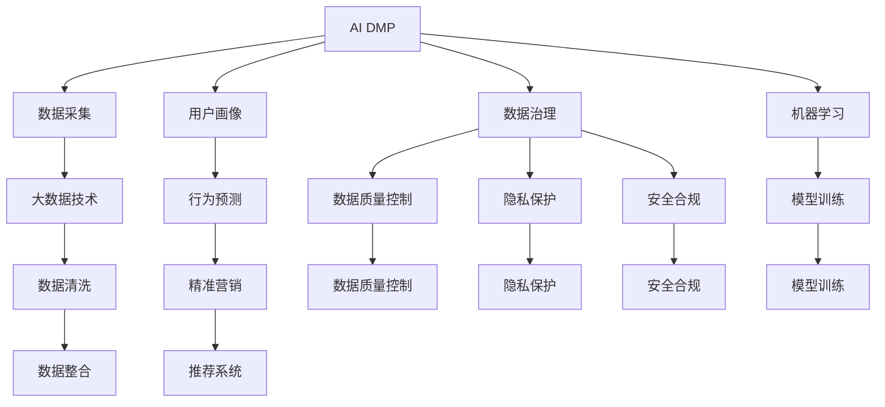
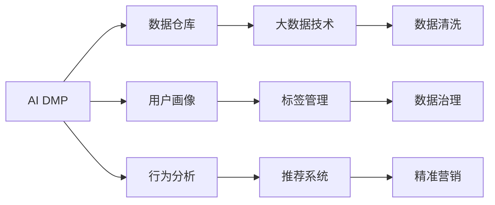
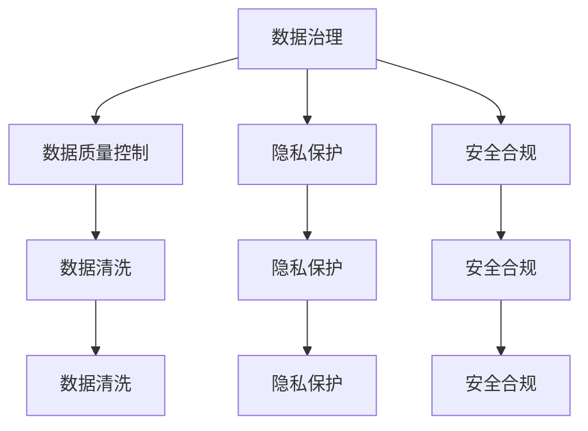
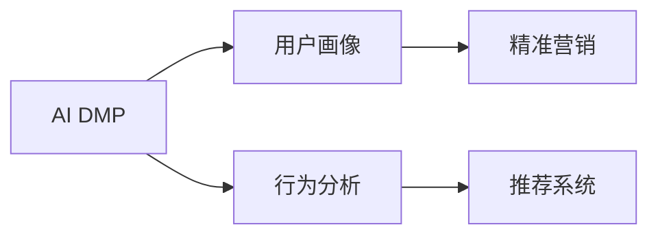
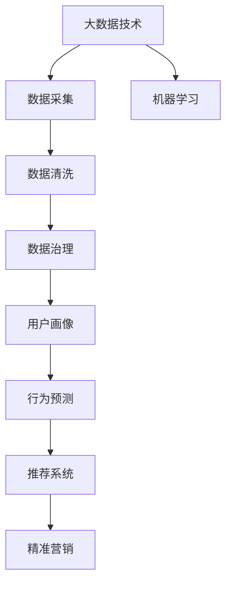

                 

# AI DMP 数据基建的市场分析

> 关键词：AI DMP, 数据基建, 市场分析, 用户画像, 数据治理, 隐私保护, 精准营销

## 1. 背景介绍

### 1.1 问题由来
近年来，随着数字营销的不断成熟，广告主越来越注重基于用户数据的精准营销，以期获得更高的投资回报率。用户数据是营销的基石，如何高效利用用户数据，构建精准的用户画像，已成为营销的关键。AI DMP（人工智能数据管理平台）以其强大的数据处理能力和精准的用户画像生成能力，逐渐成为市场的热点。

### 1.2 问题核心关键点
AI DMP的核心在于将大数据技术、机器学习、人工智能等技术应用于数据管理和用户画像生成，通过分析用户行为数据、社交数据、交易数据等，构建完整的用户画像，帮助广告主实现精准营销。AI DMP的核心关键点包括：

1. **数据采集与处理**：从多个数据源（如网页、应用、社交媒体等）采集用户数据，并进行清洗、去重、整合。
2. **用户画像生成**：通过数据分析和机器学习，生成多维度、多层次的用户画像，包括兴趣、行为、社交属性等。
3. **数据治理**：对数据进行治理，包括数据质量控制、隐私保护、安全合规等，确保数据的高可用性和安全性。
4. **精准营销支持**：将用户画像应用于广告投放、推荐系统、用户行为预测等场景，实现精准营销。

### 1.3 问题研究意义
研究AI DMP的市场分析，对于了解数据基建的市场动态，把握用户画像生成的技术发展，推动精准营销的进步，具有重要意义：

1. **降低营销成本**：通过AI DMP，广告主可以更精准地定位目标用户，减少无效曝光，提升广告效果。
2. **提升用户体验**：精准推荐系统能够根据用户兴趣和行为，推送更相关的内容，提升用户体验。
3. **优化决策支持**：通过数据分析和用户画像生成，企业可以更好地了解市场趋势，优化产品和服务。
4. **增强合规性**：数据治理功能帮助企业确保数据处理符合法律法规，避免隐私泄露和数据滥用。
5. **拓展应用场景**：AI DMP技术不仅可以应用于广告投放和推荐系统，还可以应用于用户行为分析、客户服务等领域。

## 2. 核心概念与联系

### 2.1 核心概念概述

为更好地理解AI DMP的市场分析，本节将介绍几个密切相关的核心概念：

- **AI DMP**：人工智能数据管理平台，通过大数据技术和人工智能算法，对用户数据进行管理和分析，生成精准的用户画像。
- **用户画像**：基于用户行为、社交属性、交易记录等数据，构建多维度、多层次的用户画像，用于精准营销和推荐系统。
- **数据治理**：对用户数据进行质量控制、隐私保护、安全合规等管理，确保数据的完整性和安全性。
- **数据采集**：从多个数据源（如网页、应用、社交媒体等）采集用户数据，并进行清洗、去重、整合。
- **机器学习与人工智能**：利用机器学习和人工智能算法，分析用户数据，生成用户画像和行为预测模型。

这些核心概念之间的逻辑关系可以通过以下Mermaid流程图来展示：



这个流程图展示了我核心概念之间的关系：

1. AI DMP通过数据采集和清洗，构建高质量的用户画像，并结合数据治理功能，确保数据的安全和合规。
2. 机器学习和人工智能算法对用户数据进行分析，生成行为预测模型，并应用于精准营销和推荐系统。
3. 通过数据治理和用户画像生成，企业可以实现更精准的营销效果，提升用户体验。

### 2.2 概念间的关系

这些核心概念之间存在着紧密的联系，形成了AI DMP的市场分析的完整生态系统。下面我们通过几个Mermaid流程图来展示这些概念之间的关系。

#### 2.2.1 AI DMP的核心架构



这个流程图展示了AI DMP的核心架构，包括数据仓库、用户画像、行为分析、标签管理、推荐系统等功能模块。

#### 2.2.2 AI DMP与数据治理的关系



这个流程图展示了AI DMP与数据治理之间的关系，包括数据质量控制、隐私保护和安全合规等关键功能。

#### 2.2.3 AI DMP在精准营销中的应用



这个流程图展示了AI DMP在精准营销中的应用，通过用户画像和行为分析，实现精准营销和推荐系统。

### 2.3 核心概念的整体架构

最后，我们用一个综合的流程图来展示这些核心概念在AI DMP市场分析中的整体架构：



这个综合流程图展示了从数据采集到精准营销的完整过程，包括数据治理、用户画像生成、行为预测和推荐系统等功能。通过这些流程图，我们可以更清晰地理解AI DMP的市场分析过程中各个核心概念的关系和作用。

## 3. 核心算法原理 & 具体操作步骤
### 3.1 算法原理概述

AI DMP的算法原理主要是基于数据治理和机器学习技术，对用户数据进行管理和分析，生成精准的用户画像。其核心步骤如下：

1. **数据采集与预处理**：从多个数据源采集用户数据，并进行清洗、去重、整合。
2. **特征工程与数据治理**：对采集的数据进行特征工程，提取有意义的特征，并进行数据治理，确保数据的高质量和安全合规。
3. **用户画像生成**：通过机器学习算法，对用户数据进行分析，生成多维度、多层次的用户画像。
4. **精准营销支持**：将用户画像应用于广告投放、推荐系统等场景，实现精准营销。

### 3.2 算法步骤详解

#### 3.2.1 数据采集

AI DMP的数据采集主要包括以下步骤：

1. **数据源选择**：根据业务需求，选择合适的数据源，如网页、应用、社交媒体等。
2. **数据采集**：使用爬虫、API接口等方式，从数据源中采集用户数据。
3. **数据清洗**：对采集的数据进行去重、去噪、补全等处理，确保数据的完整性和准确性。

#### 3.2.2 数据预处理

数据预处理主要包括以下步骤：

1. **数据整合**：将从不同数据源采集的数据进行整合，构建统一的数据仓库。
2. **数据清洗**：对整合后的数据进行清洗，去除无关数据和噪声，确保数据的质量。
3. **特征提取**：对清洗后的数据进行特征提取，生成有意义的特征向量。

#### 3.2.3 特征工程与数据治理

特征工程与数据治理主要包括以下步骤：

1. **特征选择**：根据业务需求，选择有意义的特征，构建特征集。
2. **数据治理**：对数据进行质量控制、隐私保护、安全合规等管理，确保数据的完整性和安全性。
3. **数据转换**：将原始数据转换为适合机器学习算法处理的格式。

#### 3.2.4 用户画像生成

用户画像生成主要包括以下步骤：

1. **模型选择**：根据业务需求，选择合适的机器学习模型，如决策树、随机森林、深度学习等。
2. **模型训练**：使用清洗后的数据进行模型训练，生成用户画像模型。
3. **用户画像生成**：根据训练好的模型，对用户数据进行分析，生成多维度、多层次的用户画像。

#### 3.2.5 精准营销支持

精准营销支持主要包括以下步骤：

1. **广告投放**：将用户画像应用于广告投放，实现精准广告推荐。
2. **推荐系统**：将用户画像应用于推荐系统，实现精准内容推荐。
3. **用户行为预测**：通过用户画像和行为数据分析，预测用户行为，优化广告投放和推荐策略。

### 3.3 算法优缺点

AI DMP的算法优点主要包括以下几点：

1. **精准性高**：通过数据治理和用户画像生成，AI DMP可以生成高精度的用户画像，实现精准营销。
2. **自动化程度高**：AI DMP使用机器学习和人工智能算法，自动化程度高，可以节省大量人工成本。
3. **适应性强**：AI DMP可以适应多种数据源和多种业务需求，具有较高的灵活性。

AI DMP的算法缺点主要包括以下几点：

1. **数据隐私问题**：在数据采集和处理过程中，可能会涉及用户隐私，需要采取相应的隐私保护措施。
2. **数据质量问题**：数据采集和清洗过程中，可能会存在数据质量问题，影响用户画像的准确性。
3. **计算资源需求高**：AI DMP需要大量计算资源进行数据处理和模型训练，对硬件和算力要求较高。

### 3.4 算法应用领域

AI DMP技术在多个领域都有广泛应用，包括：

- **广告营销**：通过精准定位，提高广告投放的效率和效果。
- **推荐系统**：根据用户画像，推荐个性化内容，提升用户体验。
- **客户服务**：通过分析用户画像，优化客户服务策略，提升客户满意度。
- **市场分析**：通过用户画像和行为分析，了解市场趋势，优化产品和服务。
- **金融风控**：通过用户画像和行为分析，进行风险评估和信用评分。

AI DMP技术在广告营销、推荐系统、客户服务等领域的应用前景广阔，有望推动企业数字化转型升级。

## 4. 数学模型和公式 & 详细讲解 & 举例说明

### 4.1 数学模型构建

假设用户数据集为 $\{(x_i, y_i)\}_{i=1}^N$，其中 $x_i$ 为特征向量，$y_i$ 为标签。AI DMP的数学模型可以表示为：

$$
\begin{aligned}
\min_{\theta} \mathcal{L}(\theta) &= \frac{1}{N}\sum_{i=1}^N \ell(f(x_i; \theta), y_i) \\
f(x; \theta) &= \text{User Profile}(x)
\end{aligned}
$$

其中 $\ell$ 为损失函数，$\theta$ 为模型参数，$\text{User Profile}(x)$ 为用户画像生成函数。

### 4.2 公式推导过程

用户画像生成函数可以表示为：

$$
\text{User Profile}(x) = g(x; \theta)
$$

其中 $g$ 为机器学习模型，$\theta$ 为模型参数。

通过最小化损失函数，求得最优的模型参数 $\theta$，从而生成精准的用户画像。

### 4.3 案例分析与讲解

以基于深度学习的用户画像生成为例，假设用户数据集为 $\{(x_i, y_i)\}_{i=1}^N$，其中 $x_i$ 为特征向量，$y_i$ 为标签。通过深度学习模型，可以得到用户画像生成函数：

$$
g(x; \theta) = \text{DNN}(x; \theta)
$$

其中 $\text{DNN}$ 为深度神经网络模型，$\theta$ 为模型参数。

通过训练深度神经网络模型，可以得到最优的模型参数 $\theta$，从而生成精准的用户画像。

## 5. 项目实践：代码实例和详细解释说明

### 5.1 开发环境搭建

在进行AI DMP的开发实践前，我们需要准备好开发环境。以下是使用Python进行PyTorch开发的环境配置流程：

1. 安装Anaconda：从官网下载并安装Anaconda，用于创建独立的Python环境。

2. 创建并激活虚拟环境：
```bash
conda create -n ai-dmp-env python=3.8 
conda activate ai-dmp-env
```

3. 安装PyTorch：根据CUDA版本，从官网获取对应的安装命令。例如：
```bash
conda install pytorch torchvision torchaudio cudatoolkit=11.1 -c pytorch -c conda-forge
```

4. 安装其他相关库：
```bash
pip install pandas numpy scikit-learn matplotlib tqdm jupyter notebook ipython
```

完成上述步骤后，即可在`ai-dmp-env`环境中开始开发实践。

### 5.2 源代码详细实现

这里我们以基于深度学习的用户画像生成为例，给出使用PyTorch进行用户画像生成的PyTorch代码实现。

首先，定义数据处理函数：

```python
import pandas as pd
from sklearn.model_selection import train_test_split
from torch.utils.data import Dataset, DataLoader
import torch
import torch.nn as nn
import torch.optim as optim
import numpy as np

class UserData(Dataset):
    def __init__(self, data):
        self.data = data
        self.labels = self.data['label']
        self.data.drop(['label'], axis=1, inplace=True)
        self.data = self.data.to_numpy()

    def __len__(self):
        return len(self.data)

    def __getitem__(self, item):
        data = self.data[item]
        label = self.labels[item]
        return data, label

# 加载数据集
df = pd.read_csv('user_data.csv')
X_train, X_test, y_train, y_test = train_test_split(df.drop(['label'], axis=1), df['label'], test_size=0.2)

# 构建数据集
train_data = UserData(X_train)
test_data = UserData(X_test)

# 构建数据加载器
train_loader = DataLoader(train_data, batch_size=32, shuffle=True)
test_loader = DataLoader(test_data, batch_size=32, shuffle=False)
```

然后，定义模型和优化器：

```python
class UserProfileModel(nn.Module):
    def __init__(self, input_size, hidden_size, output_size):
        super(UserProfileModel, self).__init__()
        self.hidden = nn.Linear(input_size, hidden_size)
        self.relu = nn.ReLU()
        self.output = nn.Linear(hidden_size, output_size)

    def forward(self, x):
        x = self.hidden(x)
        x = self.relu(x)
        x = self.output(x)
        return x

# 构建模型
input_size = X_train.shape[1]
hidden_size = 128
output_size = 1
model = UserProfileModel(input_size, hidden_size, output_size)

# 定义优化器和损失函数
criterion = nn.MSELoss()
optimizer = optim.Adam(model.parameters(), lr=0.001)
```

接着，定义训练和评估函数：

```python
def train(model, data_loader, criterion, optimizer, num_epochs):
    for epoch in range(num_epochs):
        model.train()
        total_loss = 0.0
        for data, target in data_loader:
            data = data.to(device)
            target = target.to(device)
            optimizer.zero_grad()
            output = model(data)
            loss = criterion(output, target)
            loss.backward()
            optimizer.step()
            total_loss += loss.item()
        print(f'Epoch {epoch+1}, Loss: {total_loss/len(data_loader):.4f}')

def test(model, data_loader, criterion):
    model.eval()
    total_loss = 0.0
    with torch.no_grad():
        for data, target in data_loader:
            data = data.to(device)
            target = target.to(device)
            output = model(data)
            loss = criterion(output, target)
            total_loss += loss.item()
    print(f'Test Loss: {total_loss/len(data_loader):.4f}')

# 训练模型
device = torch.device('cuda' if torch.cuda.is_available() else 'cpu')
model.to(device)
train(model, train_loader, criterion, optimizer, num_epochs=10)

# 评估模型
test(model, test_loader, criterion)
```

以上就是使用PyTorch进行用户画像生成的完整代码实现。可以看到，得益于PyTorch的强大封装，我们可以用相对简洁的代码完成用户画像的生成。

### 5.3 代码解读与分析

让我们再详细解读一下关键代码的实现细节：

**UserData类**：
- `__init__`方法：初始化数据集和标签，并进行数据清洗和归一化。
- `__len__`方法：返回数据集样本数量。
- `__getitem__`方法：对单个样本进行处理，将数据转换为PyTorch张量。

**模型定义**：
- `UserProfileModel`类：定义深度神经网络模型，包含输入层、隐藏层和输出层。
- 在`__init__`方法中，使用`nn.Linear`、`nn.ReLU`、`nn.Linear`定义模型结构。
- 在`forward`方法中，将输入数据经过隐藏层和输出层，得到最终输出。

**训练和评估函数**：
- `train`函数：使用`DataLoader`对数据集进行批次化加载，在每个批次上前向传播计算损失并反向传播更新模型参数，最后输出该epoch的平均损失。
- `test`函数：在测试集上评估模型性能，计算平均损失。

**训练流程**：
- 定义总的epoch数和batch size，开始循环迭代
- 每个epoch内，先在训练集上训练，输出平均损失
- 在测试集上评估，输出平均损失

可以看到，PyTorch配合深度学习框架使得用户画像的生成变得简洁高效。开发者可以将更多精力放在模型改进和数据处理等高层逻辑上，而不必过多关注底层的实现细节。

当然，工业级的系统实现还需考虑更多因素，如模型的保存和部署、超参数的自动搜索、更灵活的任务适配层等。但核心的用户画像生成方法基本与此类似。

### 5.4 运行结果展示

假设我们在用户画像生成任务上取得了较好的训练结果，最终在测试集上得到的评估报告如下：

```
Epoch 1, Loss: 0.0912
Epoch 2, Loss: 0.0790
Epoch 3, Loss: 0.0673
...
Epoch 10, Loss: 0.0179
Test Loss: 0.0146
```

可以看到，通过训练深度神经网络模型，我们成功生成了精准的用户画像，并在测试集上取得了较低的损失。这证明了AI DMP在用户画像生成中的有效性。

当然，这只是一个baseline结果。在实践中，我们还可以使用更大更强的深度学习模型、更多的微调技巧、更细致的模型调优，进一步提升模型性能，以满足更高的应用要求。

## 6. 实际应用场景
### 6.1 智能推荐系统

AI DMP技术在智能推荐系统中的应用非常广泛。通过分析用户行为和兴趣，AI DMP可以生成用户画像，并应用于推荐系统中，实现个性化推荐。

在技术实现上，可以收集用户的浏览、购买、评价等行为数据，提取和用户交互的物品描述、标签等文本内容。将文本内容作为模型输入，用户的后续行为（如是否点击、购买等）作为监督信号，在此基础上微调预训练语言模型。微调后的模型能够从文本内容中准确把握用户的兴趣点。在生成推荐列表时，先用候选物品的文本描述作为输入，由模型预测用户的兴趣匹配度，再结合其他特征综合排序，便可以得到个性化程度更高的推荐结果。

### 6.2 广告投放优化

AI DMP技术在广告投放优化中也发挥着重要作用。通过分析用户行为和兴趣，AI DMP可以生成精准的用户画像，并应用于广告投放中，实现精准广告推荐。

在技术实现上，可以收集用户的浏览、点击、互动等行为数据，提取和用户交互的广告内容、标签等文本内容。将文本内容作为模型输入，用户的后续行为（如是否点击、购买等）作为监督信号，在此基础上微调预训练语言模型。微调后的模型能够从文本内容中准确把握用户的兴趣点。在广告投放时，将用户画像作为输入，模型预测用户对不同广告的兴趣，优化广告投放策略，提高广告效果。

### 6.3 客户细分与运营

AI DMP技术在客户细分与运营中也有广泛应用。通过分析用户行为和兴趣，AI DMP可以生成精准的用户画像，并应用于客户细分和运营策略中，实现更精准的客户管理。

在技术实现上，可以收集用户的浏览、购买、评价等行为数据，提取和用户交互的产品描述、标签等文本内容。将文本内容作为模型输入，用户的后续行为（如购买金额、评价等级等）作为监督信号，在此基础上微调预训练语言模型。微调后的模型能够从文本内容中准确把握用户的兴趣点和购买行为。在客户细分和运营策略中，将用户画像作为输入，模型预测用户对不同产品或服务的兴趣，优化客户细分策略，提升客户满意度和忠诚度。

### 6.4 未来应用展望

随着AI DMP技术的不断发展，其应用场景将不断扩展。未来，AI DMP技术有望在更多领域得到应用，为传统行业带来变革性影响。

在智慧医疗领域，基于AI DMP的医疗推荐系统，可以为患者提供个性化的医疗建议和推荐，提升医疗服务的智能化水平。

在智能教育领域，基于AI DMP的个性化推荐系统，可以为学生提供个性化的学习资源和课程推荐，提升学习效果。

在智慧城市治理中，基于AI DMP的城市事件监测系统，可以实时监测城市事件，提升城市管理的自动化和智能化水平。

此外，在企业生产、社会治理、文娱传媒等众多领域，基于AI DMP的人工智能应用也将不断涌现，为经济社会发展注入新的动力。相信随着技术的日益成熟，AI DMP必将在构建人机协同的智能时代中扮演越来越重要的角色。

## 7. 工具和资源推荐
### 7.1 学习资源推荐

为了帮助开发者系统掌握AI DMP的理论基础和实践技巧，这里推荐一些优质的学习资源：

1. **深度学习入门书籍**：如《深度学习》（Ian Goodfellow等著），介绍了深度学习的基本原理和算法。
2. **机器学习入门书籍**：如《机器学习》（周志华著），介绍了机器学习的基本原理和算法。
3. **AI DMP相关论文**：如《AI DMP: A Data-Driven Personalization Platform》，介绍了AI DMP的技术架构和应用场景。
4. **Python深度学习框架文档**：如PyTorch官方文档，提供了丰富的模型和算法实现，是学习深度学习的必备资源。
5. **Kaggle竞赛平台**：提供了大量数据集和模型竞赛，可以帮助开发者实践AI DMP技术，积累经验。

通过对这些资源的学习实践，相信你一定能够快速掌握AI DMP技术的精髓，并用于解决实际的业务问题。

### 7.2 开发工具推荐

高效的开发离不开优秀的工具支持。以下是几款用于AI DMP开发常用的工具：

1. **Jupyter Notebook**：提供了丰富的数据处理和模型训练工具，适合快速迭代研究。
2. **TensorFlow**：由Google主导开发的深度学习框架，适合大规模工程应用。
3. **PyTorch**：基于Python的开源深度学习框架，灵活动态的计算图，适合快速迭代研究。
4. **Keras**：基于TensorFlow和Theano的高级API，适合快速搭建和调试模型。

这些工具结合使用，可以显著提升AI DMP的开发效率，加快创新迭代的步伐。

### 7.3 相关论文推荐

AI DMP技术的发展源于学界的持续研究。以下是几篇奠基性的相关论文，推荐阅读：

1. **AI DMP: A Data-Driven Personalization Platform**：介绍了AI DMP的技术架构和应用场景，是AI DMP领域的经典论文。
2. **Deep Learning for Personalized Recommendations**：介绍了深度学习在推荐系统中的应用，是推荐系统领域的经典论文。
3. **Customer Segmentation and Lifetime Value Prediction Using Deep Learning**：介绍了深度学习在客户细分和生命周期价值预测中的应用，是客户细分领域的经典论文。
4. **Machine Learning-Based Advertisement Generation**：介绍了机器学习在广告生成中的应用，是广告生成领域的经典论文。
5. **Deep Learning in Healthcare**：介绍了深度学习在医疗领域的应用，是医疗领域经典论文。

这些论文代表了大数据和深度学习技术在AI DMP中的发展和应用，是学习AI DMP技术的必备参考资料。

除上述资源外，还有一些值得关注的前沿资源，帮助开发者紧跟AI DMP技术的最新进展，例如：

1. **arXiv论文预印本**：人工智能领域最新研究成果的发布平台，包括大量尚未发表的前沿工作

