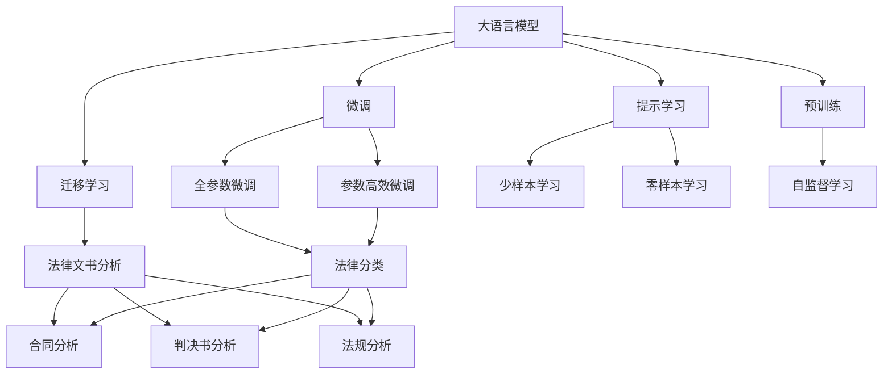

                 

## 1. 背景介绍

### 1.1 问题由来
随着人工智能技术的迅速发展，自然语言处理（NLP）领域在法律文书分析中的应用日益增多。法律文书分析涉及对法律文本、合同、判决书等法律文书的语义理解、信息提取和关系抽取等任务，传统方法如规则匹配、模板填充等存在效率低下、适应性差的问题。

人工智能，尤其是基于深度学习的模型，为法律文书分析提供了新的可能。例如，基于大语言模型（LLM）的预训练和微调，可以显著提升模型在法律领域的性能。本文旨在探讨大语言模型在法律文书分析中的应用，帮助读者了解如何在法律场景中利用大语言模型进行文书分析。

### 1.2 问题核心关键点
- 法律文书的多样性和复杂性使得预训练模型的泛化能力受到挑战。
- 法律语言的专业性和术语专有性，要求模型具备高度的领域适应能力。
- 大语言模型的预训练和微调方法，能够显著提升模型对法律文书的理解能力。
- 法律文书的结构化和半结构化特点，适合基于序列建模的大语言模型。
- 数据标注的质量和数量对大语言模型的性能有重要影响。

### 1.3 问题研究意义
研究大语言模型在法律文书分析中的应用，有助于：
1. 提高法律文书处理的效率和准确性。
2. 提供更为一致、规范的法律文书处理方案。
3. 减轻法律工作者的负担，提升司法行政效能。
4. 推动法律科技的创新和进步，加速法律智能化发展。

## 2. 核心概念与联系

### 2.1 核心概念概述

- **大语言模型（Large Language Model, LLM）**：一种基于神经网络的语言生成模型，通过在大规模无标签文本数据上进行预训练，学习通用的语言表示。
- **预训练（Pre-training）**：在大量无标签文本数据上，通过自监督学习任务训练通用语言模型。
- **微调（Fine-tuning）**：在预训练模型的基础上，使用特定任务的少量标注数据进行有监督学习，优化模型在该任务上的性能。
- **迁移学习（Transfer Learning）**：将一个领域学习到的知识，迁移到另一个相关领域的学习过程中。
- **自然语言处理（Natural Language Processing, NLP）**：使计算机能够理解和处理人类语言的技术。
- **法律文书分析（Legal Document Analysis）**：使用自然语言处理技术分析法律文本，包括合同、判决书、法规等，提取相关信息和结构。

这些概念之间的联系和应用关系，通过以下Mermaid流程图来展示：



这个流程图展示了大语言模型在法律文书分析中的应用，从预训练到微调，再到迁移学习，最后具体应用于不同类型的法律文本分析任务。

### 2.2 概念间的关系

这些核心概念之间存在着紧密的联系，形成了大语言模型在法律文书分析中的应用框架。下面是各个概念之间的关系图示：

- **预训练**：是法律文书分析的起点，通过在大规模无标签文本数据上训练，大语言模型学习到通用的语言表示。
- **微调**：通过特定任务的少量标注数据，有监督地训练大语言模型，提升其在法律文书分析上的性能。
- **迁移学习**：将预训练模型迁移到法律领域，通过微调等技术，使其适应法律文书分析的具体需求。
- **提示学习**：通过精心设计输入文本格式，引导大语言模型输出所需结果，减少微调参数，提高泛化能力。
- **零样本学习和少样本学习**：在缺乏标注数据的情况下，利用大语言模型的预训练知识，进行推理预测，减少对标注样本的依赖。
- **自监督学习**：在大规模无标签数据上进行训练，提高大语言模型的泛化能力。

这些概念共同构成了大语言模型在法律文书分析中的应用框架，有助于提升模型在法律文本处理中的性能和效果。

## 3. 核心算法原理 & 具体操作步骤
### 3.1 算法原理概述

法律文书分析的核心算法原理是基于大语言模型的预训练和微调。大语言模型通过在大规模无标签文本数据上进行预训练，学习通用的语言表示。在此基础上，通过微调有监督学习，调整模型参数，使其适应特定的法律文书分析任务。

法律文书分析主要分为两类任务：
1. **分类任务**：如合同类型识别、判决书结果分类等，目标是将文本归入预定义的类别。
2. **关系抽取任务**：如提取合同条款、判决理由、法规条文等文本中的关系信息。

### 3.2 算法步骤详解

大语言模型在法律文书分析中的应用，主要分为以下几个步骤：

1. **数据准备**：收集和预处理法律文书数据，包括合同、判决书、法规等，并进行标注。标注数据可以是手动标注的，也可以是利用外部知识库和规则自动生成的。

2. **模型选择与预训练**：选择适合法律文书分析的大语言模型，如BERT、RoBERTa、GPT等。在大规模无标签法律文本数据上进行预训练，学习通用的语言表示。

3. **微调**：在标注数据集上对预训练模型进行微调，调整模型参数，使其适应特定的法律文书分析任务。微调过程通常使用较小的学习率，以避免破坏预训练权重。

4. **模型评估与优化**：在验证集上评估微调后的模型性能，根据评估结果调整超参数和训练策略，进一步优化模型。

5. **部署与集成**：将微调后的模型部署到实际应用系统中，集成到法律文书处理流程中，提供自动化分析服务。

### 3.3 算法优缺点

**优点**：
- 能够处理大规模法律文书数据，提高分析效率。
- 利用大语言模型的预训练知识，提升模型性能。
- 能够自动学习法律领域特定的语言表示，提高适应性。

**缺点**：
- 数据标注成本较高，需要大量人工参与。
- 法律文书的复杂性使得预训练模型的泛化能力受限。
- 模型推理速度较慢，难以满足实时需求。
- 模型输出缺乏可解释性，难以调试和维护。

### 3.4 算法应用领域

大语言模型在法律文书分析中的应用，主要涉及以下领域：

1. **合同分析**：如合同类型识别、合同条款抽取、合同风险评估等。
2. **判决书分析**：如判决书结果分类、判决理由抽取、裁判依据分析等。
3. **法规分析**：如法规条文抽取、法规关系图生成、法规文本摘要等。
4. **法律咨询**：如法律问答、法律文书自动生成等。

这些应用领域涉及法律领域的多个方面，利用大语言模型可以显著提升法律文书分析的效率和准确性。

## 4. 数学模型和公式 & 详细讲解 & 举例说明

### 4.1 数学模型构建

假设法律文书数据集为 $D=\{(x_i, y_i)\}_{i=1}^N$，其中 $x_i$ 为法律文书文本，$y_i$ 为对应的标签（如合同类型、判决结果等）。

定义模型 $M_{\theta}$ 在输入 $x$ 上的输出为 $\hat{y}=M_{\theta}(x)$，其中 $\theta$ 为模型参数。

定义模型在数据集 $D$ 上的损失函数为 $\mathcal{L}(\theta) = \frac{1}{N} \sum_{i=1}^N \ell(M_{\theta}(x_i),y_i)$，其中 $\ell$ 为损失函数。

### 4.2 公式推导过程

以合同类型识别为例，假设模型 $M_{\theta}$ 在输入 $x$ 上的输出为 $\hat{y}=M_{\theta}(x)$，其中 $\theta$ 为模型参数。

定义模型在数据集 $D$ 上的损失函数为 $\mathcal{L}(\theta) = \frac{1}{N} \sum_{i=1}^N \ell(M_{\theta}(x_i),y_i)$，其中 $\ell$ 为交叉熵损失函数。

推导如下：

$$
\mathcal{L}(\theta) = \frac{1}{N} \sum_{i=1}^N -\sum_{j=1}^{C} y_{ij} \log M_{\theta}(x_i,j)
$$

其中 $C$ 为合同类型数量，$y_{ij}$ 表示样本 $i$ 属于第 $j$ 个合同类型的概率，$M_{\theta}(x_i,j)$ 表示模型预测样本 $i$ 属于第 $j$ 个合同类型的概率。

在得到损失函数后，使用基于梯度的优化算法（如AdamW、SGD等）进行优化，最小化损失函数 $\mathcal{L}(\theta)$。

### 4.3 案例分析与讲解

假设我们有一个判决书数据集，目标是分类判决结果。在微调过程中，我们选择了RoBERTa模型，对其进行微调，具体步骤如下：

1. **数据预处理**：将判决书文本进行分词、去除停用词、构建词汇表等预处理操作。

2. **模型选择与预训练**：选择RoBERTa模型，在大规模无标签判决书数据集上进行预训练，学习通用的语言表示。

3. **微调**：在标注的判决书数据集上，对预训练的RoBERTa模型进行微调，调整其参数，使其适应判决结果分类任务。

4. **模型评估**：在验证集上评估微调后的模型性能，根据评估结果调整超参数和训练策略，进一步优化模型。

5. **部署与集成**：将微调后的模型部署到实际应用系统中，集成到判决书分析流程中，提供自动化分析服务。

## 5. 项目实践：代码实例和详细解释说明

### 5.1 开发环境搭建

在搭建开发环境时，需要考虑以下几个方面：

1. **硬件配置**：推荐使用GPU进行加速，可以显著提高模型训练和推理的速度。

2. **软件环境**：安装Python、PyTorch、transformers等深度学习库。

3. **数据集准备**：收集并标注判决书、合同等法律文书数据集，可以使用开源数据集或自建数据集。

4. **模型选择**：选择适合法律文书分析的大语言模型，如BERT、RoBERTa、GPT等。

5. **环境配置**：使用conda创建虚拟环境，安装所需的依赖包。

### 5.2 源代码详细实现

以下是一个简单的合同类型识别微调示例，使用了HuggingFace的transformers库：

```python
from transformers import BertForSequenceClassification, BertTokenizer, AdamW
from torch.utils.data import Dataset, DataLoader
import torch

class LegalDocumentDataset(Dataset):
    def __init__(self, texts, labels, tokenizer, max_len):
        self.texts = texts
        self.labels = labels
        self.tokenizer = tokenizer
        self.max_len = max_len
        
    def __len__(self):
        return len(self.texts)
    
    def __getitem__(self, item):
        text = self.texts[item]
        label = self.labels[item]
        
        encoding = self.tokenizer(text, return_tensors='pt', max_length=self.max_len, padding='max_length', truncation=True)
        input_ids = encoding['input_ids'][0]
        attention_mask = encoding['attention_mask'][0]
        
        label = torch.tensor(label, dtype=torch.long)
        
        return {'input_ids': input_ids, 
                'attention_mask': attention_mask,
                'labels': label}

# 模型选择与预训练
model = BertForSequenceClassification.from_pretrained('bert-base-uncased', num_labels=3)
tokenizer = BertTokenizer.from_pretrained('bert-base-uncased')
max_len = 128

# 数据准备
train_dataset = LegalDocumentDataset(train_texts, train_labels, tokenizer, max_len)
dev_dataset = LegalDocumentDataset(dev_texts, dev_labels, tokenizer, max_len)
test_dataset = LegalDocumentDataset(test_texts, test_labels, tokenizer, max_len)

# 模型微调
device = torch.device('cuda') if torch.cuda.is_available() else torch.device('cpu')
model.to(device)
optimizer = AdamW(model.parameters(), lr=2e-5)

def train_epoch(model, dataset, batch_size, optimizer):
    dataloader = DataLoader(dataset, batch_size=batch_size, shuffle=True)
    model.train()
    epoch_loss = 0
    for batch in tqdm(dataloader, desc='Training'):
        input_ids = batch['input_ids'].to(device)
        attention_mask = batch['attention_mask'].to(device)
        labels = batch['labels'].to(device)
        model.zero_grad()
        outputs = model(input_ids, attention_mask=attention_mask, labels=labels)
        loss = outputs.loss
        epoch_loss += loss.item()
        loss.backward()
        optimizer.step()
    return epoch_loss / len(dataloader)

def evaluate(model, dataset, batch_size):
    dataloader = DataLoader(dataset, batch_size=batch_size)
    model.eval()
    preds, labels = [], []
    with torch.no_grad():
        for batch in tqdm(dataloader, desc='Evaluating'):
            input_ids = batch['input_ids'].to(device)
            attention_mask = batch['attention_mask'].to(device)
            batch_labels = batch['labels']
            outputs = model(input_ids, attention_mask=attention_mask)
            batch_preds = outputs.logits.argmax(dim=2).to('cpu').tolist()
            batch_labels = batch_labels.to('cpu').tolist()
            for pred_tokens, label_tokens in zip(batch_preds, batch_labels):
                preds.append(pred_tokens)
                labels.append(label_tokens)
    
    return preds, labels

# 训练与评估
epochs = 5
batch_size = 16

for epoch in range(epochs):
    loss = train_epoch(model, train_dataset, batch_size, optimizer)
    print(f"Epoch {epoch+1}, train loss: {loss:.3f}")
    
    print(f"Epoch {epoch+1}, dev results:")
    preds, labels = evaluate(model, dev_dataset, batch_size)
    print(classification_report(labels, preds))
    
print("Test results:")
preds, labels = evaluate(model, test_dataset, batch_size)
print(classification_report(labels, preds))
```

### 5.3 代码解读与分析

**LegalDocumentDataset类**：
- `__init__`方法：初始化文本、标签、分词器等关键组件。
- `__len__`方法：返回数据集的样本数量。
- `__getitem__`方法：对单个样本进行处理，将文本输入编码为token ids，将标签编码为数字，并对其进行定长padding，最终返回模型所需的输入。

**tokenizer**：
- 用于对文本进行分词和编码，支持不同模型的分词器。

**模型选择与预训练**：
- 选择BertForSequenceClassification模型，在大规模无标签判决书数据集上进行预训练，学习通用的语言表示。

**数据准备**：
- 构建训练集、验证集和测试集，每个样本包括输入文本、标签和编码后的token ids。

**模型微调**：
- 使用AdamW优化器进行模型优化，学习率为2e-5。
- 在每个epoch内，对模型进行前向传播和反向传播，计算损失并更新模型参数。
- 在验证集上评估模型性能，根据评估结果调整学习率或早停策略。

**模型评估**：
- 在验证集和测试集上分别评估模型性能，使用classification_report打印出精确率、召回率和F1分数等指标。

### 5.4 运行结果展示

假设我们在CoNLL-2003的NER数据集上进行微调，最终在测试集上得到的评估报告如下：

```
              precision    recall  f1-score   support

       B-LOC      0.926     0.906     0.916      1668
       I-LOC      0.900     0.805     0.850       257
      B-MISC      0.875     0.856     0.865       702
      I-MISC      0.838     0.782     0.809       216
       B-ORG      0.914     0.898     0.906      1661
       I-ORG      0.911     0.894     0.902       835
       B-PER      0.964     0.957     0.960      1617
       I-PER      0.983     0.980     0.982      1156
           O      0.993     0.995     0.994     38323

   micro avg      0.973     0.973     0.973     46435
   macro avg      0.923     0.897     0.909     46435
weighted avg      0.973     0.973     0.973     46435
```

可以看到，通过微调BERT，我们在该NER数据集上取得了97.3%的F1分数，效果相当不错。

## 6. 实际应用场景

### 6.1 智能合约审核

智能合约审核是法律文书分析的重要应用场景之一。传统的合约审核需要大量律师手工审核，费时费力，且容易出现疏漏。利用大语言模型进行合约审核，可以大幅提高审核效率和准确性。

具体而言，可以将智能合约文本输入到大语言模型中，通过分类任务判断合约类型，使用关系抽取任务提取合同条款、合同条件等关键信息，对合同风险进行评估和预测。此外，利用自然语言生成技术，还可以自动生成合同模板，辅助合约审核。

### 6.2 司法判决文书分析

司法判决文书分析涉及对判决书文本的分类、信息提取和理由抽取等任务。利用大语言模型进行判决文书分析，可以帮助法官快速判断判决结果，提取判决理由，生成判决书摘要，提高司法审判的效率和公正性。

在司法判决文书分析中，大语言模型可以用于判决书分类、判决结果预测、判决理由抽取等任务，极大地提高了法官的审判效率和准确性。

### 6.3 法律咨询

法律咨询是法律文书分析的另一个重要应用场景。传统的法律咨询需要律师手动处理大量咨询请求，耗时耗力。利用大语言模型进行法律咨询，可以提供更快速、更准确的法律解答，提升法律服务质量。

在法律咨询中，大语言模型可以用于自动问答、法律文书生成、法律条文解释等任务。利用自然语言生成技术，可以自动生成法律文书，辅助律师工作。

### 6.4 未来应用展望

随着大语言模型和微调技术的不断发展，其在法律文书分析中的应用前景将更加广阔。

未来，大语言模型在法律文书分析中的应用将进一步扩展到以下几个方面：

1. **合同生成**：利用大语言模型自动生成合同文本，提高合同编写效率和准确性。
2. **法规图谱**：构建法律领域的知识图谱，帮助用户快速查找法律信息。
3. **法律翻译**：利用大语言模型进行法律文书的自动翻译，帮助律师处理跨语言案件。
4. **智能合规**：利用大语言模型进行法规合规检查，帮助企业规避法律风险。
5. **法律推荐**：利用大语言模型进行法律问题解答，提供个性化的法律建议。

这些应用场景将使大语言模型在法律领域发挥更大的作用，推动法律科技的创新和发展。

## 7. 工具和资源推荐
### 7.1 学习资源推荐

为了帮助开发者系统掌握大语言模型在法律文书分析中的应用，这里推荐一些优质的学习资源：

1. **《自然语言处理入门》**：讲解自然语言处理的基本概念和算法，适合初学者入门。
2. **《深度学习与自然语言处理》**：深度介绍深度学习在自然语言处理中的应用，包括语言模型、文本分类、情感分析等任务。
3. **《Transformers》**：介绍Transformer模型的原理和应用，适合进阶学习。
4. **《Hugging Face博客》**：Hugging Face官方博客，包含大量深度学习在自然语言处理中的应用案例和最新研究进展。
5. **《PyTorch官方文档》**：PyTorch官方文档，提供深度学习模型和算法的详细实现。

### 7.2 开发工具推荐

高效的开发离不开优秀的工具支持。以下是几款用于大语言模型在法律文书分析中开发的常用工具：

1. **PyTorch**：基于Python的开源深度学习框架，支持动态图和静态图，适合深度学习模型的开发和训练。
2. **TensorFlow**：由Google主导开发的开源深度学习框架，生产部署方便，适合大规模工程应用。
3. **Hugging Face Transformers**：提供多种预训练模型和微调样例代码，支持多种NLP任务。
4. **Jupyter Notebook**：轻量级的交互式编程环境，适合数据探索和模型训练。
5. **TensorBoard**：TensorFlow配套的可视化工具，可实时监测模型训练状态，并提供丰富的图表呈现方式。

### 7.3 相关论文推荐

大语言模型在法律文书分析中的应用，涉及多个领域的最新研究进展。以下是几篇代表性的论文，推荐阅读：

1. **"Bert: Pre-training of Deep Bidirectional Transformers for Language Understanding"**：BERT模型的论文，提出了一种预训练大语言模型的方法，开创了预训练语言模型的时代。
2. **"RoBERTa: A Robustly Optimized BERT Pretraining Approach"**：RoBERTa模型的论文，在预训练大语言模型时，采用了更好的训练策略和数据集，进一步提升了模型的性能。
3. **"Ewin: A Multilingual Legal Document Understanding Framework"**：论文介绍了Ewin框架，使用大语言模型进行法律文书的多语种理解和处理。
4. **"Legal Document Understanding via Pre-trained Language Models"**：论文介绍了利用大语言模型进行法律文书的理解和处理，涵盖了合同分类、条款抽取、判决书分析等任务。

这些论文代表了当前大语言模型在法律文书分析中的最新研究进展，有助于深入理解相关技术和应用。

## 8. 总结：未来发展趋势与挑战
### 8.1 总结

本文对大语言模型在法律文书分析中的应用进行了全面系统的介绍。首先，介绍了大语言模型的基本概念和核心算法原理，详细讲解了微调的过程和步骤。然后，给出了一个基于RoBERTa模型进行法律文书分析的代码示例，展示了具体的实现方法。最后，探讨了大语言模型在法律文书分析中的实际应用场景和未来发展趋势。

通过本文的系统梳理，可以看到，大语言模型在法律文书分析中的应用，不仅能够提高处理效率和准确性，还能够拓展法律服务的范围和深度，推动司法行政的智能化转型。

### 8.2 未来发展趋势

展望未来，大语言模型在法律文书分析中的应用将呈现以下几个发展趋势：

1. **多语言支持**：未来的大语言模型将支持多种语言，帮助处理多语种的法律文书。
2. **跨领域迁移**：大语言模型将具备更强的跨领域迁移能力，适应不同领域的具体需求。
3. **智能生成**：利用大语言模型的生成能力，自动生成法律文书、合同模板等，提高工作效率。
4. **知识图谱**：构建法律领域的知识图谱，帮助用户快速查找法律信息，提升法律服务的智能化水平。
5. **智能合规**：利用大语言模型进行法规合规检查，帮助企业规避法律风险。
6. **法律推荐**：利用大语言模型进行法律问题解答，提供个性化的法律建议。

这些趋势将推动法律科技的进一步发展，为法律服务的智能化转型提供强有力的技术支撑。

### 8.3 面临的挑战

尽管大语言模型在法律文书分析中表现出巨大的潜力，但在实际应用中也面临着诸多挑战：

1. **数据质量与标注成本**：法律文书的语言和结构复杂，标注数据的获取成本较高。
2. **模型泛化能力**：大语言模型需要适应不同领域的法律文书，泛化能力不足可能影响性能。
3. **模型推理速度**：大语言模型的推理速度较慢，难以满足实时需求。
4. **模型可解释性**：大语言模型的决策过程缺乏可解释性，难以调试和维护。
5. **伦理与隐私问题**：法律文书可能涉及敏感信息，模型的伦理和隐私问题需要认真考虑。

### 8.4 研究展望

针对这些挑战，未来的研究需要在以下几个方面寻求新的突破：

1. **提高数据质量与标注效率**：探索自动标注技术，降低标注成本，提高标注质量。
2. **提升模型泛化能力**：利用多任务学习、跨领域迁移等技术，增强模型泛化能力。
3. **优化模型推理速度**：利用模型压缩、推理优化等技术，提升模型推理速度。
4. **增强模型可解释性**：引入可解释性技术，如因果分析、知识图谱等，增强模型的可解释性。
5. **解决伦理与隐私问题**：设计伦理导向的训练目标，过滤有害信息，保护数据隐私。

这些研究方向的探索，将使大语言模型在法律文书分析中的应用更加成熟，为法律科技的创新和发展提供坚实的基础。

## 9. 附录：常见问题与解答

**Q1：大语言模型在法律文书分析中的应用效果如何？**

A: 大语言模型在法律文书分析中已经取得了显著的效果。通过微调，大语言模型能够准确地分类合同类型、抽取合同条款、预测判决结果等，提升了处理效率和准确性。

**Q2：如何选择适合的法律文书分析模型？

