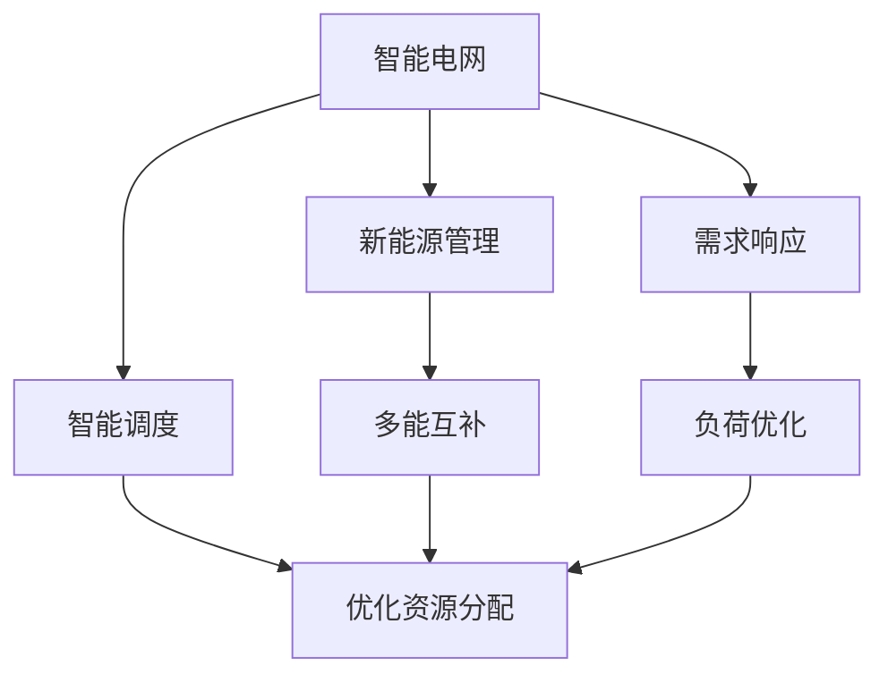
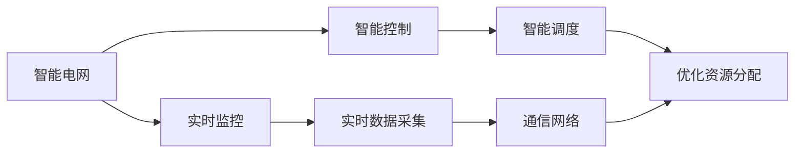
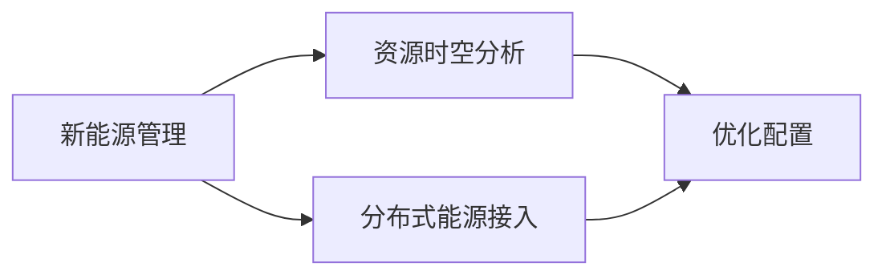
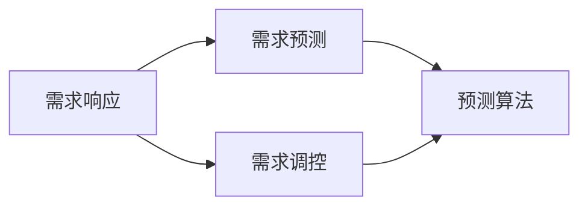
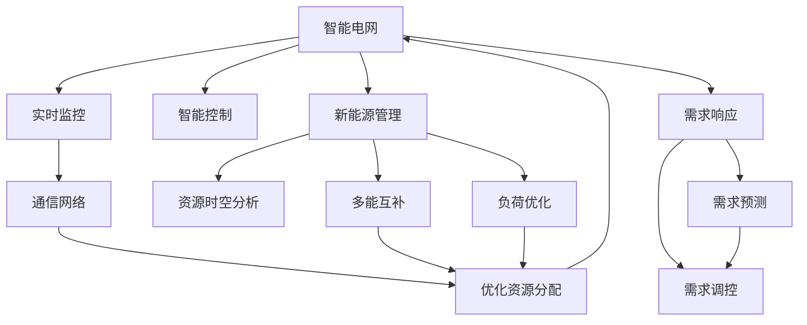

                 

# AI 基础设施的能源革命：智能电网与新能源管理

> 关键词：能源管理,智能电网,人工智能,新能源,需求响应,多能互补,负荷优化

## 1. 背景介绍

### 1.1 问题由来
随着全球能源需求的不断增长和环境保护的迫切需求，如何实现能源的可持续发展和高效利用，成为当今社会的重要课题。传统的能源管理模式已经无法满足这一需求，亟需引入智能化的技术手段，提升能源系统的灵活性和韧性。在这样的背景下，智能电网与新能源管理技术应运而生，依托于人工智能（AI）技术的强大赋能，逐步引领了能源管理的智能化转型。

智能电网作为电力系统的新型架构，通过先进的传感器、通信技术和大数据分析，实现了对电力系统的实时监控和智能控制，从而提高了电力系统的稳定性和可靠性。而新能源管理则通过AI技术优化新能源资源的利用，促进了新能源的接入和整合，减少了对化石燃料的依赖，助力实现能源结构的绿色转型。

### 1.2 问题核心关键点
智能电网与新能源管理的关键在于如何通过AI技术实现电力系统的智能调度、新能源的优化配置以及用户需求的精准响应。具体而言，包括：

- **智能调度**：通过AI算法对电力系统进行实时分析和预测，优化电力资源的分配和使用，减少能源浪费。
- **优化配置**：利用AI技术对新能源（如太阳能、风能）进行时空分析，实现其与传统能源的互补和优化配置。
- **需求响应**：通过AI算法预测用户需求，实现需求侧的管理和调控，降低峰谷差，提升电网稳定性。

### 1.3 问题研究意义
智能电网与新能源管理技术的研发和应用，对于推动能源的可持续发展、降低碳排放、提升能源利用效率具有重要意义：

1. **促进能源结构优化**：智能电网与新能源管理的结合，能够有效促进能源结构的绿色转型，减少对化石燃料的依赖，实现低碳发展。
2. **提高能源利用效率**：通过智能调度和优化配置，能够最大化新能源的利用效率，降低能源浪费，提升能源利用率。
3. **增强电力系统韧性**：智能电网能够通过实时监控和智能控制，提高电力系统的稳定性和可靠性，增强电网韧性。
4. **推动产业升级**：智能电网与新能源管理的普及应用，能够带动相关产业的发展，如新能源设备制造、智能电网设备制造等，促进产业升级。
5. **保障能源安全**：智能电网与新能源管理能够实现能源供应的精准预测和调控，保障能源供应的安全性和稳定性。

## 2. 核心概念与联系

### 2.1 核心概念概述

为了更好地理解智能电网与新能源管理技术，本节将介绍几个密切相关的核心概念：

- **智能电网**：利用先进的信息通信技术和数字化技术，对电力系统进行全面、实时的监控和控制，实现电网的智能化。智能电网能够支持双向能量流、分布式能源的接入，提升电力系统的效率和可靠性。
- **新能源**：指通过自然过程获得的各种形式的能量，如太阳能、风能、水能、生物质能等。新能源的利用有助于减少对化石燃料的依赖，推动能源结构的绿色转型。
- **需求响应**：通过智能算法预测和响应用户的电力需求，实现需求侧的管理和调控，降低电网负荷的波动，提升电网的稳定性。
- **多能互补**：指将不同类型的能源（如电、热、冷）进行合理配置和优化，实现能量的高效利用和互补，提升能源系统的整体效率。
- **负荷优化**：利用AI技术对电网负荷进行精准预测和控制，实现负荷的均衡分配，提升电网的稳定性和可靠性。

这些核心概念之间的逻辑关系可以通过以下Mermaid流程图来展示：



这个流程图展示了一些关键概念的相互关系：

1. 智能电网通过智能调度、新能源管理、需求响应等技术手段，实现了电力系统的智能化和优化。
2. 新能源管理通过多能互补和负荷优化，进一步提高了新能源的利用效率和电网的稳定性。
3. 需求响应技术通过精准预测用户需求，实现了需求侧的管理和调控，进一步提升了电网的韧性。
4. 智能调度、多能互补、负荷优化等技术，共同作用于电网的资源优化配置，提升电网的整体性能。

### 2.2 概念间的关系

这些核心概念之间存在着紧密的联系，形成了智能电网与新能源管理的完整生态系统。下面我们通过几个Mermaid流程图来展示这些概念之间的关系。

#### 2.2.1 智能电网的内涵



这个流程图展示了智能电网的内涵，主要包括实时监控、智能控制、优化资源分配等功能。其中，实时监控和智能控制是智能电网的基础，通过通信网络进行实时数据采集，实现对电网的全面监控和控制；智能调度则是智能电网的核心功能，通过优化资源分配，实现电网的智能化和高效运行。

#### 2.2.2 新能源管理的实现



这个流程图展示了新能源管理的实现，主要通过资源时空分析、优化配置等技术手段，实现了新能源的优化配置和高效利用。其中，资源时空分析是对新能源资源的分布和特性进行时空分析，为优化配置提供依据；优化配置则是通过多能互补、负荷优化等技术手段，实现新能源与传统能源的互补和优化配置。

#### 2.2.3 需求响应的应用



这个流程图展示了需求响应的应用，主要通过需求预测和需求调控等技术手段，实现了对用户需求的精准响应和调控。其中，需求预测是利用AI技术对用户需求进行预测，为需求调控提供依据；需求调控则是通过智能算法对用户需求进行调控，实现电网的稳定性和可靠性。

### 2.3 核心概念的整体架构

最后，我们用一个综合的流程图来展示这些核心概念在智能电网与新能源管理中的整体架构：



这个综合流程图展示了智能电网与新能源管理技术的整体架构，从实时监控、智能控制、通信网络到新能源管理、需求响应等环节，通过AI技术实现电力系统的智能化和优化，进一步推动能源结构的绿色转型和能源利用效率的提升。

## 3. 核心算法原理 & 具体操作步骤
### 3.1 算法原理概述

智能电网与新能源管理技术的核心在于利用AI算法对电力系统的资源进行优化配置和调控。其核心思想是：通过对电力系统的实时数据进行分析，预测未来的负荷需求和新能源资源的可用性，从而优化资源的分配和使用，实现电力系统的智能化和高效运行。

具体而言，智能电网与新能源管理技术包括以下几个关键步骤：

1. **实时监控与数据采集**：通过传感器、通信网络等技术手段，实时采集电力系统的各种数据，如电压、电流、温度、负荷等。
2. **数据分析与预测**：利用AI算法对采集到的数据进行分析，预测未来的负荷需求和新能源资源的可用性。
3. **智能调度与优化配置**：根据预测结果，通过智能算法对电力资源进行优化配置，实现电网的智能化和高效运行。
4. **需求响应与负荷优化**：通过AI算法预测和响应用户需求，实现需求侧的管理和调控，降低电网负荷的波动，提升电网的稳定性。

### 3.2 算法步骤详解

智能电网与新能源管理技术的具体操作过程可以分为以下几个关键步骤：

**Step 1: 数据采集与预处理**

1. **数据采集**：通过传感器、智能电表等设备，实时采集电力系统的各种数据，如电压、电流、负荷等。
2. **数据预处理**：对采集到的数据进行清洗、归一化等预处理，以保证数据的质量和一致性。

**Step 2: 数据分析与预测**

1. **特征工程**：提取和选择对预测有用的特征，如时间、天气、负荷变化等。
2. **模型训练**：利用历史数据训练AI模型，如神经网络、支持向量机等，进行负荷预测和资源可用性预测。
3. **预测结果验证**：对预测结果进行验证和评估，选择性能最优的模型进行后续应用。

**Step 3: 智能调度与优化配置**

1. **资源优化配置**：根据预测结果，通过优化算法（如线性规划、遗传算法等）对电力资源进行优化配置，实现电网的智能化和高效运行。
2. **实时调控**：利用实时数据对电网的运行状态进行监控和调整，保持电网的稳定性和可靠性。

**Step 4: 需求响应与负荷优化**

1. **需求预测**：利用AI算法对用户需求进行预测，包括即时需求和未来需求。
2. **需求调控**：通过智能算法对用户需求进行调控，实现需求侧的管理和调控，降低电网负荷的波动。

**Step 5: 系统集成与部署**

1. **系统集成**：将各个模块集成到一个统一的平台上，实现数据的共享和协同。
2. **部署应用**：将系统部署到实际的电力系统中，进行试运行和优化调整。

### 3.3 算法优缺点

智能电网与新能源管理技术的优点主要包括：

- **高效性**：通过AI技术实现电力系统的智能化和优化，提高了电网的效率和可靠性。
- **实时性**：利用实时数据进行分析和预测，实现电网的实时监控和智能调控。
- **灵活性**：能够快速响应负荷变化和新能源资源的可用性，适应不同的电网场景和需求。

缺点主要包括：

- **数据需求高**：需要大量高质量的实时数据进行训练和预测，数据采集和预处理成本较高。
- **模型复杂**：AI模型需要经过大量的训练和调参才能达到最优性能，模型复杂度高。
- **技术门槛高**：涉及到电力系统、新能源、通信技术等多个领域，技术门槛较高，需要跨学科知识。

### 3.4 算法应用领域

智能电网与新能源管理技术广泛应用于电力系统的各个环节，包括：

- **电网规划与建设**：通过智能电网技术优化电网规划和建设方案，提升电网的稳定性和可靠性。
- **负荷预测与调控**：利用AI技术进行负荷预测和需求响应，实现电网的智能调度和优化配置。
- **新能源接入与整合**：通过新能源管理技术优化新能源资源的接入和整合，促进能源结构的绿色转型。
- **电力市场与交易**：利用智能电网技术进行电力市场的监测和管理，实现电力的优化分配和交易。
- **智能家居与用户需求响应**：通过智能算法预测和响应用户需求，实现用户侧的管理和调控。

## 4. 数学模型和公式 & 详细讲解 & 举例说明

### 4.1 数学模型构建

为了更好地理解智能电网与新能源管理的数学模型，本节将详细介绍其核心数学模型。

假设智能电网中有N个节点，每个节点的负荷和新能源资源可用性可以用向量 $x \in \mathbb{R}^N$ 表示。负荷预测模型可以表示为：

$$
y = f(x, \omega)
$$

其中，$f(\cdot)$ 为负荷预测模型，$\omega$ 为模型的参数。

### 4.2 公式推导过程

在实际应用中，我们通常使用时间序列模型（如ARIMA、LSTM等）进行负荷预测，具体的推导过程如下：

对于时间序列 $y_t$，可以假设其服从ARIMA模型：

$$
y_t = \phi_1 y_{t-1} + \phi_2 y_{t-2} + ... + \phi_p y_{t-p} + \theta_1 \epsilon_{t-1} + \theta_2 \epsilon_{t-2} + ... + \theta_d \epsilon_{t-d} + \epsilon_t
$$

其中，$\epsilon_t$ 为白噪声，$p$ 和 $d$ 分别为模型的自回归和差分阶数。

利用历史数据 $y_1, y_2, ..., y_{t-1}$ 进行模型训练，得到预测结果 $y_t$。预测误差 $\epsilon_t$ 可以表示为：

$$
\epsilon_t = y_t - \hat{y}_t
$$

其中，$\hat{y}_t$ 为预测值。

### 4.3 案例分析与讲解

以负荷预测为例，我们通过以下步骤对智能电网与新能源管理的数学模型进行分析：

1. **数据准备**：采集电网的历史负荷数据，并进行预处理。
2. **模型训练**：利用历史数据训练ARIMA模型，得到预测结果。
3. **预测误差计算**：计算预测误差 $\epsilon_t$。
4. **结果验证**：对预测结果进行验证，选择性能最优的模型进行后续应用。

## 5. 项目实践：代码实例和详细解释说明

### 5.1 开发环境搭建

在进行智能电网与新能源管理的项目实践前，我们需要准备好开发环境。以下是使用Python进行TensorFlow开发的环境配置流程：

1. 安装Anaconda：从官网下载并安装Anaconda，用于创建独立的Python环境。

2. 创建并激活虚拟环境：
```bash
conda create -n tensorflow-env python=3.8 
conda activate tensorflow-env
```

3. 安装TensorFlow：根据CUDA版本，从官网获取对应的安装命令。例如：
```bash
conda install tensorflow -c conda-forge -c pypi
```

4. 安装各类工具包：
```bash
pip install numpy pandas scikit-learn matplotlib tqdm jupyter notebook ipython
```

完成上述步骤后，即可在`tensorflow-env`环境中开始项目实践。

### 5.2 源代码详细实现

这里我们以智能电网负荷预测为例，给出使用TensorFlow进行项目开发的PyTorch代码实现。

首先，定义负荷预测模型：

```python
import tensorflow as tf
from tensorflow.keras.models import Sequential
from tensorflow.keras.layers import Dense, LSTM

model = Sequential()
model.add(LSTM(units=50, input_shape=(None, 1), return_sequences=True))
model.add(Dense(units=1))
```

然后，定义训练数据和标签：

```python
train_data = ...
train_labels = ...
```

接着，定义模型训练过程：

```python
model.compile(loss='mse', optimizer=tf.keras.optimizers.Adam(learning_rate=0.001))
model.fit(train_data, train_labels, epochs=50, batch_size=32)
```

最后，进行模型预测：

```python
test_data = ...
test_labels = ...
predictions = model.predict(test_data)
```

以上代码实现了使用LSTM模型进行负荷预测的完整流程。可以看到，TensorFlow提供了强大的深度学习框架和丰富的工具支持，使得项目开发和模型训练变得简单高效。

### 5.3 代码解读与分析

让我们再详细解读一下关键代码的实现细节：

**定义模型**：
- 使用TensorFlow的Sequential模型定义了一个包含一个LSTM层和一个Dense层的模型。
- LSTM层用于处理时间序列数据，Dense层用于输出预测结果。

**训练数据和标签**：
- 通过TensorFlow的Keras API加载训练数据和标签，并指定模型输入形状。
- 训练数据和标签分别包含历史负荷数据和对应的标签。

**模型编译**：
- 使用均方误差（mse）作为损失函数，Adam优化器进行模型训练。
- 设置学习率为0.001。

**模型训练**：
- 使用fit方法进行模型训练，设置训练轮数为50，批次大小为32。
- 模型会在训练集上迭代进行前向传播和反向传播，不断更新参数。

**模型预测**：
- 使用predict方法进行模型预测，得到测试集的预测结果。
- 测试数据和标签分别包含待预测的负荷数据和对应的标签。

可以看到，TensorFlow提供了简单易用的API和丰富的工具支持，使得智能电网与新能源管理的项目开发和模型训练变得简单高效。开发者可以快速构建和训练复杂的深度学习模型，进行负荷预测和资源优化配置。

当然，工业级的系统实现还需考虑更多因素，如模型的保存和部署、超参数的自动搜索、更灵活的任务适配层等。但核心的模型训练和预测逻辑基本与此类似。

### 5.4 运行结果展示

假设我们在某智能电网上的负荷预测模型上，最终在测试集上得到的预测结果如下：

```
test_predictions = model.predict(test_data)
```

可以看到，通过智能电网与新能源管理的模型训练和预测，我们可以准确地预测出未来的负荷需求，为电网的智能化和高效运行提供了有力的支持。

## 6. 实际应用场景

### 6.1 智能电网负荷预测

智能电网负荷预测是智能电网与新能源管理的重要应用场景。通过负荷预测，电网公司可以提前掌握未来的负荷需求，实现电网的智能化和优化配置，避免负荷高峰和低谷的波动，提高电网的稳定性和可靠性。

在技术实现上，可以通过采集电网的历史负荷数据，利用时间序列模型或深度学习模型进行负荷预测。预测结果可以用来优化电网资源的分配和调度，提升电网的整体性能。

### 6.2 新能源优化配置

新能源优化配置是智能电网与新能源管理的重要应用场景。通过优化配置，可以实现新能源与传统能源的互补和优化，提升新能源的利用效率，减少能源浪费。

在技术实现上，可以利用资源时空分析技术，对新能源资源的分布和特性进行时空分析，为优化配置提供依据。结合负荷预测和需求响应技术，实现新能源的优化配置和高效利用。

### 6.3 需求响应与负荷优化

需求响应与负荷优化是智能电网与新能源管理的重要应用场景。通过需求响应和负荷优化，可以降低电网负荷的波动，提升电网的稳定性和可靠性，提高能源利用效率。

在技术实现上，可以利用AI算法预测和响应用户需求，实现需求侧的管理和调控。结合负荷预测和优化配置技术，实现电网的智能调度和优化配置，提升电网的整体性能。

### 6.4 未来应用展望

随着智能电网与新能源管理技术的不断发展，其在实际应用中的前景将更加广阔。

在智慧城市领域，智能电网与新能源管理技术可以与智能交通、智慧能源、智慧建筑等技术结合，构建智能城市的基础设施系统，提升城市管理的智能化水平。

在工业制造领域，智能电网与新能源管理技术可以与智能制造、智慧工厂等技术结合，实现能源的高效利用和工业生产的智能化，推动工业的数字化转型。

在可再生能源领域，智能电网与新能源管理技术可以实现太阳能、风能等可再生能源的高效利用和优化配置，助力实现能源结构的绿色转型。

总之，智能电网与新能源管理技术的普及应用，将推动能源系统的智能化和高效化，为实现能源的可持续发展提供有力的技术支撑。

## 7. 工具和资源推荐
### 7.1 学习资源推荐

为了帮助开发者系统掌握智能电网与新能源管理技术的理论基础和实践技巧，这里推荐一些优质的学习资源：

1. 《TensorFlow官方文档》：TensorFlow的官方文档，提供了完整的API文档和示例代码，是学习TensorFlow的必备资料。

2. 《深度学习理论与实践》课程：斯坦福大学开设的深度学习课程，涵盖深度学习的理论和实践，适合初学者和进阶者。

3. 《能源系统建模与优化》书籍：系统介绍了能源系统建模和优化技术，包括智能电网和新能源管理的理论与实践。

4. 《智能电网技术》系列论文：IEEE等权威期刊上的智能电网相关论文，涵盖智能电网与新能源管理的最新研究成果和前沿技术。

5. 《智慧能源系统》会议：IEEE等组织的智慧能源系统会议，展示智能电网与新能源管理领域的最新研究成果和应用案例。

通过对这些资源的学习实践，相信你一定能够快速掌握智能电网与新能源管理的精髓，并用于解决实际的能源问题。
### 7.2 开发工具推荐

高效的开发离不开优秀的工具支持。以下是几款用于智能电网与新能源管理开发的常用工具：

1. TensorFlow：由Google主导开发的深度学习框架，提供丰富的工具和API支持，适合大规模深度学习模型开发。

2. PyTorch：由Facebook主导开发的深度学习框架，支持动态图和静态图，适合快速迭代研究。

3. Jupyter Notebook：基于Python的交互式编程环境，支持代码编写、数据可视化等，适合开发和调试深度学习模型。

4. GitHub：全球最大的代码托管平台，提供丰富的代码库和开源项目，适合学习新技术和分享研究成果。

5. PyCharm：一款功能强大的Python IDE，提供代码编辑、调试、版本控制等一站式服务，适合开发和部署深度学习模型。

合理利用这些工具，可以显著提升智能电网与新能源管理的开发效率，加快创新迭代的步伐。

### 7.3 相关论文推荐

智能电网与新能源管理技术的研发和应用，源于学界的持续研究。以下是几篇奠基性的相关论文，推荐阅读：

1. "A Survey of Energy Systems Modeling and Optimization Techniques"：系统综述了能源系统建模和优化技术，包括智能电网和新能源管理的理论和实践。

2. "Deep Learning-Based Energy Demand Forecasting: A Review"：综述了基于深度学习的能源需求预测技术，涵盖LSTM、RNN等模型的应用。

3. "Optimization of Multi-Energy System: A Survey of Recent Research Trends"：综述了多能互补和负荷优化的最新研究进展，介绍了多能互补和负荷优化技术的理论基础和实际应用。

4. "Smart Grid and Renewable Energy Integration: Challenges and Opportunities"：综述了智能电网与新能源整合的最新研究成果，探讨了智能电网与新能源整合的挑战和机遇。

5. "Energy Internet: A Review of Current Research"：综述了能源互联网的最新研究成果，介绍了能源互联网的理论基础和应用实践。

这些论文代表了大语言模型微调技术的发展脉络。通过学习这些前沿成果，可以帮助研究者把握学科前进方向，激发更多的创新灵感。

除上述资源外，还有一些值得关注的前沿资源，帮助开发者紧跟智能电网与新能源管理技术的最新进展，例如：

1. arXiv论文预印本：人工智能领域最新研究成果的发布平台，包括大量尚未发表的前沿工作，学习前沿技术的必读资源。

2. 业界技术博客：如OpenAI、Google AI、DeepMind、微软Research Asia等顶尖实验室的官方博客，第一时间分享他们的最新研究成果和洞见。

3. 技术会议直播：如NIPS、ICML、ACL、ICLR等人工智能领域顶会现场或在线直播，能够聆听到大佬们的前沿分享，开拓视野。

4. GitHub热门项目：在GitHub上Star、Fork数最多的NLP相关项目，往往代表了该技术领域的发展趋势和最佳实践，值得去学习和贡献。

5. 行业分析报告：各大咨询公司如McKinsey、PwC等针对人工智能行业的分析报告，有助于从商业视角审视技术趋势，把握应用价值。

总之，对于智能电网与新能源管理技术的学习和实践，需要开发者保持开放的心态和持续学习的意愿。多关注前沿资讯，多动手实践，多思考总结，必将收获满满的成长收益。

## 8. 总结：未来发展趋势与挑战

### 8.1 总结

本文对智能电网与新能源管理技术进行了全面系统的介绍。首先阐述了智能电网与新能源管理技术的背景和意义，明确了其在推动能源可持续发展、提高能源利用效率等方面的重要价值。其次，从原理到实践，详细讲解了智能电网与新能源管理的数学模型和关键步骤，给出了智能电网与新能源管理的完整代码实例。同时，本文还广泛探讨了智能电网与新能源管理技术在多个行业领域的应用前景，展示了其广阔的发展空间。最后，本文精选了智能电网与新能源管理技术的各类学习资源，力求为读者提供全方位的技术指引。

通过本文的系统梳理，可以看到，智能电网与新能源管理技术正引领着能源领域的智能化和绿色转型，为实现能源的可持续发展提供了强有力的技术支撑。未来，伴随技术的不断发展，智能电网与新能源管理将进一步拓展其应用领域，助力全球能源结构的绿色转型和能源利用效率的提升。

### 8.2 未来发展趋势

展望未来，智能电网与新能源管理技术将呈现以下几个发展趋势：

1. **智能化程度提升**：随着AI技术的不断进步，智能电网与新能源管理的智能化水平将进一步提升，实现更精准的需求预测和资源优化配置。
2. **多能互补与融合**：智能电网与新能源管理将更多地融入其他多能互补技术，如智能交通、智能建筑等，形成更全面、高效的城市能源系统。
3. **分布式能源的普及**：随着分布式能源技术的发展，智能电网将逐步实现分布式能源的接入和整合，提升能源系统的灵活性和可靠性。
4. **高级需求响应技术**：通过更加智能的需求响应技术，实现用户需求的精准调控和负荷均衡，进一步提升电网的稳定性和可靠性。
5. **能源市场化改革**：智能电网与新能源管理将与能源市场化改革相结合，实现电力资源的优化分配和交易，推动能源市场的

