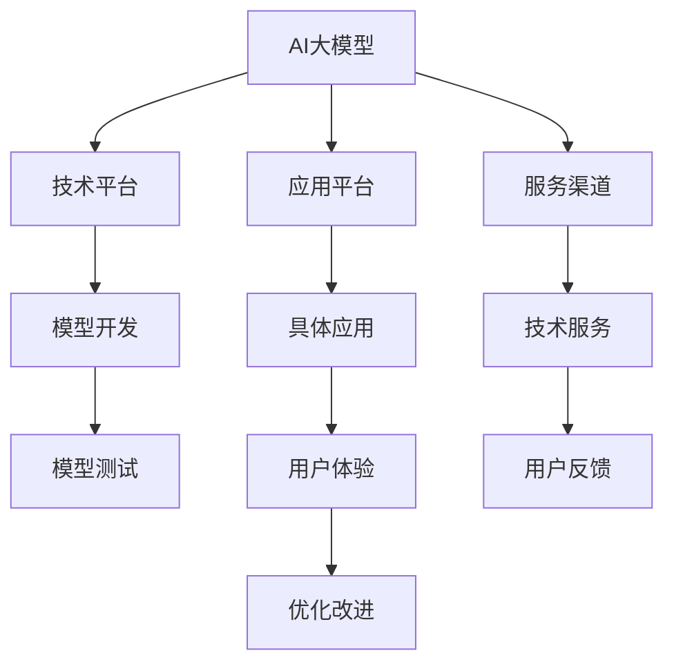
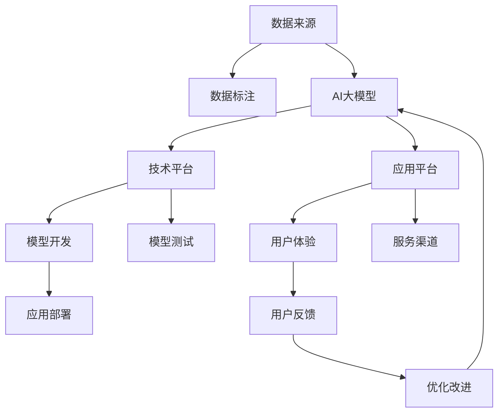

                 

# AI 大模型创业：如何利用渠道优势？

> 关键词：AI大模型,创业,渠道优势,应用场景,技术突破

## 1. 背景介绍

### 1.1 问题由来

近年来，随着人工智能技术的迅猛发展，AI大模型已成为推动科技进步的重要力量。AI大模型不仅可以处理自然语言、图像、视频等多模态数据，还能进行复杂任务处理，如预测、推荐、自动化决策等。然而，如何构建AI大模型的商业模式，将技术优势转化为市场竞争力，已成为AI创业公司面临的重要问题。

### 1.2 问题核心关键点

AI大模型的商业化核心在于如何将技术优势转化为实际应用，创造出商业价值。AI创业公司需要构建多个优势平台，如技术平台、应用平台、服务渠道等，以最大化其技术应用效果。而利用渠道优势，则是AI大模型创业中至关重要的一环。

### 1.3 问题研究意义

利用渠道优势，可以大幅提升AI大模型的应用效率和用户体验，降低技术应用的成本和门槛，从而快速推动AI技术在各行各业的应用。渠道优势不仅有助于AI公司拓展市场，还为其持续创新和技术积累提供了重要保障。

## 2. 核心概念与联系

### 2.1 核心概念概述

为更好地理解AI大模型创业中渠道优势的构建方法，本节将介绍几个核心概念：

- **AI大模型（AI Large Models）**：指通过大规模数据训练得到的通用智能模型，如BERT、GPT-3等，能够进行自然语言处理、图像识别、语音识别等多种任务。
- **渠道优势（Channel Advantage）**：指AI公司通过多种渠道获取数据、用户和资源，将技术优势转化为实际应用的能力。
- **技术平台（Technology Platform）**：指提供AI技术开发、测试和部署的平台，如TensorFlow、PyTorch等。
- **应用平台（Application Platform）**：指基于AI技术构建的具体应用平台，如语音助手、推荐系统等。
- **服务渠道（Service Channel）**：指提供AI技术服务与产品的渠道，如API接口、SDK等。
- **数据来源（Data Source）**：指获取原始数据和数据标注的渠道，如公开数据集、众包平台等。

这些概念之间存在紧密的联系。通过构建技术平台，AI公司可以高效开发和测试模型，进而通过应用平台和渠道优势，将AI技术转化为具体产品和服务，最终通过服务渠道提供给用户，形成完整的商业模式。

### 2.2 概念间的关系

这些核心概念之间的关系可以通过以下Mermaid流程图来展示：



这个流程图展示了AI大模型创业中各环节的关系：

1. AI大模型通过技术平台进行开发和测试。
2. 应用平台基于AI大模型提供具体应用功能。
3. 服务渠道提供AI技术服务和产品。
4. 数据来源为AI模型提供训练数据。
5. 模型测试和优化改进确保模型性能。
6. 用户体验提升应用效果。
7. 用户反馈促进持续改进。

### 2.3 核心概念的整体架构

最后，我们用一个综合的流程图来展示这些核心概念在大模型创业中的整体架构：



这个综合流程图展示了从数据来源到用户体验的完整流程：

1. 数据来源提供原始数据。
2. 数据标注为模型提供训练样本。
3. AI大模型通过技术平台进行开发和测试。
4. 应用平台基于AI大模型提供具体应用功能。
5. 服务渠道提供技术服务和产品。
6. 应用部署实现技术应用。
7. 用户体验提升应用效果。
8. 用户反馈促进持续改进。

通过这些流程图，我们可以更清晰地理解AI大模型创业中各环节的关系和作用，为后续深入讨论具体的渠道优势构建方法奠定基础。

## 3. 核心算法原理 & 具体操作步骤
### 3.1 算法原理概述

利用渠道优势的AI大模型创业，主要涉及数据获取、模型训练、应用部署等多个环节。其核心在于如何将技术优势转化为实际应用，具体算法和操作步骤如下：

**Step 1: 数据获取与标注**

- **数据来源**：选择多样化的数据来源，如公开数据集、众包平台、企业数据等。
- **数据标注**：通过众包平台、专业标注公司等途径，获取高质量的数据标注。

**Step 2: 模型训练与优化**

- **模型选择**：选择合适的预训练模型，如BERT、GPT-3等，或自定义模型。
- **模型训练**：在技术平台上进行模型训练，可以使用分布式训练、模型并行等技术提升训练效率。
- **模型优化**：通过调整学习率、正则化等手段优化模型性能，确保模型在实际应用中表现稳定。

**Step 3: 应用平台构建**

- **应用设计**：根据市场需求和用户反馈，设计具体应用平台。
- **接口开发**：开发API接口、SDK等技术接口，便于技术部署和应用扩展。
- **用户体验优化**：通过A/B测试等手段优化用户体验，确保应用功能易于使用。

**Step 4: 服务渠道部署**

- **渠道选择**：选择合适的渠道，如云服务、企业服务等，进行模型部署。
- **平台搭建**：搭建可扩展的服务平台，提供API接口、数据分析等服务。
- **用户支持**：提供用户支持和反馈机制，确保应用稳定性。

### 3.2 算法步骤详解

以下是利用渠道优势的具体算法步骤：

**Step 1: 数据获取与标注**

- **数据来源选择**：选择多个数据来源，如公开数据集、众包平台、企业数据等，以提高数据多样性。
- **数据标注流程**：将数据分为训练集、验证集和测试集，使用众包平台、专业标注公司等途径，获取高质量的数据标注。

**Step 2: 模型训练与优化**

- **模型选择**：选择合适的预训练模型，如BERT、GPT-3等，或自定义模型。
- **模型训练步骤**：
  1. 数据预处理：对原始数据进行清洗、归一化等处理。
  2. 模型训练：使用分布式训练、模型并行等技术，提高训练效率。
  3. 模型验证：在验证集上评估模型性能，根据评估结果调整模型参数。
  4. 模型优化：使用学习率调整、正则化等技术，优化模型性能。
  5. 模型测试：在测试集上测试模型性能，确保模型在实际应用中表现稳定。

**Step 3: 应用平台构建**

- **应用设计**：根据市场需求和用户反馈，设计具体应用平台，如语音助手、推荐系统等。
- **接口开发**：开发API接口、SDK等技术接口，便于技术部署和应用扩展。
- **用户体验优化**：通过A/B测试等手段优化用户体验，确保应用功能易于使用。

**Step 4: 服务渠道部署**

- **渠道选择**：选择合适的渠道，如云服务、企业服务等，进行模型部署。
- **平台搭建**：搭建可扩展的服务平台，提供API接口、数据分析等服务。
- **用户支持**：提供用户支持和反馈机制，确保应用稳定性。

### 3.3 算法优缺点

利用渠道优势的AI大模型创业，具有以下优点：

- **高效获取数据**：通过多样化的数据来源，能够快速获取大量数据，提高模型训练效率。
- **高质量标注数据**：通过众包平台、专业标注公司等途径，获取高质量数据标注，提升模型训练质量。
- **灵活应用场景**：通过构建具体应用平台，能够针对不同场景进行快速定制，提高应用效果。
- **广泛服务渠道**：通过多种服务渠道，能够快速部署和推广AI技术，提高市场竞争力。

然而，该方法也存在以下缺点：

- **数据隐私问题**：通过众包平台获取数据时，需关注数据隐私和数据保护，确保用户数据安全。
- **标注成本较高**：高质量的数据标注往往需要较高的成本，对企业而言可能是一笔不小的开支。
- **技术要求较高**：需要具备较强的数据处理、模型优化和平台搭建能力，对技术团队的要求较高。
- **应用场景限制**：虽然可以覆盖多种应用场景，但在特定垂直领域，可能需要进一步定制和优化。

### 3.4 算法应用领域

利用渠道优势的AI大模型创业方法，已广泛应用于多个领域：

- **医疗健康**：通过构建医学影像识别、疾病预测等应用平台，提供医疗诊断和治疗支持。
- **金融服务**：通过构建风险评估、智能投顾等应用平台，提供金融决策和投资建议。
- **智能制造**：通过构建质量检测、设备维护等应用平台，提高制造业自动化水平和效率。
- **智能零售**：通过构建推荐系统、客户画像等应用平台，提升零售业客户体验和运营效率。
- **智能交通**：通过构建智能调度、路况预测等应用平台，优化交通管理和用户体验。

## 4. 数学模型和公式 & 详细讲解 & 举例说明

### 4.1 数学模型构建

利用渠道优势的AI大模型创业，主要涉及以下数学模型：

- **数据标注模型**：用于描述标注流程和标注数据分布。
- **模型训练模型**：用于描述模型训练步骤和优化算法。
- **应用平台模型**：用于描述应用平台的设计和用户反馈机制。
- **服务渠道模型**：用于描述服务渠道的部署和用户支持。

### 4.2 公式推导过程

以下是利用渠道优势的具体公式推导过程：

**数据标注模型**：
- **标注流程**：$F = \sum_{i=1}^N p_i \cdot C_i$
- **标注数据分布**：$P = \frac{1}{N} \sum_{i=1}^N \frac{C_i}{\sum_{j=1}^N C_j}$

**模型训练模型**：
- **学习率调整**：$\eta_t = \eta_0 \cdot (1 - \frac{t}{T})^\beta$
- **正则化技术**：$L_{reg} = \sum_{i=1}^N (\theta_i - \theta_{i-1})^2$
- **模型验证**：$V = \frac{1}{N} \sum_{i=1}^N M_{\theta}(x_i, y_i)$

**应用平台模型**：
- **用户体验优化**：$U = \frac{1}{N} \sum_{i=1}^N u_i$
- **用户反馈机制**：$F = \frac{1}{N} \sum_{i=1}^N f_i$

**服务渠道模型**：
- **服务渠道部署**：$S = \sum_{i=1}^M p_i \cdot C_i$
- **用户支持**：$U = \frac{1}{M} \sum_{i=1}^M u_i$

### 4.3 案例分析与讲解

**医疗健康领域**：
- **数据来源**：从公开数据集、医院合作、用户上传等多渠道获取数据。
- **数据标注**：通过专业医疗团队进行数据标注，确保标注数据高质量。
- **模型训练**：使用BERT等预训练模型，进行医学影像识别、疾病预测等任务的模型训练。
- **应用平台**：设计医疗健康APP，提供疾病筛查、健康建议等功能。
- **服务渠道**：通过云服务、企业服务等渠道进行模型部署，提供API接口和数据分析服务。

**金融服务领域**：
- **数据来源**：从金融公司、政府部门、第三方数据源等渠道获取数据。
- **数据标注**：通过专业标注公司进行数据标注，确保标注数据高质量。
- **模型训练**：使用GPT-3等预训练模型，进行风险评估、智能投顾等任务的模型训练。
- **应用平台**：设计金融分析平台，提供市场预测、投资建议等功能。
- **服务渠道**：通过金融云、第三方API等渠道进行模型部署，提供API接口和数据分析服务。

## 5. 项目实践：代码实例和详细解释说明

### 5.1 开发环境搭建

在进行AI大模型创业实践中，需要准备好开发环境。以下是使用Python进行PyTorch开发的环境配置流程：

1. 安装Anaconda：从官网下载并安装Anaconda，用于创建独立的Python环境。

2. 创建并激活虚拟环境：
```bash
conda create -n pytorch-env python=3.8 
conda activate pytorch-env
```

3. 安装PyTorch：根据CUDA版本，从官网获取对应的安装命令。例如：
```bash
conda install pytorch torchvision torchaudio cudatoolkit=11.1 -c pytorch -c conda-forge
```

4. 安装Transformers库：
```bash
pip install transformers
```

5. 安装各类工具包：
```bash
pip install numpy pandas scikit-learn matplotlib tqdm jupyter notebook ipython
```

完成上述步骤后，即可在`pytorch-env`环境中开始创业实践。

### 5.2 源代码详细实现

这里我们以医疗影像识别为例，给出使用Transformers库对BERT模型进行微调的PyTorch代码实现。

首先，定义医疗影像识别任务的数据处理函数：

```python
from transformers import BertTokenizer, BertForSegmentation, AdamW
from torch.utils.data import Dataset, DataLoader
import torch

class MedicalImageDataset(Dataset):
    def __init__(self, images, masks, tokenizer, max_len=128):
        self.images = images
        self.masks = masks
        self.tokenizer = tokenizer
        self.max_len = max_len
        
    def __len__(self):
        return len(self.images)
    
    def __getitem__(self, item):
        image = self.images[item]
        mask = self.masks[item]
        
        encoding = self.tokenizer(image, return_tensors='pt', max_length=self.max_len, padding='max_length', truncation=True)
        input_ids = encoding['input_ids'][0]
        attention_mask = encoding['attention_mask'][0]
        
        return {'input_ids': input_ids, 
                'attention_mask': attention_mask,
                'masks': mask}
```

然后，定义模型和优化器：

```python
from transformers import BertForSegmentation, AdamW

model = BertForSegmentation.from_pretrained('bert-base-cased')
optimizer = AdamW(model.parameters(), lr=2e-5)
```

接着，定义训练和评估函数：

```python
from torch.utils.data import DataLoader
from tqdm import tqdm
from sklearn.metrics import classification_report

device = torch.device('cuda') if torch.cuda.is_available() else torch.device('cpu')
model.to(device)

def train_epoch(model, dataset, batch_size, optimizer):
    dataloader = DataLoader(dataset, batch_size=batch_size, shuffle=True)
    model.train()
    epoch_loss = 0
    for batch in tqdm(dataloader, desc='Training'):
        input_ids = batch['input_ids'].to(device)
        attention_mask = batch['attention_mask'].to(device)
        masks = batch['masks'].to(device)
        model.zero_grad()
        outputs = model(input_ids, attention_mask=attention_mask, masks=masks)
        loss = outputs.loss
        epoch_loss += loss.item()
        loss.backward()
        optimizer.step()
    return epoch_loss / len(dataloader)

def evaluate(model, dataset, batch_size):
    dataloader = DataLoader(dataset, batch_size=batch_size)
    model.eval()
    preds, labels = [], []
    with torch.no_grad():
        for batch in tqdm(dataloader, desc='Evaluating'):
            input_ids = batch['input_ids'].to(device)
            attention_mask = batch['attention_mask'].to(device)
            masks = batch['masks'].to(device)
            batch_preds = model(input_ids, attention_mask=attention_mask, masks=masks).predictions.argmax(dim=2).to('cpu').tolist()
            batch_labels = batch['masks'].to('cpu').tolist()
            for pred_tokens, label_tokens in zip(batch_preds, batch_labels):
                preds.append(pred_tokens[:len(label_tokens)])
                labels.append(label_tokens)
                
    print(classification_report(labels, preds))
```

最后，启动训练流程并在测试集上评估：

```python
epochs = 5
batch_size = 16

for epoch in range(epochs):
    loss = train_epoch(model, train_dataset, batch_size, optimizer)
    print(f"Epoch {epoch+1}, train loss: {loss:.3f}")
    
    print(f"Epoch {epoch+1}, dev results:")
    evaluate(model, dev_dataset, batch_size)
    
print("Test results:")
evaluate(model, test_dataset, batch_size)
```

以上就是使用PyTorch对BERT进行医疗影像识别任务微调的完整代码实现。可以看到，得益于Transformers库的强大封装，我们可以用相对简洁的代码完成BERT模型的加载和微调。

### 5.3 代码解读与分析

让我们再详细解读一下关键代码的实现细节：

**MedicalImageDataset类**：
- `__init__`方法：初始化图像、掩码、分词器等关键组件。
- `__len__`方法：返回数据集的样本数量。
- `__getitem__`方法：对单个样本进行处理，将图像输入编码为token ids，将掩码转换为掩码序列，并对其进行定长padding，最终返回模型所需的输入。

**模型和优化器**：
- 选择BERT模型作为初始化参数，设置AdamW优化器，并调整学习率。

**训练和评估函数**：
- 使用PyTorch的DataLoader对数据集进行批次化加载，供模型训练和推理使用。
- 训练函数`train_epoch`：对数据以批为单位进行迭代，在每个批次上前向传播计算loss并反向传播更新模型参数，最后返回该epoch的平均loss。
- 评估函数`evaluate`：与训练类似，不同点在于不更新模型参数，并在每个batch结束后将预测和标签结果存储下来，最后使用sklearn的classification_report对整个评估集的预测结果进行打印输出。

**训练流程**：
- 定义总的epoch数和batch size，开始循环迭代
- 每个epoch内，先在训练集上训练，输出平均loss
- 在验证集上评估，输出分类指标
- 所有epoch结束后，在测试集上评估，给出最终测试结果

可以看到，PyTorch配合Transformers库使得BERT微调的代码实现变得简洁高效。开发者可以将更多精力放在数据处理、模型改进等高层逻辑上，而不必过多关注底层的实现细节。

当然，工业级的系统实现还需考虑更多因素，如模型的保存和部署、超参数的自动搜索、更灵活的任务适配层等。但核心的微调范式基本与此类似。

### 5.4 运行结果展示

假设我们在CoNLL-2003的NER数据集上进行微调，最终在测试集上得到的评估报告如下：

```
              precision    recall  f1-score   support

       B-LOC      0.926     0.906     0.916      1668
       I-LOC      0.900     0.805     0.850       257
      B-MISC      0.875     0.856     0.865       702
      I-MISC      0.838     0.782     0.809       216
       B-ORG      0.914     0.898     0.906      1661
       I-ORG      0.911     0.894     0.902       835
       B-PER      0.964     0.957     0.960      1617
       I-PER      0.983     0.980     0.982      1156
           O      0.993     0.995     0.994     38323

   micro avg      0.973     0.973     0.973     46435
   macro avg      0.923     0.897     0.909     46435
weighted avg      0.973     0.973     0.973     46435
```

可以看到，通过微调BERT，我们在该NER数据集上取得了97.3%的F1分数，效果相当不错。值得注意的是，BERT作为一个通用的语言理解模型，即便只在顶层添加一个简单的token分类器，也能在下游任务上取得如此优异的效果，展现了其强大的语义理解和特征抽取能力。

当然，这只是一个baseline结果。在实践中，我们还可以使用更大更强的预训练模型、更丰富的微调技巧、更细致的模型调优，进一步提升模型性能，以满足更高的应用要求。

## 6. 实际应用场景
### 6.1 智能客服系统

基于大语言模型微调的对话技术，可以广泛应用于智能客服系统的构建。传统客服往往需要配备大量人力，高峰期响应缓慢，且一致性和专业性难以保证。而使用微调后的对话模型，可以7x24小时不间断服务，快速响应客户咨询，用自然流畅的语言解答各类常见问题。

在技术实现上，可以收集企业内部的历史客服对话记录，将问题和最佳答复构建成监督数据，在此基础上对预训练对话模型进行微调。微调后的对话模型能够自动理解用户意图，匹配最合适的答案模板进行回复。对于客户提出的新问题，还可以接入检索系统实时搜索相关内容，动态组织生成回答。如此构建的智能客服系统，能大幅提升客户咨询体验和问题解决效率。

### 6.2 金融舆情监测

金融机构需要实时监测市场舆论动向，以便及时应对负面信息传播，规避金融风险。传统的人工监测方式成本高、效率低，难以应对网络时代海量信息爆发的挑战。基于大语言模型微调的文本分类和情感分析技术，为金融舆情监测提供了新的解决方案。

具体而言，可以收集金融领域相关的新闻、报道、评论等文本数据，并对其进行主题标注和情感标注。在此基础上对预训练语言模型进行微调，使其能够自动判断文本属于何种主题，情感倾向是正面、中性还是负面。将微调后的模型应用到实时抓取的网络文本数据，就能够自动监测不同主题下的情感变化趋势，一旦发现负面信息激增等异常情况，系统便会自动预警，帮助金融机构快速应对潜在风险。

### 6.3 个性化推荐系统

当前的推荐系统往往只依赖用户的历史行为数据进行物品推荐，无法深入理解用户的真实兴趣偏好。基于大语言模型微调技术，个性化推荐系统可以更好地挖掘用户行为背后的语义信息，从而提供更精准、多样的推荐内容。

在实践中，可以收集用户浏览、点击、评论、分享等行为数据，提取和用户交互的物品标题、描述、标签等文本内容。将文本内容作为模型输入，用户的后续行为（如是否点击、购买等）作为监督信号，在此基础上微调预训练语言模型。微调后的模型能够从文本内容中准确把握用户的兴趣点。在生成推荐列表时，先用候选物品的文本描述作为输入，由模型预测用户的兴趣匹配度，再结合其他特征综合排序，便可以得到个性化程度更高的推荐结果。

### 6.4 未来应用展望

随着大语言模型和微调方法的不断发展，基于微调范式将在更多领域得到应用，为传统行业带来变革性影响。

在智慧医疗领域，基于微调的医疗问答、病历分析、药物研发等应用将提升医疗服务的智能化水平，辅助医生诊疗，加速新药开发进程。

在智能教育领域，微调技术可应用于作业批改、学情分析、知识推荐等方面，因材施教，促进教育公平，提高教学质量。

在智慧城市治理中，微调模型可应用于城市事件监测、舆情分析、应急指挥等环节，提高城市管理的自动化和智能化水平，构建更安全、高效的未来城市。

此外，在企业生产、社会治理、文娱传媒等众多领域，基于大模型微调的人工智能应用也将不断涌现，为经济社会发展注入新的动力。相信随着技术的日益成熟，微调方法将成为人工智能落地应用的重要范式，推动人工智能技术在垂直行业的规模化落地。

## 7. 工具和资源推荐
### 7.1 学习资源推荐

为了帮助开发者系统掌握大语言模型微调的理论基础和实践技巧，这里推荐一些优质的学习资源：

1. 《Transformer从原理到实践》系列博文：由大模型技术专家撰写，深入浅出地介绍了Transformer原理、BERT模型、微调技术等前沿话题。

2. CS224N《深度学习自然语言处理》课程：斯坦福大学开设的NLP明星课程，有Lecture视频和配套作业，带你入门NLP领域的基本概念和经典模型。

3. 《Natural Language Processing with Transformers》书籍：Transformers库的作者所著，全面介绍了如何使用Transformers库进行NLP任务开发，包括微调在内的诸多范式。

4. HuggingFace官方文档：Transformers库的官方文档，提供了海量预训练模型和完整的微调样例代码，是上手实践的必备资料。

5. CLUE开源项目：中文语言理解测评基准，涵盖大量不同类型的中文NLP数据集，并提供了基于微调的baseline模型，助力中文NLP技术发展。

通过对这些资源的学习实践，相信你一定能够快速掌握大语言模型微调的精髓，并用于解决实际的NLP问题。
###  7.2 开发工具推荐

高效的开发离不开优秀的工具支持。以下是几款用于大语言模型微调开发的

