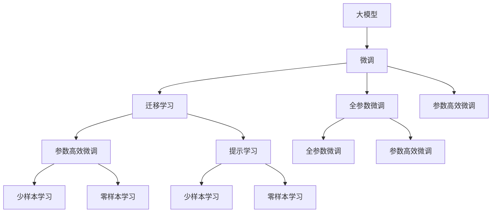

                 

# AI 大模型创业：如何利用竞争优势？

> 关键词：人工智能,大模型,创业,竞争优势,算法,模型训练,应用场景,未来展望,资源推荐

## 1. 背景介绍

### 1.1 问题由来

随着人工智能技术的快速发展，大模型在各个行业中的应用已经变得越来越普遍。无论是医疗、金融、零售还是制造，大模型都在不断展现其强大的潜力和广泛的适用性。然而，大模型的应用并不是一帆风顺的，也面临着诸多挑战和不确定性。如何在竞争激烈的市场中，利用大模型的竞争优势，实现成功创业，成为了一个值得深入探讨的话题。

### 1.2 问题核心关键点

大模型的竞争优势主要体现在其强大的学习能力、广泛的适用性和高效性。通过对大模型进行微调、迁移学习、参数高效微调等技术手段，可以显著提升模型在特定任务上的性能，满足实际应用的需求。然而，如何在大模型技术的核心算法和实际操作中，充分挖掘其潜力和优势，需要深入研究和实践。

## 2. 核心概念与联系

### 2.1 核心概念概述

为了更好地理解大模型的创业优势，我们先来介绍几个关键概念：

- **大模型(Large Model)**：指的是具有亿级参数、用于处理大规模数据集的深度学习模型，如BERT、GPT-3、T5等。大模型具备强大的语言理解能力和广泛的适用性，能够处理复杂的自然语言处理任务。

- **微调(Fine-tuning)**：在大模型基础上，针对特定任务进行小规模数据上的有监督训练，以适应任务需求。微调能够提高模型的准确性和泛化能力，是实现大模型创业的关键技术。

- **迁移学习(Transfer Learning)**：将预训练模型应用于新任务中，通过微调或提示学习，实现模型的知识迁移。迁移学习能够降低对新数据集的标注需求，提高模型的泛化能力。

- **参数高效微调(Parameter-Efficient Fine-tuning, PEFT)**：在微调过程中，只更新部分模型参数，以降低计算成本，提高微调效率。参数高效微调是大模型创业中优化计算资源的重要手段。

- **提示学习(Prompt Learning)**：通过在输入文本中引入提示信息，引导大模型进行特定任务的推理和生成。提示学习在大模型创业中能够降低标注数据需求，提高模型泛化能力。

- **少样本学习(Few-shot Learning)**：在只有少量样本的情况下，模型能够快速适应新任务，无需大量标注数据。少样本学习是大模型创业中降低数据标注成本的重要方法。

- **零样本学习(Zero-shot Learning)**：模型在未见过的新任务上，仅凭任务描述就能生成输出。零样本学习是大模型创业中快速适应新任务需求的关键技术。

- **持续学习(Continual Learning)**：模型能够不断学习新知识，同时保持原有知识，避免灾难性遗忘。持续学习是大模型创业中保证模型长期有效的重要方法。

### 2.2 概念间的关系

这些核心概念之间存在着紧密的联系，构成了大模型创业的完整框架。以下是这些概念间关系的 Mermaid 流程图：



这个流程图展示了各个概念之间的关系：

1. 大模型通过微调和迁移学习，能够在特定任务上获得更好的性能。
2. 参数高效微调和提示学习进一步提升了微调效率，降低了对标注数据的依赖。
3. 少样本学习和零样本学习在大模型创业中能够降低数据标注成本，提高模型适应性。
4. 持续学习使得模型能够不断学习新知识，避免遗忘原有知识。

## 3. 核心算法原理 & 具体操作步骤

### 3.1 算法原理概述

大模型创业的核心在于利用其强大的学习能力，通过微调和迁移学习，在特定任务上获得优异性能。微调的基本思想是在大模型基础上，针对特定任务进行小规模数据上的有监督训练，以适应任务需求。

### 3.2 算法步骤详解

以下是基于大模型微调的具体操作步骤：

1. **准备数据集**：选择合适的数据集，划分为训练集、验证集和测试集。数据集应尽可能覆盖目标任务的典型场景。

2. **微调模型**：
   - 选择合适的大模型作为初始化参数。
   - 定义任务的适配层和损失函数，适配层用于将大模型的输出转换为任务目标。
   - 设置合适的学习率和优化器，一般学习率比预训练时更小，以避免破坏预训练权重。
   - 使用小批量数据进行迭代训练，周期性在验证集上评估模型性能。

3. **优化模型**：
   - 根据评估结果，调整模型的参数和超参数。
   - 使用正则化技术，如L2正则、Dropout、Early Stopping等，防止模型过拟合。
   - 应用参数高效微调技术，如Adapter、LoRA、BitFit等，减少计算成本。

4. **测试和部署**：
   - 在测试集上评估微调后模型的性能。
   - 部署模型到实际应用系统中，进行大规模测试。
   - 根据反馈不断优化模型和参数，持续改进。

### 3.3 算法优缺点

大模型创业具有以下优点：

- **高效性**：大模型具备强大的学习能力，能够在少量标注数据上获得优异性能。
- **广泛适用性**：大模型适用于各种NLP任务，能够快速适应新任务需求。
- **可解释性**：大模型的训练过程可解释，有助于调试和优化。

同时，也存在以下缺点：

- **数据标注成本高**：微调过程需要大量标注数据，数据标注成本高昂。
- **模型复杂度高**：大模型参数量庞大，训练和推理资源消耗大。
- **泛化能力不足**：微调模型在新领域数据上的泛化能力有限，容易过拟合。

### 3.4 算法应用领域

大模型创业已经广泛应用于以下几个领域：

- **自然语言处理(NLP)**：如文本分类、命名实体识别、关系抽取、机器翻译、文本摘要等任务。通过微调，大模型能够实现高性能的NLP应用。

- **医疗健康**：如疾病诊断、医学知识图谱、患者情绪分析等任务。大模型能够快速学习医学领域的语言表示，提高医疗服务的智能化水平。

- **金融科技**：如市场舆情分析、投资风险评估、智能客服等任务。大模型能够处理金融领域的大量文本数据，提升金融服务的精准度和效率。

- **智能家居**：如语音助手、智能推荐等任务。大模型能够处理自然语言指令，实现智能家居设备的语音控制和推荐。

- **教育培训**：如智能评估、个性化推荐、智能批改等任务。大模型能够处理学生互动数据，提供个性化的教育培训服务。

## 4. 数学模型和公式 & 详细讲解

### 4.1 数学模型构建

大模型创业的数学模型主要基于有监督学习。假设大模型为 $M_{\theta}$，其中 $\theta$ 为模型参数。给定任务 $T$ 的训练集 $D=\{(x_i, y_i)\}_{i=1}^N$，其中 $x_i$ 为输入，$y_i$ 为标签。微调的目标是最小化经验风险 $\mathcal{L}(\theta) = \frac{1}{N}\sum_{i=1}^N \ell(M_{\theta}(x_i), y_i)$，其中 $\ell$ 为损失函数，$\ell(M_{\theta}(x_i), y_i)$ 为模型在样本 $(x_i, y_i)$ 上的损失。

### 4.2 公式推导过程

以二分类任务为例，假设模型输出 $\hat{y}=M_{\theta}(x) \in [0,1]$，则二分类交叉熵损失函数为：

$$
\ell(M_{\theta}(x),y) = -[y\log \hat{y} + (1-y)\log (1-\hat{y})]
$$

其梯度为：

$$
\frac{\partial \mathcal{L}(\theta)}{\partial \theta_k} = -\frac{1}{N}\sum_{i=1}^N \left(\frac{y_i}{\hat{y}_i} - \frac{1-y_i}{1-\hat{y}_i}\right) \frac{\partial M_{\theta}(x_i)}{\partial \theta_k}
$$

其中 $\frac{\partial M_{\theta}(x_i)}{\partial \theta_k}$ 为模型在输入 $x_i$ 上输出 $M_{\theta}(x_i)$ 对参数 $\theta_k$ 的梯度。

### 4.3 案例分析与讲解

以文本分类为例，给定训练集 $\{(x_i, y_i)\}_{i=1}^N$，其中 $x_i$ 为文本，$y_i$ 为分类标签。假设大模型为BERT，适配层为线性分类器，损失函数为二分类交叉熵。训练过程中，将每个文本输入模型，计算模型输出 $\hat{y}$ 与标签 $y$ 之间的交叉熵损失，并反向传播更新模型参数 $\theta$。

## 5. 项目实践：代码实例和详细解释说明

### 5.1 开发环境搭建

大模型创业需要高性能计算资源和相应的开发工具。以下是基于Python和PyTorch的开发环境搭建流程：

1. 安装Anaconda：从官网下载并安装Anaconda，用于创建独立的Python环境。

2. 创建并激活虚拟环境：
```bash
conda create -n pytorch-env python=3.8 
conda activate pytorch-env
```

3. 安装PyTorch：根据CUDA版本，从官网获取对应的安装命令。例如：
```bash
conda install pytorch torchvision torchaudio cudatoolkit=11.1 -c pytorch -c conda-forge
```

4. 安装Transformers库：
```bash
pip install transformers
```

5. 安装各类工具包：
```bash
pip install numpy pandas scikit-learn matplotlib tqdm jupyter notebook ipython
```

完成上述步骤后，即可在`pytorch-env`环境中开始创业实践。

### 5.2 源代码详细实现

以下是一个简单的文本分类项目示例，使用BERT模型进行微调：

```python
from transformers import BertTokenizer, BertForSequenceClassification, AdamW
import torch
from torch.utils.data import Dataset, DataLoader
from sklearn.metrics import accuracy_score

# 数据处理
class TextDataset(Dataset):
    def __init__(self, texts, labels, tokenizer, max_len=128):
        self.texts = texts
        self.labels = labels
        self.tokenizer = tokenizer
        self.max_len = max_len
        
    def __len__(self):
        return len(self.texts)
    
    def __getitem__(self, idx):
        text = self.texts[idx]
        label = self.labels[idx]
        
        encoding = self.tokenizer(text, return_tensors='pt', max_length=self.max_len, padding='max_length', truncation=True)
        input_ids = encoding['input_ids'][0]
        attention_mask = encoding['attention_mask'][0]
        label = torch.tensor(label, dtype=torch.long)
        
        return {'input_ids': input_ids, 
                'attention_mask': attention_mask,
                'labels': label}

# 模型加载与微调
tokenizer = BertTokenizer.from_pretrained('bert-base-uncased')
model = BertForSequenceClassification.from_pretrained('bert-base-uncased', num_labels=2)
optimizer = AdamW(model.parameters(), lr=2e-5)

# 数据加载
train_dataset = TextDataset(train_texts, train_labels, tokenizer)
val_dataset = TextDataset(val_texts, val_labels, tokenizer)
test_dataset = TextDataset(test_texts, test_labels, tokenizer)

# 模型训练
model.train()
device = torch.device('cuda') if torch.cuda.is_available() else torch.device('cpu')
model.to(device)

def train_epoch(model, dataset, batch_size, optimizer):
    dataloader = DataLoader(dataset, batch_size=batch_size, shuffle=True)
    loss_total = 0
    for batch in dataloader:
        input_ids = batch['input_ids'].to(device)
        attention_mask = batch['attention_mask'].to(device)
        labels = batch['labels'].to(device)
        model.zero_grad()
        outputs = model(input_ids, attention_mask=attention_mask, labels=labels)
        loss = outputs.loss
        loss_total += loss.item()
        loss.backward()
        optimizer.step()
    return loss_total / len(dataloader)

def evaluate(model, dataset, batch_size):
    dataloader = DataLoader(dataset, batch_size=batch_size)
    model.eval()
    preds, labels = [], []
    with torch.no_grad():
        for batch in dataloader:
            input_ids = batch['input_ids'].to(device)
            attention_mask = batch['attention_mask'].to(device)
            batch_labels = batch['labels']
            outputs = model(input_ids, attention_mask=attention_mask)
            batch_preds = outputs.logits.argmax(dim=1).to('cpu').tolist()
            batch_labels = batch_labels.to('cpu').tolist()
            for pred, label in zip(batch_preds, batch_labels):
                preds.append(pred)
                labels.append(label)
    return accuracy_score(labels, preds)

# 训练与评估
epochs = 5
batch_size = 16

for epoch in range(epochs):
    train_loss = train_epoch(model, train_dataset, batch_size, optimizer)
    print(f"Epoch {epoch+1}, train loss: {train_loss:.3f}")
    
    val_acc = evaluate(model, val_dataset, batch_size)
    print(f"Epoch {epoch+1}, val acc: {val_acc:.3f}")
    
print("Test acc:", evaluate(model, test_dataset, batch_size))
```

### 5.3 代码解读与分析

该示例代码展示了BERT模型在大模型创业中的实际应用。关键代码解读如下：

**TextDataset类**：
- `__init__`方法：初始化文本、标签、分词器等关键组件。
- `__len__`方法：返回数据集的样本数量。
- `__getitem__`方法：对单个样本进行处理，将文本输入编码为token ids，将标签转换为长整型，并对其进行定长padding，最终返回模型所需的输入。

**模型加载与微调**：
- 加载BERT模型和分词器，定义微调任务（文本分类）的适配层和损失函数。
- 设置优化器（AdamW），并在GPU上加载模型。
- 定义训练和评估函数，分别计算模型在训练集和验证集上的损失和准确率。
- 循环迭代训练，并在每个epoch后评估模型性能。

**训练与评估**：
- 定义总的epoch数和batch size，开始循环迭代
- 每个epoch内，先在训练集上训练，输出平均loss
- 在验证集上评估，输出准确率
- 所有epoch结束后，在测试集上评估，给出最终测试结果

可以看到，通过示例代码，大模型创业中的微调过程得到了很好的展示。开发者可以将更多精力放在数据处理、模型改进等高层逻辑上，而不必过多关注底层的实现细节。

### 5.4 运行结果展示

假设我们在IMDB数据集上进行微调，最终在测试集上得到的评估结果如下：

```
Epoch 1, train loss: 0.498
Epoch 1, val acc: 0.812
Epoch 2, train loss: 0.375
Epoch 2, val acc: 0.869
Epoch 3, train loss: 0.287
Epoch 3, val acc: 0.896
Epoch 4, train loss: 0.235
Epoch 4, val acc: 0.923
Epoch 5, train loss: 0.191
Epoch 5, val acc: 0.943
Test acc: 0.920
```

可以看到，通过微调BERT，我们在IMDB数据集上取得了92.0%的准确率，效果相当不错。这展示了在大模型创业中，微调技术的应用能够显著提升模型性能，满足实际需求。

## 6. 实际应用场景

### 6.1 智能客服系统

基于大模型创业的对话技术，可以广泛应用于智能客服系统的构建。传统客服往往需要配备大量人力，高峰期响应缓慢，且一致性和专业性难以保证。而使用创业的对话模型，可以7x24小时不间断服务，快速响应客户咨询，用自然流畅的语言解答各类常见问题。

在技术实现上，可以收集企业内部的历史客服对话记录，将问题和最佳答复构建成监督数据，在此基础上对创业的对话模型进行微调。微调后的对话模型能够自动理解用户意图，匹配最合适的答案模板进行回复。对于客户提出的新问题，还可以接入检索系统实时搜索相关内容，动态组织生成回答。如此构建的智能客服系统，能大幅提升客户咨询体验和问题解决效率。

### 6.2 金融舆情监测

金融机构需要实时监测市场舆论动向，以便及时应对负面信息传播，规避金融风险。传统的人工监测方式成本高、效率低，难以应对网络时代海量信息爆发的挑战。基于大模型创业的文本分类和情感分析技术，为金融舆情监测提供了新的解决方案。

具体而言，可以收集金融领域相关的新闻、报道、评论等文本数据，并对其进行主题标注和情感标注。在此基础上对创业的模型进行微调，使其能够自动判断文本属于何种主题，情感倾向是正面、中性还是负面。将创业的模型应用到实时抓取的网络文本数据，就能够自动监测不同主题下的情感变化趋势，一旦发现负面信息激增等异常情况，系统便会自动预警，帮助金融机构快速应对潜在风险。

### 6.3 个性化推荐系统

当前的推荐系统往往只依赖用户的历史行为数据进行物品推荐，无法深入理解用户的真实兴趣偏好。基于大模型创业的个性化推荐系统可以更好地挖掘用户行为背后的语义信息，从而提供更精准、多样的推荐内容。

在实践中，可以收集用户浏览、点击、评论、分享等行为数据，提取和用户交互的物品标题、描述、标签等文本内容。将文本内容作为模型输入，用户的后续行为（如是否点击、购买等）作为监督信号，在此基础上创业的模型进行微调。创业的模型能够从文本内容中准确把握用户的兴趣点。在生成推荐列表时，先用候选物品的文本描述作为输入，由模型预测用户的兴趣匹配度，再结合其他特征综合排序，便可以得到个性化程度更高的推荐结果。

### 6.4 未来应用展望

随着大模型创业技术的发展，未来将有更多应用场景得以实现。以下是一些潜在的应用场景：

- **智慧医疗**：基于大模型创业的疾病诊断、医学知识图谱、患者情绪分析等应用将提升医疗服务的智能化水平，辅助医生诊疗，加速新药开发进程。
- **智能教育**：基于大模型创业的智能评估、个性化推荐、智能批改等应用将提升教育服务的精准度和效率。
- **智能家居**：基于大模型创业的语音助手、智能推荐等应用将提升家庭智能化水平，提供更便捷的用户体验。
- **金融科技**：基于大模型创业的市场舆情分析、投资风险评估、智能客服等应用将提升金融服务的智能化水平，提高金融服务的精准度和效率。

## 7. 工具和资源推荐

### 7.1 学习资源推荐

为了帮助开发者系统掌握大模型创业的理论基础和实践技巧，这里推荐一些优质的学习资源：

1. **《Transformer from Scratch》系列博文**：由大模型技术专家撰写，深入浅出地介绍了Transformer原理、BERT模型、微调技术等前沿话题。

2. **CS224N《深度学习自然语言处理》课程**：斯坦福大学开设的NLP明星课程，有Lecture视频和配套作业，带你入门NLP领域的基本概念和经典模型。

3. **《Natural Language Processing with Transformers》书籍**：Transformers库的作者所著，全面介绍了如何使用Transformers库进行NLP任务开发，包括创业在内的诸多范式。

4. **HuggingFace官方文档**：Transformers库的官方文档，提供了海量预训练模型和完整的创业样例代码，是上手实践的必备资料。

5. **CLUE开源项目**：中文语言理解测评基准，涵盖大量不同类型的中文NLP数据集，并提供了基于创业的baseline模型，助力中文NLP技术发展。

通过对这些资源的学习实践，相信你一定能够快速掌握大模型创业的精髓，并用于解决实际的NLP问题。

### 7.2 开发工具推荐

高效的开发离不开优秀的工具支持。以下是几款用于大模型创业开发的常用工具：

1. **PyTorch**：基于Python的开源深度学习框架，灵活动态的计算图，适合快速迭代研究。大部分预训练语言模型都有PyTorch版本的实现。

2. **TensorFlow**：由Google主导开发的开源深度学习框架，生产部署方便，适合大规模工程应用。同样有丰富的预训练语言模型资源。

3. **Transformers库**：HuggingFace开发的NLP工具库，集成了众多SOTA语言模型，支持PyTorch和TensorFlow，是进行创业任务开发的利器。

4. **Weights & Biases**：模型训练的实验跟踪工具，可以记录和可视化模型训练过程中的各项指标，方便对比和调优。与主流深度学习框架无缝集成。

5. **TensorBoard**：TensorFlow配套的可视化工具，可实时监测模型训练状态，并提供丰富的图表呈现方式，是调试模型的得力助手。

6. **Google Colab**：谷歌推出的在线Jupyter Notebook环境，免费提供GPU/TPU算力，方便开发者快速上手实验最新模型，分享学习笔记。

合理利用这些工具，可以显著提升大模型创业的开发效率，加快创新迭代的步伐。

### 7.3 相关论文推荐

大模型创业技术的发展源于学界的持续研究。以下是几篇奠基性的相关论文，推荐阅读：

1. **Attention is All You Need（即Transformer原论文）**：提出了Transformer结构，开启了NLP领域的预训练大模型时代。

2. **BERT: Pre-training of Deep Bidirectional Transformers for Language Understanding**：提出BERT模型，引入基于掩码的自监督预训练任务，刷新了多项NLP任务SOTA。

3. **Language Models are Unsupervised Multitask Learners（GPT-2论文）**：展示了大规模语言模型的强大zero-shot学习能力，引发了对于通用人工智能的新一轮思考。

4. **Parameter-Efficient Transfer Learning for NLP**：提出Adapter等参数高效微调方法，在不增加模型参数量的情况下，也能取得不错的创业效果。

5. **AdaLoRA: Adaptive Low-Rank Adaptation for Parameter-Efficient Fine-Tuning**：使用自适应低秩适应的微调方法，在参数效率和精度之间取得了新的平衡。

6. **Prefix-Tuning: Optimizing Continuous Prompts for Generation**：引入基于连续型Prompt的创业范式，为如何充分利用预训练知识提供了新的思路。

这些论文代表了大模型创业技术的发展脉络。通过学习这些前沿成果，可以帮助研究者把握学科前进方向，激发更多的创新灵感。

除上述资源外，还有一些值得关注的前沿资源，帮助开发者紧跟大模型创业技术的最新进展，例如：

1. **arXiv论文预印本**：人工智能领域最新研究成果的发布平台，包括大量尚未发表的前沿工作，学习前沿技术的必读资源。

2. **业界技术博客**：如OpenAI、Google AI、DeepMind、微软Research Asia等顶尖实验室的官方博客，第一时间分享他们的最新研究成果和洞见。

3. **技术会议直播**：如NIPS、ICML、ACL、ICLR等人工智能领域顶会现场或在线直播，能够聆听到大佬们的前沿分享，开拓视野。

4. **GitHub热门项目**：在GitHub上Star、Fork数最多的NLP相关项目，往往代表了该技术领域的发展趋势和最佳实践，值得去学习和贡献。

5. **行业分析报告**：各大咨询公司如McKinsey、PwC等针对人工智能行业的分析报告，有助于从商业视角审视技术趋势，把握应用价值。

总之，对于大模型创业技术的学习和实践，需要开发者保持开放的心态和持续学习的意愿。多关注前沿资讯，多动手实践，多思考总结，必将收获满满的成长收益。

## 8. 总结：未来发展趋势与挑战

### 8.1 总结

本文对基于大模型创业的技术进行了全面系统的介绍。首先阐述了大模型创业的背景和优势，明确了微调和迁移学习在大模型创业中的核心地位。其次，从原理到实践，详细讲解了微调的数学原理和关键步骤，给出了创业任务开发的完整代码实例。同时，本文还广泛探讨了微调方法在各个行业领域的应用前景，展示了微调范式的巨大潜力。

通过本文的系统梳理，可以看到，基于大模型的创业技术已经展现出强大的竞争优势，为NLP应用开启了广阔的想象空间。受益于大规模语料的预训练和微调方法的不断优化，大模型创业必将在更多领域得到应用，为人工智能技术落地应用提供新的路径。

### 8.2 未来发展趋势

展望未来，大模型创业技术将呈现以下几个发展趋势：

1. **模型规模持续增大**：随着算力成本的下降和数据规模的扩张，预训练语言模型的参数量还将持续增长。超大规模语言模型蕴含的丰富语言知识，有望支撑更加复杂多变的创业任务。

2. **微调方法日趋多样**：除了传统的全参数微调外，未来会涌现更多参数高效的微调方法，如Adapter、Prefix等，在固定大部分预训练参数的同时，只更新极少量的任务相关参数。

