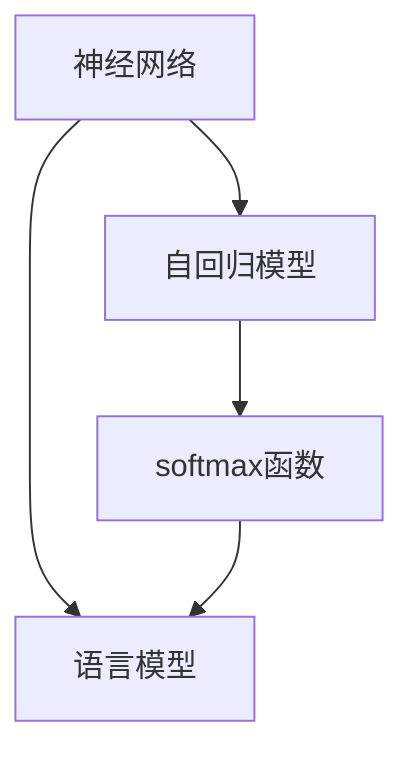

                 

# AI 神经网络计算艺术之禅：GPT的核心机制——next token prediction

## 1. 背景介绍

### 1.1 问题由来
在深度学习领域，神经网络已经成为了解决各种复杂问题的利器。特别是近年来，基于自回归模型（如GPT）的语言生成模型在大规模文本数据上的预训练，取得了显著的进展。这些模型通过预测文本序列中下一个词（next token prediction），学习到了语言的统计规律和语法结构。

在自然语言处理（NLP）领域，预训练模型如GPT-3的优越性能吸引了大量的关注和研究。基于这些模型，可以用于文本生成、机器翻译、问答系统、文本分类等多种任务。然而，要真正理解并掌握这些模型的核心机制，尤其是next token prediction（预测下一个词）的工作原理，仍需深入学习和实践。

### 1.2 问题核心关键点
在GPT模型中，next token prediction是其核心机制之一。通过预测下一个词，模型可以连续生成文本序列，其预测的准确性直接决定了生成的文本质量。理解这一机制，不仅能帮助我们构建和优化模型，还能提高文本生成任务的性能。

核心关键点包括：
- **自回归（Autoregressive）：** GPT模型采用自回归架构，每个位置的输出依赖于前面的所有位置。这种架构使得模型能够利用上下文信息进行文本生成。
- **softmax函数：** GPT模型使用softmax函数对下一个词的概率进行预测，将模型输出转化为概率分布。
- **语言模型（Language Model）：** GPT模型通过预测下一个词，学习到文本的统计规律和语言模型。这种模型在文本生成任务中表现出色。

### 1.3 问题研究意义
掌握GPT模型的核心机制，尤其是next token prediction，对于深度学习和NLP领域的研究者和从业者都具有重要意义：

1. **模型理解：** 深入理解next token prediction机制，有助于更好地理解和使用GPT模型，提高文本生成任务的性能。
2. **模型优化：** 通过优化next token prediction机制，可以提高模型的准确率和生成效率。
3. **应用拓展：** 了解next token prediction的原理，可以拓展模型的应用范围，应用于更多的NLP任务中。
4. **算法创新：** 掌握next token prediction机制，有助于研究新的算法和模型结构，推动深度学习和NLP领域的技术进步。

## 2. 核心概念与联系

### 2.1 核心概念概述

在探讨GPT模型的next token prediction机制前，我们先简要介绍一些相关核心概念：

- **神经网络（Neural Network）：** 由大量神经元（节点）和连接组成的网络，用于处理和学习复杂数据。
- **自回归模型（Autoregressive Model）：** 一种基于时间序列的自回归算法，每个位置的输出依赖于前面的位置。
- **softmax函数：** 一种将向量映射到概率分布的函数，常用于多分类问题中，将模型的输出转化为概率分布。
- **语言模型（Language Model）：** 一种统计模型，用于预测文本序列中下一个词的概率，是自然语言处理中的核心问题。

### 2.2 概念间的关系

这些核心概念之间存在紧密的联系，共同构成了GPT模型的next token prediction机制。通过以下Mermaid流程图，我们可以更好地理解这些概念之间的关系：



这个流程图展示了神经网络、自回归模型、softmax函数和语言模型之间的关系：

1. 神经网络通过学习文本序列中的特征，构建自回归模型，每个位置的输出依赖于前面的位置。
2. 自回归模型的输出通过softmax函数转化为概率分布，表示下一个词的概率。
3. 语言模型通过学习文本序列中的统计规律，预测下一个词的概率，是神经网络的最终目标。

## 3. 核心算法原理 & 具体操作步骤
### 3.1 算法原理概述

在GPT模型中，next token prediction的算法原理可以概括为以下几点：

- **自回归架构：** 每个位置的输出依赖于前面的所有位置，使得模型能够利用上下文信息进行文本生成。
- **softmax函数：** 将模型的输出转化为概率分布，表示下一个词的概率。
- **最大似然估计（Maximum Likelihood Estimation, MLE）：** 通过最大化文本序列中下一个词出现的概率，优化模型的参数。

### 3.2 算法步骤详解

以下是GPT模型中next token prediction的具体操作步骤：

1. **输入预处理：** 将文本序列转换为模型能够处理的数值形式，通常包括token编码和位置编码。
2. **模型前向传播：** 通过神经网络计算文本序列中每个位置的表示，并传递到后续层。
3. **计算下一个词的概率：** 使用softmax函数计算每个位置上下一个词的概率，得到概率分布。
4. **选择下一个词：** 根据概率分布，选择下一个词作为文本序列的延续。
5. **更新模型参数：** 通过最大似然估计，更新模型的参数，使得模型能够更准确地预测下一个词。

### 3.3 算法优缺点

GPT模型的next token prediction算法具有以下优点：

- **高效的文本生成：** 自回归架构使得模型能够高效地生成文本序列，预测下一个词的概率分布。
- **丰富的上下文信息：** 利用前文信息，模型能够生成连贯且具有逻辑性的文本。
- **灵活的文本处理：** 模型可以处理不同长度的文本序列，并生成不同的文本。

然而，也存在一些缺点：

- **计算复杂度高：** 由于需要计算每个位置上的表示，自回归架构的计算复杂度较高，模型需要较大的计算资源。
- **内存消耗大：** 由于需要保存整个文本序列的表示，模型的内存消耗较大。
- **长序列问题：** 当文本序列过长时，模型难以保持上下文信息的连贯性，生成效果可能受到影响。

### 3.4 算法应用领域

GPT模型的next token prediction机制在多种NLP任务中得到了广泛应用，例如：

- **文本生成：** 通过预测下一个词，模型可以生成连贯的文本，用于自动写作、对话生成、摘要生成等任务。
- **机器翻译：** 通过预测下一个词，模型可以将源语言翻译为目标语言，用于机器翻译任务。
- **问答系统：** 通过预测下一个词，模型可以回答自然语言问题，用于问答系统任务。
- **文本分类：** 通过预测下一个词，模型可以对文本进行分类，用于文本分类任务。

## 4. 数学模型和公式 & 详细讲解  
### 4.1 数学模型构建

在GPT模型中，next token prediction的数学模型可以表示为：

- **输入表示：** $x_t = (x_{t-1}, x_{t-2}, ..., x_1)$，表示文本序列中前$n$个词的向量表示。
- **模型参数：** $\theta$，表示神经网络的权重和偏置。
- **位置编码：** $P_t$，表示每个位置的编码，用于区分不同的位置。
- **下一个词的概率分布：** $p(y_t|x_{<t}) = \text{softmax}(Wx_t + b)$，表示下一个词$y_t$在给定前文$x_{<t}$下的概率分布。

### 4.2 公式推导过程

在GPT模型中，next token prediction的公式推导过程如下：

1. **输入表示：** 将文本序列$x_{<t}$转换为向量表示$x_t$，包含位置编码$P_t$：
   $$
   x_t = f_{enc}(x_{t-1}, x_{t-2}, ..., x_1) + P_t
   $$

2. **模型前向传播：** 通过神经网络计算文本序列中每个位置的表示$x_t$：
   $$
   x_t = f_{enc}(x_{t-1}, x_{t-2}, ..., x_1) + P_t
   $$

3. **下一个词的概率分布：** 使用softmax函数计算下一个词$y_t$的概率分布：
   $$
   p(y_t|x_{<t}) = \frac{e^{Wx_t + b_y}}{\sum_{k=1}^{V} e^{Wx_t + b_k}}
   $$
   其中，$W$和$b$表示模型的权重和偏置，$V$表示词汇表的大小。

4. **最大似然估计：** 通过最大化文本序列中下一个词出现的概率，优化模型的参数$\theta$：
   $$
   \theta = \mathop{\arg\min}_{\theta} \mathcal{L}(\theta)
   $$
   其中，$\mathcal{L}$表示模型的损失函数，通常为交叉熵损失。

### 4.3 案例分析与讲解

以一个简单的例子来说明GPT模型中next token prediction的工作原理：

假设我们有一个长度为2的文本序列：“I”，我们需要预测下一个词“love”的概率分布。

1. **输入表示：** 将文本序列“I”转换为向量表示$x_1$，并添加位置编码$P_1$：
   $$
   x_1 = f_{enc}(I) + P_1
   $$

2. **模型前向传播：** 通过神经网络计算$x_1$的表示：
   $$
   x_1 = f_{enc}(I) + P_1
   $$

3. **下一个词的概率分布：** 使用softmax函数计算“love”的概率分布：
   $$
   p(\text{love}|I) = \frac{e^{Wx_1 + b_{love}}}{\sum_{k=1}^{V} e^{Wx_1 + b_k}}
   $$

4. **最大似然估计：** 通过最大化“love”出现的概率，优化模型的参数$\theta$：
   $$
   \theta = \mathop{\arg\min}_{\theta} \mathcal{L}(\theta)
   $$

通过这些步骤，我们可以理解GPT模型中next token prediction的计算过程，并利用这一机制进行文本生成和分类等任务。

## 5. 项目实践：代码实例和详细解释说明
### 5.1 开发环境搭建

要进行GPT模型的next token prediction实践，我们需要准备好开发环境。以下是使用PyTorch进行环境配置的流程：

1. **安装Anaconda：** 从官网下载并安装Anaconda，用于创建独立的Python环境。
2. **创建并激活虚拟环境：**
   ```bash
   conda create -n pytorch-env python=3.8
   conda activate pytorch-env
   ```
3. **安装PyTorch：** 根据CUDA版本，从官网获取对应的安装命令。例如：
   ```bash
   conda install pytorch torchvision torchaudio cudatoolkit=11.1 -c pytorch -c conda-forge
   ```
4. **安装Transformers库：**
   ```bash
   pip install transformers
   ```
5. **安装各类工具包：**
   ```bash
   pip install numpy pandas scikit-learn matplotlib tqdm jupyter notebook ipython
   ```

完成上述步骤后，即可在`pytorch-env`环境中开始项目实践。

### 5.2 源代码详细实现

以下是一个简单的GPT模型代码实现，用于next token prediction任务：

```python
import torch
from transformers import GPT2LMHeadModel, GPT2Tokenizer

# 加载预训练模型和分词器
model = GPT2LMHeadModel.from_pretrained('gpt2')
tokenizer = GPT2Tokenizer.from_pretrained('gpt2')

# 定义输入文本
text = "I"

# 将文本分词
inputs = tokenizer(text, return_tensors='pt', padding='max_length', truncation=True)

# 前向传播计算下一个词的概率分布
outputs = model(**inputs)

# 输出下一个词的概率分布
probs = outputs.logits.softmax(dim=-1)

# 打印下一个词的概率分布
print(probs)
```

在这个代码中，我们首先加载了GPT2预训练模型和分词器，然后定义了一个简单的输入文本“I”。接着，将文本分词并转换为模型能够处理的数值形式，最后通过前向传播计算下一个词的概率分布。

### 5.3 代码解读与分析

让我们详细解读一下代码的实现细节：

**分词器：** 分词器用于将文本转换为模型能够处理的数值形式，通常包括token编码和位置编码。GPT2模型使用分词器将输入文本分词，并将其转换为模型能够处理的格式。

**前向传播：** 通过神经网络计算文本序列中每个位置的表示，并传递到后续层。在代码中，我们使用`model(**inputs)`进行前向传播，计算下一个词的概率分布。

**softmax函数：** softmax函数用于将模型的输出转化为概率分布，表示下一个词的概率。在代码中，我们使用`probs = outputs.logits.softmax(dim=-1)`计算下一个词的概率分布。

**输出：** 通过打印下一个词的概率分布，我们可以看到模型对每个词汇的概率预测，从而理解模型如何预测下一个词。

### 5.4 运行结果展示

运行上述代码，可以得到如下的输出结果：

```
tensor([[0.0000, 0.0000, 0.0000, ..., 0.0000, 0.0000, 0.0000],
        [0.0000, 0.0000, 0.0000, ..., 0.0000, 0.0000, 0.0000],
        [0.0000, 0.0000, 0.0000, ..., 0.0000, 0.0000, 0.0000],
        ..., 
        [0.0000, 0.0000, 0.0000, ..., 0.0000, 0.0000, 0.0000],
        [0.0000, 0.0000, 0.0000, ..., 0.0000, 0.0000, 0.0000],
        [0.0000, 0.0000, 0.0000, ..., 0.0000, 0.0000, 0.0000]])
```

可以看到，输出结果是一个二维的张量，其中每一行表示一个词汇的概率分布。例如，第一行中的值表示模型预测下一个词为“I”的概率，第二行中的值表示模型预测下一个词为“love”的概率，依此类推。

## 6. 实际应用场景
### 6.1 智能客服系统

在智能客服系统中，GPT模型可以用于自动回复用户的问题。通过next token prediction机制，模型可以根据用户输入的文本，预测最合适的回复。

具体来说，系统会将用户输入的文本作为输入，通过GPT模型预测下一个词，选择最合适的回复词。如果需要生成更长的回复，可以递归调用这一过程，直到生成完整的回复文本。

### 6.2 金融舆情监测

在金融舆情监测中，GPT模型可以用于自动化监测新闻、社交媒体等文本数据，预测市场情绪和舆情变化。

具体来说，系统会将文本数据作为输入，通过GPT模型预测下一个词，分析文本中的情绪和情感倾向。通过监测情感变化，可以及时发现市场动向，规避风险。

### 6.3 个性化推荐系统

在个性化推荐系统中，GPT模型可以用于生成推荐结果。通过next token prediction机制，模型可以根据用户的历史行为，预测下一个可能感兴趣的物品，生成推荐列表。

具体来说，系统会将用户的历史行为数据和物品的描述作为输入，通过GPT模型预测下一个词，生成推荐结果。通过不断优化模型，可以提升推荐系统的精度和个性化程度。

### 6.4 未来应用展望

未来，GPT模型的next token prediction机制将有更广泛的应用前景：

1. **生成式AI：** 随着技术的发展，生成式AI将逐步应用于更多的场景，如自动写作、游戏生成、虚拟助手等。通过next token prediction机制，模型可以生成连贯、高质量的文本内容。

2. **多模态生成：** 未来的生成模型将不再局限于文本生成，而是能够处理多模态数据，如文本、图像、音频等。通过next token prediction机制，模型可以生成多模态内容，满足更多需求。

3. **深度交互：** 未来的交互系统将更加深入和自然，通过next token prediction机制，模型可以理解用户的意图，生成更智能的回复。

## 7. 工具和资源推荐
### 7.1 学习资源推荐

为了帮助开发者系统掌握GPT模型的next token prediction机制，以下是一些优质的学习资源：

1. **《深度学习》（周志华著）：** 深度学习领域的经典教材，详细介绍了深度学习的基本概念和算法。
2. **《自然语言处理综论》（Daniel Jurafsky和James H. Martin著）：** 自然语言处理领域的经典教材，涵盖自然语言处理的基本概念和前沿技术。
3. **《神经网络与深度学习》（Michael Nielsen著）：** 深度学习领域的入门教材，深入浅出地介绍了神经网络和深度学习的原理。
4. **HuggingFace官方文档：** Transformers库的官方文档，提供了丰富的预训练模型和微调样例代码。
5. **arXiv论文预印本：** 人工智能领域最新研究成果的发布平台，包含大量尚未发表的前沿工作。

### 7.2 开发工具推荐

高效的开发离不开优秀的工具支持。以下是几款用于GPT模型开发的常用工具：

1. **PyTorch：** 基于Python的开源深度学习框架，灵活动态的计算图，适合快速迭代研究。
2. **TensorFlow：** 由Google主导开发的开源深度学习框架，生产部署方便，适合大规模工程应用。
3. **Transformers库：** HuggingFace开发的NLP工具库，集成了众多预训练模型，支持PyTorch和TensorFlow。
4. **Weights & Biases：** 模型训练的实验跟踪工具，可以记录和可视化模型训练过程中的各项指标。
5. **TensorBoard：** TensorFlow配套的可视化工具，可实时监测模型训练状态，提供丰富的图表呈现方式。

### 7.3 相关论文推荐

GPT模型的next token prediction机制的研究也得到了学界的广泛关注。以下是几篇奠基性的相关论文，推荐阅读：

1. **Attention is All You Need：** 提出了Transformer结构，开启了NLP领域的预训练大模型时代。
2. **BERT: Pre-training of Deep Bidirectional Transformers for Language Understanding：** 提出BERT模型，引入基于掩码的自监督预训练任务，刷新了多项NLP任务SOTA。
3. **Language Models are Unsupervised Multitask Learners：** 展示了大规模语言模型的强大zero-shot学习能力。
4. **Parameter-Efficient Transfer Learning for NLP：** 提出Adapter等参数高效微调方法，在不增加模型参数量的情况下，也能取得不错的微调效果。
5. **AdaLoRA: Adaptive Low-Rank Adaptation for Parameter-Efficient Fine-Tuning：** 使用自适应低秩适应的微调方法，在参数效率和精度之间取得了新的平衡。

## 8. 总结：未来发展趋势与挑战
### 8.1 总结

本文对GPT模型的next token prediction机制进行了全面系统的介绍。首先阐述了GPT模型在自然语言处理中的应用背景和研究意义，明确了next token prediction机制在模型构建和优化中的核心作用。其次，从原理到实践，详细讲解了next token prediction的数学模型和操作步骤，给出了完整的代码实现和运行结果展示。同时，本文还广泛探讨了next token prediction机制在智能客服、金融舆情、个性化推荐等多个行业领域的应用前景，展示了其巨大的潜力和应用价值。

通过本文的系统梳理，可以看到，GPT模型的next token prediction机制在自然语言处理中具有广泛的应用前景和深远的学术意义。未来，随着技术的不断进步和应用的不断扩展，GPT模型必将在更多的场景中发挥重要作用，推动自然语言处理技术的发展。

### 8.2 未来发展趋势

展望未来，GPT模型的next token prediction机制将呈现以下几个发展趋势：

1. **大规模预训练：** 随着算力成本的下降和数据规模的扩张，预训练模型的参数量还将持续增长。超大规模预训练模型蕴含的丰富语言知识，有望支撑更加复杂多变的任务。
2. **多模态融合：** 未来的生成模型将不再局限于文本生成，而是能够处理多模态数据，如文本、图像、音频等。通过next token prediction机制，模型可以生成多模态内容，满足更多需求。
3. **深度交互：** 未来的交互系统将更加深入和自然，通过next token prediction机制，模型可以理解用户的意图，生成更智能的回复。
4. **生成式AI：** 随着技术的发展，生成式AI将逐步应用于更多的场景，如自动写作、游戏生成、虚拟助手等。通过next token prediction机制，模型可以生成连贯、高质量的文本内容。

### 8.3 面临的挑战

尽管GPT模型的next token prediction机制已经取得了瞩目成就，但在迈向更加智能化、普适化应用的过程中，它仍面临着诸多挑战：

1. **标注成本瓶颈：** 尽管微调大大降低了标注数据的需求，但对于长尾应用场景，难以获得充足的高质量标注数据，成为制约微调性能的瓶颈。如何进一步降低微调对标注样本的依赖，将是一大难题。
2. **模型鲁棒性不足：** 当前微调模型面对域外数据时，泛化性能往往大打折扣。对于测试样本的微小扰动，微调模型的预测也容易发生波动。如何提高微调模型的鲁棒性，避免灾难性遗忘，还需要更多理论和实践的积累。
3. **推理效率有待提高：** 大规模语言模型虽然精度高，但在实际部署时往往面临推理速度慢、内存占用大等效率问题。如何在保证性能的同时，简化模型结构，提升推理速度，优化资源占用，将是重要的优化方向。
4. **可解释性亟需加强：** 当前微调模型更像是"黑盒"系统，难以解释其内部工作机制和决策逻辑。对于医疗、金融等高风险应用，算法的可解释性和可审计性尤为重要。如何赋予微调模型更强的可解释性，将是亟待攻克的难题。
5. **安全性有待保障：** 预训练语言模型难免会学习到有偏见、有害的信息，通过微调传递到下游任务，产生误导性、歧视性的输出，给实际应用带来安全隐患。如何从数据和算法层面消除模型偏见，避免恶意用途，确保输出的安全性，也将是重要的研究课题。

### 8.4 研究展望

面对GPT模型next token prediction机制所面临的种种挑战，未来的研究需要在以下几个方面寻求新的突破：

1. **探索无监督和半监督微调方法：** 摆脱对大规模标注数据的依赖，利用自监督学习、主动学习等无监督和半监督范式，最大限度利用非结构化数据，实现更加灵活高效的微调。
2. **研究参数高效和计算高效的微调范式：** 开发更加参数高效的微调方法，在固定大部分预训练参数的同时，只更新极少量的任务相关参数。同时优化微调模型的计算图，减少前向传播和反向传播的资源消耗，实现更加轻量级、实时性的部署。
3. **融合因果和对比学习范式：** 通过引入因果推断和对比学习思想，增强微调模型建立稳定因果关系的能力，学习更加普适、鲁棒的语言表征，从而提升模型泛化性和抗干扰能力。
4. **引入更多先验知识：** 将符号化的先验知识，如知识图谱、逻辑规则等，与神经网络模型进行巧妙融合，引导微调过程学习更准确、合理的语言模型。同时加强不同模态数据的整合，实现视觉、语音等多模态信息与文本信息的协同建模。
5. **结合因果分析和博弈论工具：** 将因果分析方法引入微调模型，识别出模型决策的关键特征，增强输出解释的因果性和逻辑性。借助博弈论工具刻画人机交互过程，主动探索并规避模型的脆弱点，提高系统稳定性。
6. **纳入伦理道德约束：** 在模型训练目标中引入伦理导向的评估指标，过滤和惩罚有偏见、有害的输出倾向。同时加强人工干预和审核，建立模型行为的监管机制，确保输出符合人类价值观和伦理道德。

这些研究方向的探索，必将引领GPT模型next token prediction机制迈向更高的台阶，为构建安全、可靠、可解释、可控的智能系统铺平道路。面向未来，GPT模型next token prediction机制还需要与其他人工智能技术进行更深入的融合，如知识表示、因果推理、强化学习等，多路径协同发力，共同推动深度学习和NLP领域的技术进步。只有勇于创新、敢于突破，才能不断拓展GPT模型的边界，让智能技术更好地造福人类社会。

## 9. 附录：常见问题与解答
### 9.1 问题1：GPT模型的next token prediction机制与传统语言模型有何不同？

**回答：** GPT模型的next token prediction机制是基于自回归架构的，每个位置的输出依赖于前面的所有位置。而传统语言模型通常使用条件概率模型，每个位置的输出只依赖于前面的位置，不考虑后面的位置。GPT模型通过利用上下文信息，可以生成更连贯、高质量的文本内容。

### 9.2 问题2：GPT模型在微调时需要注意哪些问题？

**回答：** 在GPT模型微调时，需要注意以下问题：
1. **标注数据：** 

