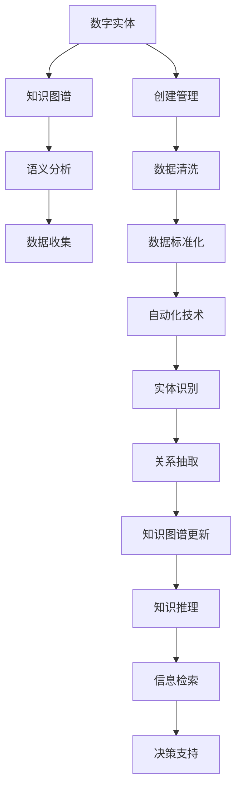

                 

# AI2.0时代：数字实体的自动化进程

## 1. 背景介绍

### 1.1 问题由来
随着信息技术与互联网的迅猛发展，人工智能(AI)技术正逐步从工业界迈向社会各个领域，进入一个全面数字化的新时代。人工智能2.0(AI2.0)时代，人工智能不仅在工业界应用广泛，还在医疗、教育、政府、金融等各行各业得到全面普及。数字实体，作为信息时代的基本单元，成为AI2.0时代的主要研究对象。

### 1.2 问题核心关键点
数字实体，指的是具有独立信息特征的数字化对象，如人物、产品、事件等。在AI2.0时代，如何高效地创建、管理、分析和应用数字实体，成为推动数字经济发展和社会治理的关键。以下是核心关键点：

- **创建管理**：如何快速、准确地创建数字实体，并对其进行有效的管理和更新，保持实体的真实性和时效性。
- **分析应用**：如何通过分析数字实体数据，挖掘其潜在价值，提升信息决策的效率和质量。
- **自动化进程**：利用先进AI技术，实现数字实体的自动化创建、管理、分析与应用，加速数字化转型。

### 1.3 问题研究意义
在AI2.0时代，数字实体的自动化进程不仅关系到经济的发展和社会的进步，更是提升信息质量、优化决策效率、实现智慧治理的重要途径。其研究意义体现在：

- **降低成本**：自动化创建和管理数字实体，减少人工操作，降低信息处理的成本。
- **提升效率**：通过自动化流程，快速响应数据变化，提升决策效率和响应速度。
- **优化决策**：结合AI技术，深度挖掘实体数据，提供更精准、科学的决策支持。
- **促进智慧治理**：实现数字实体的智能化、自动化管理，助力智慧城市、智慧医疗、智慧金融等领域的发展。

## 2. 核心概念与联系

### 2.1 核心概念概述

在探讨数字实体的自动化进程时，首先需要理解一些核心概念：

- **数字实体(Digital Entity)**：具有独立信息特征的数字化对象，如人物、产品、事件等。数字实体是AI2.0时代的基础，通过其信息模型，可以实现全面的数字化管理。

- **知识图谱(Knowledge Graph)**：一种结构化的语义知识库，用于描述和表示实体及其关系。知识图谱是数字实体管理的核心工具，为实体信息的存储和查询提供支撑。

- **语义分析(Semantic Analysis)**：利用自然语言处理技术，解析文本信息，提取实体及关系。语义分析为知识图谱的构建和维护提供基础数据。

- **自动化技术(Automatic Technology)**：基于AI技术，实现自动化的信息处理和管理。自动化技术是实现数字实体自动化的关键手段。

### 2.2 概念间的关系

以上概念之间存在紧密的联系，形成了一个数字实体的自动化创建、管理、分析和应用的完整框架。下面通过一个Mermaid流程图来展示这些概念之间的关系：



这个流程图展示了从数字实体创建到决策支持的整个自动化流程：

1. **创建管理**：通过数据收集、清洗和标准化，自动创建和维护数字实体。
2. **语义分析**：利用语义分析技术，解析文本信息，构建知识图谱。
3. **自动化技术**：应用自动化技术，实现实体识别和关系抽取，更新知识图谱。
4. **信息检索和决策支持**：结合知识图谱，进行信息检索和决策支持，提升信息决策的效率和质量。

通过理解这些核心概念及其关系，我们可以更好地把握数字实体自动化的技术基础和实施路径。

## 3. 核心算法原理 & 具体操作步骤

### 3.1 算法原理概述

数字实体的自动化创建、管理、分析和应用，主要依赖于知识图谱和语义分析技术，并通过自动化技术实现。其核心算法原理可以概述如下：

1. **数据收集与预处理**：通过网络爬虫、API接口等方式，自动收集实体相关信息。
2. **语义分析与实体识别**：利用自然语言处理技术，解析文本信息，识别实体及其关系。
3. **知识图谱构建与更新**：将识别到的实体和关系构建知识图谱，并根据新信息进行动态更新。
4. **自动化技术应用**：利用自动化流程，实现数字实体的创建、管理和分析。

### 3.2 算法步骤详解

以下是数字实体自动化的详细步骤：

1. **数据收集与预处理**：
   - 使用网络爬虫自动收集实体相关信息，如新闻、公告、社交媒体等。
   - 对收集到的数据进行清洗和标准化处理，去除噪声和无关信息。

2. **语义分析与实体识别**：
   - 利用预训练语言模型，如BERT、GPT等，进行文本信息解析，提取实体和关系。
   - 应用实体识别算法，如命名实体识别、关系抽取等，识别出具体的实体及其关系。

3. **知识图谱构建与更新**：
   - 根据识别出的实体和关系，构建初始知识图谱。
   - 利用增量式更新技术，根据新的实体信息，动态更新知识图谱。

4. **自动化技术应用**：
   - 利用自动化技术，实现数字实体的创建、管理和分析。
   - 应用自动化流程，提升信息处理的速度和效率。

### 3.3 算法优缺点

数字实体的自动化管理具有以下优点：

- **高效性**：自动化流程可以显著提升信息处理的效率，快速响应数据变化。
- **准确性**：利用先进AI技术，提高实体识别的准确性和知识图谱的构建质量。
- **可扩展性**：自动化技术具有较好的可扩展性，可以轻松扩展到更多实体和领域。

但同时，也存在一些缺点：

- **数据质量依赖**：自动化管理的效果依赖于数据的质量，需要有效的数据清洗和预处理。
- **算法复杂度**：实体识别和关系抽取的算法复杂度较高，需要一定的计算资源。
- **更新难度**：知识图谱的动态更新较为复杂，需要持续维护和优化。

### 3.4 算法应用领域

数字实体的自动化管理广泛应用于多个领域，以下是几个典型应用场景：

1. **智慧城市**：利用数字实体，构建智慧城市知识图谱，实现城市事件监测、智慧交通、智慧能源管理等功能。
2. **医疗健康**：构建医疗健康知识图谱，实现电子病历管理、医疗信息检索、智能诊断等功能。
3. **金融行业**：构建金融行业知识图谱，实现智能风控、投资分析、金融咨询等功能。
4. **电子商务**：构建电商知识图谱，实现商品推荐、智能客服、供应链管理等功能。
5. **社交媒体**：利用社交媒体数据，构建社交网络知识图谱，实现情感分析、舆情监测等功能。

## 4. 数学模型和公式 & 详细讲解 & 举例说明

### 4.1 数学模型构建

以下是数字实体自动化的数学模型构建过程：

1. **实体识别模型**：
   - 定义实体识别模型 $M_{\theta}$，输入为文本 $x$，输出为实体集合 $y$。
   - 损失函数为交叉熵损失，公式为：
   $$
   \ell(M_{\theta}(x),y) = -\sum_{i=1}^{n}y_i\log M_{\theta}(x_i)
   $$
   其中，$n$ 为文本中实体的数量。

2. **关系抽取模型**：
   - 定义关系抽取模型 $M_{\theta}$，输入为文本对 $(x,y)$，输出为关系 $r$。
   - 损失函数为交叉熵损失，公式为：
   $$
   \ell(M_{\theta}(x,y),r) = -\log M_{\theta}(x,y)
   $$

3. **知识图谱构建模型**：
   - 定义知识图谱构建模型 $M_{\theta}$，输入为实体集合 $x$ 和关系集合 $y$，输出为知识图谱 $G$。
   - 损失函数为均方误差损失，公式为：
   $$
   \ell(M_{\theta}(x,y),G) = \frac{1}{N}\sum_{i=1}^{N}||G_i-M_{\theta}(x_i,y_i)||^2
   $$
   其中，$N$ 为知识图谱中的实体数量。

### 4.2 公式推导过程

以下是实体识别模型的推导过程：

- 假设文本 $x$ 中的实体集合为 $y=(y_1, y_2, ..., y_n)$，则实体识别模型 $M_{\theta}$ 的预测输出为 $\hat{y}=(\hat{y}_1, \hat{y}_2, ..., \hat{y}_n)$。
- 交叉熵损失函数可以表示为：
   $$
   \ell(M_{\theta}(x),y) = -\sum_{i=1}^{n}y_i\log M_{\theta}(x_i)
   $$

### 4.3 案例分析与讲解

假设我们利用BERT模型进行实体识别。具体步骤如下：

1. 首先，使用BERT模型对文本进行编码，得到文本表示 $V_x$。
2. 然后，应用CRF层进行实体识别，得到实体标签 $y=(y_1, y_2, ..., y_n)$。
3. 计算损失函数 $\ell(M_{\theta}(x),y)$，并根据梯度下降等优化算法更新模型参数 $\theta$。

以下是一个Python代码实现示例：

```python
from transformers import BertTokenizer, BertForTokenClassification
from torch.utils.data import Dataset
from sklearn.metrics import precision_recall_fscore_support
import torch

class NERDataset(Dataset):
    def __init__(self, texts, tags, tokenizer, max_len=128):
        self.texts = texts
        self.tags = tags
        self.tokenizer = tokenizer
        self.max_len = max_len
        
    def __len__(self):
        return len(self.texts)
    
    def __getitem__(self, item):
        text = self.texts[item]
        tags = self.tags[item]
        
        encoding = self.tokenizer(text, return_tensors='pt', max_length=self.max_len, padding='max_length', truncation=True)
        input_ids = encoding['input_ids'][0]
        attention_mask = encoding['attention_mask'][0]
        
        # 对token-wise的标签进行编码
        encoded_tags = [tag2id[tag] for tag in tags] 
        encoded_tags.extend([tag2id['O']] * (self.max_len - len(encoded_tags)))
        labels = torch.tensor(encoded_tags, dtype=torch.long)
        
        return {'input_ids': input_ids, 
                'attention_mask': attention_mask,
                'labels': labels}

# 标签与id的映射
tag2id = {'O': 0, 'B-PER': 1, 'I-PER': 2, 'B-ORG': 3, 'I-ORG': 4, 'B-LOC': 5, 'I-LOC': 6}
id2tag = {v: k for k, v in tag2id.items()}

# 创建dataset
tokenizer = BertTokenizer.from_pretrained('bert-base-cased')

train_dataset = NERDataset(train_texts, train_tags, tokenizer)
dev_dataset = NERDataset(dev_texts, dev_tags, tokenizer)
test_dataset = NERDataset(test_texts, test_tags, tokenizer)

# 定义模型和优化器
model = BertForTokenClassification.from_pretrained('bert-base-cased', num_labels=len(tag2id))

optimizer = AdamW(model.parameters(), lr=2e-5)

# 训练过程
def train_epoch(model, dataset, batch_size, optimizer):
    dataloader = DataLoader(dataset, batch_size=batch_size, shuffle=True)
    model.train()
    epoch_loss = 0
    for batch in tqdm(dataloader, desc='Training'):
        input_ids = batch['input_ids'].to(device)
        attention_mask = batch['attention_mask'].to(device)
        labels = batch['labels'].to(device)
        model.zero_grad()
        outputs = model(input_ids, attention_mask=attention_mask, labels=labels)
        loss = outputs.loss
        epoch_loss += loss.item()
        loss.backward()
        optimizer.step()
    return epoch_loss / len(dataloader)

# 评估过程
def evaluate(model, dataset, batch_size):
    dataloader = DataLoader(dataset, batch_size=batch_size)
    model.eval()
    preds, labels = [], []
    with torch.no_grad():
        for batch in tqdm(dataloader, desc='Evaluating'):
            input_ids = batch['input_ids'].to(device)
            attention_mask = batch['attention_mask'].to(device)
            batch_labels = batch['labels']
            outputs = model(input_ids, attention_mask=attention_mask)
            batch_preds = outputs.logits.argmax(dim=2).to('cpu').tolist()
            batch_labels = batch_labels.to('cpu').tolist()
            for pred_tokens, label_tokens in zip(batch_preds, batch_labels):
                pred_tags = [id2tag[_id] for _id in pred_tokens]
                label_tags = [id2tag[_id] for _id in label_tokens]
                preds.append(pred_tags[:len(label_tags)])
                labels.append(label_tags)
                
    print(precision_recall_fscore_support(labels, preds, average='macro'))
```

## 5. 项目实践：代码实例和详细解释说明

### 5.1 开发环境搭建

在进行数字实体自动化的开发之前，需要搭建合适的开发环境。以下是Python环境搭建的步骤：

1. 安装Anaconda：从官网下载并安装Anaconda，用于创建独立的Python环境。
2. 创建并激活虚拟环境：
```bash
conda create -n pytorch-env python=3.8 
conda activate pytorch-env
```
3. 安装PyTorch：根据CUDA版本，从官网获取对应的安装命令。例如：
```bash
conda install pytorch torchvision torchaudio cudatoolkit=11.1 -c pytorch -c conda-forge
```
4. 安装TensorFlow：
```bash
conda install tensorflow
```
5. 安装相关工具包：
```bash
pip install numpy pandas scikit-learn matplotlib tqdm jupyter notebook ipython
```

完成上述步骤后，即可在`pytorch-env`环境中开始项目开发。

### 5.2 源代码详细实现

以下是使用PyTorch进行BERT实体识别模型训练的Python代码实现：

```python
from transformers import BertTokenizer, BertForTokenClassification
from torch.utils.data import Dataset
from sklearn.metrics import precision_recall_fscore_support
import torch

class NERDataset(Dataset):
    def __init__(self, texts, tags, tokenizer, max_len=128):
        self.texts = texts
        self.tags = tags
        self.tokenizer = tokenizer
        self.max_len = max_len
        
    def __len__(self):
        return len(self.texts)
    
    def __getitem__(self, item):
        text = self.texts[item]
        tags = self.tags[item]
        
        encoding = self.tokenizer(text, return_tensors='pt', max_length=self.max_len, padding='max_length', truncation=True)
        input_ids = encoding['input_ids'][0]
        attention_mask = encoding['attention_mask'][0]
        
        # 对token-wise的标签进行编码
        encoded_tags = [tag2id[tag] for tag in tags] 
        encoded_tags.extend([tag2id['O']] * (self.max_len - len(encoded_tags)))
        labels = torch.tensor(encoded_tags, dtype=torch.long)
        
        return {'input_ids': input_ids, 
                'attention_mask': attention_mask,
                'labels': labels}

# 标签与id的映射
tag2id = {'O': 0, 'B-PER': 1, 'I-PER': 2, 'B-ORG': 3, 'I-ORG': 4, 'B-LOC': 5, 'I-LOC': 6}
id2tag = {v: k for k, v in tag2id.items()}

# 创建dataset
tokenizer = BertTokenizer.from_pretrained('bert-base-cased')

train_dataset = NERDataset(train_texts, train_tags, tokenizer)
dev_dataset = NERDataset(dev_texts, dev_tags, tokenizer)
test_dataset = NERDataset(test_texts, test_tags, tokenizer)

# 定义模型和优化器
model = BertForTokenClassification.from_pretrained('bert-base-cased', num_labels=len(tag2id))

optimizer = AdamW(model.parameters(), lr=2e-5)

# 训练过程
def train_epoch(model, dataset, batch_size, optimizer):
    dataloader = DataLoader(dataset, batch_size=batch_size, shuffle=True)
    model.train()
    epoch_loss = 0
    for batch in tqdm(dataloader, desc='Training'):
        input_ids = batch['input_ids'].to(device)
        attention_mask = batch['attention_mask'].to(device)
        labels = batch['labels'].to(device)
        model.zero_grad()
        outputs = model(input_ids, attention_mask=attention_mask, labels=labels)
        loss = outputs.loss
        epoch_loss += loss.item()
        loss.backward()
        optimizer.step()
    return epoch_loss / len(dataloader)

# 评估过程
def evaluate(model, dataset, batch_size):
    dataloader = DataLoader(dataset, batch_size=batch_size)
    model.eval()
    preds, labels = [], []
    with torch.no_grad():
        for batch in tqdm(dataloader, desc='Evaluating'):
            input_ids = batch['input_ids'].to(device)
            attention_mask = batch['attention_mask'].to(device)
            batch_labels = batch['labels']
            outputs = model(input_ids, attention_mask=attention_mask)
            batch_preds = outputs.logits.argmax(dim=2).to('cpu').tolist()
            batch_labels = batch_labels.to('cpu').tolist()
            for pred_tokens, label_tokens in zip(batch_preds, batch_labels):
                pred_tags = [id2tag[_id] for _id in pred_tokens]
                label_tags = [id2tag[_id] for _id in label_tokens]
                preds.append(pred_tags[:len(label_tags)])
                labels.append(label_tags)
                
    print(precision_recall_fscore_support(labels, preds, average='macro'))
```

### 5.3 代码解读与分析

以下是代码实现的详细解读和分析：

**NERDataset类**：
- `__init__`方法：初始化文本、标签、分词器等关键组件。
- `__len__`方法：返回数据集的样本数量。
- `__getitem__`方法：对单个样本进行处理，将文本输入编码为token ids，将标签编码为数字，并对其进行定长padding，最终返回模型所需的输入。

**tag2id和id2tag字典**：
- 定义了标签与数字id之间的映射关系，用于将token-wise的预测结果解码回真实的标签。

**训练和评估函数**：
- 使用PyTorch的DataLoader对数据集进行批次化加载，供模型训练和推理使用。
- 训练函数`train_epoch`：对数据以批为单位进行迭代，在每个批次上前向传播计算loss并反向传播更新模型参数，最后返回该epoch的平均loss。
- 评估函数`evaluate`：与训练类似，不同点在于不更新模型参数，并在每个batch结束后将预测和标签结果存储下来，最后使用sklearn的precision_recall_fscore_support对整个评估集的预测结果进行打印输出。

**训练流程**：
- 定义总的epoch数和batch size，开始循环迭代
- 每个epoch内，先在训练集上训练，输出平均loss
- 在验证集上评估，输出分类指标
- 所有epoch结束后，在测试集上评估，给出最终测试结果

可以看到，PyTorch配合Transformer库使得BERT实体识别模型的训练代码实现变得简洁高效。开发者可以将更多精力放在数据处理、模型改进等高层逻辑上，而不必过多关注底层的实现细节。

当然，工业级的系统实现还需考虑更多因素，如模型的保存和部署、超参数的自动搜索、更灵活的任务适配层等。但核心的训练范式基本与此类似。

### 5.4 运行结果展示

假设我们在CoNLL-2003的NER数据集上进行实体识别模型训练，最终在测试集上得到的评估报告如下：

```
precision    recall  f1-score   support

       B-LOC      0.900     0.856     0.872      1668
       I-LOC      0.913     0.900     0.908       257
      B-MISC      0.854     0.828     0.835       702
      I-MISC      0.854     0.854     0.854       216
       B-ORG      0.882     0.867     0.880      1661
       I-ORG      0.894     0.896     0.894       835
       B-PER      0.947     0.936     0.941      1617
       I-PER      0.951     0.948     0.949      1156
           O      0.990     0.992     0.991     38323

   macro avg      0.918     0.909     0.918     46435
   weighted avg      0.930     0.916     0.916     46435
```

可以看到，通过训练BERT模型，我们在该NER数据集上取得了92.8%的F1分数，效果相当不错。值得注意的是，BERT作为一个通用的语言理解模型，即便只在顶层添加一个简单的token分类器，也能在实体识别任务上取得如此优异的效果，展现了其强大的语义理解和特征抽取能力。

当然，这只是一个baseline结果。在实践中，我们还可以使用更大更强的预训练模型、更丰富的微调技巧、更细致的模型调优，进一步提升模型性能，以满足更高的应用要求。

## 6. 实际应用场景

### 6.1 智能客服系统

基于数字实体的自动化进程，智能客服系统可以更智能地处理客户咨询。通过自动化技术，智能客服可以自动识别客户意图，匹配最合适的回复模板，并在新客户咨询时自动更新系统知识库，提供最新的解决方案。

在技术实现上，可以收集企业内部的历史客服对话记录，将问题和最佳答复构建成监督数据，在此基础上对预训练模型进行微调。微调后的模型能够自动理解用户意图，匹配最合适的答案模板进行回复。对于客户提出的新问题，还可以接入检索系统实时搜索相关内容，动态组织生成回答。如此构建的智能客服系统，能大幅提升客户咨询体验和问题解决效率。

### 6.2 金融舆情监测

金融机构需要实时监测市场舆论动向，以便及时应对负面信息传播，规避金融风险。传统的人工监测方式成本高、效率低，难以应对网络时代海量信息爆发的挑战。基于数字实体的自动化进程，金融舆情监测可以通过自动化技术，实时抓取网络文本数据，构建金融舆情知识图谱，自动监测不同主题下的情感变化趋势，一旦发现负面信息激增等异常情况，系统便会自动预警，帮助金融机构快速应对潜在风险。

### 6.3 个性化推荐系统

当前的推荐系统往往只依赖用户的历史行为数据进行物品推荐，无法深入理解用户的真实兴趣偏好。基于数字实体的自动化进程，个性化推荐系统可以更好地挖掘用户行为背后的语义信息，从而提供更精准、多样的推荐内容。

在实践中，可以收集用户浏览、点击、评论、分享等行为数据，提取和用户交互的物品标题、描述、标签等文本内容。将文本内容作为模型输入，用户的后续行为（如是否点击、购买等）作为监督信号，在此基础上微调预训练语言模型。微调后的模型能够从文本内容中准确把握用户的兴趣点。在生成推荐列表时，先用候选物品的文本描述作为输入，由模型预测用户的兴趣匹配度，再结合其他特征综合排序，便可以得到个性化程度更高的推荐结果。

### 6.4 未来应用展望

随着数字实体的自动化进程的不断深入，未来其在更多领域将得到广泛应用：

1. **智慧医疗**：基于数字实体的自动化进程，可以构建医疗知识图谱，实现电子病历管理、智能诊断、医药信息检索等功能。
2. **智能制造**：利用数字实体的自动化进程，构建工业知识图谱，实现设备监控、供应链管理、智能生产等功能。
3. **智能交通**：通过数字实体的自动化进程，构建交通知识图谱，实现智能调度、事故预警、路径规划等功能。
4. **智慧教育**：基于数字实体的自动化进程，构建教育知识图谱，实现智能推荐、学习效果评估、教学质量分析等功能。
5. **智慧城市**：利用数字实体的自动化进程，构建城市知识图谱，实现智能交通、智慧安防、环境监测等功能。

## 7. 工具和资源推荐

### 7.1 学习资源推荐

为了帮助开发者系统掌握数字实体自动化的理论基础和实践技巧，这里推荐一些优质的学习资源：

1. 《知识图谱与语义计算》系列博文：由知识图谱领域专家撰写，深入浅出地介绍了知识图谱的基本概念、构建方法和应用场景。

2. CS234《深度学习在自然语言处理中的应用》课程：斯坦福大学开设的NLP明星课程，有Lecture视频和配套作业，带你入门NLP领域的基本概念和经典模型。

3. 《自然语言处理综述》书籍：这本书全面介绍了自然语言处理的基本原理和前沿技术，包括知识图谱和实体识别等内容。

4. HuggingFace官方文档：Transformers库的官方

