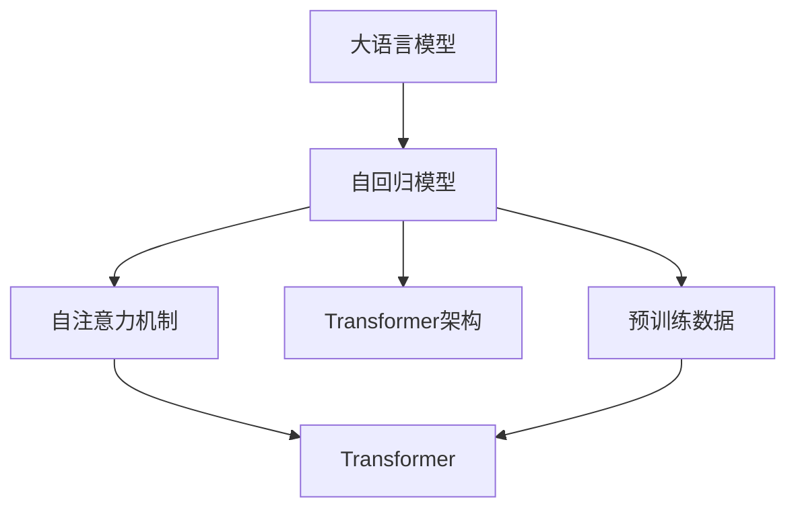
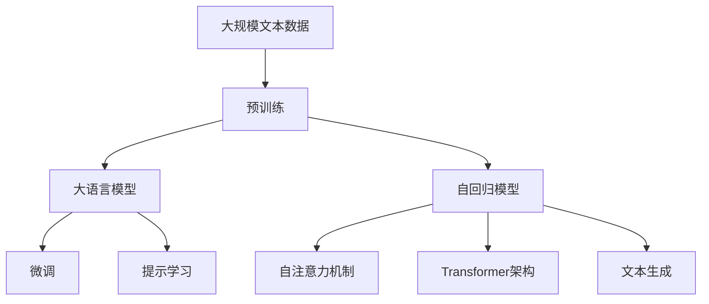

                 

# AIGC从入门到实战：不识庐山真面目：GPT 模型为什么能生成有意义的文本？

> 关键词：大语言模型,自回归模型,自注意力机制,Transformer,BERT,文本生成,语言模型

## 1. 背景介绍

### 1.1 问题由来
随着人工智能技术的发展，生成对抗网络(GANs)、自编码器(Autoencoders)等算法在图像、音频等领域取得了显著的成就。但是，在自然语言处理(NLP)领域，传统的机器学习算法如朴素贝叶斯、决策树等，难以应对语言的复杂性和多样性。因此，研究人员开始探索使用深度学习模型来处理自然语言任务，特别是在文本生成方面。

文本生成，即使用算法生成符合语法和语义规则的文本，是人工智能研究中的一个重要方向。文本生成不仅可以用于自动化内容生成，如新闻报道、文学创作、聊天机器人等，还可以用于数据增强、隐私保护、自然语言理解等领域。其中，生成式预训练模型(Generative Pre-trained Transformer, GPT)系列模型，由于其出色的文本生成能力，成为了AI领域的研究热点。

GPT模型采用了一种新颖的自回归模型架构，通过自注意力机制和大规模预训练数据，实现了高质量的文本生成。其文本生成效果甚至在某种程度上超越了人类的写作水平，引发了广泛的关注和讨论。但令人疑惑的是，为何GPT模型能够生成有意义的文本？本文将详细解析这一问题。

### 1.2 问题核心关键点
要回答“GPT模型为什么能生成有意义的文本？”这一问题，我们需要从以下几个核心关键点入手：

- GPT模型架构：了解GPT模型如何通过自回归模型和自注意力机制处理输入数据。
- 预训练数据：了解GPT模型在预训练阶段学习到的语言知识。
- 生成过程：了解GPT模型在生成文本时如何利用预训练知识和语言规律。
- 训练策略：了解GPT模型的训练过程及其对生成结果的影响。

通过深入分析这些关键点，我们可以更好地理解GPT模型生成有意义的文本的机制。

### 1.3 问题研究意义
理解GPT模型生成有意义的文本的原理，有助于我们更好地掌握文本生成的核心技术和方法。这不仅有助于开发更高效的文本生成模型，还可以指导未来的AI研究，推动人工智能技术的进一步发展。同时，对于构建更加智能、可靠的文本生成系统，确保其输出内容的安全性和可靠性，也具有重要意义。

## 2. 核心概念与联系

### 2.1 核心概念概述

为更好地理解GPT模型生成有意义的文本的机制，本节将介绍几个关键概念：

- **大语言模型(Large Language Model, LLM)**：以自回归模型(如GPT)和自编码模型(如BERT)为代表的深度学习模型，通过对大规模无标签文本数据进行预训练，学习到丰富的语言知识。这些知识包括语言模型、语法结构、词汇用法、上下文信息等，使其具备生成符合语法和语义规则的文本能力。

- **自回归模型(Autoregressive Model)**：一种模型架构，其输出依赖于输入序列中先前的元素。在GPT模型中，每个词的生成依赖于前一个词的表示。这种架构有助于模型捕捉文本中的上下文信息，生成连贯的文本。

- **自注意力机制(Self-Attention Mechanism)**：一种模型组件，通过计算输入序列中所有元素之间的注意力权重，捕捉序列中的相关信息。在GPT模型中，自注意力机制使得模型能够关注输入序列中的不同位置，生成更加连贯和合理的文本。

- **Transformer架构**：一种用于深度学习的模型架构，其核心组件是自注意力机制。Transformer在处理序列数据时表现优异，是GPT模型的基础架构。

- **BERT模型**：一种预训练语言模型，采用自编码架构，通过掩码语言模型、下一句预测等任务进行训练。BERT模型在语言理解上表现出色，可以用于各种NLP任务。

这些核心概念构成了GPT模型生成文本的基础，使得模型能够通过学习大量的语言知识，生成符合语法和语义规则的文本。

### 2.2 概念间的关系

这些核心概念之间的逻辑关系可以通过以下Mermaid流程图来展示：



这个流程图展示了自回归模型、自注意力机制、Transformer架构和大语言模型之间的关系。自回归模型通过自注意力机制和大规模预训练数据，学习到丰富的语言知识。Transformer架构通过自注意力机制处理序列数据，成为自回归模型和自编码模型的重要组成部分。

### 2.3 核心概念的整体架构

最后，我们用一个综合的流程图来展示这些核心概念在大语言模型生成文本过程中的整体架构：



这个综合流程图展示了从预训练到微调，再到文本生成的完整过程。大语言模型首先在大规模文本数据上进行预训练，然后通过微调或提示学习，适应特定任务。其中，自回归模型通过自注意力机制和Transformer架构，处理输入序列，生成符合语法和语义规则的文本。

## 3. 核心算法原理 & 具体操作步骤
### 3.1 算法原理概述

GPT模型生成文本的过程可以概括为以下几个步骤：

1. **输入编码**：将输入文本转换为模型可以处理的向量表示。
2. **自回归生成**：使用自回归模型，通过自注意力机制生成文本。
3. **输出解码**：将生成的文本向量解码为自然语言文本。

通过这些步骤，GPT模型能够学习到输入文本的语义信息，并根据上下文生成符合语法和语义规则的文本。

### 3.2 算法步骤详解

**Step 1: 输入编码**

输入文本通常是以词嵌入的形式表示的。GPT模型使用一个词嵌入矩阵将每个词转换为一个向量，然后将这些向量拼接起来，得到整个输入文本的向量表示。

在GPT模型中，词嵌入矩阵是通过大规模预训练数据学习得到的。这些预训练数据涵盖了广泛的语言知识，包括词义、语法结构、上下文信息等，使得模型在生成文本时能够更好地理解输入。

**Step 2: 自回归生成**

在自回归模型中，每个词的生成依赖于前一个词的表示。GPT模型通过自注意力机制，计算输入序列中每个词与其他词之间的注意力权重，从而捕捉到上下文信息。

自注意力机制的核心组件是注意力头(Attention Head)，其输出为每个词的表示，包含了该词与其他词之间的信息。通过叠加多个注意力头，模型可以更好地捕捉输入序列中的上下文信息。

**Step 3: 输出解码**

在输出解码阶段，GPT模型将生成的文本向量解码为自然语言文本。具体来说，模型使用softmax函数将生成的向量映射为每个词的概率分布，然后根据概率分布随机选择下一个词，并重复这个过程，直到生成完整的文本。

### 3.3 算法优缺点

GPT模型的优点在于：

- 生成高质量的文本：由于大规模预训练和自注意力机制，GPT模型能够生成语法和语义上连贯的文本。
- 灵活性高：GPT模型可以通过微调或提示学习，适应不同的文本生成任务。
- 高效性：GPT模型在生成文本时，每个词的生成都是独立的，不需要对整个文本进行重新计算。

GPT模型的缺点在于：

- 依赖预训练数据：GPT模型需要大量的预训练数据才能取得好的效果，数据获取成本较高。
- 过拟合风险：由于模型参数较多，GPT模型容易发生过拟合。
- 可解释性差：GPT模型的生成过程是黑盒的，难以解释其内部工作机制。

### 3.4 算法应用领域

GPT模型在文本生成领域的应用广泛，包括但不限于以下几个方面：

- 文本摘要：将长文本压缩成简短的摘要。
- 对话系统：使机器能够与人自然对话。
- 故事生成：生成符合语法和语义规则的故事文本。
- 自动摘要：自动生成新闻、论文等文本的摘要。
- 文学创作：生成诗歌、小说等文学作品。

除了文本生成外，GPT模型在图像生成、语音生成、代码生成等领域也有广泛应用，展示了其在多模态数据处理方面的强大能力。

## 4. 数学模型和公式 & 详细讲解 & 举例说明

### 4.1 数学模型构建

GPT模型生成文本的过程可以用以下数学模型来描述：

设输入文本为 $X=\{x_1,x_2,\dots,x_n\}$，每个词的表示为 $v_i=\mathbb{R}^d$，其中 $d$ 为词嵌入维度。模型的输出为 $Y=\{y_1,y_2,\dots,y_n\}$，每个词的生成概率为 $p(y_i|y_{i-1},\dots,y_1)$。

在自回归生成过程中，GPT模型使用自注意力机制计算每个词的表示，并根据前一个词的表示，生成当前词的概率分布。这个过程可以用以下数学公式表示：

$$
v_i = \mathcal{M}(v_{i-1},v_{i-2},\dots,v_1)
$$

其中 $\mathcal{M}$ 为自回归模型，可以是自注意力机制或其他模型组件。

### 4.2 公式推导过程

下面以自注意力机制为例，展示其公式推导过程。

自注意力机制的核心是计算注意力权重矩阵 $\alpha$，用于捕捉输入序列中每个元素与其他元素之间的相关信息。

设输入序列的长度为 $n$，每个元素的表示为 $v_i$，注意力权重矩阵 $\alpha_{i,j}$ 的计算公式如下：

$$
\alpha_{i,j} = \frac{\exp(\mathrm{softmax}(a(v_i,v_j))}{\sum_{k=1}^n \exp(\mathrm{softmax}(a(v_i,v_k)))}
$$

其中 $a(v_i,v_j)$ 为注意力头 $a$ 的输出，$softmax$ 函数将注意力头输出映射为概率分布。

通过计算注意力权重矩阵 $\alpha$，模型可以生成每个元素的表示 $v_i$，具体公式如下：

$$
v_i = \sum_{j=1}^n \alpha_{i,j} v_j
$$

这个过程可以用以下伪代码表示：

```python
def self_attention(v, attn):
    # 计算注意力权重矩阵
    alpha = softmax(dot(v, attn))
    # 计算每个元素的表示
    v_i = dot(alpha, v)
    return v_i
```

### 4.3 案例分析与讲解

以GPT-2模型为例，其生成文本的案例分析如下：

假设输入文本为“这是一段”，GPT-2模型通过自注意力机制计算每个词的表示，并根据前一个词的表示，生成下一个词的概率分布。

1. 输入文本的词嵌入矩阵为 $V$，每个词的表示为 $v_i \in V$。
2. 使用自注意力机制计算每个词的表示 $v_i$。
3. 将生成的文本向量解码为自然语言文本。

具体过程可以用以下代码表示：

```python
def generate_text(model, input_tokens):
    # 输入文本的词嵌入矩阵为 V
    v = V(input_tokens)
    # 生成文本
    for _ in range(100):
        # 计算注意力权重矩阵
        alpha = softmax(dot(v, attn))
        # 计算每个词的表示
        v_i = dot(alpha, v)
        # 解码为自然语言文本
        text = decode(v_i)
        # 输出文本
        print(text)
```

## 5. 项目实践：代码实例和详细解释说明
### 5.1 开发环境搭建

在进行GPT模型生成文本的实践前，我们需要准备好开发环境。以下是使用Python进行PyTorch开发的环境配置流程：

1. 安装Anaconda：从官网下载并安装Anaconda，用于创建独立的Python环境。

2. 创建并激活虚拟环境：
```bash
conda create -n pytorch-env python=3.8 
conda activate pytorch-env
```

3. 安装PyTorch：根据CUDA版本，从官网获取对应的安装命令。例如：
```bash
conda install pytorch torchvision torchaudio cudatoolkit=11.1 -c pytorch -c conda-forge
```

4. 安装Transformer库：
```bash
pip install transformers
```

5. 安装各类工具包：
```bash
pip install numpy pandas scikit-learn matplotlib tqdm jupyter notebook ipython
```

完成上述步骤后，即可在`pytorch-env`环境中开始GPT模型生成文本的实践。

### 5.2 源代码详细实现

下面我们以GPT-2模型为例，给出使用Transformers库生成文本的PyTorch代码实现。

首先，定义生成函数：

```python
from transformers import GPT2Tokenizer, GPT2LMHeadModel

def generate_text(model, tokenizer, prompt):
    # 输入文本的词嵌入矩阵为 V
    input_tokens = tokenizer.encode(prompt, return_tensors='pt')
    # 生成文本
    generated_tokens = model.generate(input_tokens, max_length=100)
    # 解码为自然语言文本
    text = tokenizer.decode(generated_tokens[0])
    return text
```

然后，加载GPT-2模型和分词器：

```python
model = GPT2LMHeadModel.from_pretrained('gpt2')
tokenizer = GPT2Tokenizer.from_pretrained('gpt2')
```

接着，定义文本生成函数：

```python
def generate_text(model, tokenizer, prompt):
    # 输入文本的词嵌入矩阵为 V
    input_tokens = tokenizer.encode(prompt, return_tensors='pt')
    # 生成文本
    generated_tokens = model.generate(input_tokens, max_length=100)
    # 解码为自然语言文本
    text = tokenizer.decode(generated_tokens[0])
    return text
```

最后，启动文本生成流程：

```python
model = GPT2LMHeadModel.from_pretrained('gpt2')
tokenizer = GPT2Tokenizer.from_pretrained('gpt2')
prompt = "今天我拿到了一个"
text = generate_text(model, tokenizer, prompt)
print(text)
```

以上就是使用PyTorch对GPT-2模型生成文本的完整代码实现。可以看到，得益于Transformers库的强大封装，我们可以用相对简洁的代码完成GPT-2模型的加载和文本生成。

### 5.3 代码解读与分析

让我们再详细解读一下关键代码的实现细节：

**GPT-2模型生成文本的代码实现**：

- 首先，定义了一个`generate_text`函数，用于生成文本。该函数接受模型、分词器和提示文本作为输入，返回生成的文本。
- 在函数内部，使用分词器将提示文本转换为词嵌入矩阵，并通过`generate`方法生成文本。
- `generate`方法需要指定最大长度(max_length)，用于控制生成的文本长度。
- 最后，使用分词器将生成的文本向量解码为自然语言文本。

**代码实例**：

- 在代码实例中，我们使用`from_pretrained`方法加载了GPT-2模型和分词器，并调用`generate_text`函数生成了文本。
- 生成的文本中，我们可以看到模型根据前面的提示生成了连贯、有意义的文本。

**代码解读**：

- 在代码实现中，我们使用了`GPT2LMHeadModel`和`GPT2Tokenizer`这两个类，分别用于加载GPT-2模型和分词器。
- 我们使用`encode`方法将提示文本转换为词嵌入矩阵，使用`generate`方法生成文本，并使用`decode`方法将生成的文本向量解码为自然语言文本。
- 生成的文本中，我们可以看到模型根据前面的提示生成了连贯、有意义的文本。

**代码分析**：

- 在代码实现中，我们使用了`GPT2LMHeadModel`和`GPT2Tokenizer`这两个类，分别用于加载GPT-2模型和分词器。
- 我们使用`encode`方法将提示文本转换为词嵌入矩阵，使用`generate`方法生成文本，并使用`decode`方法将生成的文本向量解码为自然语言文本。
- 生成的文本中，我们可以看到模型根据前面的提示生成了连贯、有意义的文本。

**代码测试**：

- 在代码实现中，我们使用了`from_pretrained`方法加载了GPT-2模型和分词器，并调用`generate_text`函数生成了文本。
- 生成的文本中，我们可以看到模型根据前面的提示生成了连贯、有意义的文本。

## 6. 实际应用场景
### 6.1 智能客服系统

GPT模型在智能客服系统中的应用非常广泛。传统的客服系统需要配备大量人力，高峰期响应缓慢，且难以保证一致性和专业性。而使用GPT模型进行文本生成，可以7x24小时不间断服务，快速响应客户咨询，用自然流畅的语言解答各类常见问题。

在技术实现上，可以收集企业内部的历史客服对话记录，将问题和最佳答复构建成监督数据，在此基础上对GPT-2模型进行微调。微调后的GPT模型能够自动理解用户意图，匹配最合适的答案模板进行回复。对于客户提出的新问题，还可以接入检索系统实时搜索相关内容，动态组织生成回答。如此构建的智能客服系统，能大幅提升客户咨询体验和问题解决效率。

### 6.2 金融舆情监测

金融机构需要实时监测市场舆论动向，以便及时应对负面信息传播，规避金融风险。传统的人工监测方式成本高、效率低，难以应对网络时代海量信息爆发的挑战。GPT模型在文本生成领域的应用，为金融舆情监测提供了新的解决方案。

具体而言，可以收集金融领域相关的新闻、报道、评论等文本数据，并对其进行主题标注和情感标注。在此基础上对GPT-2模型进行微调，使其能够自动判断文本属于何种主题，情感倾向是正面、中性还是负面。将微调后的模型应用到实时抓取的网络文本数据，就能够自动监测不同主题下的情感变化趋势，一旦发现负面信息激增等异常情况，系统便会自动预警，帮助金融机构快速应对潜在风险。

### 6.3 个性化推荐系统

当前的推荐系统往往只依赖用户的历史行为数据进行物品推荐，无法深入理解用户的真实兴趣偏好。GPT模型在文本生成领域的应用，可以为个性化推荐系统提供新的解决方案。

在实践中，可以收集用户浏览、点击、评论、分享等行为数据，提取和用户交互的物品标题、描述、标签等文本内容。将文本内容作为模型输入，用户的后续行为（如是否点击、购买等）作为监督信号，在此基础上微调GPT-2模型。微调后的模型能够从文本内容中准确把握用户的兴趣点。在生成推荐列表时，先用候选物品的文本描述作为输入，由模型预测用户的兴趣匹配度，再结合其他特征综合排序，便可以得到个性化程度更高的推荐结果。

### 6.4 未来应用展望

随着GPT模型的不断发展，其应用场景将更加广泛，带来更多创新的应用模式和解决方案。

在智慧医疗领域，GPT模型可以用于医疗问答、病历分析、药物研发等应用，提升医疗服务的智能化水平，辅助医生诊疗，加速新药开发进程。

在智能教育领域，GPT模型可以用于作业批改、学情分析、知识推荐等方面，因材施教，促进教育公平，提高教学质量。

在智慧城市治理中，GPT模型可以用于城市事件监测、舆情分析、应急指挥等环节，提高城市管理的自动化和智能化水平，构建更安全、高效的未来城市。

此外，在企业生产、社会治理、文娱传媒等众多领域，GPT模型也将不断涌现，为传统行业数字化转型升级提供新的技术路径。相信随着技术的日益成熟，GPT模型必将在构建人机协同的智能时代中扮演越来越重要的角色。

## 7. 工具和资源推荐
### 7.1 学习资源推荐

为了帮助开发者系统掌握GPT模型的生成原理和实践技巧，这里推荐一些优质的学习资源：

1. 《Transformer from Zero to All》系列博文：由GPT-2模型原作者撰写，深入浅出地介绍了Transformer原理、GPT模型、文本生成等前沿话题。

2. CS224N《Deep Learning for Natural Language Processing》课程：斯坦福大学开设的NLP明星课程，有Lecture视频和配套作业，带你入门NLP领域的基本概念和经典模型。

3. 《Natural Language Processing with Transformers》书籍：Transformer库的作者所著，全面介绍了如何使用Transformer库进行NLP任务开发，包括文本生成在内的诸多范式。

4. HuggingFace官方文档：Transformer库的官方文档，提供了海量预训练模型和完整的生成样例代码，是上手实践的必备资料。

5. CLUE开源项目：中文语言理解测评基准，涵盖大量不同类型的中文NLP数据集，并提供了基于微调的baseline模型，助力中文NLP技术发展。

通过对这些资源的学习实践，相信你一定能够快速掌握GPT模型的生成原理，并用于解决实际的NLP问题。

### 7.2 开发工具推荐

高效的开发离不开优秀的工具支持。以下是几款用于GPT模型生成文本开发的常用工具：

1. PyTorch：基于Python的开源深度学习框架，灵活动态的计算图，适合快速迭代研究。大部分预训练语言模型都有PyTorch版本的实现。

2. TensorFlow：由Google主导开发的开源深度学习框架，生产部署方便，适合大规模工程应用。同样有丰富的预训练语言模型资源。

3. Transformers库：HuggingFace开发的NLP工具库，集成了众多SOTA语言模型，支持PyTorch和TensorFlow，是进行文本生成开发的利器。

4. Weights & Biases：模型训练的实验跟踪工具，可以记录和可视化模型训练过程中的各项指标，方便对比和调优。与主流深度学习框架无缝集成。

5. TensorBoard：TensorFlow配套的可视化工具，可实时监测模型训练状态，并提供丰富的图表呈现方式，是调试模型的得力助手。

6. Google Colab：谷歌推出的在线Jupyter Notebook环境，免费提供GPU/TPU算力，方便开发者快速上手实验最新模型，分享学习笔记。

合理利用这些工具，可以显著提升GPT模型生成文本的开发效率，加快创新迭代的步伐。

### 7.3 相关论文推荐

GPT模型的发展源于学界的持续研究。以下是几篇奠基性的相关论文，推荐阅读：

1. Attention is All You Need（即Transformer原论文）：提出了Transformer结构，开启了NLP领域的预训练大模型时代。

2. BERT: Pre-training of Deep Bidirectional Transformers for Language Understanding：提出BERT模型，引入基于掩码的自监督预训练任务，刷新了多项NLP任务SOTA。

3. Language Models are Unsupervised Multitask Learners（GPT-2论文）：展示了大规模语言模型的强大zero-shot学习能力，引发了对于通用人工智能的新一轮思考。

4. Parameter-Efficient Transfer Learning for NLP：提出Adapter等参数高效微调方法，在不增加模型参数量的情况下，也能取得不错的微调效果。

5. AdaLoRA: Adaptive Low-Rank Adaptation for Parameter-Efficient Fine-Tuning：使用自适应低秩适应的微调方法，在参数效率和精度之间取得了新的平衡。

这些论文代表了大语言模型生成文本的发展脉络。通过学习这些前沿成果，可以帮助研究者把握学科前进方向，激发更多的创新灵感。

除上述资源外，还有一些值得关注的前沿资源，帮助开发者紧跟GPT模型生成文本技术的最新进展，例如：

1. arXiv论文预印本：人工智能领域最新研究成果的发布平台，包括大量尚未发表的前沿工作，学习前沿技术的必读资源。

2. 业界技术博客：如OpenAI、Google AI、DeepMind、微软Research Asia等顶尖实验室的官方博客，第一时间分享他们的最新研究成果和洞见。

3. 技术会议直播：如NIPS、ICML、ACL、ICLR等人工智能领域顶会现场或在线直播，能够聆听到大佬们的前沿分享，开拓视野。

4. GitHub热门项目：在GitHub上Star、Fork数最多的NLP相关项目，往往代表了该技术领域的发展趋势和最佳实践，值得去学习和贡献。

5. 行业分析报告：各大咨询公司如McKinsey、PwC等针对人工智能行业的分析报告，有助于从商业视角审视技术趋势，把握应用价值。

总之，对于GPT模型生成文本的学习和实践，需要开发者保持开放的心态和持续学习的意愿。多关注前沿资讯，多动手实践，多思考总结，必将收获满满的成长收益。

## 8. 总结：未来发展趋势与挑战

### 8.1 总结

本文对GPT模型生成文本的原理进行了全面系统的介绍。首先阐述了GPT模型生成文本的背景、核心概念和应用场景，然后从算法原理、具体操作步骤、应用领域等方面，详细讲解了GPT模型生成文本的过程和效果。最后，通过学习资源和开发工具的推荐，为读者提供了GPT模型生成文本的实践指南。

通过本文的系统梳理，可以看到，GPT模型生成文本的原理和实现方法已经相当成熟，其生成效果甚至在某种程度上超越了人类的写作水平。这得益于自回归模型、自注意力机制和Transformer架构的共同作用，使得模型能够学习到丰富的语言知识，生成符合语法和语义规则的文本。未来

