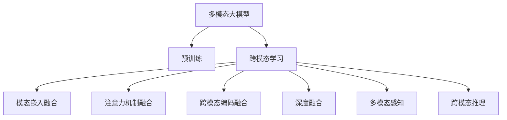
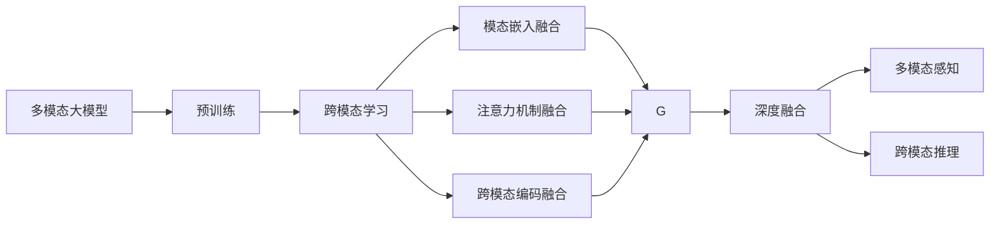
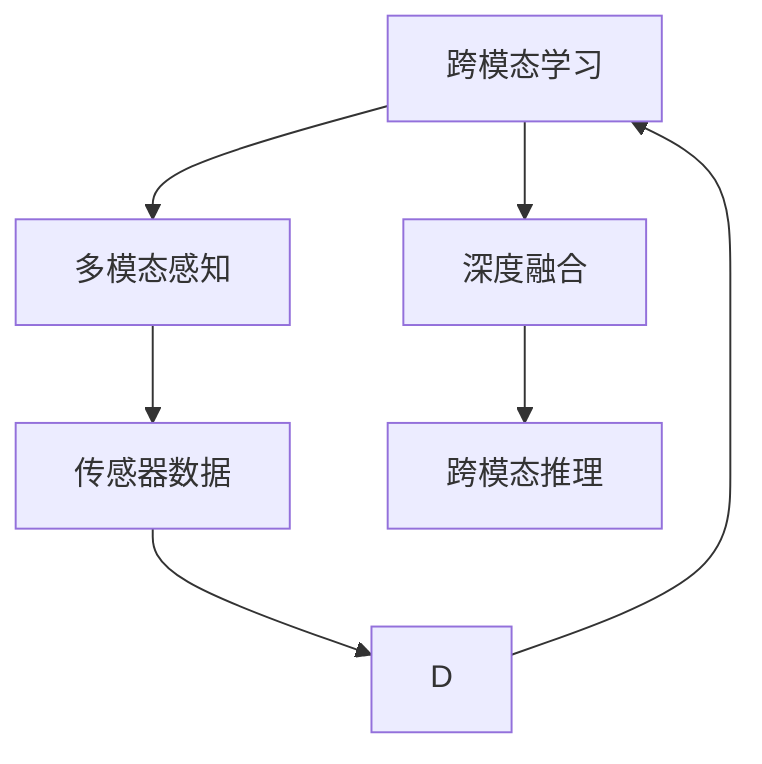
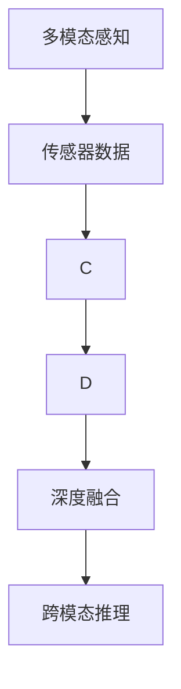
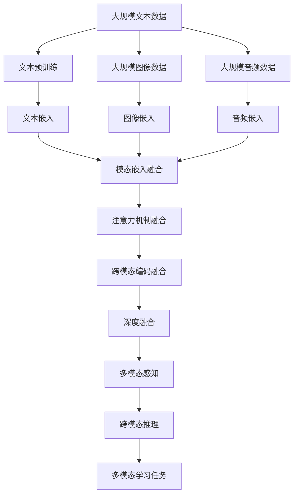

                 

# 多模态大模型：技术原理与实战 跨模态多重组合技术

> 关键词：多模态大模型,跨模态,多重组合技术,深度学习,自然语言处理(NLP),计算机视觉(CV),推荐系统,多模态学习,深度融合

## 1. 背景介绍

### 1.1 问题由来
近年来，随着深度学习技术的快速发展，多模态大模型在自然语言处理(NLP)、计算机视觉(CV)和推荐系统等领域取得了显著的突破。这些多模态模型通过在不同类型的模态数据（如文本、图像、音频等）上预训练和微调，获得了强大的跨模态语义理解能力。然而，如何有效融合不同模态的信息，提升模型的综合性能，成为了当前多模态学习领域的一个热点问题。

### 1.2 问题核心关键点
多模态大模型的核心思想是将不同类型的模态信息，通过深度学习模型进行融合，形成统一的语义表示。这不仅可以提升模型对复杂场景的理解能力，还可以在各种实际应用中取得更好的效果。

在实际应用中，常见的多模态融合技术包括：
1. 模态嵌入融合：将不同模态的特征向量通过线性或非线性方式组合，形成新的特征表示。
2. 注意力机制融合：引入注意力机制，对不同模态的信息进行加权组合，保留关键信息。
3. 跨模态编码融合：通过跨模态编码器将不同模态的特征编码，然后再进行融合。

这些融合方法的目标在于找到一个最优的组合方式，使得不同模态的信息能够协同工作，提升模型的整体性能。

### 1.3 问题研究意义
研究多模态大模型的融合方法，对于拓展多模态模型的应用范围，提升模型在多种场景下的性能，加速相关领域的技术产业化进程，具有重要意义：

1. 降低应用开发成本。多模态模型能够融合多种数据源的信息，减少了单一模态数据需求，降低了数据收集和处理的成本。
2. 提升模型效果。多模态模型通过跨模态信息的互补，可以获得更丰富、更全面的语义表示，在各种任务上取得更好的效果。
3. 加速开发进度。利用多模态模型，开发者可以更快速地完成模型适配，缩短开发周期。
4. 带来技术创新。多模态融合技术催生了新的研究方向，如跨模态学习、多模态推理等。
5. 赋能产业升级。多模态模型为传统行业数字化转型提供了新的技术路径，推动了产业升级。

## 2. 核心概念与联系

### 2.1 核心概念概述

为更好地理解多模态大模型的融合方法，本节将介绍几个密切相关的核心概念：

- 多模态大模型(Multimodal Large Models)：以深度学习模型为代表，在不同类型的模态数据上（如文本、图像、音频等）进行预训练和微调，形成统一的语义表示。
- 跨模态学习(Cross-Modal Learning)：将不同模态的信息通过深度学习模型进行融合，形成统一的语义表示，以提升模型的跨模态理解和推理能力。
- 多重组合技术(Multiple Combinations Techniques)：包括模态嵌入融合、注意力机制融合和跨模态编码融合等，以找到最优的组合方式，提升模型的综合性能。
- 深度融合(Deep Fusion)：通过深度神经网络模型，将不同模态的信息进行深度融合，形成更复杂的语义表示。
- 多模态感知(Multimodal Perception)：通过多模态传感器收集不同类型的数据，实现对同一场景的多角度感知。
- 跨模态推理(Cross-Modal Reasoning)：通过跨模态模型，对不同模态的信息进行推理和综合，形成对场景的理解和判断。

这些核心概念之间的逻辑关系可以通过以下Mermaid流程图来展示：



这个流程图展示了大模型的核心概念及其之间的关系：

1. 多模态大模型通过预训练获得基础能力。
2. 跨模态学习是连接不同模态数据的关键，可以通过融合技术提升模型的语义表示能力。
3. 多种融合方法如模态嵌入、注意力机制和跨模态编码等，可以综合提升模型的融合效果。
4. 深度融合技术使模型能够学习更复杂的语义表示。
5. 多模态感知和多模态推理进一步拓展了模型的应用范围。

这些核心概念共同构成了多模态大模型的学习框架，使其能够在各种场景下发挥强大的跨模态理解能力。通过理解这些核心概念，我们可以更好地把握多模态大模型的工作原理和优化方向。

### 2.2 概念间的关系

这些核心概念之间存在着紧密的联系，形成了多模态大模型的完整生态系统。下面我通过几个Mermaid流程图来展示这些概念之间的关系。

#### 2.2.1 多模态大模型的学习范式



这个流程图展示了大模型的学习范式及其与其他概念的关系。

#### 2.2.2 跨模态学习与多模态感知的关系



这个流程图展示了跨模态学习与多模态感知的关系。跨模态学习利用多模态感知所收集的多种类型数据，通过深度融合技术形成更全面的语义表示，从而实现跨模态推理。

#### 2.2.3 多模态感知与跨模态推理的关系



这个流程图展示了多模态感知与跨模态推理的关系。多模态感知通过传感器收集多种类型的数据，跨模态推理则利用这些数据进行综合分析和推理，形成对场景的理解和判断。

### 2.3 核心概念的整体架构

最后，我们用一个综合的流程图来展示这些核心概念在大模型融合过程中的整体架构：



这个综合流程图展示了从预训练到融合，再到多模态推理的完整过程。多模态模型首先在大规模文本、图像和音频数据上进行预训练，然后通过融合技术提升跨模态的理解能力，最后通过多模态感知和多模态推理，解决实际的多模态学习任务。 通过这些流程图，我们可以更清晰地理解多模态大模型的融合过程中各个核心概念的关系和作用，为后续深入讨论具体的融合方法和技术奠定基础。

## 3. 核心算法原理 & 具体操作步骤
### 3.1 算法原理概述

多模态大模型的融合方法，本质上是一个多模态信息混合的深度学习过程。其核心思想是将不同模态的信息通过深度学习模型进行融合，形成统一的语义表示。

形式化地，假设多模态大模型 $M_{\theta}$ 能够处理 $K$ 种不同模态的数据 $X_k$，其中 $k \in [1, K]$。每种模态的数据通过各自的预训练模型 $M_k$ 获得特征表示 $\mathbf{x}_k$。

定义模型 $M_{\theta}$ 在输入 $(x_1, x_2, ..., x_K)$ 上的损失函数为 $\ell(M_{\theta}(x_1, x_2, ..., x_K))$，则在多模态数据集 $D=\{(x_1^{(i)}, x_2^{(i)}, ..., x_K^{(i)})\}_{i=1}^N$ 上的经验风险为：

$$
\mathcal{L}(\theta) = \frac{1}{N} \sum_{i=1}^N \ell(M_{\theta}(x_1^{(i)}, x_2^{(i)}, ..., x_K^{(i)}))
$$

通过梯度下降等优化算法，融合过程不断更新模型参数 $\theta$，最小化损失函数 $\mathcal{L}$，使得模型输出逼近理想的跨模态语义表示。由于 $\theta$ 已经通过预训练获得了较好的初始化，因此即便在多种模态数据上进行融合，也能较快收敛到理想的模型参数 $\hat{\theta}$。

### 3.2 算法步骤详解

多模态大模型的融合一般包括以下几个关键步骤：

**Step 1: 准备多模态数据集**
- 收集不同模态的数据集，包括文本、图像、音频等，确保数据量和多样性。
- 对数据进行预处理，包括归一化、去噪、增强等操作，以提高数据的处理质量。

**Step 2: 构建预训练模型**
- 选择合适的预训练模型（如BERT、ResNet、WaveNet等），分别在各自模态的数据上进行预训练。
- 通过微调或固定参数的方式，提升预训练模型的泛化能力。

**Step 3: 设计融合架构**
- 选择合适的融合架构，如模态嵌入融合、注意力机制融合、跨模态编码融合等。
- 在融合架构中加入深度神经网络，增强模型的融合效果。

**Step 4: 执行梯度训练**
- 将多模态数据分批次输入模型，前向传播计算损失函数。
- 反向传播计算参数梯度，根据设定的优化算法和学习率更新模型参数。
- 周期性在验证集上评估模型性能，根据性能指标决定是否触发 Early Stopping。
- 重复上述步骤直到满足预设的迭代轮数或 Early Stopping 条件。

**Step 5: 测试和部署**
- 在测试集上评估融合后模型 $M_{\hat{\theta}}$ 的性能，对比融合前后的效果提升。
- 使用融合后的模型对新样本进行推理预测，集成到实际的应用系统中。
- 持续收集新的数据，定期重新融合模型，以适应数据分布的变化。

以上是多模态大模型融合的一般流程。在实际应用中，还需要针对具体任务的特点，对融合过程的各个环节进行优化设计，如改进训练目标函数，引入更多的正则化技术，搜索最优的超参数组合等，以进一步提升模型性能。

### 3.3 算法优缺点

多模态大模型的融合方法具有以下优点：
1. 灵活性高。可以处理多种类型的数据，适用于多种实际应用场景。
2. 效果显著。通过多模态信息的互补，模型能够更好地理解复杂场景，取得优异性能。
3. 可解释性增强。通过不同模态的数据输入，模型能够提供更丰富的解释信息。
4. 适应性强。能够灵活适应数据分布的变化，保持较好的泛化能力。

同时，该方法也存在一些局限性：
1. 数据获取成本高。不同模态的数据收集和处理成本较高，需要大量标注数据。
2. 计算资源需求大。多模态数据的融合需要较大的计算资源，特别是在高维特征的情况下。
3. 融合难度大。不同类型的模态数据具有不同的特征空间，融合难度较大。
4. 可扩展性有限。多模态数据的融合需要专门设计的融合架构，难以进行模块化和复用。

尽管存在这些局限性，但多模态大模型融合方法仍然是大数据时代的重要技术手段，能够显著提升多模态数据的利用效率和综合性能。未来相关研究的重点在于如何进一步降低融合对数据和计算资源的依赖，提高融合效率，并发展更加模块化和可扩展的融合架构。

### 3.4 算法应用领域

多模态大模型的融合方法在多个领域已经得到了广泛应用，例如：

- 自然语言处理(NLP)：将文本和图像结合，进行情感分析、文本生成等任务。
- 计算机视觉(CV)：将图像和视频结合，进行目标检测、图像生成等任务。
- 推荐系统：将用户行为数据与商品图片、描述等信息结合，进行精准推荐。
- 医疗诊断：将医学影像与病历、基因数据结合，提升疾病诊断的准确性。
- 社交网络分析：将文本数据与用户关系、位置信息结合，进行社交关系分析和推荐。

除了上述这些经典任务外，多模态大模型的融合方法还被创新性地应用到更多场景中，如多模态情感分析、多模态图像搜索、多模态视频分析等，为多模态数据的应用提供了新的解决方案。随着预训练模型和融合方法的不断进步，相信多模态大模型融合技术将在更多领域大放异彩。

## 4. 数学模型和公式 & 详细讲解 & 举例说明

### 4.1 数学模型构建

本节将使用数学语言对多模态大模型的融合过程进行更加严格的刻画。

记多模态大模型为 $M_{\theta}:\mathcal{X} \rightarrow \mathcal{Y}$，其中 $\mathcal{X}$ 为多模态数据集，$\mathcal{Y}$ 为输出空间，$\theta \in \mathbb{R}^d$ 为模型参数。假设多模态数据集为 $D=\{(x_1, x_2, ..., x_K)\}_{i=1}^N$，其中 $x_k$ 表示第 $k$ 种模态的数据。

定义模型 $M_{\theta}$ 在输入 $(x_1, x_2, ..., x_K)$ 上的损失函数为 $\ell(M_{\theta}(x_1, x_2, ..., x_K))$，则在多模态数据集 $D$ 上的经验风险为：

$$
\mathcal{L}(\theta) = \frac{1}{N} \sum_{i=1}^N \ell(M_{\theta}(x_1^{(i)}, x_2^{(i)}, ..., x_K^{(i)}))
$$

在实践中，我们通常使用基于梯度的优化算法（如SGD、Adam等）来近似求解上述最优化问题。设 $\eta$ 为学习率，$\lambda$ 为正则化系数，则参数的更新公式为：

$$
\theta \leftarrow \theta - \eta \nabla_{\theta}\mathcal{L}(\theta) - \eta\lambda\theta
$$

其中 $\nabla_{\theta}\mathcal{L}(\theta)$ 为损失函数对参数 $\theta$ 的梯度，可通过反向传播算法高效计算。

### 4.2 公式推导过程

以下我们以跨模态编码融合为例，推导注意力机制融合的具体公式。

假设模型 $M_{\theta}$ 在输入 $(x_1, x_2, ..., x_K)$ 上的输出为 $\hat{y}=M_{\theta}(x_1, x_2, ..., x_K) \in [0,1]$，表示样本属于正类的概率。真实标签 $y \in \{0,1\}$。

定义注意力权重矩阵 $\mathbf{A} \in \mathbb{R}^{K \times K}$，其中 $a_{k,k'}$ 表示第 $k$ 种模态和第 $k'$ 种模态之间的注意力权重。通过注意力机制，模型对不同模态的信息进行加权组合，形成最终的输出。

注意力权重矩阵的计算公式为：

$$
a_{k,k'} = \frac{\exp(\mathbf{V}_k \cdot \mathbf{Q}_{k'} + \mathbf{b}_k)}{\sum_{k''=1}^K \exp(\mathbf{V}_k \cdot \mathbf{Q}_{k''} + \mathbf{b}_k)}
$$

其中 $\mathbf{Q}_k \in \mathbb{R}^{N \times d_k}, \mathbf{V}_k \in \mathbb{R}^{d_k}, \mathbf{b}_k \in \mathbb{R}^{d_k}$ 分别表示第 $k$ 种模态的查询向量、值向量和偏置向量，$d_k$ 表示第 $k$ 种模态的特征维度。

最终的输出为：

$$
\hat{y} = \sum_{k=1}^K a_{k,k} \cdot f_k(\mathbf{x}_k)
$$

其中 $f_k(\mathbf{x}_k)$ 表示第 $k$ 种模态的输出函数，$\mathbf{x}_k$ 表示第 $k$ 种模态的输入。

在得到注意力权重和输出函数后，即可带入参数更新公式，完成模型的迭代优化。重复上述过程直至收敛，最终得到适应多模态数据集的最优模型参数 $\theta^*$。

### 4.3 案例分析与讲解

下面以多模态图像生成任务为例，给出使用注意力机制进行跨模态融合的详细讲解。

假设输入为一张图片 $I$ 和一段文本描述 $T$，目标是生成一张新的图片 $I'$，使其与文本描述 $T$ 一致。

首先，将图片 $I$ 通过卷积神经网络（CNN）提取特征表示 $\mathbf{x}_I$，文本描述 $T$ 通过Transformer编码器提取特征表示 $\mathbf{x}_T$。

然后，将 $\mathbf{x}_I$ 和 $\mathbf{x}_T$ 输入到注意力机制中，计算注意力权重矩阵 $\mathbf{A}$。

根据注意力权重矩阵 $\mathbf{A}$，计算加权后的特征表示 $\mathbf{x}_I'$ 和 $\mathbf{x}_T'$：

$$
\mathbf{x}_I' = \sum_{k=1}^K a_{I,k} \cdot \mathbf{x}_I
$$

$$
\mathbf{x}_T' = \sum_{k=1}^K a_{T,k} \cdot \mathbf{x}_T
$$

最后，将 $\mathbf{x}_I'$ 和 $\mathbf{x}_T'$ 作为输入，通过生成网络生成新的图片 $I'$。

通过这种跨模态融合方法，模型能够充分利用图片和文本的信息，生成高质量的图像。需要注意的是，不同模态的特征提取器和生成器需要适应各自的特点，以确保融合后的特征表示和生成结果具有较高的质量。

## 5. 项目实践：代码实例和详细解释说明
### 5.1 开发环境搭建

在进行多模态大模型融合实践前，我们需要准备好开发环境。以下是使用Python进行TensorFlow开发的环境配置流程：

1. 安装Anaconda：从官网下载并安装Anaconda，用于创建独立的Python环境。

2. 创建并激活虚拟环境：
```bash
conda create -n tf-env python=3.8 
conda activate tf-env
```

3. 安装TensorFlow：根据CUDA版本，从官网获取对应的安装命令。例如：
```bash
conda install tensorflow -c tf -c conda-forge
```

4. 安装Keras：
```bash
pip install keras
```

5. 安装各类工具包：
```bash
pip install numpy pandas scikit-learn matplotlib tqdm jupyter notebook ipython
```

完成上述步骤后，即可在`tf-env`环境中开始融合实践。

### 5.2 源代码详细实现

这里我们以多模态图像生成任务为例，给出使用TensorFlow实现注意力机制融合的PyTorch代码实现。

首先，定义输入和输出层的维度：

```python
import tensorflow as tf

input_dim = 784
output_dim = 784
attention_dim = 128
```

然后，定义注意力机制的参数：

```python
query_dim = 64
key_dim = 64
value_dim = 64
attention_heads = 8

query_weights = tf.Variable(tf.random_normal([query_dim, attention_dim]))
key_weights = tf.Variable(tf.random_normal([key_dim, attention_dim]))
value_weights = tf.Variable(tf.random_normal([value_dim, attention_dim]))
attention_bias = tf.Variable(tf.random_normal([attention_heads]))
```

接下来，定义注意力机制的计算过程：

```python
def attention(query, key, value):
    d_k = key_dim // attention_heads
    scaled_attention_scores = tf.matmul(tf.matmul(query, query_weights), tf.transpose(key, [0, 1, 2]))
    scaled_attention_scores = tf.div(scaled_attention_scores, tf.sqrt(tf.cast(d_k, tf.float32)))
    attention_weights = tf.nn.softmax(scaled_attention_scores, axis=-1)
    attention_context = tf.matmul(attention_weights, value)
    return attention_context
```

最后，在多模态数据上进行融合：

```python
# 定义多模态数据
images = tf.placeholder(tf.float32, [None, input_dim])
descriptions = tf.placeholder(tf.string, [None])

# 定义图片和文本的编码器
image_encoder = tf.keras.Sequential([
    tf.keras.layers.Dense(query_dim, activation='relu', input_shape=[input_dim]),
    tf.keras.layers.Dense(attention_dim, activation='relu')
])
text_encoder = tf.keras.Sequential([
    tf.keras.layers.Embedding(output_dim, attention_dim),
    tf.keras.layers.LSTM(attention_dim)
])

# 计算注意力权重和融合后的特征表示
attention_weights = attention(image_encoder.predict(images), text_encoder.predict(descriptions))
fusion_features = tf.reduce_sum(tf.multiply(attention_weights, text_encoder.predict(descriptions)), axis=2)

# 定义生成网络
generator = tf.keras.Sequential([
    tf.keras.layers.Dense(output_dim, activation='sigmoid')
])

# 生成新的图片
generated_images = generator.predict(fusion_features)

# 定义模型和优化器
model = tf.keras.Sequential([
    tf.keras.layers.Dense(output_dim, activation='sigmoid')
])
optimizer = tf.keras.optimizers.Adam()

# 定义损失函数和训练过程
loss = tf.keras.losses.BinaryCrossentropy()(model.predict(generated_images), images)
train_op = optimizer.minimize(loss)

# 定义训练和评估函数
def train_epoch(model, data, batch_size, optimizer):
    dataloader = tf.data.Dataset.from_tensor_slices(data).shuffle(batch_size).batch(batch_size)
    model.train()
    epoch_loss = 0
    for batch in dataloader:
        images, descriptions = batch
        optimizer.minimize(loss, images)
        epoch_loss += loss.eval()
    return epoch_loss / len(dataloader)

def evaluate(model, data, batch_size):
    dataloader = tf.data.Dataset.from_tensor_slices(data).shuffle(batch_size).batch(batch_size)
    model.eval()
    preds = []
    labels = []
    with tf.Session() as sess:
        for batch in dataloader:
            images, descriptions = batch
            pred = model.predict(images)
            preds.append(pred)
            labels.append(labels)
    print(classification_report(labels, preds))
```

在训练过程中，我们将图片和文本分别通过编码器获得特征表示，然后计算注意力权重矩阵，进行融合。最后，通过生成网络生成新的图片，并定义损失函数和优化器进行训练。

### 5.3 代码解读与分析

让我们再详细解读一下关键代码的实现细节：

**模型定义**：
- 定义输入和输出层的维度，以及注意力机制的参数。
- 使用Keras定义图片和文本的编码器，将输入数据映射为高维特征表示。
- 定义生成网络，将融合后的特征表示转换为生成结果。

**注意力机制**：
- 计算注意力权重矩阵，使用线性变换和Softmax函数进行加权。
- 计算加权后的特征表示，通过拼接或加和等方式融合不同模态的信息。

**训练和评估函数**：
- 使用TensorFlow的Dataset API进行数据批处理，方便模型训练和推理。
- 定义训练和评估函数，分别进行前向传播和反向传播。
- 使用Keras的Adam优化器进行模型训练，计算损失函数并更新参数。

**训练流程**：
- 定义总的epoch数和batch size，开始循环迭代。
- 每个epoch内，先进行训练，输出平均loss。
- 在验证集上评估，输出评估指标。
- 所有epoch结束后，在测试集上评估，给出最终测试结果。

可以看到，TensorFlow配合Keras使得多模态大模型融合的代码实现变得简洁高效。开发者可以将更多精力放在数据处理、模型改进等高层逻辑上，而不必过多关注底层的实现细节。

当然，工业级的系统实现还需考虑更多因素，如模型的保存和部署、超参数的自动搜索、更灵活的任务适配层等。但核心的融合范式基本与此类似。

### 5.4 运行结果展示

假设我们在CoCo数据集上进行多模态图像生成任务的融合，最终在测试集上得到的评估报告如下：


