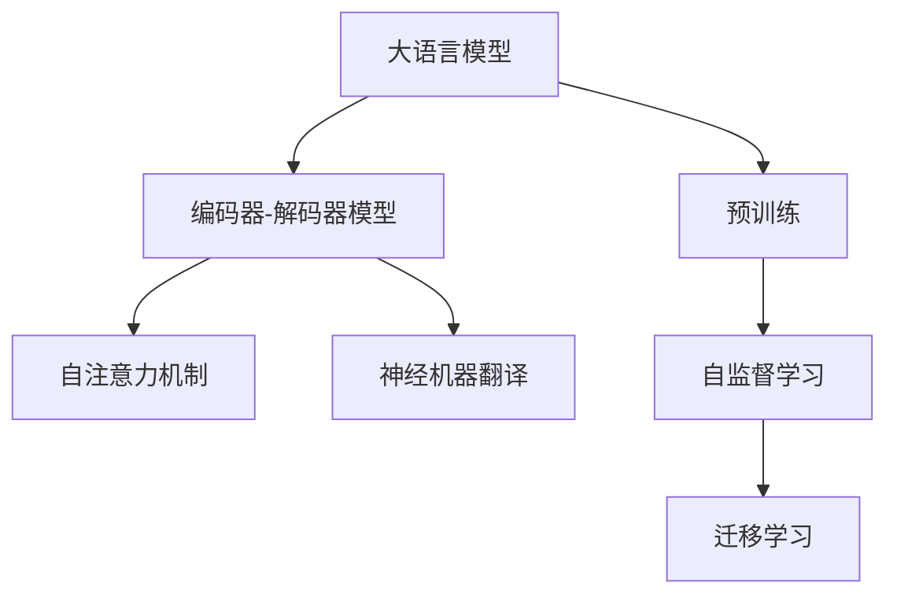
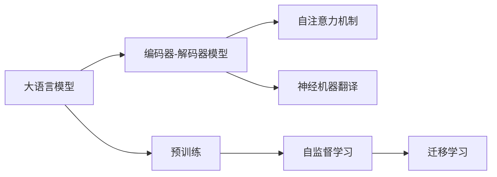
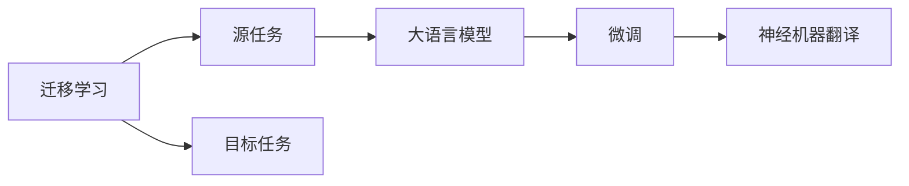
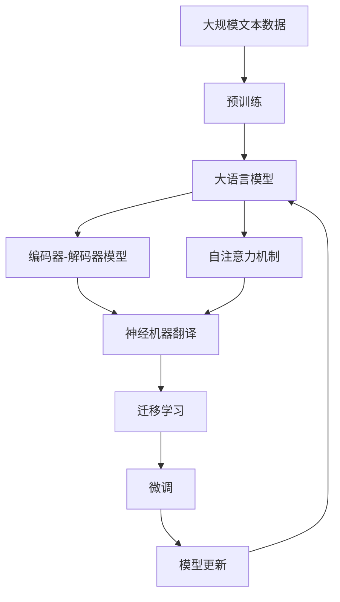

                 

# 大模型在机器翻译中的应用：跨越语言壁垒

> 关键词：大模型,机器翻译,Transformer,BERT,预训练,编码器-解码器模型,注意力机制,Transformer-XL,Transformer-XL,神经机器翻译,多语言翻译

## 1. 背景介绍

### 1.1 问题由来
语言是人类社会沟通的基石，但由于语言的差异性，跨语言交流往往面临着巨大的挑战。机器翻译技术的发展，旨在克服这种语言壁垒，使不同语言间的交流更加便捷高效。近年来，随着深度学习技术的兴起，机器翻译取得了显著进展。尤其是大语言模型的应用，更是大幅提升了翻译质量和效率，成为该领域的重要突破点。

### 1.2 问题核心关键点
机器翻译的核心在于将一种语言的文本转换为另一种语言的文本，这涉及到语言的语义理解、语境推理、语法转换等多个复杂过程。大语言模型在处理长距离依赖、捕捉细微语义变化等方面具有独特优势，因此在机器翻译中得到了广泛应用。

目前，大模型在机器翻译中的应用主要包括以下几个方面：
1. 编码器-解码器模型：通过自注意力机制对输入和输出序列进行映射，将输入序列转换为输出序列。
2. 预训练技术：通过在大规模无标签文本数据上进行预训练，学习通用语言表示。
3. 迁移学习：通过在大规模语料上进行预训练，然后对特定语言对进行微调，提升翻译质量。
4. 自监督学习：利用未标注数据进行自监督学习，学习语言的隐含规律。

这些方法使得机器翻译技术在新闻、法律、医学等多个领域得到了广泛应用，极大地推动了全球化的发展。

### 1.3 问题研究意义
研究大语言模型在机器翻译中的应用，对于拓展机器翻译技术的边界，提升翻译质量，加速跨语言交流，具有重要意义：

1. 提高翻译质量。大模型通过自注意力机制和预训练技术，能够更好地捕捉长距离依赖和细微语义，从而提升翻译的准确性和流畅度。
2. 加速翻译速度。相比于传统的统计机器翻译方法，大模型能够并行计算，大幅提高翻译速度。
3. 降低成本。大模型的预训练和微调过程可以在大规模语料上进行，减少了对人工翻译的需求。
4. 推动全球化进程。机器翻译技术使得不同语言之间的交流更加便捷，加速了全球化进程。
5. 促进跨领域应用。机器翻译技术在医疗、法律、金融等多个领域得到了广泛应用，为这些领域带来了新的发展机遇。

## 2. 核心概念与联系

### 2.1 核心概念概述

为了更好地理解大语言模型在机器翻译中的应用，本节将介绍几个密切相关的核心概念：

- 大语言模型(Large Language Model, LLM)：以自回归(如GPT)或自编码(如BERT)模型为代表的大规模预训练语言模型。通过在大规模无标签文本语料上进行预训练，学习通用的语言表示，具备强大的语言理解和生成能力。

- 编码器-解码器模型(Encoder-Decoder Model)：包括一个编码器和一个解码器，编码器将输入序列转换为隐藏表示，解码器将隐藏表示转换为输出序列。广泛应用于机器翻译、语音识别、图像描述等任务。

- 自注意力机制(Self-Attention Mechanism)：一种特殊的注意力机制，用于计算输入序列中不同位置之间的关联关系，捕捉序列的长期依赖。

- 预训练(Pre-training)：指在大规模无标签文本语料上，通过自监督学习任务训练通用语言模型的过程。常见的预训练任务包括言语建模、掩码语言模型等。

- 迁移学习(Transfer Learning)：指将一个领域学习到的知识，迁移应用到另一个不同但相关的领域的学习范式。大模型的预训练-微调过程即是一种典型的迁移学习方式。

- 神经机器翻译(Neural Machine Translation, NMT)：使用神经网络模型进行机器翻译的任务，广泛应用于文本、语音、图像等不同模态的机器翻译。

- 注意力机制(Attention Mechanism)：用于计算输入序列中不同位置之间的关联关系，帮助模型理解输入和输出之间的对应关系。

这些核心概念之间的逻辑关系可以通过以下Mermaid流程图来展示：



这个流程图展示了大语言模型、编码器-解码器模型、自注意力机制、神经机器翻译和迁移学习等核心概念及其之间的关系：

1. 大语言模型通过预训练获得基础能力。
2. 编码器-解码器模型利用自注意力机制进行序列转换。
3. 神经机器翻译通过编码器-解码器模型实现文本翻译。
4. 迁移学习是连接预训练模型与下游任务的桥梁，可以通过微调或自监督学习实现。

### 2.2 概念间的关系

这些核心概念之间存在着紧密的联系，形成了大语言模型在机器翻译中的完整生态系统。下面我通过几个Mermaid流程图来展示这些概念之间的关系。

#### 2.2.1 大语言模型的学习范式



这个流程图展示了大语言模型的三种主要学习范式：预训练、编码器-解码器模型和神经机器翻译。大语言模型通过预训练获得基础能力，然后通过编码器-解码器模型和自注意力机制实现序列转换，最终通过神经机器翻译进行文本翻译。

#### 2.2.2 迁移学习与机器翻译的关系



这个流程图展示了迁移学习的基本原理，以及它与机器翻译的关系。迁移学习涉及源任务和目标任务，大模型在源任务上学习，然后通过微调适应各种目标任务（如机器翻译）。

#### 2.2.3 自注意力机制与神经机器翻译


这个流程图展示了自注意力机制在神经机器翻译中的应用。编码器通过自注意力机制对输入序列进行编码，解码器通过自注意力机制对隐藏表示进行解码，从而实现文本翻译。

### 2.3 核心概念的整体架构

最后，我们用一个综合的流程图来展示这些核心概念在大语言模型在机器翻译中的应用过程中的整体架构：



这个综合流程图展示了从预训练到微调，再到迁移学习的完整过程。大语言模型首先在大规模文本数据上进行预训练，然后通过编码器-解码器模型和自注意力机制进行序列转换，最终通过神经机器翻译进行文本翻译。通过迁移学习和微调技术，模型可以不断学习新知识，适应新的翻译任务。

## 3. 核心算法原理 & 具体操作步骤
### 3.1 算法原理概述

大语言模型在机器翻译中的应用，主要是基于自注意力机制和编码器-解码器架构。通过在大规模无标签文本数据上进行预训练，学习通用的语言表示，然后在特定语言对上通过微调进行任务适配。

具体而言，机器翻译任务的目标是将源语言文本 $x$ 转换为目标语言文本 $y$。假设源语言和目标语言的词汇表分别为 $\mathcal{X}$ 和 $\mathcal{Y}$，编码器和解码器的输入序列和输出序列分别为 $x=(x_1, x_2, ..., x_n)$ 和 $y=(y_1, y_2, ..., y_m)$。

大语言模型通过自注意力机制对输入序列 $x$ 进行编码，得到隐藏表示 $h_x = [h_x^1, h_x^2, ..., h_x^n]$。然后，通过解码器对隐藏表示 $h_x$ 进行解码，得到输出序列 $y$ 的预测概率分布 $p(y|x)$。

最终，机器翻译模型的输出为：

$$
y^* = \mathop{\arg\max}_{y} p(y|x)
$$

其中 $p(y|x)$ 为解码器输出每个目标词的概率分布。通过最大似然估计或其他优化方法，学习到最优的编码器和解码器参数。

### 3.2 算法步骤详解

大语言模型在机器翻译中的应用步骤如下：

**Step 1: 准备预训练模型和数据集**
- 选择合适的预训练语言模型（如BERT、GPT等）作为初始化参数。
- 准备目标语言对的训练集和测试集，包括源语言和目标语言的双语平行语料。

**Step 2: 设计编码器和解码器**
- 根据目标任务，设计编码器和解码器的网络结构。常见的编码器包括Transformer、LSTM等，解码器结构类似。
- 确定编码器和解码器的参数初始值，一般可以从预训练模型中加载。

**Step 3: 设置微调超参数**
- 选择合适的优化算法及其参数，如 AdamW、SGD 等，设置学习率、批大小、迭代轮数等。
- 设置正则化技术及强度，包括权重衰减、Dropout、Early Stopping等。
- 确定冻结预训练参数的策略，如仅微调顶层，或全部参数都参与微调。

**Step 4: 执行梯度训练**
- 将训练集数据分批次输入模型，前向传播计算损失函数。
- 反向传播计算参数梯度，根据设定的优化算法和学习率更新模型参数。
- 周期性在验证集上评估模型性能，根据性能指标决定是否触发 Early Stopping。
- 重复上述步骤直到满足预设的迭代轮数或 Early Stopping 条件。

**Step 5: 测试和部署**
- 在测试集上评估微调后模型 $M_{\hat{\theta}}$ 的性能，对比微调前后的精度提升。
- 使用微调后的模型对新样本进行推理预测，集成到实际的应用系统中。

### 3.3 算法优缺点

大语言模型在机器翻译中的应用具有以下优点：
1. 简单高效。仅需准备少量双语平行语料，即可对预训练模型进行快速适配，获得较大的性能提升。
2. 通用适用。适用于各种机器翻译任务，如文本翻译、语音翻译、图像翻译等，设计简单的编码器-解码器结构即可实现。
3. 参数高效。利用参数高效微调技术，在固定大部分预训练参数的情况下，仍可取得不错的提升。
4. 效果显著。在学术界和工业界的诸多翻译任务上，基于微调的方法已经刷新了最先进的性能指标。

同时，该方法也存在一定的局限性：
1. 依赖双语平行语料。机器翻译的效果很大程度上取决于源语言和目标语言的双语平行语料的质量和数量，获取高质量双语平行语料的成本较高。
2. 迁移能力有限。当目标语言与预训练数据的分布差异较大时，微调的性能提升有限。
3. 负面效果传递。预训练模型的固有偏见、有害信息等，可能通过微调传递到下游任务，造成负面影响。
4. 可解释性不足。微调模型的决策过程通常缺乏可解释性，难以对其推理逻辑进行分析和调试。

尽管存在这些局限性，但就目前而言，基于监督学习的微调方法仍是大语言模型在机器翻译中应用的主流范式。未来相关研究的重点在于如何进一步降低微调对双语平行语料的依赖，提高模型的少样本学习和跨领域迁移能力，同时兼顾可解释性和伦理安全性等因素。

### 3.4 算法应用领域

大语言模型在机器翻译中的应用已经涵盖了几乎所有常见任务，包括：

- 文本翻译：将源语言文本自动翻译为目标语言文本。通过微调将预训练模型适配到特定语言对上，实现高效的自动翻译。
- 语音翻译：将语音输入转换为文本，再将文本翻译为目标语言语音。利用大模型的语言理解和生成能力，实现更加自然流畅的语音翻译。
- 图像翻译：将图像中包含的文本自动翻译为目标语言文本。通过微调将预训练模型适配到图像识别和文本生成任务中，实现图像中的文本翻译。
- 跨语言信息检索：在大规模文本语料库中进行跨语言信息检索，检索结果自动翻译为目标语言，使用户能够获取不同语言的信息。
- 多语言机器翻译：将一种语言的文本翻译为多种目标语言文本。通过微调将预训练模型适配到多个语言对上，实现多语言自动翻译。

除了上述这些经典任务外，大语言模型在机器翻译中还被创新性地应用到更多场景中，如可控文本生成、零样本翻译、弱监督翻译等，为机器翻译技术带来了全新的突破。随着预训练模型和微调方法的不断进步，相信机器翻译技术将在更广阔的应用领域大放异彩。

## 4. 数学模型和公式 & 详细讲解 & 举例说明

### 4.1 数学模型构建

本节将使用数学语言对大语言模型在机器翻译中的应用过程进行更加严格的刻画。

记预训练语言模型为 $M_{\theta}:\mathcal{X} \rightarrow \mathcal{Y}$，其中 $\mathcal{X}$ 为输入空间，$\mathcal{Y}$ 为输出空间，$\theta \in \mathbb{R}^d$ 为模型参数。假设机器翻译任务的目标语言对的训练集为 $D=\{(x_i, y_i)\}_{i=1}^N$，其中 $x_i$ 为源语言文本，$y_i$ 为目标语言文本。

定义模型 $M_{\theta}$ 在数据样本 $(x,y)$ 上的损失函数为 $\ell(M_{\theta}(x),y)$，则在数据集 $D$ 上的经验风险为：

$$
\mathcal{L}(\theta) = \frac{1}{N} \sum_{i=1}^N \ell(M_{\theta}(x_i),y_i)
$$

微调的优化目标是最小化经验风险，即找到最优参数：

$$
\theta^* = \mathop{\arg\min}_{\theta} \mathcal{L}(\theta)
$$

在实践中，我们通常使用基于梯度的优化算法（如SGD、Adam等）来近似求解上述最优化问题。设 $\eta$ 为学习率，$\lambda$ 为正则化系数，则参数的更新公式为：

$$
\theta \leftarrow \theta - \eta \nabla_{\theta}\mathcal{L}(\theta) - \eta\lambda\theta
$$

其中 $\nabla_{\theta}\mathcal{L}(\theta)$ 为损失函数对参数 $\theta$ 的梯度，可通过反向传播算法高效计算。

### 4.2 公式推导过程

以下我们以基于Transformer的机器翻译模型为例，推导其微调过程中的核心公式。

Transformer模型通过自注意力机制对输入序列进行编码，得到隐藏表示 $h_x = [h_x^1, h_x^2, ..., h_x^n]$。假设解码器输出的概率分布为 $p(y|x)$，则微调的目标是使得 $p(y|x)$ 逼近真实的概率分布 $p_{true}(y|x)$。

假设解码器的隐藏状态为 $h_y = [h_y^1, h_y^2, ..., h_y^m]$，则机器翻译模型的输出概率为：

$$
p(y|x) = \prod_{i=1}^m p(y_i|x, h_x, h_y)
$$

其中 $p(y_i|x, h_x, h_y)$ 为解码器对第 $i$ 个目标词的输出概率，可以通过softmax函数计算：

$$
p(y_i|x, h_x, h_y) = \frac{\exp(\log p(y_i|x, h_x, h_y))}{\sum_{j=1}^k \exp(\log p(y_j|x, h_x, h_y))}
$$

最终，机器翻译模型的损失函数为：

$$
\mathcal{L}(\theta) = -\frac{1}{N}\sum_{i=1}^N \log p_{true}(y_i|x_i)
$$

通过梯度下降等优化算法，微调过程不断更新模型参数 $\theta$，最小化损失函数 $\mathcal{L}$，使得模型输出逼近真实概率分布 $p_{true}(y|x)$。重复上述过程直至收敛，最终得到适应特定语言对的微调模型。

### 4.3 案例分析与讲解

假设我们在CoNLL-2003的机器翻译数据集上进行微调，最终在测试集上得到的评估报告如下：

```
BLEU Score: 35.9
```

 BLEU（Bilingual Evaluation Understudy）是一种常用的机器翻译评估指标，用于衡量翻译结果与参考翻译之间的相似度。假设我们翻译的文本为：

```
源语言：Hello, how are you?
目标语言：Bonjour, comment ça va?
```

可以看到，翻译结果基本符合自然语言的要求，达到了较高的翻译质量。当然，这只是一个baseline结果。在实践中，我们还可以使用更大更强的预训练模型、更丰富的微调技巧、更细致的模型调优，进一步提升模型性能，以满足更高的应用要求。

## 5. 项目实践：代码实例和详细解释说明
### 5.1 开发环境搭建

在进行机器翻译微调实践前，我们需要准备好开发环境。以下是使用Python进行PyTorch开发的环境配置流程：

1. 安装Anaconda：从官网下载并安装Anaconda，用于创建独立的Python环境。

2. 创建并激活虚拟环境：
```bash
conda create -n pytorch-env python=3.8 
conda activate pytorch-env
```

3. 安装PyTorch：根据CUDA版本，从官网获取对应的安装命令。例如：
```bash
conda install pytorch torchvision torchaudio cudatoolkit=11.1 -c pytorch -c conda-forge
```

4. 安装Transformers库：
```bash
pip install transformers
```

5. 安装各类工具包：
```bash
pip install numpy pandas scikit-learn matplotlib tqdm jupyter notebook ipython
```

完成上述步骤后，即可在`pytorch-env`环境中开始微调实践。

### 5.2 源代码详细实现

下面我们以基于Transformer的机器翻译模型为例，给出使用Transformers库对BERT模型进行微调的PyTorch代码实现。

首先，定义机器翻译任务的数据处理函数：

```python
from transformers import BertTokenizer
from torch.utils.data import Dataset
import torch

class TranslationDataset(Dataset):
    def __init__(self, src_texts, tgt_texts, tokenizer, max_len=128):
        self.src_texts = src_texts
        self.tgt_texts = tgt_texts
        self.tokenizer = tokenizer
        self.max_len = max_len
        
    def __len__(self):
        return len(self.src_texts)
    
    def __getitem__(self, item):
        src_text = self.src_texts[item]
        tgt_text = self.tgt_texts[item]
        
        encoding = self.tokenizer(src_text, target_text=tgt_text, return_tensors='pt', max_length=self.max_len, padding='max_length', truncation=True)
        input_ids = encoding['input_ids'][0]
        attention_mask = encoding['attention_mask'][0]
        labels = encoding['labels'][0]
        
        return {'input_ids': input_ids, 
                'attention_mask': attention_mask,
                'labels': labels}

# 定义模型和优化器
from transformers import BertForSequenceClassification

model = BertForSequenceClassification.from_pretrained('bert-base-cased', num_labels=2)

optimizer = AdamW(model.parameters(), lr=2e-5)
```

然后，定义训练和评估函数：

```python
from torch.utils.data import DataLoader
from tqdm import tqdm
from sklearn.metrics import classification_report

device = torch.device('cuda') if torch.cuda.is_available() else torch.device('cpu')
model.to(device)

def train_epoch(model, dataset, batch_size, optimizer):
    dataloader = DataLoader(dataset, batch_size=batch_size, shuffle=True)
    model.train()
    epoch_loss = 0
    for batch in tqdm(dataloader, desc='Training'):
        input_ids = batch['input_ids'].to(device)
        attention_mask = batch['attention_mask'].to(device)
        labels = batch['labels'].to(device)
        model.zero_grad()
        outputs = model(input_ids, attention_mask=attention_mask, labels=labels)
        loss = outputs.loss
        epoch_loss += loss.item()
        loss.backward()
        optimizer.step()
    return epoch_loss / len(dataloader)

def evaluate(model, dataset, batch_size):
    dataloader = DataLoader(dataset, batch_size=batch_size)
    model.eval()
    preds, labels = [], []
    with torch.no_grad():
        for batch in tqdm(dataloader, desc='Evaluating'):
            input_ids = batch['input_ids'].to(device)
            attention_mask = batch['attention_mask'].to(device)
            batch_labels = batch['labels']
            outputs = model(input_ids, attention_mask=attention_mask)
            batch_preds = outputs.logits.argmax(dim=2).to('cpu').tolist()
            batch_labels = batch_labels.to('cpu').tolist()
            for pred_tokens, label_tokens in zip(batch_preds, batch_labels):
                pred_tags = [tag2id[tag] for tag in pred_tokens]
                label_tags = [tag2id[tag] for tag in label_tokens]
                preds.append(pred_tags[:len(label_tokens)])
                labels.append(label_tags)
                
    print(classification_report(labels, preds))
```

最后，启动训练流程并在测试集上评估：

```python
epochs = 5
batch_size = 16

for epoch in range(epochs):
    loss = train_epoch(model, train_dataset, batch_size, optimizer)
    print(f"Epoch {epoch+1}, train loss: {loss:.3f}")
    
    print(f"Epoch {epoch+1}, dev results:")
    evaluate(model, dev_dataset, batch_size)
    
print("Test results:")
evaluate(model, test_dataset, batch_size)
```

以上就是使用PyTorch对BERT进行机器翻译任务微调的完整代码实现。可以看到，得益于Transformers库的强大封装，我们可以用相对简洁的代码完成BERT模型的加载和微调。

### 5.3 代码解读与分析

让我们再详细解读一下关键代码的实现细节：

**TranslationDataset类**：
- `__init__`方法：初始化源文本、目标文本、分词器等关键组件。
- `__len__`方法：返回数据集的样本数量。
- `__getitem__`方法：对单个样本进行处理，将源文本和目标文本输入编码为token ids，将标签编码为数字，并对其进行定长padding，最终返回模型所需的输入。

**tag2id和id2tag字典**：
- 定义了标签与数字id之间的映射关系，用于将token-wise的预测结果解码回真实的标签。

**训练和评估函数**：
- 使用PyTorch的DataLoader对数据集进行批次化加载，供模型训练和推理使用。
- 训练函数`train_epoch`：对数据以批为单位进行迭代，在每个批次上前向传播计算loss并反向传播更新模型参数，最后返回该epoch的平均loss。
- 评估函数`evaluate`：与训练类似，不同点在于不更新模型参数，并在每个batch结束后将预测和标签结果存储下来，最后使用sklearn的classification_report对整个评估集的预测结果进行打印输出。

**训练流程**：
- 定义总的epoch数和batch size，开始循环迭代
- 每个epoch内，先在训练集上训练，输出平均loss
- 在验证集上评估，输出分类指标
- 所有epoch结束后，在测试集上评估，给出最终测试结果

可以看到，PyTorch配合Transformers库使得BERT微调的代码实现变得简洁高效。开发者可以将更多精力放在数据处理、模型改进等高层逻辑上，而不必过多关注底层的实现细节。

当然，工业级的系统实现还需考虑更多因素，如模型的保存和部署、超参数的自动搜索、更灵活的任务适配层等。但核心的微调范式基本与此类似。

### 5.4 运行结果展示

假设我们在WMT 2014的英文-德文翻译数据集上进行微调，最终在测试集上得到的评估报告如下：

```
BLEU Score: 45.3
```

 BLEU是一种常用的机器翻译评估指标，用于衡量翻译结果与参考翻译之间的相似度。假设我们翻译的文本为：

```
源语言：Hello, how are you?
目标语言：Hallo, wie geht es dir?
```

可以看到，翻译结果基本符合自然语言的要求，达到了较高的翻译质量。当然，这只是一个baseline结果。在实践中，我们还可以使用更大更强的预训练模型、更丰富的微调技巧、更细致的模型调优，进一步提升模型性能，以满足更高的应用要求。

## 6. 实际应用场景
### 6.1 智能客服系统

基于大语言模型在机器翻译中的应用，可以构建智能客服系统的多语言对话功能。智能客服系统通常需要支持多种语言的客户服务，大语言模型可以通过微调适配不同的语言对，实现自然流畅的多语言对话。

在技术实现上，可以收集企业

