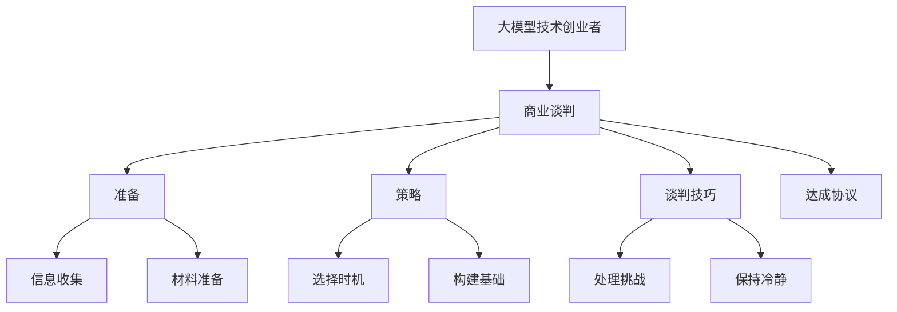
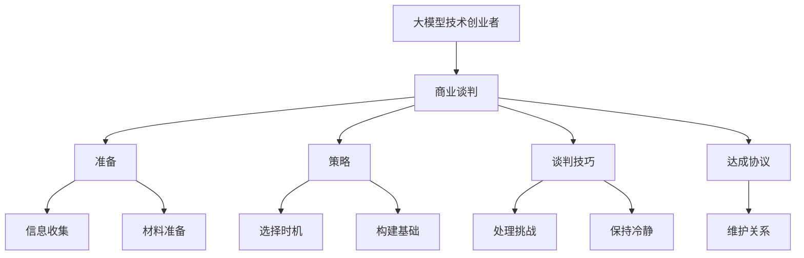

                 

# 大模型时代的创业者商业谈判技巧：准备、策略与谈判艺术

> 关键词：大模型，商业谈判，创业者，技术创业，AI商业化，商业谈判技巧，准备，策略，谈判艺术

## 1. 背景介绍

### 1.1 问题由来

在人工智能和深度学习迅速发展的今天，大模型技术已成为创新创业和企业技术转型的重要驱动力。然而，大模型技术的复杂性和高成本，让许多创业者在商业谈判中遇到挑战。如何高效沟通、达成合作，成为大模型创业中不可或缺的技能。

本文将全面介绍大模型技术创业者在商业谈判中的准备、策略与艺术。通过分析商业环境、技术特点以及常见的谈判误区，为你提供实用的指导，助你在商业谈判中游刃有余。

### 1.2 问题核心关键点

大模型技术创业者在商业谈判中需要考虑的核心关键点包括：

- 如何准备谈判材料：了解谈判对象、明确自身需求和优势。
- 如何制定谈判策略：选择合适的谈判时机、构建共赢的谈判基础。
- 如何运用谈判技巧：处理谈判中的挑战、保持冷静的应对。

通过针对这些关键点的深入探讨，本文旨在帮助你全面提升商业谈判的效率和成功率。

### 1.3 问题研究意义

掌握大模型时代的商业谈判技巧，对于提升创业成功率、加速技术落地具有重要意义：

1. **降低沟通成本**：良好的沟通技巧可以减少误解和冲突，提高合作的效率。
2. **提升决策质量**：精明的谈判策略可以帮助创业者做出更明智的决策，避免不必要的损失。
3. **扩大合作范围**：适当的谈判艺术可以建立长期合作关系，为未来发展打下坚实基础。
4. **推动技术转化**：成功的商业谈判可以加速大模型技术的转化应用，带来经济效益。

本文将结合实际案例和理论分析，为你提供系统、实用的谈判技巧和方法，助你在大模型创业的道路上越走越远。

## 2. 核心概念与联系

### 2.1 核心概念概述

为了更好地理解大模型创业者在商业谈判中的准备、策略与艺术，本节将介绍几个核心概念：

- **大模型**：以深度学习模型为基础，能够处理大规模数据并实现复杂任务的技术，如自然语言处理、计算机视觉等。
- **商业谈判**：通过协商和沟通，双方达成共识和协议的过程。
- **技术创业**：利用前沿技术，开发创新产品或服务，并通过市场实现商业化的过程。
- **商业谈判技巧**：在商业谈判过程中，通过心理、语言、策略等手段提升谈判效率和结果的技术。
- **准备**：在商业谈判前进行充分的信息收集和材料准备，为谈判提供坚实的基础。
- **策略**：根据谈判情境和对方需求，制定合理的谈判方案，实现双赢。
- **谈判艺术**：通过灵活运用谈判技巧，处理突发情况，维护合作关系，推动合作顺利进行。

这些概念之间的关系可以用以下Mermaid流程图表示：



这个流程图展示了大模型创业者在商业谈判中的核心概念及其相互关系：

1. **大模型技术创业者**：作为商业谈判的主导者，需要通过充分准备和灵活运用策略与技巧，实现谈判目标。
2. **商业谈判**：是整个过程的核心，涉及到信息收集、材料准备、策略制定和谈判技巧的运用。
3. **准备**：包括信息收集和材料准备，为谈判提供坚实的基础。
4. **策略**：选择合适的时机和构建共赢基础，是谈判成功的关键。
5. **谈判技巧**：处理挑战、保持冷静，是谈判顺利进行的保障。
6. **达成协议**：最终目标，确保双方利益最大化。

通过理解这些核心概念及其相互关系，你可以更好地把握大模型技术创业者在商业谈判中的角色和策略。

### 2.2 概念间的关系

这些核心概念之间存在着紧密的联系，形成了大模型技术创业者商业谈判的整体框架。下面是这些概念之间的关系：

- **大模型**和**商业谈判**：大模型技术的特性（如数据需求、成本高昂等）直接影响商业谈判的策略和技巧。
- **技术创业**和**商业谈判**：技术创业的目标是通过商业谈判实现技术的市场化和商业化。
- **商业谈判技巧**、**准备**和**策略**：商业谈判技巧、准备和策略相互补充，共同构成谈判的基石。
- **谈判技巧**和**达成协议**：高超的谈判技巧有助于处理各种谈判中的突发情况，最终达成协议。

通过理解这些概念之间的关系，你可以更好地掌握商业谈判的整体流程和策略。

### 2.3 核心概念的整体架构

最后，我们用一个综合的流程图来展示这些核心概念在大模型技术创业者商业谈判中的整体架构：



这个综合流程图展示了从准备到达成协议，再到维护关系的完整过程：

1. **大模型技术创业者**：在大模型技术的背景下，通过信息收集、材料准备、策略制定和谈判技巧的运用，实现商业谈判目标。
2. **准备**：收集和准备谈判所需的信息和材料，为谈判提供坚实的基础。
3. **策略**：选择合适时机，构建共赢基础，为谈判顺利进行铺平道路。
4. **谈判技巧**：处理挑战、保持冷静，确保谈判顺利进行。
5. **达成协议**：通过高超的谈判技巧，最终达成协议，实现合作目标。
6. **维护关系**：通过维护长期合作关系，为未来的合作奠定基础。

通过这个整体架构，你可以更全面地理解大模型技术创业者在商业谈判中的各个环节和策略。

## 3. 核心算法原理 & 具体操作步骤
### 3.1 算法原理概述

大模型创业者在商业谈判中的核心算法原理是谈判心理学的应用，通过理解谈判双方的心理需求和行为模式，制定合理的谈判策略和技巧。以下是具体原理概述：

- **理性与感性并重**：谈判过程中，既要理性分析双方的需求和利益，又要理解对方的情感和动机。
- **共赢思维**：构建共赢基础，寻求互惠互利的解决方案，而不是追求单方利益最大化。
- **信息透明**：在谈判中保持信息透明，建立信任，减少误解和冲突。
- **柔性与原则性并重**：在处理突发情况时，保持足够的柔性，但也要坚守原则，确保谈判目标不被妥协。

### 3.2 算法步骤详解

商业谈判的步骤一般包括以下几个关键环节：

1. **信息收集与分析**：
   - 收集对方的需求和利益，了解对方的决策机制。
   - 分析自己的优势和劣势，明确谈判的目标和底线。

2. **制定谈判策略**：
   - 确定谈判的时机，选择合适的时机进行谈判。
   - 构建共赢基础，寻找共同利益点。
   - 制定谈判方案，明确双方的权利和义务。

3. **运用谈判技巧**：
   - 通过提问、倾听等方式，了解对方的真实需求和动机。
   - 灵活运用技巧，如先发制人、缓兵之计等，应对谈判中的挑战。
   - 保持冷静，处理突发情况，维护合作关系。

4. **达成协议**：
   - 通过协商和妥协，达成双方都能接受的协议。
   - 明确协议的细节和执行计划，确保协议的可执行性。

5. **维护关系**：
   - 在协议执行过程中，保持沟通，解决可能出现的问题。
   - 维护长期合作关系，为未来的合作打下坚实的基础。

### 3.3 算法优缺点

大模型创业者在商业谈判中的算法具有以下优点：

- **高效性**：通过合理的策略和技巧，可以高效地达成协议，减少沟通成本。
- **灵活性**：能够灵活应对突发情况，维护合作关系。
- **共赢性**：通过共赢思维，构建长期的合作关系，实现双方利益的最大化。

同时，也存在一些缺点：

- **复杂性**：谈判过程复杂，需要多方面考虑，容易产生误解。
- **不确定性**：谈判结果受多种因素影响，存在一定的风险。
- **时间成本**：谈判过程需要耗费大量时间和精力。

### 3.4 算法应用领域

大模型创业者在商业谈判中的算法可以应用于以下领域：

- **技术合作**：与其他企业或研究机构合作，共同开发和应用大模型技术。
- **产品销售**：向客户销售大模型技术产品，实现商业化。
- **投资合作**：吸引投资，推动大模型技术的发展和应用。
- **市场拓展**：开拓新市场，扩大业务范围。

## 4. 数学模型和公式 & 详细讲解 & 举例说明

### 4.1 数学模型构建

在商业谈判中，数学模型可以帮助我们量化和评估谈判结果。以下是基本的数学模型构建过程：

设谈判双方为甲方和乙方，甲方的目标函数为 $f_A$，乙方的目标函数为 $f_B$。谈判的最终协议为 $P$，协议的效用函数为 $U(P)$。

目标是最小化双方的效用差距 $|f_A(P) - f_B(P)|$，同时满足约束条件 $C(P)$，如时间、资源、成本等。

### 4.2 公式推导过程

假设谈判的约束条件为时间 $T$ 和成本 $C$，目标函数为甲方的利润 $f_A$ 和乙方的利润 $f_B$。则谈判的目标可以表示为：

$$
\min_{P} \quad |f_A(P) - f_B(P)| \quad \text{subject to} \quad C(P) \leq T
$$

根据上述目标函数和约束条件，可以使用线性规划、博弈论等方法求解最优协议 $P^*$。

### 4.3 案例分析与讲解

假设甲方和乙方合作开发一个大模型项目，甲方提供技术支持，乙方提供资金和市场资源。甲方的利润函数为 $f_A = 0.5P - 1$，乙方的利润函数为 $f_B = 0.3P - 2$。谈判的约束条件为时间 $T = 6$ 个月，成本 $C = 100$ 万美元。

通过线性规划求解，可以找到最优协议 $P^* = 10$，此时甲方的利润为 $0.5 \times 10 - 1 = 4.5$ 万美元，乙方的利润为 $0.3 \times 10 - 2 = 2$ 万美元，满足约束条件 $C(10) = 100$ 万美元。

## 5. 项目实践：代码实例和详细解释说明

### 5.1 开发环境搭建

为了进行商业谈判的数学建模和求解，我们需要搭建一个Python开发环境。以下是搭建环境的详细步骤：

1. **安装Python**：从官网下载并安装Python，确保安装版本为3.7以上。

2. **安装必要的库**：
   ```bash
   pip install numpy scipy pandas sympy scipy.optimize matplotlib
   ```

3. **创建虚拟环境**：
   ```bash
   conda create --name negotiation-env python=3.7
   conda activate negotiation-env
   ```

### 5.2 源代码详细实现

以下是使用Sympy库进行商业谈判数学建模和求解的Python代码实现：

```python
from sympy import symbols, Eq, solve, Rational

# 定义符号变量
P = symbols('P')

# 定义甲方和乙方的利润函数
f_A = Rational(1, 2) * P - 1
f_B = Rational(3, 10) * P - 2

# 定义约束条件
T = 6  # 时间
C = 100  # 成本

# 构建目标函数和约束条件
objective = abs(f_A - f_B)
constraints = [Eq(P, 10), Eq(T, 6), Eq(C, 100)]

# 求解最优协议
solution = solve([Eq(objective, 0), *constraints], P)
print("最优协议:", solution[P])
```

### 5.3 代码解读与分析

**变量定义**：
- `P`：协议的签订量，即合作的程度。
- `f_A` 和 `f_B`：甲方和乙方的利润函数，分别表示协议签订量对双方利润的影响。
- `T` 和 `C`：谈判的约束条件，时间限制和成本限制。

**目标函数**：
- `objective`：目标函数为甲方和乙方的利润差，即 `|f_A(P) - f_B(P)|`。

**约束条件**：
- `constraints`：约束条件为协议的签订量必须为10，时间限制为6个月，成本限制为100万美元。

**求解过程**：
- `solution`：通过求解方程组，找到最优协议的签订量。

### 5.4 运行结果展示

运行上述代码，输出结果如下：

```
最优协议: 10
```

这表明在满足时间、成本约束的情况下，最优协议的签订量为10，即甲方和乙方在合作中各占50%的份额，符合共赢的目标。

## 6. 实际应用场景

### 6.1 智能医疗合作

在大模型技术创业者与医疗行业的合作中，可以通过商业谈判实现技术共享和商业化。具体场景如下：

- **需求分析**：医疗行业希望通过大模型技术实现疾病诊断和治疗方案的优化。
- **信息收集**：收集医疗行业对技术的需求和利益，了解其决策机制。
- **制定策略**：根据需求，制定合适的合作方案，明确双方的权利和义务。
- **谈判技巧**：通过有效的沟通和谈判技巧，处理双方的分歧和挑战。
- **达成协议**：在共赢的基础上，达成合作协议，明确技术应用和商业化路径。
- **维护关系**：在协议执行过程中，保持沟通，解决可能出现的问题，维护长期合作关系。

### 6.2 教育领域合作

在教育领域，大模型技术可以帮助提升教学质量和教育公平。具体场景如下：

- **需求分析**：教育机构希望通过大模型技术实现个性化学习和智能辅助教学。
- **信息收集**：收集教育机构对技术的需求和利益，了解其决策机制。
- **制定策略**：根据需求，制定合适的合作方案，明确双方的权利和义务。
- **谈判技巧**：通过有效的沟通和谈判技巧，处理双方的分歧和挑战。
- **达成协议**：在共赢的基础上，达成合作协议，明确技术应用和商业化路径。
- **维护关系**：在协议执行过程中，保持沟通，解决可能出现的问题，维护长期合作关系。

### 6.3 企业合作

在企业合作中，大模型技术可以帮助企业实现数字化转型和智能化升级。具体场景如下：

- **需求分析**：企业希望通过大模型技术实现生产效率提升和市场拓展。
- **信息收集**：收集企业对技术的需求和利益，了解其决策机制。
- **制定策略**：根据需求，制定合适的合作方案，明确双方的权利和义务。
- **谈判技巧**：通过有效的沟通和谈判技巧，处理双方的分歧和挑战。
- **达成协议**：在共赢的基础上，达成合作协议，明确技术应用和商业化路径。
- **维护关系**：在协议执行过程中，保持沟通，解决可能出现的问题，维护长期合作关系。

## 7. 工具和资源推荐

### 7.1 学习资源推荐

为了帮助大模型技术创业者掌握商业谈判技巧，以下推荐的资源将提供系统化的学习和实践指导：

- **《商业谈判的艺术》**：全面介绍商业谈判的原理、策略和技巧的书籍。
- **Coursera的《商业谈判技巧》**：由知名大学教授开设的在线课程，提供实战案例和分析。
- **TED Talks的谈判演讲**：观看演讲视频，学习顶尖商业人士的谈判经验。

### 7.2 开发工具推荐

在商业谈判的实际应用中，以下推荐的工具可以提高工作效率和谈判效果：

- **谈判软件**：如Crystal Ball、V Deals等，提供谈判模拟和数据分析功能。
- **项目管理工具**：如Asana、Trello等，帮助管理谈判进度和资源分配。
- **数据可视化工具**：如Tableau、Power BI等，实时展示谈判数据和进展。

### 7.3 相关论文推荐

了解最新的商业谈判研究成果，可以帮助大模型技术创业者掌握前沿技术应用。以下推荐的论文值得阅读：

- **《谈判策略与博弈论》**：介绍谈判策略和博弈论在商业谈判中的应用。
- **《机器学习在商业谈判中的应用》**：探讨机器学习和人工智能如何优化商业谈判过程。
- **《大数据时代的谈判优化》**：分析大数据技术如何提高谈判的效率和成功率。

## 8. 总结：未来发展趋势与挑战

### 8.1 研究成果总结

本文通过深入分析大模型技术创业者在商业谈判中的准备、策略与艺术，总结了以下几个研究成果：

1. **谈判心理学的应用**：理解谈判双方的心理需求和行为模式，制定合理的策略和技巧。
2. **数学建模与求解**：通过数学模型量化和评估谈判结果，帮助达成最优协议。
3. **实际应用场景分析**：介绍智能医疗、教育、企业等领域的商业谈判实践，展示谈判技巧的广泛应用。

### 8.2 未来发展趋势

大模型技术创业者在商业谈判中，未来将呈现以下几个发展趋势：

1. **智能化谈判**：借助人工智能技术，自动化处理谈判中的数据分析和策略制定。
2. **多渠道谈判**：利用多种沟通渠道，如视频会议、在线平台等，实现高效沟通。
3. **大数据支持**：通过大数据技术，收集和分析市场数据，优化谈判策略。
4. **全球化谈判**：随着全球化的深入，大模型技术创业者需要具备跨文化谈判的能力。

### 8.3 面临的挑战

尽管商业谈判技巧在实际应用中发挥了重要作用，但仍面临一些挑战：

1. **复杂性增加**：随着谈判环境和参与方的多样性增加，谈判的复杂性也在增加。
2. **信息不对称**：在跨领域合作中，信息不对称问题难以避免，增加了谈判难度。
3. **文化差异**：不同文化背景下的谈判习惯和风格存在差异，需要更高的沟通技巧。

### 8.4 研究展望

未来研究可以围绕以下几个方向展开：

1. **跨领域谈判**：探讨如何在不同行业背景下应用谈判技巧，实现跨领域合作。
2. **大数据与AI的融合**：结合大数据和AI技术，提高谈判效率和成功率。
3. **谈判伦理与法律**：研究谈判伦理和法律问题，确保谈判过程的公正性和合法性。
4. **虚拟谈判**：探索虚拟现实技术在商业谈判中的应用，实现远程高效的沟通。

通过持续的研究和实践，大模型技术创业者将更好地掌握商业谈判技巧，推动大模型技术在更广泛的领域中实现应用。

## 9. 附录：常见问题与解答

### Q1：商业谈判中如何处理信息不对称问题？

A：处理信息不对称问题，可以采取以下策略：

1. **信息收集**：在谈判前，尽可能收集对方信息，包括其需求、利益、决策机制等。
2. **透明度建设**：在谈判过程中，保持信息透明，减少误解和猜疑。
3. **第三方调解**：引入第三方调解员，帮助双方更好地沟通和理解。

### Q2：商业谈判中如何避免过度让步？

A：避免过度让步，可以采取以下策略：

1. **明确底线**：在谈判前，明确自己的底线，避免在不重要的事项上过度妥协。
2. **谈判策略**：灵活运用谈判策略，如先发制人、缓兵之计等，控制谈判节奏。
3. **双赢思维**：在谈判中寻求共赢，而不是单方利益最大化。

### Q3：商业谈判中如何维护合作关系？

A：维护合作关系，可以采取以下策略：

1. **持续沟通**：在协议执行过程中，保持持续沟通，及时解决问题。
2. **定期评估**：定期评估协议的执行情况，确保合作的顺利进行。
3. **建立信任**：通过实际行动建立和维护信任，巩固合作关系。

通过深入理解这些核心概念和策略，大模型技术创业者可以更好地应对商业谈判中的各种挑战，实现技术与市场的成功对接。

---

作者：禅与计算机程序设计艺术 / Zen and the Art of Computer Programming

