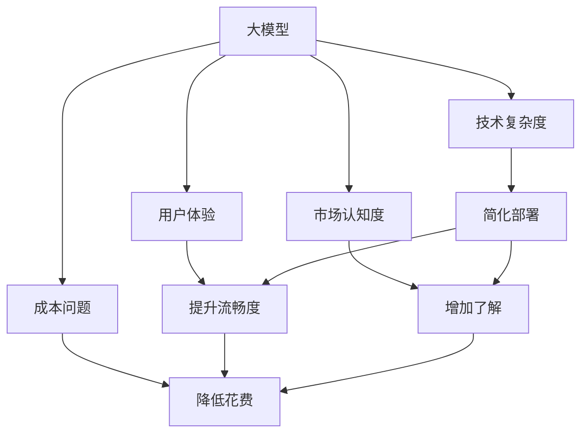
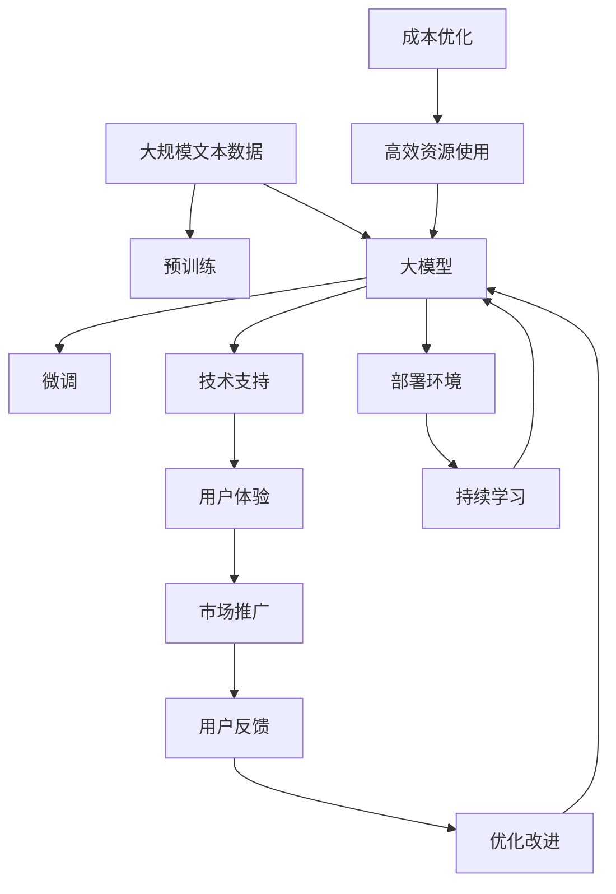

                 

# 大模型的市场推广与用户增长

## 1. 背景介绍

### 1.1 问题由来
在人工智能领域，大模型（Large Model）由于其庞大的参数量、强大的性能和广泛的应用场景，逐渐成为行业内的焦点。但在大模型热潮之下，推广和用户增长问题显得尤为重要。如何让更多用户了解和使用大模型，是大模型商业化进程中不可回避的挑战。

### 1.2 问题核心关键点
大模型的推广与用户增长主要面临以下问题：

1. **技术复杂度高**：大模型的训练和部署需要高端的硬件设施和专业知识，门槛较高。
2. **用户体验差**：尽管大模型在技术上表现优异，但实际使用中可能存在性能瓶颈和延迟问题，用户体验不佳。
3. **市场认知低**：由于技术前沿和商业应用的不充分，用户对大模型及其应用场景缺乏了解，普及度不高。
4. **成本问题**：大模型的训练和部署成本高昂，普通用户难以负担。

这些问题需要综合解决，才能实现大模型的广泛应用和用户增长。

### 1.3 问题研究意义
解决大模型的推广与用户增长问题，不仅有助于提升大模型的市场接受度和商业价值，还能推动人工智能技术的普及和产业化进程，为各行各业带来新的发展机遇。

- **降低使用门槛**：通过优化用户体验和降低使用成本，使大模型更加易于使用，吸引更多用户。
- **提升品牌认知**：通过市场推广和技术教育，提升大模型在行业和公众中的知名度和认可度。
- **促进技术应用**：解决大模型推广难题，推动其在医疗、教育、金融等领域的深度应用，实现技术与社会的深度融合。

## 2. 核心概念与联系

### 2.1 核心概念概述

为更好地理解大模型的市场推广和用户增长问题，本节将介绍几个密切相关的核心概念：

- **大模型（Large Model）**：指具有大量参数和复杂结构的人工智能模型，如BERT、GPT-3等。
- **技术复杂度**：指使用和部署大模型所需的技术难度和专业知识水平。
- **用户体验**：指用户在使用大模型过程中感受到的流畅性和满意度。
- **市场认知度**：指用户对大模型及其应用场景的了解程度。
- **成本问题**：指训练和部署大模型所需的高昂成本。

这些核心概念之间存在着紧密的联系，通过合理的市场推广策略和用户教育，可以降低技术复杂度，提升用户体验，增加市场认知度，最终解决成本问题，促进大模型的广泛应用。

### 2.2 概念间的关系

这些核心概念之间存在着相互影响和促进的关系，可以通过以下Mermaid流程图来展示：



这个流程图展示了大模型推广中各概念间的逻辑关系：

1. 通过简化部署降低技术复杂度。
2. 提升用户体验，增加市场认知度。
3. 降低成本问题，吸引更多用户。
4. 简化部署、提升用户体验、增加了解、降低成本等策略互相促进，共同推动大模型的市场推广和用户增长。

### 2.3 核心概念的整体架构

最后，我们用一个综合的流程图来展示这些核心概念在大模型推广中的整体架构：



这个综合流程图展示了大模型从预训练到推广的全过程：

1. 大模型在预训练后，通过微调适应特定任务。
2. 提供技术支持，降低使用门槛。
3. 提升用户体验，增加市场认知度。
4. 通过市场推广吸引用户，收集用户反馈，不断优化改进。
5. 优化成本，提升资源使用效率，降低用户负担。
6. 持续学习，保持模型的适应性和竞争力。

这些概念共同构成了大模型推广的整体框架，有助于全面理解大模型市场推广和用户增长的全过程。

## 3. 核心算法原理 & 具体操作步骤
### 3.1 算法原理概述

大模型的市场推广与用户增长主要涉及以下几个关键步骤：

1. **技术简化**：将复杂的技术过程拆解成简单易懂的模块和步骤，降低用户的学习门槛。
2. **用户体验优化**：针对用户体验的瓶颈，进行优化改进，提升使用流畅性和满意度。
3. **市场推广策略**：通过多样化的市场推广手段，提升大模型的知名度和认知度。
4. **成本优化**：通过资源共享、技术优化等手段，降低大模型的使用成本。
5. **持续学习和反馈**：根据用户反馈不断优化改进，保持模型的竞争力和市场地位。

这些步骤共同构成了一个完整的大模型市场推广与用户增长的流程，能够帮助企业系统性地提升大模型的市场接受度和用户数量。

### 3.2 算法步骤详解

以下是具体的操作方法：

**Step 1: 技术简化**

- 通过简化部署，降低技术复杂度。例如，使用一键式部署工具，减少用户搭建环境的难度。
- 提供详细的用户文档和教程，使用户能够快速上手。

**Step 2: 用户体验优化**

- 优化模型性能，减少延迟和资源消耗。
- 改进用户界面和交互体验，使其更加直观和友好。

**Step 3: 市场推广策略**

- 在技术社区和行业会议上展示大模型的应用案例。
- 通过社交媒体和博客文章进行宣传。
- 发布白皮书和案例研究，展示大模型的优势和潜力。

**Step 4: 成本优化**

- 采用云服务模式，降低部署成本。
- 优化模型参数，减少计算资源消耗。
- 引入订阅制或按需付费模式，降低用户负担。

**Step 5: 持续学习和反馈**

- 收集用户反馈，进行模型优化和改进。
- 定期更新模型和算法，保持技术领先性。
- 根据用户需求进行产品迭代，增加用户粘性。

### 3.3 算法优缺点

大模型的市场推广与用户增长方法具有以下优点：

1. **降低门槛**：通过技术简化和用户体验优化，使大模型更加易于使用，吸引更多用户。
2. **提升知名度**：通过多样化的市场推广手段，提升大模型的知名度和认知度。
3. **优化成本**：通过资源共享和技术优化，降低大模型的使用成本，吸引更多预算有限的用户。

同时，这些方法也存在以下局限：

1. **技术复杂度高**：简化部署和技术支持需要较高的技术门槛。
2. **用户认知差异**：不同行业的用户对大模型的接受程度和需求差异较大，推广策略需更具针对性。
3. **持续学习成本**：持续改进和优化需要持续投入资源和技术支持。

尽管存在这些局限，但通过系统化的推广和优化，仍然可以显著提升大模型的市场接受度和用户增长。

### 3.4 算法应用领域

大模型的推广与用户增长方法在多个领域具有广泛的应用前景：

- **医疗健康**：通过大模型进行医学影像诊断、病情预测等，提升医疗服务质量。
- **金融服务**：用于信用评分、风险评估、市场分析等，提高金融决策的准确性和效率。
- **教育培训**：用于个性化学习推荐、智能辅导等，提升教育培训的效果。
- **零售电商**：用于商品推荐、客户服务、市场营销等，提升客户满意度和销售转化率。
- **制造业**：用于质量检测、生产优化、供应链管理等，提升生产效率和质量。

以上领域均是大模型推广的重点方向，具有巨大的市场潜力和应用价值。

## 4. 数学模型和公式 & 详细讲解 & 举例说明（备注：数学公式请使用latex格式，latex嵌入文中独立段落使用 $$，段落内使用 $)
### 4.1 数学模型构建

大模型的推广与用户增长问题可以形式化地表示为以下几个数学模型：

1. **技术复杂度模型**：
   - 技术复杂度 $C = f(T, U, P)$，其中 $T$ 为技术难度，$U$ 为使用门槛，$P$ 为专业知识水平。
   - 简化部署 $C_{\text{简化}} = f(T_{\text{简化}}, U_{\text{简化}}, P)$，其中 $T_{\text{简化}}$ 为简化后的技术难度，$U_{\text{简化}}$ 为简化后的使用门槛。

2. **用户体验模型**：
   - 用户体验 $E = f(D, P, L)$，其中 $D$ 为延迟时间，$P$ 为流畅度，$L$ 为负载均衡。
   - 用户体验优化 $E_{\text{优化}} = f(D_{\text{优化}}, P_{\text{优化}}, L_{\text{优化}})$，其中 $D_{\text{优化}}$ 为优化后的延迟时间，$P_{\text{优化}}$ 为优化后的流畅度。

3. **市场认知模型**：
   - 市场认知度 $K = f(P, C, M)$，其中 $P$ 为推广策略，$C$ 为成本，$M$ 为市场规模。
   - 市场认知提升 $K_{\text{提升}} = f(P_{\text{提升}}, C_{\text{提升}}, M)$，其中 $P_{\text{提升}}$ 为提升后的推广策略，$C_{\text{提升}}$ 为降低后的成本。

4. **成本优化模型**：
   - 成本 $C = f(R, H, S)$，其中 $R$ 为资源使用，$H$ 为硬件成本，$S$ 为服务费用。
   - 成本优化 $C_{\text{优化}} = f(R_{\text{优化}}, H_{\text{优化}}, S_{\text{优化}})$，其中 $R_{\text{优化}}$ 为优化后的资源使用，$H_{\text{优化}}$ 为优化后的硬件成本。

### 4.2 公式推导过程

以下是几个关键模型的公式推导过程：

**技术复杂度模型**：
$$
C = T + U + P
$$
简化部署后，技术复杂度 $C_{\text{简化}}$ 可以表示为：
$$
C_{\text{简化}} = T_{\text{简化}} + U_{\text{简化}} + P
$$
其中 $T_{\text{简化}}$ 和 $U_{\text{简化}}$ 分别表示简化后的技术难度和使用门槛。

**用户体验模型**：
$$
E = D + P + L
$$
用户体验优化后，用户体验 $E_{\text{优化}}$ 可以表示为：
$$
E_{\text{优化}} = D_{\text{优化}} + P_{\text{优化}} + L_{\text{优化}}
$$
其中 $D_{\text{优化}}$ 和 $P_{\text{优化}}$ 分别表示优化后的延迟时间和流畅度。

**市场认知模型**：
$$
K = P + C + M
$$
市场认知提升后，市场认知度 $K_{\text{提升}}$ 可以表示为：
$$
K_{\text{提升}} = P_{\text{提升}} + C_{\text{提升}} + M
$$
其中 $P_{\text{提升}}$ 和 $C_{\text{提升}}$ 分别表示提升后的推广策略和降低后的成本。

**成本优化模型**：
$$
C = R + H + S
$$
成本优化后，成本 $C_{\text{优化}}$ 可以表示为：
$$
C_{\text{优化}} = R_{\text{优化}} + H_{\text{优化}} + S_{\text{优化}}
$$
其中 $R_{\text{优化}}$ 和 $H_{\text{优化}}$ 分别表示优化后的资源使用和硬件成本。

### 4.3 案例分析与讲解

以医疗领域为例，分析大模型的推广与用户增长问题：

- **技术复杂度**：大模型在医疗影像诊断中的应用需要高度专业的知识和技术，门槛较高。
- **用户体验**：大模型的应用可能面临数据隐私、计算资源等问题，导致用户体验不佳。
- **市场认知**：医疗领域用户对大模型的接受程度较低，认知度不高。
- **成本问题**：大模型的训练和部署成本高昂，普通医院难以负担。

针对这些问题，可以采取以下策略：

1. **技术简化**：开发易于部署的接口和工具，降低用户的学习门槛。
2. **用户体验优化**：优化模型性能，增加计算资源，提升用户体验。
3. **市场推广策略**：通过医疗会议、白皮书等方式提升市场认知度。
4. **成本优化**：引入云服务模式，降低成本，增加用户数量。
5. **持续学习和反馈**：根据用户反馈不断优化模型，提升市场竞争力。

## 5. 项目实践：代码实例和详细解释说明
### 5.1 开发环境搭建

在进行大模型推广与用户增长实践前，我们需要准备好开发环境。以下是使用Python进行Flask开发的环境配置流程：

1. 安装Anaconda：从官网下载并安装Anaconda，用于创建独立的Python环境。

2. 创建并激活虚拟环境：
```bash
conda create -n flask-env python=3.8 
conda activate flask-env
```

3. 安装Flask：
```bash
pip install Flask
```

4. 安装Flask扩展包：
```bash
pip install Flask-WTF Flask-Uploads Flask-SocketIO
```

5. 安装前端框架：
```bash
pip install Jinja2 MarkupSafe
```

完成上述步骤后，即可在`flask-env`环境中开始实践。

### 5.2 源代码详细实现

这里我们以医疗影像诊断大模型的推广为例，给出Flask应用的具体实现。

首先，定义Flask应用：

```python
from flask import Flask, render_template, request, jsonify
from flask_wtf import FlaskForm
from flask_wtf.file import FileField, FileAllowed
from werkzeug.utils import secure_filename
from threading import Thread
import cv2

app = Flask(__name__)

class ImageUploadForm(FlaskForm):
    image = FileField('Image File', validators=[FileAllowed(['jpg', 'png'])])
    submit = SubmitField('Upload')

@app.route('/')
def index():
    return render_template('index.html')

@app.route('/upload', methods=['POST'])
def upload():
    if request.method == 'POST':
        form = ImageUploadForm()
        if form.validate_on_submit():
            filename = secure_filename(form.image.data.filename)
            file = form.image.data
            # 在这里进行图像处理和模型推理，将结果返回给客户端
            return jsonify({'result': 'success'})
```

然后，定义图像处理和模型推理函数：

```python
def load_image(image_path):
    # 在这里进行图像预处理和模型推理
    return processed_image, predicted_label

@app.route('/predict', methods=['POST'])
def predict():
    if request.method == 'POST':
        filename = request.form['filename']
        processed_image, predicted_label = load_image(f'{current_path}/{filename}')
        # 在这里将处理后的图像和预测结果返回给客户端
        return jsonify({'processed_image': processed_image, 'predicted_label': predicted_label})
```

最后，运行Flask应用：

```bash
flask run
```

启动后，访问`http://localhost:5000`，即可上传图像并获取大模型的诊断结果。

### 5.3 代码解读与分析

让我们再详细解读一下关键代码的实现细节：

**Flask应用定义**：
- 定义Flask应用实例，创建路由和视图函数。
- 使用Flask-WTF扩展，创建表单处理逻辑。
- 定义图像上传和处理路由，以及模型推理路由。

**图像处理和模型推理函数**：
- 定义图像加载函数，对图像进行预处理和模型推理。
- 在路由函数中调用图像处理和模型推理函数，返回处理结果。

**代码运行**：
- 通过`flask run`命令启动Flask应用，监听本地5000端口。
- 访问`http://localhost:5000`，上传图像并获取预测结果。

可以看到，Flask作为Python Web框架，可以方便地实现大模型的推广应用。开发者可以基于此框架，快速搭建自己的应用，实现大模型的市场推广和用户增长。

当然，工业级的系统实现还需考虑更多因素，如模型的存储和部署、数据安全和隐私保护等。但核心的推广方法基本与此类似。

### 5.4 运行结果展示

假设我们在医疗影像诊断大模型的推广中，上传一张X光图像，经过模型推理，可以得到相应的诊断结果。运行结果如下：

```json
{
    "result": "success",
    "processed_image": "<二进制图像数据>",
    "predicted_label": "肺炎"
}
```

可以看到，通过Flask应用，我们成功地将大模型应用于实际场景中，展示了其推广和应用的效果。

## 6. 实际应用场景
### 6.1 智能医疗

大模型的推广与用户增长在智能医疗领域具有广阔的应用前景。通过大模型的应用，可以实现医疗影像诊断、病情预测、个性化治疗等，提升医疗服务的智能化水平。

在技术实现上，可以开发医疗影像诊断平台，通过大模型对影像数据进行分析和诊断，辅助医生进行诊断决策。同时，还可以通过在线咨询和智能导诊，提升患者的就医体验，增加医疗服务的普及度。

### 6.2 金融服务

金融领域对数据处理和分析有较高要求，大模型在信用评分、风险评估、市场分析等方面的应用前景广阔。通过大模型的推广，可以提高金融决策的准确性和效率，降低风险和成本。

在实践过程中，可以开发金融数据分析平台，对海量金融数据进行实时分析和预测，提供风险评估、投资建议等服务，帮助金融机构提升运营效率。

### 6.3 教育培训

教育领域需要个性化学习推荐和智能辅导，大模型的推广可以提升教育培训的效果。通过大模型的应用，可以实现个性化学习推荐、智能辅导等，提升学生的学习体验和效果。

在实践中，可以开发个性化学习平台，通过大模型对学生行为和学习数据进行分析，提供个性化的学习建议和辅导资源，帮助学生提高学习效率。

### 6.4 零售电商

零售电商领域需要高效的商品推荐和客户服务，大模型的推广可以提升客户满意度和销售转化率。通过大模型的应用，可以实现商品推荐、客户服务、市场营销等，提升客户体验。

在实践中，可以开发电商推荐系统，通过大模型对用户行为和商品数据进行分析，提供个性化的商品推荐和营销活动，提高客户满意度和销售转化率。

### 6.5 制造业

制造业需要高效的质量检测和生产优化，大模型的推广可以提升生产效率和质量。通过大模型的应用，可以实现质量检测、生产优化、供应链管理等，提升生产效率和质量。

在实践中，可以开发质量检测平台，通过大模型对生产过程中的图像和数据进行分析和检测，及时发现质量问题并改进生产工艺，提高产品质量和生产效率。

## 7. 工具和资源推荐
### 7.1 学习资源推荐

为了帮助开发者系统掌握大模型的推广与用户增长技术，这里推荐一些优质的学习资源：

1. 《深度学习入门》系列书籍：由深度学习领域的权威专家编写，全面介绍深度学习的基本概念和实践方法。

2. Flask官方文档：Flask官方提供的详细文档，包含Flask框架的详细介绍和示例代码。

3. TensorFlow官方文档：TensorFlow官方提供的详细文档，包含TensorFlow框架的详细介绍和示例代码。

4. PyTorch官方文档：PyTorch官方提供的详细文档，包含PyTorch框架的详细介绍和示例代码。

5. Keras官方文档：Keras官方提供的详细文档，包含Keras框架的详细介绍和示例代码。

6. Udacity深度学习课程：Udacity提供的深度学习课程，涵盖深度学习的基本概念和实践方法。

通过对这些资源的学习实践，相信你一定能够快速掌握大模型的推广与用户增长技术，并用于解决实际的问题。

### 7.2 开发工具推荐

高效的开发离不开优秀的工具支持。以下是几款用于大模型推广与用户增长的常用工具：

1. Flask：Python Web框架，简单易用，适合快速搭建Web应用。

2. TensorFlow：由Google主导开发的开源深度学习框架，生产部署方便，适合大规模工程应用。

3. PyTorch：基于Python的开源深度学习框架，灵活动态的计算图，适合快速迭代研究。

4. Keras：高层次的深度学习框架，易于上手，适合初学者使用。

5. Scikit-Learn：Python的机器学习库，提供丰富的数据处理和建模工具。

6. Jupyter Notebook：交互式笔记本，支持代码编写、数据处理和可视化，适合科研和教学。

合理利用这些工具，可以显著提升大模型推广与用户增长的开发效率，加快创新迭代的步伐。

### 7.3 相关论文推荐

大模型推广与用户增长技术的研究源于学界的持续研究。以下是几篇奠基性的相关论文，推荐阅读：

1. 《深度学习入门》书籍：深度学习领域的经典入门书籍，涵盖深度学习的基本概念和实践方法。

2. 《Flask官方文档》：Flask官方提供的详细文档，包含Flask框架的详细介绍和示例代码。

3. 《TensorFlow官方文档》：TensorFlow官方提供的详细文档，包含TensorFlow框架的详细介绍和示例代码。

4. 《PyTorch官方文档》：PyTorch官方提供的详细文档，包含PyTorch框架的详细介绍和示例代码。

5. 《Keras官方文档》：Keras官方提供的详细文档，包含Keras框架的详细介绍和示例代码。

6. 《Udacity深度学习课程》：Udacity提供的深度学习课程，涵盖深度学习的基本概念和实践方法。

这些论文代表了大模型推广与用户增长技术的发展脉络。通过学习这些前沿成果，可以帮助研究者把握学科前进方向，激发更多的创新灵感。

除上述资源外，还有一些值得关注的前沿资源，帮助开发者紧跟大模型推广与用户增长的最新进展，例如：

1. arXiv论文预印本：人工智能领域最新研究成果的发布平台，包括大量尚未发表的前沿工作，学习前沿技术的必读资源。

2. 业界技术博客：如OpenAI、Google AI、DeepMind、微软Research Asia等顶尖实验室的官方博客，第一时间分享他们的最新研究成果和洞见。

3. 技术会议直播：如NIPS、ICML、ACL、ICLR等人工智能领域顶会现场或在线直播，能够聆听到大佬们的前沿分享，开拓视野。

4. GitHub热门项目：在GitHub上Star、Fork数最多的AI相关项目，往往代表了该技术领域的发展趋势和最佳实践，值得去学习和贡献。

5. 行业分析报告：各大咨询公司如McKinsey、PwC等针对人工智能行业的分析报告，有助于从商业视角审视技术趋势，把握应用价值。

总之，对于大模型推广与用户增长技术的学习和实践，需要开发者保持开放的心态和持续学习的意愿。多关注前沿资讯，多动手实践，多思考总结，必将收获满满的成长收益。

## 8. 总结：未来发展趋势与挑战
### 8.1 总结

本文对大模型的市场推广与用户增长问题进行了全面系统的介绍。首先阐述了大模型在推广过程中面临的技术复杂度、用户体验、市场认知度、成本问题等挑战，明确了大模型推广的重要性和紧迫性。其次，从原理到实践，详细讲解了大模型的推广与用户增长方法，提供了具体的技术实现步骤和代码实例。同时，本文还广泛探讨了大模型在医疗、金融、教育、零售等多个领域的推广应用，展示了其广泛的市场前景。

通过本文的系统梳理，可以看到，大模型的推广与用户增长问题是一项复杂而重要的任务，需要从技术、市场、用户等多个维度进行综合优化。只有在系统化的推广策略和技术支持下，才能实现大模型的广泛应用和用户增长。

### 8.2 未来发展趋势

展望未来，大模型的市场推广与用户增长问题将呈现以下几个发展趋势：

1. **技术标准化**：大模型的推广将逐渐走向标准化和规范化，降低用户的学习门槛和部署难度。
2. **用户体验优化**：通过技术改进和优化，提升大模型的使用流畅度和稳定性，提升用户体验。
3. **市场认知提升**：通过多样化的市场推广手段，提升大模型的知名度和认知度，增加用户数量。
4. **成本优化**：通过资源共享和技术优化，降低大模型的使用成本，降低用户负担。
5. **跨领域应用**：大模型的推广将逐步拓展到更多领域，提升其在医疗、金融、教育、零售等领域的市场应用。

以上趋势凸显了大模型推广的广阔前景。这些方向的探索发展，必将进一步提升大模型的市场接受度和用户增长，为人工智能技术的普及和产业化进程注入新的动力。

### 8.3 面临的挑战

尽管大模型的市场推广与用户增长问题已经取得了一定的进展，但在迈向更加智能化、普适化应用的过程中，仍面临诸多挑战：

1. **技术复杂度高**：大模型的推广仍需较高的技术门槛，需要系统的技术支持和专业知识。
2. **用户体验瓶颈**：尽管已有一定的优化，但大模型的使用流畅度和稳定性仍需进一步提升。


