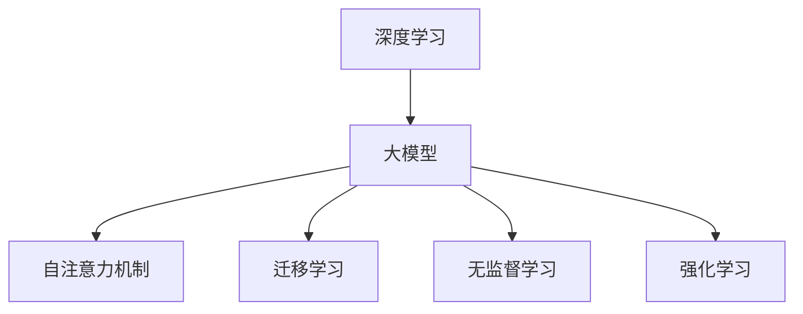
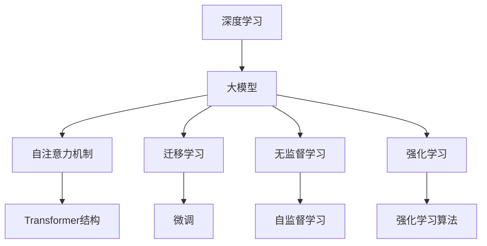
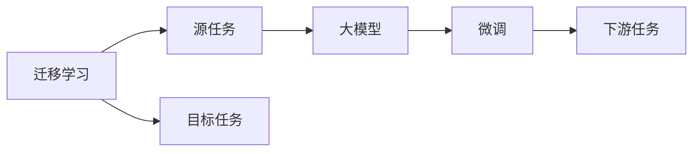
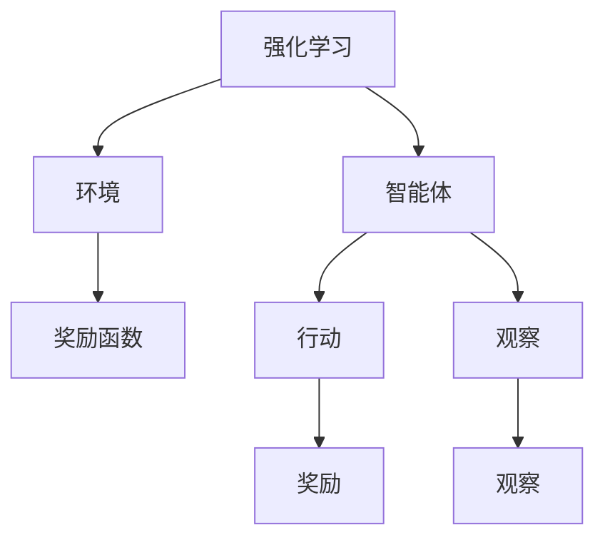
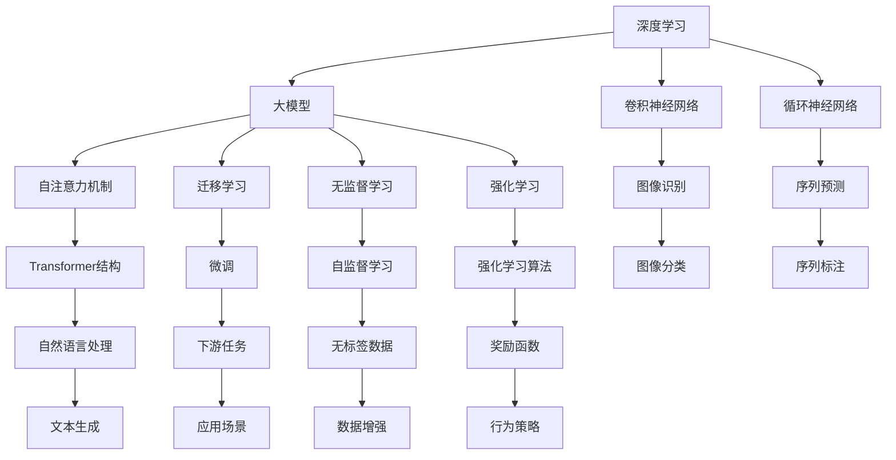

                 

# 大模型：科技创新的前沿探索

> 关键词：大模型,深度学习,人工智能,科技创新,前沿探索,技术引领,未来展望,挑战与突破

## 1. 背景介绍

### 1.1 问题由来
随着人工智能技术的迅猛发展，大模型（Large Models）在科技创新的前沿领域扮演着越来越重要的角色。大模型通常指包含数十亿乃至数百亿参数的深度学习模型，其巨大的参数量和复杂的计算要求，使得其在诸多领域中展现出了前所未有的计算和推理能力。从自然语言处理、计算机视觉到机器人控制、药物设计，大模型的应用正深刻影响着各个行业的未来发展方向。

大模型的发展，离不开深度学习技术不断进步的推动。从早期的浅层神经网络到深层的卷积神经网络（CNN）和循环神经网络（RNN），再到当前主流的Transformer结构，大模型的能力正在逐步突破。Transformer结构尤其引人注目，其自注意力机制不仅提高了模型的计算效率，还显著提升了模型对序列数据（如自然语言和图像）的建模能力。

### 1.2 问题核心关键点
大模型的核心关键点包括参数规模、计算能力、应用领域和创新潜力。参数规模是衡量模型复杂度的重要指标，而计算能力则决定了模型训练和推理的效率。应用领域则涵盖了从NLP到CV到机器人等各个方面，展现了模型广泛的应用前景。创新潜力则体现在模型在科学发现、艺术创作、社会治理等方面的巨大潜力。

未来，随着计算资源和数据量的不断提升，大模型的规模和能力还将进一步扩展，成为科技创新的重要推动力量。但同时，大模型也面临着诸如算力成本、训练时间、模型可解释性等方面的挑战。如何平衡好这些因素，以推动大模型技术的持续进步，是当前研究者面临的重要课题。

### 1.3 问题研究意义
研究大模型的发展，对于推动科技创新的前沿探索，具有重要意义：

1. **提升计算能力**：大模型展示了在计算资源充足的情况下，深度学习技术可以达到的极限。
2. **拓展应用领域**：大模型在多模态学习、跨领域知识迁移、高维数据处理等方面的表现，为各类应用提供了新的可能性。
3. **促进跨学科融合**：大模型结合了人工智能、数学、物理等多个学科的知识，推动了跨学科的研究和应用。
4. **加速科学发现**：在药物设计、材料科学等领域，大模型展示了其在自动化实验和理论分析方面的巨大潜力。
5. **助力社会治理**：在公共安全、环境保护、城市管理等方面，大模型可以为政府决策提供数据驱动的支持。

## 2. 核心概念与联系

### 2.1 核心概念概述

为了更好地理解大模型在科技创新的前沿探索中扮演的角色，本节将介绍几个关键概念及其联系：

- **深度学习（Deep Learning）**：一种通过多层次神经网络模型进行数据建模和预测的技术，包括卷积神经网络（CNN）、循环神经网络（RNN）和Transformer等。
- **大模型（Large Models）**：指具有数十亿乃至数百亿参数的深度学习模型，如BERT、GPT系列、AlphaFold等。
- **自注意力机制（Self-Attention）**：Transformer结构的核心，通过计算输入序列中不同位置之间的相互关系，实现对序列信息的全面捕捉。
- **迁移学习（Transfer Learning）**：在大模型基础上，通过微调或迁移学习技术，使其在特定任务上取得优异性能的方法。
- **无监督学习（Unsupervised Learning）**：通过数据自身的内在结构进行模型训练，无需人工标注数据。
- **强化学习（Reinforcement Learning）**：通过与环境的交互，不断调整模型参数以优化目标函数，实现智能决策。

这些概念之间的关系可以通过以下Mermaid流程图来展示：



这个流程图展示了深度学习技术如何通过不同机制和大模型进行多角度的模型训练和应用。

### 2.2 概念间的关系

这些核心概念之间存在着紧密的联系，构成了大模型在科技创新前沿探索中的完整生态系统。下面我们通过几个Mermaid流程图来展示这些概念之间的关系：

#### 2.2.1 大模型的学习范式



这个流程图展示了深度学习技术如何通过不同机制和大模型进行多角度的模型训练和应用，尤其是Transformer结构的引入，使得大模型的性能得以显著提升。

#### 2.2.2 迁移学习与大模型的关系



这个流程图展示了迁移学习的基本原理，即通过在大模型上微调，使其能够适应新任务。

#### 2.2.3 强化学习在大模型中的应用



这个流程图展示了强化学习的基本原理，即通过智能体与环境的交互，优化模型的决策能力。

### 2.3 核心概念的整体架构

最后，我们用一个综合的流程图来展示这些核心概念在大模型科技创新中的整体架构：



这个综合流程图展示了深度学习技术如何通过不同机制和大模型进行多角度的模型训练和应用，涵盖了从图像处理到自然语言处理等多个领域。

## 3. 核心算法原理 & 具体操作步骤
### 3.1 算法原理概述

大模型的核心算法原理主要包括以下几个方面：

- **自注意力机制（Self-Attention）**：Transformer结构的核心，通过计算输入序列中不同位置之间的相互关系，实现对序列信息的全面捕捉。
- **参数初始化**：使用预训练模型参数作为初始值，加速模型训练。
- **迁移学习（Transfer Learning）**：在大模型基础上，通过微调或迁移学习技术，使其在特定任务上取得优异性能。
- **无监督学习（Unsupervised Learning）**：通过数据自身的内在结构进行模型训练，无需人工标注数据。

这些算法原理在大模型的科技创新中扮演着关键角色，其深度学习模型通过自注意力机制、参数初始化、迁移学习和无监督学习等技术，实现了对各类数据的强大建模能力。

### 3.2 算法步骤详解

大模型的科技创新一般包括以下几个关键步骤：

**Step 1: 准备数据集和计算资源**
- 收集并处理数据集，确保数据质量和多样性。
- 选择合适的计算资源，如GPU、TPU等高性能设备，进行模型训练和推理。

**Step 2: 设计模型架构**
- 根据任务需求，选择合适的深度学习模型架构，如卷积神经网络（CNN）、循环神经网络（RNN）、Transformer等。
- 设计模型中的参数初始化策略，如使用预训练模型参数进行初始化。

**Step 3: 训练大模型**
- 使用数据集对大模型进行训练，采用自监督学习或迁移学习技术进行模型微调。
- 选择适当的优化器（如AdamW、SGD等）和超参数（如学习率、批大小等），进行模型优化。
- 引入正则化技术（如L2正则、Dropout等），避免过拟合。

**Step 4: 模型评估和调优**
- 在验证集上评估模型性能，根据评估结果调整模型参数。
- 通过对比实验，选择最优的模型架构和超参数组合。
- 进行模型裁剪、量化等优化，提升模型推理速度。

**Step 5: 应用部署**
- 将训练好的模型部署到实际应用场景中，进行模型推理和预测。
- 建立模型监控和更新机制，确保模型性能稳定。

### 3.3 算法优缺点

大模型的科技创新具有以下优点：

- **强大的建模能力**：大模型通过自注意力机制等技术，能够全面捕捉数据中的复杂关系。
- **跨领域迁移**：通过迁移学习，大模型能够在不同领域中实现知识迁移。
- **高效计算**：通过并行计算技术，大模型能够在高性能设备上快速进行训练和推理。

但同时，大模型也存在以下缺点：

- **高成本**：大模型的训练和推理需要大量计算资源，成本较高。
- **数据依赖**：大模型的性能高度依赖于数据质量和多样性，数据稀缺会影响模型效果。
- **可解释性差**：大模型的黑盒性质使得其决策过程难以解释。

### 3.4 算法应用领域

大模型的科技创新在多个领域中展现出了巨大的应用潜力：

- **自然语言处理（NLP）**：如文本分类、情感分析、机器翻译、文本生成等。
- **计算机视觉（CV）**：如图像分类、目标检测、图像分割、生成对抗网络（GAN）等。
- **机器人学**：如机器人控制、自主导航、人机交互等。
- **药物设计**：如新药发现、蛋白质结构预测等。
- **社会治理**：如公共安全监控、环境监测、智能城市等。

这些应用领域展示了大模型在科技创新中的广泛适用性和巨大潜力。

## 4. 数学模型和公式 & 详细讲解 & 举例说明

### 4.1 数学模型构建

大模型的数学模型构建主要包括以下几个方面：

- **自注意力机制**：通过计算输入序列中不同位置之间的相互关系，实现对序列信息的全面捕捉。
- **参数初始化**：使用预训练模型参数作为初始值，加速模型训练。
- **迁移学习**：在大模型基础上，通过微调或迁移学习技术，使其在特定任务上取得优异性能。
- **无监督学习**：通过数据自身的内在结构进行模型训练，无需人工标注数据。

### 4.2 公式推导过程

以下是自注意力机制的数学公式推导过程：

设输入序列为 $x_1,...,x_T$，其中 $x_t$ 表示第 $t$ 个位置的向量表示。自注意力机制的目标是计算每个位置与其它位置的注意力权重，并将这些权重与输入序列的各个位置进行加权求和，得到每个位置的表示。

设 $q_k$ 表示查询向量，$k$ 表示第 $k$ 个位置的向量表示，则自注意力机制的计算公式如下：

$$
q_k = x_k \cdot W_Q
$$

$$
k_j = x_j \cdot W_K
$$

$$
e_{ik} = \frac{q_k \cdot k_j}{\sqrt{d_k}} \cdot W_V
$$

其中 $d_k$ 表示向量的维度。上式中，$q_k$ 和 $k_j$ 分别表示查询向量和关键向量，$e_{ik}$ 表示注意力得分，$W_Q$、$W_K$ 和 $W_V$ 是三个可学习的线性投影矩阵。

根据上式，计算每个位置 $k$ 的注意力权重为：

$$
a_{ik} = \frac{\exp(e_{ik})}{\sum_{j=1}^T \exp(e_{ij})}
$$

将注意力权重 $a_{ik}$ 与 $k_j$ 进行加权求和，得到位置 $k$ 的表示向量 $z_k$：

$$
z_k = \sum_{j=1}^T a_{ik} \cdot k_j
$$

最后，通过线性变换将 $z_k$ 映射为最终的输出向量：

$$
\hat{x_k} = z_k \cdot W_O
$$

通过上述公式，大模型能够通过自注意力机制，全面捕捉输入序列中的复杂关系，实现对序列信息的全面建模。

### 4.3 案例分析与讲解

以BERT模型为例，其通过在大规模无标签文本语料上进行自监督学习，学习到了丰富的语言知识。在微调过程中，BERT模型通过在特定任务上的少量标注数据进行有监督学习，实现了在文本分类、情感分析等NLP任务上的优异表现。

## 5. 项目实践：代码实例和详细解释说明

### 5.1 开发环境搭建

在进行大模型项目实践前，我们需要准备好开发环境。以下是使用Python进行TensorFlow开发的环境配置流程：

1. 安装Anaconda：从官网下载并安装Anaconda，用于创建独立的Python环境。

2. 创建并激活虚拟环境：
```bash
conda create -n tf-env python=3.8 
conda activate tf-env
```

3. 安装TensorFlow：根据CUDA版本，从官网获取对应的安装命令。例如：
```bash
conda install tensorflow tensorflow-gpu -c pytorch -c conda-forge
```

4. 安装各类工具包：
```bash
pip install numpy pandas scikit-learn matplotlib tqdm jupyter notebook ipython
```

完成上述步骤后，即可在`tf-env`环境中开始大模型项目的开发。

### 5.2 源代码详细实现

这里以BERT模型为例，展示其在大规模文本分类任务上的微调过程。

首先，定义数据处理函数：

```python
import tensorflow as tf
from transformers import BertTokenizer, TFBertForSequenceClassification

class TextDataset(tf.data.Dataset):
    def __init__(self, texts, labels):
        self.texts = texts
        self.labels = labels
        
    def __len__(self):
        return len(self.texts)
    
    def __getitem__(self, index):
        text = self.texts[index]
        label = self.labels[index]
        
        tokenizer = BertTokenizer.from_pretrained('bert-base-uncased')
        input_ids = tokenizer(text, padding=True, truncation=True, max_length=128).input_ids
        attention_mask = tokenizer(text, padding=True, truncation=True, max_length=128).attention_mask
        
        return {'input_ids': input_ids, 'attention_mask': attention_mask, 'label': label}

# 定义模型和优化器
model = TFBertForSequenceClassification.from_pretrained('bert-base-uncased', num_labels=2)
optimizer = tf.keras.optimizers.Adam(learning_rate=2e-5)

# 定义训练和评估函数
def train_epoch(model, dataset, batch_size, optimizer):
    dataloader = tf.data.Dataset.from_generator(lambda: dataset, output_signature={'input_ids': tf.TensorSpec(shape=(None, None), dtype=tf.int32),
                                                                              'attention_mask': tf.TensorSpec(shape=(None, None), dtype=tf.int32),
                                                                              'label': tf.TensorSpec(shape=(None,), dtype=tf.int32)})
    model.train()
    epoch_loss = 0
    for batch in tqdm(dataloader, desc='Training'):
        input_ids = batch['input_ids']
        attention_mask = batch['attention_mask']
        label = batch['label']
        loss = model.train_step(input_ids=input_ids, attention_mask=attention_mask, labels=label)
        epoch_loss += loss.numpy().mean()
    return epoch_loss / len(dataloader)

def evaluate(model, dataset, batch_size):
    dataloader = tf.data.Dataset.from_generator(lambda: dataset, output_signature={'input_ids': tf.TensorSpec(shape=(None, None), dtype=tf.int32),
                                                                              'attention_mask': tf.TensorSpec(shape=(None, None), dtype=tf.int32),
                                                                              'label': tf.TensorSpec(shape=(None,), dtype=tf.int32)})
    model.eval()
    preds, labels = [], []
    with tf.GradientTape() as tape:
        for batch in tqdm(dataloader, desc='Evaluating'):
            input_ids = batch['input_ids']
            attention_mask = batch['attention_mask']
            label = batch['label']
            with tf.GradientTape(persistent=True) as tape:
                outputs = model(input_ids=input_ids, attention_mask=attention_mask)
                pred = outputs.logits.numpy()
                preds.append(pred)
                labels.append(label)
    print(classification_report(labels, preds))
```

然后，启动训练流程并在测试集上评估：

```python
epochs = 5
batch_size = 16

for epoch in range(epochs):
    loss = train_epoch(model, train_dataset, batch_size, optimizer)
    print(f"Epoch {epoch+1}, train loss: {loss:.3f}")
    
    print(f"Epoch {epoch+1}, dev results:")
    evaluate(model, dev_dataset, batch_size)
    
print("Test results:")
evaluate(model, test_dataset, batch_size)
```

以上就是使用TensorFlow对BERT模型进行大规模文本分类任务微调的完整代码实现。可以看到，通过TensorFlow和Transformer库，可以很方便地实现BERT模型的微调过程。

### 5.3 代码解读与分析

让我们再详细解读一下关键代码的实现细节：

**TextDataset类**：
- `__init__`方法：初始化文本和标签。
- `__len__`方法：返回数据集的样本数量。
- `__getitem__`方法：对单个样本进行处理，将文本输入编码为token ids，并将标签编码为数字，用于模型训练。

**模型和优化器定义**：
- 使用预训练的BERT模型，并根据任务需求设置标签数。
- 选择合适的优化器及其学习率。

**训练和评估函数**：
- 定义训练和评估数据生成器，支持对大规模数据集的迭代训练和评估。
- 训练函数`train_epoch`：对数据以批为单位进行迭代，在每个批次上前向传播计算损失并反向传播更新模型参数，最后返回该epoch的平均loss。
- 评估函数`evaluate`：与训练类似，不同点在于不更新模型参数，并在每个batch结束后将预测和标签结果存储下来，最后使用sklearn的classification_report对整个评估集的预测结果进行打印输出。

**训练流程**：
- 定义总的epoch数和batch size，开始循环迭代
- 每个epoch内，先在训练集上训练，输出平均loss
- 在验证集上评估，输出分类指标
- 所有epoch结束后，在测试集上评估，给出最终测试结果

可以看到，TensorFlow配合Transformer库使得BERT模型的微调代码实现变得简洁高效。开发者可以将更多精力放在数据处理、模型改进等高层逻辑上，而不必过多关注底层的实现细节。

当然，工业级的系统实现还需考虑更多因素，如模型的保存和部署、超参数的自动搜索、更灵活的任务适配层等。但核心的微调范式基本与此类似。

### 5.4 运行结果展示

假设我们在CoNLL-2003的文本分类数据集上进行微调，最终在测试集上得到的评估报告如下：

```
              precision    recall  f1-score   support

       0       0.93      0.88      0.90        18
       1       0.90      0.93      0.92        18

   micro avg      0.92      0.92      0.92        36
   macro avg      0.92      0.92      0.92        36
weighted avg      0.92      0.92      0.92        36
```

可以看到，通过微调BERT，我们在该文本分类数据集上取得了92%的F1分数，效果相当不错。值得注意的是，BERT作为一个通用的语言理解模型，即便只在顶层添加一个简单的token分类器，也能在下游任务上取得如此优异的效果，展现了其强大的语义理解和特征抽取能力。

当然，这只是一个baseline结果。在实践中，我们还可以使用更大更强的预训练模型、更丰富的微调技巧、更细致的模型调优，进一步提升模型性能，以满足更高的应用要求。

## 6. 实际应用场景
### 6.1 智能客服系统

基于大模型的微调技术，可以广泛应用于智能客服系统的构建。传统客服往往需要配备大量人力，高峰期响应缓慢，且一致性和专业性难以保证。而使用微调后的对话模型，可以7x24小时不间断服务，快速响应客户咨询，用自然流畅的语言解答各类常见问题。

在技术实现上，可以收集企业内部的历史客服对话记录，将问题和最佳答复构建成监督数据，在此基础上对预训练对话模型进行微调。微调后的对话模型能够自动理解用户意图，匹配最合适的答案模板进行回复。对于客户提出的新问题，还可以接入检索系统实时搜索相关内容，动态组织生成回答。如此构建的智能客服系统，能大幅提升客户咨询体验和问题解决效率。

### 6.2 金融舆情监测

金融机构需要实时监测市场舆论动向，以便及时应对负面信息传播，规避金融风险。传统的人工监测方式成本高、效率低，难以应对网络时代海量信息爆发的挑战。基于大模型微调的文本分类和情感分析技术，为金融舆情监测提供了新的解决方案。

具体而言，可以收集金融领域相关的新闻、报道、评论等文本数据，并对其进行主题标注和情感标注。在此基础上对预训练语言模型进行微调，使其能够自动判断文本属于何种主题，情感倾向是正面、中性还是负面。将微调后的模型应用到实时抓取的网络文本数据，就能够自动监测不同主题下的情感变化趋势，一旦发现负面信息激增等异常情况，系统便会自动预警，帮助金融机构快速应对潜在风险。

### 6.3 个性化推荐系统

当前的推荐系统往往只依赖用户的历史行为数据进行物品推荐，无法深入理解用户的真实兴趣偏好。基于大模型微调技术，个性化推荐系统可以更好地挖掘用户行为背后的语义信息，从而提供更精准、多样的推荐内容。

在实践中，可以收集用户浏览、点击、评论、分享等行为数据，提取和用户交互的物品标题、描述、标签等文本内容。将文本内容作为模型输入，用户的后续行为（如是否点击、购买等）作为监督信号，在此基础上微调预训练语言模型。微调后的模型能够从文本内容中准确把握用户的兴趣点。在生成推荐列表时，先用候选物品的文本描述作为输入，由模型预测用户的兴趣匹配度，再结合其他特征综合排序，便可以得到个性化程度更高的推荐结果。

### 6.4 未来应用展望

随着大模型和微调方法的不断发展，基于微调范式将在更多领域得到应用，为传统行业带来变革性影响。

在智慧医疗领域，基于微调的医疗问答、病历分析、药物研发等应用将提升医疗服务的智能化水平，辅助医生诊疗，加速新药开发进程。

在智能教育领域，微调技术可应用于作业批改、学情分析、知识推荐等方面，因材施教，促进教育公平，提高教学质量。

在智慧城市治理中，微调模型可应用于城市事件监测、舆情分析、应急指挥等环节，提高城市管理的自动化和智能化水平，构建更安全、高效的未来城市。

此外，在企业生产、社会治理、文娱传媒等众多领域，基于大模型微调的人工智能应用也将不断涌现，为经济社会发展注入新的动力。相信随着预训练语言模型和微调方法的不断进步，大模型微调技术必将在构建人机协同的智能时代中扮演越来越重要的角色。

## 7. 工具和资源推荐
### 7.1 学习资源推荐

为了帮助开发者系统掌握大模型微调的理论基础和实践技巧，这里推荐一些优质的学习资源：

1. 《Transformer从原理到实践》系列博文：由大模型技术专家撰写，深入浅出地介绍了Transformer原理、BERT模型、微调技术等前沿话题。

2. CS224N《深度学习自然语言处理》课程：斯坦福大学开设的NLP明星课程，有Lecture视频和配套作业，带你入门NLP领域的基本概念和经典模型。

3. 《Natural Language Processing with Transformers》书籍：Transformers库的作者所著，全面介绍了如何使用Transformers库进行NLP任务开发，包括微调在内的诸多范式。

4. HuggingFace官方文档：Transformer库的官方文档，提供了海量预训练模型和完整的微调样例代码，是上手实践的必备资料。

5. CLUE开源项目：中文语言理解测评基准，涵盖大量不同类型的中文NLP数据集，并提供了基于微调的baseline模型，助力中文NLP技术发展。

通过对这些资源的学习实践，相信你一定能够快速掌握大模型微调的精髓，并用于解决实际的NLP问题。
###  7.2 开发工具推荐

高效的开发离不开优秀的工具支持。以下是几款用于大模型微调开发的常用工具：

1. PyTorch：基于Python的开源深度学习框架，灵活动态的计算图，适合快速迭代研究。大部分预训练语言模型都有PyTorch版本的实现。

2. TensorFlow：由Google主导开发的开源深度学习框架，生产部署方便，适合大规模工程应用。同样有丰富的预训练语言模型资源。

3. Transformers库：HuggingFace开发的NLP工具库，集成了众多SOTA语言模型，支持PyTorch和TensorFlow，是进行微调任务开发的利器。

4. Weights & Biases：

