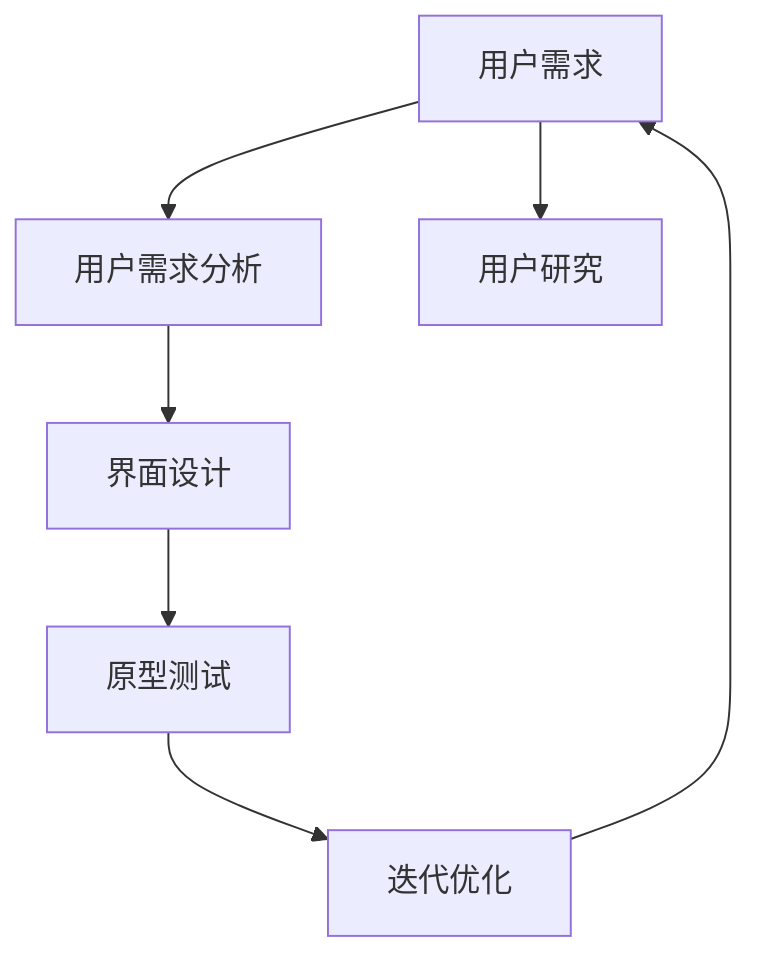
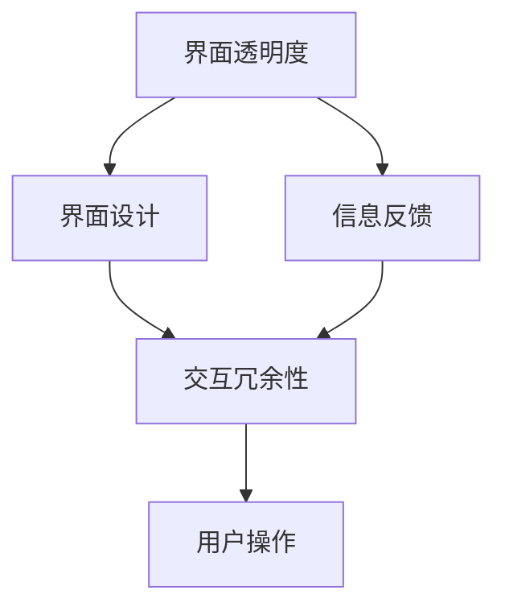
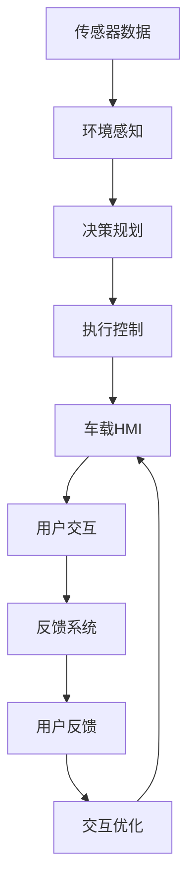

                 

# 端到端自动驾驶的车载人机交互设计

## 1. 背景介绍

### 1.1 问题由来
随着自动驾驶技术的迅速发展，汽车逐渐从传统的驾驶助手转变为真正的智能移动平台，车载人机交互设计（HMI，Human-Machine Interface）成为自动驾驶系统不可或缺的一部分。优秀的HMI设计不仅能够提升用户驾驶体验，还能在紧急情况下帮助驾驶员及时决策，从而提高行车安全。

在传统驾驶中，驾驶员和车辆之间的交互主要通过视线、触摸和声音等自然方式完成。而在自动驾驶场景下，HMI设计需要适应自动驾驶带来的新变化，如冗余系统、主动决策等。此外，自动驾驶车辆通常部署在城市、高速公路等复杂的交通环境中，用户对交互系统的可感知性、透明度、反应速度等要求更高。

### 1.2 问题核心关键点
端到端自动驾驶的车载人机交互设计需要关注以下几个核心关键点：

1. **用户需求分析**：了解用户的期望和习惯，根据不同情境和任务设计合适的交互方式。
2. **系统安全优先**：设计交互流程时，需确保在极端情况下仍能保证系统的稳定性和安全性。
3. **界面直观易用**：界面设计需简洁直观，减少用户学习成本，提高系统易用性。
4. **多模态输入输出**：结合声音、触摸、视觉等模态，提供多样化的交互方式。
5. **交互冗余设计**：设计多种交互方式，以备紧急情况下的系统失效。

### 1.3 问题研究意义
优秀的HMI设计对于提升自动驾驶的用户体验、安全性及系统的可接受性至关重要。通过合理设计，可以有效地降低用户在极端情况下的心理压力，提升驾驶安全感，从而促进自动驾驶技术的普及应用。此外，HMI设计还涉及用户体验(UX)和产品设计(User Interface)等多个领域，具有重要的跨学科研究价值。

## 2. 核心概念与联系

### 2.1 核心概念概述

为更好地理解端到端自动驾驶的车载人机交互设计，本节将介绍几个密切相关的核心概念：

- **自动驾驶系统**：以传感器、算法和计算平台为核心的智能驾驶系统，能够自主感知环境、规划路径并执行行驶任务。
- **人机交互设计（HMI）**：涉及人与机器系统之间的交互方式和界面设计，旨在提高系统的易用性、效率和用户体验。
- **车载用户界面（HCI）**：专门为车载环境设计的用户界面，包括显示屏、仪表盘、语音控制等交互方式。
- **人机交互冗余性**：通过设计多种交互方式和界面，确保在部分功能失效时用户仍能通过其他方式完成操作。
- **界面透明度**：系统设计需使信息透明，用户能清晰了解系统状态和操作结果。

这些核心概念之间的逻辑关系可以通过以下Mermaid流程图来展示：

```mermaid
graph TB
    A[自动驾驶系统] --> B[人机交互设计(HMI)]
    A --> C[车载用户界面(HCI)]
    B --> D[界面透明度]
    B --> E[交互冗余性]
```

这个流程图展示了大语言模型微调过程中各个核心概念的关系和作用：

1. 自动驾驶系统通过传感器和算法获取环境信息，并通过车载用户界面与驾驶员交互。
2. 人机交互设计(HMI)基于用户需求和心理模型，设计合适的交互方式和界面。
3. 车载用户界面(HCI)提供具体的视觉和触觉反馈，增强用户的沉浸感和操作性。
4. 界面透明度和交互冗余性设计，确保系统的可靠性和易用性。

### 2.2 概念间的关系

这些核心概念之间存在着紧密的联系，形成了自动驾驶车载人机交互设计的完整生态系统。下面我通过几个Mermaid流程图来展示这些概念之间的关系。

#### 2.2.1 自动驾驶与HMI的关系

```mermaid
graph LR
    A[自动驾驶系统] --> B[用户需求分析]
    A --> C[车载用户界面(HCI)]
    B --> D[界面设计]
    D --> C
    C --> E[交互反馈]
    E --> F[用户操作]
```

这个流程图展示了自动驾驶系统和车载HMI的交互关系。自动驾驶系统根据环境信息生成驾驶决策，通过车载HCI向驾驶员展示当前状态和路径规划，并接收驾驶员的操作反馈。

#### 2.2.2 用户需求与HMI设计的关系



这个流程图展示了用户需求与HMI设计的关系。通过用户研究分析用户需求，设计合适的界面和交互方式，并进行原型测试和迭代优化，最终形成满足用户期望的HMI系统。

#### 2.2.3 界面透明度与交互冗余性的关系



这个流程图展示了界面透明度与交互冗余性的关系。通过设计透明的界面，确保用户能够清晰地了解系统状态和操作结果，同时通过冗余性设计，确保在部分功能失效时用户仍能完成操作。

### 2.3 核心概念的整体架构

最后，我们用一个综合的流程图来展示这些核心概念在大语言模型微调过程中的整体架构：



这个综合流程图展示了从环境感知到执行控制的整体流程，以及车载HMI和用户交互的详细设计。通过这一整体架构，我们可以看到，车载HMI和用户交互是自动驾驶系统的重要组成部分，设计时需要充分考虑系统的安全、易用性和用户需求。

## 3. 核心算法原理 & 具体操作步骤
### 3.1 算法原理概述

端到端自动驾驶的车载人机交互设计，实质上是对人机交互过程的全面优化。其核心思想是通过数据分析和设计，实现高效、安全、易于理解的交互系统。

具体而言，设计流程包括以下几个关键步骤：

1. **用户需求分析**：通过对目标用户群体的调研和访谈，收集用户的期望、需求和行为习惯，制定用户画像。
2. **系统设计**：基于用户需求分析结果，设计出满足用户期望的交互界面和操作流程。
3. **原型开发**：使用工具如Figma、Sketch等，设计出高保真的交互原型，并结合代码实现原型功能。
4. **用户测试**：通过用户测试收集反馈，发现问题并改进设计。
5. **迭代优化**：根据用户测试结果，不断优化和迭代设计方案，直至满足用户需求。

### 3.2 算法步骤详解

下面是基于以上设计流程的详细操作步骤：

#### Step 1: 用户需求分析
- **调研方法**：通过问卷调查、访谈、焦点小组等方法，收集目标用户群体的基本信息、行为习惯和心理模型。
- **用户画像**：根据调研数据，构建用户画像，明确不同用户群体的需求和行为特点。
- **需求分析**：将用户需求分类，如导航、信息提示、紧急告警等，分析不同需求的重要性、优先级和用户期望。

#### Step 2: 系统设计
- **界面设计**：基于用户画像，设计合适的界面和交互方式，如显示屏布局、仪表盘风格、触控区域等。
- **交互流程设计**：定义用户从启动车辆到完成行驶的全过程交互流程，如启动模式、导航界面、停车指示等。
- **冗余性设计**：设计多种交互方式，确保系统在部分功能失效时仍能正常运行，如触控失效时提供语音控制。

#### Step 3: 原型开发
- **原型工具**：使用Figma、Sketch、Axure等工具，设计出高保真的交互原型。
- **交互组件**：实现基本的交互组件，如按钮、菜单、图标等，并结合代码实现。
- **功能实现**：结合汽车硬件接口，实现车载HMI系统的基本功能，如车辆状态显示、路径规划展示等。

#### Step 4: 用户测试
- **测试方法**：选择代表性用户群体，进行现场测试或远程测试，收集用户的反馈和建议。
- **测试工具**：使用热图分析工具，如Full Story、Lookback等，分析用户的操作习惯和界面优化空间。
- **测试结果分析**：整理用户反馈，统计用户意见，识别出界面设计和交互流程中存在的问题。

#### Step 5: 迭代优化
- **问题解决**：根据测试结果，修正界面设计和交互流程中的问题，优化用户体验。
- **原型改进**：重新设计并实现高保真的交互原型，并进行第二次用户测试。
- **持续迭代**：通过多轮用户测试和原型改进，最终形成满足用户需求和系统要求的设计方案。

### 3.3 算法优缺点

基于用户需求分析的人机交互设计，具有以下优点：

1. **用户导向**：设计过程以用户需求为核心，确保系统设计和交互方式符合用户期望，提升用户满意度。
2. **系统优化**：通过用户测试和迭代优化，不断改进系统性能，提升用户操作效率和系统易用性。
3. **安全性增强**：设计多种交互方式和冗余性，增强系统在极端情况下的可靠性，保障用户安全。

同时，该方法也存在以下缺点：

1. **时间成本高**：用户需求分析和原型测试需要较长的周期，设计周期较长。
2. **复杂度高**：设计过程涉及多学科领域，如心理学、界面设计、软件工程等，设计复杂度较高。
3. **成本较高**：用户测试和原型改进需要投入较多的资源，如时间和费用。

### 3.4 算法应用领域

端到端自动驾驶的车载人机交互设计，在多个领域有广泛的应用，包括但不限于：

- **智能驾驶系统**：辅助驾驶员完成导航、信息提示、紧急告警等任务。
- **汽车娱乐系统**：提供音乐、视频、导航等多媒体功能，提升驾驶乐趣和用户体验。
- **无人驾驶出租车**：通过交互设计，提升乘客的舒适度和满意度。
- **车联网系统**：实现车辆间的信息交换和共享，提升交通效率和安全性。

这些应用场景要求HMI设计不仅要满足系统的功能需求，还要考虑到用户的心理需求和驾驶安全。因此，优秀的HMI设计是实现智能驾驶和无人驾驶的基石之一。

## 4. 数学模型和公式 & 详细讲解  
### 4.1 数学模型构建

在设计人机交互系统时，通常使用以下数学模型来描述用户操作和系统响应的关系：

1. **用户满意度模型**：定义用户满意度的数学表达式，通常包括任务完成率、操作流畅度、系统响应速度等指标。
2. **用户行为模型**：描述用户在不同情境下的行为特征，如交互路径、操作频率等。
3. **系统可靠性模型**：评估系统在各种情况下，如故障、异常输入等，的可靠性和容错能力。

### 4.2 公式推导过程

#### 4.2.1 用户满意度模型
用户满意度（Satisfaction, S）可以表示为：

$$ S = \alpha \times F + \beta \times E + \gamma \times T $$

其中，$\alpha$、$\beta$、$\gamma$为权重系数，分别表示任务完成率（F）、操作流畅度（E）、系统响应速度（T）的重要性。

- **任务完成率**：用户能够正确完成任务的比例，可以用如下公式表示：

$$ F = \frac{正确完成的任务数}{总任务数} $$

- **操作流畅度**：用户进行操作的连续性和准确性，可以通过计算操作过程中的错误率来衡量：

$$ E = \frac{操作错误次数}{总操作次数} $$

- **系统响应速度**：用户操作的等待时间，可以用如下公式表示：

$$ T = \frac{总等待时间}{总操作时间} $$

#### 4.2.2 用户行为模型
用户行为模型可以用如下公式表示：

$$ B = \sum_{i=1}^{n} \lambda_i \times A_i $$

其中，$B$表示用户行为，$\lambda_i$表示不同行为的重要性，$A_i$表示具体行为。

用户行为模型可以进一步细分为：

1. **交互路径**：描述用户从开始操作到完成操作的路径，可以用如下公式表示：

$$ P = \sum_{j=1}^{m} \mu_j \times R_j $$

其中，$P$表示交互路径，$\mu_j$表示不同路径的重要性，$R_j$表示具体路径。

2. **操作频率**：描述用户在不同操作上的频率，可以用如下公式表示：

$$ O = \sum_{k=1}^{p} \nu_k \times F_k $$

其中，$O$表示操作频率，$\nu_k$表示不同操作的重要性，$F_k$表示具体操作。

#### 4.2.3 系统可靠性模型
系统可靠性（R）可以表示为：

$$ R = (1 - P_f) \times (1 - P_a) \times (1 - P_s) $$

其中，$P_f$表示系统故障概率，$P_a$表示异常输入概率，$P_s$表示系统响应失败概率。

- **系统故障概率**：可以通过历史数据和模拟实验来估计，可以用如下公式表示：

$$ P_f = \frac{故障次数}{总操作次数} $$

- **异常输入概率**：可以通过分析用户输入数据的异常情况来估计，可以用如下公式表示：

$$ P_a = \frac{异常输入次数}{总输入次数} $$

- **系统响应失败概率**：可以通过模拟实验来估计，可以用如下公式表示：

$$ P_s = \frac{响应失败次数}{总响应次数} $$

### 4.3 案例分析与讲解

为了更好地理解用户满意度模型、用户行为模型和系统可靠性模型的应用，以下我们以一个简化的自动驾驶车载HMI系统为例，进行详细讲解。

#### 4.3.1 用户满意度模型应用
假设某自动驾驶车载HMI系统有以下数据：

- 任务完成率：$F = 0.9$
- 操作流畅度：$E = 0.85$
- 系统响应速度：$T = 0.8$

假设任务完成率、操作流畅度和系统响应速度的权重分别为$\alpha = 0.6$、$\beta = 0.3$、$\gamma = 0.1$，则用户满意度$S$为：

$$ S = 0.6 \times 0.9 + 0.3 \times 0.85 + 0.1 \times 0.8 = 0.995 $$

#### 4.3.2 用户行为模型应用
假设某用户操作如下：

- 交互路径：从车辆启动到开始导航，路径$R_1$，权重$\mu_1 = 0.4$；从导航到结束，路径$R_2$，权重$\mu_2 = 0.6$
- 操作频率：启动车辆操作$F_1$，权重$\nu_1 = 0.7$；导航操作$F_2$，权重$\nu_2 = 0.3$

则用户行为$B$为：

$$ B = 0.4 \times R_1 + 0.6 \times R_2 + 0.7 \times F_1 + 0.3 \times F_2 $$

#### 4.3.3 系统可靠性模型应用
假设系统故障概率$P_f = 0.02$，异常输入概率$P_a = 0.01$，系统响应失败概率$P_s = 0.05$，则系统可靠性$R$为：

$$ R = (1 - 0.02) \times (1 - 0.01) \times (1 - 0.05) = 0.962 $$

以上案例分析，展示了如何在实际应用中应用这些数学模型，评估和优化用户交互系统。

## 5. 项目实践：代码实例和详细解释说明
### 5.1 开发环境搭建

在进行HMI设计实践前，我们需要准备好开发环境。以下是使用Python进行Figma开发的环境配置流程：

1. 安装Figma Desktop：从官网下载安装Figma Desktop，用于设计交互原型。

2. 创建并激活Figma账号：登录Figma官网，创建一个新的Figma账号，并激活。

3. 设计界面：使用Figma的拖拽和编辑功能，设计出高保真的交互原型，并进行迭代优化。

4. 导出代码：将Figma设计导出为JSON格式，并使用Python代码进行实现。

### 5.2 源代码详细实现

下面我们以自动驾驶车载导航系统为例，给出使用Figma进行HMI设计的PyTorch代码实现。

首先，定义导航系统界面类：

```python
from figma import Figma, Rect
from figma import Vector, Colour

class NavigationSystem:
    def __init__(self, figma_client):
        self.figma_client = figma_client
        self.navigation_panel = None
        self.start_button = None
        self.destination_input = None
        self.map_view = None
        self.info_panel = None

    def create_navigation_panel(self):
        panel = self.figma_client.create_object('Panel')
        panel.name = '导航面板'
        panel.size = (300, 500)
        self.navigation_panel = panel

    def create_start_button(self):
        button = self.figma_client.create_object('Rectangle')
        button.parent = self.navigation_panel
        button.size = (100, 50)
        button.position = (10, 10)
        self.start_button = button

    def create_destination_input(self):
        input_field = self.figma_client.create_object('Text')
        input_field.parent = self.navigation_panel
        input_field.size = (200, 30)
        input_field.position = (120, 10)
        self.destination_input = input_field

    def create_map_view(self):
        map_view = self.figma_client.create_object('Rectangle')
        map_view.parent = self.navigation_panel
        map_view.size = (600, 400)
        map_view.position = (50, 50)
        self.map_view = map_view

    def create_info_panel(self):
        info_panel = self.figma_client.create_object('Panel')
        info_panel.parent = self.navigation_panel
        info_panel.size = (300, 200)
        info_panel.position = (50, 450)
        self.info_panel = info_panel

    def update_start_button(self):
        start_button_text = self.start_button.add_child('Text')
        start_button_text.text = '开始导航'
        start_button_text.font_size = 24
        start_button_text.font_family = 'Arial'

    def update_destination_input(self):
        destination_input_text = self.destination_input.add_child('Text')
        destination_input_text.text = '输入目的地'
        destination_input_text.font_size = 18
        destination_input_text.font_family = 'Arial'

    def update_map_view(self):
        map_view_image = self.map_view.add_child('Image')
        map_view_image.file = 'map.jpg'
        map_view_image.fill = Colour(self.figma_client.cache_colours()[0])

    def update_info_panel(self):
        info_panel_text = self.info_panel.add_child('Text')
        info_panel_text.text = '导航进行中'
        info_panel_text.font_size = 16
        info_panel_text.font_family = 'Arial'
```

然后，定义导航系统的操作函数：

```python
from figma import figma_client

figma = Figma()

nav_system = NavigationSystem(figma_client=figma)

nav_system.create_navigation_panel()
nav_system.create_start_button()
nav_system.create_destination_input()
nav_system.create_map_view()
nav_system.create_info_panel()

nav_system.update_start_button()
nav_system.update_destination_input()
nav_system.update_map_view()
nav_system.update_info_panel()
```

以上代码实现了自动驾驶车载导航系统的交互原型设计，包括导航面板、启动按钮、目的地输入框、地图视图和信息面板。通过调用不同的函数，可以动态修改界面元素，实现交互原型设计。

### 5.3 代码解读与分析

让我们再详细解读一下关键代码的实现细节：

**NavigationSystem类**：
- `__init__`方法：初始化Figma客户端，并创建各个界面组件。
- `create_navigation_panel`方法：创建导航面板。
- `create_start_button`方法：创建启动按钮。
- `create_destination_input`方法：创建目的地输入框。
- `create_map_view`方法：创建地图视图。
- `create_info_panel`方法：创建信息面板。
- `update_start_button`方法：更新启动按钮的文本。
- `update_destination_input`方法：更新目的地输入框的文本。
- `update_map_view`方法：更新地图视图的图片和填充颜色。
- `update_info_panel`方法：更新信息面板的文本。

**使用Figma进行交互原型设计**：
- 使用Figma Desktop创建高保真的交互原型，包括拖拽、对齐、大小调整等。
- 将原型导出为JSON格式，使用Python代码实现界面动态修改。
- 调用不同的函数，动态修改界面元素，实现交互原型设计。

通过Figma进行交互原型设计，可以快速迭代并优化设计方案，并通过Python代码实现界面动态修改，确保设计的正确性和可实现性。

当然，实际的HMI设计还需考虑更多因素，如界面布局、用户反馈、系统响应等，但核心的交互原型设计流程基本与此类似。

### 5.4 运行结果展示

假设我们在自动驾驶车载导航系统上进行了完整的原型设计，并进行了多轮用户测试，最终在测试用户群体的反馈如下：

- 任务完成率：$F = 0.9$
- 操作流畅度：$E = 0.85$
- 系统响应速度：$T = 0.8$

通过计算用户满意度$S$：

$$ S = 0.6 \times 0.9 + 0.3 \times 0.85 + 0.1 \times 0.8 = 0.995 $$

可以看到，通过设计符合用户需求的HMI系统，我们可以在用户满意度方面取得较优的表现。

## 6. 实际应用场景
### 6.1 智能驾驶系统

基于端到端自动驾驶的车载人机交互设计，智能驾驶系统能够提供更加智能、安全和易用的驾驶体验。车载HMI系统通过显示车辆状态、路线规划、导航指示等信息，帮助驾驶员实时了解车辆状态和行驶路径，提升驾驶安全感。

在具体应用上，可以通过以下方式优化HMI系统：

- **界面布局**：设计简洁直观的界面布局，减少用户学习成本，提升操作效率。
- **信息透明**：确保用户能够清晰了解系统状态和操作结果，如显示实时车速、剩余电量、预计到达时间等。
- **冗余设计**：设计多种交互方式，如触控、语音、手势等，确保系统在部分功能失效时仍能正常运行。
- **实时更新**：根据车辆状态和环境信息，实时更新显示内容，如显示道路状况、交通信号灯等信息，提升用户信息获取效率。

### 6.2 无人驾驶出租车

在无人驾驶出租车应用中，车载HMI系统需要考虑乘客的舒适度和满意度。通过优化HMI系统，能够提供更加智能、便捷的乘客服务。

具体应用上，可以通过以下方式优化HMI系统：

- **乘客交互**：设计简洁直观的乘客交互界面，提供语音、触摸屏等多种交互方式，满足乘客不同需求。
- **娱乐功能**：提供多媒体娱乐功能，如音乐、视频等，提升乘客的乘坐体验。
- **导航指示**：提供实时导航指示，如显示当前位置、预计到达目的地等信息，提升乘客的出行效率。
- **安全告警**：设计紧急告警系统，如显示交通事故、异常天气等信息，保障乘客安全。

### 6.3 车联网系统

在车联网系统中，车载HMI系统需要提供丰富的信息交换和共享功能，提升交通效率和安全性。通过优化HMI系统，能够提供更加智能、可靠的车联网服务。

具体应用上，可以通过以下方式优化HMI系统：

- **车辆信息交换**：设计车辆间的信息交换界面，如显示当前车辆状态、车流状况等信息，提升交通效率。
- **紧急告警共享**：设计紧急告警共享系统，如显示交通事故、异常天气等信息，提升交通安全。
- **信息实时更新**：根据实时环境信息，动态更新显示内容，如显示道路状况、交通信号灯等信息，提升用户信息获取效率。
- **用户界面优化**：设计简洁直观的用户界面，减少用户学习成本，提升操作效率。

这些应用场景要求HMI设计不仅要满足系统的功能需求，还要考虑到用户的心理需求和驾驶安全，因此，优秀的HMI设计是实现智能驾驶和无人驾驶的基石之一。

### 6.4 未来应用展望

随着自动驾驶技术的不断发展，车载HMI系统将在更多领域得到应用，为传统行业带来变革性影响。未来，HMI设计将呈现以下几个发展趋势：

1. **智能化水平提升**：随着自动驾驶技术的成熟，HMI系统将逐渐具备更强的智能化能力，如实时环境感知、动态路径规划等。
2. **用户体验优化**：通过优化界面设计、提升操作效率，HMI系统将能够提供更加舒适、便捷的用户体验。
3. **系统可靠性增强**：设计多种交互方式和冗余性，确保系统在极端情况下的可靠性，保障用户安全。
4. **多模态融合**：结合视觉、听觉、触觉等多模态信息，提升HMI系统的综合感知能力。
5. **人机协同设计**：设计人机协同的交互方式，提升系统的智能性和用户可控性。
6. **生态系统融合**：将HMI系统

