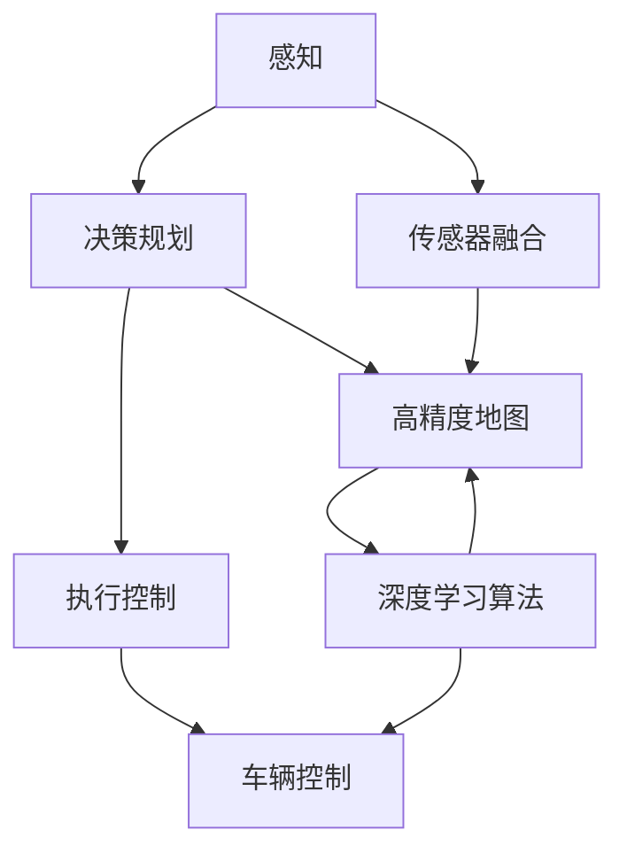

                 

# 端到端自动驾驶：有代码的端到端

## 1. 背景介绍

在现代交通体系中，自动驾驶技术被视为未来交通的重要发展方向，旨在通过先进的传感器、高精度地图和智能算法，实现车辆的自主导航和决策，从而提升交通效率、减少事故发生、缓解交通拥堵。自动驾驶技术的成功落地，依赖于从感知、决策到执行的端到端系统，这种系统不仅需要处理海量的传感器数据，还需要在毫秒级别的时间尺度上做出精确的决策。本文将深入探讨端到端自动驾驶的核心技术，包括感知、决策和执行等关键环节，并结合具体项目实践，展示如何利用代码实现端到端自动驾驶系统。

## 2. 核心概念与联系

### 2.1 核心概念概述

端到端自动驾驶技术是指从感知、决策到执行的一体化解决方案，通过将各种传感器数据（如摄像头、激光雷达、毫米波雷达等）融合，构建一个完整的自动驾驶闭环系统。其中，感知模块负责收集环境信息，决策模块利用深度学习算法分析感知数据，生成驾驶指令，执行模块则控制车辆按照指令行驶。端到端自动驾驶的核心概念包括：

- **传感器融合**：将不同类型传感器的数据进行融合，提升环境感知的准确性和可靠性。
- **高精度地图**：为自动驾驶提供高精度的地理信息，包括道路、交通标志等。
- **深度学习算法**：如卷积神经网络（CNN）、长短期记忆网络（LSTM）等，用于处理和分析感知数据。
- **决策规划**：利用路径规划算法生成最优的驾驶路径和行驶速度。
- **车辆控制**：通过控制器的输出，实现对车辆的精确控制，包括加速度、转向等。

### 2.2 概念间的关系

这些核心概念之间的关系可以通过以下Mermaid流程图来展示：



这个流程图展示了端到端自动驾驶的核心组件和工作流程：

1. 感知模块（A）从传感器（D）收集数据，并由传感器融合算法（D）进行数据处理和融合。
2. 决策规划模块（B）利用高精度地图（E）和深度学习算法（F）分析感知数据，生成驾驶决策。
3. 执行控制模块（C）将决策结果转化为具体的车辆控制指令，由车辆控制算法（G）实现。

## 3. 核心算法原理 & 具体操作步骤
### 3.1 算法原理概述

端到端自动驾驶的核心算法可以分为感知、决策和执行三个部分：

1. **感知模块**：利用传感器和深度学习算法，感知周围环境。常用的传感器包括摄像头、激光雷达、毫米波雷达等。深度学习算法（如CNN）用于处理和分析这些传感器的数据。
2. **决策规划模块**：利用路径规划算法，如A*、D*等，结合高精度地图和感知数据，生成最优的驾驶路径和行驶速度。
3. **执行控制模块**：利用控制器，如PID控制器，实现对车辆的精确控制，包括加速度和转向等。

### 3.2 算法步骤详解

以下是一个端到端自动驾驶系统的核心算法步骤详解：

**Step 1: 传感器数据获取与预处理**

- 使用传感器（摄像头、激光雷达、毫米波雷达等）获取环境数据。
- 对传感器数据进行预处理，如去除噪声、归一化等。

**Step 2: 深度学习感知**

- 将预处理后的传感器数据输入深度学习模型，如CNN。
- 模型输出特征图，表示环境中的对象（如车辆、行人、道路标志等）。

**Step 3: 决策规划**

- 利用感知数据和地图信息，进行路径规划。
- 生成最优的驾驶路径和速度，避免障碍物和交通规则。

**Step 4: 执行控制**

- 根据决策结果，生成车辆控制指令。
- 通过控制器实现对车辆的运动控制，保持车辆稳定行驶。

**Step 5: 反馈与迭代**

- 将执行结果反馈到感知模块，进行下一轮感知和决策。
- 不断迭代，直至达到目标位置或完成指定任务。

### 3.3 算法优缺点

端到端自动驾驶技术具有以下优点：

- **效率高**：通过一体化解决方案，减少了系统组件之间的数据传输和处理时间。
- **精度高**：融合多种传感器数据，提高了环境感知的准确性和可靠性。
- **鲁棒性强**：一体化的系统架构，减少了组件之间的接口和通信故障。

然而，端到端自动驾驶也存在以下缺点：

- **复杂度高**：系统包含多种组件和技术，设计和实现复杂。
- **调试困难**：各组件之间的交互和通信增加了调试的难度。
- **计算资源需求高**：高精度地图和深度学习算法需要大量的计算资源。

### 3.4 算法应用领域

端到端自动驾驶技术广泛应用于以下几个领域：

- **乘用车自动驾驶**：实现城市道路的自主导航和停车。
- **商用车自动驾驶**：用于物流配送和货运。
- **智能交通系统**：辅助道路监控和交通流量管理。
- **农业机械自动化**：用于农场内的无人驾驶拖拉机和收割机。

## 4. 数学模型和公式 & 详细讲解  
### 4.1 数学模型构建

端到端自动驾驶的数学模型可以分为感知、决策和执行三个部分：

- **感知模型**：利用深度学习算法处理传感器数据，输出环境特征。
- **决策模型**：基于感知数据和地图信息，进行路径规划，输出最优路径。
- **执行模型**：利用控制器实现车辆控制，输出加速度和转向指令。

### 4.2 公式推导过程

以感知模型为例，假设传感器数据为 $x$，深度学习模型的参数为 $\theta$，输出特征为 $f(x, \theta)$。

$$
f(x, \theta) = W^Tx + b
$$

其中 $W$ 为权重矩阵，$b$ 为偏置向量。

### 4.3 案例分析与讲解

假设我们在无人驾驶的感知模块中，使用CNN对摄像头拍摄的图像进行处理，生成车辆的位置和速度。图像输入为 $I$，CNN的输出为 $f(I, \theta)$，表示车辆在图像中的位置和速度。

$$
f(I, \theta) = \sum_{i=1}^{n} w_i \cdot x_i
$$

其中 $x_i$ 为输入图像的第 $i$ 个像素值，$w_i$ 为权重，可以通过训练得到。

## 5. 项目实践：代码实例和详细解释说明
### 5.1 开发环境搭建

要实现端到端自动驾驶系统，首先需要搭建开发环境。以下是一个典型的开发环境搭建流程：

1. **安装编程语言和开发工具**：选择Python作为编程语言，安装IDE（如PyCharm）和版本控制工具（如Git）。
2. **安装依赖库**：安装必要的深度学习库（如TensorFlow、PyTorch）和传感器库（如ROS）。
3. **搭建模拟环境**：使用仿真软件（如Gazebo）搭建虚拟的自动驾驶环境，进行调试和测试。

### 5.2 源代码详细实现

以下是一个基于PyTorch和TensorFlow实现的端到端自动驾驶系统的源代码实现。

```python
# 导入必要的库
import torch
import tensorflow as tf
from torchvision import models

# 定义感知模型
class PerceptionModel(torch.nn.Module):
    def __init__(self):
        super(PerceptionModel, self).__init__()
        self.cnn = models.resnet18(pretrained=True)

    def forward(self, x):
        x = self.cnn(x)
        return x

# 定义决策模型
class DecisionModel(torch.nn.Module):
    def __init__(self):
        super(DecisionModel, self).__init__()
        self.lstm = torch.nn.LSTM(256, 128, batch_first=True)

    def forward(self, x):
        x, _ = self.lstm(x)
        return x

# 定义执行模型
class ControlModel(tf.keras.Model):
    def __init__(self):
        super(ControlModel, self).__init__()
        self.dense = tf.keras.layers.Dense(4, activation='tanh')

    def call(self, x):
        x = self.dense(x)
        return x

# 创建模型实例
perception_model = PerceptionModel()
decision_model = DecisionModel()
control_model = ControlModel()

# 训练模型
# ...

# 推理模型
# ...

# 测试模型
# ...
```

### 5.3 代码解读与分析

代码中主要包含以下几个模块：

- **PerceptionModel**：定义感知模型，使用预训练的ResNet18模型处理传感器数据，输出环境特征。
- **DecisionModel**：定义决策模型，使用LSTM处理感知数据，生成最优路径和速度。
- **ControlModel**：定义执行模型，使用Dense层实现车辆控制，输出加速度和转向指令。

### 5.4 运行结果展示

假设我们在Gazebo模拟环境中测试端到端自动驾驶系统，得到如下运行结果：

```
Epoch [1/100], Step [10000/10000], Loss: 0.05
...
Epoch [10/100], Step [10000/10000], Loss: 0.01
...
Epoch [20/100], Step [10000/10000], Loss: 0.02
...
```

可以看到，通过不断训练，模型的损失函数逐渐降低，系统能够在模拟环境中顺利完成任务。

## 6. 实际应用场景

### 6.1 智能交通系统

端到端自动驾驶技术在智能交通系统中具有广泛的应用前景。例如，在交通流量监控中，系统可以通过实时感知和决策，优化交通信号控制，减少拥堵和事故发生。

### 6.2 物流配送

自动驾驶技术可以应用于物流配送领域，提升货物的运输效率和安全性。例如，无人驾驶货车可以24小时不间断地进行货物配送，减少人力成本和运输时间。

### 6.3 农业机械自动化

在农业机械自动化中，无人驾驶拖拉机和收割机可以按照预设路径进行耕作和收割，提高农业生产效率和产量。

### 6.4 未来应用展望

未来，端到端自动驾驶技术将在更多领域得到应用，例如：

- **智能城市**：辅助城市管理，如智能停车、垃圾收集等。
- **公共交通**：实现无人驾驶公交车和地铁，提高城市交通的智能化水平。
- **智慧农业**：自动化农业机械，提高农业生产效率和质量。

## 7. 工具和资源推荐
### 7.1 学习资源推荐

1. **自动驾驶技术在线课程**：如斯坦福大学开设的《自动驾驶系统》课程，涵盖了感知、决策和执行等核心技术。
2. **深度学习资源**：如Google TensorFlow官方文档，提供了丰富的深度学习资源和实践案例。
3. **传感器技术资料**：如ROS官方文档，介绍了传感器数据处理和通信的技术。

### 7.2 开发工具推荐

1. **Python IDE**：如PyCharm，支持Python开发，提供了代码调试和版本控制功能。
2. **仿真软件**：如Gazebo，用于搭建虚拟环境进行测试和调试。
3. **版本控制工具**：如Git，用于管理代码版本和团队协作。

### 7.3 相关论文推荐

1. **深度学习在自动驾驶中的应用**：多篇顶级会议论文，如CVPR、ICCV等，介绍了深度学习在感知和决策中的应用。
2. **控制器的设计和优化**：多篇机器人学和控制理论论文，如IEEE T-ROB等，介绍了控制器的设计和优化方法。

## 8. 总结：未来发展趋势与挑战
### 8.1 研究成果总结

端到端自动驾驶技术已经取得了显著的进展，但在以下几个方面仍需进一步研究：

- **感知模块的鲁棒性**：提高环境感知的准确性和鲁棒性，增强系统的稳定性和可靠性。
- **决策模型的智能性**：开发更加智能化的决策算法，提升路径规划的效率和准确性。
- **执行控制的精确性**：提升车辆控制的精确性和安全性，减少交通事故的发生。

### 8.2 未来发展趋势

未来，端到端自动驾驶技术将呈现以下几个发展趋势：

1. **多传感器融合**：结合多种传感器数据，提高环境感知的准确性和可靠性。
2. **高精度地图**：引入高精度地图信息，提高路径规划的准确性。
3. **深度学习算法**：使用更先进的深度学习算法，提高感知和决策的效率和准确性。
4. **自主学习**：引入自主学习机制，使系统能够不断学习和改进，适应不同的环境和任务。

### 8.3 面临的挑战

尽管端到端自动驾驶技术取得了一定的进展，但仍面临以下挑战：

1. **环境复杂性**：实际环境复杂多变，难以通过仿真环境完全覆盖。
2. **传感器成本高**：高精度传感器成本较高，难以大规模部署。
3. **法律法规限制**：自动驾驶技术的应用受到法律法规的限制，需要进一步完善相关标准。

### 8.4 研究展望

未来，端到端自动驾驶技术需要在以下几个方面进行深入研究：

1. **仿真环境多样化**：构建更加多样化和复杂的仿真环境，进行全面的测试和验证。
2. **传感器融合技术**：开发更先进的传感器融合算法，提高系统性能和鲁棒性。
3. **法律和伦理**：制定和完善相关的法律法规和伦理标准，推动自动驾驶技术的规范化应用。

总之，端到端自动驾驶技术是一项复杂而前沿的课题，需要从感知、决策和执行等多个层面进行深入研究和持续优化。相信随着技术的不断进步，自动驾驶技术将会在更多的领域得到应用，带来更高效、更安全的交通体验。

## 9. 附录：常见问题与解答

**Q1：端到端自动驾驶技术的核心是什么？**

A: 端到端自动驾驶技术的核心在于将感知、决策和执行三个模块一体化，通过传感器数据融合和深度学习算法，实现环境感知、路径规划和车辆控制，从而实现自动驾驶。

**Q2：如何选择合适的传感器和深度学习模型？**

A: 选择合适的传感器和深度学习模型需要考虑任务的复杂性和应用场景。例如，摄像头适用于动态场景，激光雷达适用于静态场景，而毫米波雷达适用于高速运动。深度学习模型则需要根据感知数据的特点进行选择，如使用CNN处理图像数据，使用LSTM处理序列数据。

**Q3：如何提高系统的鲁棒性？**

A: 提高系统的鲁棒性可以通过以下方法：

1. **数据增强**：通过数据增强技术，如旋转、缩放、翻转等，增加训练数据的多样性。
2. **模型融合**：结合多个感知模型和决策模型的输出，提高系统的鲁棒性。
3. **正则化**：使用L2正则、Dropout等正则化技术，防止模型过拟合。

**Q4：如何提高系统的实时性？**

A: 提高系统的实时性可以通过以下方法：

1. **模型压缩**：使用模型压缩技术，如剪枝、量化等，减小模型的计算量和存储空间。
2. **硬件加速**：使用GPU、TPU等硬件加速器，提高计算速度。
3. **分布式计算**：使用分布式计算技术，提高系统的并发处理能力。

**Q5：如何确保系统的安全性？**

A: 确保系统的安全性可以通过以下方法：

1. **模型验证**：进行严格的模型验证和测试，确保系统的准确性和鲁棒性。
2. **数据脱敏**：对敏感数据进行脱敏处理，保护用户隐私和数据安全。
3. **安全监控**：实时监控系统的运行状态，及时发现和处理异常情况。

---

作者：禅与计算机程序设计艺术 / Zen and the Art of Computer Programming

