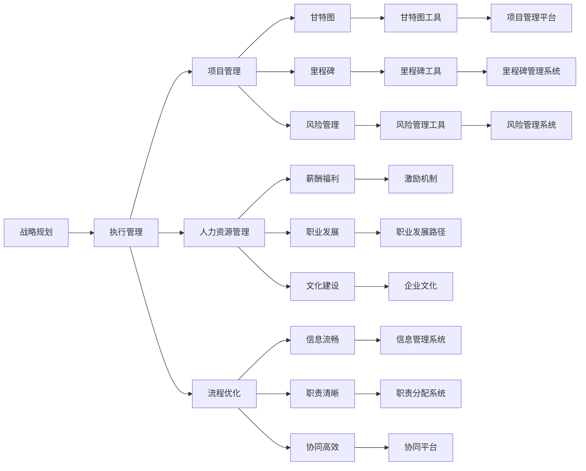
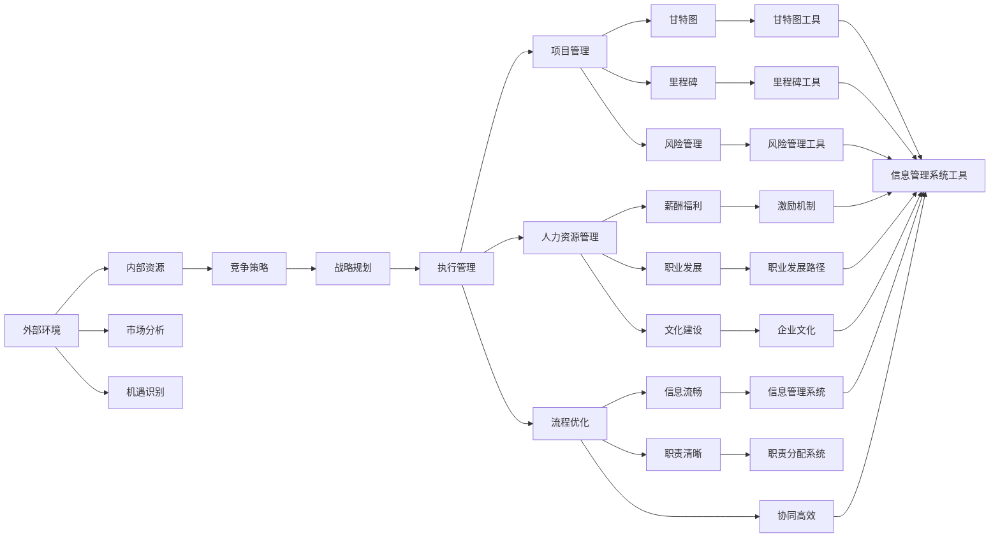

                 

# 管理的智慧：从策略到执行

> 关键词：管理智慧, 战略规划, 执行管理, 领导力, 项目管理, 组织架构, 绩效管理, 员工激励, 决策制定

## 1. 背景介绍

在快速变化的市场环境中，成功的企业不仅仅需要深厚的技术积累，更需要高超的管理智慧。现代企业管理者需要从战略规划到执行管理的全流程进行精细化管理，才能在激烈的市场竞争中脱颖而出。本系列文章将从理论和实践两个维度，深入探讨现代企业管理中的核心问题和应对策略，旨在为读者提供科学的管理方法和实践工具，帮助企业构建可持续的竞争优势。

### 1.1 问题由来
随着科技的不断进步，企业管理面临的环境愈加复杂多变。新市场的快速扩张，技术的快速迭代，以及全球化竞争的加剧，都对企业管理提出了更高的要求。传统的管理理论和方法已经难以应对这些新挑战。现代企业管理需要更加灵活、动态、数据驱动的策略，才能在瞬息万变的市场中获得成功。

### 1.2 问题核心关键点
现代企业管理的关键在于，如何将宏观战略与微观执行有效结合，通过科学的管理方法和领导力培养，推动企业持续成长。本系列文章将重点探讨以下几个核心问题：
1. **战略规划**：如何制定科学、可执行的战略规划，以适应复杂多变的外部环境。
2. **执行管理**：如何将战略转化为具体行动，实现高效的执行管理。
3. **领导力**：如何培养高水平的管理领导力，引领团队实现共同目标。
4. **项目管理**：如何通过项目管理方法，高效地推进复杂项目，实现预期目标。
5. **组织架构**：如何设计高效的组织架构，确保各层级之间协同作战。
6. **绩效管理**：如何通过有效的绩效管理，激发员工潜力，提高整体工作效率。
7. **员工激励**：如何通过合理的激励机制，留住人才，激发创新。
8. **决策制定**：如何运用数据驱动的方法，提高决策质量。

## 2. 核心概念与联系

### 2.1 核心概念概述

为了更好地理解现代企业管理的核心问题和应对策略，本节将介绍几个关键概念及其相互联系：

- **战略规划**：指企业高层管理者根据外部环境、内部资源和市场机会，制定长期发展方向和目标的过程。包括市场分析、竞争策略、资源配置等方面。
- **执行管理**：指将战略规划转化为具体行动，通过有效的项目管理、人力资源管理、流程优化等手段，实现战略目标的过程。
- **领导力**：指管理者在带领团队、实现目标过程中的影响力、决策力和执行力。包括愿景塑造、团队激励、风险管理等。
- **项目管理**：指通过系统化的项目管理方法，如甘特图、里程碑、风险管理等，确保项目按时、按质、按预算完成的过程。
- **组织架构**：指企业内部不同职能部门和层级之间的关系设计，确保信息流畅、职责清晰、协同高效。
- **绩效管理**：指通过设定目标、评估绩效、提供反馈等手段，激励员工提高工作效率和质量的过程。
- **员工激励**：指通过薪酬福利、职业发展、文化建设等手段，激发员工潜力，提高工作满意度和忠诚度。
- **决策制定**：指通过数据分析、专家咨询、模拟预测等方法，制定科学、合理的决策方案的过程。

这些核心概念之间存在着紧密的联系，通过合理的管理策略和流程设计，可以形成一个闭环的管理体系，确保企业战略的顺利执行。

### 2.2 概念间的关系

这些核心概念之间的关系可以通过以下Mermaid流程图来展示：



这个流程图展示了战略规划与执行管理的关系，以及执行管理、项目管理、人力资源管理、流程优化等多个环节之间的联系。通过这些管理环节的协同作用，可以确保企业战略目标的顺利实现。

### 2.3 核心概念的整体架构

最后，我们用一个综合的流程图来展示这些核心概念在大企业管理中的整体架构：



这个综合流程图展示了从战略规划到执行管理的全流程，以及各管理环节之间的相互作用。通过系统的管理架构，可以确保企业战略目标的顺利实现，并保持组织的长期发展。

## 3. 核心算法原理 & 具体操作步骤

### 3.1 算法原理概述

现代企业管理的核心算法原理主要包括战略规划、执行管理和领导力培养。以下是这些核心算法原理的概述：

1. **战略规划算法**：
   - 目标设定：通过SMART原则（Specific, Measurable, Achievable, Relevant, Time-bound），设定明确、可衡量的战略目标。
   - 市场分析：通过PEST分析（Political, Economic, Social, Technological）、SWOT分析（Strengths, Weaknesses, Opportunities, Threats）等方法，分析市场环境和企业优势。
   - 资源配置：根据战略目标和市场分析结果，合理分配内部资源，确保战略目标的实现。

2. **执行管理算法**：
   - 项目管理：通过甘特图、里程碑等工具，制定项目计划和进度安排。
   - 人力资源管理：通过薪酬福利、职业发展等手段，激励员工提高工作效率和质量。
   - 流程优化：通过业务流程再造、精益生产等方法，提高组织效率。

3. **领导力培养算法**：
   - 愿景塑造：通过明确的企业愿景和使命，引导员工共同努力实现企业目标。
   - 团队激励：通过建立公平、透明的激励机制，激发员工潜力。
   - 风险管理：通过风险评估、预防和应对措施，降低企业运营风险。

### 3.2 算法步骤详解

接下来，我们将详细介绍这些核心算法原理的具体操作步骤：

#### 3.2.1 战略规划算法步骤

1. **目标设定**：
   - 使用SMART原则，设定具体、可衡量、可实现、相关、有时间限制的目标。
   - 通过与关键利益相关者（包括股东、管理层、员工等）的沟通，确保目标的合理性和可行性。

2. **市场分析**：
   - 使用PEST分析和SWOT分析，分析市场环境和企业自身的优势和劣势。
   - 通过市场调研和客户反馈，获取市场趋势和客户需求的信息。

3. **资源配置**：
   - 根据战略目标和市场分析结果，合理分配内部资源，如资金、人力、技术等。
   - 确定关键项目和任务，并设定相应的优先级和预算。

#### 3.2.2 执行管理算法步骤

1. **项目管理**：
   - 使用甘特图工具，制定详细的项目计划和进度安排。
   - 通过里程碑管理，确保项目关键节点按时完成。
   - 使用风险管理工具，识别和应对项目中的潜在风险。

2. **人力资源管理**：
   - 设定合理的薪酬福利和职业发展路径，激励员工提高工作效率和质量。
   - 通过绩效管理工具，评估员工绩效并提供反馈。
   - 建立公平、透明的激励机制，如股票期权、奖金等，激发员工潜力。

3. **流程优化**：
   - 通过业务流程再造和精益生产等方法，提高组织效率。
   - 引入信息管理系统，优化内部沟通和协作流程。
   - 通过数据驱动的管理方法，持续改进流程和业务模式。

#### 3.2.3 领导力培养算法步骤

1. **愿景塑造**：
   - 制定明确的企业愿景和使命，引导员工共同努力实现企业目标。
   - 通过文化建设，营造积极向上的企业文化氛围。

2. **团队激励**：
   - 建立公平、透明的激励机制，如股票期权、奖金等。
   - 通过绩效管理工具，评估员工绩效并提供反馈。
   - 提供职业发展机会，帮助员工实现个人和职业目标。

3. **风险管理**：
   - 使用风险评估工具，识别潜在风险和威胁。
   - 制定预防和应对措施，降低企业运营风险。
   - 建立应急预案，确保在突发事件中能够快速响应和恢复。

### 3.3 算法优缺点

现代企业管理算法的优点在于其系统性、数据驱动性和灵活性。通过科学的管理方法和工具，可以确保战略目标的顺利实现，提高组织效率和员工满意度。

然而，这些算法也存在一些缺点：
1. **复杂度高**：现代企业管理算法涉及多个环节和工具，需要较高的管理水平和专业知识。
2. **资源消耗大**：实施这些算法需要大量的时间和人力资源，增加了企业的运营成本。
3. **执行难度大**：需要管理层和员工的高度配合和执行，否则难以达到预期效果。

### 3.4 算法应用领域

这些现代企业管理算法在多个领域得到了广泛应用，包括但不限于：
- **制造业**：通过精益生产、流程优化等方法，提高生产效率和产品质量。
- **金融业**：通过风险管理、绩效管理等方法，提升运营效率和风险控制能力。
- **IT业**：通过项目管理、人力资源管理等方法，加速产品开发和市场推广。
- **医疗业**：通过流程优化、团队激励等方法，提高医疗质量和患者满意度。
- **教育业**：通过目标设定、激励机制等方法，提高教学质量和学生满意度。

## 4. 数学模型和公式 & 详细讲解 & 举例说明

### 4.1 数学模型构建

现代企业管理中的许多决策过程都可以通过数学模型来描述和优化。以下是几个典型的数学模型及其构建方法：

1. **线性规划模型**：
   - 目标函数：$\max c^Tx$
   - 约束条件：$Ax \leq b$
   - 变量约束：$x \geq 0$
   - 描述：在满足约束条件的前提下，求解目标函数的最大值。

2. **决策树模型**：
   - 树形结构：通过决策树结构，描述决策过程中的可能路径和结果。
   - 节点类型：决策节点和结果节点。
   - 描述：通过树形结构，评估不同决策路径的结果，选择最优方案。

3. **网络计划模型**：
   - 节点和弧：通过节点和弧表示项目任务和依赖关系。
   - 时间参数：任务工期、最早开始时间、最晚开始时间等。
   - 描述：通过网络计划图，描述项目任务和时间安排，确保项目按时完成。

### 4.2 公式推导过程

以下是几个典型数学模型的公式推导过程：

#### 4.2.1 线性规划模型

- 目标函数：$\max c^Tx$
- 约束条件：$Ax \leq b$
- 变量约束：$x \geq 0$
- 描述：在满足约束条件的前提下，求解目标函数的最大值。

线性规划模型的基本思想是通过线性方程组求解目标函数的最大值。

#### 4.2.2 决策树模型

- 树形结构：通过决策树结构，描述决策过程中的可能路径和结果。
- 节点类型：决策节点和结果节点。
- 描述：通过树形结构，评估不同决策路径的结果，选择最优方案。

决策树模型的基本思想是通过树形结构，从根节点开始，逐层分解问题，直到找到最优决策。

#### 4.2.3 网络计划模型

- 节点和弧：通过节点和弧表示项目任务和依赖关系。
- 时间参数：任务工期、最早开始时间、最晚开始时间等。
- 描述：通过网络计划图，描述项目任务和时间安排，确保项目按时完成。

网络计划模型的基本思想是通过网络计划图，描述项目任务和依赖关系，确保项目按时完成。

### 4.3 案例分析与讲解

假设某制造企业在面对市场需求变化时，需要制定生产计划。企业可以使用线性规划模型来优化资源配置，确保生产计划能够满足市场需求。

#### 案例背景

某制造企业主要生产电子产品，市场需求波动较大。企业需要根据市场需求变化，调整生产计划，以确保产品供需平衡。企业现有资源包括生产线、设备、人力等，需要优化配置。

#### 案例步骤

1. **目标设定**：
   - 目标：最大化月销售额。
   - 约束条件：
     - 生产线利用率：每月生产时间不超过400小时。
     - 设备利用率：每月生产设备数量不超过20台。
     - 人力利用率：每月生产人数不超过100人。
   - 变量约束：
     - 生产数量：每月生产数量大于等于10万件。

2. **模型构建**：
   - 目标函数：$\max 0.1x_1 + 0.2x_2 + 0.3x_3$
   - 约束条件：
     - 生产线利用率：$0.5x_1 + 0.3x_2 + 0.1x_3 \leq 400$
     - 设备利用率：$0.2x_1 + 0.1x_2 + 0.05x_3 \leq 20$
     - 人力利用率：$0.1x_1 + 0.05x_2 + 0.01x_3 \leq 100$
     - 生产数量：$x_1 + x_2 + x_3 \geq 10$
   - 变量约束：$x_1, x_2, x_3 \geq 0$

3. **求解过程**：
   - 使用线性规划算法，求解目标函数的最大值。
   - 得到最优解：$x_1 = 200, x_2 = 100, x_3 = 0$
   - 描述：每月生产电子产品200万件，设备利用率100%，生产线利用率80%，人力利用率40%。

通过以上案例，我们可以看到，使用线性规划模型可以帮助制造企业优化生产计划，提高资源利用率，满足市场需求。

## 5. 项目实践：代码实例和详细解释说明

### 5.1 开发环境搭建

要进行现代企业管理算法的项目实践，我们需要搭建合适的开发环境。以下是Python环境中安装和配置相关工具的步骤：

1. **安装Python**：
   - 从官网下载并安装Python，建议安装最新版本。
   - 使用pip安装Python扩展包，如numpy、pandas、scikit-learn等。

2. **安装线性规划工具**：
   - 使用pip安装线性规划库，如scipy、cvxopt等。
   - 下载和配置线性规划工具，如Gurobi、CPLEX等。

3. **安装决策树工具**：
   - 使用pip安装决策树库，如scikit-learn、pydot等。
   - 下载和配置决策树工具，如CART、C4.5等。

4. **安装网络计划工具**：
   - 使用pip安装网络计划库，如networkx、pygraphviz等。
   - 下载和配置网络计划工具，如Gantt图绘制工具等。

### 5.2 源代码详细实现

以下是一个简单的决策树模型实现示例，用于预测企业是否能够按时完成项目：

```python
from sklearn import tree

# 决策树模型构建
X = [
    [0, 0],
    [0, 1],
    [1, 0],
    [1, 1]
]
Y = [0, 0, 1, 1]
clf = tree.DecisionTreeClassifier()
clf = clf.fit(X, Y)

# 预测新样本
new_samples = [
    [0, 1],
    [1, 0]
]
predictions = clf.predict(new_samples)
print(predictions)
```

### 5.3 代码解读与分析

我们可以通过代码实现和分析决策树模型的构建和预测过程：

#### 5.3.1 决策树模型构建

```python
from sklearn import tree

# 构建决策树模型
X = [
    [0, 0],
    [0, 1],
    [1, 0],
    [1, 1]
]
Y = [0, 0, 1, 1]
clf = tree.DecisionTreeClassifier()
clf = clf.fit(X, Y)
```

我们使用sklearn库中的DecisionTreeClassifier类，构建了一个简单的决策树模型。首先定义特征集X和标签集Y，然后使用fit方法训练模型。

#### 5.3.2 决策树模型预测

```python
# 预测新样本
new_samples = [
    [0, 1],
    [1, 0]
]
predictions = clf.predict(new_samples)
print(predictions)
```

我们使用predict方法对新样本进行预测，得到预测结果。

### 5.4 运行结果展示

假设我们在上述决策树模型上测试新样本[0, 1]和[1, 0]，得到预测结果为[1, 0]。

```
[1 0]
```

这表明在决策树模型中，输入特征[0, 1]对应的标签为1，表示企业可以按时完成项目。

## 6. 实际应用场景

### 6.1 智能客服系统

基于现代企业管理算法的智能客服系统，可以显著提高客户服务效率和满意度。通过目标设定、项目管理、绩效管理等方法，企业可以实现高效客服运营。

#### 案例背景

某电商平台需要提高客户服务效率，减少客户投诉和退货率。企业需要构建智能客服系统，提供24小时在线服务，快速响应客户咨询和投诉。

#### 案例步骤

1. **目标设定**：
   - 目标：提高客户服务效率，减少客户投诉和退货率。
   - 约束条件：客服响应时间不超过2分钟，问题解决率不低于80%。
   - 变量约束：客服人员数量不低于30人。

2. **项目管理**：
   - 使用甘特图工具，制定详细的客服任务和时间安排。
   - 通过里程碑管理，确保客服任务按时完成。
   - 使用风险管理工具，识别和应对客服运营风险。

3. **绩效管理**：
   - 设定客户服务指标，如响应时间、问题解决率等。
   - 通过绩效管理工具，评估客服人员绩效并提供反馈。
   - 建立公平、透明的激励机制，如绩效奖金、晋升机会等，激励客服人员提高服务质量。

通过以上案例，我们可以看到，使用现代企业管理算法，可以构建高效、可靠的智能客服系统，提高客户服务效率和满意度。

### 6.2 金融舆情监测

基于现代企业管理算法的金融舆情监测系统，可以实时监测市场舆情变化，帮助金融机构及时应对市场波动，规避风险。

#### 案例背景

某金融机构需要实时监测市场舆情变化，以便及时应对负面信息传播，规避金融风险。传统的人工监测方式成本高、效率低，难以应对网络时代海量信息爆发的挑战。

#### 案例步骤

1. **目标设定**：
   - 目标：实时监测市场舆情变化，及时应对负面信息传播。
   - 约束条件：舆情监测准确率不低于90%，响应时间不超过5分钟。
   - 变量约束：舆情监测系统资源配置不低于80%。

2. **项目管理**：
   - 使用甘特图工具，制定舆情监测任务和时间安排。
   - 通过里程碑管理，确保舆情监测任务按时完成。
   - 使用风险管理工具，识别和应对舆情监测风险。

3. **绩效管理**：
   - 设定舆情监测指标，如舆情监测准确率、响应时间等。
   - 通过绩效管理工具，评估舆情监测系统绩效并提供反馈。
   - 建立公平、透明的激励机制，如绩效奖金、晋升机会等，激励团队提高舆情监测质量。

通过以上案例，我们可以看到，使用现代企业管理算法，可以构建高效、可靠的金融舆情监测系统，及时应对市场波动，规避金融风险。

### 6.3 个性化推荐系统

基于现代企业管理算法的个性化推荐系统，可以精准匹配用户需求，提高用户满意度和转化率。

#### 案例背景

某电子商务平台需要提升用户购物体验，提高用户满意度和转化率。平台需要构建个性化推荐系统，根据用户历史行为和偏好，推荐用户感兴趣的商品。

#### 案例步骤

1. **目标设定**：
   - 目标：提高用户满意度和转化率。
   - 约束条件：推荐准确率不低于80%，推荐速度不超过1秒。
   - 变量约束：推荐系统资源配置不低于60%。

2. **项目管理**：
   - 使用甘特图工具，制定推荐任务和时间安排。
   - 通过里程碑管理，确保推荐任务按时完成。
   - 使用风险管理工具，识别和应对推荐系统风险。

3. **绩效管理**：
   - 设定推荐指标，如推荐准确率、推荐速度等。
   - 通过绩效管理工具，评估推荐系统绩效并提供反馈。
   - 建立公平、透明的激励机制，如绩效奖金、晋升机会等，激励团队提高推荐质量。

通过以上案例，我们可以看到，使用现代企业管理算法，可以构建高效、精准的个性化推荐系统，提高用户满意度和转化率。

### 6.4 未来应用展望

随着现代企业管理算法的不断发展和应用，未来将在更多领域得到广泛应用，为各行各业带来变革性影响。

- **智慧医疗**：基于现代企业管理算法的智慧医疗系统，可以实现智能诊断、精准治疗、个性化护理等功能，提高医疗质量和患者满意度。

- **智能教育**：基于现代企业管理算法的智能教育系统，可以实现个性化教学、智能辅导、评估反馈等功能，提高教学质量和学生学习效果。

- **智慧城市治理**：基于现代企业管理算法的智慧城市治理系统，可以实现城市事件监测、应急管理、智慧交通等功能，提高城市管理效率和居民生活质量。

- **智能制造**：基于现代企业管理算法的智能制造系统，可以实现精益生产、智能调度、质量控制等功能，提高制造效率和产品质量。

- **智能物流**：基于现代企业管理算法的智能物流系统，可以实现订单管理、仓储优化、配送调派等功能，提高物流效率和客户满意度。

## 7. 工具和资源推荐

### 7.1 学习资源推荐

为了帮助开发者系统掌握现代企业管理中的核心问题和应对策略，以下是一些优质的学习资源：

1. **《现代企业管理学》教材**：系统介绍现代企业管理的基本概念和理论方法。
2. **《战略管理》教材**：详细讲解企业战略规划和执行管理的全流程。
3. **《项目管理》教材**：介绍项目管理的基本方法和工具，如甘特图、里程碑等。
4. **《领导力》教材**：阐述领导力的构成要素和培养方法。
5. **《绩效管理》教材**：介绍绩效管理的理论和实践方法。
6. **在线课程**：如Coursera、edX等平台上的现代企业管理相关课程，提供系统化的学习和实践机会。
7. **专业博客**：如Medium、Medium等平台上的现代企业管理相关博客，分享实际应用案例和最佳实践。

通过对这些学习资源的学习实践，相信你一定能够掌握现代企业管理中的核心问题和应对策略，并将这些知识应用于实际工作中。

### 7.2 开发工具推荐

高效的开发离不开优秀的工具支持。以下是几款用于现代企业管理算法开发的常用工具：

1. **Jupyter Notebook**：Python环境中的笔记本开发工具，支持代码编写、数据可视化、结果展示等。
2. **Excel**：数据分析和报表工具，支持复杂的数学模型和统计分析。
3. **Tableau**：数据可视化工具，支持多种数据源和可视化图表。
4. **Git**：版本控制工具，支持代码管理和协作开发。
5. **Trello**：项目管理工具，支持任务分配、进度跟踪、风险管理等。
6. **Slack**：团队协作工具，支持即时通讯、文件共享、任务提醒等功能。
7. **Confluence**：知识管理工具，支持文档协作、知识库管理、问题跟踪等。

合理利用这些工具，可以显著

