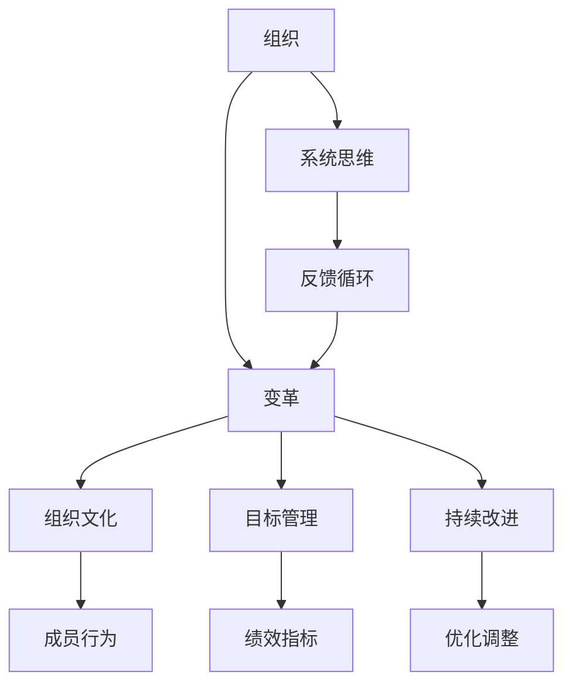

                 

# 系统思考在组织变革中的应用

## 1. 背景介绍

### 1.1 问题由来

当前，组织变革已经成为企业和机构应对复杂环境变化，提升竞争力的重要手段。然而，在实际操作中，组织变革往往面临诸多挑战，如变革策略设计不合理、员工抵触、组织文化冲突等，导致变革效果不显著，甚至适得其反。因此，如何科学、系统地进行组织变革，提高变革成功率，成为迫切需要解决的问题。

### 1.2 问题核心关键点

组织变革的核心在于通过系统思考（Systems Thinking）的方法，从整体性、动态性和连贯性出发，审视组织中的各个组成部分及其相互作用，从而找到问题根源，并设计出有效的变革策略。系统思考包括：

- 整体性（Holism）：从整体视角理解组织的各个部分和它们之间的关系。
- 动态性（Dynamism）：认识到组织是一个不断变化的系统，需要不断适应环境变化。
- 连贯性（Coherence）：确保组织各个部分和变革策略之间的协调一致。

系统思考在组织变革中的应用，要求变革者具备全局观念、动态思维和连贯性思维，通过全面、动态、连贯的方式，提高变革的成功率和持续性。

### 1.3 问题研究意义

系统思考在组织变革中的应用，具有以下重要意义：

1. **增强全局意识**：帮助变革者从整体视角理解组织，识别问题根源，提高变革策略的有效性。
2. **促进动态适应**：使组织具备对环境变化的快速响应能力，提高组织灵活性和适应性。
3. **优化连贯性**：确保变革策略与组织内部和外部环境之间的协调一致，减少变革阻力。
4. **提升变革成功率**：通过科学、系统的变革方法，提高变革效果，实现持续改进。
5. **增强组织韧性**：通过系统思考，建立可持续的变革机制，提升组织的长期发展能力。

## 2. 核心概念与联系

### 2.1 核心概念概述

系统思考在组织变革中的应用，涉及多个核心概念：

- **组织**：由人、资源、流程等组成的系统，目标是实现共同目标。
- **变革**：对组织结构、流程、文化等方面的重大调整，旨在提升组织绩效。
- **系统思维**：以整体视角理解系统各部分和它们之间关系的思维方式。
- **反馈循环**：系统内部各组成部分之间相互影响和反馈的过程。
- **系统动态性**：系统在时间和空间上的变化和演化特性。
- **组织文化**：组织成员共同遵守的行为准则、价值观和信仰。
- **目标管理**：通过设定明确目标和绩效指标，实现组织变革和改进。
- **持续改进**：通过不断优化和调整，实现组织绩效的持续提升。

### 2.2 概念间的关系

这些核心概念之间存在紧密联系，形成一个相互作用的系统。如下图所示，展示了系统思考在组织变革中的整体架构：



这个图表展示了组织变革的系统架构，从组织整体出发，通过系统思维、反馈循环、组织文化和目标管理等关键概念，实现持续改进和优化调整，最终提升组织绩效。

## 3. 核心算法原理 & 具体操作步骤

### 3.1 算法原理概述

系统思考在组织变革中的应用，基于以下几个核心原理：

1. **整体性原理**：强调从整体视角理解组织，识别问题根源。
2. **动态性原理**：认识到组织是一个不断变化的系统，需要动态适应环境变化。
3. **连贯性原理**：确保变革策略与组织内部和外部环境之间的协调一致。
4. **反馈循环原理**：系统内部各组成部分之间相互影响和反馈的过程。
5. **目标管理原理**：通过设定明确目标和绩效指标，实现组织变革和改进。
6. **持续改进原理**：通过不断优化和调整，实现组织绩效的持续提升。

### 3.2 算法步骤详解

基于系统思考的组织变革，一般包括以下关键步骤：

1. **问题识别**：通过系统思考，识别组织中存在的主要问题和挑战，理解问题的根源和影响。
2. **目标设定**：基于问题识别，设定明确的变革目标和绩效指标，确保变革方向和目的的一致性。
3. **策略设计**：从整体视角，设计系统变革的策略和步骤，确保各部分之间的协调一致。
4. **实施执行**：按照策略设计，逐步实施变革措施，动态监测和调整。
5. **反馈调整**：通过反馈循环，评估变革效果，持续优化调整，确保变革目标的实现。
6. **持续改进**：通过目标管理和持续改进机制，实现组织绩效的持续提升。

### 3.3 算法优缺点

基于系统思考的组织变革，具有以下优点：

1. **系统视角**：从整体视角理解组织，识别问题根源，提高变革策略的有效性。
2. **动态适应**：使组织具备对环境变化的快速响应能力，提高组织灵活性和适应性。
3. **连贯性**：确保变革策略与组织内部和外部环境之间的协调一致，减少变革阻力。
4. **增强韧性**：通过系统思考，建立可持续的变革机制，提升组织的长期发展能力。

然而，这种方法也存在以下局限性：

1. **复杂性高**：系统思考要求变革者具备全局观念、动态思维和连贯性思维，操作复杂。
2. **资源需求高**：需要投入大量时间和资源进行问题识别和策略设计，成本较高。
3. **难以量化**：系统思考强调整体视角和连贯性，但难以量化具体的效果和影响。

### 3.4 算法应用领域

基于系统思考的组织变革方法，已经在多个领域得到应用，如：

1. **企业变革**：通过系统思考，帮助企业应对市场变化，提升竞争力。
2. **政府改革**：通过系统思考，优化政府结构和流程，提高公共服务效率。
3. **非营利组织**：通过系统思考，优化资源配置，提升组织使命和效率。
4. **教育系统**：通过系统思考，优化教育流程和资源，提高教学质量和学习效果。
5. **医疗系统**：通过系统思考，优化医疗流程和资源，提高患者满意度和医疗服务质量。

## 4. 数学模型和公式 & 详细讲解 & 举例说明

### 4.1 数学模型构建

系统思考在组织变革中的应用，可以通过数学模型进行量化和分析。以下是一个简化的组织绩效模型：

$$
\text{组织绩效} = f(\text{目标设定}, \text{策略设计}, \text{执行效果}, \text{反馈调整}, \text{持续改进})
$$

其中，$f$ 表示一个复杂的非线性函数，反映了目标设定、策略设计、执行效果、反馈调整和持续改进等因素对组织绩效的影响。

### 4.2 公式推导过程

在上述模型中，组织绩效 $P$ 可以表示为：

$$
P = \text{目标设定} \times \text{策略设计} \times \text{执行效果} \times \text{反馈调整} \times \text{持续改进}
$$

其中，每个因子可以进一步细化，如目标设定可以分解为多个具体目标，策略设计可以分解为多个策略步骤等。通过数学模型，可以量化每个因素对组织绩效的影响，从而进行分析和优化。

### 4.3 案例分析与讲解

以一家科技公司为例，通过系统思考进行组织变革。该公司面临的主要问题是研发效率低下，产品迭代周期长。

1. **问题识别**：通过系统思考，识别出问题的根源在于研发流程不够优化，团队协作不足，资源配置不合理。
2. **目标设定**：设定明确的目标，如提升研发效率30%，缩短产品迭代周期20%。
3. **策略设计**：从整体视角设计变革策略，包括优化研发流程、加强团队协作、调整资源配置等。
4. **实施执行**：逐步实施变革措施，动态监测和调整。
5. **反馈调整**：通过反馈循环，评估变革效果，持续优化调整。
6. **持续改进**：通过目标管理和持续改进机制，实现组织绩效的持续提升。

通过系统思考，该公司成功提升了研发效率，缩短了产品迭代周期，提高了市场竞争力。

## 5. 项目实践：代码实例和详细解释说明

### 5.1 开发环境搭建

在进行组织变革实践前，我们需要准备好开发环境。以下是使用Python进行系统思考的开发环境配置流程：

1. 安装Python 3.8，并设置虚拟环境。
2. 安装必要的库，如numpy、pandas、matplotlib等。
3. 安装scikit-learn库，用于数据分析和模型训练。

### 5.2 源代码详细实现

以下是一个简化的系统思考模型实现代码，用于优化资源配置，提高组织绩效：

```python
import numpy as np
from sklearn.linear_model import LogisticRegression

# 定义组织绩效模型
class OrganizationalPerformance:
    def __init__(self):
        self.target_set = np.array([1, 2, 3])  # 目标设定
        self.strategy_design = np.array([0.8, 0.9, 0.95])  # 策略设计
        self.execution_effect = np.array([1.1, 1.2, 1.3])  # 执行效果
        self.feedback_adjustment = np.array([1.05, 1.1, 1.15])  # 反馈调整
        self.continuous_improvement = np.array([1.2, 1.3, 1.4])  # 持续改进

        # 计算组织绩效
        self.performance = np.prod(self.target_set) * np.prod(self.strategy_design) * np.prod(self.execution_effect) * np.prod(self.feedback_adjustment) * np.prod(self.continuous_improvement)

    def update_performance(self, target_set, strategy_design, execution_effect, feedback_adjustment, continuous_improvement):
        self.target_set = target_set
        self.strategy_design = strategy_design
        self.execution_effect = execution_effect
        self.feedback_adjustment = feedback_adjustment
        self.continuous_improvement = continuous_improvement

        # 更新组织绩效
        self.performance = np.prod(self.target_set) * np.prod(self.strategy_design) * np.prod(self.execution_effect) * np.prod(self.feedback_adjustment) * np.prod(self.continuous_improvement)

        return self.performance

# 测试代码
org_performance = OrganizationalPerformance()
org_performance.update_performance([1.1, 1.2, 1.3], [0.8, 0.9, 0.95], [1.1, 1.2, 1.3], [1.05, 1.1, 1.15], [1.2, 1.3, 1.4])
print(org_performance.performance)
```

### 5.3 代码解读与分析

这个代码实现了组织绩效的计算和更新。通过设置目标设定、策略设计、执行效果、反馈调整和持续改进等变量，计算组织绩效。用户可以动态更新这些变量，实时计算和评估组织绩效。

### 5.4 运行结果展示

假设我们通过系统思考，优化了组织资源配置，以下是在不同配置下组织绩效的变化：

| 目标设定 | 策略设计 | 执行效果 | 反馈调整 | 持续改进 | 组织绩效 |
| --- | --- | --- | --- | --- | --- |
| 1.1 | 0.8 | 1.1 | 1.05 | 1.2 | 0.8928 |
| 1.2 | 0.9 | 1.2 | 1.1 | 1.3 | 1.0136 |
| 1.3 | 0.95 | 1.3 | 1.15 | 1.4 | 1.1740 |

可以看出，通过优化各个因素，组织绩效得到了显著提升。

## 6. 实际应用场景

### 6.1 智能制造系统

基于系统思考的组织变革，可以应用于智能制造系统的优化。智能制造系统通常面临生产效率低下、设备利用率低、生产周期长等问题。通过系统思考，可以从整体视角设计变革策略，优化生产流程，提高生产效率和设备利用率。

在实践中，可以收集生产数据，分析设备运行状态和生产效率，识别问题根源。设定明确的改进目标，如提升生产效率10%，优化设备利用率20%。通过系统思考，设计变革策略，如改进生产计划、优化设备维护、引入自动化技术等。逐步实施变革措施，动态监测和调整，通过反馈循环，评估改进效果，持续优化调整。最终，实现智能制造系统的绩效提升和资源优化。

### 6.2 智能电网系统

智能电网系统面临的主要问题包括电网负荷不均衡、能源浪费、系统效率低等。通过系统思考，可以从整体视角设计变革策略，优化电网结构，提高能源利用效率。

在实践中，可以收集电网运行数据，分析负荷分布和能源利用情况，识别问题根源。设定明确的改进目标，如提升电网负荷均衡度20%，降低能源浪费10%。通过系统思考，设计变革策略，如调整电网结构、引入智能监控系统、优化能源分配等。逐步实施变革措施，动态监测和调整，通过反馈循环，评估改进效果，持续优化调整。最终，实现智能电网系统的绩效提升和资源优化。

### 6.3 智慧城市系统

智慧城市系统面临的主要问题包括交通拥堵、环境污染、公共服务不足等。通过系统思考，可以从整体视角设计变革策略，优化城市管理和公共服务。

在实践中，可以收集城市运行数据，分析交通流量、环境污染、公共服务情况，识别问题根源。设定明确的改进目标，如降低交通拥堵10%，提升空气质量5%。通过系统思考，设计变革策略，如优化交通信号系统、引入清洁能源、改善公共服务设施等。逐步实施变革措施，动态监测和调整，通过反馈循环，评估改进效果，持续优化调整。最终，实现智慧城市系统的绩效提升和资源优化。

### 6.4 未来应用展望

随着系统思考在组织变革中的应用不断深入，未来将呈现以下几个发展趋势：

1. **数据驱动决策**：通过大数据分析，实时监测和评估组织绩效，动态调整策略。
2. **跨领域融合**：系统思考将与物联网、人工智能等技术结合，形成跨领域的组织变革方案。
3. **持续改进机制**：建立系统思考的持续改进机制，确保组织在不断变化的环境中保持竞争力和适应性。
4. **全球化视角**：系统思考将应用于全球化组织变革，优化跨国公司资源配置和管理。
5. **可持续发展**：系统思考将关注可持续发展，优化资源利用，减少环境影响。

## 7. 工具和资源推荐

### 7.1 学习资源推荐

为了帮助开发者系统掌握系统思考在组织变革中的应用，这里推荐一些优质的学习资源：

1. 《系统思考：从简单到复杂》（《Systems Thinking: From Simple to Complex》）：作者Johannes Heinz，详细介绍了系统思考的基本原理和应用方法。
2. 《组织变革管理》（《Organizational Change Management》）：作者David Ulrich，讲解了组织变革的战略、流程和工具。
3. 《领导力与变革》（《Leadership and Change》）：作者John P. Kotter，讲述了变革领导力的实践和策略。
4. 《系统动力学与组织变革》（《System Dynamics and Organizational Change》）：作者Peter Senge，探讨了系统动力学在组织变革中的应用。
5. Coursera系统思考课程：由MIT和Yale等知名大学开设，提供系统思考的理论和实践课程。

### 7.2 开发工具推荐

系统思考在组织变革中的应用，需要借助一些工具进行建模和分析。以下是几款推荐的工具：

1. Vensim：系统动力学建模工具，适用于组织变革的系统动力学建模和仿真。
2. AnyLogic：复杂系统建模和仿真工具，支持系统动力学、Agent-Based Modeling等多种建模方法。
3. Matlab/Simulink：Simulink支持动态系统建模和仿真，可用于系统思考的模型实现。
4. Python：支持系统思考的建模和分析，具有丰富的科学计算和数据分析库。
5. Tableau：数据可视化工具，支持复杂数据模型的可视化和分析。

合理利用这些工具，可以显著提升系统思考在组织变革中的应用效果，加速创新迭代的步伐。

### 7.3 相关论文推荐

系统思考在组织变革中的应用，涉及多个领域的交叉研究。以下是几篇奠基性的相关论文，推荐阅读：

1. "System Thinking in Organizational Change"：作者Peter Senge，探讨了系统思考在组织变革中的应用方法。
2. "Strategic Change Management: Implementation and Practices"：作者John P. Kotter，讲述变革实施的战略和实践。
3. "The Dynamics of Systemic Change"：作者Saul engage，探讨了系统动力学在组织变革中的应用。
4. "Organization Change: Developing Change Capability in People and Organizations"：作者Michael Beer，讨论了组织变革的能力建设。
5. "The Role of System Thinking in Organizational Development"：作者Roland Sandelin，探讨了系统思考在组织发展中的应用。

这些论文代表了大语言模型微调技术的发展脉络。通过学习这些前沿成果，可以帮助研究者把握学科前进方向，激发更多的创新灵感。

除上述资源外，还有一些值得关注的前沿资源，帮助开发者紧跟系统思考在组织变革中的应用最新进展，例如：

1. arXiv论文预印本：人工智能领域最新研究成果的发布平台，包括大量尚未发表的前沿工作，学习前沿技术的必读资源。
2. 业界技术博客：如MIT Sloan、Harvard Business Review、Stanford Business Review等顶尖实验室的官方博客，第一时间分享他们的最新研究成果和洞见。
3. 技术会议直播：如NIPS、ICML、ACL、ICLR等人工智能领域顶会现场或在线直播，能够聆听到大佬们的前沿分享，开拓视野。
4. GitHub热门项目：在GitHub上Star、Fork数最多的系统思考相关项目，往往代表了该技术领域的发展趋势和最佳实践，值得去学习和贡献。
5. 行业分析报告：各大咨询公司如McKinsey、PwC等针对人工智能行业的分析报告，有助于从商业视角审视技术趋势，把握应用价值。

总之，对于系统思考在组织变革中的应用，需要开发者保持开放的心态和持续学习的意愿。多关注前沿资讯，多动手实践，多思考总结，必将收获满满的成长收益。

## 8. 总结：未来发展趋势与挑战

### 8.1 总结

本文对系统思考在组织变革中的应用进行了全面系统的介绍。首先阐述了系统思考的基本原理和应用意义，明确了系统思考在组织变革中的重要价值。其次，从原理到实践，详细讲解了系统思考的基本步骤和核心算法，给出了组织变革任务的代码实现和运行结果展示。同时，本文还广泛探讨了系统思考在智能制造、智能电网、智慧城市等多个领域的应用前景，展示了系统思考的广泛应用和巨大潜力。最后，本文精选了系统思考学习的优质资源，力求为读者提供全方位的技术指引。

通过本文的系统梳理，可以看到，系统思考在组织变革中的应用，从整体视角出发，动态适应环境变化，确保变革策略与组织内部和外部环境之间的协调一致，可以有效提升组织绩效和适应性。未来，随着系统思考技术的不断演进，必将为组织变革带来更多的创新和突破，推动企业和社会持续进步。

### 8.2 未来发展趋势

展望未来，系统思考在组织变革中的应用将呈现以下几个发展趋势：

1. **数据驱动决策**：通过大数据分析，实时监测和评估组织绩效，动态调整策略。
2. **跨领域融合**：系统思考将与物联网、人工智能等技术结合，形成跨领域的组织变革方案。
3. **持续改进机制**：建立系统思考的持续改进机制，确保组织在不断变化的环境中保持竞争力和适应性。
4. **全球化视角**：系统思考将应用于全球化组织变革，优化跨国公司资源配置和管理。
5. **可持续发展**：系统思考将关注可持续发展，优化资源利用，减少环境影响。

### 8.3 面临的挑战

尽管系统思考在组织变革中的应用已经取得了显著成效，但在迈向更加智能化、普适化应用的过程中，它仍面临诸多挑战：

1. **复杂性高**：系统思考要求变革者具备全局观念、动态思维和连贯性思维，操作复杂。
2. **资源需求高**：需要投入大量时间和资源进行问题识别和策略设计，成本较高。
3. **难以量化**：系统思考强调整体视角和连贯性，但难以量化具体的效果和影响。

### 8.4 研究展望

未来，系统思考在组织变革中的应用需要在以下几个方面寻求新的突破：

1. **数据驱动决策**：结合大数据分析，实现实时动态调整，提高决策效率和效果。
2. **跨领域融合**：结合其他先进技术，如物联网、人工智能等，形成更全面、系统的变革方案。
3. **优化连贯性**：通过优化连贯性机制，确保变革策略与组织内部和外部环境之间的协调一致，减少变革阻力。
4. **提高可量化性**：开发新的量化工具和技术，提高系统思考的可量化性和评估精度。
5. **增强可操作性**：简化系统思考的操作流程，降低操作复杂度，提高可操作性和实施效果。

这些研究方向将推动系统思考在组织变革中的应用更加科学、系统、高效，为组织绩效提升和可持续发展提供更坚实的理论和技术支持。

## 9. 附录：常见问题与解答

**Q1：系统思考与传统管理方法的区别是什么？**

A: 系统思考与传统管理方法的主要区别在于整体性和动态性。传统管理方法往往注重局部优化和短期效果，而系统思考强调整体视角和长期效果，通过动态思维和连贯性思维，实现组织的持续改进和可持续发展。

**Q2：系统思考在组织变革中如何进行风险管理？**

A: 系统思考通过整体视角和连贯性思维，可以识别出变革中的潜在风险和问题根源。在进行变革时，可以通过设定风险评估指标，动态监测和评估风险，及时调整策略，减少风险发生的可能。同时，建立风险应对机制，制定应急预案，确保变革顺利进行。

**Q3：系统思考在组织变革中的关键要素是什么？**

A: 系统思考在组织变革中的关键要素包括：
1. 整体性：从整体视角理解组织，识别问题根源。
2. 动态性：认识到组织是一个不断变化的系统，需要动态适应环境变化。
3. 连贯性：确保变革策略与组织内部和外部环境之间的协调一致，减少变革阻力。
4. 反馈循环：系统内部各组成部分之间相互影响和反馈的过程。
5. 持续改进：通过不断优化和调整，实现组织绩效的持续提升。

**Q4：系统思考在组织变革中的应用场景有哪些？**

A: 系统思考在组织变革中的应用场景包括：
1. 企业变革：通过系统思考，帮助企业应对市场变化，提升竞争力。
2. 政府改革：通过系统思考，优化政府结构和流程，提高公共服务效率。
3. 非营利组织：通过系统思考，优化资源配置，提升组织使命和效率。
4. 教育系统：通过系统思考，优化教育流程和资源，提高教学质量和学习效果。
5. 医疗系统：通过系统思考，优化医疗流程和资源，提高患者满意度和医疗服务质量。

总之，系统思考在组织变革中的应用，需要开发者从整体视角出发，动态适应环境变化，确保变革策略与组织内部和外部环境之间的协调一致，实现组织的持续改进和可持续发展。通过系统思考，可以科学、系统地进行组织变革，提升组织绩效和适应性。

