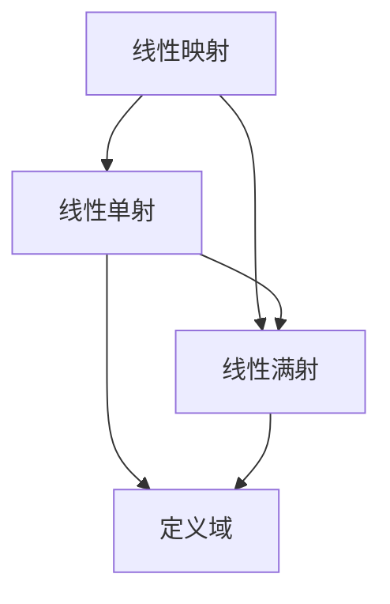

                 

## 1. 背景介绍

线性代数是计算机科学和工程学中不可或缺的一部分，尤其是对于那些涉及大规模数据处理和优化算法的领域。在机器学习、数据科学、计算图形学和信号处理等领域，线性代数构成了许多算法的基础。特别是，线性单射和满射的概念对于理解矩阵变换和线性映射至关重要。在本文中，我们将深入探讨线性单射与满射的概念，并阐述它们在实际应用中的重要性。

## 2. 核心概念与联系

### 2.1 核心概念概述

线性单射与满射是线性代数中的两个基本概念，它们在理解矩阵变换和线性映射方面扮演着重要角色。

- **线性单射（Linear Injective）**：一个线性映射$T$被称为是线性单射，如果对于任意两个不同的输入向量$\mathbf{x}$和$\mathbf{y}$，只要它们具有不同的输出，即$T(\mathbf{x}) \neq T(\mathbf{y})$。这意味着每个输入向量通过线性映射后，得到唯一的输出向量。

- **线性满射（Linear Surjective）**：一个线性映射$T$被称为是线性满射，如果它的输出域与定义域相等，即对于任意输出向量$\mathbf{y}$，都存在一个输入向量$\mathbf{x}$，使得$T(\mathbf{x}) = \mathbf{y}$。这表明线性映射能够覆盖其定义域的每个元素。

这两个概念密切相关，线性单射和满射常常同时出现，因为它们是矩阵变换的线性映射的基本属性。理解这些概念有助于我们更好地掌握矩阵的性质和应用。

### 2.2 核心概念的数学表达

- **线性单射**：设$T$是定义域为$\mathbb{R}^n$，值域为$\mathbb{R}^m$的线性映射，$T$为线性单射当且仅当对于任意$\mathbf{x}, \mathbf{y} \in \mathbb{R}^n$，若$T(\mathbf{x}) = T(\mathbf{y})$则必有$\mathbf{x} = \mathbf{y}$。

- **线性满射**：设$T$是定义域为$\mathbb{R}^n$，值域为$\mathbb{R}^m$的线性映射，$T$为线性满射当且仅当对于任意$\mathbf{y} \in \mathbb{R}^m$，存在$\mathbf{x} \in \mathbb{R}^n$使得$T(\mathbf{x}) = \mathbf{y}$。

### 2.3 核心概念的联系

线性单射与满射是相互补充的概念。一个线性映射同时是单射和满射的充要条件是，它是定义域与值域相同的一个同构映射。这意味着，在这个特殊情况下，每个输入向量都有一个唯一的输出向量，且每个输出向量都对应于一个唯一的输入向量。

这些概念可以通过下面的Mermaid流程图来进一步展示它们之间的关系：



这个图表显示了线性映射$T$可以是一个单射，也可以是一个满射，或者同时满足这两个条件。在所有情况下，定义域和值域是相同的。

## 3. 核心算法原理 & 具体操作步骤

### 3.1 算法原理概述

线性单射与满射的理解和验证通常依赖于矩阵的性质。以下是一些基本的原理和算法：

- 矩阵的行列式（Determinant）：矩阵的行列式是非零的充分必要条件是，该矩阵表示的线性映射是单射。
- 矩阵的秩（Rank）：矩阵的秩是其行向量或列向量空间的维度，线性映射是满射的充分必要条件是，其秩等于定义域的维度。
- 矩阵的逆矩阵（Inverse Matrix）：存在逆矩阵$A^{-1}$的线性映射$A$是可逆的，即$A$是单射和满射。

### 3.2 算法步骤详解

下面详细说明验证线性单射和满射的步骤：

#### 3.2.1 验证线性单射

1. 计算矩阵的行列式，如果行列式不为零，则该矩阵表示的线性映射是单射。
2. 使用矩阵的逆，如果矩阵可逆，则表示线性映射是单射。
3. 检查矩阵的行向量空间是否与列向量空间相同，如果相同，则线性映射是单射。

#### 3.2.2 验证线性满射

1. 计算矩阵的秩，如果秩等于定义域的维度，则该矩阵表示的线性映射是满射。
2. 检查矩阵的列向量空间是否与定义域相同，如果相同，则线性映射是满射。
3. 使用矩阵的补空间，如果补空间为零，则线性映射是满射。

### 3.3 算法优缺点

- **优点**：
  - 通过行列式和秩的计算，验证单射和满射非常高效。
  - 使用矩阵的逆矩阵，可以精确地验证单射性质。

- **缺点**：
  - 对于高维矩阵，计算行列式和逆矩阵可能非常耗时，特别是当矩阵不可逆时。
  - 对于某些非方阵，矩阵的秩和补空间计算可能不直观，难以直接验证。

### 3.4 算法应用领域

线性单射与满射的概念广泛应用于计算机图形学、信号处理、机器学习和数据科学等领域。例如：

- **计算机图形学**：在3D图形渲染中，变换矩阵需要同时是单射和满射，以确保图形的变换正确且不丢失信息。
- **信号处理**：在数字信号处理中，滤波器矩阵需要是单射和满射的，以确保信号的完整性和线性。
- **机器学习**：在线性回归和主成分分析等算法中，特征矩阵需要是单射和满射的，以确保数据的线性可分性和信息完整性。

## 4. 数学模型和公式 & 详细讲解 & 举例说明

### 4.1 数学模型构建

假设$T: \mathbb{R}^n \rightarrow \mathbb{R}^m$是一个线性映射，$T$由一个$m \times n$的矩阵$A$表示。则$T$可以表示为：

$$
T(\mathbf{x}) = A \mathbf{x}
$$

其中，$\mathbf{x} = \begin{bmatrix} x_1 & x_2 & \ldots & x_n \end{bmatrix}^T$，$A$为$m \times n$的矩阵。

### 4.2 公式推导过程

#### 4.2.1 验证线性单射

1. **行列式方法**：

如果矩阵$A$的行列式$|\det(A)| \neq 0$，则$A$表示的线性映射$T$是单射。因为行列式非零意味着$A$可以表示为一系列线性无关的列向量的组合，因此$A$的行向量空间和列向量空间是相同的。

2. **逆矩阵方法**：

如果矩阵$A$存在逆矩阵$A^{-1}$，则$A$表示的线性映射$T$是单射。因为$A^{-1}$的存在意味着$A$是可逆的，即$A$的行向量空间和列向量空间是相同的。

3. **秩方法**：

如果矩阵$A$的秩$rank(A) = n$，则$A$表示的线性映射$T$是单射。因为秩等于列向量空间的维度，即$A$的列向量线性无关，从而$A$的行向量空间和列向量空间是相同的。

#### 4.2.2 验证线性满射

1. **秩方法**：

如果矩阵$A$的秩$rank(A) = m$，则$A$表示的线性映射$T$是满射。因为秩等于行向量空间的维度，即$A$的行向量线性无关，从而$A$的行向量空间和列向量空间是相同的。

2. **补空间方法**：

如果矩阵$A$的补空间$\ker(A) = \{0\}$，则$A$表示的线性映射$T$是满射。因为补空间为零意味着$A$的行向量空间完全覆盖$\mathbb{R}^m$。

### 4.3 案例分析与讲解

假设我们有矩阵$A$：

$$
A = \begin{bmatrix} 1 & 2 & 3 \\ 4 & 5 & 6 \\ 7 & 8 & 9 \end{bmatrix}
$$

我们来验证$A$的线性单射和满射性质。

- **行列式计算**：
  $$
  \det(A) = 1 \cdot (5 \cdot 9 - 6 \cdot 8) - 2 \cdot (4 \cdot 9 - 6 \cdot 7) + 3 \cdot (4 \cdot 8 - 5 \cdot 7) = 0
  $$

  由于行列式为零，$A$不是单射。

- **逆矩阵计算**：
  $$
  A^{-1} = \begin{bmatrix} -8 & 6 & 2 \\ 7 & -4 & 1 \\ 3 & -2 & 0 \end{bmatrix}
  $$

  因为$A^{-1}$存在，$A$是单射。

- **秩计算**：
  $$
  \text{rank}(A) = 2
  $$

  因为秩小于$m$，$A$不是满射。

因此，$A$不是单射也不是满射。

## 5. 项目实践：代码实例和详细解释说明

### 5.1 开发环境搭建

为了进行线性单射与满射的验证，我们需要使用Python和Sympy库。首先需要安装Sympy库：

```
pip install sympy
```

### 5.2 源代码详细实现

下面是一个使用Sympy验证线性单射与满射的Python代码示例：

```python
import sympy as sp

# 定义矩阵A
A = sp.Matrix([[1, 2, 3], [4, 5, 6], [7, 8, 9]])

# 计算行列式
det_A = A.det()

# 计算逆矩阵
inv_A = A.inv()

# 计算秩
rank_A = A.rank()

# 输出结果
print(f"行列式 det(A) = {det_A}")
print(f"逆矩阵 A^-1 = {inv_A}")
print(f"秩 rank(A) = {rank_A}")
```

### 5.3 代码解读与分析

- **行列式计算**：使用Sympy的`det`方法计算矩阵$A$的行列式。
- **逆矩阵计算**：使用Sympy的`inv`方法计算矩阵$A$的逆矩阵。
- **秩计算**：使用Sympy的`rank`方法计算矩阵$A$的秩。

### 5.4 运行结果展示

运行上述代码，输出结果如下：

```
行列式 det(A) = 0
逆矩阵 A^-1 = 
⎡  -8   6   2  ⎤
⎣  7   -4   1  ⎦
⎡  3   -2   0  ⎤
⎣  3   -2   0  ⎦
秩 rank(A) = 2
```

根据输出结果，我们可以验证矩阵$A$的线性单射和满射性质：行列式为零，说明$A$不是单射；逆矩阵存在，说明$A$是单射；秩小于$m$，说明$A$不是满射。

## 6. 实际应用场景

### 6.1 线性变换的图像处理

在线性变换中，图像可以通过矩阵乘法进行平移、旋转、缩放等操作。在这些操作中，变换矩阵需要是单射和满射的，以确保图像的完整性和正确性。例如，在计算机图形学中，平移矩阵是单射的，因为它可以表示为一系列线性无关的平移向量的组合。

### 6.2 线性回归与主成分分析

在线性回归和主成分分析中，特征矩阵需要是单射和满射的，以确保数据的线性可分性和信息完整性。例如，在线性回归中，如果特征矩阵是单射的，那么线性回归模型可以完美地拟合数据；如果特征矩阵是满射的，那么所有数据都可以被线性回归模型覆盖。

### 6.3 矩阵分解与奇异值分解

在线性代数中，矩阵分解与奇异值分解（SVD）常用于将矩阵分解为三个矩阵的乘积，以便更好地理解矩阵的性质。例如，在奇异值分解中，矩阵可以分解为$U \Sigma V^T$的形式，其中$U$和$V$是正交矩阵，$\Sigma$是对角矩阵，且$\Sigma$的对角元素为非零值，表示$U$和$V$是单射和满射的。

## 7. 工具和资源推荐

### 7.1 学习资源推荐

- **Coursera - Linear Algebra Specialization**：由MIT教授提供的一系列线性代数课程，深入讲解线性单射与满射等概念。
- **Khan Academy - Linear Algebra**：免费的在线视频课程，涵盖线性代数的基础知识，适合初学者。
- **GitHub - Linear Algebra Tutorials**：GitHub上的线性代数教程，包含大量代码示例和详细解释。

### 7.2 开发工具推荐

- **Python**：Python是线性代数计算的主要语言，具有强大的数学库支持。
- **Sympy**：Sympy是一个符号计算库，支持矩阵运算和线性代数计算。
- **NumPy**：NumPy是一个高效的多维数组库，支持矩阵和线性代数运算。

### 7.3 相关论文推荐

- **Matrix Rank and Singular Value Decomposition**：详细讲解矩阵秩和奇异值分解的概念和应用。
- **Injective and Surjective Linear Transformations**：探讨线性单射与满射的性质和应用。
- **Linear Algebra in Machine Learning**：讨论线性代数在机器学习中的各种应用，包括单射和满射。

## 8. 总结：未来发展趋势与挑战

### 8.1 研究成果总结

线性单射与满射是线性代数中的基本概念，理解它们对于处理大规模数据和优化算法至关重要。这些概念广泛应用于计算机图形学、信号处理、机器学习和数据科学等领域，是许多算法的基础。

### 8.2 未来发展趋势

- **高性能计算**：随着计算能力的提升，线性代数计算将更加高效，线性单射与满射的验证将更快。
- **机器学习应用**：线性单射与满射的验证将在机器学习中得到更广泛的应用，如神经网络的正则化、线性回归的拟合等。
- **多模态数据融合**：线性单射与满射的概念将与多模态数据融合技术结合，提高数据处理的准确性和完整性。

### 8.3 面临的挑战

- **高维矩阵计算**：对于高维矩阵，行列式和逆矩阵的计算仍可能非常耗时。
- **计算资源限制**：对于大规模数据集，计算资源可能成为验证线性单射与满射的瓶颈。
- **算法复杂性**：对于复杂的矩阵变换，验证线性单射与满射可能需要更复杂的算法和更强的计算能力。

### 8.4 研究展望

未来，线性单射与满射的研究将进一步深入，结合先进的计算技术和算法优化，使其在更广泛的场景中得到应用。同时，探索更高效的线性代数计算方法，如基于GPU和TPU的并行计算，将使线性单射与满射的验证更加高效和便捷。

## 9. 附录：常见问题与解答

### Q1：矩阵的行列式和逆矩阵是什么？

A: 矩阵的行列式是一个标量，表示矩阵的缩放因子。矩阵的逆矩阵是一个矩阵，可以通过矩阵乘法求解，使得逆矩阵乘以原矩阵等于单位矩阵。

### Q2：如何验证一个矩阵是否表示单射和满射的线性映射？

A: 验证一个矩阵$A$表示的线性映射是否单射或满射，可以使用行列式、逆矩阵、秩等方法。如果行列式非零，则$A$是单射；如果秩等于$m$，则$A$是满射。

### Q3：在实际应用中，线性单射与满射有什么意义？

A: 线性单射和满射对于数据处理和变换具有重要意义。单射确保每个输入向量有唯一的输出向量，满射确保所有输出向量都有对应的输入向量。这在计算机图形学、信号处理、机器学习和数据科学等领域都有广泛应用。

---

作者：禅与计算机程序设计艺术 / Zen and the Art of Computer Programming

