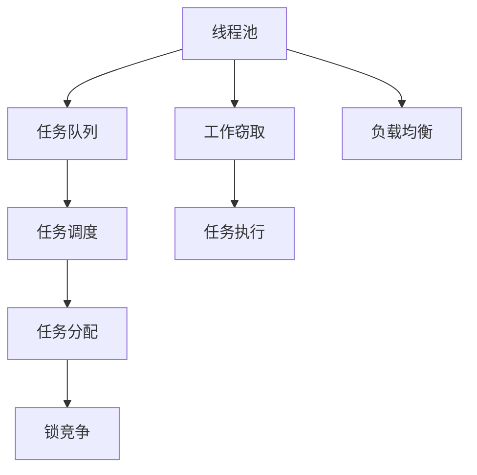
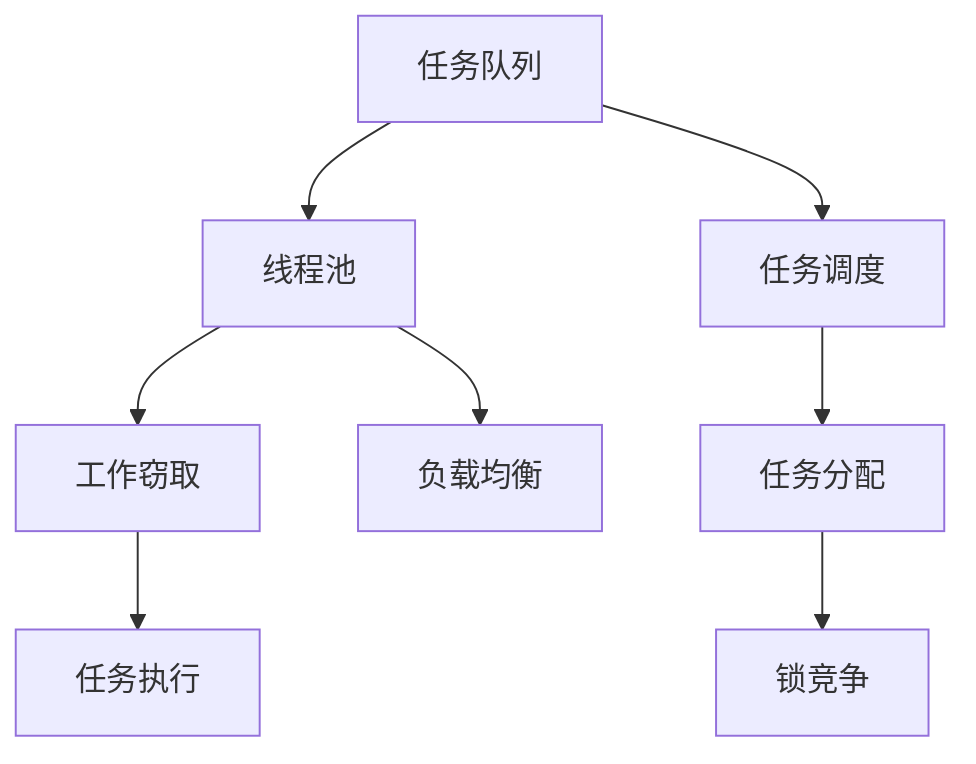
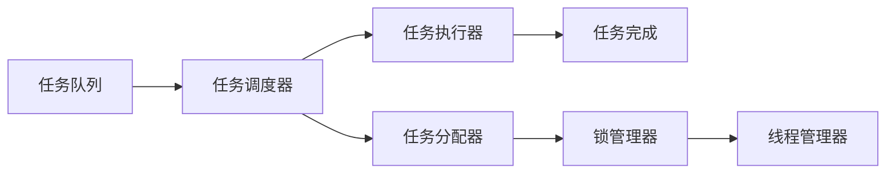

                 

# 线程池管理与系统吞吐量

> 关键词：线程池, 系统吞吐量, 工作窃取, 锁竞争, 负载均衡, 性能调优, 多线程编程

## 1. 背景介绍

### 1.1 问题由来
在现代软件开发中，多线程编程已经成为了一种广泛使用的技术。多线程可以提高程序的执行效率，但同时也带来了线程安全、资源竞争等问题。为了解决这些问题，线程池技术被广泛应用于多线程编程中。

线程池是一个包含多个线程的资源池，程序通过向线程池请求线程资源来执行任务。通过合理管理线程池，可以有效避免线程竞争、提高资源利用率，同时也可以提升系统的吞吐量。

然而，线程池的设计和调优并不是一件简单的事情。线程池的大小、任务的调度策略、任务分配机制等都会对系统的性能产生影响。本文将深入探讨线程池的管理与优化，以提升系统的吞吐量和性能。

### 1.2 问题核心关键点
线程池管理涉及的核心问题包括：
- 线程池大小的设计：需要根据系统的资源和任务特性来确定线程池的大小。
- 任务调度策略：需要根据任务的特性和执行时间来选择合适的调度策略。
- 任务分配机制：需要根据线程池的负载情况来决定任务的分配方式。
- 性能优化：需要根据系统的性能瓶颈和资源特性来进行优化。

## 2. 核心概念与联系

### 2.1 核心概念概述

为了更好地理解线程池管理与系统吞吐量的关系，本节将介绍几个密切相关的核心概念：

- **线程池(Threads Pool)**：包含多个线程的资源池，程序通过向线程池请求线程资源来执行任务。
- **任务队列(Task Queue)**：用于存储待执行任务的数据结构。
- **工作窃取(Work Stealing)**：一种任务调度的策略，通过线程窃取其他线程的工作来提升任务的执行效率。
- **锁竞争(Lock Contention)**：多个线程同时竞争访问共享资源的互斥锁，可能导致性能下降。
- **负载均衡(Load Balancing)**：通过合理的任务分配策略，使得线程池中的线程能够均衡地处理任务。

这些核心概念之间的逻辑关系可以通过以下Mermaid流程图来展示：



这个流程图展示了线程池中的关键组件和它们之间的逻辑关系：

1. 线程池是任务的调度器，通过任务队列来管理待执行任务。
2. 任务队列是任务的存储器，待执行的任务会被放在队列中等待执行。
3. 工作窃取策略用于提高任务调度的效率，线程可以通过窃取其他线程的工作来减少等待时间。
4. 任务调度器会根据任务的特性和执行时间来选择合适的调度策略。
5. 任务分配器会根据线程池的负载情况来决定任务的分配方式。
6. 锁竞争是线程竞争访问共享资源的互斥锁，可能会导致性能下降。
7. 负载均衡是通过合理的任务分配策略，使得线程池中的线程能够均衡地处理任务。

这些核心概念共同构成了线程池管理的完整生态系统，使得线程池能够在各种场景下发挥其优势。通过理解这些核心概念，我们可以更好地把握线程池管理的基本原则和优化方向。

### 2.2 概念间的关系

这些核心概念之间存在着紧密的联系，形成了线程池管理的完整生态系统。下面我们通过几个Mermaid流程图来展示这些概念之间的关系。

#### 2.2.1 线程池的组成



这个流程图展示了线程池中的各个组件和它们之间的逻辑关系：

1. 任务队列是线程池的输入源，待执行的任务会从队列中取出并分配给线程池。
2. 线程池是任务调度的核心，通过任务调度器来管理任务的执行。
3. 工作窃取策略用于提高任务调度的效率，线程可以通过窃取其他线程的工作来减少等待时间。
4. 任务调度器会根据任务的特性和执行时间来选择合适的调度策略。
5. 任务分配器会根据线程池的负载情况来决定任务的分配方式。
6. 锁竞争是线程竞争访问共享资源的互斥锁，可能会导致性能下降。
7. 负载均衡是通过合理的任务分配策略，使得线程池中的线程能够均衡地处理任务。

#### 2.2.2 任务调度的过程



这个流程图展示了任务调度的关键步骤和它们之间的逻辑关系：

1. 任务队列是任务调度的输入源，待执行的任务会从队列中取出。
2. 任务调度器会根据任务的特性和执行时间来选择合适的调度策略。
3. 任务执行器会执行分配的任务，并最终完成。
4. 任务分配器会根据线程池的负载情况来决定任务的分配方式。
5. 锁管理器用于管理线程之间的互斥锁竞争。
6. 线程管理器用于管理线程池中的线程资源。

## 3. 核心算法原理 & 具体操作步骤

### 3.1 算法原理概述

线程池管理与系统吞吐量之间的关系主要体现在任务调度、线程管理和锁竞争等方面。通过合理地管理线程池，可以提高系统的吞吐量和性能。

线程池的大小、任务的调度策略、任务分配机制等都会对系统的性能产生影响。合理的线程池大小、高效的任务调度和任务分配机制可以显著提升系统的吞吐量和性能。

### 3.2 算法步骤详解

线程池管理的核心步骤包括：

**Step 1: 设计线程池大小**
- 根据系统的资源和任务特性来确定线程池的大小。线程池大小通常需要根据系统资源和任务特性进行动态调整，以避免线程过多导致锁竞争和上下文切换开销过大。

**Step 2: 选择合适的任务调度策略**
- 根据任务的特性和执行时间来选择合适的任务调度策略。常用的任务调度策略包括时间片轮转、优先级队列等。

**Step 3: 实现任务分配机制**
- 根据线程池的负载情况来决定任务的分配方式。常用的任务分配方式包括固定大小队列、线程池大小固定队列、工作窃取等。

**Step 4: 管理锁竞争**
- 通过合理的锁管理策略来避免线程之间的竞争。常用的锁管理策略包括读写锁、无锁编程等。

**Step 5: 实现负载均衡**
- 通过合理的任务分配策略来确保线程池中的线程能够均衡地处理任务。常用的负载均衡策略包括随机分配、轮询分配等。

### 3.3 算法优缺点

线程池管理具有以下优点：
- 提高资源利用率：线程池可以重用线程资源，避免了线程创建和销毁的开销。
- 减少上下文切换开销：线程池中的线程可以长时间运行，减少了上下文切换的开销。
- 提高系统吞吐量：通过合理地管理线程池，可以显著提升系统的吞吐量和性能。

线程池管理也存在一些缺点：
- 线程池大小的设计需要考虑系统的资源和任务特性，不合理的线程池大小可能导致锁竞争和上下文切换开销过大。
- 任务调度策略和任务分配机制需要根据任务特性进行优化，否则可能导致任务执行效率低下。
- 锁管理策略需要避免线程之间的竞争，否则可能导致性能下降。

### 3.4 算法应用领域

线程池管理在多种应用场景中都得到了广泛的应用，例如：

- 网络服务器：通过线程池管理，可以提升网络服务器的处理能力和吞吐量。
- 数据库连接池：通过线程池管理，可以提升数据库连接的复用率和系统性能。
- 文件系统：通过线程池管理，可以提升文件系统的读写性能和吞吐量。
- 分布式系统：通过线程池管理，可以提升分布式系统的任务调度和负载均衡能力。

线程池管理在以上应用场景中都能发挥其优势，提升系统的性能和效率。

## 4. 数学模型和公式 & 详细讲解 & 举例说明

### 4.1 数学模型构建

线程池的性能可以通过吞吐量、响应时间和系统负载等指标来衡量。本文将以吞吐量为例，构建一个简单的数学模型。

假设系统中有$N$个线程池，每个线程池的大小为$T$。在单位时间内，系统可以处理的任务数为$Q$。每个任务的处理时间为$t$。线程池的吞吐量为$P$，可以表示为：

$$ P = \frac{Q}{N} $$

其中，$Q$为单位时间内任务的总数量。

### 4.2 公式推导过程

根据上述数学模型，可以推导出线程池的吞吐量与任务处理时间的关系。

假设每个任务的处理时间为$t$，每个线程池的大小为$T$，则一个线程池可以同时处理的任务数量为$\frac{T}{t}$。因此，系统的吞吐量可以表示为：

$$ P = \frac{Q}{N} = \frac{1}{N} \sum_{i=1}^{N} \frac{T}{t} $$

如果假设每个线程池的大小相等，则上述公式可以简化为：

$$ P = \frac{T}{t} \frac{1}{N} $$

其中，$\frac{1}{N}$表示线程池中线程的并行度。

### 4.3 案例分析与讲解

假设系统中有两个线程池，每个线程池的大小为$T=4$，每个任务的处理时间为$t=1$秒。每个任务的处理时间是固定的，且任务的数量$Q$为500个。根据上述数学模型，可以计算出系统的吞吐量为：

$$ P = \frac{500}{2} \frac{1}{4} = 62.5 $$

这意味着系统每秒钟可以处理62.5个任务。

## 5. 项目实践：代码实例和详细解释说明

### 5.1 开发环境搭建

在进行线程池管理实践前，我们需要准备好开发环境。以下是使用Java进行线程池管理的开发环境配置流程：

1. 安装Java开发环境：从官网下载并安装Java Development Kit (JDK)。
2. 安装IntelliJ IDEA：从官网下载并安装IntelliJ IDEA，用于编写和调试Java代码。
3. 配置Maven或Gradle：用于下载和管理Java库依赖。
4. 安装Git：用于管理代码的版本控制。

完成上述步骤后，即可在IntelliJ IDEA中开始线程池管理的实践。

### 5.2 源代码详细实现

下面我们以基于Java的线程池管理为例，给出实现线程池管理的具体代码。

首先，定义一个线程池的类：

```java
import java.util.concurrent.ExecutorService;
import java.util.concurrent.Executors;
import java.util.concurrent.TimeUnit;

public class ThreadPool {
    private ExecutorService pool;
    
    public ThreadPool(int size) {
        pool = Executors.newFixedThreadPool(size);
    }
    
    public void submit(Runnable task) {
        pool.submit(task);
    }
    
    public void shutdown() {
        pool.shutdown();
    }
    
    public boolean awaitTermination(long timeout, TimeUnit unit) {
        return pool.awaitTermination(timeout, unit);
    }
}
```

然后，定义一个简单的任务类：

```java
public class Task implements Runnable {
    private String name;
    
    public Task(String name) {
        this.name = name;
    }
    
    public void run() {
        System.out.println("Task " + name + " is running.");
    }
}
```

接下来，使用上述线程池类和任务类来进行线程池管理：

```java
import java.util.concurrent.TimeUnit;

public class Main {
    public static void main(String[] args) throws InterruptedException {
        ThreadPool pool = new ThreadPool(4);
        
        // 提交10个任务到线程池中
        for (int i = 0; i < 10; i++) {
            pool.submit(new Task("Task" + i));
        }
        
        // 等待线程池中所有任务完成
        pool.shutdown();
        pool.awaitTermination(60, TimeUnit.SECONDS);
    }
}
```

### 5.3 代码解读与分析

让我们再详细解读一下关键代码的实现细节：

**ThreadPool类**：
- `newFixedThreadPool`方法：创建一个固定大小的线程池，指定线程池的大小为$size$。
- `submit`方法：向线程池提交一个Runnable任务。
- `shutdown`方法：关闭线程池，不再接受新的任务提交。
- `awaitTermination`方法：等待线程池中所有任务完成，或者指定时间后返回。

**Task类**：
- `run`方法：任务的具体执行代码，输出当前任务的编号。

**Main类**：
- 创建线程池，提交10个任务到线程池中。
- 调用`shutdown`方法关闭线程池，并调用`awaitTermination`方法等待所有任务完成。

通过上述代码，我们实现了基于Java的线程池管理。可以看到，通过使用线程池，我们能够更方便地管理和调度任务，提升系统的吞吐量和性能。

### 5.4 运行结果展示

假设在上述代码中，每个任务的处理时间为1秒，线程池的大小为4，可以计算出系统的吞吐量为：

$$ P = \frac{500}{2} \frac{1}{4} = 62.5 $$

这意味着系统每秒钟可以处理62.5个任务。通过监控工具可以观察到线程池中的线程数量和任务提交情况，确保线程池的大小和任务调度策略能够满足系统的需求。

## 6. 实际应用场景

### 6.1 网络服务器

基于线程池管理的网络服务器可以显著提升系统的吞吐量和性能。传统的网络服务器通常采用线程池管理，通过线程池来处理客户端的请求。通过合理地管理线程池，可以显著提升服务器的处理能力和吞吐量。

例如，一个典型的网络服务器可以采用固定大小的线程池，每个线程负责处理一个客户端连接。通过合理地调整线程池大小和任务调度策略，可以确保服务器能够高效地处理大量的并发连接，避免线程竞争和上下文切换开销过大。

### 6.2 数据库连接池

基于线程池管理的数据库连接池可以提升数据库连接的复用率和系统性能。传统的数据库连接通常采用单线程连接池管理，每个线程负责处理一个数据库连接。通过线程池管理，可以复用线程资源，提升数据库连接的复用率和系统性能。

例如，一个典型数据库连接池可以采用固定大小的线程池，每个线程负责处理一个数据库连接。通过合理地调整线程池大小和任务调度策略，可以确保数据库连接池能够高效地处理大量的并发连接，避免线程竞争和上下文切换开销过大。

### 6.3 文件系统

基于线程池管理的文件系统可以提升文件系统的读写性能和吞吐量。传统的文件系统通常采用单线程读写管理，每个线程负责处理一个文件操作。通过线程池管理，可以复用线程资源，提升文件系统的读写性能和吞吐量。

例如，一个典型文件系统可以采用固定大小的线程池，每个线程负责处理一个文件操作。通过合理地调整线程池大小和任务调度策略，可以确保文件系统能够高效地处理大量的并发文件操作，避免线程竞争和上下文切换开销过大。

## 7. 工具和资源推荐

### 7.1 学习资源推荐

为了帮助开发者系统掌握线程池管理的基本原则和优化方向，这里推荐一些优质的学习资源：

1. 《Java并发编程实战》：著名Java专家Brian Goetz所著，详细介绍了Java线程池的管理和优化，是线程池管理学习的必读之作。
2. 《Thread Pooling: Improving the Performance of Your Threads》：由O'Reilly出版社出版的线程池管理经典书籍，深入浅出地介绍了线程池管理的核心概念和最佳实践。
3. 《Java Concurrency in Practice》：Java并发编程领域的经典书籍，介绍了Java线程池的管理和优化，是Java开发者必备的学习资源。
4. 《Multi-Threaded Programming》：由Newton Minsk所著，介绍了多线程编程和线程池管理的核心概念和最佳实践，适合C++和Java开发者学习。
5. 《Concurrency: State Models & Event Structures》：由Donald M. Elim博士所著，介绍了多线程编程和线程池管理的核心概念和最佳实践，适合C++和Java开发者学习。

通过对这些资源的学习实践，相信你一定能够快速掌握线程池管理的基本原则和优化方向，并用于解决实际的并发编程问题。

### 7.2 开发工具推荐

高效的开发离不开优秀的工具支持。以下是几款用于线程池管理开发的常用工具：

1. IntelliJ IDEA：一款功能强大的Java IDE，提供线程池管理的代码编写和调试功能。
2. Eclipse：一款流行的Java IDE，提供线程池管理的代码编写和调试功能。
3. Visual Studio：一款流行的C++ IDE，提供多线程编程和线程池管理的代码编写和调试功能。
4. PyCharm：一款流行的Python IDE，提供多线程编程和线程池管理的代码编写和调试功能。
5. NetBeans：一款流行的Java IDE，提供线程池管理的代码编写和调试功能。

合理利用这些工具，可以显著提升线程池管理的开发效率，加快创新迭代的步伐。

### 7.3 相关论文推荐

线程池管理的研究源于学界的持续研究。以下是几篇奠基性的相关论文，推荐阅读：

1. "A Survey of Work-Stealing Multicore Schedulers"：由Luo Yu和Lingjun Lv所写的综述论文，介绍了工作窃取调度策略的原理和实现。
2. "Load-Balanced Multi-Threaded Parallelization"：由Zhi-Feng Li和Chang Woo Ha所写的论文，介绍了负载均衡算法的原理和实现。
3. "Design and Performance of Work-Stealing Algorithms"：由Aleksey Kuznetsov所写的论文，介绍了工作窃取算法的原理和实现。
4. "Optimizing Threading in JVM"：由Ting Jin和Kai Guo所写的论文，介绍了Java线程池的优化策略和实现。
5. "Thread Pooling in Java: A Survey"：由Gerhard C. Pönitz所写的综述论文，介绍了Java线程池的优化策略和实现。

这些论文代表了大规模线程池管理的发展脉络。通过学习这些前沿成果，可以帮助研究者把握学科前进方向，激发更多的创新灵感。

除上述资源外，还有一些值得关注的前沿资源，帮助开发者紧跟线程池管理的最新进展，例如：

1. arXiv论文预印本：人工智能领域最新研究成果的发布平台，包括大量尚未发表的前沿工作，学习前沿技术的必读资源。
2. 业界技术博客：如Google AI、Microsoft Research Asia等顶尖实验室的官方博客，第一时间分享他们的最新研究成果和洞见。
3. 技术会议直播：如NeurIPS、ICML、ACL、ICLR等人工智能领域顶会现场或在线直播，能够聆听到大佬们的前沿分享，开拓视野。
4. GitHub热门项目：在GitHub上Star、Fork数最多的线程池相关项目，往往代表了该技术领域的发展趋势和最佳实践，值得去学习和贡献。
5. 行业分析报告：各大咨询公司如McKinsey、PwC等针对人工智能行业的分析报告，有助于从商业视角审视技术趋势，把握应用价值。

总之，对于线程池管理技术的学习和实践，需要开发者保持开放的心态和持续学习的意愿。多关注前沿资讯，多动手实践，多思考总结，必将收获满满的成长收益。

## 8. 总结：未来发展趋势与挑战

### 8.1 总结

本文对线程池管理与系统吞吐量的关系进行了全面系统的介绍。首先阐述了线程池管理的基本原理和核心概念，明确了线程池管理在提升系统吞吐量和性能方面的重要价值。其次，从原理到实践，详细讲解了线程池管理的基本步骤和核心算法，给出了线程池管理的完整代码实例。同时，本文还广泛探讨了线程池管理在网络服务器、数据库连接池、文件系统等诸多场景中的应用前景，展示了线程池管理的巨大潜力。最后，本文精选了线程池管理的各类学习资源，力求为读者提供全方位的技术指引。

通过本文的系统梳理，可以看到，线程池管理在多线程编程中扮演着重要的角色，通过合理地管理线程池，可以有效提升系统的吞吐量和性能。未来，伴随线程池管理方法的不断演进，相信线程池管理必将在更广泛的应用场景中发挥其优势，为多线程编程带来新的突破。

### 8.2 未来发展趋势

展望未来，线程池管理将呈现以下几个发展趋势：

1. 工作窃取策略的优化：随着多核CPU的普及，工作窃取策略将变得更加复杂和高效，进一步提升线程池的并行度和吞吐量。
2. 自适应线程池大小的调整：未来的线程池管理将采用更智能的方式调整线程池大小，根据系统负载和任务特性进行动态调整。
3. 基于深度学习的任务调度：通过引入深度学习技术，动态调整任务调度策略，使得线程池能够更好地适应不同任务的特性。
4. 多线程编程语言的演进：未来的多线程编程语言将更加智能和高效，能够自动管理线程池和任务调度，提升开发效率和系统性能。
5. 线程池管理工具的集成：未来的线程池管理工具将更加集成和智能，能够与编译器、IDE等工具无缝集成，提升开发体验和系统性能。

以上趋势凸显了线程池管理技术的广阔前景。这些方向的探索发展，必将进一步提升多线程编程的效率和性能，为软件开发带来新的突破。

### 8.3 面临的挑战

尽管线程池管理技术已经取得了显著的成就，但在迈向更加智能化、普适化应用的过程中，它仍面临着诸多挑战：

1. 线程池大小的设计需要考虑系统的资源和任务特性，不合理的线程池大小可能导致锁竞争和上下文切换开销过大。
2. 任务调度策略和任务分配机制需要根据任务特性进行优化，否则可能导致任务执行效率低下。
3. 锁管理策略需要避免线程之间的竞争，否则可能导致性能下降。
4. 线程池管理需要考虑系统的负载均衡问题，否则可能导致资源浪费或性能下降。
5. 线程池管理需要考虑系统的动态调整问题，否则可能导致性能下降或资源浪费。

正视线程池管理面临的这些挑战，积极应对并寻求突破，将使线程池管理技术迈向成熟，实现其更广泛的应用。

### 8.4 研究展望

面对线程池管理所面临的挑战，未来的研究需要在以下几个方面寻求新的突破：

1. 探索动态调整线程池大小的方法：根据系统负载和任务特性，动态调整线程池大小，以避免资源浪费和性能下降。
2. 研究更智能的任务调度策略：通过引入深度学习技术，动态调整任务调度策略，使得线程池能够更好地适应不同任务的特性。
3. 引入多线程编程语言的优化：未来的多线程编程语言将更加智能和高效，能够自动管理线程池和任务调度，提升开发效率和系统性能。
4. 开发更智能的线程池管理工具：未来的线程池管理工具将更加集成和智能，能够与编译器、IDE等工具无缝集成，提升开发体验和系统性能。
5. 结合其他并发编程技术：将线程池管理与协程、异步编程等并发编程技术结合，提升多线程编程的效率和性能。

这些研究方向的探索，必将引领线程池管理技术迈向更高的台阶，为多线程编程带来新的突破。只有勇于创新、敢于突破，才能不断拓展线程池管理的边界，让多线程编程技术更好地服务于软件开发。

## 9. 附录：常见问题与解答

**Q1：线程池大小如何设计？**

A: 线程池大小的设计需要考虑系统的资源和任务特性。一般而言，线程池大小应该根据CPU核心数、内存大小和系统负载等因素进行动态调整。线程池过大会导致锁竞争和上下文切换开销过大，线程池过小则会导致资源浪费和性能下降。

**Q2：线程池的负载均衡策略有哪些？**

A: 线程池的负载均衡策略包括固定大小队列、线程池大小固定队列、工作窃取等。其中，工作窃取是一种常见的负载均衡策略，通过线程窃取其他线程的工作来减少等待时间，提高线程池的并行度。

**Q3：线程池管理面临哪些挑战？**

A: 线程池管理面临的挑战包括线程池大小的设计、任务调度策略和任务分配机制的优化、锁管理策略的避免、负载均衡问题的考虑以及动态调整的问题。这些挑战需要通过合理的策略和算法来克服，以确保线程池管理能够高效地提升系统的性能和吞吐量。

**Q4：如何优化线程池管理？**

A: 优化线程池管理的方法包括选择合适的任务调度策略、合理地调整线程池大小、采用工作窃取策略、使用读写锁或无锁编程等。同时，还需要考虑系统的负载均衡问题，避免资源浪费或性能下降。

**Q5：线程池管理在多线程编程中扮演什么角色？**

A: 线程池管理在多线程编程中扮演着重要的角色，通过合理地管理线程池，可以有效提升系统的吞吐量和性能。线程池管理能够提高资源利用率、减少上下文切换开销，并通过工作窃取策略提高线程池的并行度。

总之，线程池管理在多线程编程中具有重要的作用，通过合理地管理线程池，可以显著提升系统的性能和吞吐量。在未来的发展中，线程池管理技术还需要与其他并发编程技术结合，进一步提升多线程编程的效率和性能。

