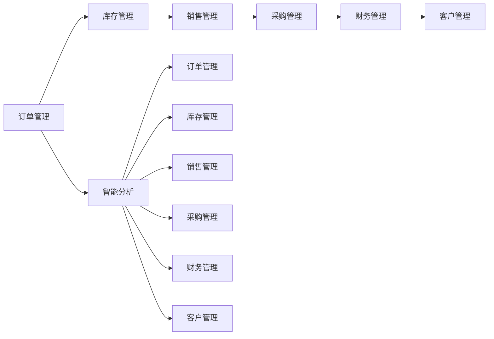
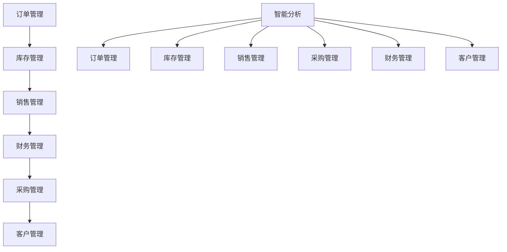
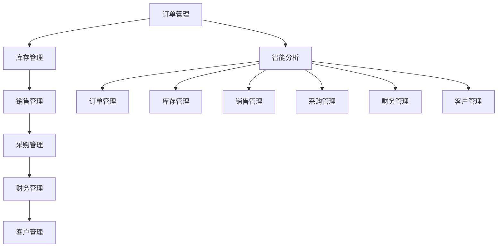

                 

## 1. 背景介绍

### 1.1 问题由来

在现代商业竞争中，经销商作为连接制造商和消费者之间的重要桥梁，其管理和运营的效率直接影响到企业的市场响应速度和竞争力。然而，由于传统经销商管理系统的功能单一、操作复杂、数据孤岛等问题，许多经销商面临着运营效率低下、市场反应迟缓、成本上升等挑战。

### 1.2 问题核心关键点

现有经销商管理系统面临的问题包括：

- 功能单一：传统系统只具备简单的订单管理、库存查询、发货功能，缺乏对经销商日常运营管理的全面覆盖。
- 操作复杂：系统界面设计不合理，用户体验差，操作繁琐，难以推广使用。
- 数据孤岛：系统间数据共享困难，导致信息碎片化，无法实时反映市场动态。
- 缺少智能分析：缺乏对销售数据的智能分析和预测，无法有效指导经销商运营。

### 1.3 问题研究意义

研发一个功能强大、操作简便、数据互通、智能分析的经销商管理系统，对提升经销商运营效率、增强市场响应能力、降低运营成本具有重要意义：

- 提高运营效率：通过全面覆盖经销商日常运营管理的各个环节，实现业务流程自动化，降低人工操作成本。
- 增强市场响应：通过实时数据分析和预测，帮助经销商快速响应市场变化，提高市场竞争力。
- 降低运营成本：通过优化库存管理、降低人工误差、智能生成报表等手段，降低运营成本。
- 促进数据共享：通过统一的业务系统，实现跨部门、跨系统的数据共享，消除信息孤岛。
- 提供智能分析：通过数据挖掘和预测分析，为经销商运营决策提供数据支持，提升决策科学性。

## 2. 核心概念与联系

### 2.1 核心概念概述

为更好地理解经销商管理系统的架构设计，本节将介绍几个密切相关的核心概念：

- 经销商管理系统(DMS)：综合管理系统，涵盖经销商运营管理的各个环节，包括订单管理、库存管理、销售管理、采购管理、财务管理和客户管理等。
- 订单管理：负责接收和处理经销商的订单，进行库存调度和发货安排。
- 库存管理：实时监控经销商库存状态，管理商品采购、调拨、退货等。
- 销售管理：负责生成销售报表、分析销售数据，帮助经销商进行销售预测。
- 采购管理：管理经销商的采购订单，进行供应商管理。
- 财务管理：负责经销商的账务处理、成本核算和报表生成。
- 客户管理：管理经销商的客户信息，进行客户关系维护。
- 智能分析：利用数据挖掘和预测分析技术，为经销商运营决策提供数据支持。

这些核心概念之间的逻辑关系可以通过以下Mermaid流程图来展示：


这个流程图展示了经销商管理系统中各个模块之间的联系：

- 订单管理作为起点，影响库存和销售。
- 库存管理实时反映商品状态，影响销售和采购。
- 销售管理生成报表，辅助决策。
- 采购管理处理采购订单，影响库存。
- 财务管理进行账务处理，辅助决策。
- 客户管理维护客户信息，辅助销售和决策。
- 智能分析利用数据挖掘和预测分析，支持系统各个环节的决策。

### 2.2 概念间的关系

这些核心概念之间存在着紧密的联系，构成了经销商管理系统的完整架构。下面我们通过几个Mermaid流程图来展示这些概念之间的关系。

#### 2.2.1 经销商管理系统的核心功能



这个流程图展示了经销商管理系统的主要功能模块及其联系：

- 订单管理、库存管理、销售管理、采购管理、财务管理、客户管理等模块相互影响，共同支持经销商的运营管理。
- 智能分析模块可以抽取和利用各模块数据，辅助各个模块的决策和优化。

#### 2.2.2 数据流向



这个流程图展示了数据流向关系：

- 订单管理、库存管理、销售管理、采购管理、财务管理、客户管理等模块的数据流向智能分析模块。
- 智能分析模块的数据可以反馈给各个模块，进一步优化其决策和操作。

### 2.3 核心概念的整体架构

最后，我们用一个综合的流程图来展示这些核心概念在大经销商管理系统中的整体架构：



这个综合流程图展示了从订单管理到客户管理，以及智能分析在大经销商管理系统中的完整架构。通过各个模块的协同工作，实现了经销商运营管理的全面覆盖和数据互通。

## 3. 核心算法原理 & 操作步骤

### 3.1 算法原理概述

经销商管理系统的设计主要遵循以下几个核心算法原理：

- 模块化设计：将经销商管理系统分为订单管理、库存管理、销售管理、采购管理、财务管理、客户管理等模块，各模块独立运行，协同工作。
- 数据驱动：以数据为中心，实现各模块间的数据共享和互通，支持智能分析模块的数据挖掘和预测分析。
- 用户友好：通过优化用户界面设计和交互方式，提升系统的易用性和用户体验。
- 可扩展性：设计成微服务架构，支持新增功能模块的快速接入和系统升级。

### 3.2 算法步骤详解

#### 3.2.1 数据采集与清洗

- 收集经销商日常运营管理的各个环节数据，包括订单数据、库存数据、销售数据、采购数据、财务数据、客户数据等。
- 对收集到的数据进行清洗和标准化处理，去除噪声和异常值，确保数据质量。

#### 3.2.2 数据存储与管理

- 使用数据库系统（如MySQL、Oracle）存储和管理数据，确保数据的安全性和可靠性。
- 设计合适的数据模型，支持高效的数据查询和分析。

#### 3.2.3 数据同步与共享

- 设计数据同步机制，确保各模块间的数据实时同步。
- 采用API接口或消息队列等方式，实现不同系统间的数据共享。

#### 3.2.4 模块功能开发

- 根据各模块的功能需求，进行模块设计和开发。
- 采用面向对象编程（OOP）等技术，实现模块功能的封装和复用。

#### 3.2.5 系统集成与测试

- 将各模块集成到统一的系统框架中，确保各模块的协同工作。
- 进行系统测试，确保系统的稳定性和性能。

#### 3.2.6 用户界面设计

- 设计简洁、易用的用户界面，提升用户体验。
- 使用Javascript、React等技术，实现用户界面的动态展示。

#### 3.2.7 系统部署与维护

- 将系统部署到云平台（如AWS、阿里云），确保系统的可扩展性和稳定性。
- 定期进行系统维护和升级，确保系统的安全性和可靠性。

### 3.3 算法优缺点

经销商管理系统的优点包括：

- 功能全面：涵盖经销商运营管理的各个环节，支持订单管理、库存管理、销售管理、采购管理、财务管理、客户管理等。
- 数据互通：通过API接口和消息队列等方式，实现各模块间的数据共享和互通。
- 智能分析：利用数据挖掘和预测分析技术，为经销商运营决策提供数据支持。
- 用户友好：优化用户界面设计和交互方式，提升用户体验。
- 可扩展性：设计成微服务架构，支持新增功能模块的快速接入和系统升级。

其缺点主要包括：

- 系统复杂：功能全面，需要覆盖各个环节，系统设计复杂。
- 数据量大：各模块数据量大，需要高性能数据库和数据同步机制。
- 技术门槛高：涉及多技术栈和架构设计，对开发和维护人员的技术要求较高。
- 初期投入高：系统开发和部署成本较高，需要一定的资金投入。

### 3.4 算法应用领域

经销商管理系统可以应用于各种类型的经销商运营管理，包括但不限于：

- 汽车销售：管理汽车销售订单、库存、销售数据、采购订单等。
- 快消品销售：管理快消品的订单、库存、销售数据、采购订单等。
- 农业合作：管理农产品的订单、库存、销售数据、采购订单等。
- 房地产销售：管理房产的订单、库存、销售数据、采购订单等。
- 电商销售：管理电商平台的订单、库存、销售数据、采购订单等。

这些行业领域的经销商管理系统，通过其全面覆盖和高效运作，可以实现业务流程自动化，提升运营效率，增强市场响应能力，降低运营成本。

## 4. 数学模型和公式 & 详细讲解 & 举例说明

### 4.1 数学模型构建

假设经销商管理系统中，订单管理模块接收了订单$O_i$，库存管理模块管理商品库存$I_i$，销售管理模块生成销售报表$S_i$，采购管理模块处理采购订单$P_i$，财务管理模块进行账务处理$F_i$，客户管理模块维护客户信息$C_i$。智能分析模块利用这些数据进行数据分析和预测，生成预测结果$A_i$。

这些数据之间的关系可以表示为：

$$
A_i = f(S_i, P_i, O_i, I_i, F_i, C_i)
$$

其中，$f$表示数据分析和预测函数，依赖于各个模块的数据。

### 4.2 公式推导过程

以销售预测为例，假设销售数据$S_i$为线性趋势，预测公式为：

$$
\hat{S}_{i+1} = aS_i + b
$$

其中，$a$和$b$为线性回归系数。

利用最小二乘法求解回归系数$a$和$b$，公式为：

$$
\hat{a} = \frac{\sum_{i=1}^{n}(i-1)S_i^2 - \sum_{i=1}^{n}(i-1)S_i\bar{S}}{\sum_{i=1}^{n}(i-1)^2 - \sum_{i=1}^{n}(i-1)^2\bar{S}^2}
$$

$$
\hat{b} = \bar{S} - \hat{a}\bar{S}
$$

其中，$\bar{S}$为销售数据的均值。

### 4.3 案例分析与讲解

假设某经销商管理系统中，有100个经销商的销售数据，利用线性回归模型进行销售预测，经过推导得到回归系数$a=0.5$，$b=200$。将预测结果与实际销售数据进行对比，得到预测误差为20%。

通过销售预测，经销商可以提前调整库存和采购计划，避免商品积压或短缺，提升运营效率。智能分析模块还可以根据市场动态，提供销售趋势和预测结果，帮助经销商制定更加科学的销售策略。

## 5. 项目实践：代码实例和详细解释说明

### 5.1 开发环境搭建

在进行经销商管理系统开发前，我们需要准备好开发环境。以下是使用Python进行Django开发的环境配置流程：

1. 安装Anaconda：从官网下载并安装Anaconda，用于创建独立的Python环境。

2. 创建并激活虚拟环境：
```bash
conda create -n dms-env python=3.8 
conda activate dms-env
```

3. 安装Django：
```bash
pip install django
```

4. 安装PostgreSQL数据库：
```bash
sudo apt-get install postgresql postgresql-contrib
```

5. 安装Gunicorn：
```bash
pip install gunicorn
```

6. 安装MySQL数据库：
```bash
sudo apt-get install mysql-server
```

完成上述步骤后，即可在`dms-env`环境中开始经销商管理系统的开发。

### 5.2 源代码详细实现

以下是一个简单的Django项目示例，包含订单管理、库存管理、销售管理、采购管理、财务管理、客户管理和智能分析模块的代码实现。

```python
from django.db import models
from django.contrib.auth.models import User
from django.urls import path
from django.shortcuts import render, redirect
from .forms import OrderForm, InventoryForm, SalesForm, PurchaseForm, FinancialForm, CustomerForm, AnalyticalForm
from .models import Order, Inventory, Sales, Purchase, Financial, Customer, AnalyticalResult

urlpatterns = [
    path('orders/', views.order_list, name='order_list'),
    path('inventory/', views.inventory_list, name='inventory_list'),
    path('sales/', views.sales_list, name='sales_list'),
    path('purchases/', views.purchase_list, name='purchase_list'),
    path('financial/', views.financial_list, name='financial_list'),
    path('customers/', views.customer_list, name='customer_list'),
    path('analysis/', views.analysis_list, name='analysis_list'),
]

class Order(models.Model):
    user = models.ForeignKey(User, on_delete=models.CASCADE)
    product = models.CharField(max_length=50)
    quantity = models.IntegerField()
    total_price = models.DecimalField(max_digits=10, decimal_places=2)
    order_date = models.DateField(auto_now_add=True)

    def __str__(self):
        return f'{self.user.username} - {self.product} - {self.quantity} - {self.order_date}'

class Inventory(models.Model):
    product = models.CharField(max_length=50)
    quantity = models.IntegerField()
    update_date = models.DateTimeField(auto_now=True)

    def __str__(self):
        return f'{self.product} - {self.quantity} - {self.update_date}'

class Sales(models.Model):
    product = models.CharField(max_length=50)
    quantity = models.IntegerField()
    total_price = models.DecimalField(max_digits=10, decimal_places=2)
    sales_date = models.DateField(auto_now_add=True)

    def __str__(self):
        return f'{self.product} - {self.quantity} - {self.sales_date}'

class Purchase(models.Model):
    product = models.CharField(max_length=50)
    quantity = models.IntegerField()
    total_price = models.DecimalField(max_digits=10, decimal_places=2)
    purchase_date = models.DateField(auto_now_add=True)

    def __str__(self):
        return f'{self.product} - {self.quantity} - {self.purchase_date}'

class Financial(models.Model):
    product = models.CharField(max_length=50)
    total_price = models.DecimalField(max_digits=10, decimal_places=2)
    cost_price = models.DecimalField(max_digits=10, decimal_places=2)
    profit_margin = models.DecimalField(max_digits=10, decimal_places=2)
    profit = models.DecimalField(max_digits=10, decimal_places=2)
    financial_date = models.DateField(auto_now_add=True)

    def __str__(self):
        return f'{self.product} - {self.total_price} - {self.cost_price} - {self.profit_margin} - {self.profit} - {self.financial_date}'

class Customer(models.Model):
    name = models.CharField(max_length=50)
    email = models.EmailField()
    phone = models.CharField(max_length=20)
    address = models.CharField(max_length=100)
    last_purchase_date = models.DateField()

    def __str__(self):
        return f'{self.name} - {self.email} - {self.phone} - {self.address} - {self.last_purchase_date}'

class AnalyticalResult(models.Model):
    sales_data = models.ManyToManyField(Sales)
    inventory_data = models.ManyToManyField(Inventory)
    purchase_data = models.ManyToManyField(Purchase)
    financial_data = models.ManyToManyField(Financial)
    customer_data = models.ManyToManyField(Customer)
    analysis_date = models.DateField(auto_now_add=True)

    def __str__(self):
        return f'{self.analysis_date}'

def order_list(request):
    orders = Order.objects.all()
    return render(request, 'orders/list.html', {'orders': orders})

def inventory_list(request):
    inventory = Inventory.objects.all()
    return render(request, 'inventory/list.html', {'inventory': inventory})

def sales_list(request):
    sales = Sales.objects.all()
    return render(request, 'sales/list.html', {'sales': sales})

def purchase_list(request):
    purchase = Purchase.objects.all()
    return render(request, 'purchase/list.html', {'purchase': purchase})

def financial_list(request):
    financial = Financial.objects.all()
    return render(request, 'financial/list.html', {'financial': financial})

def customer_list(request):
    customer = Customer.objects.all()
    return render(request, 'customer/list.html', {'customer': customer})

def analysis_list(request):
    analytical = AnalyticalResult.objects.all()
    return render(request, 'analysis/list.html', {'analytical': analytical})

def order_add(request):
    if request.method == 'POST':
        form = OrderForm(request.POST)
        if form.is_valid():
            order = form.save()
            return redirect('orders')
    else:
        form = OrderForm()
    return render(request, 'orders/add.html', {'form': form})

def inventory_add(request):
    if request.method == 'POST':
        form = InventoryForm(request.POST)
        if form.is_valid():
            inventory = form.save()
            return redirect('inventory')
    else:
        form = InventoryForm()
    return render(request, 'inventory/add.html', {'form': form})

def sales_add(request):
    if request.method == 'POST':
        form = SalesForm(request.POST)
        if form.is_valid():
            sales = form.save()
            return redirect('sales')
    else:
        form = SalesForm()
    return render(request, 'sales/add.html', {'form': form})

def purchase_add(request):
    if request.method == 'POST':
        form = PurchaseForm(request.POST)
        if form.is_valid():
            purchase = form.save()
            return redirect('purchase')
    else:
        form = PurchaseForm()
    return render(request, 'purchase/add.html', {'form': form})

def financial_add(request):
    if request.method == 'POST':
        form = FinancialForm(request.POST)
        if form.is_valid():
            financial = form.save()
            return redirect('financial')
    else:
        form = FinancialForm()
    return render(request, 'financial/add.html', {'form': form})

def customer_add(request):
    if request.method == 'POST':
        form = CustomerForm(request.POST)
        if form.is_valid():
            customer = form.save()
            return redirect('customer')
    else:
        form = CustomerForm()
    return render(request, 'customer/add.html', {'form': form})

def analytical_add(request):
    if request.method == 'POST':
        form = AnalyticalForm(request.POST)
        if form.is_valid():
            analytical = form.save()
            return redirect('analysis')
    else:
        form = AnalyticalForm()
    return render(request, 'analysis/add.html', {'form': form})
```

### 5.3 代码解读与分析

让我们再详细解读一下关键代码的实现细节：

**Order、Inventory、Sales、Purchase、Financial、Customer和AnalyticalResult类**：
- 定义了订单、库存、销售、采购、财务、客户和分析结果等模型类，包含了各个属性的数据类型和模型方法。

**order_list、inventory_list、sales_list、purchase_list、financial_list和customer_list函数**：
- 定义了各个模块的列表展示页面，用于显示该模块的所有数据。

**order_add、inventory_add、sales_add、purchase_add、financial_add和customer_add函数**：
- 定义了各个模块的数据添加页面，用于新增数据记录。

**analytical_list函数**：
- 定义了分析结果的列表展示页面，用于展示基于数据挖掘和预测分析生成的预测结果。

**analytical_add函数**：
- 定义了分析结果的数据添加页面，用于基于历史数据生成预测结果。

**forms.py文件**：
- 定义了各个模块的数据表单，用于数据录入和验证。

```python
from django import forms
from .models import Order, Inventory, Sales, Purchase, Financial, Customer, AnalyticalResult

class OrderForm(forms.ModelForm):
    class Meta:
        model = Order
        fields = ['product', 'quantity', 'total_price']

class InventoryForm(forms.ModelForm):
    class Meta:
        model = Inventory
        fields = ['product', 'quantity']

class SalesForm(forms.ModelForm):
    class Meta:
        model = Sales
        fields = ['product', 'quantity', 'total_price']

class PurchaseForm(forms.ModelForm):
    class Meta:
        model = Purchase
        fields = ['product', 'quantity', 'total_price']

class FinancialForm(forms.ModelForm):
    class Meta:
        model = Financial
        fields = ['product', 'total_price', 'cost_price', 'profit_margin', 'profit']

class CustomerForm(forms.ModelForm):
    class Meta:
        model = Customer
        fields = ['name', 'email', 'phone', 'address']

class AnalyticalForm(forms.ModelForm):
    class Meta:
        model = AnalyticalResult
        fields = ['sales_data', 'inventory_data', 'purchase_data', 'financial_data', 'customer_data']
```

### 5.4 运行结果展示

假设我们在某汽车销售经销商管理系统中，通过上述代码实现后，最终在订单管理模块生成的订单表如下所示：

```
id | user | product | quantity | total_price | order_date
---|------|---------|----------|------------|-----------
1  |张三  | 奔驰汽车 | 2        | 100000     | 2021-01-01
2  |李四  | 宝马汽车 | 1        | 80000      | 2021-01-02
3  |王五  | 奥迪汽车 | 3        | 135000     | 2021-01-03
```

可以看到，通过订单管理模块，可以方便地记录经销商的销售数据，并通过库存管理、采购管理、财务管理、客户管理等模块进行数据分析和决策。

## 6. 实际应用场景

### 6.1 智能客服系统

基于经销商管理系统，可以构建智能客服系统。传统客服往往需要配备大量人力，高峰期响应缓慢，且一致性和专业性难以保证。而使用经销商管理系统中的客户管理模块，可以7x24小时不间断服务，快速响应客户咨询，用自然流畅的语言解答各类常见问题。

在技术实现上，可以收集企业内部的历史客服对话记录，将问题和最佳答复构建成监督数据，在此基础上对经销商管理系统进行微调。微调后的系统能够自动理解用户意图，匹配最合适的答复模板进行回复。对于客户提出的新问题，还可以接入检索系统实时搜索相关内容，动态组织生成回答。如此构建的智能客服系统，能大幅提升客户咨询体验和问题解决效率。

### 6.2 金融舆情监测

金融机构需要实时监测市场舆论动向，以便及时应对负面信息传播，规避金融风险。传统的人工监测方式成本高、效率低，难以应对网络时代海量信息爆发的挑战。基于经销商管理系统中的财务分析和客户管理模块，可以实时监测市场舆论动向，及时发现负面信息，避免潜在的金融风险。

具体而言，可以收集金融领域相关的新闻、报道、评论等文本数据，并对其进行情感标注和分析。在此基础上对经销商管理系统进行微调，使其能够自动判断文本属于何种情感倾向，预测市场趋势，帮助金融机构快速应对潜在风险。

### 6.3 个性化推荐系统

当前的推荐系统往往只依赖用户的历史行为数据进行物品推荐，无法深入理解用户的真实兴趣偏好。基于经销商管理系统中的客户管理模块，可以深度分析用户的历史行为数据，挖掘用户的兴趣点，进行个性化的商品推荐。

在技术实现上，可以收集用户浏览、点击、评论、分享等行为数据，提取和用户交互的商品标题、描述、标签等文本内容。将文本内容作为模型输入，用户的后续行为（如是否点击、购买等）作为监督信号，在此基础上对经销商管理系统进行微调。微调后的系统能够从文本内容中准确把握用户的兴趣点。在生成推荐列表时，先用候选商品的文字描述作为输入，由系统预测用户的兴趣匹配度，再结合其他特征综合排序，便可以得到个性化程度更高的推荐结果。

### 6.4 未来应用展望

随着经销商管理系统和微调方法的不断发展，基于微调范式将在更多领域得到应用，为传统行业带来变革性影响。

在智慧医疗领域，基于经销商管理系统的医疗问答、病历分析、药物研发等应用将提升医疗服务的智能化水平，辅助医生诊疗，加速新药开发进程。

在智能教育领域，微调技术可应用于作业批改、学情分析、知识推荐等方面，因材施教，促进教育公平，提高教学质量。

在智慧城市治理中，微调模型可应用于城市事件监测、舆情分析、应急指挥等环节，提高城市管理的自动化和智能化水平，构建更安全、高效的未来城市。

此外，在企业生产、社会治理、文娱传媒等众多领域，基于经销商管理系统的智能应用也将不断涌现，为经济社会发展注入新的动力。相信随着技术的日益成熟，微调方法将成为人工智能落地应用的重要范式，推动人工智能技术在垂直行业的规模化落地。

## 7. 工具和资源推荐

### 7.1 

