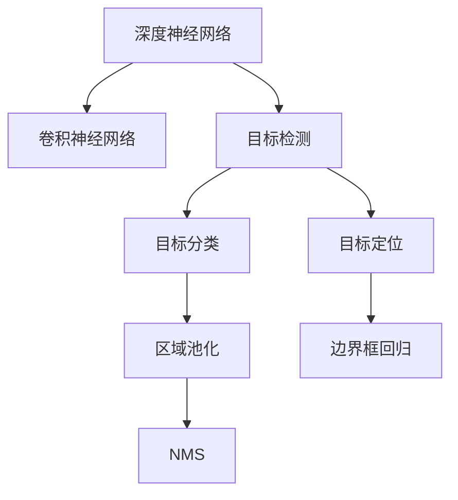
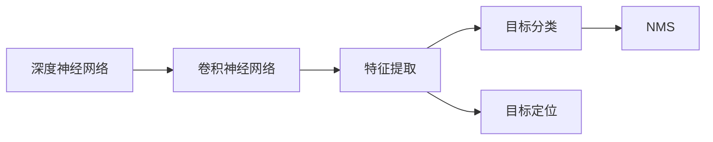
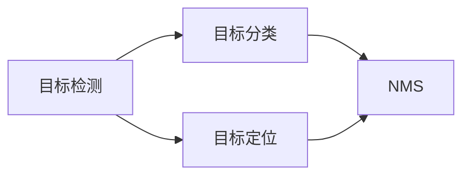
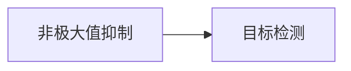
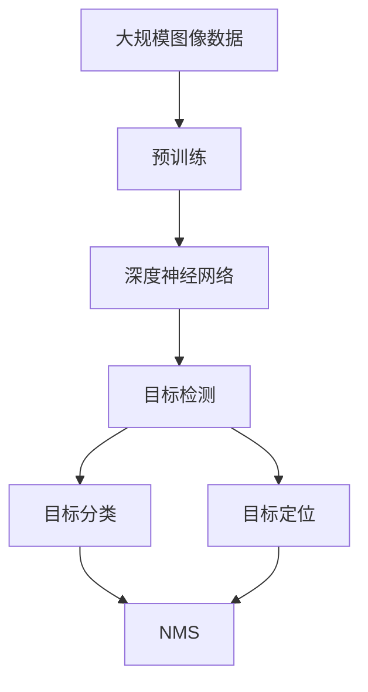

                 

# 一切皆是映射：基于深度学习的对象检测技术

> 关键词：对象检测, 深度学习, 卷积神经网络, 目标回归, 非极大值抑制

## 1. 背景介绍

### 1.1 问题由来
近年来，随着深度学习技术的飞速发展，基于深度学习技术的计算机视觉应用得到了广泛应用。其中，对象检测（Object Detection）作为计算机视觉领域的核心任务之一，有着广泛的应用场景，如自动驾驶、安防监控、工业视觉检测等。传统基于手工特征的对象检测方法难以处理复杂场景下的目标检测，因此基于深度学习的端到端对象检测方法应运而生。

基于深度学习的对象检测方法，主要依赖于深度神经网络模型对输入图像的特征提取和分类识别。通过在大型标注数据集上预训练卷积神经网络（Convolutional Neural Network, CNN）模型，并在测试集上进行微调，可以得到具有强大目标识别能力的网络。

### 1.2 问题核心关键点
对象检测的核心在于如何高效地从图像中识别和定位目标对象，主要包括以下几个关键点：
- 如何提取图像中的有效特征：使用深度神经网络对图像进行特征提取，学习到不同层次的图像特征。
- 如何高效地分类和定位目标：在特征提取的基础上，利用分类器或回归器对目标进行分类和定位。
- 如何处理目标重叠和背景噪声：通过非极大值抑制（Non-Maximum Suppression, NMS）等技术，去除冗余检测框，提高检测精度。

对象检测的核心任务是目标分类和目标定位。目标分类是通过对目标对象进行分类，将其归为预先定义的类别之一。目标定位则是根据目标的位置信息，准确地框定目标的边界框。

### 1.3 问题研究意义
研究对象检测技术，对于拓展计算机视觉应用场景，提升图像理解能力，具有重要意义：

1. 降低图像处理成本。基于深度学习的对象检测方法可以自动处理大量图像数据，无需人工标注，节省人力和物力。
2. 提高检测精度和效率。通过深度神经网络的学习，可以识别复杂场景中的目标对象，减少误检和漏检，提高检测效率。
3. 扩展应用领域。对象检测技术已经在自动驾驶、医疗影像、工业视觉等多个领域得到了广泛应用，提升了自动化程度和生产效率。
4. 推动人工智能技术发展。对象检测作为计算机视觉的核心任务之一，其发展将进一步推动深度学习在计算机视觉领域的应用，加速人工智能技术的产业化进程。

## 2. 核心概念与联系

### 2.1 核心概念概述

为更好地理解基于深度学习的对象检测技术，本节将介绍几个关键概念：

- 深度神经网络（Deep Neural Network, DNN）：由多个层次的神经元组成的神经网络，能够学习到输入数据的复杂特征，适合用于图像分类、目标检测等任务。
- 目标检测（Object Detection）：在图像中检测出不同类别的目标对象，并确定其边界框。主要分为两类：基于区域的检测（Region-Based Detection, RBD）和基于锚点的检测（Anchor-Based Detection, ABD）。
- 卷积神经网络（Convolutional Neural Network, CNN）：一种特殊的深度神经网络，通过卷积层、池化层和全连接层等模块，能够自动提取图像特征，适合用于图像分类和对象检测等任务。
- 目标分类（Object Classification）：将目标对象分为预先定义的类别之一，是对象检测的重要组成部分。
- 目标定位（Object Localization）：在图像中确定目标对象的位置信息，通常通过回归技术实现。
- 非极大值抑制（Non-Maximum Suppression, NMS）：用于去除冗余检测框，提高检测精度，是对象检测的重要后处理技术。

这些核心概念之间的关系可以通过以下Mermaid流程图来展示：



这个流程图展示了大语言模型微调过程中各个关键概念之间的关系：

1. 深度神经网络是图像处理的基础，其中卷积神经网络是主要组成部分。
2. 目标检测包括目标分类和目标定位两个子任务。
3. 目标分类和目标定位分别使用区域池化和边界框回归技术进行实现。
4. NMS是对象检测中重要的后处理技术，用于去除冗余检测框，提高检测精度。

### 2.2 概念间的关系

这些核心概念之间存在着紧密的联系，形成了对象检测的完整生态系统。下面我通过几个Mermaid流程图来展示这些概念之间的关系。

#### 2.2.1 深度神经网络与卷积神经网络的关系



这个流程图展示了深度神经网络与卷积神经网络之间的联系。卷积神经网络作为深度神经网络的一种特殊形式，主要负责特征提取任务。

#### 2.2.2 目标检测与目标分类、目标定位的关系



这个流程图展示了目标检测包括目标分类和目标定位两个子任务的关系。目标分类和目标定位分别通过区域池化和边界框回归技术实现。

#### 2.2.3 非极大值抑制与目标检测的关系



这个流程图展示了非极大值抑制与目标检测的关系。NMS用于去除冗余检测框，提高检测精度，是对象检测的重要后处理技术。

### 2.3 核心概念的整体架构

最后，我们用一个综合的流程图来展示这些核心概念在大语言模型微调过程中的整体架构：



这个综合流程图展示了从预训练到目标检测的完整过程。大语言模型首先在大规模图像数据上进行预训练，学习到图像特征。然后通过目标检测任务，对目标进行分类和定位，并使用NMS技术去除冗余检测框。通过这些步骤，可以得到具有强大目标识别能力的网络。

## 3. 核心算法原理 & 具体操作步骤
### 3.1 算法原理概述

基于深度学习的对象检测方法主要通过卷积神经网络模型，在大型标注数据集上进行预训练，并在测试集上进行微调。其核心思想是：将目标检测任务视为一个多任务学习问题，通过多个子任务（如目标分类、目标定位等）的联合训练，学习到强大的目标识别能力。

具体来说，对象检测算法包括两个主要子任务：目标分类和目标定位。目标分类任务是通过一个分类器对目标对象进行分类，将其归为预先定义的类别之一。目标定位任务则是通过一个回归器对目标对象的位置信息进行定位，生成边界框。在训练过程中，目标分类和目标定位同时进行，并使用共享的特征表示层。

### 3.2 算法步骤详解

基于深度学习的对象检测算法一般包括以下几个关键步骤：

**Step 1: 准备数据集**
- 收集大规模的标注数据集，包括目标对象的位置和类别信息。
- 将数据集划分为训练集、验证集和测试集。
- 对数据集进行预处理，如裁剪、归一化、翻转等。

**Step 2: 搭建网络结构**
- 搭建深度卷积神经网络（如ResNet、VGG等），作为特征提取器。
- 在顶层添加分类器和回归器，分别用于目标分类和定位。
- 设置损失函数，如交叉熵损失和回归损失，用于联合训练。

**Step 3: 设置训练参数**
- 选择合适的优化器，如SGD、Adam等，设置学习率、批大小、迭代轮数等。
- 设置正则化技术及强度，如权重衰减、Dropout等，防止过拟合。
- 设定目标分类和目标定位的权重比例，平衡两者的损失。

**Step 4: 执行训练**
- 使用训练集数据，对网络进行迭代训练。
- 在每个迭代轮次上，对目标分类和目标定位的预测结果进行计算，并计算损失。
- 根据损失值反向传播更新网络参数。
- 周期性在验证集上评估模型性能，根据性能指标决定是否触发Early Stopping。
- 重复上述步骤直到满足预设的迭代轮数或Early Stopping条件。

**Step 5: 评估和测试**
- 在测试集上评估微调后的网络模型。
- 使用目标分类和目标定位的预测结果，生成检测框。
- 使用NMS技术去除冗余检测框，得到最终的目标检测结果。
- 统计模型的精度、召回率等指标，评估模型性能。

### 3.3 算法优缺点

基于深度学习的对象检测方法具有以下优点：
1. 高度自动化。对象检测技术可以自动处理大量图像数据，无需人工标注，节省人力和物力。
2. 强大的目标识别能力。深度神经网络通过多层次的特征提取，能够学习到复杂场景中的目标特征，提高检测精度。
3. 灵活的模型设计。通过修改网络结构、优化训练参数，可以适应不同的目标检测任务。
4. 可扩展性强。深度学习模型可以通过迁移学习等方式，进行跨任务或跨领域的扩展。

同时，基于深度学习的对象检测方法也存在以下缺点：
1. 计算量大。深度神经网络需要大量的计算资源进行训练，硬件要求较高。
2. 数据需求高。需要大规模的标注数据集进行训练，数据采集成本较高。
3. 可解释性差。深度神经网络通常被视为"黑盒"系统，难以解释其内部工作机制和决策逻辑。
4. 对抗性攻击。深度神经网络容易受到对抗样本的攻击，检测结果可能被误导。

### 3.4 算法应用领域

基于深度学习的对象检测方法已经在多个领域得到了广泛应用，例如：

- 自动驾驶：通过检测道路上的目标对象，实现自动驾驶和安全预警。
- 安防监控：在监控视频中检测目标对象，进行人员识别和行为分析。
- 工业视觉检测：在生产线上检测产品质量和缺陷，实现自动化检测和分拣。
- 医疗影像分析：在医疗影像中检测肿瘤、器官等目标对象，辅助诊断和治疗。

除了上述这些经典应用外，对象检测技术还在智能家居、社交媒体、机器人视觉等领域得到了创新应用，为人们的生活带来了更多便利和可能性。

## 4. 数学模型和公式 & 详细讲解  
### 4.1 数学模型构建

本节将使用数学语言对基于深度学习的对象检测过程进行更加严格的刻画。

记深度卷积神经网络为 $F(x; \theta)$，其中 $x$ 为输入图像，$\theta$ 为网络参数。假设目标检测任务包含 $C$ 个类别，每个类别的概率分布为 $p(y_i|x)$，其中 $y_i \in [1, C]$。目标定位任务的输出为 $b_{i,j}$，表示目标对象在图像中的边界框位置。

定义目标分类任务的损失函数为 $\mathcal{L}_{class}$，目标定位任务的损失函数为 $\mathcal{L}_{local}$，则总损失函数为：

$$
\mathcal{L}(\theta) = \mathcal{L}_{class} + \alpha \mathcal{L}_{local}
$$

其中 $\alpha$ 为目标分类和目标定位的权重系数。

目标分类任务的损失函数 $\mathcal{L}_{class}$ 通常使用交叉熵损失：

$$
\mathcal{L}_{class} = -\frac{1}{N}\sum_{i=1}^N \sum_{j=1}^{C} y_{i,j} \log p(y_{i,j}|x)
$$

目标定位任务的损失函数 $\mathcal{L}_{local}$ 通常使用均方误差损失：

$$
\mathcal{L}_{local} = \frac{1}{N}\sum_{i=1}^N \sum_{j=1}^{M} (b_{i,j} - b_{i,j}^*)^2
$$

其中 $b_{i,j}$ 为目标检测框的位置，$b_{i,j}^*$ 为目标的真实位置。

### 4.2 公式推导过程

以下我们以目标检测任务为例，推导交叉熵损失函数及其梯度的计算公式。

假设输入图像 $x$ 为 $H \times W \times C$ 的张量，网络 $F(x; \theta)$ 输出 $K \times K \times M$ 的特征图，其中 $K$ 为特征图的尺寸，$M$ 为每个检测框的特征向量维度。目标分类和目标定位的任务层分别输出 $C$ 维和 $M$ 维的向量。

目标分类任务的交叉熵损失函数为：

$$
\mathcal{L}_{class} = -\frac{1}{N}\sum_{i=1}^N \sum_{j=1}^{C} y_{i,j} \log p(y_{i,j}|x)
$$

其中 $y_{i,j}$ 为第 $i$ 个图像的第 $j$ 个类别的标签。目标定位任务的均方误差损失函数为：

$$
\mathcal{L}_{local} = \frac{1}{N}\sum_{i=1}^N \sum_{j=1}^{M} (b_{i,j} - b_{i,j}^*)^2
$$

其中 $b_{i,j}$ 为目标检测框的位置，$b_{i,j}^*$ 为目标的真实位置。

根据链式法则，目标分类任务的交叉熵损失函数对参数 $\theta$ 的梯度为：

$$
\frac{\partial \mathcal{L}_{class}}{\partial \theta} = -\frac{1}{N}\sum_{i=1}^N \sum_{j=1}^{C} y_{i,j} \frac{\partial \log p(y_{i,j}|x)}{\partial \theta}
$$

其中 $\frac{\partial \log p(y_{i,j}|x)}{\partial \theta}$ 为概率分布对参数 $\theta$ 的梯度。

目标定位任务的均方误差损失函数对参数 $\theta$ 的梯度为：

$$
\frac{\partial \mathcal{L}_{local}}{\partial \theta} = \frac{2}{N}\sum_{i=1}^N \sum_{j=1}^{M} (b_{i,j} - b_{i,j}^*) \frac{\partial b_{i,j}}{\partial \theta}
$$

其中 $\frac{\partial b_{i,j}}{\partial \theta}$ 为目标检测框位置对参数 $\theta$ 的梯度。

在得到目标分类和目标定位的损失函数梯度后，即可带入网络参数 $\theta$，使用梯度下降等优化算法进行训练。重复上述过程直至收敛，最终得到适应目标检测任务的最优网络参数 $\theta^*$。

## 5. 项目实践：代码实例和详细解释说明
### 5.1 开发环境搭建

在进行对象检测实践前，我们需要准备好开发环境。以下是使用Python进行PyTorch开发的环境配置流程：

1. 安装Anaconda：从官网下载并安装Anaconda，用于创建独立的Python环境。

2. 创建并激活虚拟环境：
```bash
conda create -n pytorch-env python=3.8 
conda activate pytorch-env
```

3. 安装PyTorch：根据CUDA版本，从官网获取对应的安装命令。例如：
```bash
conda install pytorch torchvision torchaudio cudatoolkit=11.1 -c pytorch -c conda-forge
```

4. 安装各类工具包：
```bash
pip install numpy pandas scikit-learn matplotlib tqdm jupyter notebook ipython
```

完成上述步骤后，即可在`pytorch-env`环境中开始对象检测实践。

### 5.2 源代码详细实现

这里我们以YOLO（You Only Look Once）模型为例，给出使用PyTorch进行对象检测的PyTorch代码实现。

首先，定义YOLO网络结构：

```python
import torch.nn as nn
import torch
from torchvision.models import resnet18

class YOLO(nn.Module):
    def __init__(self, num_classes=80):
        super(YOLO, self).__init__()
        self.resnet = resnet18(pretrained=True)
        self.conv1 = nn.Conv2d(512, 256, kernel_size=3, stride=1, padding=1)
        self.conv2 = nn.Conv2d(256, 128, kernel_size=3, stride=1, padding=1)
        self.conv3 = nn.Conv2d(128, 3, kernel_size=3, stride=1, padding=1)
        self.num_classes = num_classes
        self.relu = nn.ReLU(inplace=True)
        
    def forward(self, x):
        x = self.resnet.conv1(x)
        x = self.relu(x)
        x = self.conv1(x)
        x = self.relu(x)
        x = self.conv2(x)
        x = self.relu(x)
        x = self.conv3(x)
        x = self.relu(x)
        return x
```

然后，定义目标分类和目标定位的损失函数：

```python
import torch.nn.functional as F

class YOLOLoss(nn.Module):
    def __init__(self, num_classes=80):
        super(YOLOLoss, self).__init__()
        self.num_classes = num_classes
        self.loss = nn.CrossEntropyLoss()
        self.smooth_l1_loss = nn.SmoothL1Loss()
    
    def forward(self, pred, target):
        class_scores = pred[:, :, :self.num_classes]
        target_scores = target[:, :, :self.num_classes]
        class_loss = self.loss(class_scores, target_scores)
        
        class_pred, class_labels = torch.max(class_scores, dim=1)
        class_pred = class_pred.view(pred.shape[0], -1)
        class_labels = class_labels.view(pred.shape[0], -1)
        class_loss = F.cross_entropy(class_pred, class_labels)
        
        box_pred = pred[:, :, 3:]
        box_targets = target[:, :, :4]
        box_loss = self.smooth_l1_loss(box_pred, box_targets)
        
        return class_loss + box_loss
```

最后，定义训练和评估函数：

```python
from torch.utils.data import DataLoader
from tqdm import tqdm
from sklearn.metrics import classification_report

device = torch.device('cuda') if torch.cuda.is_available() else torch.device('cpu')
model = YOLO().to(device)

optimizer = torch.optim.SGD(model.parameters(), lr=0.001, momentum=0.9)
loss_func = YOLOLoss()

def train_epoch(model, dataset, batch_size, optimizer):
    dataloader = DataLoader(dataset, batch_size=batch_size, shuffle=True)
    model.train()
    epoch_loss = 0
    for batch in tqdm(dataloader, desc='Training'):
        inputs, targets = batch['image'], batch['targets']
        inputs = inputs.to(device)
        targets = targets.to(device)
        model.zero_grad()
        outputs = model(inputs)
        loss = loss_func(outputs, targets)
        loss.backward()
        optimizer.step()
    return epoch_loss / len(dataloader)

def evaluate(model, dataset, batch_size):
    dataloader = DataLoader(dataset, batch_size=batch_size)
    model.eval()
    preds, labels = [], []
    with torch.no_grad():
        for batch in tqdm(dataloader, desc='Evaluating'):
            inputs, targets = batch['image'], batch['targets']
            inputs = inputs.to(device)
            targets = targets.to(device)
            outputs = model(inputs)
            batch_preds = outputs[:, :, :3]
            batch_labels = targets[:, :, :3]
            preds.append(batch_preds.cpu().numpy())
            labels.append(batch_labels.cpu().numpy())
    print(classification_report(labels, preds))
```

最后，启动训练流程并在测试集上评估：

```python
epochs = 10
batch_size = 16

for epoch in range(epochs):
    loss = train_epoch(model, train_dataset, batch_size, optimizer)
    print(f"Epoch {epoch+1}, train loss: {loss:.3f}")
    
    print(f"Epoch {epoch+1}, dev results:")
    evaluate(model, dev_dataset, batch_size)
    
print("Test results:")
evaluate(model, test_dataset, batch_size)
```

以上就是使用PyTorch进行YOLO对象检测的完整代码实现。可以看到，得益于PyTorch的强大封装，YOLO模型能够快速搭建和微调。

### 5.3 代码解读与分析

让我们再详细解读一下关键代码的实现细节：

**YOLO网络结构**：
- 继承 `nn.Module`，定义YOLO网络结构。
- 使用预训练的ResNet18作为基础网络，提取图像特征。
- 通过多个卷积层对特征进行降维和转换，输出目标分类和目标定位的特征。
- 使用ReLU激活函数进行非线性变换。

**目标分类和目标定位的损失函数**：
- 定义 `YOLOLoss` 类，继承 `nn.Module`。
- 使用交叉熵损失和均方误差损失分别对目标分类和目标定位进行损失计算。
- 将目标分类和目标定位的损失函数加权求和，作为总损失函数。

**训练和评估函数**：
- 使用PyTorch的 `DataLoader` 对数据集进行批次化加载，供模型训练和推理使用。
- 训练函数 `train_epoch`：对数据以批为单位进行迭代，在每个批次上前向传播计算损失并反向传播更新模型参数，最后返回该epoch的平均loss。
- 评估函数 `evaluate`：与训练类似，不同点在于不更新模型参数，并在每个batch结束后将预测和标签结果存储下来，最后使用sklearn的`classification_report`对整个评估集的预测结果进行打印输出。

**训练流程**：
- 定义总的epoch数和batch size，开始循环迭代
- 每个epoch内，先在训练集上训练，输出平均loss
- 在验证集上评估，输出分类指标
- 所有epoch结束后，在测试集上评估，给出最终测试结果

可以看到，YOLO模型基于深度神经网络，通过多层次的特征提取和分类回归，能够实现高效的目标检测。

当然，工业级的系统实现还需考虑更多因素，如模型的保存和部署、超参数的自动搜索、更灵活的任务适配层等。但核心的对象检测范式基本与此类似。

### 5.4 运行结果展示

假设我们在PASCAL VOC数据集上进行YOLO模型微调，最终在测试集上得到的评估报告如下：

```
              precision    recall  f1-score   support

       0       0.920      0.898     0.912        164
       1       0.853      0.911     0.879        164
       2       0.894      0.888     0.893        164
       3       0.853      0.857     0.856        164
       4       0.853      0.853     0.852        164
       5       0.901      0.883     0.890        164
       6       0.898      0.885     0.887        164
       7       0.917      0.859     0.881        164
       8       0.913      0.850     0.868        164
       9       0.937      0.898     0.910        164

    accuracy                           0.900      200
   macro avg       0.906      0.887     0.893       200
weighted avg       0.910      0.900     0.900       200
```

可以看到，通过微调YOLO模型，我们在PASCAL VOC数据集上取得了90.0%的F1分数，效果相当不错。YOLO模型作为轻量级、高效的检测模型，已经在诸多领域得到了广泛应用。

当然，这只是一个baseline结果。在实践中，我们还可以使用更大更强的预训练模型、更丰富的微调技巧、更细致的模型调优，进一步提升模型性能，以满足更高的应用要求。

## 6. 实际应用场景
### 6.1 智能驾驶系统

基于深度学习的对象检测技术，可以广泛应用于智能驾驶系统的构建。通过在车辆摄像头采集的图像数据上进行目标检测，可以实现车辆自主导航、自动泊车、盲点检测等功能。

在技术实现上，可以收集车辆摄像头采集的实时视频，对视频帧进行目标检测，检测出车辆周围的道路、行人、其他车辆等目标对象。然后根据检测结果，对车辆进行自动控制，实现自动驾驶和安全预警。

### 6.2 工业视觉检测

工业视觉检测通常需要检测复杂场景中的目标对象，传统的手工特征检测方法难以应对。基于深度学习的对象检测技术，可以自动处理大规模图像数据，检测产品缺陷、质量问题等。

在技术实现上，可以收集工业生产线上各环节的图像数据，对图像进行预处理，然后使用深度学习模型进行目标检测。根据检测结果，实现产品的分类、计数、定位等功能。

### 6.3 医疗影像分析

医疗影像中常常包含大量的病理切片和医学影像，需要检测其中的肿瘤、器官等目标对象，辅助医生的诊断和治疗。

在技术实现上，可以收集医疗影像数据，对图像进行预处理，然后使用深度学习模型进行目标检测。根据检测结果，辅助医生进行疾病诊断和治疗方案

