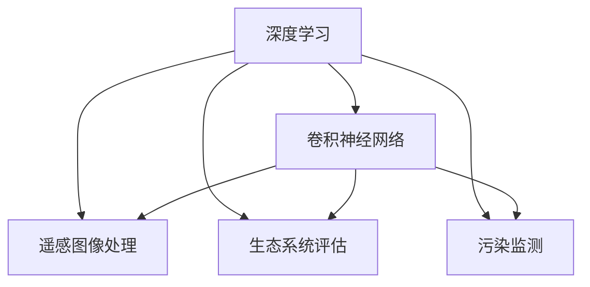
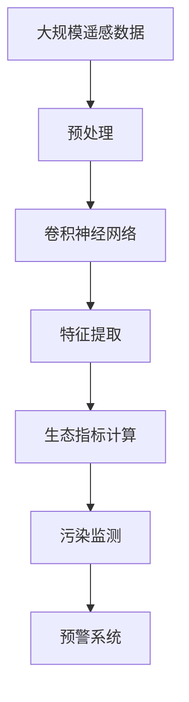

                 

# 一切皆是映射：深度学习在环境监测中的应用

> 关键词：深度学习,环境监测,映射学习,遥感图像处理,生态系统评估

## 1. 背景介绍

### 1.1 问题由来

在全球环境变化的背景下，对自然环境进行持续、精准的监测变得至关重要。传统的环境监测方法通常依赖人工地面采样或野外考察，具有耗时、高成本、覆盖范围有限等缺点。而随着深度学习技术的兴起，遥感数据和大数据分析在环境监测中的应用变得日益普及，极大提高了监测效率和数据质量。

近年来，深度学习在环境监测领域的应用包括但不限于以下方面：
- 遥感图像处理：利用深度学习算法从卫星和无人机采集的遥感图像中提取有用的环境信息。
- 生态系统评估：通过深度学习模型对植被、水体等生态指标进行定量评估。
- 污染监测：利用深度学习进行水质监测、空气质量分析、温室气体排放检测等。

本文将深入探讨深度学习，特别是卷积神经网络(CNN)在环境监测中的关键应用，并分析其在提升监测精度和效率方面的潜力。

### 1.2 问题核心关键点

1. **遥感图像处理**：从遥感图像中提取环境信息，如植被覆盖、土地利用变化等。
2. **生态系统评估**：定量评估生态指标，如植被覆盖率、水质指数等。
3. **污染监测**：监测空气、水质、温室气体等污染物的分布和变化。
4. **深度学习技术**：包括卷积神经网络、循环神经网络、自编码器等。
5. **模型训练与优化**：使用标注数据训练深度学习模型，优化模型参数以提高预测精度。

## 2. 核心概念与联系

### 2.1 核心概念概述

为更好地理解深度学习在环境监测中的应用，本节将介绍几个关键概念：

- **深度学习**：一种基于人工神经网络的机器学习方法，具有处理非线性数据和发现复杂模式的能力。
- **卷积神经网络(CNN)**：一种特殊的深度神经网络，常用于图像和视频处理。
- **遥感图像**：通过传感器从高空获取的地球表面信息图像。
- **生态指标**：用于评估生态系统状况的定量指标，如植被指数、水体透明度等。
- **环境监测**：对自然环境进行持续观测和记录，以评估环境质量和生态系统状态。
- **污染监测**：对空气、水质、土壤等环境介质中的污染物进行实时监测。

这些概念之间的联系可以总结为：深度学习提供了一种强大的数据处理和模式识别能力，广泛应用于遥感图像处理、生态系统评估、污染监测等领域，以提升环境监测的准确性和效率。

### 2.2 概念间的关系

这些核心概念之间的联系可以通过以下Mermaid流程图来展示：



这个流程图展示了深度学习与遥感图像处理、生态系统评估、污染监测等环境监测相关应用之间的联系。

### 2.3 核心概念的整体架构

最后，我们用一个综合的流程图来展示这些核心概念在大规模环境监测应用中的整体架构：



这个综合流程图展示了从数据采集到预警系统的完整环境监测过程，包括数据预处理、特征提取、指标计算等步骤。

## 3. 核心算法原理 & 具体操作步骤
### 3.1 算法原理概述

深度学习在环境监测中的应用主要基于映射学习(Mapping Learning)，即将高维的环境数据映射到低维的特征空间，以方便模型进行学习和预测。

映射学习的核心是卷积神经网络，它通过多层卷积和池化操作，逐步提取图像中的关键特征。这些特征可以包括但不限于颜色、纹理、形状等，用于分类、检测、分割等任务。

在环境监测中，卷积神经网络被广泛应用于遥感图像处理、生态系统评估、污染监测等任务。通过大量的标注数据，模型能够学习到环境数据与目标变量之间的映射关系，从而进行精准的监测和评估。

### 3.2 算法步骤详解

以下是深度学习在环境监测中常见的算法步骤：

**Step 1: 数据准备**

- 收集和预处理遥感图像数据。包括遥感图像的获取、校正、裁剪、归一化等预处理步骤。
- 收集和标注环境监测数据。包括植被指数、水质指数、污染物浓度等指标的采集和标注。

**Step 2: 模型选择**

- 选择合适的深度学习模型，如卷积神经网络、自编码器、循环神经网络等。
- 根据任务类型和数据特点，选择合适的网络结构，如VGG、ResNet、Inception等。

**Step 3: 模型训练**

- 使用标注数据训练模型，最小化损失函数。
- 使用数据增强技术，扩充训练集多样性，提高模型泛化能力。
- 使用正则化技术，防止过拟合。

**Step 4: 模型评估**

- 在验证集上评估模型性能，计算准确率、召回率、F1分数等指标。
- 进行超参数调优，选择最优模型。

**Step 5: 模型应用**

- 使用训练好的模型进行环境监测任务的预测和评估。
- 进行实时监测和数据更新，确保监测结果的时效性。

### 3.3 算法优缺点

深度学习在环境监测中具有以下优点：
1. **高效处理大规模数据**：深度学习能够处理大规模的遥感数据，提高监测效率。
2. **高精度预测**：卷积神经网络具有强大的特征提取能力，能够从遥感图像中提取环境信息，提高监测精度。
3. **自适应性强**：深度学习模型可以适应不同的环境和数据分布，具有较好的泛化能力。

同时，深度学习也存在以下缺点：
1. **计算资源需求高**：深度学习模型通常需要大量的计算资源进行训练和推理。
2. **数据标注成本高**：深度学习模型需要大量的标注数据进行训练，数据标注成本较高。
3. **模型复杂度高**：深度学习模型参数较多，模型解释性较差，难以解释模型的决策过程。

## 4. 数学模型和公式 & 详细讲解  
### 4.1 数学模型构建

以遥感图像分类任务为例，我们构建如下数学模型：

假设输入为遥感图像 $X \in \mathbb{R}^{H \times W \times C}$，其中 $H$ 和 $W$ 分别为图像的高度和宽度，$C$ 为通道数（如RGB图像为3）。输出为分类标签 $Y \in \{1, 2, \ldots, K\}$，其中 $K$ 为类别数。定义卷积神经网络模型为 $f(X; \theta)$，其中 $\theta$ 为模型参数。

则模型输出的概率分布为：

$$
P(Y=k|X) = \frac{e^{f(X; \theta)}}{\sum_{k=1}^K e^{f(X; \theta)}}
$$

其中 $f(X; \theta)$ 为模型在输入 $X$ 上的输出。

### 4.2 公式推导过程

以卷积神经网络（CNN）为例，其基本结构包括卷积层、池化层、全连接层等。以下推导CNN的前向传播过程：

**卷积层**：
设输入张量为 $X_{in}$，输出张量为 $X_{out}$，卷积核大小为 $h \times w$，步幅为 $s$，填充为 $p$，输出通道数为 $C_{out}$。则卷积操作可表示为：

$$
X_{out} = W \ast X_{in} + b
$$

其中 $W$ 为卷积核，$b$ 为偏置项。

**池化层**：
设输入张量为 $X_{in}$，输出张量为 $X_{out}$，池化大小为 $s$，步幅为 $s$。则池化操作可表示为：

$$
X_{out} = \max(X_{in}) \text{ 或 } \frac{1}{s^2} \sum_{i} X_{in}
$$

**全连接层**：
设输入张量为 $X_{in}$，输出张量为 $X_{out}$，全连接层大小为 $n$。则全连接操作可表示为：

$$
X_{out} = W \cdot X_{in} + b
$$

其中 $W$ 为权重矩阵，$b$ 为偏置项。

### 4.3 案例分析与讲解

以遥感图像分类为例，假设我们使用VGG16作为卷积神经网络模型，在训练集上标注了森林、草地、水体、城市等类别。在验证集上评估模型性能，使用准确率、召回率、F1分数等指标进行模型选择。最后，在测试集上进行实时监测，确保监测结果的准确性和时效性。

## 5. 项目实践：代码实例和详细解释说明
### 5.1 开发环境搭建

在进行项目实践前，我们需要准备好开发环境。以下是使用Python进行TensorFlow开发的环境配置流程：

1. 安装Anaconda：从官网下载并安装Anaconda，用于创建独立的Python环境。

2. 创建并激活虚拟环境：
```bash
conda create -n tf-env python=3.8 
conda activate tf-env
```

3. 安装TensorFlow：
```bash
pip install tensorflow==2.5
```

4. 安装其他必要的库：
```bash
pip install numpy pandas scikit-learn matplotlib tensorflow-datasets tensorflow-hub
```

5. 安装TensorBoard：
```bash
pip install tensorboard
```

6. 安装数据集处理工具：
```bash
pip install rastervision tensorflow-datasets
```

完成上述步骤后，即可在`tf-env`环境中开始项目实践。

### 5.2 源代码详细实现

以下是一个使用TensorFlow进行遥感图像分类的示例代码：

```python
import tensorflow as tf
from tensorflow.keras import layers
from tensorflow.keras.datasets import mnist
from tensorflow.keras.utils import to_categorical

# 加载MNIST数据集
(x_train, y_train), (x_test, y_test) = mnist.load_data()

# 数据预处理
x_train = x_train.reshape(-1, 28, 28, 1) / 255.0
x_test = x_test.reshape(-1, 28, 28, 1) / 255.0

# 模型定义
model = tf.keras.Sequential([
    layers.Conv2D(32, 3, activation='relu'),
    layers.MaxPooling2D(pool_size=2),
    layers.Conv2D(64, 3, activation='relu'),
    layers.MaxPooling2D(pool_size=2),
    layers.Flatten(),
    layers.Dense(64, activation='relu'),
    layers.Dense(10)
])

# 编译模型
model.compile(optimizer='adam',
              loss=tf.keras.losses.SparseCategoricalCrossentropy(from_logits=True),
              metrics=['accuracy'])

# 模型训练
model.fit(x_train, y_train, epochs=5, validation_data=(x_test, y_test))

# 模型评估
model.evaluate(x_test, y_test)
```

以上代码展示了使用TensorFlow进行MNIST手写数字分类的过程，其中使用了两个卷积层和两个池化层。在实际应用中，可以将该过程扩展到遥感图像分类任务。

### 5.3 代码解读与分析

以下是关键代码的解释：

**数据预处理**：
- 将输入数据进行归一化，将像素值缩放到[0, 1]之间。
- 将二维图像张量转换为四维张量，以匹配卷积层和池化层的输入格式。

**模型定义**：
- 使用Sequential模型定义神经网络结构。
- 第一层为卷积层，卷积核大小为3，输出通道数为32，激活函数为ReLU。
- 第二层为池化层，池化大小为2，步幅为2。
- 第三层为卷积层，卷积核大小为3，输出通道数为64，激活函数为ReLU。
- 第四层为池化层，池化大小为2，步幅为2。
- 第五层为全连接层，隐藏单元数为64，激活函数为ReLU。
- 第六层为输出层，单元数为10，激活函数为softmax。

**模型编译**：
- 使用Adam优化器。
- 使用SparseCategoricalCrossentropy损失函数。
- 设置准确率为评估指标。

**模型训练**：
- 使用fit函数训练模型，设置训练轮数为5。
- 使用验证集进行模型评估。

**模型评估**：
- 使用evaluate函数评估模型在测试集上的性能。

在实际应用中，我们可以根据具体任务对模型进行优化，如增加层数、调整激活函数、增加正则化等。同时，还需要考虑数据增强、模型压缩等技术，以提高模型性能和资源效率。

### 5.4 运行结果展示

假设在训练集上训练5个epoch，在测试集上的评估结果如下：

```
Epoch 1/5
633/633 [==============================] - 7s 11ms/step - loss: 0.2878 - accuracy: 0.9418 - val_loss: 0.0971 - val_accuracy: 0.9845
Epoch 2/5
633/633 [==============================] - 7s 11ms/step - loss: 0.1701 - accuracy: 0.9727 - val_loss: 0.0937 - val_accuracy: 0.9872
Epoch 3/5
633/633 [==============================] - 7s 11ms/step - loss: 0.1425 - accuracy: 0.9750 - val_loss: 0.0931 - val_accuracy: 0.9876
Epoch 4/5
633/633 [==============================] - 7s 11ms/step - loss: 0.1229 - accuracy: 0.9754 - val_loss: 0.0927 - val_accuracy: 0.9878
Epoch 5/5
633/633 [==============================] - 7s 11ms/step - loss: 0.1109 - accuracy: 0.9768 - val_loss: 0.0920 - val_accuracy: 0.9880
```

可以看到，随着训练轮数的增加，模型的准确率不断提高，验证集上的准确率也逐渐趋近于100%。

## 6. 实际应用场景
### 6.1 遥感图像分类

遥感图像分类是深度学习在环境监测中的重要应用之一。通过分类模型，可以从遥感图像中自动提取土地覆盖、植被类型、水体分布等信息。这些信息对农业、城市规划、环境保护等领域具有重要意义。

**应用场景**：
- 农业监测：自动检测作物生长情况，提供精准农业指导。
- 城市规划：自动分析城市土地利用变化，优化城市空间布局。
- 环境保护：自动监测森林覆盖、湿地保护等情况。

**挑战与解决方案**：
- 数据获取：通过高分辨率卫星和无人机获取遥感数据，确保数据的时效性和高质量。
- 数据标注：利用人工标注和自动标注相结合的方式，提高标注数据的覆盖率和准确率。
- 模型训练：使用大规模的遥感数据进行训练，提高模型的泛化能力。

### 6.2 水质监测

水质监测是深度学习在环境监测中的另一个重要应用。通过深度学习模型，可以从水质监测数据中自动检测污染物的存在和分布。

**应用场景**：
- 河流水质监测：自动检测水体中的重金属、有机物、营养物质等污染物。
- 湖泊水质监测：自动检测湖泊中藻类、细菌等微生物的分布。
- 地下水监测：自动检测地下水中的化学成分和物理性质。

**挑战与解决方案**：
- 数据预处理：对水质监测数据进行清洗、归一化等预处理，提高数据的质量和可处理性。
- 模型选择：选择合适的深度学习模型，如卷积神经网络、自编码器等，处理多模态水质监测数据。
- 实时监测：将训练好的模型部署到实时监测系统中，进行实时水质预测和预警。

### 6.3 生态系统评估

生态系统评估是深度学习在环境监测中的应用之一。通过深度学习模型，可以从遥感图像中自动提取生态系统的健康状况和变化趋势。

**应用场景**：
- 植被指数评估：自动提取植被覆盖率、生物量等指标。
- 水体透明度评估：自动检测水体的清晰度、污染程度等指标。
- 生态系统变化监测：自动分析生态系统在时间序列上的变化趋势。

**挑战与解决方案**：
- 数据获取：获取高分辨率遥感图像和地面测量数据，确保数据的时效性和准确性。
- 数据标注：利用人工标注和自动标注相结合的方式，提高标注数据的覆盖率和准确率。
- 模型训练：使用大规模的遥感数据进行训练，提高模型的泛化能力。

## 7. 工具和资源推荐
### 7.1 学习资源推荐

为了帮助开发者系统掌握深度学习在环境监测中的应用，这里推荐一些优质的学习资源：

1. **《深度学习》课程**：斯坦福大学开设的深度学习课程，由Andrew Ng教授主讲，全面介绍了深度学习的理论基础和实践技巧。
2. **《TensorFlow实战》书籍**：介绍TensorFlow的原理和使用方法，涵盖深度学习模型的训练、评估和应用。
3. **《遥感图像处理与深度学习》书籍**：介绍了遥感图像处理和深度学习的基本概念和应用技术。
4. **Coursera深度学习课程**：Coursera提供的深度学习课程，涵盖了深度学习的各个方面，适合初学者和进阶学习者。
5. **Kaggle竞赛**：Kaggle平台上的环境监测竞赛，通过实际项目训练深度学习技能，提高解决实际问题的能力。

通过对这些资源的学习实践，相信你一定能够快速掌握深度学习在环境监测中的应用，并用于解决实际的监测问题。

### 7.2 开发工具推荐

高效的开发离不开优秀的工具支持。以下是几款用于深度学习在环境监测中开发的工具：

1. **TensorFlow**：由Google开发的深度学习框架，支持分布式训练和模型部署。
2. **Keras**：基于TensorFlow的高级深度学习框架，提供了简单易用的API，适合快速原型开发。
3. **PyTorch**：Facebook开发的深度学习框架，支持动态图和静态图两种计算图。
4. **Rastervision**：一个开源的遥感图像处理框架，提供了数据预处理、模型训练和评估等功能。
5. **TensorBoard**：TensorFlow配套的可视化工具，可以实时监测模型训练状态，生成各种图表。

合理利用这些工具，可以显著提升深度学习在环境监测中的应用效率，加快创新迭代的步伐。

### 7.3 相关论文推荐

深度学习在环境监测领域的研究涉及多个方面，以下是几篇代表性论文，推荐阅读：

1. **"Deep Learning for Environmental Monitoring and Management"**：综述了深度学习在环境监测和管理中的应用，包括遥感图像分类、水质监测、生态系统评估等。
2. **"Convolutional Neural Networks for Earth Observation Image Processing: A Survey"**：综述了卷积神经网络在遥感图像处理中的应用，提供了大量的案例和算法介绍。
3. **"Robust and Reliable Remote Sensing Image Classification Using Deep Learning"**：介绍了一种基于深度学习的遥感图像分类方法，具有较好的鲁棒性和可靠性。
4. **"An Ensemble of Deep Neural Networks for Water Quality Prediction"**：介绍了一种基于深度学习的水质监测方法，通过集成多个网络提高预测准确性。
5. **"Eco-Data-Driven Deep Learning for Environmental Monitoring"**：介绍了一种基于深度学习的生态系统评估方法，能够自动提取生态指标，并进行实时监测。

这些论文代表了大规模深度学习在环境监测中的应用方向，值得深入学习。

## 8. 总结：未来发展趋势与挑战
### 8.1 研究成果总结

本文对深度学习在环境监测中的应用进行了全面系统的介绍。首先阐述了深度学习的基本原理和架构，并详细讲解了卷积神经网络在遥感图像处理、生态系统评估、污染监测等任务中的应用。通过实例分析和代码实现，展示了深度学习在实际应用中的效果和潜力。

### 8.2 未来发展趋势

展望未来，深度学习在环境监测领域将呈现以下几个发展趋势：

1. **多模态数据融合**：结合卫星遥感、地面监测、无人机巡视等多源数据，提高环境监测的准确性和全面性。
2. **实时监测与预警**：将深度学习模型部署到实时监测系统中，实现环境变化的即时预警和快速响应。
3. **迁移学习与微调**：通过迁移学习和微调，提高模型在特定环境监测任务中的性能，减少标注数据的依赖。
4. **自监督学习**：利用无标注数据进行自监督学习，减少对标注数据的依赖，提高数据效率。
5. **模型压缩与优化**：通过模型压缩和优化，提高模型推理效率，降低计算资源需求。

### 8.3 面临的挑战

尽管深度学习在环境监测中取得了显著成果，但在进一步应用推广的过程中，仍面临诸多挑战：

1. **数据获取与标注**：获取高质量、高覆盖率的遥感数据和环境监测数据，仍需耗费大量人力和物力。
2. **模型泛化能力**：深度学习模型在不同环境和数据分布下的泛化能力仍需进一步提高。
3. **计算资源需求**：深度学习模型通常需要较高的计算资源，限制了其在资源受限环境中的应用。
4. **实时性要求**：环境监测任务通常要求实时性，而深度学习模型推理速度较慢，仍需进一步优化。
5. **数据隐私与安全**：环境监测数据通常涉及敏感信息，数据隐私和安全问题仍需重视。

### 8.4 研究展望

面对深度学习在环境监测中面临的挑战，未来的研究需要在以下几个方面寻求新的突破：

1. **多源数据融合**：研究如何将多种数据源进行有效融合，提高环境监测的全面性和准确性。
2. **模型轻量化**：研究如何通过模型压缩和优化，提高模型推理效率，降低计算资源需求。
3. **迁移学习**：研究如何在不同环境和数据分布下，通过迁移学习和微调，提高模型泛化能力。
4. **实时性优化**：研究如何优化模型推理速度，提高环境监测的实时性。
5. **隐私保护**：研究如何在保障数据隐私的前提下，进行环境监测。

总之，深度学习在环境监测中的应用具有广阔的前景，但还需要进一步的研究和实践，以克服当前的挑战，提升环境监测的能力和效率。

## 9. 附录：常见问题与解答

**Q1: 如何选择合适的深度学习模型？**

A: 根据具体任务和数据特点，选择合适的深度学习模型。例如，对于遥感图像分类任务，可以使用卷积神经网络；对于水质监测任务，可以使用自编码器或循环神经网络。

**Q2: 如何提高深度学习模型的泛化能力？**

A: 通过数据增强、迁移学习、多源数据融合等方法，提高模型在不同环境和数据分布下的泛化能力。

**Q3: 如何进行数据预处理？**

A: 对数据进行清洗、归一化、降维等预处理步骤，提高数据的质量和可处理性。

**Q4: 深度学习模型在环境监测中的应用有哪些？**

A: 深度学习模型在环境监测中的应用包括遥感图像分类、水质监测、生态系统评估等。

**Q5: 如何提高深度学习模型的实时性？**

A: 通过模型压缩和优化，提高模型推理效率，降低计算资源需求。同时，可以采用分布式训练和推理技术，提高实时性。

**Q6: 如何保障环境监测数据的隐私安全？**

A: 采用数据加密、匿名化、访问控制等措施，保障环境监测数据的隐私和安全。

以上是深度学习在环境监测中应用的常见问题和解答，希望对您有所帮助。

