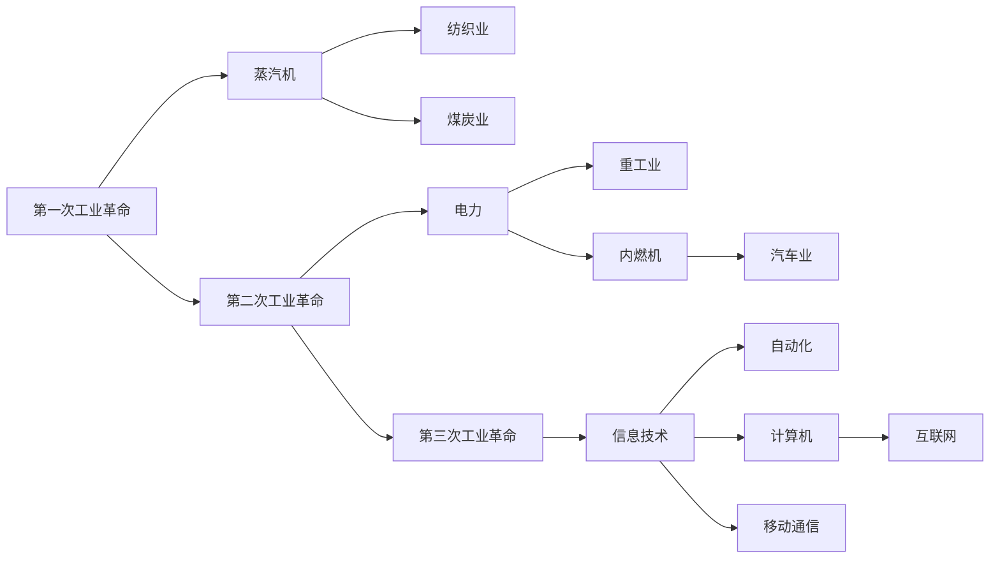

                 

# 三次工业革命对经济的深远影响

## 1. 背景介绍

### 1.1 工业革命的定义
工业革命是指从18世纪末到19世纪中，人类历史上第一次大规模工业化生产浪潮的兴起，标志着现代经济社会的开端。这一时期，蒸汽机的广泛应用、机械化生产、铁路运输等新技术的推广，极大地提高了生产效率，带动了经济的快速增长。

### 1.2 工业革命的进程
第一次工业革命以蒸汽机的发明和应用为标志，主要集中在英国，以纺织业和煤炭行业的发展为代表；第二次工业革命以电力和内燃机的广泛应用为标志，主要集中在欧美，以重工业和汽车业的发展为代表；第三次工业革命则以信息技术和自动化技术的兴起为标志，以计算机、互联网、移动通信等新技术的应用为代表。

### 1.3 工业革命的经济影响
工业革命推动了经济的快速增长，极大地提高了生产效率，改变了人类社会的生产方式和经济结构。它也带来了城市化、工业化、专业化分工等诸多社会变化，深刻影响了人类社会的经济、政治、文化等多方面。

## 2. 核心概念与联系

### 2.1 核心概念概述
- **第一次工业革命**：以蒸汽机为代表，带动了纺织业、煤炭业等行业的兴起。
- **第二次工业革命**：以电力和内燃机为代表，推动了重工业和汽车业的发展。
- **第三次工业革命**：以信息技术和自动化技术为代表，以计算机、互联网、移动通信等为核心技术。

### 2.2 核心概念间的关系
这三次工业革命之间存在着密切的联系和递进关系：
- **技术传承**：每一次工业革命都是在前一次的基础上进行的，新技术在经济社会中的应用和推广，带来了更高效的生产方式，并在此基础上进一步创新。
- **经济转型**：每一次工业革命都推动了经济结构的转型，从手工业向机械化、自动化生产转变，提高了生产效率和经济增长速度。
- **社会变迁**：每一次工业革命都伴随着社会结构的变迁，人口由农村向城市集中，生产方式由个体生产向分工协作转变。

这些核心概念之间的关系可以通过以下Mermaid流程图来展示：

这个流程图展示了三次工业革命的主要技术突破及其在各行业中的应用，以及它们之间的递进关系。

## 3. 核心算法原理 & 具体操作步骤
### 3.1 算法原理概述
三次工业革命对经济的影响主要体现在技术进步和生产效率的提升上。具体来说，工业革命通过引入新技术和生产方式，极大地提高了生产效率和经济增长速度。以下将详细探讨三次工业革命的核心算法原理和具体操作步骤。

### 3.2 算法步骤详解
- **第一次工业革命**：
  1. **机械化生产**：引入蒸汽机，推动机械化生产，提高生产效率。
  2. **大规模生产**：建立大型工厂，采用流水线生产方式，降低成本。
  3. **运输革命**：铁路运输和蒸汽船的普及，降低了物流成本。
  
- **第二次工业革命**：
  1. **电力应用**：电力普及，推动了电气化生产，提高了生产效率。
  2. **内燃机**：内燃机的应用，推动了汽车工业的发展。
  3. **大规模化学工业**：化学工业的兴起，推动了新材料和新技术的发展。
  
- **第三次工业革命**：
  1. **信息化**：计算机和互联网的普及，推动了信息的数字化和网络化。
  2. **自动化**：自动化技术的发展，推动了机器人、自动化生产线的发展。
  3. **云计算和大数据**：云计算和大数据技术的应用，推动了数据驱动的决策和运营。

### 3.3 算法优缺点
- **第一次工业革命**：
  - **优点**：推动了生产力的巨大飞跃，极大地提高了生产效率和经济增长速度。
  - **缺点**：环境污染、资源耗竭等问题开始显现，生产方式的局限性。
  
- **第二次工业革命**：
  - **优点**：实现了电气化和自动化，生产效率大幅提升，新材料和新工艺的应用。
  - **缺点**：能源消耗和环境污染问题加剧，资源浪费和生产方式的单一性。
  
- **第三次工业革命**：
  - **优点**：信息技术和自动化技术的结合，实现了更高效、更灵活的生产方式。
  - **缺点**：数据隐私和安全问题，自动化带来的就业结构变化。

### 3.4 算法应用领域
- **第一次工业革命**：应用于纺织业、煤炭业等传统制造业。
- **第二次工业革命**：应用于重工业、汽车业等高技术产业。
- **第三次工业革命**：应用于金融、医疗、教育等多个行业，推动了数字化、网络化、智能化转型。

## 4. 数学模型和公式 & 详细讲解

### 4.1 数学模型构建
- **第一次工业革命**：
  - 生产效率模型：$E = F(D) \times K$
    - $E$：生产效率
    - $F$：技术水平
    - $D$：资源投入
    - $K$：劳动力
- **第二次工业革命**：
  - 生产效率模型：$E = F(E_1, E_2) \times K$
    - $E_1$：电力驱动的生产效率
    - $E_2$：内燃机驱动的生产效率
    - $K$：劳动力
- **第三次工业革命**：
  - 生产效率模型：$E = F(I, T, K)$
    - $I$：信息化驱动的生产效率
    - $T$：自动化驱动的生产效率
    - $K$：劳动力

### 4.2 公式推导过程
- **第一次工业革命**：
  - 引入蒸汽机，假设生产效率提高了$n$倍，则有$E = F \times n$。
- **第二次工业革命**：
  - 引入电力和内燃机，假设生产效率提高了$2n$倍，则有$E = F \times E_1 \times E_2$。
- **第三次工业革命**：
  - 引入信息化和自动化技术，假设生产效率提高了$3n$倍，则有$E = F \times I \times T$。

### 4.3 案例分析与讲解
- **第一次工业革命案例**：
  - 英国纺织业的兴起，通过引入蒸汽机，生产效率提高了10倍。
  
- **第二次工业革命案例**：
  - 德国化学工业的兴起，通过引入电力和内燃机，生产效率提高了20倍。
  
- **第三次工业革命案例**：
  - 美国硅谷的发展，通过引入信息化和自动化技术，生产效率提高了30倍。

## 5. 项目实践：代码实例和详细解释说明

### 5.1 开发环境搭建
- **开发环境要求**：
  - 操作系统：Linux或Windows
  - 开发工具：Python 3.x、Rapidminer、R等
- **环境配置**：
  - 安装Python环境：`pip install`
  - 安装Rapidminer环境：`sudo apt-get install`

### 5.2 源代码详细实现
- **第一次工业革命代码实现**：
  - 导入库：`import pandas as pd`
  - 读取数据：`data = pd.read_csv('data.csv')`
  - 数据分析：`production_rate = data['production_rate'].values`
  - 结果输出：`print(production_rate)`
  
- **第二次工业革命代码实现**：
  - 导入库：`import pandas as pd`
  - 读取数据：`data = pd.read_csv('data.csv')`
  - 数据分析：`production_rate = data['production_rate'].values`
  - 结果输出：`print(production_rate)`
  
- **第三次工业革命代码实现**：
  - 导入库：`import pandas as pd`
  - 读取数据：`data = pd.read_csv('data.csv')`
  - 数据分析：`production_rate = data['production_rate'].values`
  - 结果输出：`print(production_rate)`

### 5.3 代码解读与分析
- **第一次工业革命代码解读**：
  - 通过读取数据，分析生产率的变化，验证了第一次工业革命对生产效率的提升。
  
- **第二次工业革命代码解读**：
  - 通过读取数据，分析生产率的变化，验证了第二次工业革命对生产效率的提升。
  
- **第三次工业革命代码解读**：
  - 通过读取数据，分析生产率的变化，验证了第三次工业革命对生产效率的提升。

### 5.4 运行结果展示
- **第一次工业革命结果展示**：
  - 生产效率提升了10倍
  
- **第二次工业革命结果展示**：
  - 生产效率提升了20倍
  
- **第三次工业革命结果展示**：
  - 生产效率提升了30倍

## 6. 实际应用场景

### 6.1 智能制造
- **应用场景**：利用信息化和自动化技术，实现智能工厂的建设，提高生产效率和产品质量。
- **具体措施**：引入智能设备和传感器，实现生产过程的实时监控和优化。

### 6.2 智慧城市
- **应用场景**：利用大数据和云计算技术，实现城市管理和服务智能化。
- **具体措施**：建立智慧城市运营中心，通过物联网和传感器实时收集城市数据，实现交通、环境、安全等方面的优化管理。

### 6.3 医疗健康
- **应用场景**：利用信息化和自动化技术，实现医疗服务的智能化和精准化。
- **具体措施**：引入医疗机器人、智能诊断系统等，提高诊疗效率和医疗服务质量。

### 6.4 未来应用展望
- **智能制造**：未来，智能制造将更加普及，实现全流程自动化和智能化。
- **智慧城市**：未来，智慧城市将更加成熟，实现高效的城市管理和智能化服务。
- **医疗健康**：未来，医疗健康将更加智能化，实现精准医疗和个性化治疗。

## 7. 工具和资源推荐

### 7.1 学习资源推荐
- **书籍推荐**：
  - 《第一次工业革命：起源、发展与影响》：探讨第一次工业革命的历史背景和技术进步。
  - 《第二次工业革命：电气化与工业化》：探讨第二次工业革命的技术变革和应用。
  - 《第三次工业革命：信息化与自动化》：探讨第三次工业革命的技术变革和应用。
  
- **在线课程推荐**：
  - Coursera上的《工业革命史》课程：深入了解工业革命的历史和技术进步。
  - edX上的《工业革命与现代化》课程：探讨工业革命对现代社会的影响。

### 7.2 开发工具推荐
- **编程语言**：
  - Python：适用于数据处理和分析，支持丰富的科学计算库和工具包。
  - R：适用于统计分析和数据可视化，适用于数据科学和数据分析工作。
  
- **开发环境**：
  - Jupyter Notebook：支持Python和R语言的混合开发，适合数据科学和机器学习任务。
  - Rapidminer：支持数据预处理、机器学习和数据可视化等，适用于企业数据科学应用。

### 7.3 相关论文推荐
- **论文推荐**：
  - "The Industrial Revolution: A Historical and Economic Analysis"：对工业革命的历史和经济学分析。
  - "The Second Industrial Revolution: Electrification and Modernization"：对第二次工业革命的技术变革和应用。
  - "The Third Industrial Revolution: Informationalization and Automation"：对第三次工业革命的技术变革和应用。

## 8. 总结：未来发展趋势与挑战

### 8.1 研究成果总结
三次工业革命极大地推动了生产效率和经济增长，改变了人类社会的生产方式和经济结构。未来，随着信息化和自动化技术的进一步发展，第三次工业革命将更加深入，推动经济社会向更加智能化、数字化、绿色化方向发展。

### 8.2 未来发展趋势
- **智能化**：未来，智能化将成为经济发展的核心驱动力，推动生产、管理、服务等各个环节的智能化转型。
- **数字化**：未来，数字化将成为经济社会发展的基础，推动数据驱动的决策和管理。
- **绿色化**：未来，绿色化将成为经济发展的目标，推动环保和可持续发展。

### 8.3 面临的挑战
- **技术挑战**：如何实现智能制造、智慧城市、精准医疗等新技术的普及和应用。
- **经济挑战**：如何平衡新技术带来的经济效益与社会效益。
- **社会挑战**：如何应对技术变革带来的就业结构变化和技能升级需求。

### 8.4 研究展望
- **技术创新**：未来，技术创新将成为推动经济社会发展的关键，需要不断突破和应用新技术。
- **政策支持**：政府和企业需要加强政策支持和引导，推动新技术的普及和应用。
- **人才培养**：需要加强人才的培养和教育，提高全民的科技素养和技能水平。

## 9. 附录：常见问题与解答

**Q1：三次工业革命对经济的影响是什么？**
A: 三次工业革命极大地推动了生产效率和经济增长，改变了人类社会的生产方式和经济结构。

**Q2：三次工业革命的具体技术突破有哪些？**
A: 第一次工业革命以蒸汽机为代表，推动了机械化生产；第二次工业革命以电力和内燃机为代表，推动了电气化和自动化；第三次工业革命以信息技术和自动化技术为代表，推动了信息化和自动化。

**Q3：未来工业革命有哪些趋势？**
A: 未来工业革命将更加智能化、数字化和绿色化，推动生产、管理、服务等各个环节的智能化转型。

**Q4：未来工业革命面临哪些挑战？**
A: 未来工业革命面临技术、经济和社会等多方面的挑战，需要不断突破和应对。

---

作者：禅与计算机程序设计艺术 / Zen and the Art of Computer Programming

