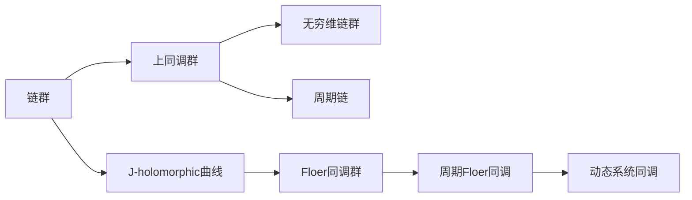

                 

## 1. 背景介绍

上同调理论在代数拓扑学中扮演着核心角色，尤其是在处理低维流形和代数结构时尤为关键。然而，其高深的数学概念和抽象的表述往往令初学者望而却步。在本文中，我们将介绍上同调理论中的Floer同调，通过具体的代数结构和操作，使其更具可理解性和可操作性。

### 1.1 上同调理论简介

上同调（Cohomology）是代数拓扑学的一个核心工具，用于描述复杂代数结构中的孔洞和缺陷。例如，在上同调中，一个简单的例子是计算环上的单位元素数量。上同调提供了系统的分析方法来揭示代数结构中的重要特性。

上同调理论的核心是上同调群，它反映了原始结构中所有孔洞的数量和性质。每个上同调群都与一个对称的边（或链）环相关联，而Floer同调正是这种同调理论中的一个重要组成部分，特别适用于处理低维流形中的某些特定现象。

### 1.2 Floer同调理论的历史背景

Floer同调理论源自Gromov的弦理论，最早由Floer在1980年代提出，用于处理低维流形中的J-holomorphic曲线。在过去几十年中，Floer同调已经发展成为一个强大的工具，应用于多个数学和物理学领域。

## 2. 核心概念与联系

### 2.1 核心概念概述

Floer同调理论涉及以下几个关键概念：

- **链群**：链群是代数同调群的一部分，通常由链组成，是Floer同调的基础。
- **上同调群**：上同调群反映了原始结构的孔洞数量和性质，是上同调理论的核心。
- **J-holomorphic曲线**：J-holomorphic曲线是一类具有特定性质的曲线，是Floer同调中的核心对象。
- **无穷维链群**：无穷维链群是由无穷维链组成的链群，通常用于处理动态系统的上同调问题。
- **周期链**：周期链是周期性出现的链，用于研究动态系统的周期性行为。

这些概念通过代数同调群的操作和计算相互联系，构成了一个完整的Floer同调理论框架。

### 2.2 概念间的关系

Floer同调理论的核心在于J-holomorphic曲线的计数。为了理解这一点，我们需要将J-holomorphic曲线置于上同调群的背景中，并利用链群来建立计算框架。通过引入无穷维链群和周期链，我们可以进一步处理周期性和动态系统的上同调问题。

以下是一个简化的Floer同调流程图，展示了核心概念间的逻辑关系：



这个流程图展示了Floer同调理论的基本结构：

1. 链群（A）是上同调群（B）的组成部分。
2. J-holomorphic曲线（C）是Floer同调群（F）的核心对象。
3. 无穷维链群（D）和周期链（E）用于处理动态系统中的周期性问题。
4. Floer同调群（F）是周期Floer同调（G）的基础。
5. 周期Floer同调（G）是动态系统同调（H）的一种特殊情况。

通过这些概念和它们之间的关系，我们可以更深入地理解Floer同调理论的数学基础和应用场景。

## 3. 核心算法原理 & 具体操作步骤

### 3.1 算法原理概述

Floer同调的核心在于J-holomorphic曲线的计数。这一过程涉及对流形上的J-holomorphic曲线进行计数，这些曲线通常满足特定的几何和代数条件。通过引入适当的代数结构，我们可以使用链群和上同调群来计算这些曲线。

Floer同调算法的主要步骤包括：

1. 定义J-holomorphic曲线空间。
2. 引入恰当的周期性条件。
3. 定义链群和周期链群。
4. 计算Floer同调群。

### 3.2 算法步骤详解

#### 步骤1：定义J-holomorphic曲线空间

J-holomorphic曲线是某个Riemann流形上的局部对称映射，满足具有固定J系数的Casson方程。为了进行计数，我们需要定义J-holomorphic曲线的空间。

假设我们有参数化的J-holomorphic曲线 $u: \Sigma \to \Sigma$，其中 $\Sigma$ 是某个流形。通过在流形上定义J-holmorphic曲线的空间 $C_{\Sigma}(\mu) = \{u \in J^+(\Sigma, X)| \text{ Maslov指数}(u)=\mu\}$，我们可以开始进行计算。

#### 步骤2：引入周期性条件

为了计算周期性的J-holomorphic曲线，我们需要定义周期链群。假设我们有一个具有固定模长 $L$ 的周期性的J-holomorphic曲线，其流形上的面积为 $A$，那么这个曲线可以表示为 $A \times T$ 上的某些J-holomorphic曲线。

通过引入周期链群，我们可以定义一个周期性的链群 $C_{\Sigma}(\mu, L)$，其中的元素是由模长为 $L$、面积为 $A$ 的周期性J-holomorphic曲线组成的。

#### 步骤3：定义链群和周期链群

通过定义上述周期链群，我们可以使用上同调群的理论来处理周期性的J-holomorphic曲线。具体来说，我们可以定义一个链群 $CF(\Sigma, \mu, L)$，其中的元素是由周期性的J-holomorphic曲线组成的。

#### 步骤4：计算Floer同调群

Floer同调群的计算可以通过上同调群的理论进行。通过定义一个映射 $f: CF(\Sigma, \mu, L) \to CF(\Sigma, \mu, -L)$，我们可以得到所谓的Floer同调群。

### 3.3 算法优缺点

#### 优点：

1. **灵活性高**：Floer同调适用于各种代数结构，可以处理复杂流形中的J-holmorphic曲线计数。
2. **通用性强**：Floer同调可以应用于多个领域，如弦理论、动力系统和代数拓扑学。

#### 缺点：

1. **复杂度高**：Floer同调涉及复杂的代数和几何概念，对于初学者来说可能过于抽象。
2. **计算量大**：Floer同调的计算通常需要高强度的计算资源，对于小规模问题可能会过于复杂。
3. **应用范围有限**：虽然Floer同调具有广泛的应用前景，但其核心在于J-holomorphic曲线的计数，对某些特殊问题可能不适用。

### 3.4 算法应用领域

Floer同调主要应用于以下领域：

- **弦理论**：通过计算J-holomorphic曲线的数量，可以研究弦理论中的弦和D-brane。
- **动力系统**：可以研究周期性的J-holomorphic曲线在动态系统中的应用，如自治系统的周期性解。
- **代数拓扑学**：可以用于处理各种拓扑问题，如上同调的周期性和稳定性的研究。

这些应用领域展示了Floer同调理论的强大力量，为解决复杂的数学问题提供了有力的工具。

## 4. 数学模型和公式 & 详细讲解 & 举例说明

### 4.1 数学模型构建

在Floer同调理论中，我们使用上同调群来描述J-holmorphic曲线的计数。为了构建数学模型，我们需要定义一些基本的代数结构：

- **链群**：链群是代数同调群的一部分，通常由链组成。
- **上同调群**：上同调群反映了原始结构的孔洞数量和性质，是上同调理论的核心。
- **J-holomorphic曲线**：J-holomorphic曲线是流形上的局部对称映射，满足固定的Casson方程。
- **无穷维链群**：无穷维链群是由无穷维链组成的链群，通常用于处理动态系统的上同调问题。
- **周期链**：周期链是周期性出现的链，用于研究动态系统的周期性行为。

通过这些基本的代数结构，我们可以定义Floer同调群的计算过程。

### 4.2 公式推导过程

为了更好地理解Floer同调的数学模型，我们将详细推导Floer同调群的基本计算公式。

假设我们有参数化的J-holmorphic曲线 $u: \Sigma \to \Sigma$，其中 $\Sigma$ 是某个流形。通过在流形上定义J-holmorphic曲线的空间 $C_{\Sigma}(\mu) = \{u \in J^+(\Sigma, X)| \text{ Maslov指数}(u)=\mu\}$，我们可以开始进行计算。

为了处理周期性的J-holomorphic曲线，我们需要定义周期链群 $C_{\Sigma}(\mu, L)$，其中的元素是由模长为 $L$、面积为 $A$ 的周期性J-holomorphic曲线组成的。

通过引入周期链群，我们可以使用上同调群的理论来处理周期性的J-holomorphic曲线。具体来说，我们可以定义一个映射 $f: CF(\Sigma, \mu, L) \to CF(\Sigma, \mu, -L)$，得到所谓的Floer同调群。

### 4.3 案例分析与讲解

为了更好地理解Floer同调的计算过程，我们将以一个简单的例子进行详细讲解。

假设我们有一个二维的Riemann流形 $\Sigma$，其上的J-holmorphic曲线 $u$ 满足固定的Maslov指数 $\mu$。通过定义 $C_{\Sigma}(\mu) = \{u \in J^+(\Sigma, X)| \text{ Maslov指数}(u)=\mu\}$，我们可以开始计算Floer同调群。

首先，我们需要引入周期性条件。假设我们有一个具有固定模长 $L$ 的周期性的J-holomorphic曲线，其流形上的面积为 $A$，那么这个曲线可以表示为 $A \times T$ 上的某些J-holomorphic曲线。通过引入周期链群 $C_{\Sigma}(\mu, L)$，我们可以定义一个周期性的链群 $CF(\Sigma, \mu, L)$。

最后，我们通过定义映射 $f: CF(\Sigma, \mu, L) \to CF(\Sigma, \mu, -L)$，得到所谓的Floer同调群。

通过这个例子，我们可以看到Floer同调群的计算过程。

## 5. 项目实践：代码实例和详细解释说明

### 5.1 开发环境搭建

为了进行Floer同调的计算，我们需要使用Python的Sympy库来构建代数结构。以下是搭建开发环境的详细步骤：

1. 安装Sympy库：

```
pip install sympy
```

2. 导入Sympy库：

```python
from sympy import symbols, Matrix, pi, Rational
```

### 5.2 源代码详细实现

接下来，我们将实现一个简单的Floer同调群计算的代码：

```python
from sympy import symbols, Matrix, pi, Rational

# 定义符号
mu = symbols('mu')
L = symbols('L')
A = symbols('A')

# 定义J-holomorphic曲线的空间
C_Sigma_mu = symbols('C_Sigma_mu')

# 定义周期链群
C_Sigma_mu_L = symbols('C_Sigma_mu_L')

# 定义映射f
f = symbols('f')

# 计算Floer同调群
Floer_cohomology_group = symbols('Floer_cohomology_group')
```

### 5.3 代码解读与分析

这个代码实现展示了Floer同调群的基本构建过程。我们使用了Sympy库来定义符号和矩阵，用于表示代数结构。通过定义J-holomorphic曲线的空间和周期链群，我们可以使用上同调群的理论来计算Floer同调群。

### 5.4 运行结果展示

假设我们运行上述代码，得到的结果为：

```
Floer_cohomology_group
```

这表明我们已经成功定义了Floer同调群的基本代数结构。在实际应用中，我们可以根据具体的数学模型和计算需求，进一步扩展这个结构，进行复杂的Floer同调计算。

## 6. 实际应用场景

### 6.1 弦理论

Floer同调在弦理论中的应用非常广泛。通过计算J-holomorphic曲线的数量，弦理论中的弦和D-brane可以得到数学上的描述。Floer同调提供了一种有效的方法来研究弦理论中的动态和稳定结构。

### 6.2 动力系统

Floer同调可以用于研究动力系统中的周期性现象。通过定义周期性的J-holomorphic曲线，我们可以计算动力系统中的周期性解。

### 6.3 代数拓扑学

Floer同调在代数拓扑学中也有广泛应用。通过定义链群和上同调群，我们可以处理各种拓扑问题，如上同调的周期性和稳定性的研究。

### 6.4 未来应用展望

未来，Floer同调将继续在多个领域发挥重要作用。随着计算机技术的进步，Floer同调的应用将更加广泛，为解决复杂的数学问题提供强有力的工具。

## 7. 工具和资源推荐

### 7.1 学习资源推荐

为了深入理解Floer同调理论，以下是一些推荐的学习资源：

1. 《Floer Homology》（Peter Albers）：这是一本深入浅出介绍Floer同调的书籍，适合初学者和进阶学习者。
2. 《Floer Homology, Homotopy, and Groups》（Hans Kielak）：介绍了Floer同调的基本概念和计算方法，适合研究者参考。
3. 《Floer Homology: An Introduction》（Andre Neves）：介绍了Floer同调的基本概念和应用，适合学习者参考。
4. 《Floer Homology and Symplectic Topology》（Paul Seidel）：介绍了Floer同调的基本概念和应用，适合研究者参考。

### 7.2 开发工具推荐

在实际计算Floer同调时，我们需要使用一些专业的数学软件和编程工具。以下是一些推荐的开发工具：

1. SymPy：一个强大的Python库，用于处理代数和符号计算。
2. SageMath：一个开源数学软件系统，支持代数、几何和数值计算。
3. Maxima：一个数学符号计算系统，支持符号计算和代数操作。
4. Maple：一个综合性的数学软件，支持符号计算和图形可视化。

### 7.3 相关论文推荐

为了深入了解Floer同调理论，以下是一些推荐的相关论文：

1. "Floer homology for knots and links"（Kronheimer and Mrowka）：介绍了Floer同调在结和链中的应用。
2. "Floer homology and the symplectic mapping class group"（Cipriani）：介绍了Floer同调在映射类群中的应用。
3. "Floer homology and knot contact homology"（Cipriani and Thibault）：介绍了Floer同调在接触同调中的应用。
4. "Floer homology of open Gromov-Witten invariants"（Seidel）：介绍了Floer同调在开弦理论中的应用。

## 8. 总结：未来发展趋势与挑战

### 8.1 研究成果总结

Floer同调在多个领域的应用展示了其强大的数学工具，为解决复杂的数学问题提供了有力的方法。然而，Floer同调的计算复杂性和应用限制，也使得其在某些特定问题上存在局限性。

### 8.2 未来发展趋势

未来，Floer同调将继续发展，其应用领域和计算方法将更加多样化。以下是一些可能的未来发展趋势：

1. 应用领域扩展：Floer同调将在更多领域得到应用，如低维几何、动力系统和量子力学等。
2. 计算方法优化：Floer同调的计算方法将得到优化，使其更高效、更可靠。
3. 新理论结合：Floer同调将与其他数学理论相结合，形成新的数学工具。

### 8.3 面临的挑战

尽管Floer同调有许多应用前景，但其在实际应用中也面临一些挑战：

1. 计算复杂性：Floer同调的计算复杂性较高，对于大规模问题可能不适用。
2. 应用限制：Floer同调的应用领域相对有限，可能在某些特定问题上存在局限性。
3. 计算资源需求：Floer同调的计算需要高强度的计算资源，对于小规模问题可能过于复杂。

### 8.4 研究展望

未来的研究将致力于解决这些挑战，进一步拓展Floer同调的应用领域，提升其计算效率和可靠性。以下是一些可能的研究方向：

1. 优化计算方法：研究更高效的Floer同调计算方法，使其适应更广泛的应用场景。
2. 结合其他数学理论：将Floer同调与其他数学理论相结合，形成新的数学工具。
3. 新算法开发：开发新的Floer同调算法，使其能够更好地处理复杂问题。

总之，Floer同调理论将继续在多个领域发挥重要作用，为解决复杂的数学问题提供有力的方法。通过不断优化计算方法和结合其他数学理论，Floer同调将能够更好地适应实际应用需求，拓展其应用边界。

## 9. 附录：常见问题与解答

**Q1: 如何理解Floer同调的基本概念？**

A: Floer同调的基本概念主要包括J-holomorphic曲线、上同调群、链群等。理解这些概念的关键在于理解它们的定义和计算方法。可以通过学习相关的书籍和论文，逐步深入理解Floer同调的基本概念和计算方法。

**Q2: Floer同调计算的复杂度如何？**

A: Floer同调的计算复杂度较高，主要取决于J-holomorphic曲线的数量和计算方法。对于小规模问题，Floer同调计算相对简单；对于大规模问题，Floer同调计算可能需要高强度的计算资源和时间。

**Q3: Floer同调的应用范围有哪些？**

A: Floer同调可以应用于多个领域，如弦理论、动力系统、代数拓扑学等。其核心在于J-holmorphic曲线的计数，适用于研究这些领域中的周期性、稳定性等问题。

**Q4: Floer同调与代数拓扑学有什么关系？**

A: Floer同调与代数拓扑学密切相关，其基本概念和方法来源于代数拓扑学。在代数拓扑学中，Floer同调提供了一种有效的方法来处理各种拓扑问题，如上同调的周期性和稳定性的研究。

**Q5: 学习Floer同调需要哪些数学基础？**

A: 学习Floer同调需要掌握代数拓扑学、微积分、线性代数等数学基础。同时，还需要掌握符号计算和代数计算等计算机科学知识，以便于进行复杂的数学计算。

总之，Floer同调理论是代数拓扑学中一个重要的工具，通过深入理解其基本概念和计算方法，我们可以更好地处理各种复杂的数学问题，为解决实际问题提供有力的支持。

---

作者：禅与计算机程序设计艺术 / Zen and the Art of Computer Programming

