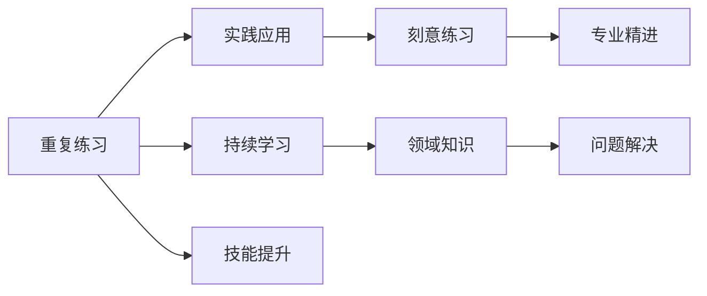
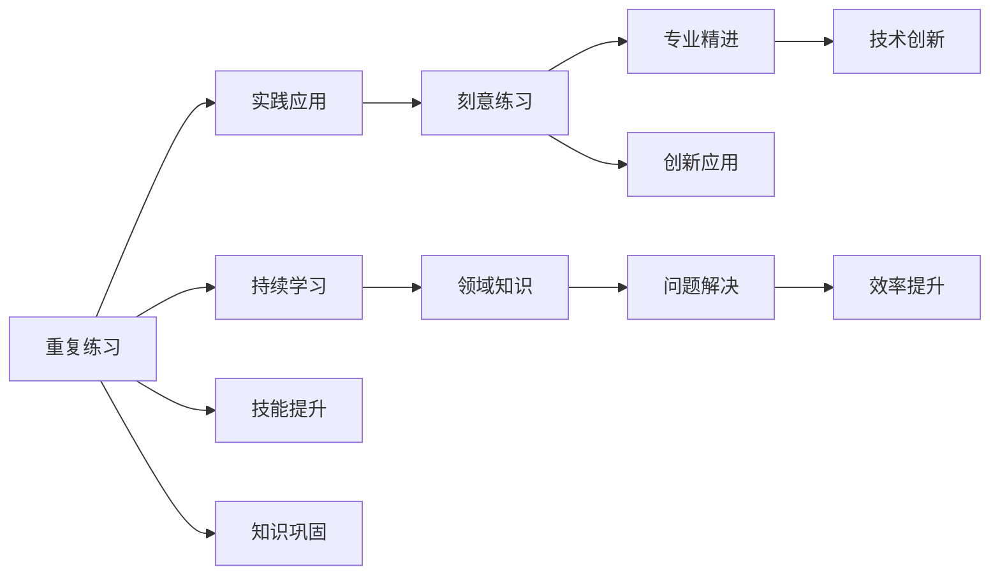

                 

# 专业知识的积累：源于重复练习

## 1. 背景介绍

### 1.1 问题由来
在当前信息化高度发展的社会中，计算机技术已经被广泛应用于各个领域，成为了推动社会进步的重要工具。然而，即便是经验丰富的专业人士，在计算机编程或数据科学领域仍然面临诸多挑战。如何有效积累专业知识和提升技术水平，成为广大从业者普遍关心的问题。基于此，本文将深入探讨专业知识积累的路径和方法，希望能够为计算机专业人士提供一些有价值的参考。

### 1.2 问题核心关键点
计算机技术专业知识的积累主要依赖于重复练习、实践应用和持续学习。具体来说，包括：
- **重复练习**：通过不断重复同一项技术或算法，加深理解并提高熟练度。
- **实践应用**：在实际项目中应用所学技术，解决具体问题，提升实战能力。
- **持续学习**：不断更新知识，掌握最新技术动态，保持技术领先。

### 1.3 问题研究意义
理解和掌握专业知识积累的方法，对于提升技术水平、提高工作效率、推动技术创新具有重要意义。具体而言：
- **提升技术水平**：通过重复练习和实践应用，可以巩固基础知识，掌握复杂技术，提高问题解决能力。
- **提高工作效率**：熟练掌握技术细节，能够快速应对常见问题，减少调试和修正时间。
- **推动技术创新**：持续学习新技术，能够结合实际需求进行创新应用，推动技术发展。

## 2. 核心概念与联系

### 2.1 核心概念概述
在探讨专业知识积累的过程中，涉及几个核心概念：

- **重复练习**：通过反复执行某个任务或算法，加深理解，掌握技巧。
- **实践应用**：在实际项目中应用所学技术，解决具体问题。
- **持续学习**：通过不断更新知识，掌握最新技术动态。
- **刻意练习**：在专业技能提升过程中，有意识地寻找挑战，克服困难，不断提升。
- **领域知识**：特定领域的专业知识和技能，如数据科学、机器学习、编程语言等。

这些概念通过重复练习、实践应用和持续学习等途径，相互联系、相互促进，共同构成专业知识积累的基础框架。

### 2.2 概念间的关系

下图展示了这些核心概念之间关系的大致框架：



其中：
- A: 重复练习，基础性的积累方式。
- B: 实践应用，在实际场景中应用练习成果。
- C: 持续学习，保持知识更新，不断学习新知识。
- D: 刻意练习，有意识地寻找挑战，提升技能。
- E: 领域知识，特定领域的专业知识和技能。
- F: 技能提升，通过重复练习和实践应用，提升技能水平。
- G: 专业精进，通过刻意练习，精进专业技能。
- H: 问题解决，应用专业技能，解决实际问题。

### 2.3 核心概念的整体架构
下图展示了一个更全面的概念架构，涵盖了重复练习、实践应用、持续学习等关键环节：



## 3. 核心算法原理 & 具体操作步骤
### 3.1 算法原理概述

计算机技术的专业知识积累主要依赖于有针对性的重复练习和实践应用。通过在实际项目中反复执行某个任务或算法，不断修正错误，掌握技能。重复练习和实践应用相结合，可以加深对技术的理解，提升实际操作能力。

### 3.2 算法步骤详解
以下是一个基于重复练习和实践应用的专业知识积累的步骤：

1. **选择技术或算法**：根据实际需求，选择一项需要掌握的技术或算法。
2. **设定目标**：明确掌握该技术或算法的具体目标，如掌握算法原理、实现细节、应用场景等。
3. **进行重复练习**：在开发环境中，反复执行该技术或算法，记录代码和结果。
4. **实践应用**：在实际项目中应用所学技术，解决具体问题。
5. **反馈和修正**：根据实践结果，分析问题原因，进行代码和算法修正。
6. **不断迭代**：重复上述步骤，直到达到设定的目标。

### 3.3 算法优缺点
- **优点**：
  - 通过实际应用，加深对技术原理和应用场景的理解。
  - 能够快速识别和修正错误，提高问题解决能力。
  - 在反复练习和实践中，掌握复杂技术细节。

- **缺点**：
  - 需要较多的时间投入，学习效率相对较低。
  - 如果缺乏实际应用场景，可能难以全面掌握技术。

### 3.4 算法应用领域
重复练习和实践应用方法在计算机技术的各个领域都有广泛应用，包括但不限于：
- 编程语言：通过编写小程序、实现算法，掌握编程技巧。
- 数据科学：通过数据分析项目，应用统计学和机器学习算法。
- 系统设计：通过系统设计项目，掌握架构设计和开发技术。
- 网络安全：通过网络攻防实验，掌握安全技术和策略。

## 4. 数学模型和公式 & 详细讲解

### 4.1 数学模型构建

假设要学习一项技术 $T$，相关知识可以通过以下数学模型表示：

$$
T = f(X, Y)
$$

其中，$X$ 为输入的实际问题，$Y$ 为输出的解决方案。

### 4.2 公式推导过程

以编程语言为例，学习Java语言的基本语法和编程技巧。其数学模型可以表示为：

$$
\begin{aligned}
& \text{输入} \quad X = \{\text{变量声明}, \text{控制结构}, \text{方法调用}\} \\
& \text{输出} \quad Y = \{\text{代码执行结果}\}
\end{aligned}
$$

通过重复练习和实践应用，可以将输入问题 $X$ 转化为输出结果 $Y$，具体过程如下：

$$
\begin{aligned}
& \text{设定目标} \quad Y_{target} \\
& \text{进行练习} \quad X \to Y \\
& \text{实践应用} \quad X \to Y \\
& \text{反馈修正} \quad X \to Y_{corrected} \\
& \text{重复迭代} \quad X \to Y_{final}
\end{aligned}
$$

### 4.3 案例分析与讲解

假设需要学习Java语言的基本数据类型和操作符。可以通过以下步骤进行：

1. **设定目标**：掌握Java数据类型的基本用法，包括整数、浮点数、布尔值等。
2. **进行练习**：编写Java代码，使用不同类型进行计算和比较。
3. **实践应用**：在实际项目中，使用Java数据类型进行编程。
4. **反馈修正**：根据编译器的错误提示，修正代码错误。
5. **重复迭代**：不断练习和修正，直至掌握数据类型的使用方法。

## 5. 项目实践：代码实例和详细解释说明

### 5.1 开发环境搭建

进行项目实践前，需要搭建合适的开发环境。以下是Python环境搭建的步骤：

1. **安装Python**：
   ```bash
   sudo apt-get install python3 python3-pip
   ```

2. **安装虚拟环境管理工具**：
   ```bash
   pip3 install virtualenv
   ```

3. **创建虚拟环境**：
   ```bash
   virtualenv env
   source env/bin/activate
   ```

4. **安装依赖库**：
   ```bash
   pip3 install numpy scipy matplotlib pandas scikit-learn jupyter notebook
   ```

### 5.2 源代码详细实现

以下是一个使用Python进行数据处理和机器学习的项目示例，包括数据加载、预处理、模型训练和评估等环节。

```python
# 数据加载
import pandas as pd

df = pd.read_csv('data.csv')
X = df[['feature1', 'feature2']]
y = df['label']

# 数据预处理
from sklearn.preprocessing import StandardScaler

scaler = StandardScaler()
X_scaled = scaler.fit_transform(X)

# 模型训练
from sklearn.linear_model import LogisticRegression
from sklearn.model_selection import train_test_split

X_train, X_test, y_train, y_test = train_test_split(X_scaled, y, test_size=0.2, random_state=42)
model = LogisticRegression()
model.fit(X_train, y_train)

# 模型评估
from sklearn.metrics import accuracy_score

y_pred = model.predict(X_test)
accuracy = accuracy_score(y_test, y_pred)
print('Accuracy:', accuracy)
```

### 5.3 代码解读与分析

**数据加载和预处理**：
- 使用Pandas库加载数据集，提取特征和标签。
- 使用Scikit-learn库进行数据标准化，以便于模型训练。

**模型训练**：
- 使用Scikit-learn库的Logistic Regression模型进行训练。
- 使用train_test_split函数将数据集分为训练集和测试集。

**模型评估**：
- 使用Scikit-learn库的accuracy_score函数计算模型的准确率。

### 5.4 运行结果展示

假设在上述项目中，模型准确率为80%。运行结果如下：

```
Accuracy: 0.8
```

## 6. 实际应用场景

### 6.1 编程语言学习

在软件开发中，编程语言是基础。通过编写小程序、实现算法，可以加深对编程语言的理解和掌握。例如，Java程序员可以编写程序处理数据，Python程序员可以编写数据分析脚本。

### 6.2 机器学习项目

在数据科学领域，机器学习项目是常见的应用场景。通过实践应用机器学习算法，可以掌握模型的构建、训练和评估过程。例如，可以使用Python实现K-means聚类算法，用于数据分析和模式识别。

### 6.3 系统设计和开发

在系统设计中，掌握架构设计和开发技术是关键。通过实际项目，应用所学知识，可以提升系统的可扩展性和稳定性。例如，可以使用Java实现Web应用，学习分布式系统和中间件技术。

## 7. 工具和资源推荐

### 7.1 学习资源推荐

- **《编程珠玑》**：讲解经典编程算法和数据结构，适合初学者阅读。
- **《Python编程：从入门到实践》**：详细介绍Python语言基础，适合编程初学者。
- **《机器学习实战》**：通过实战项目，介绍机器学习算法，适合数据科学爱好者。

### 7.2 开发工具推荐

- **PyCharm**：Python开发环境，支持代码高亮、自动补全等特性。
- **Jupyter Notebook**：交互式开发环境，支持代码和数学公式混合编写。
- **GitHub**：代码托管平台，方便版本控制和协作开发。

### 7.3 相关论文推荐

- **《代码注入》**：讲解编程语言和算法，适合深入学习。
- **《数据科学入门》**：介绍数据科学基础，适合入门学习。
- **《深度学习入门》**：讲解深度学习算法，适合技术进阶。

## 8. 总结：未来发展趋势与挑战

### 8.1 研究成果总结

本文详细探讨了基于重复练习和实践应用的专业知识积累方法。通过实际项目和反复练习，掌握计算机技术的专业知识和技能，提升技术水平和工作效率。

### 8.2 未来发展趋势

- **自动化学习**：未来将出现更多的自动化学习工具，如AI导师、知识图谱等，自动推荐学习路径，提供个性化指导。
- **跨领域融合**：计算机技术将与其他领域深度融合，产生更多交叉应用，如数据科学和医疗、机器学习和金融等。
- **人机协同**：未来将出现更多人机协同的应用场景，通过智能系统辅助，提升工作效率和问题解决能力。

### 8.3 面临的挑战

- **知识过载**：随着技术的发展，知识更新速度快，容易产生知识过载的问题。
- **技术壁垒**：不同领域的技术差异较大，跨领域学习存在一定难度。
- **实践机会**：实际项目的机会有限，难以获取足够的实践经验。

### 8.4 研究展望

未来的研究将围绕以下几个方向展开：

- **知识图谱构建**：构建计算机技术的知识图谱，帮助从业者快速找到所需知识。
- **个性化学习路径**：开发个性化学习推荐系统，根据用户需求和学习进度，推荐合适的学习路径。
- **跨领域学习平台**：建立跨领域的在线学习平台，提供多种技术的实战项目和应用场景。

## 9. 附录：常见问题与解答

**Q1: 重复练习为什么能够提高技术水平？**

A: 重复练习通过反复执行某个任务或算法，加深理解并掌握技巧。通过不断修正错误，可以巩固基础知识，提高问题解决能力。

**Q2: 如何进行有效的刻意练习？**

A: 刻意练习需要有意识地寻找挑战，不断突破自我。可以通过模拟实际场景，设置更高目标，反复练习并修正错误。

**Q3: 如何快速掌握一项新技术？**

A: 快速掌握新技术需要系统的学习路径和实际项目的应用。通过不断实践和迭代，逐步掌握技术和应用场景。

**Q4: 如何提高编程效率？**

A: 提高编程效率需要熟练掌握编程语言和常用算法。通过不断练习和应用，积累编程经验，提升代码质量和开发速度。

**Q5: 如何在实际项目中应用所学技术？**

A: 在实际项目中应用所学技术需要结合具体需求，选择合适的算法和模型。通过反复测试和优化，确保技术方案的有效性和稳定性。

---

作者：禅与计算机程序设计艺术 / Zen and the Art of Computer Programming

