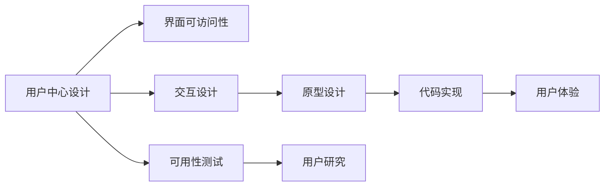
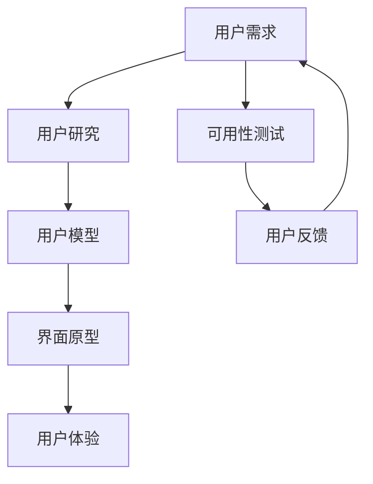
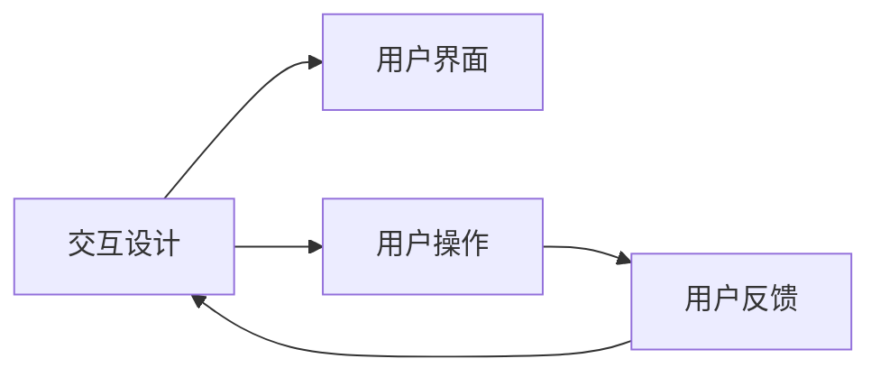
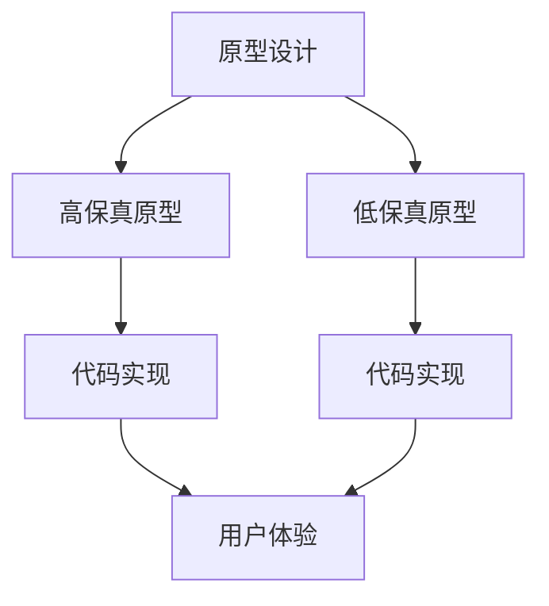
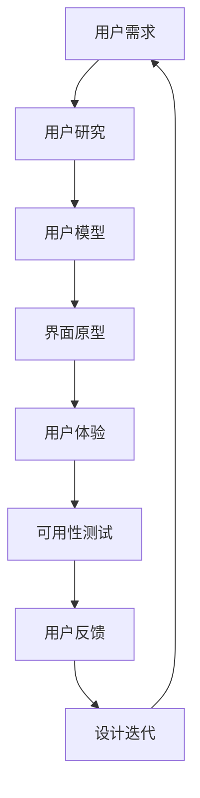

                 

# 人机交互与用户界面设计原理与代码实战案例讲解

> 关键词：人机交互,用户界面设计,UX/UI设计,UX/UI实战,用户行为分析,交互设计,原型设计,代码实现,用户体验设计,用户界面

## 1. 背景介绍

### 1.1 问题由来
随着科技的不断进步，人机交互（Human-Computer Interaction, HCI）和用户界面设计（User Interface Design, UI Design）在计算机科学和工程学中占据着越来越重要的地位。无论是智能手机、平板电脑还是计算机，用户界面都是连接用户和系统的桥梁。一个优秀的用户界面设计不仅能提升用户的使用体验，还能提高系统的效率和可操作性。

然而，随着用户对信息获取的效率和质量要求不断提高，现有的人机交互和用户界面设计方法面临着诸多挑战。例如，如何在不同设备和平台间实现无缝的用户体验？如何处理大规模数据流以提供个性化推荐？如何确保用户界面设计的易用性和可访问性？这些问题都需要我们不断探索和优化。

### 1.2 问题核心关键点
在人机交互与用户界面设计领域，核心关键点主要包括：

- **用户中心设计**：以用户为中心的设计理念，强调理解用户的需求和行为，提供符合用户心理和生理特征的界面设计。
- **界面可访问性**：确保用户界面对不同能力、背景和设备的用户都易于访问和使用。
- **交互设计**：设计直观、自然、高效的交互方式，使用户能够轻松完成任务。
- **原型设计**：通过原型构建来验证设计方案，发现并修正潜在问题。
- **代码实现**：将设计转化为可操作的代码，确保功能实现的正确性和用户体验的流畅性。

## 2. 核心概念与联系

### 2.1 核心概念概述

为了更好地理解人机交互和用户界面设计，本节将介绍几个密切相关的核心概念：

- **用户中心设计**：指在设计和开发过程中，始终将用户需求放在首位的设计方法。通过用户研究、可用性测试等手段，理解用户需求，设计符合用户心理和生理特性的界面。
- **界面可访问性**：确保所有用户，包括有视觉、听觉、运动障碍的用户，都能访问和使用界面，提供平等的使用机会。
- **交互设计**：设计直观、自然、高效的交互方式，使用户能够轻松完成任务。强调响应时间、操作复杂度和用户控制等关键因素。
- **原型设计**：通过构建低保真或高保真的原型，验证设计方案，发现并修正潜在问题，确保最终设计的可行性。
- **代码实现**：将设计转化为可操作的代码，确保功能实现的正确性和用户体验的流畅性。

这些核心概念之间的关系可以通过以下Mermaid流程图来展示：



这个流程图展示了一个完整的用户界面设计过程：从用户需求理解开始，经过界面可访问性、交互设计、原型设计、代码实现，最终达到提升用户体验的目的。

### 2.2 概念间的关系

这些核心概念之间存在着紧密的联系，形成了人机交互和用户界面设计的完整生态系统。下面我们通过几个Mermaid流程图来展示这些概念之间的关系。

#### 2.2.1 用户需求与界面设计的关系



这个流程图展示了用户需求如何驱动界面设计的过程。从用户需求出发，通过用户研究建立用户模型，接着设计界面原型，进行可用性测试和用户反馈，最终形成用户需求导向的设计循环。

#### 2.2.2 交互设计在用户界面设计中的角色



这个流程图展示了交互设计在用户界面设计中的核心作用。交互设计不仅影响用户界面的直观性和自然性，还决定了用户如何与系统进行交互，直接影响用户体验。

#### 2.2.3 原型设计与代码实现的关系



这个流程图展示了原型设计与代码实现的关系。低保真原型可以验证设计方案，发现并修正潜在问题，而高保真原型则可以确保最终设计的可行性。最终，代码实现确保功能实现的正确性和用户体验的流畅性。

### 2.3 核心概念的整体架构

最后，我们用一个综合的流程图来展示这些核心概念在人机交互和用户界面设计中的整体架构：



这个综合流程图展示了从用户需求到设计迭代的全过程。用户需求通过用户研究、可用性测试等手段，形成用户模型，进而设计界面原型，进行用户体验评估，最终迭代设计方案，形成用户中心的设计循环。

## 3. 核心算法原理 & 具体操作步骤
### 3.1 算法原理概述

人机交互与用户界面设计的核心算法原理包括用户中心设计、界面可访问性、交互设计、原型设计和代码实现。这些原理和步骤共同构成了用户界面设计的完整流程。

- **用户中心设计**：通过用户研究，了解用户的需求和行为，从而设计符合用户心理和生理特性的界面。
- **界面可访问性**：确保所有用户都能访问和使用界面，提供平等的使用机会。
- **交互设计**：设计直观、自然、高效的交互方式，使用户能够轻松完成任务。
- **原型设计**：通过构建原型来验证设计方案，发现并修正潜在问题。
- **代码实现**：将设计转化为可操作的代码，确保功能实现的正确性和用户体验的流畅性。

### 3.2 算法步骤详解

基于上述原理，人机交互与用户界面设计可以分为以下步骤：

1. **用户研究**：通过调查、访谈、问卷等手段，了解目标用户的需求、行为和心理特征。
2. **用户模型建立**：根据用户研究结果，建立用户模型，包括用户画像、用户行为模型和用户需求模型。
3. **界面原型设计**：基于用户模型，设计界面原型，包括布局、颜色、字体、按钮等元素。
4. **可用性测试**：通过用户测试，评估界面原型的可用性和可访问性，发现并修正潜在问题。
5. **设计迭代**：根据可用性测试结果，进行设计迭代，优化界面原型。
6. **代码实现**：将优化后的界面原型转化为代码，实现功能，确保用户体验的流畅性。

### 3.3 算法优缺点

人机交互与用户界面设计的算法具有以下优点：

- **用户中心**：通过用户研究，理解用户需求，设计符合用户心理和生理特性的界面，提升用户满意度。
- **可访问性**：确保所有用户都能访问和使用界面，提供平等的使用机会。
- **原型设计**：通过原型设计，验证设计方案，发现并修正潜在问题，降低开发风险。
- **代码实现**：将设计转化为可操作的代码，确保功能实现的正确性和用户体验的流畅性。

同时，该算法也存在以下缺点：

- **成本高**：用户研究和可用性测试需要大量的时间和成本。
- **依赖用户反馈**：设计方案的有效性依赖于用户反馈，设计迭代过程可能较为缓慢。
- **复杂度大**：涉及用户研究、界面设计、原型设计和代码实现等多个环节，整体流程较为复杂。

### 3.4 算法应用领域

人机交互与用户界面设计的算法已经广泛应用于各个领域，包括但不限于：

- **移动应用**：如社交媒体、电商、游戏等应用程序的设计。
- **Web应用**：如电子商务、在线教育、企业管理系统等网站的设计。
- **桌面应用**：如办公软件、设计软件等桌面程序的设计。
- **交互式设备**：如智能手表、智能家居等交互式设备的用户界面设计。
- **虚拟现实与增强现实**：如VR游戏、AR导航等虚拟现实和增强现实应用的用户界面设计。

## 4. 数学模型和公式 & 详细讲解 & 举例说明

### 4.1 数学模型构建

在人机交互与用户界面设计中，数学模型主要用于评估用户界面的可用性和可访问性。例如，可以使用用户模型的分布、界面元素的数量和复杂度等数据，构建数学模型来评估界面的可用性和可访问性。

### 4.2 公式推导过程

假设用户模型的分布为$P(X)$，其中$X$表示用户行为特征，如年龄、性别、教育水平等。界面元素的数量和复杂度为$C$。界面的可用性和可访问性可以通过以下公式计算：

$$
A = f(P(X), C)
$$

其中，$A$表示界面的可用性和可访问性，$f$表示计算函数，用于评估界面设计的效果。具体计算方法包括：

- **易用性评估**：通过问卷调查、任务完成时间等指标，评估界面的易用性。
- **可访问性评估**：通过用户反馈、错误率等指标，评估界面的可访问性。

### 4.3 案例分析与讲解

假设我们设计一个电商网站的用户界面。首先，通过用户研究，我们发现用户的年龄分布为20-35岁，教育水平为本科及以上。网站的页面元素数量为100个，包括商品图片、价格、评价、购物车等。

基于用户模型和页面元素数量，我们可以使用以下公式计算界面的可用性和可访问性：

$$
A = f(P(20-35, 本科及以上), 100)
$$

根据具体的设计经验和行业标准，我们可以设置一个阈值$T$，当$A \geq T$时，认为界面设计符合要求。例如，设$T = 0.8$，则：

$$
A = f(0.6, 0.8, 100) \geq 0.8
$$

因此，设计符合要求。

## 5. 项目实践：代码实例和详细解释说明

### 5.1 开发环境搭建

在进行人机交互与用户界面设计实践前，我们需要准备好开发环境。以下是使用Python进行Flask框架开发的环境配置流程：

1. 安装Anaconda：从官网下载并安装Anaconda，用于创建独立的Python环境。

2. 创建并激活虚拟环境：
```bash
conda create -n flask-env python=3.8 
conda activate flask-env
```

3. 安装Flask：
```bash
pip install Flask
```

4. 安装各类工具包：
```bash
pip install numpy pandas scikit-learn matplotlib tqdm jupyter notebook ipython
```

完成上述步骤后，即可在`flask-env`环境中开始人机交互与用户界面设计实践。

### 5.2 源代码详细实现

这里我们以一个简单的电商网站为例，展示如何使用Flask进行用户界面设计。

首先，定义Flask应用：

```python
from flask import Flask, render_template, request

app = Flask(__name__)

@app.route('/')
def home():
    return render_template('index.html')
```

然后，定义HTML模板：

```html
<!DOCTYPE html>
<html>
<head>
    <title>电商网站</title>
</head>
<body>
    <h1>欢迎来到电商网站</h1>
    <form method="post" action="/search">
        <input type="text" name="search_query" placeholder="搜索商品">
        <button type="submit">搜索</button>
    </form>
    
        <p>搜索结果：{{ form.search_query.data }}</p>
    
</body>
</html>
```

最后，启动Flask应用：

```bash
if __name__ == '__main__':
    app.run(debug=True)
```

这个简单的电商网站界面包含一个搜索表单，用户输入搜索关键词后，提交表单即显示搜索结果。

### 5.3 代码解读与分析

让我们再详细解读一下关键代码的实现细节：

**Flask应用**：
- `Flask`类用于创建Flask应用实例，`__name__`表示当前模块的路径。
- `@app.route('/')`装饰器用于定义路由，`home`函数为根路由。

**HTML模板**：
- `<form>`标签用于创建搜索表单，`method`属性指定表单提交方式为POST，`action`属性指定提交URL为`/search`。
- `<input>`标签用于创建文本框，`name`属性指定表单字段名为`search_query`，`placeholder`属性用于提示用户输入。
- `<button>`标签用于创建提交按钮。

**代码运行**：
- 在Python脚本中，使用`if __name__ == '__main__':`语句启动Flask应用。
- `app.run(debug=True)`表示在调试模式下启动应用，会输出更多日志信息。

### 5.4 运行结果展示

假设我们启动Flask应用，在浏览器中输入`localhost:5000`，即可看到以下界面：

```
欢迎来到电商网站
搜索商品：<输入关键词>  搜索
```

如果输入关键词并提交表单，即可在页面上看到搜索结果。例如，输入`iPhone`并提交，页面上将显示`搜索结果：iPhone`。

## 6. 实际应用场景

### 6.1 电商网站的搜索功能

电商网站的用户界面设计中，搜索功能是一个重要的部分。通过搜索功能，用户可以轻松找到所需商品，提升购物体验。在设计搜索功能时，我们需要考虑以下几个方面：

- **输入提示**：当用户输入关键词时，提供输入提示，帮助用户快速找到所需商品。
- **搜索结果展示**：在搜索结果页面上，展示相关商品信息，包括商品名称、价格、评价等。
- **自动完成**：根据用户输入的关键词，自动补全搜索结果，减少输入错误。

### 6.2 智能手机的界面设计

智能手机的用户界面设计需要考虑以下几个方面：

- **触摸操作**：设计直观的触摸操作方式，使用户能够轻松完成各种操作。
- **手势控制**：通过手势控制，提升用户的交互体验，如滑动、拖拽等操作。
- **个性化设置**：根据用户的偏好，提供个性化界面设置，如字体大小、主题颜色等。

### 6.3 企业的管理系统

企业的管理系统需要设计直观、易用的界面，帮助企业管理人员快速完成各种操作。设计要点包括：

- **导航设计**：设计直观的导航条，方便用户快速切换到不同的模块。
- **表单设计**：设计简洁、易填的表单，减少用户输入错误。
- **数据展示**：设计直观的数据展示方式，帮助用户快速理解数据。

### 6.4 未来应用展望

随着技术的不断进步，人机交互与用户界面设计将呈现以下几个发展趋势：

- **个性化设计**：通过机器学习和大数据分析，提供个性化的界面设计，提升用户满意度。
- **智能交互**：引入自然语言处理、计算机视觉等技术，提升智能交互体验。
- **多设备兼容**：设计跨设备兼容的界面，提升用户的无缝体验。
- **远程协作**：通过远程协作工具，提升团队的工作效率。

## 7. 工具和资源推荐
### 7.1 学习资源推荐

为了帮助开发者系统掌握人机交互与用户界面设计的理论基础和实践技巧，这里推荐一些优质的学习资源：

1. 《人机交互设计：用户中心》系列博文：由人机交互设计专家撰写，深入浅出地介绍了人机交互设计的理论基础和实践方法。

2. CS520《交互设计》课程：斯坦福大学开设的交互设计课程，有Lecture视频和配套作业，带你入门交互设计领域的基本概念和经典模型。

3. 《Don't Make Me Think》书籍：知名设计师Steve Krug所著，全面介绍了Web界面设计的基本原则和最佳实践。

4. Nielsen Norman Group：用户体验设计领域的权威机构，提供大量关于用户体验和可用性的研究和案例分析。

5. UX Design Institute：提供丰富的用户体验设计课程和认证，帮助你系统掌握用户体验设计的技能。

通过对这些资源的学习实践，相信你一定能够快速掌握人机交互与用户界面设计的精髓，并用于解决实际的交互设计问题。

### 7.2 开发工具推荐

高效的开发离不开优秀的工具支持。以下是几款用于人机交互与用户界面设计开发的常用工具：

1. Sketch：专业的用户界面设计工具，提供丰富的组件库和设计模板，方便快速设计界面。
2. Adobe XD：交互设计和原型设计工具，支持创建高保真原型，方便用户测试和迭代。
3. InVision：原型设计和协作工具，支持多人协作和实时反馈，提升设计效率。
4. Axure RP：原型设计工具，支持创建复杂交互流程和动态效果，适合开发高保真原型。
5. Figma：在线设计工具，支持实时协作和设计分享，适合团队协作和敏捷开发。

合理利用这些工具，可以显著提升人机交互与用户界面设计的开发效率，加快创新迭代的步伐。

### 7.3 相关论文推荐

人机交互与用户界面设计的不断发展源于学界的持续研究。以下是几篇奠基性的相关论文，推荐阅读：

1. A Theory of Interactivity（交互理论）：提出交互设计的三个层次，包括物理层、认知层和语义层，为交互设计提供了理论基础。

2. Designing User Interfaces（界面设计手册）：知名界面设计专家Jared Spiegel曼所著，全面介绍了界面设计的各种技术和方法。

3. Human-Computer Interaction：知名界面设计专家Jonathan D. Gourdon和Koichi Iwasaki所著，全面介绍了人机交互的各种技术和方法。

4. The Elements of User Experience：知名界面设计专家Jesse James Garrett所著，全面介绍了用户体验设计的各种技术和方法。

5. Designing for Interaction：知名界面设计专家Björn Krüger所著，全面介绍了交互设计的基本原则和实践方法。

这些论文代表了大规模人机交互与用户界面设计的理论进展，通过学习这些前沿成果，可以帮助研究者把握学科前进方向，激发更多的创新灵感。

除上述资源外，还有一些值得关注的前沿资源，帮助开发者紧跟人机交互与用户界面设计的最新进展，例如：

1. arXiv论文预印本：人工智能领域最新研究成果的发布平台，包括大量尚未发表的前沿工作，学习前沿技术的必读资源。

2. 业界技术博客：如Microsoft Research、Google UX、Facebook UX等顶尖实验室的官方博客，第一时间分享他们的最新研究成果和洞见。

3. 技术会议直播：如CHI、SIGCHI、UXDX等交互设计领域的顶会现场或在线直播，能够聆听到大佬们的前沿分享，开拓视野。

4. GitHub热门项目：在GitHub上Star、Fork数最多的交互设计相关项目，往往代表了该技术领域的发展趋势和最佳实践，值得去学习和贡献。

5. 行业分析报告：各大咨询公司如McKinsey、PwC等针对用户体验设计的分析报告，有助于从商业视角审视技术趋势，把握应用价值。

总之，对于人机交互与用户界面设计的学习，需要开发者保持开放的心态和持续学习的意愿。多关注前沿资讯，多动手实践，多思考总结，必将收获满满的成长收益。

## 8. 总结：未来发展趋势与挑战

### 8.1 总结

本文对人机交互与用户界面设计原理与代码实战案例进行了全面系统的介绍。首先阐述了人机交互与用户界面设计的背景和重要性，明确了设计原则和实践方法。其次，从原理到实践，详细讲解了用户中心设计、界面可访问性、交互设计、原型设计和代码实现的关键步骤，给出了完整的代码实例。同时，本文还广泛探讨了人机交互与用户界面设计在电商、智能手机、企业管理等多个行业领域的应用前景，展示了设计的巨大潜力。最后，本文精选了人机交互与用户界面设计的学习资源、开发工具和相关论文，力求为读者提供全方位的技术指引。

通过本文的系统梳理，可以看到，人机交互与用户界面设计作为提升用户体验的重要手段，其理论和实践已经日趋成熟。未来，伴随技术的不断进步，人机交互与用户界面设计必将更加智能化、个性化、可访问化，为用户带来更加愉悦的使用体验。

### 8.2 未来发展趋势

展望未来，人机交互与用户界面设计将呈现以下几个发展趋势：

1. **智能化交互**：引入自然语言处理、计算机视觉等技术，提升智能交互体验，如语音助手、AR/VR界面等。
2. **个性化设计**：通过机器学习和大数据分析，提供个性化的界面设计，提升用户满意度。
3. **可访问性增强**：设计更加友好、易用的界面，确保所有用户都能访问和使用界面，提供平等的使用机会。
4. **多设备兼容**：设计跨设备兼容的界面，提升用户的无缝体验。
5. **远程协作**：通过远程协作工具，提升团队的工作效率，实现协作设计。

这些趋势凸显了人机交互与用户界面设计的广阔前景。这些方向的探索发展，必将进一步提升用户体验，为用户带来更加便捷、高效、愉悦的使用体验。

### 8.3 面临的挑战

尽管人机交互与用户界面设计已经取得了瞩目成就，但在迈向更加智能化、普适化应用的过程中，它仍面临着诸多挑战：

1. **成本高**：设计、测试和迭代过程需要大量的时间和成本，特别是在大规模项目中。
2. **依赖用户反馈**：设计方案的有效性依赖于用户反馈，设计迭代过程可能较为缓慢。
3. **用户体验一致性**：在不同设备、平台和场景中保持一致的用户体验，需要持续优化。
4. **技术融合**：将交互设计、界面设计、界面可访问性等技术与新兴技术如AR/VR、人工智能等融合，需要更多创新和实践。

正视人机交互与用户界面设计面临的这些挑战，积极应对并寻求突破，将是人机交互与用户界面设计走向成熟的必由之路。相信随着学界和产业界的共同努力，这些挑战终将一一被克服，人机交互与用户界面设计必将在构建人机协同的智能时代中扮演越来越重要的角色。

### 8.4 未来突破

面对人机交互与用户界面设计所面临的种种挑战，未来的研究需要在以下几个方面寻求新的突破：

1. **引入新技术**：将新兴技术如人工智能、机器学习、增强现实等引入交互设计和界面设计，提升用户体验和交互效率。
2. **优化设计流程**：通过工具和技术手段，优化设计流程，提高设计效率和质量。
3. **跨学科融合**：将心理学、社会学、人类学等学科知识与交互设计和界面设计融合，提升设计的科学性和合理性。
4. **伦理和安全**：在设计过程中考虑伦理和安全性问题，确保设计的公正、透明和安全。

这些研究方向的探索，必将引领人机交互与用户界面设计技术迈向更高的台阶，为构建安全、可靠、可解释、可控的智能系统铺平道路。面向未来，人机交互与用户界面设计还需要与其他人工智能技术进行更深入的融合，如自然语言处理、计算机视觉等，多路径协同发力，共同推动人机交互和用户体验的进步。只有勇于创新、敢于突破，才能不断拓展人机交互与用户界面设计的边界，让智能技术更好地造福人类社会。

## 9. 附录：常见问题与解答

**Q1：人机交互设计有哪些关键步骤？**

A: 人机交互设计的主要关键步骤包括用户研究、用户模型建立、界面原型设计、可用性测试和设计迭代。其中，用户研究和可用性测试是评估用户需求和设计效果的重要手段，界面原型设计和设计迭代是实现设计方案的重要环节。

**Q2：如何提升界面设计的可访问性？**

A: 提升界面设计的可访问性需要考虑以下几个方面：
1. 使用高对比度的颜色方案，确保文本和背景颜色有足够差异。
2. 提供清晰的标签和指示，帮助用户快速理解界面功能。
3. 确保界面元素的可操作性，如按钮、链接等元素的点击操作。
4. 考虑视觉障碍用户的需求，如提供屏幕阅读器的支持。
5. 确保界面的语义明确，使用户容易理解操作结果。

**Q3：如何在设计中引入智能交互？**

A: 在界面设计中引入智能交互，可以通过以下几种方式：
1. 引入自然语言处理技术，实现语音识别和语义理解，提升语音助手等应用的智能性。
2. 引入计算机视觉技术，实现人脸识别、物体检测等视觉功能，提升AR/VR等应用的效果。
3. 引入机器学习技术，实现个性化推荐、智能搜索等功能，提升用户体验。

**Q4：如何评估界面设计的有效性？**

A: 界面设计的有效性可以通过以下几种方式进行评估：
1. 用户测试：通过用户测试，评估界面设计的可用性和可访问性，发现并修正潜在问题。
2. 数据分析：通过用户行为数据，评估界面设计的性能和用户满意度。
3. 专家评估：邀请领域专家对界面设计进行评估，提供改进建议。
4. 问卷调查：通过问卷调查，收集用户对界面设计的反馈和建议。

这些评估方式可以帮助我们全面了解界面设计的有效性和不足之处，进一步优化设计方案。

**Q5：如何在多设备间保持一致的用户体验？**

A: 在多设备间保持一致的用户体验需要考虑以下几个方面：
1. 设计统一的交互规范，确保不同设备上的交互方式一致。
2. 使用响应式设计，根据不同设备的特点，调整界面布局和元素大小。
3. 提供跨平台应用，确保用户在

