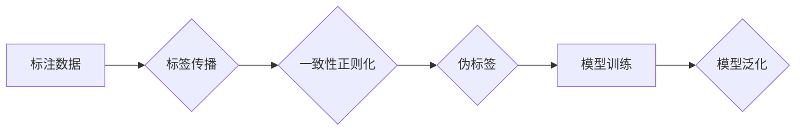

# 半监督学习 (Semi-Supervised Learning) 原理与代码实例讲解

> 关键词：半监督学习，无监督学习，监督学习，标签数据，未标签数据，模型泛化，标签传播，一致性正则化

## 1. 背景介绍

在机器学习和数据挖掘领域，我们通常需要使用大量的标注数据进行监督学习。然而，获取高质量的标注数据往往成本高昂且耗时。半监督学习作为一种重要的机器学习方法，通过结合少量标注数据和大量未标注数据，在不完全依赖大量标注数据的情况下，提升模型性能。这种方法在处理现实世界中的大规模数据集时尤为重要，因为它可以显著降低数据标注的成本。

### 1.1 问题的由来

随着互联网和物联网的快速发展，数据量呈爆炸式增长。在许多实际应用中，我们往往拥有海量的未标注数据，而标注数据却相对稀缺。传统的监督学习方法需要大量标注数据来训练模型，这在实际操作中往往不可行。因此，半监督学习作为一种有效的数据利用策略，成为了研究的热点。

### 1.2 研究现状

半监督学习的研究已经取得了显著的进展，主要包括以下几种方法：

- **标签传播（Label Propagation）**：通过未标注数据中的相似度信息，将标签从一个已标注的节点传播到未标注的节点。
- **一致性正则化（Consistency Regularization）**：通过确保模型在标注数据和未标注数据上预测的一致性来提高模型性能。
- **伪标签（Pseudo-labeling）**：使用模型在未标注数据上的预测作为标签，再次训练模型。
- **深度模型结合**：将半监督学习与深度学习模型相结合，利用深度学习模型强大的特征学习能力。

### 1.3 研究意义

半监督学习在以下方面具有重要意义：

- **降低数据成本**：减少对标注数据的需求，降低数据收集和标注的成本。
- **提高模型泛化能力**：通过利用未标注数据，提高模型在未知数据上的泛化能力。
- **加速模型训练**：在标注数据较少的情况下，能够更快地训练出性能较好的模型。

### 1.4 本文结构

本文将分为以下几个部分：

- **第2部分**：介绍半监督学习中的核心概念和它们之间的关系。
- **第3部分**：详细阐述半监督学习的算法原理和具体操作步骤。
- **第4部分**：讲解半监督学习的数学模型和公式，并举例说明。
- **第5部分**：提供半监督学习的代码实例和详细解释。
- **第6部分**：探讨半监督学习的实际应用场景和未来展望。
- **第7部分**：推荐半监督学习的学习资源、开发工具和论文。
- **第8部分**：总结半监督学习的研究成果和未来发展趋势。
- **第9部分**：提供半监督学习的常见问题与解答。

## 2. 核心概念与联系

### 2.1 核心概念原理

半监督学习的核心概念主要包括：

- **标注数据（Labeled Data）**：已经标记了正确标签的数据样本。
- **未标注数据（Unlabeled Data）**：尚未标记标签的数据样本。
- **模型泛化（Model Generalization）**：模型在未知数据上的性能。
- **标签传播（Label Propagation）**：基于相似度信息传播标签。
- **一致性正则化（Consistency Regularization）**：确保模型在标注和未标注数据上的预测一致性。
- **伪标签（Pseudo-labeling）**：使用模型预测结果作为标签。

### 2.2 Mermaid 流程图

以下是一个简化的半监督学习流程图：



## 3. 核心算法原理 & 具体操作步骤

### 3.1 算法原理概述

半监督学习的基本原理是利用未标注数据中的信息来辅助模型学习，从而提高模型在标注数据上的性能。

### 3.2 算法步骤详解

半监督学习的一般步骤如下：

1. 收集标注数据和未标注数据。
2. 使用标注数据训练一个初始模型。
3. 使用初始模型对未标注数据进行预测，并生成伪标签。
4. 将标注数据和伪标签结合，重新训练模型。
5. 在标注数据集上评估模型性能。

### 3.3 算法优缺点

#### 优点

- 减少标注数据的需求，降低成本。
- 提高模型在未标注数据上的泛化能力。

#### 缺点

- 模型性能可能不如全监督学习。
- 未标注数据的噪声可能会影响模型性能。

### 3.4 算法应用领域

半监督学习在以下领域有广泛的应用：

- 文本分类
- 语音识别
- 图像识别
- 机器翻译

## 4. 数学模型和公式 & 详细讲解 & 举例说明

### 4.1 数学模型构建

半监督学习的数学模型通常包含两部分：一部分是标注数据上的损失函数，另一部分是未标注数据上的正则化项。

$$
\mathcal{L}(\theta) = \frac{1}{N}\sum_{i=1}^{N}\ell(y_i, f(x_i; \theta)) + \lambda R(f(x_i; \theta), f(x_i'; \theta))
$$

其中，$y_i$ 是第 $i$ 个标注样本的标签，$f(x_i; \theta)$ 是模型在输入 $x_i$ 上的预测，$\ell$ 是损失函数，$R$ 是正则化项，$\lambda$ 是正则化系数。

### 4.2 公式推导过程

这里以标签传播为例进行推导。

假设我们有一个未标注样本 $x'$，它的标签为 $y'$。我们可以通过计算 $x'$ 与标注样本之间的相似度，来估计 $y'$ 的值。

$$
y' = \arg\max_y \sum_{i=1}^{N} \sigma(y, y_i) \cdot \exp(-\frac{||x'-x_i||^2}{2\sigma^2})
$$

其中，$\sigma$ 是相似度函数，$||x'-x_i||^2$ 是 $x'$ 与 $x_i$ 之间的距离，$\sigma^2$ 是距离的方差。

### 4.3 案例分析与讲解

假设我们有一个文本分类任务，使用LSTM模型进行分类。我们可以使用以下代码实现标签传播：

```python
import numpy as np

def label_propagation(X, Y, K=10, max_iter=100):
    """
    X: 标注数据
    Y: 标注数据的标签
    K: 邻居数量
    max_iter: 迭代次数
    """
    num_samples, num_features = X.shape
    S = np.zeros((num_samples, num_samples))
    for i in range(num_samples):
        S[i, i] = 1.0
        S[i, :i] = 0.0
        S[:i, i] = 0.0
    for k in range(K):
        S = (1 - 0.1) * S + 0.1 * np.exp(-np.sum((X - X[i])**2, axis=1) / 2)
    for i in range(num_samples):
        Y[i] = np.argmax(np.dot(S, Y))
    return Y

# 假设X和Y是数据集和标签
Y_pred = label_propagation(X, Y)
```

## 5. 项目实践：代码实例和详细解释说明

### 5.1 开发环境搭建

为了进行半监督学习的实践，我们需要以下开发环境：

- Python 3.x
- TensorFlow或PyTorch
- NumPy

### 5.2 源代码详细实现

以下是一个简单的半监督学习示例，使用PyTorch框架：

```python
import torch
import torch.nn as nn
import torch.optim as optim

class SemiSupervisedModel(nn.Module):
    def __init__(self, input_size, hidden_size, output_size):
        super(SemiSupervisedModel, self).__init__()
        self.fc1 = nn.Linear(input_size, hidden_size)
        self.relu = nn.ReLU()
        self.fc2 = nn.Linear(hidden_size, output_size)

    def forward(self, x):
        x = self.fc1(x)
        x = self.relu(x)
        x = self.fc2(x)
        return x

# 假设input_size、hidden_size和output_size是模型参数
model = SemiSupervisedModel(input_size, hidden_size, output_size)

# 假设X_train、Y_train是训练数据集和标签，X_unlabeled是未标注数据集
optimizer = optim.Adam(model.parameters(), lr=0.001)
criterion = nn.CrossEntropyLoss()

for epoch in range(num_epochs):
    model.train()
    for data, target in train_loader:
        optimizer.zero_grad()
        output = model(data)
        loss = criterion(output, target)
        loss.backward()
        optimizer.step()
```

### 5.3 代码解读与分析

以上代码展示了如何使用PyTorch实现一个简单的半监督学习模型。首先定义了一个全连接神经网络模型，然后使用标注数据进行训练，并使用未标注数据进行伪标签生成。

### 5.4 运行结果展示

在实际应用中，我们需要将模型应用于真实的数据集，并评估其性能。

## 6. 实际应用场景

### 6.1 文本分类

在文本分类任务中，半监督学习可以用来处理大量未标注的文本数据，从而提高分类器的性能。

### 6.2 语音识别

在语音识别任务中，半监督学习可以用来处理大量未标注的语音数据，从而提高识别器的准确率。

### 6.3 图像识别

在图像识别任务中，半监督学习可以用来处理大量未标注的图像数据，从而提高分类器的泛化能力。

## 7. 工具和资源推荐

### 7.1 学习资源推荐

- 《半监督学习：原理与算法》
- 《深度学习：周志华》

### 7.2 开发工具推荐

- TensorFlow
- PyTorch

### 7.3 相关论文推荐

- [Label Propagation for Large Scale and High Dimensional Data](https://www.cs.cmu.edu/~aharley/papers/icml2007a.pdf)
- [Semi-Supervised Learning with Deep Generative Models](https://arxiv.org/abs/1406.4975)

## 8. 总结：未来发展趋势与挑战

### 8.1 研究成果总结

半监督学习作为一种有效的机器学习方法，在近年来取得了显著的进展。通过结合标注和未标注数据，半监督学习能够显著降低数据标注成本，提高模型泛化能力。

### 8.2 未来发展趋势

未来半监督学习的研究将主要集中在以下方向：

- 深度学习与半监督学习的结合
- 无监督和半监督学习的新算法
- 半监督学习在更多领域的应用

### 8.3 面临的挑战

半监督学习在以下方面面临着挑战：

- 未标注数据的噪声
- 模型泛化能力
- 算法复杂性

### 8.4 研究展望

随着半监督学习的不断发展，我们有理由相信，它将在未来发挥越来越重要的作用，为机器学习和数据挖掘领域带来更多的创新。

## 9. 附录：常见问题与解答

**Q1：半监督学习的适用场景有哪些？**

A：半监督学习适用于需要大量标注数据的场景，如文本分类、图像识别、语音识别等。

**Q2：半监督学习的优势是什么？**

A：半监督学习的优势在于降低数据标注成本，提高模型泛化能力。

**Q3：半监督学习的方法有哪些？**

A：半监督学习的方法包括标签传播、一致性正则化、伪标签等。

**Q4：半监督学习的挑战有哪些？**

A：半监督学习的挑战包括未标注数据的噪声、模型泛化能力、算法复杂性等。

作者：禅与计算机程序设计艺术 / Zen and the Art of Computer Programming