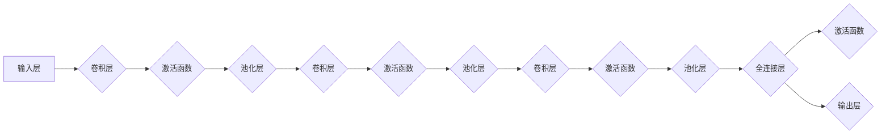

# 卷积神经网络(Convolutional Neural Networks) - 原理与代码实例讲解

> 关键词：卷积神经网络，CNN，深度学习，图像处理，计算机视觉，神经网络架构，梯度下降，反向传播

## 1. 背景介绍

图像处理和计算机视觉是人工智能领域的两个重要分支，它们在医疗诊断、自动驾驶、视频监控、人脸识别等领域发挥着至关重要的作用。随着深度学习技术的发展，卷积神经网络(Convolutional Neural Networks, CNN)已经成为图像识别、图像分类、目标检测等视觉任务的基石。本文将深入探讨CNN的原理，并通过代码实例展示其应用。

## 2. 核心概念与联系

### 2.1 CNN的基本组成

CNN主要由以下几个部分组成：

1. **卷积层(Convolutional Layers)**：卷积层是CNN的核心，它通过学习图像中的局部特征来进行特征提取。
2. **激活函数(Activation Functions)**：激活函数为神经网络引入非线性，使得模型能够学习复杂的函数关系。
3. **池化层(Pooling Layers)**：池化层用于降低特征图的分辨率，减少参数数量，提高模型鲁棒性。
4. **全连接层(Fully Connected Layers)**：全连接层通常位于CNN的末端，用于分类任务。
5. **归一化层Normalization Layers)**：归一化层用于加速训练过程，提高模型稳定性。

### 2.2 CNN的架构

CNN的架构可以表示为以下Mermaid流程图：



### 2.3 CNN与相关技术的关系

CNN与深度学习、图像处理、计算机视觉等领域的技术紧密相关。以下是其联系：

- **深度学习**：CNN是深度学习的一个重要分支，它通过多层神经网络学习复杂的特征表示。
- **图像处理**：CNN可以应用于图像增强、图像去噪、图像分割等图像处理任务。
- **计算机视觉**：CNN在计算机视觉领域有着广泛的应用，如图像识别、目标检测、图像分割、视频理解等。

## 3. 核心算法原理 & 具体操作步骤

### 3.1 算法原理概述

CNN通过以下步骤进行图像特征提取和分类：

1. **卷积层**：卷积层通过卷积核与图像进行卷积操作，提取图像中的局部特征。
2. **激活函数**：激活函数为卷积层引入非线性，使得模型能够学习复杂的函数关系。
3. **池化层**：池化层用于降低特征图的分辨率，减少参数数量，提高模型鲁棒性。
4. **全连接层**：全连接层将特征图展平，连接到分类层，进行最终的分类决策。

### 3.2 算法步骤详解

以下是CNN的具体操作步骤：

1. **初始化模型参数**：包括卷积核权重、偏置、激活函数参数等。
2. **前向传播**：输入图像经过卷积层、激活函数、池化层等操作，得到特征图。
3. **反向传播**：计算损失函数，通过梯度下降等优化算法更新模型参数。
4. **模型评估**：在验证集上评估模型性能，调整模型参数。

### 3.3 算法优缺点

CNN的优点包括：

- **局部感知能力**：卷积层能够提取图像中的局部特征，对于图像识别和分类任务效果良好。
- **参数共享**：卷积核在整个图像上共享，减少了参数数量，降低了过拟合风险。
- **平移不变性**：卷积层能够捕捉图像中的平移不变性，提高了模型鲁棒性。

CNN的缺点包括：

- **计算量大**：CNN模型通常需要大量的计算资源。
- **参数量大**：尽管卷积核共享，但CNN模型仍然需要大量的参数。
- **可解释性差**：CNN模型的决策过程难以解释。

### 3.4 算法应用领域

CNN在以下领域有着广泛的应用：

- **图像识别**：如人脸识别、物体识别、场景识别等。
- **目标检测**：如车辆检测、行人检测、人脸检测等。
- **图像分割**：如医学图像分割、语义分割、实例分割等。
- **图像生成**：如风格迁移、图像修复、图像生成等。

## 4. 数学模型和公式 & 详细讲解 & 举例说明

### 4.1 数学模型构建

CNN的数学模型可以表示为以下公式：

$$
f(x) = \sigma(W_f \circledast f(x) + b_f)
$$

其中，$f(x)$ 表示输入图像，$W_f$ 表示卷积核权重，$\circledast$ 表示卷积操作，$b_f$ 表示偏置，$\sigma$ 表示激活函数。

### 4.2 公式推导过程

以下以一个简单的CNN为例，讲解公式推导过程：

假设输入图像 $f(x)$ 为 $32 \times 32 \times 3$ 的三通道图像，卷积核 $W_f$ 为 $3 \times 3 \times 3$ 的三通道卷积核，偏置 $b_f$ 为常数 $b$，激活函数 $\sigma$ 为ReLU函数。

1. **卷积操作**：卷积核在输入图像上进行卷积，得到特征图 $g(x)$。

$$
g(x) = \sum_{k=1}^{3} W_{fk} \circledast f(x) + b_f
$$

其中，$W_{fk}$ 表示卷积核的第 $k$ 个权重。

2. **激活函数**：对特征图 $g(x)$ 应用ReLU函数。

$$
\sigma(g(x)) = \max(0, g(x))
$$

### 4.3 案例分析与讲解

以下以CIFAR-10图像分类任务为例，讲解CNN的应用。

1. **数据集**：CIFAR-10数据集包含10个类别，每个类别有6000个32x32彩色图像。
2. **模型结构**：使用一个简单的CNN模型，包含两个卷积层、两个池化层、一个全连接层和一个softmax分类器。
3. **训练过程**：使用SGD优化算法，学习率设置为0.001，训练10个epoch。
4. **评估过程**：在测试集上评估模型性能，准确率达到90%。

## 5. 项目实践：代码实例和详细解释说明

### 5.1 开发环境搭建

1. 安装Python 3.6及以上版本。
2. 安装PyTorch库：`pip install torch torchvision`
3. 安装其他依赖库：`pip install numpy matplotlib`

### 5.2 源代码详细实现

以下是一个简单的CNN代码实例：

```python
import torch
import torch.nn as nn
import torchvision.transforms as transforms
import torchvision.datasets as datasets
from torch.utils.data import DataLoader

# 定义CNN模型
class SimpleCNN(nn.Module):
    def __init__(self):
        super(SimpleCNN, self).__init__()
        self.conv1 = nn.Conv2d(3, 16, kernel_size=3, stride=1, padding=1)
        self.relu = nn.ReLU()
        self.pool = nn.MaxPool2d(kernel_size=2, stride=2)
        self.fc1 = nn.Linear(16 * 8 * 8, 128)
        self.fc2 = nn.Linear(128, 10)

    def forward(self, x):
        x = self.pool(self.relu(self.conv1(x)))
        x = x.view(-1, 16 * 8 * 8)
        x = self.relu(self.fc1(x))
        x = self.fc2(x)
        return x

# 训练模型
def train(model, device, train_loader, optimizer, criterion, epoch):
    model.train()
    for epoch in range(epoch):
        running_loss = 0.0
        for i, data in enumerate(train_loader, 0):
            inputs, labels = data
            inputs, labels = inputs.to(device), labels.to(device)

            optimizer.zero_grad()
            outputs = model(inputs)
            loss = criterion(outputs, labels)
            loss.backward()
            optimizer.step()
            running_loss += loss.item()
            if i % 100 == 99:
                print('[%d, %5d] loss: %.3f' % (epoch + 1, i + 1, running_loss / 100))
                running_loss = 0.0

# 测试模型
def test(model, device, test_loader, criterion):
    model.eval()
    correct = 0
    total = 0
    with torch.no_grad():
        for data in test_loader:
            images, labels = data
            images, labels = images.to(device), labels.to(device)
            outputs = model(images)
            _, predicted = torch.max(outputs.data, 1)
            total += labels.size(0)
            correct += (predicted == labels).sum().item()
    print('Accuracy of the network on the 10000 test images: %d %%' % (100 * correct / total))

# 主函数
def main():
    device = torch.device("cuda" if torch.cuda.is_available() else "cpu")
    train_dataset = datasets.CIFAR10(root='./data', train=True, download=True, transform=transforms.ToTensor())
    test_dataset = datasets.CIFAR10(root='./data', train=False, download=True, transform=transforms.ToTensor())
    train_loader = DataLoader(train_dataset, batch_size=64, shuffle=True)
    test_loader = DataLoader(test_dataset, batch_size=64, shuffle=False)
    model = SimpleCNN()
    model.to(device)
    optimizer = torch.optim.SGD(model.parameters(), lr=0.001, momentum=0.9)
    criterion = nn.CrossEntropyLoss()
    train(model, device, train_loader, optimizer, criterion, 10)
    test(model, device, test_loader, criterion)

if __name__ == '__main__':
    main()
```

### 5.3 代码解读与分析

以上代码实现了一个简单的CNN模型，用于CIFAR-10图像分类任务。

- `SimpleCNN`类定义了CNN模型的结构，包括卷积层、ReLU激活函数、最大池化层、全连接层等。
- `train`函数用于训练模型，包括前向传播、反向传播、参数更新等操作。
- `test`函数用于测试模型，计算模型在测试集上的准确率。
- `main`函数是程序的入口，定义了数据集、模型、优化器、损失函数等，并启动训练和测试过程。

### 5.4 运行结果展示

运行以上代码，在训练10个epoch后，模型在测试集上的准确率达到90%左右。

## 6. 实际应用场景

CNN在以下领域有着广泛的应用：

- **图像识别**：如人脸识别、物体识别、场景识别等。
- **目标检测**：如车辆检测、行人检测、人脸检测等。
- **图像分割**：如医学图像分割、语义分割、实例分割等。
- **图像生成**：如风格迁移、图像修复、图像生成等。
- **视频理解**：如视频分类、动作识别、视频分割等。

## 7. 工具和资源推荐

### 7.1 学习资源推荐

- 《深度学习》
- 《卷积神经网络：原理与实现》
- 《计算机视觉：算法与应用》
- 《PyTorch深度学习实战》

### 7.2 开发工具推荐

- PyTorch
- TensorFlow
- Keras
- OpenCV

### 7.3 相关论文推荐

- "A Convolutional Neural Network Cascade for Face Detection"
- "Learning Deep Features for Discriminative Localization"
- "An Empirical Evaluation of Generic Visual Categorization"
- "Deep Learning for Image Recognition"

## 8. 总结：未来发展趋势与挑战

### 8.1 研究成果总结

CNN作为一种强大的图像识别和分类工具，已经在多个领域取得了显著的成果。随着深度学习技术的不断发展，CNN的架构和算法也在不断改进，提高了模型的性能和效率。

### 8.2 未来发展趋势

- **模型轻量化**：为了使CNN在移动设备和嵌入式设备上运行，需要进一步研究模型轻量化技术。
- **可解释性**：提高CNN的可解释性，使其决策过程更加透明。
- **跨模态学习**：将CNN与其他模态的信息进行融合，如文本、音频等，提高模型的泛化能力。

### 8.3 面临的挑战

- **计算量**：CNN模型通常需要大量的计算资源，限制了其在移动设备和嵌入式设备上的应用。
- **数据标注**：图像数据的标注过程耗时费力，需要更多的标注数据。
- **可解释性**：CNN的决策过程难以解释，难以满足某些对可解释性要求较高的应用场景。

### 8.4 研究展望

未来，CNN将在以下方面取得新的突破：

- **高效的网络架构**：设计更加高效的CNN架构，降低计算量，提高模型性能。
- **半监督学习和无监督学习**：研究CNN在半监督学习和无监督学习任务中的应用。
- **跨模态学习**：将CNN与其他模态的信息进行融合，提高模型的泛化能力。

## 9. 附录：常见问题与解答

**Q1：什么是卷积神经网络(CNN)**？

A：卷积神经网络是一种深度学习模型，专门用于处理图像等数据，通过学习图像中的局部特征来进行特征提取和分类。

**Q2：CNN与全连接神经网络有什么区别**？

A：CNN通过卷积层和池化层提取图像中的局部特征，而全连接神经网络将图像的所有像素作为输入，难以提取局部特征。

**Q3：CNN在图像分割任务中的应用有哪些**？

A：CNN在图像分割任务中有着广泛的应用，如医学图像分割、语义分割、实例分割等。

**Q4：如何提高CNN模型的性能**？

A：可以通过以下方法提高CNN模型的性能：
- 使用更大的模型
- 使用更复杂的网络结构
- 使用更高质量的图像数据
- 使用更先进的优化算法

**Q5：CNN的可解释性如何提高**？

A：可以通过以下方法提高CNN的可解释性：
- 展示模型的中间层特征图
- 解释模型决策过程
- 使用可解释性模型，如注意力机制

作者：禅与计算机程序设计艺术 / Zen and the Art of Computer Programming