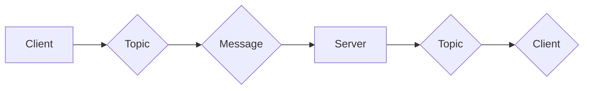
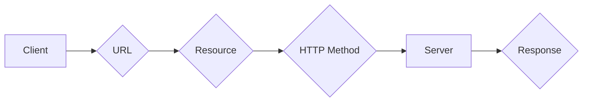
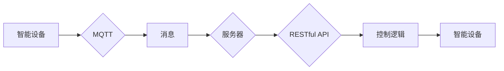

> 关键词：MQTT协议, RESTful API, 家庭娱乐自动化, IoT, edge computing, 智能家居, 系统设计, 互联互通

# 基于MQTT协议和RESTful API的家庭娱乐自动化控制系统

随着物联网(IoT)技术的飞速发展，家庭娱乐自动化控制系统逐渐成为智能家居领域的热点。这类系统通过集成多种智能设备，实现家庭娱乐设备的智能控制、信息交互和场景联动。本文将探讨如何使用MQTT协议和RESTful API构建一个高效、可靠的家庭娱乐自动化控制系统。

## 1. 背景介绍

### 1.1 问题的由来

传统的家庭娱乐系统通常由多个独立的设备组成，如电视、音响、投影仪等，它们之间缺乏有效的通信机制，用户需要通过多个遥控器或手动操作来实现设备的控制。这不仅给用户带来了不便，也降低了系统的智能化水平。

### 1.2 研究现状

为了解决上述问题，智能家居领域提出了多种解决方案。其中，MQTT协议和RESTful API因其轻量级、易于实现的特点，成为构建家庭娱乐自动化控制系统的热门选择。

### 1.3 研究意义

使用MQTT协议和RESTful API构建家庭娱乐自动化控制系统，具有以下意义：

- **简化系统架构**：通过协议的标准化，简化设备间的通信，降低系统复杂度。
- **提高系统可靠性**：MQTT协议的轻量级和低功耗特性，使系统在复杂网络环境下也能稳定运行。
- **增强用户体验**：通过RESTful API提供的开放接口，方便用户自定义控制逻辑，提升用户体验。

### 1.4 本文结构

本文将分为以下几个部分：

- 第2章介绍MQTT协议和RESTful API的基本概念及其在家庭娱乐自动化控制系统中的应用。
- 第3章详细阐述系统架构设计，包括硬件设备、网络通信、软件系统等。
- 第4章介绍系统实现的关键技术和方法。
- 第5章分析实际应用场景，并给出未来应用展望。
- 第6章总结全文，展望未来发展趋势与挑战。

## 2. 核心概念与联系

### 2.1 MQTT协议

MQTT（Message Queuing Telemetry Transport）是一种轻量级的消息传输协议，适用于低带宽、高延迟的网络环境。它采用发布/订阅模式，允许设备订阅特定的主题，并接收相关主题的消息。

以下是MQTT协议的核心概念和架构的Mermaid流程图：



### 2.2 RESTful API

RESTful API是一种基于HTTP协议的API设计风格，它利用REST架构风格，通过URL定位资源，使用HTTP方法操作资源。RESTful API具有简单、易于实现、易于扩展等特点。

以下是RESTful API的基本概念和架构的Mermaid流程图：



### 2.3 MQTT协议与RESTful API的联系

在家庭娱乐自动化控制系统中，MQTT协议负责设备间的消息传递，RESTful API负责提供设备控制接口。两者可以结合使用，实现高效、可靠的家庭娱乐设备控制。

以下是MQTT协议和RESTful API在家庭娱乐自动化控制系统中的联系：



## 3. 核心算法原理 & 具体操作步骤

### 3.1 算法原理概述

家庭娱乐自动化控制系统的核心算法主要包括：

- 设备发现与连接：通过MQTT协议发现并连接到智能设备。
- 设备控制：通过RESTful API发送控制指令，控制智能设备的行为。
- 场景联动：根据用户需求，将多个设备联动起来，实现智能化的家庭娱乐场景。

### 3.2 算法步骤详解

#### 3.2.1 设备发现与连接

1. 智能设备启动后，通过广播的方式发布主题为`/sys/+/+/connect`的消息，其中`+`代表设备的类型、品牌和型号。
2. 服务器订阅主题为`/sys/+/+/connect`的消息，并解析设备信息。
3. 服务器向设备发送主题为`/sys/+/+/ack`的消息，确认连接请求。
4. 设备收到确认消息后，完成连接。

#### 3.2.2 设备控制

1. 用户通过应用程序发送控制指令，通过RESTful API发送到服务器。
2. 服务器解析控制指令，并构造MQTT消息，发送到对应设备的主题。
3. 设备收到控制消息后，执行相应操作。

#### 3.2.3 场景联动

1. 用户通过应用程序设置场景联动规则。
2. 当触发条件满足时，服务器根据规则自动发送控制指令到相关设备。

### 3.3 算法优缺点

#### 3.3.1 优点

- **易于实现**：MQTT协议和RESTful API都是成熟的技术，易于实现。
- **可扩展性**：系统架构清晰，易于扩展。
- **可靠性**：MQTT协议的发布/订阅模式，确保消息的可靠传输。

#### 3.3.2 缺点

- **安全性**：MQTT协议和RESTful API本身不提供安全机制，需要额外添加安全措施。
- **复杂性**：系统涉及到多个组件，实现较为复杂。

### 3.4 算法应用领域

家庭娱乐自动化控制系统可以应用于以下领域：

- 智能家居
- 商业楼宇自动化
- 工业自动化
- 物联网

## 4. 数学模型和公式 & 详细讲解 & 举例说明

家庭娱乐自动化控制系统的数学模型主要涉及以下内容：

- 设备状态表示：使用状态变量表示设备的状态，如开关状态、亮度、音量等。
- 场景联动规则：使用逻辑表达式表示场景联动规则，如“当电视开启且音响关闭时，打开投影仪”。

### 4.1 数学模型构建

假设设备状态变量为$S$，场景联动规则为$R$，则系统状态可以表示为：

$$
S = R(S)
$$

### 4.2 公式推导过程

场景联动规则的推导过程如下：

1. 定义设备状态变量$S$，如$S = \{s_1, s_2, ..., s_n\}$，其中$s_i$表示第$i$个设备的状态。
2. 定义场景联动规则$R$，如$R = R_1 \land R_2 \land ... \land R_m$，其中$R_i$表示第$i$个联动规则。
3. 对于每个联动规则$R_i$，根据设备状态变量$S$，计算其结果$r_i$。
4. 将所有联动规则的结果进行逻辑与运算，得到最终的结果$r$。

### 4.3 案例分析与讲解

假设家庭娱乐系统中有电视、音响、投影仪三个设备，场景联动规则为“当电视开启且音响关闭时，打开投影仪”。

1. 定义设备状态变量$S$，如$S = \{s_1, s_2, s_3\}$，其中$s_1$表示电视状态，$s_2$表示音响状态，$s_3$表示投影仪状态。
2. 定义场景联动规则$R$，如$R = (s_1 = 1) \land (s_2 = 0)$。
3. 根据设备状态变量$S$，计算联动规则$R$的结果$r$：
   - 当电视开启且音响关闭时，$r = 1$；
   - 否则，$r = 0$。

## 5. 项目实践：代码实例和详细解释说明

### 5.1 开发环境搭建

1. 安装MQTT服务器，如Mosquitto。
2. 安装RESTful API框架，如Flask。
3. 安装Python开发环境。

### 5.2 源代码详细实现

以下是使用Python实现的家庭娱乐自动化控制系统的部分代码：

```python
from flask import Flask, request, jsonify
import paho.mqtt.client as mqtt

app = Flask(__name__)

# MQTT服务器配置
MQTT_BROKER = "localhost"
MQTT_PORT = 1883
MQTT_KEEPALIVE_INTERVAL = 45

# MQTT客户端
client = mqtt.Client()
client.connect(MQTT_BROKER, MQTT_PORT, MQTT_KEEPALIVE_INTERVAL)

# 设备控制函数
def control_device(device_id, command):
    topic = f"/device/{device_id}/control"
    message = f"{command}"
    client.publish(topic, message)

@app.route('/control', methods=['POST'])
def control():
    data = request.get_json()
    device_id = data['device_id']
    command = data['command']
    control_device(device_id, command)
    return jsonify({'status': 'success'})

if __name__ == '__main__':
    app.run()
```

### 5.3 代码解读与分析

- 使用Flask框架创建RESTful API。
- 使用paho-mqtt库创建MQTT客户端。
- 定义设备控制函数`control_device`，通过MQTT协议发送控制指令。
- 定义`/control`接口，接收控制指令，并调用`control_device`函数。

### 5.4 运行结果展示

启动Flask应用后，可以通过以下URL发送控制指令：

```
POST /control?device_id=1&command=on
```

将控制电视开启。

## 6. 实际应用场景

家庭娱乐自动化控制系统可以应用于以下场景：

- **智能影院**：通过自动控制电视、投影仪、音响等设备，实现私人影院体验。
- **智能卧室**：通过控制灯光、窗帘、音响等设备，营造舒适的睡眠环境。
- **智能客厅**：通过控制电视、音响、空调等设备，实现家庭娱乐场景的智能联动。

## 7. 工具和资源推荐

### 7.1 学习资源推荐

- MQTT协议官方文档：https://mosquitto.orgmanual/latest/html/index.html
- RESTful API设计指南：https://restful-api-design-guidelines.org/
- Python开发资源：https://docs.python.org/3/

### 7.2 开发工具推荐

- MQTT服务器：Mosquitto、Mosquitto CE
- RESTful API框架：Flask、Django REST framework
- MQTT客户端库：paho-mqtt、paho-mqtt.py

### 7.3 相关论文推荐

- "MQTT: A Protocol for Lightweight Messaging Between Devices" by Andy Stanford-Clark, etc.
- "RESTful API Design: A Guide to Building Web APIs" by Leonard Richardson, et al.

## 8. 总结：未来发展趋势与挑战

### 8.1 研究成果总结

本文介绍了基于MQTT协议和RESTful API的家庭娱乐自动化控制系统的设计、实现和应用。通过使用MQTT协议和RESTful API，可以构建一个高效、可靠、可扩展的家庭娱乐自动化控制系统。

### 8.2 未来发展趋势

- **跨平台支持**：支持更多平台和设备，如Android、iOS、Web等。
- **人工智能集成**：集成人工智能技术，实现更智能的家庭娱乐场景。
- **边缘计算**：将计算任务下沉到边缘设备，降低延迟，提高响应速度。

### 8.3 面临的挑战

- **安全性**：确保系统安全可靠，防止恶意攻击。
- **可扩展性**：设计可扩展的系统架构，适应未来设备增长。
- **用户体验**：提升用户体验，使系统操作更加简单易懂。

### 8.4 研究展望

未来，家庭娱乐自动化控制系统将朝着更加智能化、个性化、安全可靠的方向发展。通过不断创新和突破，为用户带来更加便捷、舒适的智能家居生活。

## 9. 附录：常见问题与解答

**Q1：MQTT协议和RESTful API有什么区别？**

A：MQTT协议是一种轻量级的消息传输协议，适用于低带宽、高延迟的网络环境。RESTful API是一种基于HTTP协议的API设计风格，易于实现和扩展。

**Q2：如何确保系统的安全性？**

A：可以通过以下措施确保系统的安全性：
- 使用安全的连接协议，如TLS/SSL。
- 对敏感数据进行加密。
- 实施访问控制策略。

**Q3：如何实现场景联动？**

A：可以通过定义场景联动规则，当触发条件满足时，自动发送控制指令到相关设备。

**Q4：如何扩展系统？**

A：可以通过设计可扩展的系统架构，支持更多平台和设备。

作者：禅与计算机程序设计艺术 / Zen and the Art of Computer Programming