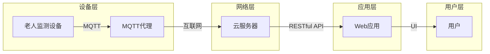

> 老年人安全，MQTT协议，RESTful API，智能家居，物联网，健康监控，实时通信，数据集成

# 基于MQTT协议和RESTful API的老年人居家安全辅助系统

随着人口老龄化趋势的加剧，老年人的居家安全问题日益受到关注。为了保障老年人的安全，提高他们的生活质量，本文将探讨一种基于MQTT协议和RESTful API的老年人居家安全辅助系统。该系统结合了物联网技术、实时通信技术以及数据集成技术，旨在为老年人提供全方位的安全保障和健康监控。

## 1. 背景介绍

### 1.1 问题的由来

老年人由于身体机能下降，容易发生摔倒、疾病突发等情况，而在紧急情况下无法及时得到帮助。同时，由于老年人对现代通信技术的掌握程度有限，传统的通信方式难以满足他们的需求。因此，开发一种能够实时监控老年人状态、提供紧急救援和便捷通信的居家安全辅助系统具有重要意义。

### 1.2 研究现状

目前，已有多种智能家居系统和健康监测设备应用于老年人居家安全领域。然而，这些系统往往存在以下问题：

- **通信协议复杂**：不同设备之间采用不同的通信协议，难以实现数据集成和统一管理。
- **实时性不足**：系统对老年人状态的监控不够实时，无法在紧急情况下及时响应。
- **用户体验不佳**：系统操作复杂，老年人难以使用。

### 1.3 研究意义

本系统旨在通过MQTT协议和RESTful API实现以下目标：

- **简化通信协议**：采用统一的MQTT协议，实现设备之间的互联互通。
- **提高实时性**：利用MQTT协议的低延迟特性，实时监控老年人状态。
- **提升用户体验**：设计简洁易用的用户界面，方便老年人操作。

## 2. 核心概念与联系

### 2.1 核心概念

#### MQTT协议

MQTT（Message Queuing Telemetry Transport，消息队列遥测传输协议）是一种轻量级的消息传输协议，适用于低带宽、高延迟的网络环境。其核心特点包括：

- **发布/订阅模式**：客户端可以订阅主题，服务器推送消息给订阅者。
- **质量服务等级**：支持三种质量服务等级（QoS），满足不同消息传输需求。
- **轻量级协议**：数据格式简单，传输效率高。

#### RESTful API

RESTful API（Representational State Transfer API）是一种基于HTTP协议的API设计风格，其核心特点包括：

- **无状态**：服务器不存储客户端会话信息。
- **资源导向**：所有操作都针对资源进行。
- **统一的接口**：使用HTTP请求方法进行资源操作。

### 2.2 架构流程图



### 2.3 关系联系

本系统采用MQTT协议作为设备层和服务器之间的通信协议，实现设备数据的实时传输。云服务器通过RESTful API向Web应用提供数据访问接口，用户通过Web应用界面与系统交互，实现远程监控和紧急救援等功能。

## 3. 核心算法原理 & 具体操作步骤

### 3.1 算法原理概述

本系统采用以下算法实现：

- **设备数据采集**：通过传感器采集老年人生命体征、环境数据等，并通过MQTT协议传输至服务器。
- **数据存储与分析**：服务器接收设备数据，进行存储和分析，为健康监控和紧急救援提供依据。
- **实时预警**：系统根据预设规则，对异常数据进行分析，并及时向用户发出预警。
- **紧急救援**：在紧急情况下，系统可通过Web应用界面实现远程救援。

### 3.2 算法步骤详解

1. **设备数据采集**：传感器将采集到的数据打包成MQTT消息，并发布到指定主题。
2. **MQTT消息传输**：MQTT代理接收消息，并根据订阅主题将其转发给服务器。
3. **数据存储与分析**：服务器解析MQTT消息，并将数据存储到数据库。同时，对数据进行实时分析，判断是否存在异常。
4. **实时预警**：若检测到异常，系统根据预设规则，通过Web应用界面向用户发出预警。
5. **紧急救援**：在紧急情况下，用户可通过Web应用界面进行远程救援，如呼叫救护车、通知家人等。

### 3.3 算法优缺点

#### 优点

- **实时性强**：MQTT协议的低延迟特性保证了数据传输的实时性。
- **可扩展性强**：系统采用模块化设计，易于扩展和升级。
- **易于使用**：Web应用界面简洁易用，老年人易于操作。

#### 缺点

- **安全性**：MQTT协议本身存在一定的安全隐患，需要采取相应的安全措施。
- **资源消耗**：服务器需要处理大量的数据，对硬件资源有一定要求。

### 3.4 算法应用领域

本系统可应用于以下领域：

- **老年人居家安全**：实时监控老年人状态，提供紧急救援和便捷通信。
- **智能家居**：实现家庭设备的互联互通，方便老年人控制家居设备。
- **健康监测**：为老年人提供全面的健康监测服务。

## 4. 数学模型和公式 & 详细讲解 & 举例说明

### 4.1 数学模型构建

本系统涉及的主要数学模型包括：

- **传感器数据模型**：描述传感器采集到的各种数据。
- **预警规则模型**：描述预警规则的数学表达式。
- **救援策略模型**：描述救援策略的数学模型。

### 4.2 公式推导过程

由于本系统涉及多种传感器数据，以下以温度传感器数据为例进行说明。

假设温度传感器采集到的温度数据为 $T(t)$，其中 $t$ 表示时间。预警规则为：

$$
T(t) \geq T_{\text{upper}} \quad \text{或} \quad T(t) \leq T_{\text{lower}}
$$

其中，$T_{\text{upper}}$ 和 $T_{\text{lower}}$ 分别表示温度上限和下限。

当 $T(t)$ 超出阈值范围时，系统发出预警。

### 4.3 案例分析与讲解

假设某老年人的室内温度传感器采集到以下数据：

```
t:   0   1   2   3   4   5   6   7   8   9   10
T(t): 25  26  27  28  29  30  31  32  33  34  35
```

假设温度上限为 30℃，下限为 24℃。

根据预警规则，当 $T(t)$ 超出阈值范围时，系统发出预警。在本例中，当 $t=9$ 和 $t=10$ 时，温度超出上限，系统会发出预警。

## 5. 项目实践：代码实例和详细解释说明

### 5.1 开发环境搭建

本系统采用以下开发环境：

- **操作系统**：Linux
- **编程语言**：Python
- **框架**：Flask、paho-mqtt、Pymysql

### 5.2 源代码详细实现

以下为MQTT消息接收和处理的代码示例：

```python
import paho.mqtt.client as mqtt
import pymysql

def on_connect(client, userdata, flags, rc):
    print("Connected with result code "+str(rc))
    client.subscribe("elderly/sensor/data")

def on_message(client, userdata, msg):
    print(msg.topic+" "+str(msg.payload))
    data = eval(msg.payload.decode("utf-8"))
    temperature = data['temperature']
    # 存储数据到数据库
    conn = pymysql.connect(host='localhost', user='root', password='root', db='elderly', charset='utf8')
    cursor = conn.cursor()
    cursor.execute("INSERT INTO sensor_data (temperature) VALUES (%s)", (temperature,))
    conn.commit()
    conn.close()

client = mqtt.Client()
client.on_connect = on_connect
client.on_message = on_message

client.connect("localhost", 1883, 60)

client.loop_forever()
```

### 5.3 代码解读与分析

上述代码实现了以下功能：

- 连接MQTT代理，订阅主题 `elderly/sensor/data`。
- 接收MQTT消息，解析消息内容。
- 将解析后的数据存储到数据库。

### 5.4 运行结果展示

假设传感器发送以下MQTT消息：

```python
{'temperature': 25}
```

系统会解析消息内容，并将温度值存储到数据库中。

## 6. 实际应用场景

### 6.1 老年人居家安全

本系统可应用于老年人居家安全领域，实时监控老年人的生命体征、环境数据等，并在异常情况下发出预警，为老年人提供安全保障。

### 6.2 智能家居

本系统可与其他智能家居设备结合，实现家庭设备的互联互通，方便老年人控制家居设备，提高生活质量。

### 6.3 健康监测

本系统可提供全面的健康监测服务，包括生命体征监测、运动监测、睡眠监测等，帮助老年人更好地了解自己的健康状况。

## 7. 工具和资源推荐

### 7.1 学习资源推荐

- MQTT协议官方文档：https://mosquitto.org/man/mosquitto.conf.5.html
- RESTful API设计指南：https://restfulapi.net/restful-api-design-constraints/

### 7.2 开发工具推荐

- MQTT代理：Mosquitto、Eclipse Mosquitto
- Web框架：Flask、Django
- 数据库：MySQL、PostgreSQL

### 7.3 相关论文推荐

- MQTT协议规范：https://www.mosquitto.org/mosquitto.org/download/mosquitto-3.1.6/mqtt_v3.1.1_spec.pdf
- RESTful API设计最佳实践：https://restfulapi.net/restful-api-design-best-practices/

## 8. 总结：未来发展趋势与挑战

### 8.1 研究成果总结

本系统基于MQTT协议和RESTful API，实现了老年人居家安全辅助功能，包括实时监控、预警和紧急救援。系统具有以下优点：

- **实时性强**：MQTT协议保证了数据传输的实时性。
- **可扩展性强**：系统采用模块化设计，易于扩展和升级。
- **易于使用**：Web应用界面简洁易用，老年人易于操作。

### 8.2 未来发展趋势

- **多传感器融合**：将更多传感器集成到系统中，实现更全面的健康监测。
- **人工智能辅助**：利用人工智能技术，实现更智能的预警和救援策略。
- **跨平台应用**：开发跨平台应用，方便老年人使用。

### 8.3 面临的挑战

- **数据安全**：如何保证数据传输和存储的安全。
- **隐私保护**：如何保护老年人的隐私。
- **系统稳定性**：如何保证系统的稳定性和可靠性。

### 8.4 研究展望

本系统为老年人居家安全提供了有效的解决方案。未来，我们将继续优化系统性能，拓展应用场景，为老年人提供更加安全、便捷的居家生活。

## 9. 附录：常见问题与解答

**Q1：MQTT协议相比于其他协议有哪些优势？**

A：相比其他协议，MQTT协议具有以下优势：

- **轻量级**：数据格式简单，传输效率高。
- **低延迟**：适用于低带宽、高延迟的网络环境。
- **可伸缩性**：可支持海量客户端同时连接。

**Q2：如何保证MQTT消息传输的安全性？**

A：为了保证MQTT消息传输的安全性，可以采取以下措施：

- 使用TLS加密MQTT连接。
- 对消息内容进行加密处理。

**Q3：如何保护老年人的隐私？**

A：为了保护老年人的隐私，可以采取以下措施：

- 对采集到的数据进行脱敏处理。
- 限制数据访问权限。

**Q4：如何保证系统的稳定性？**

A：为了保证系统的稳定性，可以采取以下措施：

- 使用高可用性架构。
- 对系统进行定期维护和更新。

作者：禅与计算机程序设计艺术 / Zen and the Art of Computer Programming