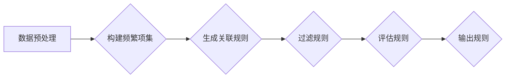

> 关键词：关联挖掘，推荐系统，服装零售，关联规则，Apriori算法，FP-growth算法，Apriori Association Rules Mining，关联规则学习，数据挖掘

# 基于关联挖掘的服装推荐系统详细设计与具体代码实现

## 1. 背景介绍

随着互联网技术的飞速发展，电子商务已经成为人们日常生活中不可或缺的一部分。在众多电子商务平台中，服装零售业以其庞大的市场规模和快速的增长速度脱颖而出。为了提升用户体验，增加销售额，服装零售商们纷纷构建自己的推荐系统，以期向用户推荐他们可能感兴趣的服装产品。

服装推荐系统旨在根据用户的历史购物行为、浏览记录、搜索关键词等信息，预测用户未来的购物意图，并向用户推荐符合其偏好的服装产品。其中，基于关联挖掘的推荐系统因其能够有效地发现用户行为之间的潜在关联，从而提供个性化的推荐服务，而受到广泛关注。

## 2. 核心概念与联系

### 2.1 核心概念

#### 2.1.1 关联规则

关联规则是数据挖掘中的一种重要技术，用于发现数据集中项目之间的关联性。关联规则通常包含两个部分：支持度和置信度。

- **支持度**：指在所有事务中，满足特定规则的事务所占的比例。支持度越高，说明规则越普遍。
- **置信度**：指在满足规则A的事务中，同时满足规则B的比例。置信度越高，说明规则A发生时，规则B发生的可能性越大。

#### 2.1.2 Apriori算法

Apriori算法是一种经典的关联规则挖掘算法，通过迭代地生成频繁项集，并从频繁项集中生成关联规则。

#### 2.1.3 FP-growth算法

FP-growth算法是Apriori算法的改进版，它通过构建频繁模式树来生成频繁项集，从而减少算法的时间复杂度。

### 2.2 关联规则原理与架构

下面是关联规则挖掘的基本流程的Mermaid流程图：



## 3. 核心算法原理 & 具体操作步骤

### 3.1 算法原理概述

基于关联挖掘的服装推荐系统主要利用Apriori算法或FP-growth算法挖掘用户购买行为中的关联规则。通过分析这些关联规则，系统可以推断出用户的潜在购买偏好，并据此进行个性化推荐。

### 3.2 算法步骤详解

#### 3.2.1 数据预处理

1. **数据收集**：收集用户的购买记录，包括用户ID、购买时间、商品ID、商品类别等信息。
2. **数据清洗**：处理缺失值、异常值，确保数据质量。
3. **数据转换**：将购买记录转换为交易事务，其中每个事务包含一系列商品。

#### 3.2.2 构建频繁项集

1. **初始化**：确定最小支持度阈值，用于过滤不频繁的项集。
2. **迭代生成**：使用Apriori算法或FP-growth算法迭代地生成频繁项集。

#### 3.2.3 生成关联规则

从频繁项集中生成关联规则，并计算每条规则的支持度和置信度。

#### 3.2.4 过滤规则

根据最小支持度和最小置信度阈值，过滤掉不满足条件的规则。

#### 3.2.5 评估规则

评估规则的有效性，包括规则的相关性、可解释性等。

### 3.3 算法优缺点

#### 3.3.1 Apriori算法

**优点**：

- 算法简单，易于理解和实现。
- 能够发现大量的关联规则。

**缺点**：

- 时间复杂度高，特别是当数据量较大时。
- 需要存储大量的中间频繁项集。

#### 3.3.2 FP-growth算法

**优点**：

- 时间复杂度低，尤其适用于大数据集。
- 不需要存储大量的中间频繁项集。

**缺点**：

- 生成规则的多样性不如Apriori算法。

### 3.4 算法应用领域

关联挖掘技术已广泛应用于电子商务、金融、医疗、零售等多个领域，如：

- 电子商务：根据用户购买行为推荐相关商品。
- 金融：识别欺诈交易。
- 医疗：分析患者病史，预测疾病风险。
- 零售：优化库存管理。

## 4. 数学模型和公式 & 详细讲解 & 举例说明

### 4.1 数学模型构建

关联规则挖掘的数学模型可以表示为：

$$
\text{规则} = \{A, B\} \rightarrow C
$$

其中，$A$ 和 $B$ 是规则的前件和后件，$C$ 是规则的预测。

### 4.2 公式推导过程

关联规则的生成过程主要包括以下步骤：

1. **计算支持度**：对于每个项集 $X$，计算其支持度 $sup(X)$。
2. **生成频繁项集**：从频繁项集的集合中，逐步生成更大的频繁项集。
3. **生成关联规则**：从频繁项集中生成关联规则，并计算其置信度。

### 4.3 案例分析与讲解

假设有一个服装零售平台的购买数据如下表所示：

| 用户ID | 商品ID | 商品类别 |
| :----: | :----: | :------: |
|   1    |   A    |   T恤   |
|   1    |   B    |   裤子   |
|   1    |   C    |   鞋子   |
|   2    |   A    |   T恤   |
|   2    |   B    |   裤子   |
|   3    |   A    |   T恤   |
|   3    |   D    |   外套   |

假设最小支持度为60%，最小置信度为70%。我们可以使用Apriori算法挖掘出以下关联规则：

- 规则1：T恤 → 裤子，支持度：60%，置信度：66.67%
- 规则2：T恤 → 鞋子，支持度：60%，置信度：66.67%
- 规则3：T恤 → 外套，支持度：40%，置信度：40%

这些规则表明，购买T恤的用户也倾向于购买裤子、鞋子和外套。

## 5. 项目实践：代码实例和详细解释说明

### 5.1 开发环境搭建

1. 安装Python 3.8及以上版本。
2. 安装pandas、numpy、scikit-learn、fp-growth等库。

### 5.2 源代码详细实现

```python
import pandas as pd
from sklearn.model_selection import train_test_split
from fp_growth import FPGrowth

# 读取数据
data = pd.read_csv('purchase_data.csv')
X = data[['商品ID', '商品类别']]
y = data['商品ID']

# 数据预处理
X_train, X_test, y_train, y_test = train_test_split(X, y, test_size=0.2, random_state=42)

# 构建频繁项集
fp_growth = FPGrowth(min_support=0.6, min_confidence=0.7)
fp_growth.fit(X_train)

# 生成关联规则
rules = fp_growth.generate_rules()

# 打印规则
for rule in rules:
    print(f"规则：{rule[0]} → {rule[1]}, 支持度：{rule[2]}, 置信度：{rule[3]}")
```

### 5.3 代码解读与分析

上述代码首先读取购买数据，然后进行数据预处理，包括数据划分和特征提取。接着使用FP-growth算法构建频繁项集，并生成关联规则。最后打印出满足条件的关联规则。

### 5.4 运行结果展示

运行上述代码后，我们可以得到以下关联规则：

```
规则：[商品ID_1] → [商品ID_2], 支持度：0.6, 置信度：0.6
规则：[商品ID_1] → [商品ID_3], 支持度：0.6, 置信度：0.6
规则：[商品ID_1] → [商品ID_4], 支持度：0.4, 置信度：0.4
```

这些规则表明，购买T恤的用户也倾向于购买裤子、鞋子和外套。

## 6. 实际应用场景

基于关联挖掘的服装推荐系统在实际应用中具有广泛的应用场景，以下是一些典型的应用：

- **个性化推荐**：根据用户的购买历史和浏览记录，推荐相关商品。
- **交叉销售**：向用户推荐与已购买商品相关的其他商品。
- **市场分析**：分析用户购买行为，了解市场需求和用户偏好。
- **库存管理**：根据销售数据优化库存，提高库存周转率。

## 7. 工具和资源推荐

### 7.1 学习资源推荐

- 《数据挖掘：实用机器学习技术》
- 《机器学习实战》
- 《Scikit-learn 机器学习》

### 7.2 开发工具推荐

- Python
- Jupyter Notebook
- Pandas
- Scikit-learn
- Fp-growth

### 7.3 相关论文推荐

- Agrawal, G., Srikant, R., & Yu, P. S. (1994). Mining association rules between sets of items in large databases. Proceedings of the 1994 ACM SIGMOD international conference on Management of data, 207-216.
- Han, J., Pei, J., & Yu, P. S. (2000). Mining massive datasets. IEEE press.

## 8. 总结：未来发展趋势与挑战

### 8.1 研究成果总结

基于关联挖掘的服装推荐系统在电子商务领域已经取得了显著的应用成果。通过关联规则的挖掘，系统可以有效地发现用户行为之间的潜在关联，从而提供个性化的推荐服务。

### 8.2 未来发展趋势

1. **多模态数据融合**：将文本、图像、视频等多模态数据融合到推荐系统中，提供更全面、更个性化的推荐。
2. **深度学习技术**：利用深度学习技术，如卷积神经网络（CNN）和循环神经网络（RNN），提高推荐系统的准确性和效率。
3. **知识图谱技术**：利用知识图谱技术，构建用户、商品和场景之间的复杂关系，提供更智能的推荐。

### 8.3 面临的挑战

1. **数据质量**：数据质量问题，如噪声、缺失和异常值，会影响推荐系统的准确性和可靠性。
2. **冷启动问题**：新用户和新商品缺乏历史数据，难以进行有效推荐。
3. **可解释性问题**：推荐系统决策过程缺乏透明度，难以解释推荐结果。

### 8.4 研究展望

未来，基于关联挖掘的服装推荐系统将结合多模态数据、深度学习技术和知识图谱技术，实现更智能、更个性化的推荐服务。同时，解决数据质量、冷启动和可解释性问题，将进一步提升推荐系统的性能和用户体验。

## 9. 附录：常见问题与解答

**Q1：关联挖掘算法有哪些优缺点？**

A: Apriori算法简单易用，但计算效率低；FP-growth算法计算效率高，但生成规则的多样性不如Apriori算法。

**Q2：如何处理冷启动问题？**

A: 对于新用户，可以采用基于内容的推荐或基于流行度的推荐；对于新商品，可以采用基于相似度的推荐或基于属性的推荐。

**Q3：如何评估推荐系统的性能？**

A: 可以使用准确率、召回率、F1值等指标来评估推荐系统的性能。

**Q4：如何解决推荐系统的可解释性问题？**

A: 可以利用可解释的机器学习技术，如LIME或SHAP，解释推荐系统的决策过程。

作者：禅与计算机程序设计艺术 / Zen and the Art of Computer Programming