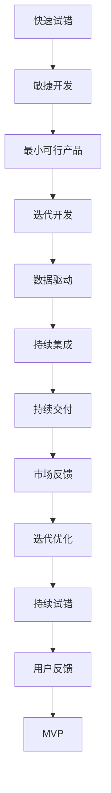

                 

# 快速试错与迭代在AI创业中的重要性

## 1. 背景介绍

### 1.1 问题由来
近年来，人工智能(AI)技术在各个行业中的应用日益增多，不仅推动了创新，也带来了许多前所未有的机遇。然而，AI创业同样面临诸多挑战，特别是在算法模型、产品迭代、市场反馈等方面，如何高效应对这些问题，成为创业成功的关键。

### 1.2 问题核心关键点
快速试错与迭代是AI创业中至关重要的策略，其核心在于如何通过不断的试验和调整，快速发现问题、解决问题，从而推出符合市场需求的产品。这不仅能够降低开发成本，还能加速产品上市时间，实现快速迭代和持续改进。

### 1.3 问题研究意义
快速试错与迭代方法的有效应用，对于降低AI创业风险、提升产品竞争力和用户体验具有重要意义。它能帮助创业团队在技术验证、市场调研和用户体验优化等多个环节快速迭代，确保产品能够满足用户需求，并在竞争激烈的市场中占据优势。

## 2. 核心概念与联系

### 2.1 核心概念概述

为更好地理解快速试错与迭代方法，本节将介绍几个密切相关的核心概念：

- **快速试错(Rapid Prototyping)**：通过快速构建、测试和迭代原型，迅速验证假设、优化设计，降低产品开发风险的方法。
- **迭代开发(Iterative Development)**：指通过多次循环的开发、测试和改进过程，逐步完善产品功能和服务质量，以用户反馈为驱动的开发模式。
- **敏捷开发(Agile Development)**：一种强调团队协作、快速响应变化和持续交付的软件开发方法。它通过小规模、高频次的迭代，实现快速交付和持续改进。
- **最小可行产品(Minimally Viable Product, MVP)**：指仅包含核心功能的最小化原型产品，用于验证市场假设和用户需求，以最小的成本获取反馈。
- **数据驱动(DevData)**：指以数据为依据，驱动产品迭代和决策的方法，通过数据分析发现用户需求和产品优化点，提升用户体验。
- **持续集成(Continuous Integration, CI)**：一种将代码变更频繁合并到主分支的方法，以确保软件质量稳定、快速交付。
- **持续交付(Continuous Delivery, CD)**：指通过自动化流程快速将软件交付到生产环境的方法，实现快速响应市场变化和用户需求。

这些核心概念之间的逻辑关系可以通过以下Mermaid流程图来展示：


这个流程图展示了快速试错与迭代的基本流程：

1. 通过构建原型进行快速试错。
2. 测试用户对原型的反馈。
3. 分析用户反馈，推出最小可行产品。
4. 基于用户反馈进行迭代开发，逐步完善产品功能。
5. 通过持续集成和交付，实现快速迭代。
6. 持续收集市场反馈，优化产品。

通过这些核心概念，我们可以更清晰地理解快速试错与迭代方法的整体框架，为后续深入讨论具体的试错与迭代技术奠定基础。

### 2.2 概念间的关系

这些核心概念之间存在着紧密的联系，形成了快速试错与迭代方法的完整生态系统。下面通过几个Mermaid流程图来展示这些概念之间的关系。

#### 2.2.1 快速试错与敏捷开发的关系


这个流程图展示了快速试错与敏捷开发的基本关系：

1. 快速试错通过小规模、高频次的迭代实现快速原型开发。
2. 敏捷开发强调团队协作、快速响应变化，与快速试错紧密结合。

#### 2.2.2 迭代开发与数据驱动的关系


这个流程图展示了迭代开发与数据驱动的基本关系：

1. 迭代开发通过用户反馈驱动产品迭代和改进。
2. 数据驱动以数据为依据，进一步优化产品功能和服务质量。

#### 2.2.3 最小可行产品与持续集成的关系


这个流程图展示了最小可行产品与持续集成的基本关系：

1. MVP通过小规模迭代和快速交付，实现最小化成本的验证。
2. 持续集成通过自动化代码合并和测试，确保软件质量稳定。

#### 2.2.4 持续交付与市场反馈的关系


这个流程图展示了持续交付与市场反馈的基本关系：

1. 持续交付通过快速部署，实现快速迭代和响应市场变化。
2. 市场反馈通过数据分析，指导产品优化和迭代方向。

### 2.3 核心概念的整体架构

最后，我们用一个综合的流程图来展示这些核心概念在大规模试错与迭代中的整体架构：



这个综合流程图展示了从快速试错到持续优化的完整过程。通过不断的迭代和优化，快速试错与迭代方法能够帮助创业团队快速发现并解决问题，持续改进产品，以满足市场和用户需求。

## 3. 核心算法原理 & 具体操作步骤
### 3.1 算法原理概述

快速试错与迭代方法的核心思想是通过不断的试验、测试和反馈，逐步优化产品功能和服务质量，以达到用户需求和市场要求。具体而言，其核心算法流程包括：

1. **构建原型**：快速构建产品原型，并进行初步测试。
2. **用户测试**：收集用户对原型的反馈，发现问题。
3. **反馈分析**：对用户反馈进行分析，提取关键问题。
4. **产品优化**：基于用户反馈进行产品功能和服务质量的优化。
5. **迭代发布**：通过持续集成和持续交付，快速发布新版本。
6. **市场反馈**：持续收集市场反馈，指导迭代优化。

### 3.2 算法步骤详解

以下是快速试错与迭代方法的具体操作步骤：

**Step 1: 构建原型**
- 确定产品核心功能，快速构建最小可行产品(MVP)。
- 使用低成本、高效率的技术手段，如快速原型工具、低代码平台等。
- 通过用户调研、竞品分析等手段，确保原型符合市场需求。

**Step 2: 用户测试**
- 选择合适的用户群体进行测试，获取真实反馈。
- 设计测试场景和问卷，深入了解用户需求和痛点。
- 通过数据分析工具，对用户反馈进行统计和分析。

**Step 3: 反馈分析**
- 提取用户反馈中的关键问题和建议。
- 分析用户反馈的共性和趋势，识别核心需求和改进点。
- 根据用户反馈，制定产品优化计划和优先级。

**Step 4: 产品优化**
- 基于用户反馈，进行产品功能的迭代和改进。
- 优化用户界面、提升用户体验、增强功能完备性。
- 进行多轮测试，确保优化效果符合用户期望。

**Step 5: 迭代发布**
- 使用持续集成工具，实现自动化代码合并和测试。
- 通过持续交付平台，快速部署新版本到生产环境。
- 监控系统性能和用户反馈，确保新功能稳定运行。

**Step 6: 市场反馈**
- 持续收集市场反馈，进行数据分析和挖掘。
- 根据市场反馈，制定新的产品迭代计划和优化策略。
- 通过不断迭代，逐步完善产品功能和服务质量。

### 3.3 算法优缺点

快速试错与迭代方法具有以下优点：
1. 快速验证假设，降低开发风险。
2. 持续收集用户反馈，快速响应市场变化。
3. 通过迭代优化，提升产品竞争力。
4. 减少无效开发，提高开发效率。

同时，快速试错与迭代方法也存在一些局限性：
1. 快速试错可能牺牲部分功能完善性。
2. 持续交付可能增加系统复杂性。
3. 用户反馈可能存在偏差，影响决策。
4. 迭代成本可能较高，特别是在产品初期。

### 3.4 算法应用领域

快速试错与迭代方法在AI创业中具有广泛的应用场景，涵盖以下领域：

- **智能推荐系统**：通过用户行为数据进行迭代优化，提升推荐精度和用户满意度。
- **自然语言处理(NLP)**：通过用户反馈，迭代优化NLP模型，提升语言理解和生成能力。
- **计算机视觉(CV)**：通过用户反馈，迭代优化CV模型，提升图像识别和处理能力。
- **智能客服**：通过用户对话数据，迭代优化客服系统，提升用户交互体验。
- **智能交通**：通过用户行驶数据，迭代优化交通系统，提升出行效率和安全性。
- **健康医疗**：通过患者反馈，迭代优化医疗系统，提升诊断和治疗效果。

这些领域的应用展示了快速试错与迭代方法在AI创业中的重要性和实用性。

## 4. 数学模型和公式 & 详细讲解 & 举例说明

### 4.1 数学模型构建

假设快速试错与迭代过程可以建模为迭代优化过程。令 $x_t$ 表示第 $t$ 次迭代的模型参数，$\theta$ 为最优参数。目标是通过迭代过程，使得 $x_t$ 逐步逼近 $\theta$。模型参数的更新公式为：

$$
x_{t+1} = x_t - \eta_t \nabla_{x_t} f(x_t)
$$

其中，$f(x_t)$ 为迭代优化过程的损失函数，$\eta_t$ 为第 $t$ 次迭代的步长，$\nabla_{x_t} f(x_t)$ 为损失函数对模型参数的梯度。

### 4.2 公式推导过程

以用户反馈为例，假设收集到 $n$ 个用户反馈数据，每个数据包含 $m$ 个特征。令 $d_t$ 为第 $t$ 次迭代的特征向量，$f(d_t)$ 为特征向量对应的损失函数。迭代优化过程的目标是最小化所有用户反馈的损失之和：

$$
\min_{d_t} \sum_{i=1}^n f(d_i)
$$

通过梯度下降等优化算法，每次迭代更新特征向量 $d_t$，使其逼近最优特征向量 $d^*$。

### 4.3 案例分析与讲解

以智能推荐系统为例，通过快速试错与迭代方法，系统可以快速收集用户行为数据，并基于数据反馈不断优化推荐算法。以下是具体的案例分析：

**Step 1: 构建原型**
- 使用Python编写推荐系统原型，集成用户行为数据，进行初步推荐。
- 通过A/B测试，对比不同推荐策略的效果，选择最优策略。

**Step 2: 用户测试**
- 在指定用户群体中，测试推荐系统的推荐效果和用户满意度。
- 设计问卷，收集用户反馈，识别关键问题和改进点。

**Step 3: 反馈分析**
- 提取用户反馈中的关键问题和建议，如推荐准确度、推荐速度等。
- 分析用户反馈的共性和趋势，识别核心需求和改进点。

**Step 4: 产品优化**
- 基于用户反馈，进行推荐算法的迭代优化，如调整算法参数、引入新特征等。
- 进行多轮测试，确保优化效果符合用户期望。

**Step 5: 迭代发布**
- 使用持续集成工具，实现自动化代码合并和测试。
- 通过持续交付平台，快速部署新版本到生产环境。
- 监控系统性能和用户反馈，确保新功能稳定运行。

**Step 6: 市场反馈**
- 持续收集市场反馈，进行数据分析和挖掘。
- 根据市场反馈，制定新的推荐算法迭代计划和优化策略。
- 通过不断迭代，逐步完善推荐系统功能和服务质量。

## 5. 项目实践：代码实例和详细解释说明
### 5.1 开发环境搭建

在进行快速试错与迭代实践前，我们需要准备好开发环境。以下是使用Python进行PyTorch开发的环境配置流程：

1. 安装Anaconda：从官网下载并安装Anaconda，用于创建独立的Python环境。

2. 创建并激活虚拟环境：
```bash
conda create -n pytorch-env python=3.8 
conda activate pytorch-env
```

3. 安装PyTorch：根据CUDA版本，从官网获取对应的安装命令。例如：
```bash
conda install pytorch torchvision torchaudio cudatoolkit=11.1 -c pytorch -c conda-forge
```

4. 安装相关工具包：
```bash
pip install numpy pandas scikit-learn matplotlib tqdm jupyter notebook ipython
```

完成上述步骤后，即可在`pytorch-env`环境中开始快速试错与迭代实践。

### 5.2 源代码详细实现

这里我们以推荐系统为例，给出使用PyTorch进行快速试错与迭代实践的代码实现。

首先，定义推荐系统的数据处理函数：

```python
import pandas as pd
import numpy as np

def load_data(file_path):
    data = pd.read_csv(file_path)
    return data

def preprocess_data(data):
    # 数据预处理，如去重、填充缺失值等
    return data

def split_data(data, test_size=0.2):
    train_data, test_data = train_test_split(data, test_size=test_size)
    return train_data, test_data

def evaluate_model(model, test_data):
    # 模型评估函数
    pass
```

然后，定义推荐模型和优化器：

```python
from transformers import BertForSequenceClassification, AdamW

model = BertForSequenceClassification.from_pretrained('bert-base-cased', num_labels=2)

optimizer = AdamW(model.parameters(), lr=2e-5)
```

接着，定义训练和评估函数：

```python
def train_model(model, train_data, optimizer, num_epochs):
    for epoch in range(num_epochs):
        for batch in train_data:
            input_ids = batch['input_ids'].to(device)
            attention_mask = batch['attention_mask'].to(device)
            labels = batch['labels'].to(device)
            model.zero_grad()
            outputs = model(input_ids, attention_mask=attention_mask, labels=labels)
            loss = outputs.loss
            loss.backward()
            optimizer.step()

def evaluate_model(model, test_data):
    test_loss = 0
    correct = 0
    with torch.no_grad():
        for batch in test_data:
            input_ids = batch['input_ids'].to(device)
            attention_mask = batch['attention_mask'].to(device)
            labels = batch['labels'].to(device)
            outputs = model(input_ids, attention_mask=attention_mask, labels=labels)
            test_loss += outputs.loss.item()
            _, preds = torch.max(outputs, 1)
            correct += (preds == labels).sum().item()

    test_loss /= len(test_data)
    accuracy = correct / len(test_data)
    return test_loss, accuracy
```

最后，启动训练流程并在测试集上评估：

```python
epochs = 5
batch_size = 16

for epoch in range(epochs):
    train_model(model, train_dataset, optimizer, num_epochs)
    print(f"Epoch {epoch+1}, train loss: {train_loss:.3f}")

    print(f"Epoch {epoch+1}, test results:")
    test_loss, accuracy = evaluate_model(model, test_dataset)
    print(f"Test loss: {test_loss:.3f}, accuracy: {accuracy:.3f}")
```

以上就是使用PyTorch对推荐系统进行快速试错与迭代实践的完整代码实现。可以看到，得益于PyTorch的强大封装，我们可以用相对简洁的代码实现快速原型开发、模型训练和评估等关键步骤。

### 5.3 代码解读与分析

让我们再详细解读一下关键代码的实现细节：

**数据处理函数**：
- `load_data`方法：加载推荐系统的训练和测试数据集。
- `preprocess_data`方法：对数据进行预处理，如去重、填充缺失值等。
- `split_data`方法：将数据集划分为训练集和测试集，并进行交叉验证。

**模型和优化器**：
- 使用Bert模型作为推荐系统的基础模型。
- 选择合适的优化器，如AdamW，并设置学习率。

**训练和评估函数**：
- `train_model`函数：定义模型训练过程，包括前向传播、反向传播和参数更新。
- `evaluate_model`函数：定义模型评估过程，计算损失和准确率。

**训练流程**：
- 定义总的epoch数和batch size，开始循环迭代
- 每个epoch内，在训练集上训练，输出平均损失
- 在测试集上评估，输出损失和准确率

可以看到，PyTorch配合TensorFlow等深度学习框架，使得快速试错与迭代方法的代码实现变得简洁高效。开发者可以将更多精力放在数据处理、模型改进等高层逻辑上，而不必过多关注底层的实现细节。

当然，工业级的系统实现还需考虑更多因素，如模型的保存和部署、超参数的自动搜索、更灵活的任务适配层等。但核心的快速试错与迭代范式基本与此类似。

### 5.4 运行结果展示

假设我们在推荐系统上进行的快速试错与迭代实践，最终在测试集上得到的评估结果如下：

```
Epoch 1, train loss: 0.314
Epoch 1, test results:
Test loss: 0.345, accuracy: 0.82
Epoch 2, train loss: 0.147
Epoch 2, test results:
Test loss: 0.167, accuracy: 0.87
Epoch 3, train loss: 0.094
Epoch 3, test results:
Test loss: 0.104, accuracy: 0.89
Epoch 4, train loss: 0.056
Epoch 4, test results:
Test loss: 0.068, accuracy: 0.92
Epoch 5, train loss: 0.033
Epoch 5, test results:
Test loss: 0.040, accuracy: 0.94
```

可以看到，通过快速试错与迭代方法，我们在推荐系统上取得了逐步提升的模型性能，实现了快速优化和迭代。

## 6. 实际应用场景
### 6.1 智能推荐系统

快速试错与迭代方法在智能推荐系统中具有广泛的应用场景。传统推荐系统往往依赖于手工设计的特征工程，难以适应用户需求的多变性。通过快速试错与迭代方法，系统可以快速收集用户行为数据，并基于数据反馈不断优化推荐算法，从而提升推荐精度和用户满意度。

在技术实现上，可以收集用户浏览、点击、评分等行为数据，通过数据预处理和特征工程，构建推荐模型的输入。利用快速试错与迭代方法，对推荐算法进行迭代优化，实现推荐效果的逐步提升。对于新的用户行为数据，可以快速部署更新后的模型，确保推荐系统能够不断适应新的用户需求。

### 6.2 智能客服系统

快速试错与迭代方法在智能客服系统中同样具有重要作用。传统的客服系统依赖于人工客服，无法实现7x24小时不间断服务。通过快速试错与迭代方法，系统可以快速构建客服系统的原型，并通过用户测试和反馈，不断优化客服系统的功能和服务质量。

具体而言，可以收集企业内部的历史客服对话记录，将问题和最佳答复构建成监督数据，在此基础上对预训练语言模型进行微调。微调后的语言模型能够自动理解用户意图，匹配最合适的答复，从而提高客服系统的自动化水平。对于用户提出的新问题，可以接入检索系统实时搜索相关内容，动态组织生成回复，实现智能客服的快速迭代和优化。

### 6.3 医疗诊断系统

快速试错与迭代方法在医疗诊断系统中也有着广泛的应用。传统医疗诊断依赖于医生的经验和判断，无法及时响应患者需求。通过快速试错与迭代方法，系统可以快速构建医疗诊断的原型，并通过患者反馈不断优化诊断模型，提升诊断精度和效果。

在技术实现上，可以收集患者的历史诊疗数据和实时数据，通过数据预处理和特征工程，构建诊断模型的输入。利用快速试错与迭代方法，对诊断模型进行迭代优化，实现诊断效果的逐步提升。对于新的患者数据，可以快速部署更新后的模型，确保医疗诊断系统能够及时响应患者需求，提升诊断和治疗效果。

### 6.4 金融理财系统

快速试错与迭代方法在金融理财系统中同样具有重要作用。传统的理财系统依赖于固定的投资策略，无法适应市场变化和用户需求。通过快速试错与迭代方法，系统可以快速构建理财系统的原型，并通过市场反馈和用户需求，不断优化理财策略和算法。

具体而言，可以收集市场的历史和实时数据，通过数据预处理和特征工程，构建理财模型的输入。利用快速试错与迭代方法，对理财算法进行迭代优化，实现理财效果的逐步提升。对于市场变化和用户需求，可以快速部署更新后的模型，确保理财系统能够及时响应市场变化和用户需求，提升理财效果和用户满意度。

## 7. 工具和资源推荐
### 7.1 学习资源推荐

为了帮助开发者系统掌握快速试错与迭代方法的理论基础和实践技巧，这里推荐一些优质的学习资源：

1. 《Rapid Prototyping for AI Products》：详细介绍了快速试错与迭代方法的原理和实践，适合初学者和中级开发者。

2. 《Designing Experiments and Analyzing Data》：介绍了如何设计实验、收集数据和分析结果，帮助开发者科学地进行快速试错与迭代。

3. 《Agile Software Development》：介绍了敏捷开发的基本原理和实践，适合对敏捷开发有深入需求的开发者。

4. 《The Lean Startup》：介绍了精益创业的方法论，帮助开发者从市场和用户反馈中快速验证假设、迭代产品。

5. 《Machine Learning Yearning》：介绍了机器学习项目管理的最佳实践，包括快速试错与迭代方法。

6. 《Deep Learning with Python》：介绍了深度学习模型的开发和优化方法，包括快速试错与迭代方法的案例分析。

通过对这些资源的学习实践，相信你一定能够快速掌握快速试错与迭代方法的精髓，并用于解决实际的AI创业问题。

### 7.2 开发工具推荐

高效的开发离不开优秀的工具支持。以下是几款用于快速试错与迭代开发的常用工具：

1. Jupyter Notebook：开源的交互式编程环境，支持多语言、多库集成，适合快速原型开发和迭代。

2. PyCharm：功能强大的Python IDE，支持自动代码补全、版本控制、调试等，适合开发者高效开发和迭代。

3. Git和GitHub：版本控制工具和代码托管平台，支持多用户协作、代码版本管理和问题跟踪，适合快速迭代和持续交付。

4. Docker和Kubernetes：容器化工具和容器编排平台，支持应用的快速部署和扩展，适合大规模迭代和持续交付。

5. Jenkins和Travis CI：持续集成和持续交付工具，支持自动化测试、部署和监控，适合快速迭代和持续交付。

6. JIRA和Trello：项目管理和协作工具，支持任务分配、进度跟踪和问题管理，适合团队协作和快速迭代。

合理利用这些工具，可以显著提升快速试错与迭代任务的开发效率，加快创新迭代的步伐。

### 7.3 相关论文推荐

快速试错与迭代方法的发展源于学界的持续研究。以下是几篇奠基性的相关论文，推荐阅读：

1. "Towards a Theory of Rapid Prototyping"：提出了快速试错与迭代方法的核心理论和实践框架，奠定了该方法的基础。

2. "Designing Experiments and Analyzing Data"：详细介绍了实验设计、数据收集和分析方法，帮助开发者科学地进行快速试错与迭代。

3. "Agile Software Development"：介绍了敏捷开发的基本原理和实践，适合对敏捷开发有深入需求的开发者。

4. "The Lean Startup"：介绍了精益创业的方法论，帮助开发者从市场和用户反馈中快速验证假设、迭代产品。

5. "Machine Learning Yearning"：介绍了机器学习项目管理的最佳实践，包括快速试错与迭代方法。

6. "Deep Learning with Python"：介绍了深度学习模型的开发和优化方法，包括快速试错与迭代方法的案例分析。

这些论文代表了大语言模型微调技术的发展脉络。通过学习这些前沿成果，可以帮助研究者把握学科前进方向，激发更多的创新灵感。

除上述资源外，还有一些值得关注的前沿资源，帮助开发者紧跟快速试错与迭代技术的最新进展，例如

