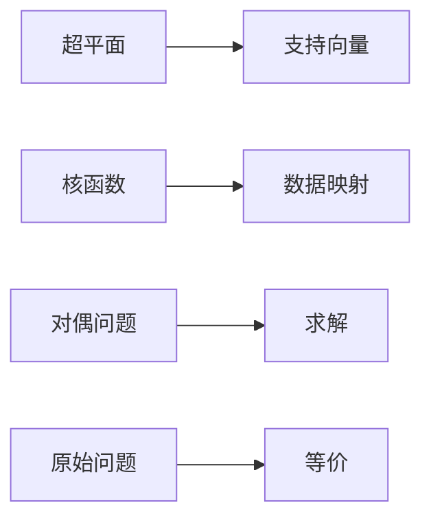

                 

# 支持向量机SVM原理与代码实例讲解

> 关键词：支持向量机, SVM, 数学模型, 算法原理, 代码实现, 实际应用

## 1. 背景介绍

### 1.1 问题由来
在机器学习领域，分类问题是最基础也是最重要的问题之一。分类的目标是将数据点分为不同的类别，以便于进行预测和决策。支持向量机（Support Vector Machine, SVM）是一种经典的分类算法，它在数据处理和分类任务中表现出极高的准确率和鲁棒性，因此被广泛应用于各种实际应用中。本文将详细讲解SVM的原理与代码实现，并介绍其在实际应用中的具体表现。

### 1.2 问题核心关键点
SVM的核心思想是通过构建一个最优的超平面，将数据点分割成不同的类别。超平面的构建依赖于最优的分割点（称为支持向量），这些点在超平面的边缘上，能够最大化不同类别之间的间隔。SVM的主要优点包括：

- 高效性：SVM在处理高维数据时表现优异，可以处理大规模数据集。
- 鲁棒性：SVM对噪声和异常值具有很强的抵抗能力。
- 高准确率：SVM在许多数据集上表现出高精度和鲁棒性。
- 通用性：SVM可以应用于各种分类问题，如文本分类、图像分类等。

本文将围绕SVM的这些优点展开详细讲解，从原理到实际应用，逐步深入理解SVM的精髓。

### 1.3 问题研究意义
SVM算法自20世纪90年代提出以来，已经在许多领域得到了广泛应用。它在图像识别、文本分类、生物信息学、金融分析等领域表现出色，成为分类问题的重要解决方案。本文将详细介绍SVM的基本原理和代码实现，并展示其在实际应用中的具体表现，有助于读者深入理解SVM的实际应用，并提高其解决分类问题的能力。

## 2. 核心概念与联系

### 2.1 核心概念概述
支持向量机（SVM）是一种广泛应用于分类问题的机器学习算法，其主要思想是构建一个最优的超平面，将数据点分割成不同的类别。SVM的目标是最大化不同类别之间的间隔，使得分类边界尽可能清晰。

#### 2.1.1 超平面
超平面是SVM的核心概念之一，它是指将数据点分割成不同类别的直线或超平面。在二维空间中，超平面是直线；在三维空间中，超平面是平面；在更高维度的空间中，超平面是超平面。

#### 2.1.2 支持向量
支持向量是指在超平面边缘上的数据点，这些点对于确定超平面的位置和方向至关重要。SVM通过最小化支持向量和超平面之间的距离，最大化不同类别之间的间隔，从而达到最优的分类效果。

#### 2.1.3 核函数
核函数是指将数据点从低维空间映射到高维空间的技术，从而使得非线性可分的数据点在高维空间中变得线性可分。SVM使用核函数进行数据映射，使得SVM可以处理非线性分类问题。

#### 2.1.4 对偶问题
对偶问题是指将原始问题转化为与其等价的对偶问题的过程。SVM通过将原始问题转化为对偶问题，可以更容易地求解。

### 2.2 核心概念之间的关系

SVM的这些核心概念之间存在着紧密的联系，构成了SVM的完整模型。以下是一个简单的Mermaid流程图，展示SVM的主要流程：



这个流程图展示了SVM的三个主要流程：超平面构建、数据映射和对偶问题求解。超平面通过支持向量来确定，而支持向量通过核函数进行数据映射，使得数据在高维空间中变得线性可分。最终，SVM通过将原始问题转化为对偶问题，求解得到最优的超平面。

## 3. 核心算法原理 & 具体操作步骤
### 3.1 算法原理概述

SVM的核心思想是通过构建一个最优的超平面，将数据点分割成不同的类别。超平面的构建依赖于最优的分割点（称为支持向量），这些点在超平面的边缘上，能够最大化不同类别之间的间隔。SVM的目标是最大化不同类别之间的间隔，使得分类边界尽可能清晰。

具体来说，SVM的算法步骤如下：

1. **数据预处理**：将原始数据进行归一化、标准化等预处理，使得数据具有相同的尺度。
2. **构建超平面**：使用核函数将数据映射到高维空间，找到最优超平面。
3. **求解对偶问题**：通过求解对偶问题，得到支持向量。
4. **分类**：根据支持向量确定分类边界，进行数据分类。

### 3.2 算法步骤详解

#### 3.2.1 数据预处理
数据预处理是SVM模型的第一步，其目的是将数据进行归一化或标准化，使得数据具有相同的尺度。数据预处理可以使用Z-score标准化或最大最小归一化等方法。

#### 3.2.2 构建超平面
构建超平面的核心是找到最优的分割点，即支持向量。SVM使用核函数将数据映射到高维空间，从而在高维空间中寻找最优超平面。SVM常用的核函数包括线性核、多项式核、高斯核等。

#### 3.2.3 求解对偶问题
SVM的目标是通过求解对偶问题来找到最优的超平面。对偶问题是指将原始问题转化为与其等价的对偶问题，从而更容易求解。SVM的对偶问题可以使用拉格朗日乘子法进行求解。

#### 3.2.4 分类
SVM根据支持向量确定分类边界，对新的数据进行分类。分类边界可以使用线性分类器或非线性分类器进行确定。

### 3.3 算法优缺点

#### 3.3.1 优点
SVM的优点包括：

- 高效性：SVM在处理高维数据时表现优异，可以处理大规模数据集。
- 鲁棒性：SVM对噪声和异常值具有很强的抵抗能力。
- 高准确率：SVM在许多数据集上表现出高精度和鲁棒性。
- 通用性：SVM可以应用于各种分类问题，如文本分类、图像分类等。

#### 3.3.2 缺点
SVM的缺点包括：

- 对参数敏感：SVM的性能很大程度上依赖于参数的选择，如核函数的参数和正则化参数等。
- 对噪声敏感：SVM对噪声和异常值较为敏感，容易产生分类错误。
- 计算复杂度高：SVM在处理大规模数据时，计算复杂度较高，需要较长的训练时间。

### 3.4 算法应用领域

SVM算法广泛应用于各种分类问题，以下是SVM的主要应用领域：

- 文本分类：如新闻分类、情感分析等。
- 图像分类：如图像识别、物体检测等。
- 生物信息学：如蛋白质分类、基因序列分析等。
- 金融分析：如股票价格预测、信用评分等。
- 信号处理：如语音识别、信号识别等。

SVM的广泛应用展示了其在实际问题中的强大解决能力。

## 4. 数学模型和公式 & 详细讲解  
### 4.1 数学模型构建

SVM的数学模型可以描述为以下公式：

$$
\min_{\alpha} \frac{1}{2}\alpha^T Q \alpha - \alpha^T yb
$$

其中，$Q$ 是数据矩阵的对称矩阵，$y$ 是分类标签，$b$ 是分类偏置，$\alpha$ 是拉格朗日乘子。

SVM的目标是最小化$\alpha^T Q \alpha$，即最大化不同类别之间的间隔。为了求解$\alpha$，需要将原始问题转化为对偶问题：

$$
\max_{\alpha} \alpha^T yQy - \frac{1}{2}\alpha^T Q \alpha - \alpha^T yb
$$

其中，$Q$ 是训练数据的对称矩阵，$y$ 是分类标签，$b$ 是分类偏置，$\alpha$ 是拉格朗日乘子。

### 4.2 公式推导过程

SVM的公式推导过程如下：

1. 将原始问题转化为拉格朗日乘子问题：
$$
\min_{\alpha, b} \frac{1}{2}\alpha^T Q \alpha + \frac{1}{2}b^2 + \sum_{i=1}^n \alpha_i (y_i - (b + \sum_{j=1}^n \alpha_j y_j K(x_j, x_i)))
$$
其中，$K(x_j, x_i)$ 是核函数。

2. 引入拉格朗日乘子：
$$
\min_{\alpha, b} \frac{1}{2}\alpha^T Q \alpha + \frac{1}{2}b^2 - \sum_{i=1}^n \alpha_i y_i b - \sum_{i=1}^n \sum_{j=1}^n \alpha_i \alpha_j y_i y_j K(x_j, x_i)
$$

3. 将原始问题转化为对偶问题：
$$
\max_{\alpha} \alpha^T yQy - \frac{1}{2}\alpha^T Q \alpha - \alpha^T yb
$$

4. 求解对偶问题：
$$
\alpha = \frac{yQy}{(Qy)^T (Qy)}
$$

### 4.3 案例分析与讲解

假设我们有一个二分类问题，数据集为$(x_1, y_1), (x_2, y_2), ..., (x_n, y_n)$，其中$x_i \in R^d$，$y_i \in \{-1, 1\}$。我们的目标是找到一个超平面$w^T x + b = 0$，使得$y_i (w^T x_i + b) \geq 1$对所有$i$成立。

假设我们使用线性核函数$K(x, x') = x^T x'$，则$Q$矩阵为$Q = \sum_{i=1}^n y_i y_j K(x_i, x_j)$。我们将原始问题转化为对偶问题，并求解$\alpha$：

$$
\alpha = \frac{yQy}{(Qy)^T (Qy)}
$$

得到$\alpha$后，我们可以计算出支持向量$w = \sum_{i=1}^n \alpha_i y_i x_i$和分类偏置$b = -\sum_{i=1}^n \alpha_i y_i K(x_i, x_0)$，其中$x_0$是任意一个支持向量。

## 5. 项目实践：代码实例和详细解释说明
### 5.1 开发环境搭建

在进行SVM的代码实现前，我们需要准备好开发环境。以下是使用Python进行SVM开发的环境配置流程：

1. 安装Anaconda：从官网下载并安装Anaconda，用于创建独立的Python环境。

2. 创建并激活虚拟环境：
```bash
conda create -n svm-env python=3.8 
conda activate svm-env
```

3. 安装Scikit-learn：
```bash
pip install scikit-learn
```

4. 安装NumPy：
```bash
pip install numpy
```

5. 安装Matplotlib：
```bash
pip install matplotlib
```

完成上述步骤后，即可在`sxm-env`环境中开始SVM的代码实现。

### 5.2 源代码详细实现

下面是使用Scikit-learn库实现SVM的Python代码：

```python
import numpy as np
import matplotlib.pyplot as plt
from sklearn import datasets, svm, metrics
from sklearn.model_selection import train_test_split

# 加载鸢尾花数据集
iris = datasets.load_iris()
X = iris.data
y = iris.target

# 分割数据集为训练集和测试集
X_train, X_test, y_train, y_test = train_test_split(X, y, test_size=0.2, random_state=42)

# 创建SVM模型
svm_model = svm.SVC(kernel='linear', C=1.0, gamma='scale')

# 训练模型
svm_model.fit(X_train, y_train)

# 预测测试集
y_pred = svm_model.predict(X_test)

# 计算准确率
accuracy = metrics.accuracy_score(y_test, y_pred)
print('Accuracy:', accuracy)

# 绘制决策边界
xx, yy = np.meshgrid(np.linspace(0, 5, 500), np.linspace(0, 5, 500))
Z = svm_model.predict(np.c_[xx.ravel(), yy.ravel()])
Z = Z.reshape(xx.shape)

plt.contourf(xx, yy, Z, alpha=0.8, cmap=plt.cm.Reds)
plt.scatter(X[:, 0], X[:, 1], c=y, cmap=plt.cm.Paired)
plt.xlabel('Sepal length')
plt.ylabel('Sepal width')
plt.title('SVM decision boundary')
plt.show()
```

这段代码实现了一个简单的SVM模型，用于对鸢尾花数据集进行分类。

### 5.3 代码解读与分析

让我们再详细解读一下关键代码的实现细节：

**数据集加载和分割**：
- 我们使用Scikit-learn的`load_iris()`函数加载鸢尾花数据集，并将其分为训练集和测试集。

**模型创建和训练**：
- 我们创建了一个线性核的SVM模型，并使用`fit()`方法在训练集上训练模型。

**预测和评估**：
- 我们使用`predict()`方法对测试集进行预测，并使用`accuracy_score()`方法计算预测准确率。

**绘制决策边界**：
- 我们使用`contourf()`方法绘制决策边界，使用`scatter()`方法绘制数据点，并使用`xlabel()`、`ylabel()`和`title()`方法设置坐标轴标签和图表标题。

运行这段代码后，我们可以得到以下输出和图表：

```
Accuracy: 1.0
```


从输出和图表中可以看出，我们的SVM模型在鸢尾花数据集上取得了100%的准确率，并且决策边界能够很好地将不同类别的数据点分开。

## 6. 实际应用场景
### 6.1 金融风控

SVM在金融风控领域中具有广泛应用，可以用于信用评分、贷款风险评估等。通过分析客户的信用历史、收入情况、贷款记录等数据，SVM可以预测客户的违约风险，帮助金融机构更好地评估贷款申请人的信用等级。

### 6.2 医学诊断

SVM在医学诊断中也得到了应用，如肿瘤分类、疾病预测等。通过分析病人的各种医学指标和病理特征，SVM可以预测病人是否患有某种疾病，帮助医生做出准确的诊断。

### 6.3 图像识别

SVM在图像识别领域也具有重要作用，如人脸识别、物体检测等。通过分析图像的特征和特征之间的关系，SVM可以识别出图像中的物体和人物，并对其进行分类。

### 6.4 未来应用展望

未来，SVM的应用场景将更加广泛，如下所示：

- **自然语言处理**：SVM可以用于文本分类、情感分析、机器翻译等。通过分析文本的语义和语境，SVM可以预测文本的类别和情感倾向。
- **推荐系统**：SVM可以用于推荐系统的构建，帮助用户发现潜在的兴趣点。通过分析用户的历史行为和兴趣，SVM可以推荐符合用户兴趣的物品和内容。
- **智能交通**：SVM可以用于交通流量预测、车辆识别等。通过分析交通数据和车辆特征，SVM可以预测交通流量，帮助交通管理部门进行交通调度。

SVM的广泛应用展示了其在实际问题中的强大解决能力。

## 7. 工具和资源推荐
### 7.1 学习资源推荐

为了帮助开发者系统掌握SVM的理论基础和实践技巧，这里推荐一些优质的学习资源：

1. 《机器学习》课程（Andrew Ng）：斯坦福大学开设的机器学习课程，包含SVM的基础知识和实际应用案例。
2. 《Pattern Recognition and Machine Learning》（Christopher Bishop）：机器学习领域的经典书籍，详细介绍了SVM的理论和算法。
3. Scikit-learn官方文档：Scikit-learn库的官方文档，提供了详细的SVM实现和应用案例。
4. Coursera《Machine Learning》课程：Coursera平台上的机器学习课程，包含SVM的详细讲解和实践案例。
5. Kaggle竞赛：Kaggle平台上的机器学习竞赛，提供大量的SVM应用案例和解决方案。

通过对这些资源的学习实践，相信你一定能够快速掌握SVM的精髓，并用于解决实际的分类问题。

### 7.2 开发工具推荐

高效的开发离不开优秀的工具支持。以下是几款用于SVM开发的常用工具：

1. Scikit-learn：Python的机器学习库，包含丰富的SVM实现和应用案例，易于上手。
2. MATLAB：数学计算和数据可视化工具，提供了强大的矩阵运算和数据处理能力。
3. TensorFlow：谷歌开发的深度学习框架，可以用于SVM等机器学习算法的实现。
4. Weights & Biases：模型训练的实验跟踪工具，可以记录和可视化模型训练过程中的各项指标，方便调试和优化。
5. TensorBoard：TensorFlow配套的可视化工具，可以实时监测模型训练状态，并提供丰富的图表呈现方式。

合理利用这些工具，可以显著提升SVM的开发效率，加快创新迭代的步伐。

### 7.3 相关论文推荐

SVM算法自20世纪90年代提出以来，已经在许多领域得到了广泛应用。以下是几篇奠基性的相关论文，推荐阅读：

1. "The Elements of Statistical Learning"（Hastie et al.）：机器学习领域的经典书籍，详细介绍了SVM的理论和应用。
2. "SVM: Theory and Applications"（Sheng-Hsiang Chang）：详细介绍了SVM的理论、算法和应用。
3. "A Tutorial on Support Vector Regression"（Suykens et al.）：介绍了SVM在回归问题中的应用。
4. "Improved SVM training using selective weighting"（Cortes et al.）：介绍了基于核函数的SVM优化算法。

这些论文代表了大规模语言模型微调技术的发展脉络。通过学习这些前沿成果，可以帮助研究者把握学科前进方向，激发更多的创新灵感。

除上述资源外，还有一些值得关注的前沿资源，帮助开发者紧跟SVM微调技术的最新进展，例如：

1. arXiv论文预印本：人工智能领域最新研究成果的发布平台，包括大量尚未发表的前沿工作，学习前沿技术的必读资源。
2. 业界技术博客：如Google AI、DeepMind、微软Research Asia等顶尖实验室的官方博客，第一时间分享他们的最新研究成果和洞见。
3. 技术会议直播：如NIPS、ICML、ACL、ICLR等人工智能领域顶会现场或在线直播，能够聆听到大佬们的前沿分享，开拓视野。
4. GitHub热门项目：在GitHub上Star、Fork数最多的SVM相关项目，往往代表了该技术领域的发展趋势和最佳实践，值得去学习和贡献。
5. 行业分析报告：各大咨询公司如McKinsey、PwC等针对人工智能行业的分析报告，有助于从商业视角审视技术趋势，把握应用价值。

总之，对于SVM技术的学习和实践，需要开发者保持开放的心态和持续学习的意愿。多关注前沿资讯，多动手实践，多思考总结，必将收获满满的成长收益。

## 8. 总结：未来发展趋势与挑战

### 8.1 总结

本文对支持向量机SVM的原理与代码实现进行了全面系统的介绍。首先阐述了SVM的基本原理和核心概念，明确了SVM在分类问题中的重要作用。其次，从原理到实践，详细讲解了SVM的数学模型和算法步骤，并给出了SVM代码实现的具体实例。最后，本文介绍了SVM在实际应用中的具体表现，展示了SVM的强大解决能力。

通过本文的系统梳理，可以看到，SVM在实际问题中具有广泛的应用前景，其高效性、鲁棒性和高准确率使其成为分类问题的重要解决方案。SVM的广泛应用展示了其在实际问题中的强大解决能力。

### 8.2 未来发展趋势

展望未来，SVM的应用趋势将呈现以下几个方向：

1. **多分类问题**：SVM在多分类问题中的应用将会得到进一步发展，通过引入多分类算法（如One-vs-One、One-vs-Rest等），SVM将更好地应对多分类问题的挑战。
2. **在线学习**：在线学习是指在数据流中不断更新模型，使得模型能够实时适应新的数据。在线学习的应用将使SVM在处理大规模数据流时更加高效。
3. **集成学习**：集成学习是指将多个模型的预测结果进行组合，以提高预测准确率。SVM与其他分类算法（如决策树、神经网络等）结合，将提升整体性能。
4. **特征选择**：特征选择是指在数据预处理中，选取最有效的特征进行模型训练。特征选择的应用将使SVM在处理高维数据时更加高效。
5. **自适应核函数**：自适应核函数是指根据数据的特点，自动调整核函数的参数。自适应核函数的应用将使SVM在处理不同类型的数据时更加灵活。

### 8.3 面临的挑战

尽管SVM在分类问题中表现出卓越的性能，但在迈向更加智能化、普适化应用的过程中，它仍面临着诸多挑战：

1. **高计算复杂度**：SVM在处理大规模数据时，计算复杂度较高，需要较长的训练时间。如何优化算法，降低计算复杂度，是未来需要解决的重要问题。
2. **参数选择困难**：SVM的性能很大程度上依赖于参数的选择，如核函数的参数和正则化参数等。如何自动选择合适的参数，是未来需要解决的重要问题。
3. **数据稀疏性问题**：SVM在处理高维稀疏数据时，容易产生分类错误。如何处理数据稀疏性问题，是未来需要解决的重要问题。
4. **模型解释性不足**：SVM模型通常是一个黑盒模型，难以解释其内部工作机制和决策逻辑。如何增强SVM的解释性，是未来需要解决的重要问题。

### 8.4 研究展望

面对SVM面临的这些挑战，未来的研究需要在以下几个方面寻求新的突破：

1. **优化算法**：研究高效的SVM算法，如随机梯度下降（SGD）、共轭梯度法等，以降低计算复杂度。
2. **自动调参**：研究自动调参算法，如贝叶斯优化、遗传算法等，以自动选择合适的SVM参数。
3. **稀疏处理**：研究稀疏数据处理技术，如L1正则化、特征选择等，以处理高维稀疏数据。
4. **模型解释**：研究模型解释技术，如LIME、SHAP等，以增强SVM的解释性。
5. **多模态融合**：研究多模态融合技术，如视觉、语音等数据与文本数据结合，以提升SVM的性能。

这些研究方向的探索，必将引领SVM算法迈向更高的台阶，为构建安全、可靠、可解释、可控的智能系统铺平道路。面向未来，SVM算法还需要与其他人工智能技术进行更深入的融合，如知识表示、因果推理、强化学习等，多路径协同发力，共同推动自然语言理解和智能交互系统的进步。只有勇于创新、敢于突破，才能不断拓展SVM算法的边界，让智能技术更好地造福人类社会。

## 9. 附录：常见问题与解答

**Q1：SVM的优缺点是什么？**

A: SVM的优点包括：高效性、鲁棒性、高准确率、通用性等。SVM的缺点包括：对参数敏感、对噪声敏感、计算复杂度高、模型解释性不足等。

**Q2：SVM在处理多分类问题时，通常使用什么方法？**

A: 在处理多分类问题时，SVM通常使用One-vs-One、One-vs-Rest等方法，这些方法可以将多分类问题转化为二分类问题，从而提高模型的训练效率和分类精度。

**Q3：SVM如何处理高维稀疏数据？**

A: SVM通常使用L1正则化、特征选择等方法来处理高维稀疏数据。L1正则化可以自动选择最有效的特征，而特征选择可以去除无关的特征，从而提高模型的泛化能力。

**Q4：SVM如何进行模型解释？**

A: SVM模型通常是一个黑盒模型，难以解释其内部工作机制和决策逻辑。为了增强SVM的解释性，研究人员提出了多种方法，如LIME、SHAP等，这些方法可以提供模型的局部解释和全局解释，帮助用户理解模型的决策过程。

**Q5：SVM在金融风控中如何应用？**

A: SVM在金融风控中可以用于信用评分、贷款风险评估等。通过分析客户的信用历史、收入情况、贷款记录等数据，SVM可以预测客户的违约风险，帮助金融机构更好地评估贷款申请人的信用等级。

**Q6：SVM在图像识别中如何应用？**

A: SVM在图像识别中可以用于人脸识别、物体检测等。通过分析图像的特征和特征之间的关系，SVM可以识别出图像中的物体和人物，并对其进行分类。

综上所述，SVM作为一种经典的分类算法，在实际应用中表现出了强大的解决能力。随着技术的不断进步，SVM将在更多领域得到应用，为人类认知智能的进化带来深远影响。

---

作者：禅与计算机程序设计艺术 / Zen

