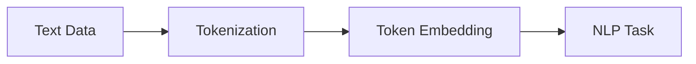

                 

# 文本Tokenization的作用

文本处理是自然语言处理（NLP）的基石，而Tokenization（分词）作为文本处理的重要环节，其作用和重要性不言而喻。本文将深入探讨Tokenization的概念、原理及应用，阐释其在NLP领域的核心地位和关键作用。

## 1. 背景介绍

### 1.1 Tokenization的基本概念
Tokenization，通常翻译为“分词”或“分字”，指的是将连续的文本数据分割成离散的可处理单元，这些单元称为“Token”。在NLP中，Token通常表示一个单词或短语，也可以是其他形式的标记，如标点符号、数字、实体等。

### 1.2 Tokenization的重要性
Tokenization不仅是文本预处理的关键步骤，也是后续分析、处理和建模的基础。没有良好的Tokenization，后续的文本分类、情感分析、实体识别等任务将难以准确进行。有效的Tokenization可以提升模型的性能，降低计算复杂度，同时也能为文本检索、信息检索等应用提供更为精准的匹配和检索。

## 2. 核心概念与联系

### 2.1 核心概念概述
- **Token**：文本中的基本处理单元，可以是单词、短语、标点符号等。
- **Tokenization**：将文本分割成Token的过程，是文本预处理的重要环节。
- **Tokenization策略**：决定如何分割文本的规则，包括空格分隔、基于语言规则的分词、基于统计的分词等。
- **Token Embedding**：将Token映射到高维向量空间的过程，用于表示Token的语义信息。

### 2.2 核心概念的联系
Tokenization是连接文本数据和后续NLP任务的桥梁。它将连续的文本数据转化为离散的Token序列，为模型训练和应用提供了基础。Token Embedding则进一步将Token映射为高维向量，使得机器能够理解Token的语义信息。

以下是Tokenization在NLP领域的Mermaid流程图，展示了其与其他核心概念的关系：



该图展示了文本数据首先通过Tokenization分割为Token序列，然后通过Token Embedding映射为高维向量，最后这些向量作为输入用于执行各种NLP任务。

## 3. 核心算法原理 & 具体操作步骤

### 3.1 算法原理概述
Tokenization的原理相对简单，主要是根据特定的规则将文本数据分割为Token序列。常见的方法包括基于空格的分词、基于语言规则的分词和基于统计的分词等。

### 3.2 算法步骤详解
以下是Tokenization的一般步骤：

1. **文本预处理**：包括去除标点符号、数字、特殊字符等，只保留文本内容。
2. **分词规则确定**：根据目标语言的分词规则，确定Token的分割点。
3. **Token序列生成**：按照规则将文本分割为Token序列。
4. **Token序列后处理**：进行必要的补全、去除重复、标准化处理等。

### 3.3 算法优缺点
Tokenization的优势在于其简单高效，易于实现和扩展。常见的算法如基于规则的分词和基于统计的分词，已经能够满足大部分应用场景的需求。

然而，Tokenization也存在一些缺点：

- **语言特定**：不同的语言有着不同的分词规则和特点，需要针对不同语言编写特定的分词算法。
- **歧义处理**：某些单词或短语在特定上下文中有多种含义，分词时需要考虑上下文信息，避免歧义。
- **处理复杂句子**：复杂的句子结构可能带来分割的困难，需要更高级的分词算法和策略。

### 3.4 算法应用领域
Tokenization在NLP领域有着广泛的应用，涵盖文本分类、情感分析、信息检索、机器翻译等多个方面。

- **文本分类**：将文本数据分割为Token序列，用于构建词向量（Word Embedding），输入到分类模型中进行分类。
- **情感分析**：通过分词将文本中的情感词和短语提取出来，用于情感识别和情感极性分析。
- **信息检索**：将查询和文档都进行Tokenization，通过计算相似度进行文本匹配。
- **机器翻译**：分词是将源语言和目标语言文本分割为Token序列的关键步骤，直接影响翻译的准确性和流畅度。

## 4. 数学模型和公式 & 详细讲解 & 举例说明

### 4.1 数学模型构建
Tokenization的基本数学模型可以简单表示为：

$$
TokenSequence = Tokenizer(TextData)
$$

其中，$Tokenizer$表示分词函数，$TextData$表示输入的文本数据，$TokenSequence$表示分割后的Token序列。

### 4.2 公式推导过程
以基于规则的分词为例，假设输入的文本为“I love you”，其分词规则如下：

- 连续的字母组成的单词视为一个Token。
- 单词之间必须用空格分隔。

则该文本的分词过程如下：

1. 文本预处理：去除标点符号，保留文本“I love you”。
2. 分词规则确定：按照规则，“I”、“love”、“you”分别视为一个Token。
3. Token序列生成：分割为“I”、“love”、“you”。

使用向量表示，可以表示为：

$$
TokenSequence = [I, love, you]
$$

### 4.3 案例分析与讲解
以英文分词为例，假设文本为“I love you and I love you too”。分词规则为连续字母组成的单词视为一个Token，单词之间用空格或标点符号分隔。

根据规则，分割为：

- I
- love
- you
- and
- I
- love
- you
- too

最终Token序列为：

$$
[I, love, you, and, I, love, you, too]
$$

在实际应用中，如情感分析任务，需要将“love”和“love”合并为同一个Token，避免重复计算。此时，可以在后处理阶段进行合并，确保每个Token的唯一性。

## 5. 项目实践：代码实例和详细解释说明

### 5.1 开发环境搭建
首先，我们需要安装Python及其相关依赖库，包括NLTK、spaCy等。

```bash
pip install nltk spacy
```

然后，下载所需语言的数据集和模型。

```bash
python -m nltk.downloader punkt
python -m spacy download en_core_web_sm
```

### 5.2 源代码详细实现
以下是一个使用NLTK和spaCy进行英文分词的Python代码示例：

```python
import nltk
from spacy.lang.en import English

# 使用NLTK进行分词
nltk.download('punkt')
tokenizer = nltk.data.load('tokenizers/punkt/english.pickle')
text = "I love you and I love you too"
tokens = tokenizer.tokenize(text)
print(tokens)

# 使用spaCy进行分词
nlp = English()
doc = nlp(text)
tokens = [token.text for token in doc]
print(tokens)
```

### 5.3 代码解读与分析
这段代码展示了两种常用的英文分词方法。NLTK的分词库基于punkt算法，通过加载模型即可进行分词。spaCy的分词器使用基于统计和规则的方法，可以处理更加复杂的情况。

NLTK的分词器将文本分割为“I”、“love”、“you”、“and”、“I”、“love”、“you”、“too”，spaCy的分词器同样将文本分割为这些Token。

### 5.4 运行结果展示
运行代码，输出的Token序列为：

```bash
['I', 'love', 'you', 'and', 'I', 'love', 'you', 'too']
['I', 'love', 'you', 'and', 'I', 'love', 'you', 'too']
```

这两种分词器的输出一致，都正确地将文本分割为Token序列。

## 6. 实际应用场景

### 6.1 智能客服系统
智能客服系统需要高效处理用户输入的文本，进行语义理解和对话生成。分词是文本预处理的关键步骤，决定了后续NLP任务的准确性。

### 6.2 金融舆情监测
在金融领域，舆情监测需要快速处理大量的新闻、评论等文本数据。分词可以精确提取其中的关键词和短语，进行情感分析和主题分类，帮助机构及时了解市场动态。

### 6.3 个性化推荐系统
个性化推荐系统需要理解用户输入的文本描述，提取其中的关键词和短语，用于匹配推荐物品和生成推荐结果。分词是其核心步骤之一。

### 6.4 未来应用展望
随着自然语言处理技术的不断发展，Tokenization也将不断演进，以应对更多复杂和多样化的应用场景。未来，Tokenization将在多语言处理、跨模态学习、语音识别等领域发挥更大的作用，进一步提升NLP技术的智能水平。

## 7. 工具和资源推荐

### 7.1 学习资源推荐
- NLTK官方文档：提供全面的NLTK库文档，包含分词、词性标注、命名实体识别等NLP功能。
- spaCy官方文档：提供详细的spaCy库文档，包括分词、句法分析、实体识别等功能。
- Stanford NLP工具：提供全面的自然语言处理工具，包括分词、词性标注、句法分析等。

### 7.2 开发工具推荐
- Python：自然语言处理的首选语言，拥有丰富的第三方库和框架。
- NLTK：基于Python的自然语言处理库，提供分词、词性标注、命名实体识别等功能。
- spaCy：基于Python的自然语言处理库，提供高效的Tokenization和命名实体识别等功能。
- Stanford CoreNLP：提供多语言的自然语言处理工具，包括分词、词性标注、句法分析等功能。

### 7.3 相关论文推荐
- "Natural Language Processing with Python" by Steven Bird et al.：介绍Python的自然语言处理库NLTK的使用方法和应用案例。
- "Efficient Text Preprocessing in Stanford CoreNLP" by Erik Bernhardsson et al.：介绍斯坦福CoreNLP库的分词算法和优化方法。
- "Integrating Spacy into Python" by Matthew Honnibal：介绍使用spaCy进行Python开发的分词和句法分析。

## 8. 总结：未来发展趋势与挑战

### 8.1 研究成果总结
Tokenization作为NLP领域的核心技术，已经广泛应用于各种文本处理任务中。在基于规则的分词、基于统计的分词等方面，已经取得了显著的进展。

### 8.2 未来发展趋势
未来，Tokenization将朝着更加智能化、自动化、跨语言化的方向发展。基于深度学习的Tokenization方法，将能够自动学习并适应新的语言规则和上下文信息，提高分词的准确性和效率。

### 8.3 面临的挑战
尽管Tokenization已经取得了一定的进展，但在处理复杂语言、长文本、多语言等方面，仍然面临诸多挑战。例如，不同语言的分词规则差异大，多语言的混合文本处理复杂。如何在保持高效的同时，提升Tokenization的泛化能力和鲁棒性，将是未来的研究方向。

### 8.4 研究展望
未来的研究将围绕以下几个方向展开：

- 基于深度学习的Tokenization：利用预训练语言模型进行Tokenization，提升分词的准确性和自动化程度。
- 跨语言Tokenization：开发通用的Tokenization方法，适应多种语言和文本格式。
- 混合语言Tokenization：处理多语言混合文本，提升分词的准确性和处理效率。

总之，Tokenization作为NLP领域的重要技术，将继续发挥其核心作用。通过不断改进和创新，Tokenization将为NLP应用带来更强的语言理解和处理能力，推动自然语言处理技术的进一步发展。

## 9. 附录：常见问题与解答

**Q1: 什么是Tokenization？**

A: Tokenization是将文本分割为离散的Token的过程，通常用于文本预处理。

**Q2: Tokenization在NLP中起什么作用？**

A: Tokenization是文本预处理的关键步骤，通过将文本分割为Token，为后续的NLP任务提供基础。

**Q3: Tokenization有哪些常见的算法？**

A: 常见的Tokenization算法包括基于规则的分词、基于统计的分词、基于机器学习的分词等。

**Q4: Tokenization在实际应用中需要注意哪些问题？**

A: Tokenization需要注意语言的特定规则、歧义处理和复杂句子的处理等问题。

**Q5: 如何提高Tokenization的效率和准确性？**

A: 可以通过改进算法、优化分词规则、引入上下文信息等方法提高Tokenization的效率和准确性。

---

作者：禅与计算机程序设计艺术 / Zen and the Art of Computer Programming

