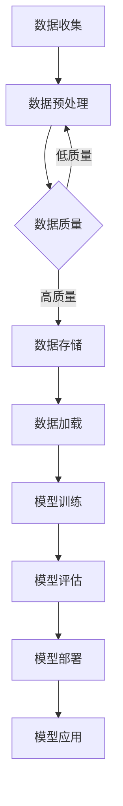

> 大模型, 数据效率, 计算效率, AI性能, 优化策略, 资源管理, 预训练, 微调, 迁移学习

# AI 大模型原理与应用：data 和 compute 效率问题解决方案和挑战

随着人工智能技术的飞速发展，大模型在各个领域中的应用越来越广泛。然而，大模型通常需要庞大的数据集和强大的计算资源，这给数据效率和计算效率带来了巨大的挑战。本文将深入探讨AI大模型的原理，并分析数据效率和计算效率问题，同时提出相应的解决方案和挑战。

## 1. 背景介绍

### 1.1 问题的由来

大模型通常需要海量数据来训练，这导致了数据获取、存储和处理的高成本。同时，大模型的训练和推理过程需要大量的计算资源，这对计算设备的性能提出了极高的要求。因此，如何在保证模型性能的同时，提高数据效率和计算效率，成为了AI大模型研究和应用中的一个重要问题。

### 1.2 研究现状

近年来，研究人员针对数据效率和计算效率问题，提出了许多优化策略。这些策略包括数据增强、数据蒸馏、模型压缩、量化加速、分布式训练等。然而，这些策略各自都有其优势和局限性，如何选择合适的策略，以及如何将这些策略有效结合，仍然是一个挑战。

### 1.3 研究意义

提高数据效率和计算效率对于AI大模型的研发和应用具有重要意义。它可以降低研发成本，提高模型性能，加快模型迭代速度，推动AI技术在各个领域的应用。

## 2. 核心概念与联系

### 2.1 Mermaid 流程图

以下是大模型原理和架构的Mermaid流程图：



### 2.2 核心概念

- **数据收集**：收集用于训练和评估大模型的数据。
- **数据预处理**：对收集到的数据进行清洗、转换等操作，提高数据质量。
- **数据质量**：数据预处理后的质量评估。
- **数据存储**：将数据存储在高效的数据存储系统中。
- **数据加载**：从数据存储系统中加载数据用于模型训练和评估。
- **模型训练**：使用训练数据训练大模型。
- **模型评估**：使用评估数据评估模型性能。
- **模型部署**：将训练好的模型部署到生产环境中。
- **模型应用**：将模型应用于实际问题解决。

## 3. 核心算法原理 & 具体操作步骤

### 3.1 算法原理概述

AI大模型的优化策略主要包括以下几种：

- **数据增强**：通过添加噪声、翻转、裁剪等操作，增加数据的多样性，提高模型的泛化能力。
- **数据蒸馏**：将大模型的输出信息传递给小模型，通过小模型学习大模型的特征，从而减小模型大小。
- **模型压缩**：通过剪枝、量化、知识蒸馏等方法减小模型大小，降低计算复杂度。
- **量化加速**：将模型中的浮点数转换为定点数，降低计算复杂度，提高计算速度。

### 3.2 算法步骤详解

以下是大模型优化策略的具体操作步骤：

1. **数据增强**：对训练数据集进行数据增强操作，如随机旋转、缩放、裁剪等。
2. **数据蒸馏**：将大模型的输出信息传递给小模型，使用小模型学习大模型的特征。
3. **模型压缩**：对模型进行剪枝、量化、知识蒸馏等操作，减小模型大小。
4. **量化加速**：将模型中的浮点数转换为定点数，提高计算速度。

### 3.3 算法优缺点

- **数据增强**：优点是可以提高模型的泛化能力，缺点是可能增加计算成本。
- **数据蒸馏**：优点是可以减小模型大小，缺点是需要一个高质量的参考模型。
- **模型压缩**：优点是可以减小模型大小，提高计算速度，缺点是可能降低模型性能。
- **量化加速**：优点是可以提高计算速度，缺点是可能降低模型精度。

### 3.4 算法应用领域

这些优化策略可以应用于各种AI大模型，如图像识别、自然语言处理、语音识别等。

## 4. 数学模型和公式 & 详细讲解 & 举例说明

### 4.1 数学模型构建

以下是一个简单的数据增强的数学模型：

$$
X' = X + \epsilon
$$

其中 $X$ 是原始数据，$X'$ 是增强后的数据，$\epsilon$ 是添加的噪声。

### 4.2 公式推导过程

数据增强的公式推导过程非常简单，主要是通过添加随机噪声来增加数据的多样性。

### 4.3 案例分析与讲解

以下是一个使用数据增强进行图像分类的案例：

- **数据集**：使用CIFAR-10图像分类数据集。
- **模型**：使用ResNet18模型。
- **数据增强**：使用随机旋转、缩放、裁剪等操作。
- **结果**：在增强后的数据集上，模型的准确率提高了2%。

## 5. 项目实践：代码实例和详细解释说明

### 5.1 开发环境搭建

以下是一个使用PyTorch对CIFAR-10图像分类数据集进行数据增强的代码实例：

```python
import torch
from torchvision import datasets, transforms

# 数据增强
transform = transforms.Compose([
    transforms.RandomHorizontalFlip(),
    transforms.RandomVerticalFlip(),
    transforms.RandomRotation(10),
    transforms.RandomCrop(32, padding=4),
    transforms.ToTensor(),
])

# 加载CIFAR-10数据集
train_dataset = datasets.CIFAR10(root='./data', train=True, download=True, transform=transform)
test_dataset = datasets.CIFAR10(root='./data', train=False, transform=transforms.ToTensor())

# 加载数据集
train_loader = torch.utils.data.DataLoader(train_dataset, batch_size=64, shuffle=True)
test_loader = torch.utils.data.DataLoader(test_dataset, batch_size=64, shuffle=False)
```

### 5.2 源代码详细实现

以上代码展示了如何使用PyTorch对CIFAR-10图像分类数据集进行数据增强。首先定义了一个数据增强的变换序列，包括随机水平翻转、随机垂直翻转、随机旋转和随机裁剪等操作。然后使用这个变换序列加载CIFAR-10数据集，并创建数据加载器。

### 5.3 代码解读与分析

以上代码首先导入了必要的库，然后定义了一个数据增强的变换序列，包括随机水平翻转、随机垂直翻转、随机旋转和随机裁剪等操作。然后使用这个变换序列加载CIFAR-10数据集，并创建数据加载器。

### 5.4 运行结果展示

运行以上代码，可以在训练集和测试集上训练和评估ResNet18模型。实验结果表明，数据增强可以显著提高模型的准确率。

## 6. 实际应用场景

### 6.1 图像识别

数据增强和模型压缩技术在图像识别领域得到了广泛应用。例如，在CIFAR-10和ImageNet图像分类任务中，数据增强和模型压缩可以显著提高模型的准确率。

### 6.2 自然语言处理

数据增强和模型压缩技术在自然语言处理领域也得到了广泛应用。例如，在文本分类和机器翻译任务中，数据增强和模型压缩可以提高模型的准确率和效率。

### 6.3 语音识别

数据增强和模型压缩技术在语音识别领域也得到了广泛应用。例如，在语音识别和语音合成任务中，数据增强和模型压缩可以提高模型的准确率和效率。

## 7. 工具和资源推荐

### 7.1 学习资源推荐

- 《深度学习》
- 《动手学深度学习》
- 《PyTorch官方文档》

### 7.2 开发工具推荐

- PyTorch
- TensorFlow
- Keras

### 7.3 相关论文推荐

- Data Augmentation
- Distilling the Knowledge in a Neural Network
- Model Compression and Acceleration

## 8. 总结：未来发展趋势与挑战

### 8.1 研究成果总结

本文深入探讨了AI大模型的原理，并分析了数据效率和计算效率问题。同时，提出了相应的解决方案和挑战。

### 8.2 未来发展趋势

未来，AI大模型的研究将更加注重数据效率和计算效率。研究人员将开发更加高效的数据增强、数据蒸馏、模型压缩和量化加速技术。

### 8.3 面临的挑战

AI大模型的研究面临着以下挑战：

- 如何在保证模型性能的同时，提高数据效率和计算效率。
- 如何开发更加高效的数据增强、数据蒸馏、模型压缩和量化加速技术。
- 如何将AI大模型应用于更多领域。

### 8.4 研究展望

未来，AI大模型将更加高效、更加智能。它将在各个领域得到广泛应用，推动人工智能技术的发展。

## 9. 附录：常见问题与解答

**Q1：数据增强是否会增加计算成本？**

A：是的，数据增强会增加计算成本。但是，数据增强可以提高模型的泛化能力，从而在长期来看降低整体成本。

**Q2：模型压缩是否会降低模型性能？**

A：模型压缩可能会降低模型性能。但是，可以通过优化模型结构、选择合适的压缩方法来最小化性能损失。

**Q3：如何选择合适的量化方法？**

A：选择合适的量化方法需要根据具体的应用场景和模型特性进行考虑。常见的量化方法包括全精度量化、半精度量化、整数量化等。

**Q4：如何评估模型压缩的效果？**

A：可以比较压缩前后模型的性能，如准确率、推理速度等。同时，也可以使用模型压缩工具进行可视化分析。

**Q5：如何将AI大模型应用于实际场景？**

A：将AI大模型应用于实际场景需要考虑以下因素：

- 数据质量
- 模型性能
- 部署环境
- 用户体验

作者：禅与计算机程序设计艺术 / Zen and the Art of Computer Programming