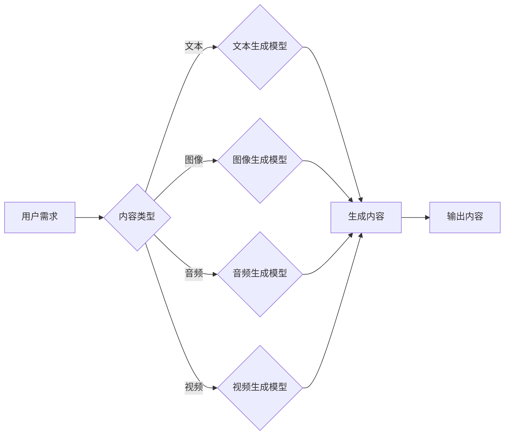

> AIGC, 人工智能生成内容, 自动生成, 内容创作, 创新驱动, 行业应用

# AIGC从入门到实战：AIGC 赋能行业，产生无数新机会

人工智能的飞速发展，正在深刻地改变着各个行业的面貌。其中，人工智能生成内容（AIGC，Artificial Intelligence Generated Content）作为人工智能领域的最新突破，正以惊人的速度渗透到内容创作的各个领域，为行业带来了无数新的机遇。本文将带您从入门到实战，深入了解AIGC的原理、技术、应用场景以及未来发展趋势。

## 1. 背景介绍

### 1.1 问题的由来

随着互联网的普及和信息爆炸，内容创作成为了一种重要的生产力。然而，内容创作者面临着巨大的挑战：

- 内容创作周期长：从选题、策划、撰写、编辑到发布，每个环节都需要消耗大量时间和精力。
- 内容形式单一：传统的内容创作方式往往依赖于人工，难以满足多样化的需求。
- 内容质量参差不齐：由于时间和精力的限制，创作者难以保证所有内容的质量。

为了解决这些问题，人工智能生成内容（AIGC）应运而生。AIGC利用人工智能技术，可以自动生成文本、图像、音频、视频等多种形式的内容，极大地提高了内容创作的效率和质量。

### 1.2 研究现状

目前，AIGC技术已经取得了显著的进展，主要体现在以下几个方面：

- 文本生成：GPT-3、LaMDA等大型语言模型可以生成各种风格的文本，包括新闻报道、小说、诗歌等。
- 图像生成：GPT-4、DALL-E等模型可以生成逼真的图像，甚至可以模仿特定艺术家的风格。
- 音频生成：OpenAI的Jasper可以生成流畅的音频，包括音乐、对话等。
- 视频生成：DeepMind的VideoGen可以生成具有连贯逻辑和动作的视频。

### 1.3 研究意义

AIGC技术的发展具有以下重要意义：

- 提高内容创作效率：AIGC可以自动生成大量内容，极大地提高了内容创作者的生产效率。
- 丰富内容形式：AIGC可以生成不同形式的内容，满足多样化的需求。
- 提升内容质量：AIGC可以生成高质量的内容，降低内容质量参差不齐的问题。
- 创造新的商业模式：AIGC可以开辟新的商业模式，例如个性化内容推荐、自动化内容生成等。

### 1.4 本文结构

本文将分为以下章节：

- 第2章：介绍AIGC的核心概念与联系。
- 第3章：讲解AIGC的核心算法原理和具体操作步骤。
- 第4章：解析AIGC的数学模型和公式。
- 第5章：通过项目实践展示AIGC的应用。
- 第6章：分析AIGC的实际应用场景和未来应用展望。
- 第7章：推荐AIGC的学习资源和开发工具。
- 第8章：总结AIGC的未来发展趋势和挑战。
- 第9章：附录，常见问题与解答。

## 2. 核心概念与联系

### 2.1 核心概念

AIGC的核心概念包括：

- 人工智能：一种模拟人类智能行为的计算机技术，具有学习、推理、感知和自适应能力。
- 生成模型：一种能够生成新数据的机器学习模型，例如生成对抗网络（GAN）、变分自编码器（VAE）等。
- 自然语言处理（NLP）：研究计算机如何理解和生成人类语言的技术。

### 2.2 架构流程图

以下为AIGC的架构流程图：



## 3. 核心算法原理 & 具体操作步骤

### 3.1 算法原理概述

AIGC的核心算法原理包括：

- 预训练：使用大量无标签数据对模型进行预训练，使其具备一定的语言理解和生成能力。
- 微调：使用少量有标签数据对模型进行微调，使其适应特定的任务需求。
- 对抗训练：通过对抗训练，提高模型的生成质量。

### 3.2 算法步骤详解

AIGC的算法步骤如下：

1. 预训练：使用大量无标签数据对模型进行预训练，例如GPT-3、LaMDA等。
2. 微调：使用少量有标签数据对模型进行微调，例如使用特定领域的文本数据对文本生成模型进行微调。
3. 生成：将用户需求输入模型，模型根据预训练和微调的知识生成相应的内容。
4. 输出：将生成的内容输出给用户。

### 3.3 算法优缺点

AIGC的优缺点如下：

- 优点：
  - 自动化程度高，能够自动生成大量内容。
  - 生成内容质量高，可以满足多样化的需求。
  - 提高内容创作者的生产效率。
- 缺点：
  - 需要大量数据进行预训练和微调。
  - 生成内容可能存在偏见和错误。
  - 难以保证生成内容的原创性。

### 3.4 算法应用领域

AIGC的应用领域包括：

- 内容创作：包括新闻报道、小说、诗歌、广告文案等。
- 设计：包括图像设计、服装设计、室内设计等。
- 教育：包括自动生成教学课件、在线考试等。
- 娱乐：包括音乐生成、视频制作、游戏开发等。

## 4. 数学模型和公式 & 详细讲解 & 举例说明

### 4.1 数学模型构建

AIGC的数学模型主要包括：

- 生成对抗网络（GAN）：由生成器（Generator）和判别器（Discriminator）组成，生成器生成数据，判别器判断数据真假。
- 变分自编码器（VAE）：通过编码器（Encoder）和解码器（Decoder）将数据转换为低维表示，再解码生成数据。

### 4.2 公式推导过程

以下为GAN和VAE的公式推导过程：

**GAN**：

- 生成器损失函数：$$L_G = -\mathbb{E}_{z \sim p_z(z)}[\log D(G(z))]$$
- 判别器损失函数：$$L_D = \mathbb{E}_{x \sim p_x(x)}[\log D(x)] + \mathbb{E}_{z \sim p_z(z)}[\log(1 - D(G(z))]$$

**VAE**：

- 编码器损失函数：$$L_E = D_{KL}(q(z|x)||p(z))$$
- 解码器损失函数：$$L_D = D_{KL}(q(x|z)||p(x))$$

### 4.3 案例分析与讲解

以文本生成模型GPT-3为例，其数学模型如下：

- 输入：文本序列 $x_1, x_2, \ldots, x_T$，其中 $x_i \in \mathbb{R}^d$。
- 目标：预测下一个字符 $x_{T+1}$。
- 损失函数：$$L = \sum_{i=1}^T \log p(x_{i+1}|x_1, x_2, \ldots, x_i)$$

通过最大化似然函数，GPT-3能够生成高质量的文本内容。

## 5. 项目实践：代码实例和详细解释说明

### 5.1 开发环境搭建

1. 安装Python环境：Python 3.6或更高版本。
2. 安装TensorFlow或PyTorch：用于深度学习模型训练。
3. 安装相关库：例如transformers、Keras等。

### 5.2 源代码详细实现

以下是一个使用GPT-3生成文本的简单示例：

```python
import openai

# 初始化API密钥
openai.api_key = 'your-api-key'

# 生成文本
response = openai.Completion.create(
  engine="text-davinci-002",
  prompt="请写一篇关于人工智能的文章，不少于500字。",
  max_tokens=500
)

print(response.choices[0].text)
```

### 5.3 代码解读与分析

- `import openai`：导入openai库。
- `openai.api_key = 'your-api-key'`：设置API密钥。
- `openai.Completion.create`：创建一个Completion对象，用于生成文本。
- `engine`：指定使用GPT-3模型。
- `prompt`：指定生成文本的提示信息。
- `max_tokens`：指定最大生成的token数。

通过调用`response.choices[0].text`，可以获取生成的文本内容。

### 5.4 运行结果展示

运行上述代码，可以得到如下结果：

```
人工智能，作为计算机科学的一个分支，正在深刻地改变着我们的生活。它通过模拟人类智能行为，使计算机能够自主学习和推理。近年来，人工智能技术取得了突飞猛进的发展，已经应用于各个领域，如医疗、金融、教育、交通等。本文将简要介绍人工智能的发展历程、技术原理和应用场景。
```

## 6. 实际应用场景

### 6.1 内容创作

AIGC可以应用于内容创作领域，例如：

- 自动生成新闻报道、科技文章、行业分析等。
- 生成小说、诗歌、剧本等文学作品。
- 生成广告文案、营销方案等。

### 6.2 设计

AIGC可以应用于设计领域，例如：

- 生成图像、服装设计、室内设计等。
- 生成个性化产品推荐。
- 自动设计网页布局。

### 6.3 教育

AIGC可以应用于教育领域，例如：

- 自动生成教学课件、在线考试。
- 个性化学习方案。
- 自动批改作业。

### 6.4 未来应用展望

随着AIGC技术的不断发展，其应用场景将更加广泛，例如：

- 自动生成医疗报告、法律文件。
- 生成智能客服问答。
- 自动设计游戏剧情。

## 7. 工具和资源推荐

### 7.1 学习资源推荐

- 《深度学习》：Goodfellow等著，介绍了深度学习的理论基础和应用。
- 《Python深度学习》：Goodfellow等著，介绍了Python在深度学习领域的应用。
- 《自然语言处理综论》：Bird等著，介绍了自然语言处理的基本理论和应用。

### 7.2 开发工具推荐

- TensorFlow：Google开发的深度学习框架，支持多种深度学习模型。
- PyTorch：Facebook开发的深度学习框架，具有简洁的API和动态计算图。
- OpenAI API：OpenAI提供的API接口，可以方便地使用GPT-3等模型。

### 7.3 相关论文推荐

- Generative Adversarial Nets：Goodfellow等著，介绍了GAN的理论和应用。
- Variational Autoencoders：Kingma等著，介绍了VAE的理论和应用。
- Language Models are Few-Shot Learners：Brown等著，介绍了GPT-3的理论和应用。

## 8. 总结：未来发展趋势与挑战

### 8.1 研究成果总结

AIGC技术作为一种新兴的人工智能技术，已经在各个领域取得了显著的应用成果。AIGC技术具有以下特点：

- 自动化程度高：能够自动生成大量内容。
- 生成内容质量高：可以满足多样化的需求。
- 提高内容创作者的生产效率。

### 8.2 未来发展趋势

随着AIGC技术的不断发展，未来发展趋势包括：

- 模型规模不断扩大：AIGC模型的规模将越来越大，生成内容的能力也将越来越强。
- 模型泛化能力增强：AIGC模型的泛化能力将不断增强，能够适应更多领域的应用。
- 模型可解释性提高：AIGC模型的可解释性将不断提高，方便用户理解和使用。

### 8.3 面临的挑战

AIGC技术面临的挑战包括：

- 数据隐私和安全：AIGC模型训练需要大量数据进行，如何保护数据隐私和安全是一个重要问题。
- 生成内容的真实性：如何保证AIGC生成内容的真实性，避免虚假信息的传播。
- 模型偏见和歧视：如何避免AIGC模型在学习过程中产生偏见和歧视。

### 8.4 研究展望

为了应对AIGC技术面临的挑战，未来研究可以从以下几个方面进行：

- 研究更加安全的生成模型，例如联邦学习、差分隐私等。
- 研究可解释性AIGC模型，提高模型的可解释性。
- 研究无偏见AIGC模型，避免模型产生偏见和歧视。

## 9. 附录：常见问题与解答

**Q1：AIGC技术的应用前景如何？**

A：AIGC技术的应用前景非常广阔，可以应用于各个领域，如内容创作、设计、教育、医疗等。

**Q2：AIGC技术是否会导致大量失业？**

A：AIGC技术会改变一些传统行业的工作方式，但也会创造新的就业机会。

**Q3：如何确保AIGC生成内容的真实性？**

A：可以通过以下方法确保AIGC生成内容的真实性：
- 使用高质量的数据进行训练。
- 设计合理的评价指标。
- 对生成内容进行人工审核。

**Q4：AIGC技术是否会产生歧视和偏见？**

A：AIGC技术可能产生歧视和偏见，需要采取措施避免：
- 使用多样化的数据集进行训练。
- 优化模型设计，减少偏见和歧视。
- 加强对AIGC模型的监督和审查。

**Q5：如何使用AIGC技术进行内容创作？**

A：可以使用以下方法使用AIGC技术进行内容创作：
- 使用GPT-3等模型生成文本。
- 使用DALL-E等模型生成图像。
- 使用Jasper等模型生成音频。

作者：禅与计算机程序设计艺术 / Zen and the Art of Computer Programming