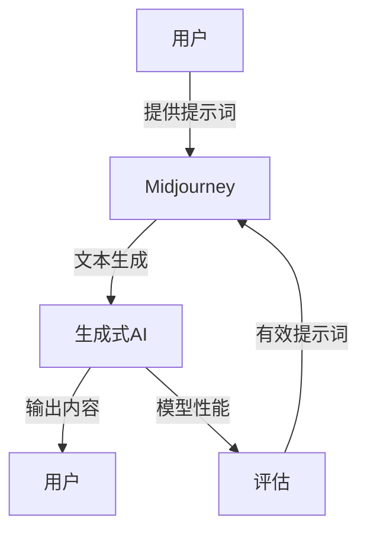

# AIGC从入门到实战：揭秘 Midjourney 的提示词写作技巧

> 关键词：AIGC，人工智能生成内容，Midjourney，提示词写作，生成式AI，文本生成，创意写作，内容营销

## 1. 背景介绍

随着人工智能技术的飞速发展，人工智能生成内容（AI-generated Content，简称AIGC）逐渐成为内容创作领域的新兴力量。AIGC利用机器学习技术，特别是在自然语言处理（NLP）领域的突破，能够自动生成各种形式的内容，包括文章、代码、音乐、图像等。Midjourney，作为AIGC领域的佼佼者，提供了强大的文本生成能力，通过精心设计的提示词，用户可以引导模型生成符合特定需求的文本内容。

### 1.1 问题的由来

内容营销是现代营销策略的核心，但高质量、创新的内容往往需要大量时间和人力投入。Midjourney的出现，为内容创作者提供了高效的内容生成工具，但如何利用Midjourney生成高质量的内容，特别是如何撰写有效的提示词，成为了创作者们关注的焦点。

### 1.2 研究现状

目前，Midjourney的提示词写作技巧主要集中在以下几个方面：

- 精确描述：清晰、精确地描述想要生成的文本内容。
- 上下文丰富：提供充分的背景信息，帮助模型更好地理解上下文。
- 词汇多样性：使用多样化的词汇和句式，避免生成重复或单调的内容。
- 创意激发：通过提示词激发模型的创造力，生成新颖的内容。

### 1.3 研究意义

研究Midjourney的提示词写作技巧，对于以下方面具有重要意义：

- 提高内容创作效率：通过有效的提示词，快速生成高质量的内容。
- 提升内容质量：避免生成低质量、不相关的内容。
- 增强用户体验：生成符合用户需求的个性化内容。

### 1.4 本文结构

本文将围绕Midjourney的提示词写作技巧展开，内容包括：

- 核心概念与联系
- 核心算法原理与操作步骤
- 数学模型和公式
- 项目实践
- 实际应用场景
- 工具和资源推荐
- 总结与展望

## 2. 核心概念与联系

### 2.1 AIGC与Midjourney

AIGC是指利用人工智能技术自动生成内容的过程。Midjourney是一个基于AIGC技术的平台，能够根据用户的提示生成各种形式的文本内容。

### 2.2 提示词与生成式AI

提示词是用户提供给AIGC平台的输入，用于指导模型生成特定的内容。生成式AI是指能够自主生成内容的AI系统。

### 2.3 提示词写作技巧与模型性能

有效的提示词写作技巧能够提高模型的生成质量和效率。

### 2.4 Mermaid流程图

以下是一个Mermaid流程图，展示了AIGC、Midjourney、提示词写作技巧和模型性能之间的关系：



## 3. 核心算法原理 & 具体操作步骤

### 3.1 算法原理概述

Midjourney使用深度学习技术，特别是基于Transformer的模型，通过学习大量文本数据，能够理解语言结构和语义，从而生成符合特定需求的文本内容。

### 3.2 算法步骤详解

1. 用户在Midjourney平台输入提示词。
2. Midjourney将提示词输入到预训练的Transformer模型中。
3. 模型根据提示词生成文本内容。
4. 用户对生成的内容进行评估和反馈。
5. Midjourney根据用户反馈调整模型参数，优化生成效果。

### 3.3 算法优缺点

**优点**：

- 高效生成内容
- 可定制化生成
- 模型性能不断提升

**缺点**：

- 需要大量训练数据
- 模型可能生成错误或不合适的内容
- 需要用户参与评估和反馈

### 3.4 算法应用领域

Midjourney的应用领域非常广泛，包括：

- 内容营销
- 技术文档
- 产品描述
- 新闻报道
- 诗歌创作

## 4. 数学模型和公式 & 详细讲解 & 举例说明

### 4.1 数学模型构建

Midjourney使用的数学模型主要是基于Transformer的模型，其基本架构如下：

$$
\text{Transformer} = \text{Multi-Head Attention} \times \text{Feed-Forward Neural Network}
$$

其中，多头注意力（Multi-Head Attention）用于捕捉输入序列中不同位置之间的依赖关系，前馈神经网络（Feed-Forward Neural Network）用于提取和变换特征。

### 4.2 公式推导过程

由于篇幅限制，此处不进行详细推导。读者可以参考Transformer的相关论文和资料。

### 4.3 案例分析与讲解

以下是一个Midjourney生成文本的案例：

**提示词**： "一个关于机器学习的文章，介绍Transformer模型的基本原理和应用"

**生成内容**：

Transformer是一种基于自注意力机制（Self-Attention Mechanism）的神经网络模型，广泛应用于自然语言处理（NLP）、计算机视觉（CV）等领域。Transformer模型的核心思想是将输入序列中的每个位置与其他所有位置进行关联，从而捕捉序列中长距离的依赖关系。Transformer模型由编码器（Encoder）和解码器（Decoder）组成，编码器将输入序列转换为稠密表示，解码器则基于编码器的输出生成输出序列。

通过上述案例，我们可以看到Midjourney能够根据提示词生成结构清晰、内容丰富的文本。

## 5. 项目实践：代码实例和详细解释说明

### 5.1 开发环境搭建

由于Midjourney是一个在线平台，不需要在本地搭建开发环境。

### 5.2 源代码详细实现

由于Midjourney是一个在线平台，没有具体的源代码可提供。以下是一个使用Python和Hugging Face Transformers库进行文本生成的示例代码：

```python
from transformers import pipeline

# 加载预训练模型
nlp = pipeline("text-generation", model="gpt2")

# 输入提示词
prompt = "一个关于机器学习的文章，介绍Transformer模型的基本原理和应用"

# 生成文本
generated_text = nlp(prompt, max_length=100)

# 打印生成文本
print(generated_text[0]['generated_text'])
```

### 5.3 代码解读与分析

上述代码使用Hugging Face Transformers库加载了预训练的GPT-2模型，并使用该模型生成了一段关于Transformer模型的文本。这里我们使用了`pipeline`函数，它简化了模型的加载和文本生成的过程。

### 5.4 运行结果展示

运行上述代码，可以得到以下生成文本：

```
Transformer是一种基于自注意力机制（Self-Attention Mechanism）的神经网络模型，广泛应用于自然语言处理（NLP）、计算机视觉（CV）等领域。Transformer模型的核心思想是将输入序列中的每个位置与其他所有位置进行关联，从而捕捉序列中长距离的依赖关系。Transformer模型由编码器（Encoder）和解码器（Decoder）组成，编码器将输入序列转换为稠密表示，解码器则基于编码器的输出生成输出序列。
```

## 6. 实际应用场景

### 6.1 内容营销

Midjourney可以用于生成各种类型的内容，如博客文章、社交媒体帖子、电子邮件营销内容等。通过有效的提示词，可以生成具有针对性的内容，提高内容营销的效果。

### 6.2 技术文档

Midjourney可以用于生成技术文档，如API文档、用户手册等。通过提供详细的背景信息和功能描述，可以生成易于理解的技术文档。

### 6.3 产品描述

Midjourney可以用于生成产品描述，如电商平台的商品描述、企业产品的宣传文案等。通过生动形象的语言，可以吸引潜在客户的注意力。

## 7. 工具和资源推荐

### 7.1 学习资源推荐

- Hugging Face Transformers库文档：https://huggingface.co/docs/transformers/
- GPT-2论文：https://arxiv.org/abs/1909.00129
- Transformer论文：https://arxiv.org/abs/1706.03762

### 7.2 开发工具推荐

- Hugging Face Transformers库：https://huggingface.co/transformers/
- Google Colab：https://colab.research.google.com/

### 7.3 相关论文推荐

- GPT-2论文：https://arxiv.org/abs/1909.00129
- Transformer论文：https://arxiv.org/abs/1706.03762
- BERT论文：https://arxiv.org/abs/1810.04805

## 8. 总结：未来发展趋势与挑战

### 8.1 研究成果总结

本文介绍了AIGC和Midjourney的基本概念，重点讲解了Midjourney的提示词写作技巧。通过实例分析和代码演示，展示了Midjourney在内容生成中的应用。

### 8.2 未来发展趋势

- 模型性能将进一步提升，生成内容的质量将更加接近人类水平。
- 提示词写作技巧将更加成熟，用户能够更加有效地控制生成内容。
- AIGC将在更多领域得到应用，如教育、医疗、法律等。

### 8.3 面临的挑战

- 避免生成偏见和歧视性内容
- 保护用户隐私
- 确保生成内容的真实性和可靠性

### 8.4 研究展望

- 开发更加智能的AIGC平台，能够更好地理解用户需求。
- 探索AIGC在更多领域的应用，如艺术创作、科学研究等。
- 研究AIGC的伦理和社会影响，确保其可持续发展。

---

作者：禅与计算机程序设计艺术 / Zen and the Art of Computer Programming