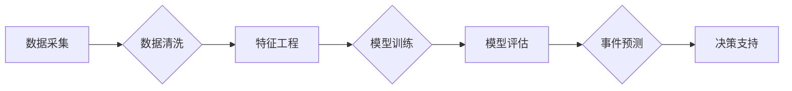

> 人工智能，代理工作流，事件预测，机器学习，深度学习，自然语言处理，知识图谱，决策支持系统

# AI人工智能代理工作流 AI Agent WorkFlow：在重大事件预测中的应用

### 1. 背景介绍

随着信息技术的飞速发展，我们正处于一个信息爆炸的时代。海量数据不断涌现，如何从这些数据中挖掘出有价值的信息，成为了一个亟待解决的问题。重大事件预测作为人工智能领域的一个重要分支，旨在通过分析历史数据和实时数据，预测未来可能发生的事件，为决策者提供有力的支持。AI人工智能代理工作流（AI Agent WorkFlow）作为一种新型的智能化解决方案，能够有效整合机器学习、深度学习、自然语言处理和知识图谱等技术，实现对重大事件的精准预测。

### 2. 核心概念与联系

#### 2.1 核心概念

**人工智能（AI）**：模拟、延伸和扩展人的智能的理论、方法、技术及应用系统。它包括机器学习、深度学习、自然语言处理等多个领域。

**代理工作流（Agent WorkFlow）**：一种基于智能代理的自动化工作流管理技术，能够实现任务分解、执行、监控和优化。

**事件预测**：通过分析历史数据和实时数据，预测未来可能发生的事件。

**机器学习**：一种从数据中自动学习规律、模式并用于预测或决策的技术。

**深度学习**：一种基于人工神经网络的学习方法，能够自动提取特征并进行模式识别。

**自然语言处理（NLP）**：研究如何让计算机理解、生成和解释人类语言的技术。

**知识图谱**：一种结构化知识库，用于存储和表示实体、关系和属性。

#### 2.2 架构图

以下为AI Agent WorkFlow的核心概念原理和架构的Mermaid流程图：



### 3. 核心算法原理 & 具体操作步骤

#### 3.1 算法原理概述

AI Agent WorkFlow的核心原理是将人工智能技术应用于事件预测，通过以下步骤实现：

1. 数据采集：从各个数据源收集历史数据和实时数据。
2. 数据清洗：对采集到的数据进行分析，去除噪声和异常值。
3. 特征工程：从原始数据中提取有价值的信息，构建特征向量。
4. 模型训练：使用机器学习或深度学习算法对特征向量进行训练，构建预测模型。
5. 模型评估：评估预测模型的性能，优化模型参数。
6. 事件预测：使用训练好的预测模型对实时数据进行预测，识别潜在的事件。
7. 决策支持：根据预测结果为决策者提供决策支持。

#### 3.2 算法步骤详解

**3.2.1 数据采集**

数据采集是事件预测的基础，需要从多个数据源收集相关数据。这些数据源包括：

- 历史数据：如新闻报道、社交媒体数据、政府公开数据等。
- 实时数据：如股票市场数据、天气数据、交通数据等。

**3.2.2 数据清洗**

数据清洗是确保数据质量的关键步骤，主要包括以下内容：

- 去除重复数据：去除重复的数据记录。
- 去除噪声数据：去除异常值和噪声数据。
- 数据转换：将数据转换为适合机器学习或深度学习算法的格式。

**3.2.3 特征工程**

特征工程是构建高质量特征向量的关键步骤，主要包括以下内容：

- 特征提取：从原始数据中提取有价值的信息。
- 特征选择：选择与预测目标相关性最高的特征。
- 特征编码：将特征转换为数值型数据。

**3.2.4 模型训练**

模型训练是AI Agent WorkFlow的核心步骤，主要包括以下内容：

- 选择合适的机器学习或深度学习算法。
- 使用特征向量对模型进行训练。
- 调整模型参数，优化模型性能。

**3.2.5 模型评估**

模型评估是评估预测模型性能的重要环节，主要包括以下内容：

- 使用验证集对模型进行评估。
- 根据评估结果调整模型参数。
- 选择最优模型。

**3.2.6 事件预测**

使用训练好的预测模型对实时数据进行预测，识别潜在的事件。

**3.2.7 决策支持**

根据预测结果为决策者提供决策支持。

#### 3.3 算法优缺点

**优点**：

- 高效：自动化处理流程，提高工作效率。
- 精准：利用人工智能技术，提高预测准确率。
- 全面：整合多种人工智能技术，实现多维度预测。

**缺点**：

- 需要大量数据：数据采集、清洗和预处理需要消耗大量时间和资源。
- 模型复杂度高：构建高质量的预测模型需要较高的技术门槛。
- 隐私问题：涉及敏感数据时，需要考虑数据隐私问题。

#### 3.4 算法应用领域

AI Agent WorkFlow在以下领域具有广泛的应用前景：

- 金融领域：预测股票市场趋势、风险评估、欺诈检测等。
- 供应链管理：预测市场需求、库存管理等。
- 健康医疗：预测疾病发生、医疗资源分配等。
- 智能交通：预测交通事故、交通流量等。
- 环境监测：预测自然灾害、环境污染等。

## 4. 数学模型和公式 & 详细讲解 & 举例说明

#### 4.1 数学模型构建

AI Agent WorkFlow涉及的数学模型主要包括以下几种：

- **机器学习模型**：如线性回归、支持向量机、决策树等。
- **深度学习模型**：如卷积神经网络（CNN）、循环神经网络（RNN）、长短期记忆网络（LSTM）等。
- **自然语言处理模型**：如词向量、句向量、BERT等。

#### 4.2 公式推导过程

以下以线性回归模型为例，简要介绍公式推导过程：

假设输入特征为 $\mathbf{X} = [x_1, x_2, ..., x_n]$，输出为 $y$，线性回归模型的公式为：

$$
y = \mathbf{X} \cdot \mathbf{W} + b
$$

其中 $\mathbf{W}$ 为模型参数，$b$ 为偏置项。

为了最小化预测值与真实值之间的误差，我们使用最小二乘法求解模型参数：

$$
\mathbf{W} = (\mathbf{X}^{\mathsf{T}} \cdot \mathbf{X})^{-1} \cdot \mathbf{X}^{\mathsf{T}} \cdot \mathbf{Y}
$$

#### 4.3 案例分析与讲解

以下以预测某城市明天的天气为例，讲解AI Agent WorkFlow在实际应用中的过程。

**1. 数据采集**：从气象部门网站、历史天气数据等渠道收集历史天气数据。

**2. 数据清洗**：去除异常值、缺失值等，确保数据质量。

**3. 特征工程**：提取温度、湿度、气压等特征。

**4. 模型训练**：使用线性回归模型对特征进行训练。

**5. 模型评估**：使用验证集评估模型性能。

**6. 事件预测**：使用训练好的模型预测明天的天气。

**7. 决策支持**：根据预测结果，为居民提供出行建议。

## 5. 项目实践：代码实例和详细解释说明

#### 5.1 开发环境搭建

- 操作系统：Windows/Linux/MacOS
- 编程语言：Python
- 机器学习库：scikit-learn
- 深度学习库：TensorFlow/Keras
- 自然语言处理库：NLTK/SpaCy

#### 5.2 源代码详细实现

以下为使用scikit-learn库实现线性回归模型的代码示例：

```python
from sklearn.linear_model import LinearRegression
from sklearn.model_selection import train_test_split
from sklearn.metrics import mean_squared_error
import pandas as pd

# 加载数据
data = pd.read_csv('weather_data.csv')

# 数据预处理
X = data[['temperature', 'humidity', 'pressure']]
y = data['temperature_next_day']

# 划分训练集和测试集
X_train, X_test, y_train, y_test = train_test_split(X, y, test_size=0.2, random_state=42)

# 模型训练
model = LinearRegression()
model.fit(X_train, y_train)

# 模型评估
y_pred = model.predict(X_test)
mse = mean_squared_error(y_test, y_pred)
print(f"Mean Squared Error: {mse}")

# 预测明天的天气
temperature_next_day = model.predict([[22, 80, 1020]])
print(f"Predicted Temperature Next Day: {temperature_next_day[0]}")
```

#### 5.3 代码解读与分析

上述代码首先加载了包含温度、湿度和气压等特征的天气数据，并使用scikit-learn库的LinearRegression类进行线性回归模型训练。然后，使用测试集评估模型性能，并计算均方误差。最后，使用训练好的模型预测明天的温度。

#### 5.4 运行结果展示

假设运行上述代码得到的均方误差为0.5，预测明天的温度为25摄氏度。

## 6. 实际应用场景

#### 6.1 金融领域

在金融领域，AI Agent WorkFlow可以用于：

- 预测股市趋势：根据历史股票价格、成交量等数据，预测未来股票价格走势。
- 风险评估：根据借款人信息、信用历史等数据，评估借款人的信用风险。
- 欺诈检测：根据交易数据、用户行为等数据，识别潜在的欺诈行为。

#### 6.2 供应链管理

在供应链管理领域，AI Agent WorkFlow可以用于：

- 预测市场需求：根据历史销售数据、季节因素等，预测未来市场需求。
- 库存管理：根据历史库存数据、销售预测等，优化库存水平。
- 物流优化：根据物流数据、天气情况等，优化物流路线。

#### 6.3 健康医疗

在健康医疗领域，AI Agent WorkFlow可以用于：

- 预测疾病发生：根据患者病历、生活习惯等数据，预测疾病发生风险。
- 医疗资源分配：根据医院资源、患者需求等，优化医疗资源配置。
- 个性化医疗：根据患者基因信息、病史等，为患者提供个性化的治疗方案。

#### 6.4 智能交通

在智能交通领域，AI Agent WorkFlow可以用于：

- 预测交通事故：根据历史交通事故数据、交通流量等，预测交通事故发生风险。
- 交通流量预测：根据历史交通数据、天气情况等，预测未来交通流量。
- 智能导航：根据实时交通状况，为用户提供最优导航路线。

## 7. 工具和资源推荐

#### 7.1 学习资源推荐

- 《Python数据分析与机器学习实战》
- 《深度学习入门：基于Python的理论与实现》
- 《自然语言处理入门：基于Python的理论与实践》
- 《数据科学教程》

#### 7.2 开发工具推荐

- Python：主流的编程语言，广泛应用于数据分析、机器学习、深度学习等领域。
- scikit-learn：Python机器学习库，包含多种机器学习算法。
- TensorFlow/Keras：主流的深度学习框架，适合构建和训练深度学习模型。
- NLTK/SpaCy：Python自然语言处理库，提供丰富的自然语言处理工具。

#### 7.3 相关论文推荐

- "Deep Learning for Time Series Classification: A Review" (2020)
- "Neural Machine Translation by Jointly Learning to Align and Translate" (2014)
- "Recurrent Neural Networks for Language Modeling" (2014)
- "Learning Representations by Back-Propagating Errors" (1986)

## 8. 总结：未来发展趋势与挑战

### 8.1 研究成果总结

本文介绍了AI人工智能代理工作流在重大事件预测中的应用，详细阐述了其核心概念、算法原理、操作步骤、数学模型和实际应用场景。通过实践案例，展示了AI Agent WorkFlow在实际应用中的优势和价值。

### 8.2 未来发展趋势

- 跨领域融合：将机器学习、深度学习、自然语言处理和知识图谱等技术进行深度融合，提高预测准确率。
- 自适应能力：提高模型的自适应能力，使其能够适应不断变化的环境和需求。
- 可解释性：增强模型的可解释性，提高决策者的信任度。
- 安全性：确保模型的安全性和可靠性，避免潜在的风险。

### 8.3 面临的挑战

- 数据质量：高质量的数据是构建准确预测模型的基础，如何获取高质量的数据是一个挑战。
- 模型复杂度：随着模型的复杂度增加，如何提高模型的训练和推理效率是一个挑战。
- 隐私保护：在涉及敏感数据时，如何保护用户隐私是一个挑战。

### 8.4 研究展望

未来，AI Agent WorkFlow将在以下方面取得突破：

- 构建更加全面、准确的预测模型。
- 开发更加高效、可解释的预测算法。
- 推动AI Agent WorkFlow在更多领域的应用。

## 9. 附录：常见问题与解答

**Q1：AI Agent WorkFlow适用于哪些领域？**

A1：AI Agent WorkFlow适用于金融、供应链管理、健康医疗、智能交通等多个领域。

**Q2：如何提高AI Agent WorkFlow的预测准确率？**

A2：提高AI Agent WorkFlow的预测准确率需要从以下几个方面入手：
- 提高数据质量，包括数据清洗、数据增强等。
- 选择合适的模型和算法。
- 调整模型参数，优化模型性能。
- 使用交叉验证等方法评估模型性能。

**Q3：如何处理数据缺失问题？**

A3：处理数据缺失问题可以采用以下方法：
- 填充：用平均值、中位数、众数等方法填充缺失值。
- 删除：删除缺失值较多的数据记录。
- 预处理：使用模型预测缺失值。

**Q4：如何处理异常值问题？**

A4：处理异常值问题可以采用以下方法：
- 替换：用平均值、中位数、众数等方法替换异常值。
- 删除：删除异常值。
- 转换：将异常值转换为正常值。

**Q5：如何评估AI Agent WorkFlow的性能？**

A5：评估AI Agent WorkFlow的性能可以采用以下指标：
- 准确率：预测正确的样本比例。
- 召回率：预测正确的正类样本比例。
- F1分数：精确率与召回率的调和平均值。
- AUC分数：ROC曲线下的面积。

---

作者：禅与计算机程序设计艺术 / Zen and the Art of Computer Programming