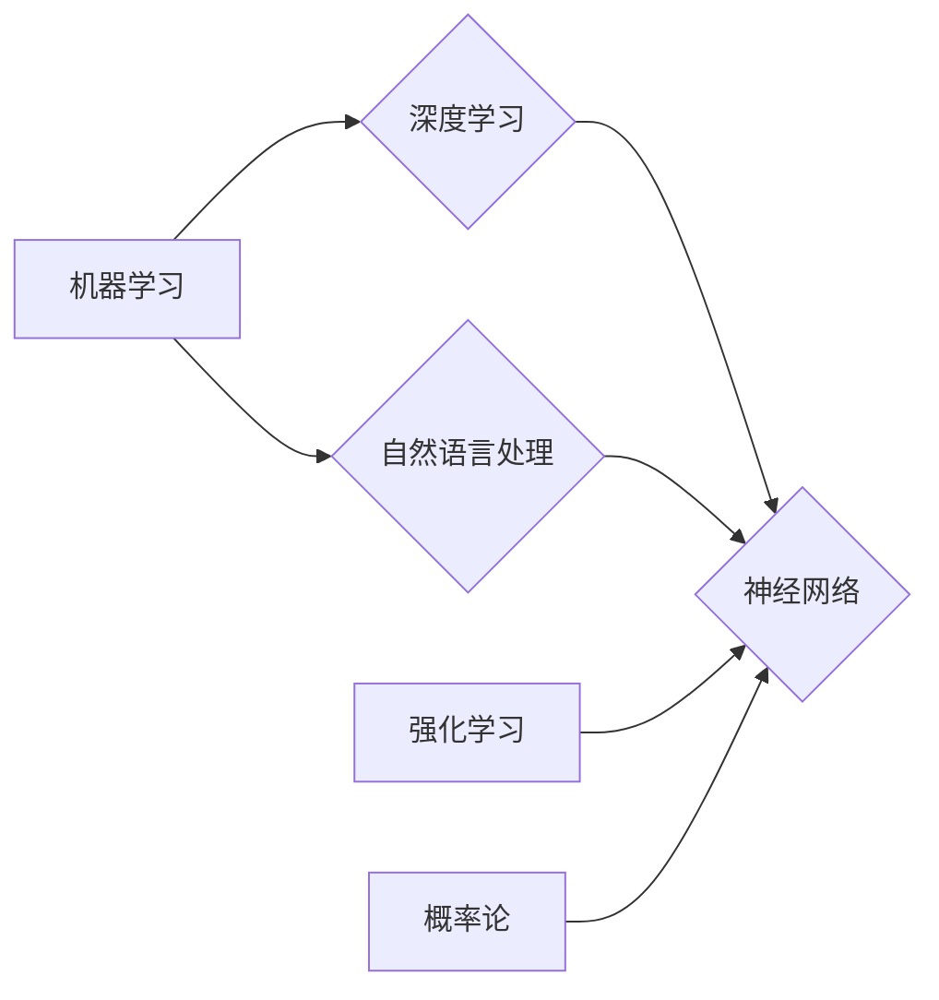
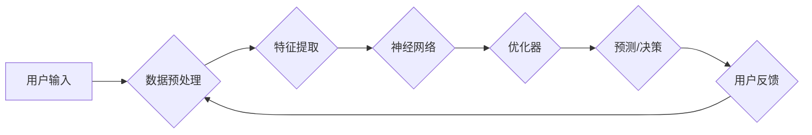

> 机器学习, 深度学习, 神经网络, 自然语言处理, 强化学习, 概率论

# AI人工智能核心算法原理与代码实例讲解：机器思维

## 1. 背景介绍

人工智能（AI）是当今科技领域最热门的研究方向之一，它旨在使计算机系统具备类似于人类的智能能力。从简单的机器人到复杂的自动驾驶汽车，AI技术正在改变我们的生活和工作的方方面面。本文将深入探讨AI领域的核心算法，通过原理讲解和代码实例，帮助读者理解这些算法背后的机器思维。

## 2. 核心概念与联系

### 2.1 核心概念原理
AI的核心概念包括机器学习（Machine Learning）、深度学习（Deep Learning）、神经网络（Neural Networks）、自然语言处理（Natural Language Processing）、强化学习（Reinforcement Learning）和概率论（Probability Theory）。



### 2.2 架构流程图
以下是一个简化的AI系统架构流程图，展示了这些核心概念之间的联系：



## 3. 核心算法原理 & 具体操作步骤

### 3.1 算法原理概述

#### 3.1.1 机器学习
机器学习是一种使计算机系统能够从数据中学习并做出决策或预测的技术。主要分为监督学习（Supervised Learning）、无监督学习（Unsupervised Learning）和半监督学习（Semi-Supervised Learning）。

#### 3.1.2 深度学习
深度学习是机器学习的一个子领域，它使用深层神经网络来学习数据的高级抽象表示。

#### 3.1.3 神经网络
神经网络是一种模仿人脑神经元结构的计算模型，通过多层节点（神经元）之间的连接进行信息传递和处理。

#### 3.1.4 自然语言处理
自然语言处理是AI的一个分支，旨在使计算机能够理解、解释和生成人类语言。

#### 3.1.5 强化学习
强化学习是一种机器学习方法，通过与环境交互并基于奖励信号来学习最优策略。

#### 3.1.6 概率论
概率论是AI的基础，它用于描述不确定性和随机事件。

### 3.2 算法步骤详解

以下是对上述算法的简要步骤说明：

#### 3.2.1 机器学习
1. 收集数据：从各种来源收集用于训练的数据。
2. 数据预处理：清洗和转换数据，使其适合机器学习算法。
3. 特征提取：从数据中提取有用的特征。
4. 选择模型：选择合适的机器学习模型。
5. 训练模型：使用训练数据训练模型。
6. 评估模型：使用验证数据评估模型的性能。
7. 部署模型：将模型部署到实际应用中。

#### 3.2.2 深度学习
1. 设计网络架构：定义神经网络的层数和每层的神经元数量。
2. 初始化权重：随机初始化网络的权重。
3. 前向传播：将输入数据通过网络进行计算。
4. 计算损失：计算预测结果与真实标签之间的差异。
5. 反向传播：根据损失梯度更新网络权重。
6. 重复上述步骤，直到模型收敛。

#### 3.2.3 神经网络
1. 定义网络架构：定义网络的结构，包括输入层、隐藏层和输出层。
2. 初始化权重：随机初始化网络权重的值。
3. 前向传播：将输入数据通过网络进行计算。
4. 计算损失：计算预测结果与真实标签之间的差异。
5. 反向传播：根据损失梯度更新网络权重。
6. 重复上述步骤，直到模型收敛。

#### 3.2.4 自然语言处理
1. 分词：将文本分割成单词或字符。
2. 词性标注：标注每个单词的词性。
3. 依存句法分析：分析句子中单词之间的语法关系。
4. 意图识别：确定文本的意图。
5. 知识图谱：构建知识图谱以存储信息。
6. 对话系统：设计对话系统与用户进行交互。

#### 3.2.5 强化学习
1. 初始化状态空间和动作空间。
2. 选择初始策略。
3. 与环境交互，执行动作。
4. 接收奖励信号。
5. 更新策略，以获得更高的奖励。
6. 重复上述步骤，直到达到目标。

#### 3.2.6 概率论
1. 定义概率空间和事件。
2. 计算事件发生的概率。
3. 应用概率论原理解决实际问题。

### 3.3 算法优缺点

每种算法都有其优缺点，以下是一些常见算法的优缺点：

#### 3.3.1 机器学习
- 优点：通用性强，适用于各种类型的任务。
- 缺点：需要大量标注数据，模型可解释性较差。

#### 3.3.2 深度学习
- 优点：能够学习到复杂的数据特征，准确率高。
- 缺点：模型训练时间长，需要大量计算资源。

#### 3.3.3 神经网络
- 优点：能够处理非线性问题，具有较强的泛化能力。
- 缺点：模型可解释性较差，需要大量训练数据。

#### 3.3.4 自然语言处理
- 优点：能够处理人类语言，实现人机交互。
- 缺点：需要大量的标注数据，模型复杂度较高。

#### 3.3.5 强化学习
- 优点：能够处理动态环境，不需要大量标注数据。
- 缺点：训练时间长，难以调试。

#### 3.3.6 概率论
- 优点：能够处理不确定性，提供决策支持。
- 缺点：难以处理复杂问题。

### 3.4 算法应用领域

以上算法在各个领域都有广泛的应用，以下是一些应用实例：

- 机器学习：垃圾邮件过滤、图像识别、信用评分。
- 深度学习：自动驾驶、医疗诊断、语音识别。
- 神经网络：股票市场预测、视频游戏、语音合成。
- 自然语言处理：机器翻译、文本摘要、情感分析。
- 强化学习：机器人控制、游戏AI、智能交通系统。
- 概率论：天气预报、风险评估、决策分析。

## 4. 数学模型和公式 & 详细讲解 & 举例说明

### 4.1 数学模型构建

以下是一些常用的数学模型和公式：

#### 4.1.1 线性回归
$$
y = \beta_0 + \beta_1x_1 + \beta_2x_2 + \cdots + \beta_nx_n
$$

#### 4.1.2 逻辑回归
$$
P(y=1) = \sigma(\beta_0 + \beta_1x_1 + \beta_2x_2 + \cdots + \beta_nx_n)
$$

#### 4.1.3 感知机
$$
f(x) = \sum_{i=1}^n w_ix_i - b
$$

#### 4.1.4 深度神经网络
$$
h_\theta(x) = \sigma(WL(x) + b)
$$

### 4.2 公式推导过程

#### 4.2.1 线性回归
线性回归的目标是最小化预测值与真实值之间的差异，即最小化损失函数：
$$
J(\theta) = \frac{1}{2m}\sum_{i=1}^m (h_\theta(x^{(i)}) - y^{(i)})^2
$$
其中，$h_\theta(x)$ 是预测值，$y^{(i)}$ 是真实值。

使用梯度下降法更新参数：
$$
\theta_j := \theta_j - \alpha \frac{\partial J(\theta)}{\partial \theta_j}
$$

#### 4.2.2 逻辑回归
逻辑回归的目标是最小化预测值与真实值之间的差异，即最小化损失函数：
$$
J(\theta) = -\frac{1}{m}\sum_{i=1}^m [y^{(i)}\log(h_\theta(x^{(i)})) + (1 - y^{(i)})\log(1 - h_\theta(x^{(i)}))]
$$
其中，$h_\theta(x)$ 是逻辑函数的输出。

使用梯度下降法更新参数：
$$
\theta_j := \theta_j - \alpha \frac{\partial J(\theta)}{\partial \theta_j}
$$

### 4.3 案例分析与讲解

#### 4.3.1 线性回归案例分析
假设我们有一个简单的线性回归模型，用于预测房价。输入特征包括房屋的面积（$x_1$）和房间数量（$x_2$），输出为房价（$y$）。

数据集如下：

| 面积 | 房间数量 | 房价 |
| --- | --- | --- |
| 100 | 2 | 200000 |
| 150 | 3 | 250000 |
| 200 | 4 | 300000 |
| 250 | 5 | 350000 |
| 300 | 6 | 400000 |

使用最小二乘法求解线性回归模型的参数。求解过程如下：

1. 计算特征矩阵 $X$ 和目标向量 $y$：
$$
X = \begin{bmatrix}
1 & 100 \\
1 & 150 \\
1 & 200 \\
1 & 250 \\
1 & 300 \\
\end{bmatrix}, \quad y = \begin{bmatrix}
200000 \\
250000 \\
300000 \\
350000 \\
400000 \\
\end{bmatrix}
$$

2. 计算系数 $\theta$：
$$
\theta = (X^T X)^{-1} X^T y
$$

3. 计算预测值：
$$
h_\theta(x) = \theta_0 + \theta_1x_1 + \theta_2x_2
$$

#### 4.3.2 逻辑回归案例分析
假设我们有一个简单的逻辑回归模型，用于判断客户是否购买产品。输入特征包括年龄（$x_1$）和收入（$x_2$），输出为购买概率（$y$）。

数据集如下：

| 年龄 | 收入 | 购买 |
| --- | --- | --- |
| 20 | 50000 | 否 |
| 30 | 80000 | 是 |
| 40 | 100000 | 是 |
| 50 | 120000 | 否 |
| 60 | 150000 | 是 |

使用逻辑回归模型预测客户是否购买产品。求解过程如下：

1. 计算特征矩阵 $X$ 和目标向量 $y$：
$$
X = \begin{bmatrix}
1 & 20 \\
1 & 30 \\
1 & 40 \\
1 & 50 \\
1 & 60 \\
\end{bmatrix}, \quad y = \begin{bmatrix}
0 \\
1 \\
1 \\
0 \\
1 \\
\end{bmatrix}
$$

2. 计算系数 $\theta$：
$$
\theta = (X^T X)^{-1} X^T y
$$

3. 计算预测值：
$$
h_\theta(x) = \sigma(\theta_0 + \theta_1x_1 + \theta_2x_2)
$$

## 5. 项目实践：代码实例和详细解释说明

### 5.1 开发环境搭建

为了进行AI项目实践，我们需要搭建以下开发环境：

1. 安装Python 3.x版本。
2. 安装NumPy、Pandas、Matplotlib等数据科学库。
3. 安装Scikit-learn机器学习库。
4. 安装TensorFlow或PyTorch深度学习库。

### 5.2 源代码详细实现

以下是一个简单的线性回归项目示例：

```python
import numpy as np
import matplotlib.pyplot as plt
from sklearn.linear_model import LinearRegression

# 生成样本数据
np.random.seed(0)
X = 2 * np.random.rand(100, 1)
y = 4 + 3 * X + np.random.randn(100, 1)

# 创建线性回归模型
model = LinearRegression()

# 训练模型
model.fit(X, y)

# 绘制结果
plt.scatter(X, y)
plt.plot(X, model.predict(X), color='red')
plt.show()
```

### 5.3 代码解读与分析

上述代码首先导入了必要的库，然后生成了线性回归的样本数据。接着，创建了一个线性回归模型，并用训练数据对其进行训练。最后，绘制了样本数据和模型的预测结果。

### 5.4 运行结果展示

运行上述代码后，将显示一个散点图，其中红色线条代表模型的预测结果。可以看到，模型能够较好地拟合样本数据。

## 6. 实际应用场景

AI技术已经在各个领域得到了广泛应用，以下是一些应用实例：

- 金融：风险评估、欺诈检测、算法交易。
- 医疗：疾病诊断、药物发现、患者护理。
- 教育：个性化学习、智能教育系统、在线课程。
- 交通：自动驾驶、智能交通系统、交通流量预测。
- 娱乐：推荐系统、游戏AI、虚拟现实。

## 7. 工具和资源推荐

### 7.1 学习资源推荐

1. 《Python机器学习》
2. 《深度学习》
3. 《自然语言处理综论》
4. 《强化学习：原理与实践》
5. Coursera、edX、Udacity等在线课程平台

### 7.2 开发工具推荐

1. Jupyter Notebook
2. TensorFlow
3. PyTorch
4. Scikit-learn
5. Keras

### 7.3 相关论文推荐

1. "Backpropagation" by Rumelhart, Hinton, and Williams
2. "A Few Useful Things to Know about Machine Learning" by Pedro Domingos
3. "Deep Learning" by Ian Goodfellow, Yoshua Bengio, and Aaron Courville
4. "Reinforcement Learning: An Introduction" by Richard S. Sutton and Andrew G. Barto
5. "Natural Language Processing with Python" by Steven Bird, Ewan Klein, and Edward Loper

## 8. 总结：未来发展趋势与挑战

### 8.1 研究成果总结

本文介绍了AI领域的核心算法，包括机器学习、深度学习、神经网络、自然语言处理、强化学习和概率论。通过原理讲解和代码实例，帮助读者理解这些算法背后的机器思维。

### 8.2 未来发展趋势

1. 模型小型化和高效化：为了降低计算成本和内存占用，研究人员将致力于开发更小型、更高效的AI模型。
2. 多模态AI：将AI技术扩展到图像、声音、文本等多个模态，实现更加全面的智能系统。
3. 可解释AI：提高AI模型的可解释性，使其决策过程更加透明，增强用户对AI系统的信任。
4. 自动化AI：开发自动化工具，简化AI模型开发和部署流程。

### 8.3 面临的挑战

1. 数据隐私和安全：如何保护用户隐私和数据安全是AI应用面临的重要挑战。
2. 模型偏见和歧视：AI模型可能存在偏见和歧视，需要采取措施消除这些问题。
3. 伦理和社会影响：AI技术对社会和伦理带来的挑战需要认真对待。
4. 跨学科研究：AI领域需要与其他学科（如心理学、社会学等）进行跨学科研究，以更好地理解和应对挑战。

### 8.4 研究展望

AI技术将继续快速发展，并在未来几十年内对社会产生深远的影响。未来的研究将致力于解决当前面临的挑战，推动AI技术向更加智能、可靠、可解释和安全的方向发展。

## 9. 附录：常见问题与解答

### 9.1 常见问题

**Q1：什么是机器学习？**

A1：机器学习是一种使计算机系统能够从数据中学习并做出决策或预测的技术。

**Q2：什么是深度学习？**

A2：深度学习是机器学习的一个子领域，它使用深层神经网络来学习数据的高级抽象表示。

**Q3：什么是神经网络？**

A3：神经网络是一种模仿人脑神经元结构的计算模型，通过多层节点（神经元）之间的连接进行信息传递和处理。

**Q4：什么是自然语言处理？**

A4：自然语言处理是AI的一个分支，旨在使计算机能够理解、解释和生成人类语言。

**Q5：什么是强化学习？**

A5：强化学习是一种机器学习方法，通过与环境交互并基于奖励信号来学习最优策略。

**Q6：什么是概率论？**

A6：概率论是AI的基础，它用于描述不确定性和随机事件。

**Q7：如何选择合适的机器学习模型？**

A7：选择合适的机器学习模型需要考虑数据特点、任务类型和计算资源等因素。

**Q8：如何提高机器学习模型的性能？**

A8：提高机器学习模型的性能可以通过以下方法：数据预处理、特征工程、模型选择和调优等。

**Q9：如何解决模型偏见和歧视问题？**

A9：解决模型偏见和歧视问题需要采取多种措施，如数据增强、模型正则化、交叉验证等。

**Q10：如何将AI技术应用于实际项目？**

A10：将AI技术应用于实际项目需要考虑数据收集、模型设计、模型训练和模型评估等步骤。

### 9.2 解答

以上是对常见问题的解答，希望对读者有所帮助。

---

作者：禅与计算机程序设计艺术 / Zen and the Art of Computer Programming