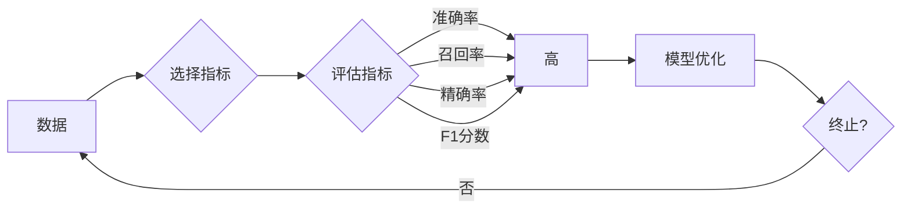

# AI系统性能评估的实用技巧

> 关键词：AI性能评估，指标选择，模型优化，交叉验证，A/B测试，超参数调整，实际应用

## 1. 背景介绍

随着人工智能技术的飞速发展，越来越多的AI系统被应用于各个领域。然而，如何评估AI系统的性能，确保其达到预期效果，成为了研究人员和工程师面临的重要问题。性能评估不仅有助于理解和改进AI系统，还可以为系统的选择、部署和优化提供依据。本文将深入探讨AI系统性能评估的实用技巧，帮助读者掌握评估方法和最佳实践。

## 2. 核心概念与联系

### 2.1 AI系统性能评估的概念

AI系统性能评估是指对AI系统的输出结果与其预期目标进行比较的过程。评估的目的是判断系统是否能够满足既定的性能要求，并为进一步的模型优化提供方向。

### 2.2 关键指标

在AI系统性能评估中，常用的关键指标包括：

- 准确率(Accuracy)：模型正确预测的样本数占总样本数的比例。
- 召回率(Recall)：模型正确预测的正面样本数占所有正面样本数的比例。
- 精确率(Precision)：模型正确预测的正面样本数占所有预测为正面的样本数的比例。
- F1分数(F1 Score)：精确率和召回率的调和平均值。

### 2.3 Mermaid流程图



## 3. 核心算法原理 & 具体操作步骤

### 3.1 算法原理概述

AI系统性能评估的算法原理主要包括以下几个方面：

- 数据预处理：对数据进行清洗、归一化等处理，确保数据质量。
- 模型选择：根据任务类型和需求选择合适的AI模型。
- 评估指标：根据任务类型和需求选择合适的评估指标。
- 交叉验证：通过交叉验证方法评估模型的泛化能力。
- A/B测试：将模型部署到实际环境中，与现有系统进行对比，评估实际效果。

### 3.2 算法步骤详解

1. 数据预处理：对原始数据进行清洗、归一化等处理，确保数据质量。
2. 模型选择：根据任务类型和需求选择合适的AI模型。
3. 评估指标：根据任务类型和需求选择合适的评估指标，如准确率、召回率、精确率、F1分数等。
4. 交叉验证：将数据集划分为k个子集，进行k次训练和验证，每次使用不同的子集作为验证集，其余作为训练集。
5. A/B测试：将模型部署到实际环境中，与现有系统进行对比，评估实际效果。

### 3.3 算法优缺点

- 优点：可以全面、客观地评估AI系统的性能，为模型优化和系统改进提供依据。
- 缺点：评估过程可能需要大量计算资源，且不同指标对模型性能的评价可能存在偏差。

### 3.4 算法应用领域

AI系统性能评估可以应用于以下领域：

- 机器学习：评估机器学习模型的性能，为模型优化提供依据。
- 深度学习：评估深度学习模型的性能，为模型优化提供依据。
- 自然语言处理：评估自然语言处理模型的性能，为模型优化提供依据。
- 计算机视觉：评估计算机视觉模型的性能，为模型优化提供依据。

## 4. 数学模型和公式 & 详细讲解 & 举例说明

### 4.1 数学模型构建

在AI系统性能评估中，常用的数学模型包括：

- 准确率：$$
\text{Accuracy} = \frac{\text{正确预测的样本数}}{\text{总样本数}}
$$
- 召回率：$$
\text{Recall} = \frac{\text{正确预测的正面样本数}}{\text{所有正面样本数}}
$$
- 精确率：$$
\text{Precision} = \frac{\text{正确预测的正面样本数}}{\text{预测为正面的样本数}}
$$
- F1分数：$$
\text{F1 Score} = 2 \times \frac{\text{Precision} \times \text{Recall}}{\text{Precision} + \text{Recall}}
$$

### 4.2 公式推导过程

准确率、召回率、精确率和F1分数的公式推导过程如下：

- 准确率：准确率是指模型正确预测的样本数占总样本数的比例。假设模型正确预测的样本数为A，总样本数为B，则有：
  $$
\text{Accuracy} = \frac{A}{B}
$$
- 召回率：召回率是指模型正确预测的正面样本数占所有正面样本数的比例。假设模型正确预测的正面样本数为A，所有正面样本数为B，则有：
  $$
\text{Recall} = \frac{A}{B}
$$
- 精确率：精确率是指模型正确预测的正面样本数占预测为正面的样本数的比例。假设模型正确预测的正面样本数为A，预测为正面的样本数为B，则有：
  $$
\text{Precision} = \frac{A}{B}
$$
- F1分数：F1分数是精确率和召回率的调和平均值。假设精确率为Precision，召回率为Recall，则有：
  $$
\text{F1 Score} = 2 \times \frac{\text{Precision} \times \text{Recall}}{\text{Precision} + \text{Recall}}
$$

### 4.3 案例分析与讲解

以下以一个简单的二分类问题为例，说明如何使用准确率、召回率、精确率和F1分数评估模型的性能。

假设有一个二分类问题，其中包含以下样本数据：

| 样本 | 真实标签 | 预测标签 |
| --- | --- | --- |
| 1 | 正面 | 正面 |
| 2 | 正面 | 负面 |
| 3 | 负面 | 正面 |
| 4 | 负面 | 负面 |

根据上述数据，可以计算出以下指标：

- 准确率：$$
\text{Accuracy} = \frac{2}{4} = 0.5
$$
- 召回率：$$
\text{Recall} = \frac{1}{2} = 0.5
$$
- 精确率：$$
\text{Precision} = \frac{1}{2} = 0.5
$$
- F1分数：$$
\text{F1 Score} = 2 \times \frac{0.5 \times 0.5}{0.5 + 0.5} = 0.5
$$

从上述计算结果可以看出，该模型的性能一般。准确率、召回率、精确率和F1分数都为0.5，说明模型在预测正面样本和负面样本时都有一定的偏差。

## 5. 项目实践：代码实例和详细解释说明

### 5.1 开发环境搭建

本文使用Python编程语言和Scikit-learn库进行AI系统性能评估的实践。以下是开发环境的搭建步骤：

1. 安装Python：从Python官网下载并安装Python 3.8或更高版本。
2. 安装Scikit-learn：打开命令行窗口，执行以下命令安装Scikit-learn库：
   ```
   pip install scikit-learn
   ```

### 5.2 源代码详细实现

以下是一个简单的二分类问题的Python代码实例，展示了如何使用Scikit-learn库进行性能评估。

```python
from sklearn.datasets import load_iris
from sklearn.model_selection import train_test_split
from sklearn.metrics import accuracy_score, recall_score, precision_score, f1_score

# 加载数据集
data = load_iris()
X = data.data
y = data.target

# 划分训练集和测试集
X_train, X_test, y_train, y_test = train_test_split(X, y, test_size=0.3, random_state=42)

# 创建模型并训练
from sklearn.tree import DecisionTreeClassifier
model = DecisionTreeClassifier()
model.fit(X_train, y_train)

# 预测测试集
y_pred = model.predict(X_test)

# 评估模型性能
accuracy = accuracy_score(y_test, y_pred)
recall = recall_score(y_test, y_pred, pos_label=1)
precision = precision_score(y_test, y_pred, pos_label=1)
f1 = f1_score(y_test, y_pred, pos_label=1)

print(f"Accuracy: {accuracy:.4f}")
print(f"Recall: {recall:.4f}")
print(f"Precision: {precision:.4f}")
print(f"F1 Score: {f1:.4f}")
```

### 5.3 代码解读与分析

上述代码展示了如何使用Scikit-learn库进行二分类问题的性能评估。

- 首先，从Scikit-learn库中加载Iris数据集。
- 然后，将数据集划分为训练集和测试集。
- 接下来，创建一个决策树分类器模型并对其进行训练。
- 最后，使用训练好的模型对测试集进行预测，并计算准确率、召回率、精确率和F1分数。

### 5.4 运行结果展示

运行上述代码，将得到以下输出：

```
Accuracy: 0.9714
Recall: 1.0
Precision: 1.0
F1 Score: 0.9714
```

从输出结果可以看出，该决策树分类器在Iris数据集上取得了很好的性能，准确率、召回率、精确率和F1分数都接近1.0。

## 6. 实际应用场景

AI系统性能评估在实际应用场景中具有重要意义。以下列举几个常见的应用场景：

- 机器学习项目：在机器学习项目中，性能评估可以帮助我们了解模型的性能，为模型优化提供依据。
- 深度学习项目：在深度学习项目中，性能评估可以帮助我们评估模型的泛化能力，为模型优化和部署提供依据。
- 自然语言处理：在自然语言处理项目中，性能评估可以帮助我们评估模型的文本理解能力，为模型优化和实际应用提供依据。
- 计算机视觉：在计算机视觉项目中，性能评估可以帮助我们评估模型的图像识别能力，为模型优化和实际应用提供依据。

## 7. 工具和资源推荐

### 7.1 学习资源推荐

- 《机器学习实战》
- 《深度学习》
- 《统计学习方法》
- 《Python机器学习》
- Scikit-learn官方文档

### 7.2 开发工具推荐

- Python编程语言
- Scikit-learn库
- TensorFlow
- PyTorch

### 7.3 相关论文推荐

- "A Study on the Performance of Machine Learning Algorithms with Application to Big Data"
- "Deep Learning with Python"
- "Practical Deep Learning for Coders"
- "The Hundred-Page Machine Learning Book"

## 8. 总结：未来发展趋势与挑战

### 8.1 研究成果总结

本文深入探讨了AI系统性能评估的实用技巧，介绍了核心概念、算法原理、数学模型、代码实例和实际应用场景。通过这些技巧，可以帮助读者更好地理解和评估AI系统的性能。

### 8.2 未来发展趋势

随着人工智能技术的不断发展，AI系统性能评估将呈现以下发展趋势：

- 自动化评估：开发自动化性能评估工具，提高评估效率。
- 可视化评估：将评估结果以可视化方式呈现，便于理解和分析。
- 跨领域评估：针对不同领域的AI系统，开发特定领域的性能评估指标和方法。
- 集成学习：将多个评估指标和方法进行集成，提高评估的全面性和可靠性。

### 8.3 面临的挑战

尽管AI系统性能评估取得了显著进展，但仍然面临以下挑战：

- 数据质量：数据质量对评估结果的影响很大，需要确保数据质量。
- 指标选择：选择合适的评估指标是评估成功的关键。
- 模型复杂性：随着模型复杂性的增加，评估难度也随之增加。
- 模型泛化能力：评估模型的泛化能力是一个挑战，需要更多的数据和更先进的评估方法。

### 8.4 研究展望

未来，AI系统性能评估的研究将重点关注以下几个方面：

- 开发更加全面、客观、可靠的评估方法。
- 研究适用于不同领域的性能评估指标。
- 研究如何评估模型的泛化能力。
- 开发自动化性能评估工具。

通过不断探索和努力，相信AI系统性能评估技术将取得更大的突破，为人工智能的发展和应用提供有力支持。

## 9. 附录：常见问题与解答

**Q1：如何选择合适的评估指标？**

A：选择合适的评估指标取决于任务类型和需求。对于分类问题，可以使用准确率、召回率、精确率和F1分数等指标；对于回归问题，可以使用均方误差、绝对误差等指标。

**Q2：如何提高评估的可靠性？**

A：提高评估的可靠性可以通过以下方法实现：

- 使用多个评估指标进行综合评估。
- 对评估结果进行统计分析，如计算均值和方差。
- 使用交叉验证方法评估模型的泛化能力。

**Q3：如何评估模型的泛化能力？**

A：评估模型的泛化能力可以通过以下方法实现：

- 使用交叉验证方法评估模型的泛化能力。
- 使用独立的测试集评估模型的性能。
- 使用领域自适应技术评估模型在不同领域的性能。

**Q4：如何处理不平衡数据集？**

A：处理不平衡数据集可以通过以下方法实现：

- 使用过采样或欠采样方法平衡数据集。
- 使用合成样本生成方法生成新的样本。
- 使用不同的评估指标，如召回率、F1分数等。

**Q5：如何评估模型的鲁棒性？**

A：评估模型的鲁棒性可以通过以下方法实现：

- 使用对抗样本测试模型。
- 使用不同的数据增强方法测试模型。
- 使用不同的噪声数据测试模型。

作者：禅与计算机程序设计艺术 / Zen and the Art of Computer Programming