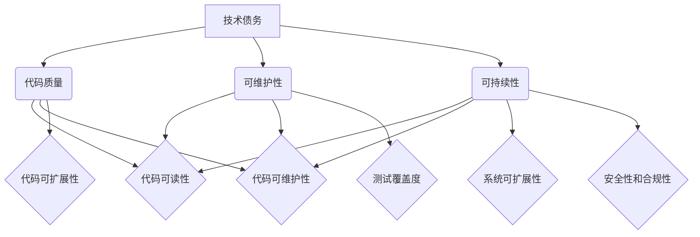

# AI系统的技术债务评估

> 关键词：AI系统，技术债务，代码质量，可维护性，可持续性，风险评估，最佳实践

## 1. 背景介绍

随着人工智能（AI）技术的迅猛发展，越来越多的企业和组织开始将AI系统整合到他们的业务流程中。然而，与传统的软件开发相比，AI系统的开发和管理具有其独特性，其中之一就是“技术债务”的概念。技术债务是指由于选择不恰当的技术方案或设计决策而导致的长期成本增加和未来维护困难。本文将探讨AI系统的技术债务评估，帮助开发者、项目经理和决策者识别、评估和减轻技术债务。

### 1.1 问题的由来

AI系统通常涉及复杂的算法、大量的数据和高度的非线性行为。在开发过程中，开发者可能会因为追求速度和短期效益而做出一些妥协，这些妥协在初期可能看不出问题，但随着时间的推移，会逐渐积累成技术债务，导致以下问题：

- **可维护性差**：代码难以理解和修改，增加了维护成本。
- **可扩展性差**：系统难以适应业务需求的变化，限制了增长潜力。
- **性能瓶颈**：系统无法处理更大的数据集或更复杂的任务。
- **安全漏洞**：安全措施不足，可能导致数据泄露或系统被攻破。

### 1.2 研究现状

目前，对于传统软件系统的技术债务评估已经有一些成熟的方法和工具，但针对AI系统的技术债务评估还处于探索阶段。本文将介绍一种基于代码质量、可维护性和可持续性的AI系统技术债务评估方法。

### 1.3 研究意义

通过评估AI系统的技术债务，可以帮助我们：

- **识别潜在的风险**：及时发现系统中存在的问题，避免未来出现更大的问题。
- **制定改进计划**：有针对性地进行技术债务的修复，提高系统的质量和可靠性。
- **提升团队效率**：减少未来的维护成本，提高团队的工作效率。
- **增强决策支持**：为项目决策提供科学依据，避免重复犯错。

## 2. 核心概念与联系

### 2.1 核心概念

#### 技术债务

技术债务是软件开发中的一种概念，指的是为了追求短期利益而做出的设计决策，这些决策可能会在未来带来额外的成本和复杂性。

#### 代码质量

代码质量是指代码的可读性、可维护性和可扩展性，以及代码满足功能需求和性能要求的能力。

#### 可维护性

可维护性是指系统在需要修改、升级或扩展时，能够被有效维护的程度。

#### 可持续性

可持续性是指系统能够长期运行并适应未来变化的能力。

### 2.2 Mermaid 流程图



### 2.3 核心概念联系

技术债务会直接影响到代码质量，进而影响到系统的可维护性和可持续性。良好的代码质量是保证系统可维护性和可持续性的基础。

## 3. 核心算法原理 & 具体操作步骤

### 3.1 算法原理概述

AI系统的技术债务评估是一个多维度、多层次的评估过程，主要包括以下步骤：

1. **识别技术债务**：通过代码审查、静态代码分析、动态测试等方法识别系统中存在的潜在技术债务。
2. **评估技术债务**：对识别出的技术债务进行分类和评估，确定其严重程度和影响范围。
3. **制定改进计划**：针对评估结果，制定相应的改进计划，包括修复技术债务、重构代码、引入最佳实践等。
4. **实施改进计划**：按照改进计划，对系统进行相应的修改和优化。
5. **验证改进效果**：验证改进措施的有效性，确保技术债务得到有效减轻。

### 3.2 算法步骤详解

#### 步骤 1：识别技术债务

- **代码审查**：通过人工审查代码，识别不规范的代码风格、设计模式和潜在的问题。
- **静态代码分析**：使用静态代码分析工具，自动识别代码中的潜在问题，如重复代码、冗余代码、未使用变量等。
- **动态测试**：通过自动化测试，验证代码的功能和性能，识别潜在的错误和异常。

#### 步骤 2：评估技术债务

- **分类**：将识别出的技术债务分为不同的类别，如代码质量、可维护性、可持续性等。
- **评估**：对每个类别的技术债务进行评估，确定其严重程度和影响范围。

#### 步骤 3：制定改进计划

- **修复技术债务**：对严重的技术债务进行修复，如重构代码、修复错误等。
- **重构代码**：对代码进行重构，提高代码质量和可维护性。
- **引入最佳实践**：引入最佳实践，如代码规范、设计模式、测试策略等。

#### 步骤 4：实施改进计划

- **代码修改**：根据改进计划，对代码进行修改和优化。
- **测试**：对修改后的代码进行测试，确保修复技术债务后，系统的功能、性能和稳定性。

#### 步骤 5：验证改进效果

- **性能测试**：对系统进行性能测试，验证改进后的系统性能是否符合要求。
- **稳定性测试**：对系统进行稳定性测试，验证改进后的系统是否稳定可靠。
- **可维护性测试**：对系统进行可维护性测试，验证改进后的系统是否易于维护。

### 3.3 算法优缺点

#### 优点

- **全面性**：评估过程涵盖了多个维度，能够全面识别和评估技术债务。
- **科学性**：评估过程基于客观的数据和标准，具有科学性。
- **实用性**：评估结果可以直接用于改进系统，具有实用性。

#### 缺点

- **复杂性**：评估过程相对复杂，需要投入较多的人力和时间。
- **成本**：评估过程可能需要使用一些专业的工具和平台，增加了成本。

### 3.4 算法应用领域

AI系统的技术债务评估可以应用于以下领域：

- **软件开发**：识别和评估AI系统的技术债务，提高代码质量和系统可维护性。
- **项目管理**：帮助项目管理者制定项目计划，控制项目风险。
- **决策支持**：为项目决策提供科学依据，避免重复犯错。

## 4. 数学模型和公式 & 详细讲解 & 举例说明

### 4.1 数学模型构建

AI系统的技术债务评估可以构建以下数学模型：

- **技术债务评分模型**：根据技术债务的严重程度和影响范围，对技术债务进行评分。
- **风险评估模型**：根据技术债务评分，对系统的风险进行评估。

### 4.2 公式推导过程

假设技术债务评分为 $D$，技术债务严重程度为 $S$，技术债务影响范围为 $R$，则技术债务评分模型可以表示为：

$$
D = f(S, R)
$$

其中，$f$ 为评分函数，可以根据实际情况进行设计。

风险评估模型可以表示为：

$$
R = g(D)
$$

其中，$g$ 为风险函数，可以根据实际情况进行设计。

### 4.3 案例分析与讲解

假设某个AI系统的技术债务评分为 $D=80$，则根据风险评估模型，系统的风险等级为 $R=高$。这意味着该系统存在较高的技术债务风险，需要尽快进行改进。

## 5. 项目实践：代码实例和详细解释说明

### 5.1 开发环境搭建

为了进行AI系统的技术债务评估，我们需要搭建以下开发环境：

- **代码编辑器**：如Visual Studio Code、Sublime Text等。
- **静态代码分析工具**：如SonarQube、Checkstyle等。
- **动态测试框架**：如JUnit、NUnit等。
- **性能测试工具**：如JMeter、LoadRunner等。

### 5.2 源代码详细实现

以下是一个简单的示例，演示如何使用SonarQube进行静态代码分析。

```bash
# 安装SonarQube
sudo apt-get install sonarqube

# 配置SonarQube
sudo vi /etc/sonarqube/sonar-server.properties
# 添加以下配置
sonar.jdbc.url=jdbc:mysql://localhost:3306/sonar?useSSL=false
sonar.jdbc.username=sonar
sonar.jdbc.password=sonar

# 启动SonarQube
sudo service sonarqube start

# 配置代码仓库
sudo vi /etc/sonar-scanner.properties
# 添加以下配置
sonar.host.url=http://localhost:9000
sonar.projectKey=my_project
sonar.projectName=My Project
sonar.projectVersion=1.0
sonar.sources=src
sonar.language=python

# 扫描代码仓库
sonar-scanner
```

### 5.3 代码解读与分析

在这个示例中，我们使用SonarQube对Python代码进行静态代码分析。首先，我们需要配置SonarQube，包括数据库连接、项目信息和代码仓库配置。然后，使用`sonar-scanner`命令扫描代码仓库，生成分析报告。

### 5.4 运行结果展示

SonarQube会生成一个分析报告，包括以下内容：

- **代码质量指标**：如代码重复率、代码复杂度、代码覆盖率等。
- **问题列表**：包括代码中存在的问题和潜在风险。
- **改进建议**：针对问题的改进建议。

## 6. 实际应用场景

AI系统的技术债务评估可以应用于以下实际应用场景：

- **新项目开发**：在项目初期进行技术债务评估，避免技术债务的积累。
- **现有系统评估**：对现有AI系统进行技术债务评估，识别和修复潜在问题。
- **项目风险管理**：将技术债务评估结果纳入项目风险管理流程。

### 6.4 未来应用展望

随着AI技术的不断发展，AI系统的技术债务评估将在以下方面得到进一步发展：

- **自动化评估**：开发自动化的技术债务评估工具，提高评估效率和准确性。
- **智能化评估**：利用机器学习技术，实现智能化技术债务评估。
- **持续集成**：将技术债务评估集成到持续集成/持续部署（CI/CD）流程中。

## 7. 工具和资源推荐

### 7.1 学习资源推荐

- 《代码大全》
- 《设计模式：可复用面向对象软件的基础》
- 《重构：改善既有代码的设计》

### 7.2 开发工具推荐

- SonarQube
- JUnit
- JMeter
- Code Climate

### 7.3 相关论文推荐

- 《软件质量：原理、模型与度量》
- 《软件工程：实践者的研究方法》
- 《敏捷开发实践指南》

## 8. 总结：未来发展趋势与挑战

### 8.1 研究成果总结

本文对AI系统的技术债务评估进行了探讨，提出了基于代码质量、可维护性和可持续性的评估方法，并介绍了相关的工具和资源。

### 8.2 未来发展趋势

AI系统的技术债务评估将朝着以下方向发展：

- **自动化和智能化**：开发自动化的技术债务评估工具，利用机器学习技术实现智能化评估。
- **集成化**：将技术债务评估集成到CI/CD流程中，实现持续的技术债务管理。
- **跨领域应用**：将技术债务评估应用于其他领域，如自动化测试、性能测试等。

### 8.3 面临的挑战

AI系统的技术债务评估面临着以下挑战：

- **评估指标**：如何选择合适的评估指标，全面评估AI系统的技术债务。
- **评估工具**：如何开发高效、准确的评估工具。
- **评估方法**：如何将技术债务评估与其他软件工程方法相结合。

### 8.4 研究展望

未来，AI系统的技术债务评估研究将重点关注以下方向：

- **开发更加全面、准确的评估指标和方法**。
- **开发高效、易用的评估工具**。
- **将技术债务评估与其他软件工程方法相结合，构建完整的技术债务管理体系**。

## 9. 附录：常见问题与解答

**Q1：什么是技术债务？**

A：技术债务是指为了追求短期利益而做出的设计决策，这些决策可能会在未来带来额外的成本和复杂性。

**Q2：如何识别AI系统的技术债务？**

A：可以通过代码审查、静态代码分析、动态测试等方法识别AI系统的技术债务。

**Q3：如何评估AI系统的技术债务？**

A：可以基于代码质量、可维护性和可持续性等指标，对技术债务进行评估。

**Q4：如何减轻AI系统的技术债务？**

A：可以通过修复技术债务、重构代码、引入最佳实践等方法减轻AI系统的技术债务。

**Q5：AI系统的技术债务评估有哪些挑战？**

A：AI系统的技术债务评估面临着评估指标、评估工具和评估方法等方面的挑战。

作者：禅与计算机程序设计艺术 / Zen and the Art of Computer Programming