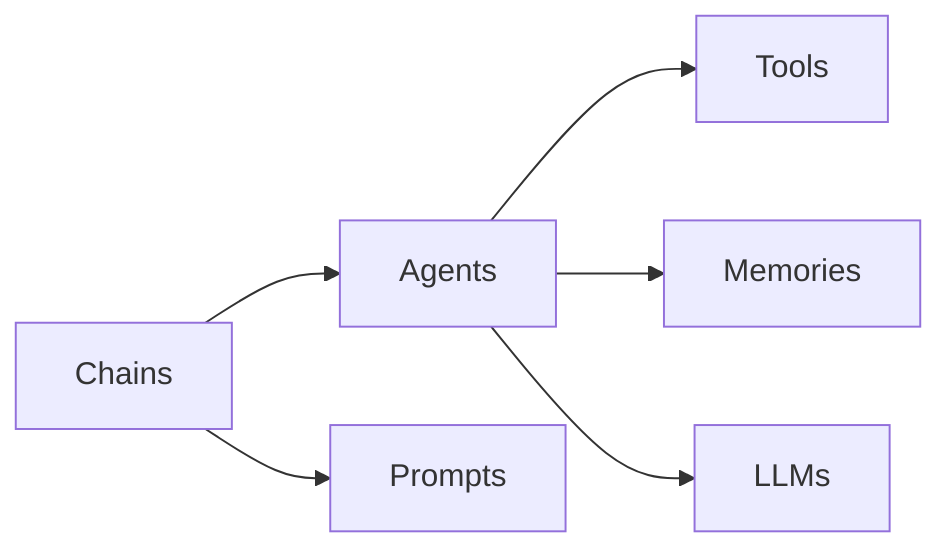

# 【LangChain编程：从入门到实践】大模型时代的开发范式

## 1. 背景介绍

### 1.1 问题的由来

在过去几年中,大型语言模型(Large Language Models,LLMs)的兴起彻底改变了人工智能(AI)和自然语言处理(NLP)领域。这些模型通过在海量文本数据上进行预训练,展现出了惊人的语言理解和生成能力,为各种自然语言任务提供了强大的解决方案。

然而,尽管大型语言模型取得了巨大的成功,但将它们应用于实际场景仍然面临着诸多挑战。例如,如何将这些模型与其他系统组件(如数据库、API等)集成?如何管理模型的输入和输出?如何确保模型的安全性和可靠性?如何简化模型的部署和扩展?

为了解决这些问题,LangChain应运而生。作为一个统一的框架,LangChain旨在简化大型语言模型在实际应用中的开发和部署过程,为开发人员提供了一种全新的编程范式。

### 1.2 研究现状

目前,已有一些框架和库致力于简化大型语言模型的应用,如Hugging Face的Transformers库、OpenAI的GPT-3 API等。然而,这些工具通常专注于特定的模型或任务,缺乏一种统一的方式来组合和管理不同的模型和组件。

相比之下,LangChain提供了一种更加抽象和模块化的方法,允许开发人员轻松地将多个模型、工具和数据源组合在一起,构建复杂的应用程序。它提供了一系列预构建的组件和接口,使得开发人员可以专注于业务逻辑,而不必过多关注底层细节。

### 1.3 研究意义

LangChain的出现为大模型时代的应用开发带来了全新的机遇和挑战。通过提供一种统一的编程范式,LangChain有望推动大型语言模型在各个领域的广泛应用,从而释放其巨大的潜力。同时,LangChain也为研究人员提供了一个理想的平台,用于探索和实验新的模型、算法和应用场景。

本文将全面介绍LangChain的核心概念、架构和使用方法,旨在为读者提供一个深入的理解和实践指南。无论您是一名开发人员、研究人员还是对大型语言模型感兴趣的爱好者,相信本文都能为您带来有价值的见解和启发。

### 1.4 本文结构

本文将分为以下几个部分:

1. 背景介绍
2. 核心概念与联系
3. 核心算法原理与具体操作步骤
4. 数学模型和公式详细讲解与举例说明
5. 项目实践:代码实例和详细解释说明
6. 实际应用场景
7. 工具和资源推荐
8. 总结:未来发展趋势与挑战
9. 附录:常见问题与解答

## 2. 核心概念与联系

在深入探讨LangChain的细节之前,让我们先了解一些核心概念和它们之间的关系。

1. **LLMs (Large Language Models)**: 大型语言模型是LangChain的核心,它们提供了强大的自然语言理解和生成能力。LangChain支持多种流行的LLM,如GPT-3、BLOOM、LLaMA等,并提供了统一的接口来与它们交互。

2. **Agents**: Agents是LangChain中的一个关键抽象,它们封装了LLM、工具、内存等组件,并负责协调它们的交互和决策过程。Agents可以被视为一种"智能代理",它们能够根据给定的目标和上下文信息,选择合适的操作和工具来完成任务。

3. **Tools**: Tools是LangChain中的另一个重要概念,它们代表了各种外部系统和服务,如数据库、API、文件系统等。Agents可以调用这些工具来获取或操作数据,从而扩展其功能。

4. **Memories**: Memories用于存储Agents在执行任务过程中的状态和历史信息,以保持上下文一致性。不同类型的Memories可以用于不同的场景,如会话内存、向量数据库等。

5. **Chains**: Chains是LangChain中的一种高级抽象,它们将Agents、Prompts、LLMs等组件组合在一起,形成可复用的流程或应用程序。开发人员可以通过定义和组合不同的Chains来构建复杂的应用程序。

6. **Prompts**: Prompts是用于指导LLM生成输出的文本提示。在LangChain中,Prompts可以是静态的或动态生成的,并且可以与其他组件(如Agents和Memories)集成,以提供更加上下文相关和个性化的输出。

这些核心概念相互关联,共同构建了LangChain的基础架构。通过组合和扩展这些概念,开发人员可以构建各种复杂的应用程序,从简单的问答系统到复杂的任务流程自动化。

## 3. 核心算法原理与具体操作步骤

### 3.1 算法原理概述

LangChain的核心算法原理基于一种称为"构成性搜索"(Constitutive Search)的范式。构成性搜索是一种通用的问题解决方法,它将复杂的任务分解为一系列较小的步骤,并利用各种工具和资源来完成这些步骤。

在LangChain中,构成性搜索过程由Agents驱动。Agents根据给定的目标和上下文信息,决定需要执行哪些操作和调用哪些工具。它们可以与LLM交互,生成中间提示和指令,并根据LLM的响应做出进一步的决策。

这个过程可以被视为一种"思考-行动"循环,其中Agents不断地思考下一步应该做什么,然后采取相应的行动(调用工具、与LLM交互等)。通过这种方式,Agents可以逐步地完成复杂的任务,同时利用LLM的语言理解和生成能力来指导和优化决策过程。

### 3.2 算法步骤详解

构成性搜索算法在LangChain中的具体实现可以概括为以下步骤:

1. **初始化**: 创建一个Agent实例,并为其提供必要的配置,如LLM、工具、内存等。

2. **目标设置**: 为Agent设置一个明确的目标或任务,通常以自然语言的形式表示。

3. **思考循环**:
   a. Agent根据当前的上下文信息和目标,与LLM交互以生成一个行动计划。
   b. Agent解析LLM的响应,并决定是执行一个工具操作还是继续思考。
   c. 如果决定执行工具操作,Agent将调用相应的工具,获取结果,并将结果存储在内存中。
   d. 基于工具的结果和当前上下文,Agent可能会继续思考或生成最终的输出。

4. **输出生成**: 当Agent认为目标已经完成,它将与LLM交互以生成最终的输出。

5. **结果返回**: 将Agent生成的最终输出返回给用户或上游系统。

这个过程可以被视为一种"分而治之"的策略,将复杂的任务分解为多个较小的步骤,并利用LLM和各种工具来协作完成这些步骤。通过这种方式,LangChain能够处理各种复杂的自然语言任务,同时保持了高度的灵活性和可扩展性。

### 3.3 算法优缺点

构成性搜索算法在LangChain中的应用具有以下优点:

1. **灵活性**: 通过组合不同的LLM、工具和内存,可以构建各种定制的应用程序和工作流。

2. **可解释性**: 由于算法的分步执行过程,用户可以更好地理解和解释Agent的决策和行为。

3. **可扩展性**: 算法可以轻松地集成新的LLM、工具和内存,从而不断扩展其功能。

4. **鲁棒性**: 通过将复杂任务分解为多个步骤,算法可以更好地处理错误和异常情况。

然而,构成性搜索算法也存在一些潜在的缺点和挑战:

1. **效率问题**: 多步骤的执行过程可能会导致性能开销,尤其是在涉及大量LLM调用时。

2. **上下文一致性**: 确保Agent在整个执行过程中保持上下文一致性是一个挑战。

3. **决策质量**: Agent的决策质量在很大程度上依赖于LLM的性能和提示的质量。

4. **工具集成**: 将各种工具无缝集成到LangChain中可能需要大量的工作和定制。

尽管存在这些挑战,但LangChain团队正在不断改进和优化算法,以提高其性能和可用性。同时,开源社区也在为LangChain贡献新的功能和改进,使其成为一个越来越强大的框架。

### 3.4 算法应用领域

由于其通用性和灵活性,构成性搜索算法及其在LangChain中的实现可以应用于各种自然语言处理任务和场景,包括但不限于:

1. **问答系统**: 利用LLM的语言理解和生成能力,结合外部数据源(如知识库、文档等),构建智能问答系统。

2. **任务自动化**: 将复杂的任务流程自动化,如数据处理、报告生成、客户服务等。

3. **决策支持系统**: 为决策过程提供智能辅助,通过综合多种信息源和分析模型来生成建议和见解。

4. **内容生成**: 利用LLM的文本生成能力,创建各种类型的内容,如新闻文章、营销材料、故事情节等。

5. **语言翻译**: 将LangChain与机器翻译模型结合,构建智能翻译系统。

6. **代码生成和解释**: 利用LLM的代码理解和生成能力,辅助编程任务,如代码补全、错误修复、文档生成等。

7. **个性化助手**: 构建具有个性化特征的虚拟助手,为用户提供定制的服务和体验。

8. **科学研究**: 在各个学科领域中,LangChain可以用于数据分析、文献检索、假设生成等任务。

总的来说,只要涉及自然语言处理和智能决策,LangChain都可以发挥作用。随着LangChain的不断发展和改进,它的应用场景也将不断扩展。

## 4. 数学模型和公式详细讲解与举例说明

### 4.1 数学模型构建

在探讨LangChain的数学模型之前,我们需要先了解一些基础概念。

大型语言模型(LLMs)通常基于**transformer**架构,该架构由编码器(Encoder)和解码器(Decoder)两个主要部分组成。编码器负责处理输入序列,而解码器则根据编码器的输出生成目标序列。

transformer架构中的关键组件是**多头注意力机制**(Multi-Head Attention),它允许模型同时关注输入序列中的多个位置,捕捉长距离依赖关系。多头注意力机制可以表示为:

$$\mathrm{MultiHead}(Q, K, V) = \mathrm{Concat}(head_1, \ldots, head_h)W^O$$
$$\text{where } head_i = \mathrm{Attention}(QW_i^Q, KW_i^K, VW_i^V)$$

其中 $Q$、$K$ 和 $V$ 分别表示查询(Query)、键(Key)和值(Value)矩阵,它们通过线性变换获得,即 $QW_i^Q$、$KW_i^K$ 和 $VW_i^V$。$W_i^Q$、$W_i^K$ 和 $W_i^V$ 是可学习的权重矩阵。$\mathrm{Attention}$ 函数计算注意力权重,并将其应用于值矩阵以获得注意力输出。最后,所有注意力头的输出通过连接操作 $\mathrm{Concat}$ 合并,并通过另一个线性变换 $W^O$ 进行投影。

除了注意力机制,transformer还包括**前馈神经网络**(Feed-Forward Neural Network)和**残差连接**(Residual Connections)等组件,以增强模型的表示能力和优化稳定性。

在LangChain中,