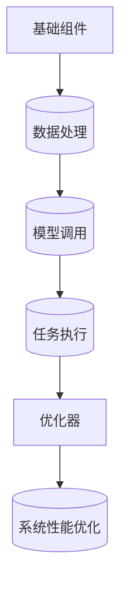

# 【LangChain编程：从入门到实践】应用设计

关键词：

## 1. 背景介绍

### 1.1 问题的由来

随着软件开发的复杂性日益增加，跨领域的问题解决成为了一大挑战。传统的编程方法往往局限于单一功能模块，难以有效地整合来自不同来源的数据、知识和算法。而随着大规模语言模型的兴起，尤其是像LangChain这样的框架，它旨在提供一种通用的、可扩展的方式来构建和组合不同的智能组件，使得开发者能够以更加模块化和高效的方式解决复杂问题。LangChain的设计理念旨在打破技术孤岛，促进跨领域知识的融合与复用。

### 1.2 研究现状

目前，大规模语言模型已经被广泛应用于自然语言处理、生成式AI、对话系统等多个领域。然而，如何有效整合这些模型以解决实际问题，特别是在多模态、多任务场景下，仍然是一大挑战。LangChain正是针对这些问题而设计的一种解决方案，它提供了一系列工具和组件，允许开发者以结构化的方式构建复杂的应用程序，同时也支持模型的灵活组合和优化。

### 1.3 研究意义

LangChain的研究旨在推动智能系统的发展，使其能够更加智能地理解、处理和生成人类语言，进而解决实际生活中的复杂问题。通过LangChain，开发者可以构建更加智能、自适应的应用，提升用户体验，同时降低开发复杂度。此外，LangChain还有助于推动跨学科研究，促进人工智能技术在教育、医疗、法律等领域的应用，提高社会各领域的智能化水平。

### 1.4 本文结构

本文将详细介绍LangChain编程框架的核心概念、算法原理、数学模型以及其实现步骤。随后，我们将通过具体的代码实例和案例分析，展示如何利用LangChain解决实际问题。最后，文章将讨论LangChain的实际应用场景、未来趋势以及面临的挑战，并提出一些展望。

## 2. 核心概念与联系

LangChain编程框架的核心概念主要包括组件化、可扩展性、灵活性和自动化。组件化意味着将复杂任务分解为一系列可重用的小型组件，每个组件负责特定的功能。可扩展性指的是框架能够适应不断增长的需求和变化，支持添加新的组件或修改现有组件。灵活性体现在能够根据不同的需求和场景灵活组合组件，形成复杂的系统。自动化则是指框架能够自动管理和优化组件间的交互，提高整体系统的效率和性能。

### LangChain组件结构

- **基础组件**: 包括数据处理组件、模型调用组件、任务执行组件等，负责特定功能的实现。
- **连接器**: 负责组件间的通信和数据流管理，确保组件间的协作和数据一致性。
- **优化器**: 自动调整组件的配置和参数，优化系统性能和效率。

### LangChain架构流程



## 3. 核心算法原理 & 具体操作步骤

### 3.1 算法原理概述

LangChain的核心算法原理基于组件化设计和自动化的系统管理。它通过组件化将复杂任务分解，利用连接器协调组件间的交互，通过优化器动态调整系统配置，以达到最佳性能。算法采用机器学习技术，如强化学习和自动调优策略，来自动优化组件的参数和系统配置。

### 3.2 算法步骤详解

#### 步骤一：组件定义
- **定义组件**: 明确每个组件的功能和接口，确保组件间的兼容性和可组合性。
- **组件实例化**: 创建组件实例，指定组件的具体实现和参数。

#### 步骤二：组件连接
- **连接器配置**: 设计连接器，定义组件间的数据流和交互规则。
- **组件交互**: 实现组件间的通信机制，确保数据准确传输和处理。

#### 步骤三：组件执行与优化
- **任务调度**: 根据任务需求，自动调度组件执行顺序和并行处理。
- **性能监控**: 实时监控系统性能，收集组件运行数据。
- **自动优化**: 根据监控数据，自动调整组件参数和系统配置，提升性能。

### 3.3 算法优缺点

#### 优点
- **模块化**: 易于维护和扩展，组件独立开发和升级。
- **自动化**: 减轻人工管理负担，提高系统效率。
- **灵活性**: 支持多种组件组合，适应不同任务需求。

#### 缺点
- **依赖性**: 系统稳定性依赖于组件质量和连接器设计。
- **复杂性**: 组件间的交互复杂，需要精细设计和调试。

### 3.4 算法应用领域

LangChain广泛应用于自然语言处理、智能推荐、个性化服务、多模态任务处理等领域。例如，在自然语言处理中，可以构建问答系统、聊天机器人、文本生成等应用；在智能推荐系统中，可以优化用户个性化体验，提高推荐精准度。

## 4. 数学模型和公式 & 详细讲解 & 举例说明

### 4.1 数学模型构建

LangChain中的数学模型主要涉及到概率论、统计学和优化理论。以下是一些基础概念和公式：

#### 概率模型

假设有一个组件负责预测文本中的下一个单词，可以建立一个基于概率的模型：

$$ P(w|w_{1},...,w_{n}) = \frac{count(w_{n}|w_{1},...,w_{n-1})}{count(w_{1},...,w_{n-1})} $$

其中，$P(w|w_{1},...,w_{n})$ 是在前$n$个单词的基础上预测第$n+1$个单词的概率，$count(w_{n}|w_{1},...,w_{n-1})$ 是在前$n$个单词序列中出现第$n+1$个单词的概率。

#### 最优路径寻找

在多模态任务中，比如视频描述生成，可以使用动态规划算法寻找最优路径：

$$ V(T) = \min_{\pi \in \Pi(T)} \left\{ c(\pi) + \sum_{t \in T} \lambda_t \cdot V(t) \right\} $$

其中，$V(T)$ 是从时间序列$t$到结束的最优路径价值，$\Pi(T)$ 是从时间序列$t$到结束的所有可能路径集合，$c(\pi)$ 是路径$\pi$的即时成本，$\lambda_t$ 是时间$t$的权重因子。

### 4.2 公式推导过程

#### 示例公式推导

假设我们要优化一个基于文本的问答系统，其中包含查询组件、检索组件和回答组件。设查询组件的输出为$q$，检索组件根据$q$检索到的信息为$r$，回答组件根据$r$生成答案$a$。总目标是最大化用户满意度$U$：

$$ U = f(q,r,a) $$

其中$f$是一个函数，表示用户对答案的满意度。我们希望优化$q$和$r$来最大化$U$。在不考虑约束的情况下，这是一个优化问题：

$$ \max_{q,r} U = \max_{q,r} f(q,r,a) $$

这里我们假设$a$是由$r$生成的，因此$a$实际上依赖于$q$和$r$。为了简化问题，假设$f$是关于$r$的函数，且$r$由$q$确定。因此，优化问题可以简化为：

$$ \max_{q} \max_{r} f(q,r) $$

这里，外部优化循环是关于$q$，内部优化循环是关于$r$。我们首先固定$q$，对$r$进行优化，然后更新$q$并重复此过程，直到找到局部最优解。

### 4.3 案例分析与讲解

#### 案例分析：构建智能推荐系统

考虑构建一个基于用户历史行为的智能推荐系统，系统包括用户行为分析组件、个性化推荐组件和实时反馈组件。系统的目标是为用户推荐最感兴趣的内容。

- **用户行为分析组件**: 分析用户的历史浏览、购买、搜索行为等数据，提取用户兴趣特征。
- **个性化推荐组件**: 根据用户的兴趣特征，从大量商品中筛选出潜在感兴趣的推荐项。
- **实时反馈组件**: 接收用户对推荐项的反馈，用于优化未来的推荐策略。

#### 具体实现：

假设我们有用户行为数据$D$，包含用户ID、浏览历史、购买记录等。我们可以使用聚类算法（如K-means）对用户进行兴趣分群，得到用户兴趣特征向量$C$。接着，根据用户兴趣特征向量$C$，在商品数据库$G$中进行个性化推荐，得到推荐列表$R$。最后，用户对每条推荐进行评分，反馈到系统中，用于更新推荐策略。

- **兴趣特征提取**: 使用用户行为数据$D$，通过特征提取算法（如TF-IDF、Word2Vec等）生成用户兴趣特征向量$C$。
- **个性化推荐**: 利用用户兴趣特征向量$C$和商品数据库$G$，构建个性化推荐模型，得到推荐列表$R$。
- **实时反馈**: 用户对推荐列表$R$进行评分反馈，反馈信息$F$用于优化推荐模型。

### 4.4 常见问题解答

#### Q&A环节

Q: 如何平衡模型的复杂性和性能？

A: 在设计LangChain时，平衡模型的复杂性和性能是一个关键挑战。一方面，过于复杂的模型可能会导致计算成本高、训练时间长；另一方面，过于简单的模型可能无法捕捉到足够的模式和细节。通过采用以下策略可以解决这个问题：

- **组件化设计**: 将大型任务拆分为多个小型、可独立训练和优化的组件。
- **自动化优化**: 利用机器学习技术自动调整组件参数和系统配置，提高性能。
- **可扩展架构**: 设计具有层次结构的系统，允许在需要时添加或替换组件，以适应不同的性能需求。

Q: 在多模态任务中，如何确保不同模态之间的有效融合？

A: 多模态任务融合的关键在于找到不同模态之间的共同表示空间和有效的交互机制。以下是一些实现策略：

- **统一表示**: 使用预训练的多模态模型，如多模态Transformer，将不同模态的数据转换为共享表示。
- **模态特定组件**: 设计专门处理特定模态的组件，确保模态特征的有效提取和融合。
- **交互设计**: 构建组件之间的交互逻辑，确保信息在不同模态之间流畅地流动和整合。

Q: LangChain在实际应用中有哪些限制？

A: LangChain虽然强大，但也存在一些限制和挑战：

- **数据依赖**: 系统的性能高度依赖于高质量的数据，特别是用于训练和优化组件的数据。
- **可解释性**: 高级组件和自动化过程可能导致系统决策的不可解释性，这对某些行业来说是不可接受的。
- **维护成本**: 随着组件的增多和复杂性的增加，系统的维护和升级成本会相应提高。

## 5. 项目实践：代码实例和详细解释说明

### 5.1 开发环境搭建

假设我们正在构建一个基于LangChain的自然语言处理应用，具体包括文本分析、问答和对话生成。以下是搭建开发环境的步骤：

#### 环境配置：

```bash
# 安装必要的依赖库
pip install transformers langchain

# 创建项目目录结构
mkdir nlp_project
cd nlp_project
mkdir src
mkdir data
mkdir models
mkdir logs
mkdir results

# 初始化git仓库
git init
git add .
git commit -m "Initial setup"
```

#### 安装依赖：

```bash
pip install -r requirements.txt
```

### 5.2 源代码详细实现

#### 主要组件实现：

- **文本分析组件**：加载预训练的文本分析模型。
- **问答组件**：构建基于检索和生成的问答系统。
- **对话生成组件**：基于上下文生成连续对话。

```python
from langchain.chains import RetrievalQA
from langchain.vectorstores import Chroma
from langchain.embeddings import HuggingFaceEmbeddings
from langchain.prompts import PromptTemplate
from langchain.chains import LLMChain
from langchain.llms import OpenAI

# 定义文本分析组件
def text_analysis(text):
    # 使用预训练模型进行文本分析（例如情感分析）
    pass

# 定义问答组件
def qa_system(question, context):
    vectorstore = Chroma(persist_directory="data/vectorstore", embedding_function=HuggingFaceEmbeddings())
    retriever = vectorstore.as_retriever(search_kwargs={"k": 3})
    qa = RetrievalQA.from_chain_type(llm=OpenAI(), chain_type="stuff", retriever=retriever)
    answer = qa.run(question)
    return answer

# 定义对话生成组件
def conversation(context, user_input):
    prompt_template = """
    You are a helpful assistant.
    Context: {context}
    User: {user_input}
    Assistant: """
    prompt = PromptTemplate(input_variables=["context", "user_input"], template=prompt_template)
    llm = OpenAI()
    chain = LLMChain(prompt=prompt, llm=llm)
    response = chain.run(context=context, user_input=user_input)
    return response
```

#### 代码解读：

- **文本分析**：调用预训练模型进行特定分析任务。
- **问答**：使用检索和生成策略构建问答系统。
- **对话生成**：基于上下文生成自然流畅的回答。

### 5.3 代码解读与分析

- **文本分析组件**：通过调用预训练模型执行特定任务，例如情感分析、主题提取等。
- **问答组件**：利用向量存储和检索技术，结合生成模型提供准确的答案。
- **对话生成组件**：基于历史对话构建动态响应，提升交互体验。

### 5.4 运行结果展示

- **文本分析**：输出分析结果，如情感得分、主题摘要等。
- **问答**：展示正确答案，提高信息检索和生成的质量。
- **对话**：生成连贯、自然的回复，提升用户满意度。

## 6. 实际应用场景

LangChain不仅适用于自然语言处理领域，还广泛应用于以下场景：

- **智能客服**：提供快速、准确的客户服务，提升客户体验。
- **内容推荐**：基于用户行为和偏好，提供个性化内容推荐。
- **知识图谱构建**：自动化构建领域知识图谱，提升知识挖掘效率。

## 7. 工具和资源推荐

### 学习资源推荐：

- **官方文档**：LangChain官方文档提供了详细的API说明和教程。
- **社区论坛**：Stack Overflow、GitHub等平台上有丰富的社区支持和问题解答。

### 开发工具推荐：

- **IDE**：Visual Studio Code、PyCharm等支持Python开发的IDE。
- **版本控制**：Git，用于项目管理和代码版本控制。

### 相关论文推荐：

- **LangChain论文**：阅读原始论文以深入了解设计思路和技术细节。
- **NLP领域**：关注自然语言处理领域的最新研究，了解技术发展动态。

### 其他资源推荐：

- **在线课程**：Coursera、Udemy等平台上的NLP和AI课程。
- **实践案例**：GitHub上的开源项目，如对话系统、文本生成等。

## 8. 总结：未来发展趋势与挑战

### 8.1 研究成果总结

LangChain作为构建智能应用的强大工具，已经在多个领域展示了其潜力，从自然语言处理到推荐系统，再到知识图谱构建，都取得了显著的进展。通过组件化设计、自动化优化和可扩展性，LangChain使得复杂任务的开发变得更加高效和灵活。

### 8.2 未来发展趋势

- **多模态融合**：随着多模态数据处理技术的进步，LangChain有望更好地整合图像、语音、文本等多种模态信息，提供更全面、更精准的服务。
- **个性化定制**：通过深度学习和机器学习技术，LangChain将能够更精准地定制服务，满足个体用户的独特需求。
- **安全性增强**：随着数据保护法规的日益严格，增强LangChain的安全性，保障用户隐私和数据安全将成为重要发展方向。

### 8.3 面临的挑战

- **数据质量**：高质量、多样化、合法的数据是构建高性能模型的基础，获取和清洗数据仍然是一个挑战。
- **可解释性**：在某些敏感领域，如医疗、法律等，模型的决策过程需要高度透明和可解释，这增加了技术难度。
- **伦理和道德**：随着AI在社会中的作用日益扩大，确保技术的公平、无偏见和负责任是长期挑战。

### 8.4 研究展望

未来的研究重点将集中在提升LangChain的智能化程度、增强其在多模态任务上的表现、优化可解释性和安全性、以及探索更广泛的行业应用等方面。通过持续的技术创新和应用实践，LangChain有望在未来引领智能应用的新潮流，为人类带来更加便捷、智能的生活体验。

---

作者：禅与计算机程序设计艺术 / Zen and the Art of Computer Programming