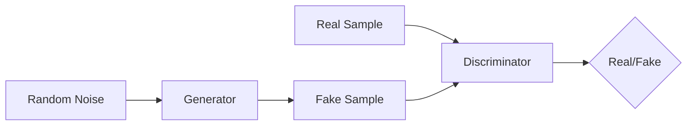

# 生成对抗网络(GAN)原理与代码实战案例讲解

## 1. 背景介绍
### 1.1 问题的由来
生成对抗网络(Generative Adversarial Networks, GANs)自2014年由Ian Goodfellow等人提出以来，迅速成为了机器学习领域的研究热点。传统的机器学习方法在生成任务上效果并不理想，难以生成高质量的图像、文本等数据。而GANs的出现，为解决这一难题提供了新的思路和方法。

### 1.2 研究现状
近年来，GANs在计算机视觉、自然语言处理等领域取得了广泛的应用，特别是在图像生成、图像翻译、图像编辑等任务上表现出色。各种改进的GAN模型不断涌现，如DCGAN、WGAN、CycleGAN、StarGAN等，极大地推动了GANs的发展。但同时，GANs的训练也存在不稳定、梯度消失、模式崩溃等问题有待解决。

### 1.3 研究意义
GANs作为一种强大的生成模型，有望在更多领域发挥作用。深入研究GANs的原理和应用，对于推动人工智能的进步具有重要意义。通过对GANs的探索，可以让机器具备更强大的创造和想象能力，生成出更加逼真和多样化的数据，服务于现实世界的各种应用。

### 1.4 本文结构
本文将全面介绍GANs的原理和应用。第2部分阐述GANs的核心概念。第3部分深入讲解GANs的算法原理和具体步骤。第4部分介绍GANs的数学模型和公式推导。第5部分通过代码实例演示如何实现GANs。第6部分展望GANs的实际应用场景。第7部分推荐GANs相关的工具和资源。第8部分总结全文并展望GANs的未来发展方向。

## 2. 核心概念与联系

GANs网络由两部分组成：生成器(Generator)和判别器(Discriminator)。

生成器的目标是生成尽可能逼真的假样本去欺骗判别器。它接收一个随机噪声z作为输入，通过一系列的卷积、转置卷积等操作将其映射到数据空间，输出生成的假样本。

判别器的目标是尽可能准确地判断输入是真实样本还是生成的假样本。它接收一个输入，通过卷积层提取特征，最后输出一个标量，代表输入为真实样本的概率。

生成器和判别器在训练过程中互相博弈。生成器努力生成更加逼真的样本欺骗判别器，判别器则不断提升自己的判别能力去识别生成器产生的假样本。最终，通过这种动态博弈，生成器可以生成出非常逼真的样本，判别器也具备了高超的判别能力。

下图展示了GANs的基本架构：



## 3. 核心算法原理 & 具体操作步骤
### 3.1 算法原理概述
GANs的核心思想是让两个神经网络相互博弈。生成器尽可能去生成逼真的假样本欺骗判别器，判别器则要尽可能分辨出真假样本。这个过程可以用一个minimax博弈来描述：

$$\min_G \max_D V(D,G) = \mathbb{E}_{x \sim p_{data}(x)}[\log D(x)] + \mathbb{E}_{z \sim p_z(z)}[\log (1 - D(G(z)))]$$

其中，$G$表示生成器，$D$表示判别器，$x$为真实样本，$z$为随机噪声。生成器$G$的目标是最小化目标函数，而判别器$D$的目标是最大化目标函数。

### 3.2 算法步骤详解
1. 初始化生成器$G$和判别器$D$的参数，随机初始化或使用预训练模型。
2. 在每一个训练迭代中：
   - 从真实数据分布 $p_{data}(x)$ 中采样一批真实样本 $\{x^{(1)}, \ldots, x^{(m)}\}$。
   - 从先验分布 $p_z(z)$ (通常为高斯分布或均匀分布)中采样一批随机噪声 $\{z^{(1)}, \ldots, z^{(m)}\}$。
   - 使用生成器 $G$ 生成一批假样本 $\{\tilde{x}^{(1)}, \ldots, \tilde{x}^{(m)}\}$，其中 $\tilde{x}^{(i)} = G(z^{(i)})$。
   - 更新判别器 $D$ 的参数，最大化目标函数：
     $$\nabla_{\theta_d} \frac{1}{m} \sum_{i=1}^m [\log D(x^{(i)}) + \log (1 - D(\tilde{x}^{(i)}))]$$
   - 从先验分布 $p_z(z)$ 中采样一批新的随机噪声 $\{z^{(1)}, \ldots, z^{(m)}\}$。
   - 更新生成器 $G$ 的参数，最小化目标函数：
     $$\nabla_{\theta_g} \frac{1}{m} \sum_{i=1}^m \log (1 - D(G(z^{(i)})))$$
3. 重复步骤2，直到满足预设的停止条件(如达到最大迭代次数或生成效果理想)。

### 3.3 算法优缺点
GANs的优点：
- 可以生成高质量、逼真的样本
- 通过随机噪声控制生成过程，具有一定的可解释性
- 适用于各种不同类型的数据，如图像、文本、音频等

GANs的缺点：
- 训练过程不稳定，容易出现梯度消失、模式崩溃等问题
- 对超参数敏感，需要仔细调参
- 评估生成效果较困难，缺乏统一的评价指标

### 3.4 算法应用领域
- 图像生成：人脸生成、场景生成等
- 图像翻译：风格迁移、图像上色等
- 图像编辑：人脸属性编辑、图像修复等
- 文本生成：对话生成、故事生成等
- 语音合成：语音转换、语音增强等

## 4. 数学模型和公式 & 详细讲解 & 举例说明
### 4.1 数学模型构建
GANs的数学模型可以表示为一个minimax博弈：

$$\min_G \max_D V(D,G) = \mathbb{E}_{x \sim p_{data}(x)}[\log D(x)] + \mathbb{E}_{z \sim p_z(z)}[\log (1 - D(G(z)))]$$

其中，$p_{data}$ 表示真实数据分布，$p_z$ 表示先验分布(如高斯分布)。生成器 $G$ 的目标是最小化目标函数，而判别器 $D$ 的目标是最大化目标函数。

### 4.2 公式推导过程
根据上述目标函数，我们可以推导出生成器和判别器的优化目标。

对于判别器 $D$，其优化目标是最大化目标函数：

$$\max_D V(D,G) = \mathbb{E}_{x \sim p_{data}(x)}[\log D(x)] + \mathbb{E}_{z \sim p_z(z)}[\log (1 - D(G(z)))]$$

这可以分解为两项，一项是最大化真实样本的对数概率，另一项是最大化假样本被判别为假的对数概率。

对于生成器 $G$，其优化目标是最小化目标函数：

$$\min_G V(D,G) = \mathbb{E}_{z \sim p_z(z)}[\log (1 - D(G(z)))]$$

这可以理解为最小化生成样本被判别器判别为假的对数概率，即生成器希望生成的样本尽可能被判别器认为是真实的。

### 4.3 案例分析与讲解
以图像生成为例，假设我们要生成手写数字图像。真实数据分布 $p_{data}$ 对应着真实手写数字图像的分布。我们从一个高斯分布 $p_z$ 中采样随机噪声 $z$，然后将其输入生成器 $G$，生成一批假的手写数字图像。

判别器 $D$ 接收真实图像和生成图像，输出它们是真实样本的概率。通过最大化目标函数，判别器学习如何区分真假图像。

生成器 $G$ 接收随机噪声，生成假的手写数字图像。通过最小化目标函数，生成器学习如何生成更加逼真的图像去欺骗判别器。

最终，通过生成器和判别器的不断博弈，我们可以得到一个生成效果很好的手写数字图像生成模型。

### 4.4 常见问题解答
1. 为什么要使用随机噪声作为生成器的输入？

   使用随机噪声作为输入，可以让生成器学习到数据分布的隐空间表示。通过操纵隐空间中的点，就可以控制生成样本的特性。此外，添加随机噪声还可以增加生成样本的多样性。

2. 生成器和判别器的网络结构如何设计？

   生成器和判别器的网络结构需要根据任务和数据类型进行设计。一般来说，生成器使用转置卷积层进行上采样，判别器使用卷积层进行下采样。对于图像任务，可以参考DCGAN的网络结构设计。对于文本任务，可以使用RNN或Transformer等结构。网络的层数、卷积核大小、激活函数等超参数需要进行调试。

3. 训练GANs时有哪些技巧？

   训练GANs时需要注意以下几点：
   - 使用BatchNorm稳定训练
   - 使用LeakyReLU作为激活函数
   - 使用Adam优化器，并调整学习率
   - 平衡生成器和判别器的训练，避免一方过强
   - 使用标签平滑(Label Smoothing)缓解梯度消失问题
   - 适当使用正则化技术，如Spectral Normalization、Gradient Penalty等

## 5. 项目实践：代码实例和详细解释说明
### 5.1 开发环境搭建
本项目使用Python语言和PyTorch深度学习框架。需要安装以下依赖库：
- PyTorch
- torchvision
- NumPy
- Matplotlib

可以使用pip命令进行安装：

```bash
pip install torch torchvision numpy matplotlib
```

### 5.2 源代码详细实现
下面给出了一个简单的DCGAN实现，用于生成MNIST手写数字图像。

```python
import torch
import torch.nn as nn
import torchvision
import torchvision.transforms as transforms
import numpy as np
import matplotlib.pyplot as plt

# 超参数设置
latent_dim = 100
batch_size = 128
num_epochs = 50
learning_rate = 0.0002
beta1 = 0.5

# 数据预处理
transform = transforms.Compose([
    transforms.ToTensor(),
    transforms.Normalize((0.5,), (0.5,))
])

train_dataset = torchvision.datasets.MNIST(root='./data', train=True, download=True, transform=transform)
train_loader = torch.utils.data.DataLoader(train_dataset, batch_size=batch_size, shuffle=True)

# 生成器
class Generator(nn.Module):
    def __init__(self):
        super(Generator, self).__init__()
        self.model = nn.Sequential(
            nn.Linear(latent_dim, 256),
            nn.LeakyReLU(0.2, inplace=True),
            nn.Linear(256, 512),
            nn.LeakyReLU(0.2, inplace=True),
            nn.Linear(512, 1024),
            nn.LeakyReLU(0.2, inplace=True),
            nn.Linear(1024, 784),
            nn.Tanh()
        )

    def forward(self, z):
        img = self.model(z)
        img = img.view(img.size(0), 1, 28, 28)
        return img

# 判别器
class Discriminator(nn.Module):
    def __init__(self):
        super(Discriminator, self).__init__()
        self.model = nn.Sequential(
            nn.Linear(784, 1024),
            nn.LeakyReLU(0.2, inplace=True),
            nn.Dropout(0.3),
            nn.Linear(1024, 512),
            nn.LeakyReLU(0.2, inplace=True),
            nn.Dropout(0.3),
            nn.Linear(512, 256),
            nn.LeakyReLU(0.2