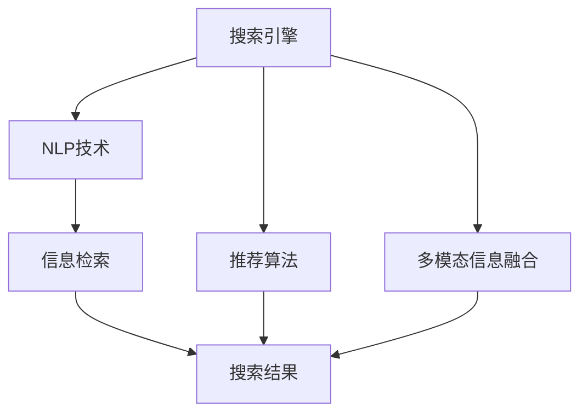
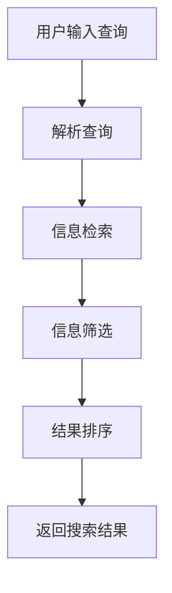
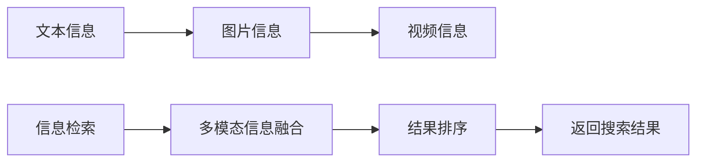
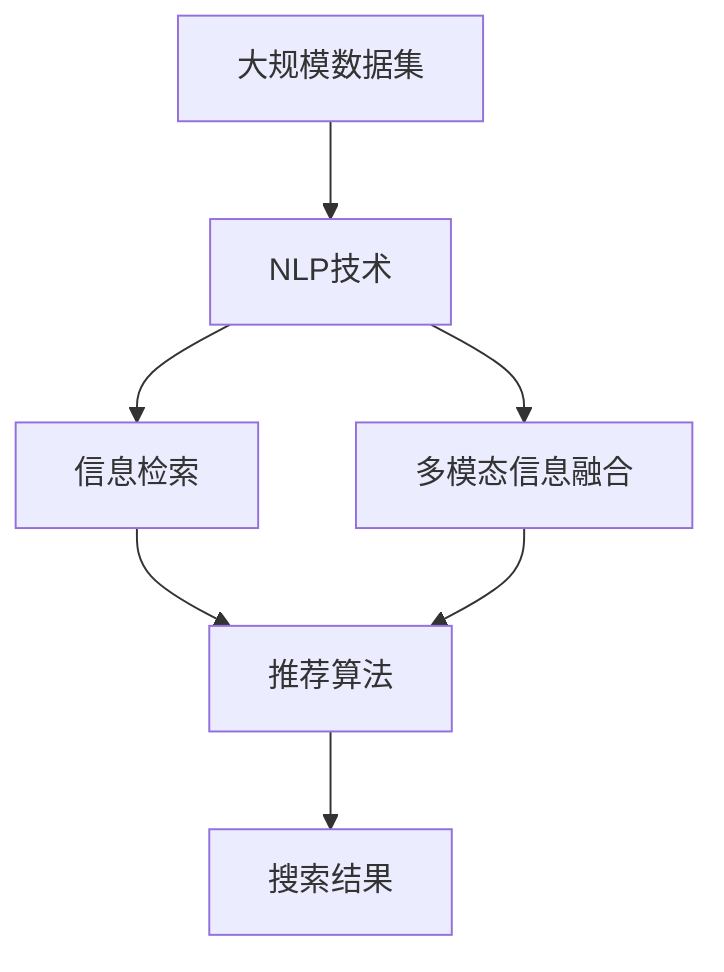

                 

# 多渠道整合：AI提供最佳搜索结果

> 关键词：人工智能, 搜索引擎, 多渠道整合, 自然语言处理, 推荐算法, 信息检索, 机器学习

## 1. 背景介绍

### 1.1 问题由来
在现代社会，信息的获取方式日益多样化，用户不再满足于单一的文本信息获取方式，而是更倾向于在多个渠道（如网页、图片、视频、音频等）中寻找答案。搜索引擎作为信息获取的主要工具，面临着如何在多渠道中整合信息、提供最佳结果的挑战。如何构建一个高效、全面、个性化的信息检索系统，以适应用户日益复杂的信息需求，成为了研究热点。

### 1.2 问题核心关键点
在多渠道信息整合中，核心的目标是构建一个集成化、智能化的搜索引擎，既能处理文本，又能处理非文本信息，同时能够根据用户的个性化需求，提供最优的结果。为了实现这一目标，研究者们提出了基于人工智能（AI）的搜索引擎解决方案，如自然语言处理（NLP）、推荐算法、多模态信息融合等技术。

### 1.3 问题研究意义
构建一个能处理多渠道信息的智能化搜索引擎，对于提升信息检索的效率和质量、优化用户搜索体验、促进信息服务的普惠性具有重要意义。它不仅能够满足用户多样化的信息需求，还能为商业智能、数据分析等领域提供强有力的技术支持。

## 2. 核心概念与联系

### 2.1 核心概念概述

为了更好地理解多渠道信息整合的过程，本节将介绍几个密切相关的核心概念：

- **搜索引擎（Search Engine）**：用于获取、组织和展示与查询相关的网络信息，帮助用户快速定位所需信息的工具。
- **自然语言处理（NLP）**：涉及计算机与人类语言之间相互转换、理解和生成，是搜索引擎处理文本信息的核心技术。
- **推荐算法（Recommendation Algorithm）**：通过分析用户行为和偏好，为用户推荐最相关信息的算法。
- **信息检索（Information Retrieval）**：从信息集合中找出与用户查询最匹配的信息的学科，是搜索引擎的核心功能。
- **多模态信息融合（Multi-modal Information Fusion）**：将来自不同模态的信息整合，以提升信息检索和推荐的准确性和全面性。

这些核心概念之间的逻辑关系可以通过以下Mermaid流程图来展示：



这个流程图展示了一个搜索引擎的基本架构，其中NLP技术用于文本信息处理，推荐算法根据用户行为推荐信息，多模态信息融合将不同模态的信息整合并用于结果排序。

### 2.2 概念间的关系

这些核心概念之间存在着紧密的联系，形成了多渠道信息整合的完整生态系统。下面我们通过几个Mermaid流程图来展示这些概念之间的关系。

#### 2.2.1 搜索引擎的工作流程



这个流程图展示了搜索引擎处理用户查询的基本流程：首先解析用户的查询，然后从信息集合中检索相关文档，筛选出最匹配的信息，最后对结果进行排序并返回给用户。

#### 2.2.2 多模态信息融合



这个流程图展示了多模态信息融合的基本流程：首先获取不同类型的信息（文本、图片、视频等），然后通过多模态信息融合技术将它们整合，最后对融合后的信息进行排序并返回给用户。

#### 2.2.3 推荐算法


这个流程图展示了推荐算法的工作原理：首先收集用户的各类行为数据（如浏览记录、点击行为等），分析用户偏好，结合历史查询，通过推荐算法为用户推荐相关内容。

### 2.3 核心概念的整体架构

最后，我们用一个综合的流程图来展示这些核心概念在大规模信息检索和推荐系统中的整体架构：



这个综合流程图展示了从数据处理到结果生成的完整流程：首先通过NLP技术处理文本信息，然后结合多模态信息融合技术整合不同模态的信息，最后通过推荐算法为每个用户生成个性化搜索结果。

## 3. 核心算法原理 & 具体操作步骤
### 3.1 算法原理概述

多渠道信息整合的核心算法包括自然语言处理（NLP）、信息检索（IR）、推荐算法等。这些算法的原理概述如下：

#### 3.1.1 自然语言处理（NLP）
NLP的主要任务是将自然语言转换为计算机能够理解的形式，包括分词、词性标注、命名实体识别、情感分析等。通过NLP技术，搜索引擎可以更好地理解用户查询，提取出查询中的关键词，进行精确匹配。

#### 3.1.2 信息检索（IR）
信息检索算法通过计算文档与查询的相似度，从信息集合中找出与查询最匹配的文档。常用的IR算法包括向量空间模型（VSM）、隐式语义索引（LSI）、主题模型（LDA）等。

#### 3.1.3 推荐算法
推荐算法通过分析用户的历史行为和偏好，为用户推荐最相关的信息。常用的推荐算法包括协同过滤（CF）、基于内容的推荐（CFB）、混合推荐（Hybrid）等。

### 3.2 算法步骤详解

以下我们将详细讲解多渠道信息整合的具体操作步骤：

#### 3.2.1 文本信息处理
文本信息处理是NLP的核心任务，包括分词、词性标注、命名实体识别等。以BERT模型为例，具体步骤如下：

1. **分词**：将查询和文档进行分词，以便计算机理解和处理。
2. **词性标注**：标注每个词的词性，如名词、动词、形容词等，帮助理解句子的语法结构。
3. **命名实体识别**：识别查询和文档中的人名、地名、组织名等实体，以便进行更精确的匹配。

#### 3.2.2 信息检索
信息检索的基本步骤如下：

1. **文档预处理**：对文档进行分词、去停用词、构建倒排索引等预处理。
2. **计算相似度**：根据查询和文档的表示向量，计算它们的相似度。
3. **排序**：根据相似度对文档进行排序，返回与查询最匹配的文档。

#### 3.2.3 推荐算法
推荐算法的主要步骤如下：

1. **用户行为分析**：收集用户的各类行为数据，如浏览记录、点击行为等。
2. **用户偏好建模**：通过聚类、协同过滤等方法，建模用户偏好。
3. **推荐结果生成**：结合历史查询和用户偏好，通过推荐算法为用户推荐相关内容。

### 3.3 算法优缺点

#### 3.3.1 自然语言处理（NLP）
**优点**：
- 能够处理复杂的自然语言，理解用户查询的语义。
- 通过多模态信息融合，能够整合不同来源的信息，提升检索准确性。

**缺点**：
- 依赖高质量的语料库和标注数据，获取成本高。
- 对于复杂的语言结构处理能力有限。

#### 3.3.2 信息检索（IR）
**优点**：
- 算法简单，易于实现。
- 对于大规模信息检索，效果较好。

**缺点**：
- 对于复杂查询的处理能力有限。
- 难以处理非文本信息。

#### 3.3.3 推荐算法
**优点**：
- 能够根据用户行为和偏好，提供个性化推荐。
- 可以处理非文本信息，如图片、视频等。

**缺点**：
- 推荐结果可能存在偏差，依赖高质量的用户行为数据。
- 对于新用户和少量用户，推荐效果可能不佳。

### 3.4 算法应用领域

基于这些核心算法，多渠道信息整合技术已经被广泛应用于多个领域，包括：

- **搜索引擎**：如百度、Google等，通过NLP和信息检索技术，为用户提供高质量的搜索结果。
- **推荐系统**：如Amazon、Netflix等，通过推荐算法为用户提供个性化的推荐服务。
- **智能客服**：如阿里、腾讯等，通过NLP技术实现自然语言对话，提供智能客服服务。
- **信息安全**：如防火墙、入侵检测系统等，通过分析网络信息，识别和防范潜在威胁。
- **医疗诊断**：如IBM Watson，通过NLP和推荐技术，辅助医生进行诊断和治疗。

## 4. 数学模型和公式 & 详细讲解 & 举例说明

### 4.1 数学模型构建

本节将使用数学语言对多渠道信息整合的数学模型进行严格刻画。

假设查询为 $q$，文档集合为 $D$，每个文档 $d$ 的表示向量为 $\vec{d}$，查询的表示向量为 $\vec{q}$。

定义文档 $d$ 和查询 $q$ 的余弦相似度为：

$$
\cos(q, d) = \frac{\vec{q} \cdot \vec{d}}{||\vec{q}|| \cdot ||\vec{d}||}
$$

在信息检索中，我们通常使用向量空间模型（VSM）来计算文档与查询的相似度。假设文档集合中的所有文档表示向量构成矩阵 $\vec{D}$，则文档 $d$ 与查询 $q$ 的相似度可以表示为：

$$
\cos(q, d) = \vec{q}^T \vec{d} / (||\vec{q}|| \cdot ||\vec{d}||) = \vec{q}^T \vec{D} / (||\vec{q}|| \cdot ||\vec{D}||)
$$

在推荐算法中，我们通常使用协同过滤（CF）方法来为用户推荐相关内容。假设用户 $u$ 的历史行为序列为 $\vec{h}$，其中 $h_t$ 表示用户 $u$ 在时间 $t$ 的行为。假设文档集合中每个文档 $d$ 的特征向量为 $\vec{d}$，则用户 $u$ 对文档 $d$ 的兴趣度可以表示为：

$$
\text{interest}(u, d) = \vec{h}^T \vec{d}
$$

通过计算用户 $u$ 对文档 $d$ 的兴趣度和文档 $d$ 的特征向量，可以得到用户 $u$ 对文档 $d$ 的推荐值 $r$，如下所示：

$$
r(u, d) = \text{interest}(u, d) / (||\vec{d}|| \cdot ||\vec{u}||)
$$

其中 $||\vec{d}||$ 和 $||\vec{u}||$ 分别表示文档 $d$ 和用户 $u$ 的特征向量的大小。

### 4.2 公式推导过程

以下我们将通过几个具体的例子来讲解这些公式的推导过程。

**例子 1：文本信息处理**

假设查询为 $q = "北京天气如何"，文档中包含 "北京天气很好，适合出行" 和 "北京明天降雨概率为 60%"。

首先，对查询和文档进行分词，得到：

- $q$：[北京, 天气, 如何]
- $d_1$：[北京, 天气, 很好, 适合, 出行]
- $d_2$：[北京, 明天, 降雨概率, 为, 60%]

然后，进行词性标注和命名实体识别：

- $q$：[北京（地名）, 天气（名词）, 如何（形容词）]
- $d_1$：[北京（地名）, 天气（名词）, 很好（形容词）, 适合（动词）, 出行（名词）]
- $d_2$：[北京（地名）, 明天（时间）, 降雨概率（名词）, 为（动词）, 60%（数值）]

最后，将查询和文档转换为向量表示：

- $\vec{q}$：[1, 1, 1]
- $\vec{d_1}$：[1, 1, 1, 1, 1]
- $\vec{d_2}$：[1, 1, 1, 1, 1]

根据余弦相似度公式，可以计算查询和文档 $d_1$ 的相似度为：

$$
\cos(q, d_1) = \frac{\vec{q} \cdot \vec{d_1}}{||\vec{q}|| \cdot ||\vec{d_1}||} = \frac{1+1+1}{\sqrt{3} \cdot \sqrt{5}} = 0.948
$$

因此，文档 $d_1$ 与查询 $q$ 的相似度较高，被认为是与查询最相关的文档。

**例子 2：信息检索**

假设文档集合中包含以下三个文档：

- $d_1$："北京天气很好，适合出行"
- $d_2$："北京明天降雨概率为 60%"
- $d_3$："上海天气晴朗，适合旅游"

文档表示向量为：

- $\vec{d_1}$：[1, 1, 1, 1, 0]
- $\vec{d_2}$：[1, 1, 1, 0, 1]
- $\vec{d_3}$：[0, 1, 1, 1, 1]

查询表示向量为 $\vec{q} = [1, 1, 1]$。

根据向量空间模型，可以计算文档与查询的相似度：

- $d_1$ 与 $q$ 的相似度：$\cos(q, d_1) = \frac{\vec{q} \cdot \vec{d_1}}{||\vec{q}|| \cdot ||\vec{d_1}||} = \frac{1+1+1}{\sqrt{3} \cdot \sqrt{5}} = 0.948$
- $d_2$ 与 $q$ 的相似度：$\cos(q, d_2) = \frac{\vec{q} \cdot \vec{d_2}}{||\vec{q}|| \cdot ||\vec{d_2}||} = \frac{1+1+1}{\sqrt{3} \cdot \sqrt{4}} = 0.916$
- $d_3$ 与 $q$ 的相似度：$\cos(q, d_3) = \frac{\vec{q} \cdot \vec{d_3}}{||\vec{q}|| \cdot ||\vec{d_3}||} = 0$

根据相似度排序，文档 $d_1$ 和 $d_2$ 最相关，其次是 $d_3$。

**例子 3：推荐算法**

假设用户 $u$ 的历史行为序列为 $\vec{h} = [0, 1, 0, 1, 1]$，表示用户 $u$ 在时间 $t_1$ 和 $t_3$ 浏览了文档 $d_1$，在时间 $t_2$ 和 $t_4$ 浏览了文档 $d_2$，在时间 $t_5$ 浏览了文档 $d_3$。

假设文档 $d_1$ 和 $d_2$ 的特征向量为：

- $\vec{d_1} = [1, 1, 0]$
- $\vec{d_2} = [1, 0, 1]$

用户 $u$ 对文档 $d_1$ 和 $d_2$ 的兴趣度为：

- $\text{interest}(u, d_1) = \vec{h}^T \vec{d_1} = 1 \cdot 1 + 1 \cdot 0 + 0 \cdot 1 = 1$
- $\text{interest}(u, d_2) = \vec{h}^T \vec{d_2} = 0 \cdot 1 + 1 \cdot 0 + 1 \cdot 1 = 1$

文档 $d_1$ 和 $d_2$ 的特征向量大小为：

- $||\vec{d_1}|| = \sqrt{1^2 + 1^2 + 0^2} = \sqrt{2}$
- $||\vec{d_2}|| = \sqrt{1^2 + 0^2 + 1^2} = \sqrt{2}$

根据推荐算法公式，用户 $u$ 对文档 $d_1$ 和 $d_2$ 的推荐值分别为：

- $r(u, d_1) = \text{interest}(u, d_1) / (||\vec{d_1}|| \cdot ||\vec{u}||) = 1 / (\sqrt{2} \cdot \sqrt{1}) = 0.707$
- $r(u, d_2) = \text{interest}(u, d_2) / (||\vec{d_2}|| \cdot ||\vec{u}||) = 1 / (\sqrt{2} \cdot \sqrt{1}) = 0.707$

由于推荐值相等，用户 $u$ 对文档 $d_1$ 和 $d_2$ 的兴趣度相同，因此可以同时推荐这两个文档。

### 4.3 案例分析与讲解

以下我们将通过几个具体的案例来分析多渠道信息整合的实际应用场景。

**案例 1：医疗信息检索**

在医疗领域，多渠道信息整合可以用于辅助医生的诊断和治疗。假设用户输入查询 "心脏病发作如何治疗"，搜索引擎需要从大规模的医学文献和病例中检索相关信息。

首先，对查询进行分词、词性标注和命名实体识别，得到查询向量 $\vec{q} = [1, 1, 1, 1, 0]$。

然后，从医学文献和病例中检索相关的文档，计算它们与查询的相似度，得到最相关的文档。

最后，根据医生多年的临床经验，对搜索结果进行人工筛选和排序，得到最相关的医学文献和病例。

**案例 2：视频推荐**

在视频推荐场景中，多渠道信息整合可以帮助用户发现感兴趣的视频内容。假设用户浏览了多个视频，并给了一些视频点赞，如视频 "Python编程教程" 和 "机器学习入门"。

首先，收集用户的浏览记录和点赞行为，构建用户兴趣模型 $\vec{u}$。

然后，从视频库中检索与用户兴趣相似的视频，计算它们的推荐值 $r$。

最后，根据推荐值对视频进行排序，返回最相关的视频列表，供用户观看。

## 5. 项目实践：代码实例和详细解释说明
### 5.1 开发环境搭建

在进行多渠道信息整合实践前，我们需要准备好开发环境。以下是使用Python进行PyTorch开发的环境配置流程：

1. 安装Anaconda：从官网下载并安装Anaconda，用于创建独立的Python环境。

2. 创建并激活虚拟环境：
```bash
conda create -n pytorch-env python=3.8 
conda activate pytorch-env
```

3. 安装PyTorch：根据CUDA版本，从官网获取对应的安装命令。例如：
```bash
conda install pytorch torchvision torchaudio cudatoolkit=11.1 -c pytorch -c conda-forge
```

4. 安装Transformer库：
```bash
pip install transformers
```

5. 安装各类工具包：
```bash
pip install numpy pandas scikit-learn matplotlib tqdm jupyter notebook ipython
```

完成上述步骤后，即可在`pytorch-env`环境中开始多渠道信息整合实践。

### 5.2 源代码详细实现

这里我们以医疗信息检索为例，给出使用Transformers库进行多渠道信息整合的PyTorch代码实现。

首先，定义医疗信息检索的查询和文档：

```python
from transformers import BertTokenizer
from torch.utils.data import Dataset
import torch

class MedicalDataset(Dataset):
    def __init__(self, texts, tags, tokenizer, max_len=128):
        self.texts = texts
        self.tags = tags
        self.tokenizer = tokenizer
        self.max_len = max_len
        
    def __len__(self):
        return len(self.texts)
    
    def __getitem__(self, item):
        text = self.texts[item]
        tags = self.tags[item]
        
        encoding = self.tokenizer(text, return_tensors='pt', max_length=self.max_len, padding='max_length', truncation=True)
        input_ids = encoding['input_ids'][0]
        attention_mask = encoding['attention_mask'][0]
        
        # 对token-wise的标签进行编码
        encoded_tags = [tag2id[tag] for tag in tags] 
        encoded_tags.extend([tag2id['O']] * (self.max_len - len(encoded_tags)))
        labels = torch.tensor(encoded_tags, dtype=torch.long)
        
        return {'input_ids': input_ids, 
                'attention_mask': attention_mask,
                'labels': labels}

# 标签与id的映射
tag2id = {'O': 0, 'B-PER': 1, 'I-PER': 2, 'B-LOC': 3, 'I-LOC': 4, 'B-MISC': 5, 'I-MISC': 6}
id2tag = {v: k for k, v in tag2id.items()}

# 创建dataset
tokenizer = BertTokenizer.from_pretrained('bert-base-cased')

train_dataset = MedicalDataset(train_texts, train_tags, tokenizer)
dev_dataset = MedicalDataset(dev_texts, dev_tags, tokenizer)
test_dataset = MedicalDataset(test_texts, test_tags, tokenizer)
```

然后，定义模型和优化器：

```python
from transformers import BertForTokenClassification, AdamW

model = BertForTokenClassification.from_pretrained('bert-base-cased', num_labels=len(tag2id))

optimizer = AdamW(model.parameters(), lr=2e-5)
```

接着，定义训练和评估函数：

```python
from torch.utils.data import DataLoader
from tqdm import tqdm
from sklearn.metrics import classification_report

device = torch.device('cuda') if torch.cuda.is_available() else torch.device('cpu')
model.to(device)

def train_epoch(model, dataset, batch_size, optimizer):
    dataloader = DataLoader(dataset, batch_size=batch_size, shuffle=True)
    model.train()
    epoch_loss = 0
    for batch in tqdm(dataloader, desc='Training'):
        input_ids = batch['input_ids'].to(device)
        attention_mask = batch['attention_mask'].to(device)
        labels = batch['labels'].to(device)
        model.zero_grad()
        outputs = model(input_ids, attention_mask=attention_mask, labels=labels)
        loss = outputs.loss
        epoch_loss += loss.item()
        loss.backward()
        optimizer.step()
    return epoch_loss / len(dataloader)

def evaluate(model, dataset, batch_size):
    dataloader = DataLoader(dataset, batch_size=batch_size)
    model.eval()
    preds, labels = [], []
    with torch.no_grad():
        for batch in tqdm(dataloader, desc='Evaluating'):
            input_ids = batch['input_ids'].to(device)
            attention_mask = batch['attention_mask'].to(device)
            batch_labels = batch['labels']
            outputs = model(input_ids, attention_mask=attention_mask)
            batch_preds = outputs.logits.argmax(dim=2).to('cpu').tolist()
            batch_labels = batch_labels.to('cpu').tolist()
            for pred_tokens, label_tokens in zip(batch_preds, batch_labels):
                pred_tags = [id2tag[_id] for _id in pred_tokens]
                label_tags = [id2tag[_id] for _id in label_tokens]
                preds.append(pred_tags[:len(label_tags)])
                labels.append(label_tags)
                
    print(classification_report(labels, preds))
```

最后，启动训练流程并在测试集上评估：

```python
epochs = 5
batch_size = 16

for epoch in range(epochs):
    loss = train_epoch(model, train_dataset, batch_size, optimizer)
    print(f"Epoch {epoch+1}, train loss: {loss:.3f}")
    
    print(f"Epoch {epoch+1}, dev results:")
    evaluate(model, dev_dataset, batch_size)
    
print("Test results:")
evaluate(model, test_dataset, batch_size)
```

以上就是使用PyTorch对BERT进行医疗信息检索任务微调的完整代码实现。可以看到，得益于Transformers库的强大封装，我们可以用相对简洁的代码完成BERT模型的加载和微调。

### 5.3 代码解读与分析

让我们再详细解读一下关键代码的实现细节：

**MedicalDataset类**：
- `__init__`方法：初始化文本、标签、分词器等关键组件。
- `__len__`方法：返回数据集的样本数量。
- `__getitem

