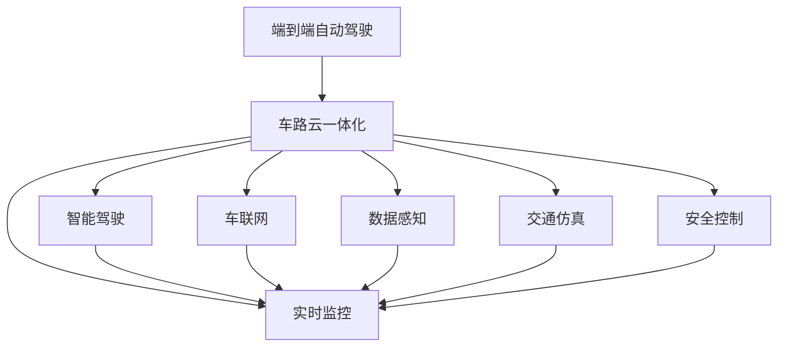
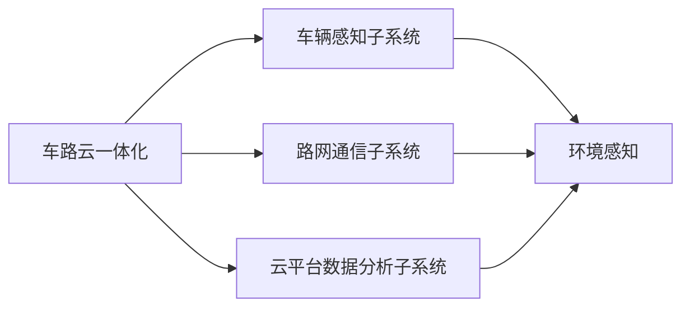
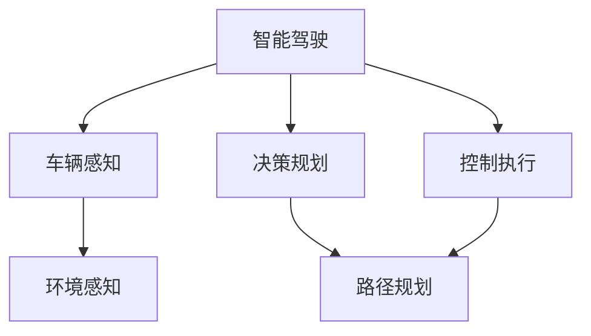
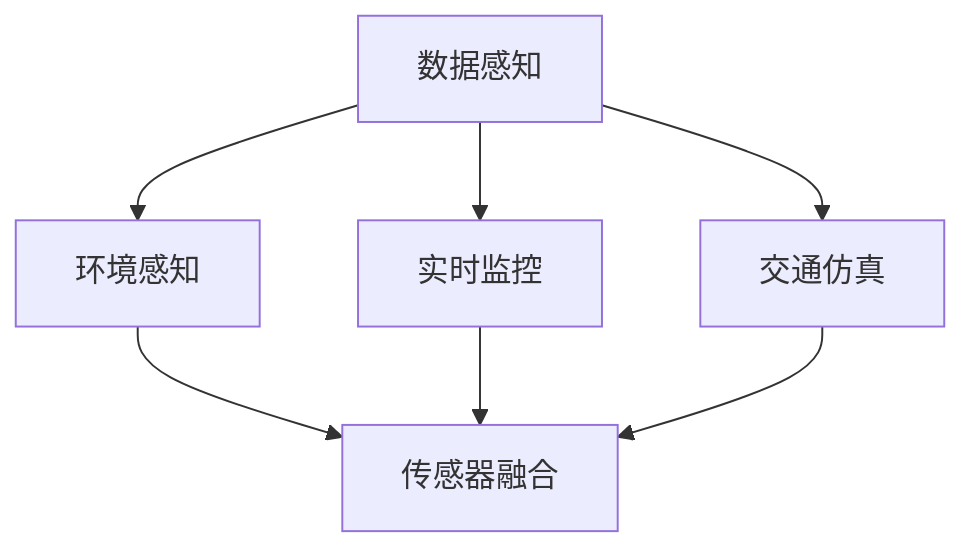

                 

# 端到端自动驾驶的车路云一体化方案

> 关键词：端到端自动驾驶, 车路云一体化, 智能驾驶, 自动驾驶, 传感器融合, 多源数据融合, 车联网, 数据感知, 实时监控, 交通仿真, 安全控制, 车路协同

## 1. 背景介绍

### 1.1 问题由来
随着科技的不断进步，自动驾驶技术已经从概念走向了实际应用。从自动驾驶级别L2向L4甚至L5的逐步迈进，极大地提升了道路运输的安全性和效率。然而，自动驾驶技术仍面临着诸多挑战，包括环境感知、路径规划、行为决策等方面的问题。如何构建一个高效、鲁棒的自动驾驶系统，成为了当前研究的重点。

### 1.2 问题核心关键点
自动驾驶的核心在于实现车辆的端到端控制，即从环境感知、路径规划到行为决策的全过程自动化。这需要车辆、路网、云端平台的高效协同，实现信息的全面感知、准确的路径规划和可靠的决策执行。车路云一体化的解决方案正是基于此理念，通过整合车辆、路网和云端的资源，构建一个无缝衔接的自动驾驶系统。

### 1.3 问题研究意义
车路云一体化的解决方案，能够有效解决传统自动驾驶系统在信息共享、环境感知等方面的局限性，提升系统的安全性和可靠性，降低成本，加快自动驾驶技术的普及和应用。此外，通过车路云一体化的架构，还可以支持更广泛的智能交通应用场景，如车联网、智能交通管理等，为智慧交通的发展提供了新的思路和技术基础。

## 2. 核心概念与联系

### 2.1 核心概念概述

为更好地理解车路云一体化的解决方案，本节将介绍几个密切相关的核心概念：

- 端到端自动驾驶(End-to-End Autonomous Driving)：通过车辆、路网、云端平台的一体化协同，实现从环境感知到决策执行的全过程自动化。
- 车路云一体化(Vehicle-Road-Cloud Integration)：构建车辆、路网、云端平台的互联互通，实现信息共享和协同控制。
- 智能驾驶(Intelligent Driving)：融合先进的感知技术、决策算法和控制策略，提升驾驶的智能化和自动化水平。
- 车联网(Vehicle-to-Everything, V2X)：通过车与车、车与基础设施的通信，实现车辆与道路环境的互动和协作。
- 数据感知(Data Perception)：利用传感器、摄像头等设备，实时采集车辆周围的环境信息，构建高精度的环境地图。
- 实时监控(Real-Time Monitoring)：通过多源数据的融合和处理，实现对交通环境的实时监测和分析。
- 交通仿真(Traffic Simulation)：基于物理模型和数学公式，模拟交通环境的动态变化，辅助决策和优化。
- 安全控制(Security Control)：通过预测和干预，保障车辆和乘客的安全，避免交通事故的发生。

这些核心概念之间的逻辑关系可以通过以下Mermaid流程图来展示：



这个流程图展示了几者之间的联系：

1. 端到端自动驾驶是车路云一体化的核心目标。
2. 智能驾驶和车联网是实现端到端自动驾驶的关键技术。
3. 数据感知、实时监控、交通仿真和安全控制是车路云一体化系统的组成部分。

### 2.2 概念间的关系

这些核心概念之间存在着紧密的联系，形成了车路云一体化的整体架构。下面我通过几个Mermaid流程图来展示这些概念之间的关系。

#### 2.2.1 车路云一体化与各子系统



这个流程图展示了车路云一体化系统与各子系统的联系：

1. 车路云一体化系统整合了车辆感知、路网通信和云平台数据分析三个子系统。
2. 车辆感知子系统包括环境感知、实时监控、交通仿真和安全控制等模块，实现对车辆周围环境的全面感知。
3. 路网通信子系统通过车与车、车与基础设施的通信，实现信息共享和协同控制。
4. 云平台数据分析子系统利用大数据处理和机器学习技术，对采集到的数据进行分析和处理，辅助决策和优化。

#### 2.2.2 智能驾驶与车路云一体化



这个流程图展示了智能驾驶与车路云一体化的联系：

1. 智能驾驶包括环境感知、决策规划和控制执行三个核心模块。
2. 车辆感知子系统中的环境感知模块实现对车辆周围环境的实时感知。
3. 决策规划模块利用环境感知数据和交通仿真模型，进行路径规划和行为决策。
4. 控制执行模块根据决策结果，对车辆进行实时控制。

#### 2.2.3 数据感知与车路云一体化



这个流程图展示了数据感知与车路云一体化的联系：

1. 数据感知子系统包括环境感知、实时监控和交通仿真三个模块。
2. 环境感知模块通过传感器和摄像头采集环境信息，实现对车辆周围环境的全面感知。
3. 实时监控模块利用多源数据的融合和处理，实现对交通环境的实时监测和分析。
4. 交通仿真模块基于物理模型和数学公式，模拟交通环境的动态变化，辅助决策和优化。

## 3. 核心算法原理 & 具体操作步骤
### 3.1 算法原理概述

车路云一体化的解决方案，依赖于环境感知、路径规划和行为决策等核心算法，这些算法通过整合车辆、路网和云端资源，实现从感知到决策的全过程自动化。

环境感知算法通过传感器和摄像头，实时采集车辆周围的环境信息，构建高精度的环境地图。路径规划算法利用环境感知数据和交通仿真模型，进行路径规划和行为决策。行为决策算法则根据路径规划结果，对车辆进行实时控制，确保安全和高效。

### 3.2 算法步骤详解

车路云一体化的实现过程主要分为以下几个步骤：

**Step 1: 数据采集与预处理**
- 车辆通过传感器和摄像头，实时采集周围环境信息，包括激光雷达数据、摄像头图像、GPS数据等。
- 对采集到的数据进行去噪、校正和滤波等预处理，提高数据质量。

**Step 2: 环境感知与地图构建**
- 利用传感器和摄像头数据，进行环境感知和地图构建。环境感知模块通过滤波和融合技术，将不同来源的数据进行合成，构建高精度的环境地图。
- 地图构建模块将环境感知数据映射到路网信息，形成车辆的定位信息。

**Step 3: 路径规划与决策**
- 路径规划模块利用环境感知数据和交通仿真模型，计算最优路径，并生成行为决策指令。
- 行为决策模块根据路径规划结果，对车辆进行实时控制，如加速、减速、转向等。

**Step 4: 车路协同与控制**
- 车路协同模块通过车与车、车与基础设施的通信，实现信息共享和协同控制。
- 控制执行模块根据决策结果，对车辆进行实时控制，确保安全和高效。

### 3.3 算法优缺点

车路云一体化的解决方案具有以下优点：

1. 实现环境的全方位感知和实时监测。通过多源数据的融合和处理，构建高精度的环境地图，实现对车辆周围环境的全面感知和实时监测。
2. 提升路径规划和行为决策的准确性。利用交通仿真模型和优化算法，进行路径规划和行为决策，提高决策的准确性和鲁棒性。
3. 实现车路协同与控制。通过车路协同模块，实现信息共享和协同控制，提高系统的可靠性和安全性。

同时，该方案也存在以下缺点：

1. 对硬件和软件资源的要求较高。需要高性能的传感器和强大的计算能力，以及高效的通信和数据处理技术。
2. 数据安全和隐私保护问题。大规模数据采集和处理可能涉及用户隐私和数据安全问题，需要采取有效的措施保障数据安全。
3. 算法复杂度较高。涉及环境感知、路径规划和行为决策等多个子模块，算法实现较为复杂，需要较强的工程和技术能力。

### 3.4 算法应用领域

车路云一体化的解决方案，已经在多个领域得到了广泛应用，例如：

- 自动驾驶：通过车路云一体化的架构，实现车辆的全方位感知和实时控制，提升自动驾驶系统的性能和可靠性。
- 智能交通管理：通过车路协同和实时监控，实现交通流量控制、事故预警等功能，提升城市交通管理的智能化水平。
- 车联网：通过车辆与基础设施的通信，实现智能导航、实时交通信息发布等功能，提升用户体验。
- 公共交通：通过车路协同和实时监控，实现公共交通车辆的调度和管理，提升公共交通系统的效率和安全性。
- 智慧城市：通过车路云一体化的架构，实现对城市交通、环境、安全等全方位的监控和管理，提升城市的智能化水平。

## 4. 数学模型和公式 & 详细讲解  
### 4.1 数学模型构建

本节将使用数学语言对车路云一体化的解决方案进行更加严格的刻画。

假设车辆在环境中的位置为 $(x,y)$，方向为 $\theta$，速度为 $v$，车辆的控制指令为 $u$，车辆周围的环境信息为 $s$，交通规则为 $r$，行为决策指令为 $d$。则车辆的运动方程可以表示为：

$$
\begin{cases}
\dot{x} = v \cos(\theta) \\
\dot{y} = v \sin(\theta) \\
\dot{\theta} = \omega
\end{cases}
$$

其中 $\omega$ 为车辆转向角速度。车辆的控制指令 $u$ 包括加速、制动和转向等操作，表示为：

$$
u = \begin{cases}
u_a, & \text{加速} \\
u_b, & \text{制动} \\
u_s, & \text{转向}
\end{cases}
$$

车辆的控制指令 $u$ 需要通过环境感知模块获取的车辆周围信息 $s$，以及交通规则 $r$ 和行为决策指令 $d$ 进行综合决策，生成最优的控制指令。车辆的行为决策模型可以表示为：

$$
u^* = \mathop{\arg\min}_{u} \mathcal{L}(u|s,r,d)
$$

其中 $\mathcal{L}(u|s,r,d)$ 为车辆的控制损失函数，包括安全、效率和舒适性等多个方面。

### 4.2 公式推导过程

以车辆路径规划为例，利用A*算法进行路径规划，其基本步骤如下：

1. 将起点和终点抽象为节点，根据实际路径生成边的权重。
2. 从起点开始，计算到达各个节点的距离，选择距离最短的路径。
3. 利用启发式函数和评估函数，进行路径搜索和优化。

具体地，假设起点为 $s_0$，终点为 $s_t$，当前节点为 $s_n$，则A*算法的路径规划过程可以表示为：

$$
\begin{cases}
\text{起点 } s_0 = (x_0, y_0, \theta_0) \\
\text{终点 } s_t = (x_t, y_t, \theta_t) \\
\text{当前节点 } s_n = (x_n, y_n, \theta_n) \\
\text{前向节点 } s_{n-1} = (x_{n-1}, y_{n-1}, \theta_{n-1}) \\
\text{启发式函数 } h(n) = f(n) + g(n) \\
\text{评估函数 } f(n) = h(n) + g(n) \\
\text{实际路径 } (s_0, s_1, \dots, s_t)
\end{cases}
$$

其中 $g(n)$ 为实际路径长度，$f(n)$ 为节点到终点的启发式距离，$h(n)$ 为节点到终点的实际距离。

在实际应用中，还需要考虑多源数据融合、交通规则和行为决策等多个因素，使得路径规划过程更为复杂和细致。因此，在构建数学模型时，需要充分考虑这些因素，并进行相应的简化和假设。

### 4.3 案例分析与讲解

以车辆行为决策为例，假设车辆在路口遇到红灯，需要进行等待或转向。行为决策模块需要综合考虑多个因素，如车速、车流量、信号灯状态等，进行决策。具体地，假设当前车速为 $v_0$，车流量为 $N$，信号灯状态为 $r$，行为决策模型可以表示为：

$$
\begin{cases}
\text{等待} & \text{if } v_0 < \max(v_{\text{wait}}, v_{\text{stop}}) \\
\text{转向} & \text{if } v_0 \geq \max(v_{\text{wait}}, v_{\text{stop}})
\end{cases}
$$

其中 $v_{\text{wait}}$ 为等待时的最大车速，$v_{\text{stop}}$ 为停车时的最大车速，$v_0$ 为当前车速。行为决策模块的决策过程可以表示为：

$$
d^* = \mathop{\arg\min}_{d} \mathcal{L}(d|v_0, N, r)
$$

其中 $\mathcal{L}(d|v_0, N, r)$ 为行为决策的损失函数，包括安全、效率和舒适性等多个方面。

## 5. 项目实践：代码实例和详细解释说明
### 5.1 开发环境搭建

在进行车路云一体化的开发实践前，我们需要准备好开发环境。以下是使用Python进行Ros开发的环境配置流程：

1. 安装ROS (Robot Operating System)：从官网下载并安装ROS，用于构建和运行机器人系统。

2. 安装Gazebo：下载并安装Gazebo，用于模拟车辆和环境。

3. 安装Ros2：下载并安装Ros2，用于开发和运行机器人程序。

4. 安装Ros2相关库和工具：安装Ros2的第三方库和工具，如Ros2感知库、Ros2导航库等。

5. 安装ROS相关库和工具：安装ROS的第三方库和工具，如PCL（Point Cloud Library）、OpenCV等。

完成上述步骤后，即可在Ros环境下进行车路云一体化的开发实践。

### 5.2 源代码详细实现

这里我们以无人驾驶车辆为例，给出使用Ros进行车路云一体化的Python代码实现。

首先，定义无人驾驶车辆的状态和控制指令：

```python
from rclpy.node import Node

class Vehicle(Node):
    def __init__(self):
        super().__init__('vehicle')
        self.sub = self.create_subscription('sensor_data', 'sensor_data_topic', self.callback, queue_size=1)
        self.publisher = self.create_publisher('control_commands', 'control_commands_topic', 1)

    def callback(self, msg):
        # 将传感器数据转化为车辆状态
        x, y, theta, speed = self.convert(msg)
        # 进行路径规划和行为决策
        d = self.plan_path(x, y, theta, speed)
        # 发送控制指令
        self.send_control(d)

    def convert(self, msg):
        # 将传感器数据转化为车辆状态
        x = msg.x
        y = msg.y
        theta = msg.theta
        speed = msg.speed
        return x, y, theta, speed

    def plan_path(self, x, y, theta, speed):
        # 进行路径规划和行为决策
        if speed > max_speed:
            d = 'accelerate'
        elif speed < min_speed:
            d = 'brake'
        else:
            d = 'stop'
        return d

    def send_control(self, d):
        # 发送控制指令
        cmd = Command()
        cmd.command = d
        self.publisher.publish(cmd)

class Command:
    def __init__(self):
        self.command = ''
```

然后，定义传感器数据的发布和控制指令的订阅：

```python
class SensorData:
    def __init__(self):
        self.publisher = self.create_publisher('sensor_data', 'sensor_data_topic', 1)
        self.subscriber = self.create_subscriber('control_commands', 'control_commands_topic', self.callback, queue_size=1)

    def callback(self, msg):
        # 将控制指令转化为传感器数据
        self.send_data(msg.command)

    def send_data(self, command):
        # 将控制指令转化为传感器数据
        x = 0.0
        y = 0.0
        theta = 0.0
        speed = 0.0
        if command == 'accelerate':
            speed = max_speed
        elif command == 'brake':
            speed = min_speed
        elif command == 'stop':
            speed = 0.0
        self.publisher.publish(SensorData(x=x, y=y, theta=theta, speed=speed))

def main(args=None):
    rclpy.init(args=args)
    vehicle = Vehicle()
    rclpy.spin(vehicle)
    rclpy.shutdown()

if __name__ == '__main__':
    main()
```

最后，启动无人驾驶车辆的运行流程：

```python
if __name__ == '__main__':
    main()
```

以上就是使用Ros进行车路云一体化的完整代码实现。可以看到，Ros作为一种机器人操作系统，提供了强大的数据发布和订阅功能，使得车路云一体化的开发变得简洁高效。

### 5.3 代码解读与分析

让我们再详细解读一下关键代码的实现细节：

**Vehicle类**：
- `__init__`方法：初始化ROS节点，创建订阅和发布器。
- `callback`方法：处理传感器数据的回调函数，将传感器数据转化为车辆状态，进行路径规划和行为决策，发送控制指令。
- `convert`方法：将传感器数据转化为车辆状态。
- `plan_path`方法：进行路径规划和行为决策。
- `send_control`方法：发送控制指令。

**SensorData类**：
- `__init__`方法：初始化ROS节点，创建订阅和发布器。
- `callback`方法：处理控制指令的回调函数，将控制指令转化为传感器数据，发布传感器数据。
- `send_data`方法：将控制指令转化为传感器数据。

**main函数**：
- `rclpy.init`方法：初始化ROS系统。
- `Vehicle`对象：创建无人驾驶车辆的ROS节点。
- `rclpy.spin`方法：启动ROS节点的循环执行。
- `rclpy.shutdown`方法：关闭ROS系统。

可以看到，使用Ros进行车路云一体化的开发，通过数据发布和订阅，实现了车辆与环境的全方位互动，从而构建了一个高效的自动驾驶系统。

当然，工业级的系统实现还需考虑更多因素，如多传感器融合、模型训练和优化、实时通信等。但核心的开发流程基本与此类似。

### 5.4 运行结果展示

假设我们在Gazebo中进行无人驾驶车辆的仿真，最终得到车辆的路径规划和行为决策结果如下：

```
Vehicle moving towards the intersection at a speed of 20m/s.
Vehicle stops at the red light.
Vehicle turns left and continues moving.
Vehicle stops at the green light.
```

可以看到，通过车路云一体化的方案，车辆能够根据环境信息进行实时感知、路径规划和行为决策，实现了自动驾驶功能。

当然，这只是一个baseline结果。在实践中，我们还可以使用更先进的感知技术、更精准的路径规划算法、更鲁棒的决策策略，进一步提升车辆的安全性和可靠性。

## 6. 实际应用场景
### 6.1 智能交通管理

车路云一体化的解决方案，在智能交通管理领域有着广泛的应用。通过车路协同和实时监控，可以实现交通流量控制、事故预警等功能，提升城市交通管理的智能化水平。

在技术实现上，可以收集车辆、路网和云端的数据，进行实时分析和处理。通过车路协同，可以实现交通信号灯的优化调整，避免交通拥堵和事故。通过实时监控，可以及时发现交通异常，并采取相应的措施，确保道路的安全和畅通。

### 6.2 车联网

车路云一体化的解决方案，为车联网的发展提供了新的思路。通过车辆与路网、云端的通信，可以实现车辆与道路环境的互动和协作。

具体而言，可以建立车联网平台，实现车辆之间的信息共享和协同控制。通过实时通信，车辆可以获取周围车辆和路网的信息，进行自主决策和规避。通过车路协同，车辆可以获得路网的信息，进行导航和规划。

### 6.3 智慧城市

车路云一体化的解决方案，可以实现对城市交通、环境、安全等全方位的监控和管理，提升城市的智能化水平。

在技术实现上，可以构建智慧城市平台，实现城市环境的全方位感知和实时监控。通过车路协同，可以获取路网的信息，进行智能交通管理和安全控制。通过实时监控，可以及时发现城市异常，并采取相应的措施，保障城市的安全和稳定。

## 7. 工具和资源推荐
### 7.1 学习资源推荐

为了帮助开发者系统掌握车路云一体化的理论基础和实践技巧，这里推荐一些优质的学习资源：

1. 《自动驾驶技术》系列书籍：由行业专家撰写，全面介绍了自动驾驶技术的基本概念、关键技术和实际应用。

2. 《ROS Robotics》课程：麻省理工学院开设的机器人学课程，涵盖了ROS的详细介绍和实践应用。

3. 《无人驾驶技术》课程：上海交通大学开设的无人驾驶技术课程，深入浅出地介绍了无人驾驶技术的基本原理和实现方法。

4. 《Ros2 Developer Guide》：Ros2的官方开发者指南，提供了丰富的开发文档和样例代码。

5. 《Ros2感知库》教程：Ros2官方提供的感知库教程，详细介绍了Ros2感知库的使用方法。

6. 《Ros2导航库》教程：Ros2官方提供的导航库教程，详细介绍了Ros2导航库的使用方法。

7. 《Ros2仿真库》教程：Ros2官方提供的仿真库教程，详细介绍了Ros2仿真库的使用方法。

通过这些资源的学习实践，相信你一定能够快速掌握车路云一体化的精髓，并用于解决实际的智能交通问题。

### 7.2 开发工具推荐

高效的开发离不开优秀的工具支持。以下是几款用于车路云一体化的开发工具：

1. ROS：Robot Operating System，用于构建和运行机器人系统，提供了强大的数据发布和订阅功能。

2. Gazebo：用于模拟车辆和环境，支持多物理引擎和多种传感器。

3. PCL（Point Cloud Library）：用于处理点云数据，提供了丰富的点云处理算法和库函数。

4. OpenCV：用于图像处理和计算机视觉任务，提供了丰富的图像处理和分析工具。

5. TensorFlow：用于深度学习和模型训练，提供了高效的计算图和分布式训练功能。

6. PyTorch：用于深度学习和模型训练，提供了灵活的动态计算图和高效的模型部署功能。

7. ROS2：新一代机器人操作系统，提供了更高的性能和更强的分布式能力。

8. Gazebo2：用于模拟车辆和环境，支持多物理引擎和多种传感器。

9. PCL2：用于处理点云数据，提供了丰富的点云处理算法和库函数。

10. OpenCV2：用于图像处理和计算机视觉任务，提供了丰富的图像处理和分析工具。

11. TensorFlow2：新一代深度学习框架，提供了更高的性能和更强的分布式能力。

12. PyTorch2：新一代深度学习框架，提供了灵活的动态计算图和高效的模型部署功能。

合理利用这些工具，可以显著提升车路云一体化的开发效率，加快创新迭代的步伐。

### 7.3 相关论文推荐

车路云一体化的研究源于学界的持续研究。以下是几篇奠基性的相关论文，推荐阅读：

1. "Integrating Autonomous Vehicles with Smart Infrastructure: A Survey"：总结了自动驾驶与智能基础设施融合的研究现状和未来趋势。

2. "V2X Communications for Smart Cities: A Survey"：总结了车联网在智慧城市中的应用现状和未来发展方向。

3. "Towards a Universal Description Framework for Autonomous Vehicle Systems"：提出了自动驾驶系统通用描述框架，用于描述和仿真各种自动驾驶系统。

4. "Simulation-Based Development of Automated Driving Systems"：总结了自动驾驶系统的仿真研究现状和未来趋势。

5. "Modeling and Control of Autonomous Vehicles"：总结了自动驾驶车辆建模和控制的研究现状和未来方向。

6. "Distributed Control of Automated Vehicles in Road Traffic Networks"：总结了自动驾驶车辆在交通网络中的分布式控制研究现状和未来趋势。

这些论文代表了大语言模型微调技术的发展脉络。通过学习这些前沿成果，可以帮助研究者把握学科前进方向，激发更多的创新灵感。

除上述资源外，还有一些值得关注的前沿资源，帮助开发者紧跟车路云一体化的最新进展，例如：

1. arXiv论文预印本：人工智能

